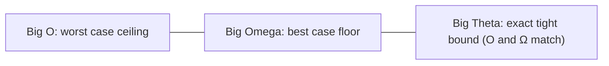
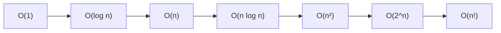
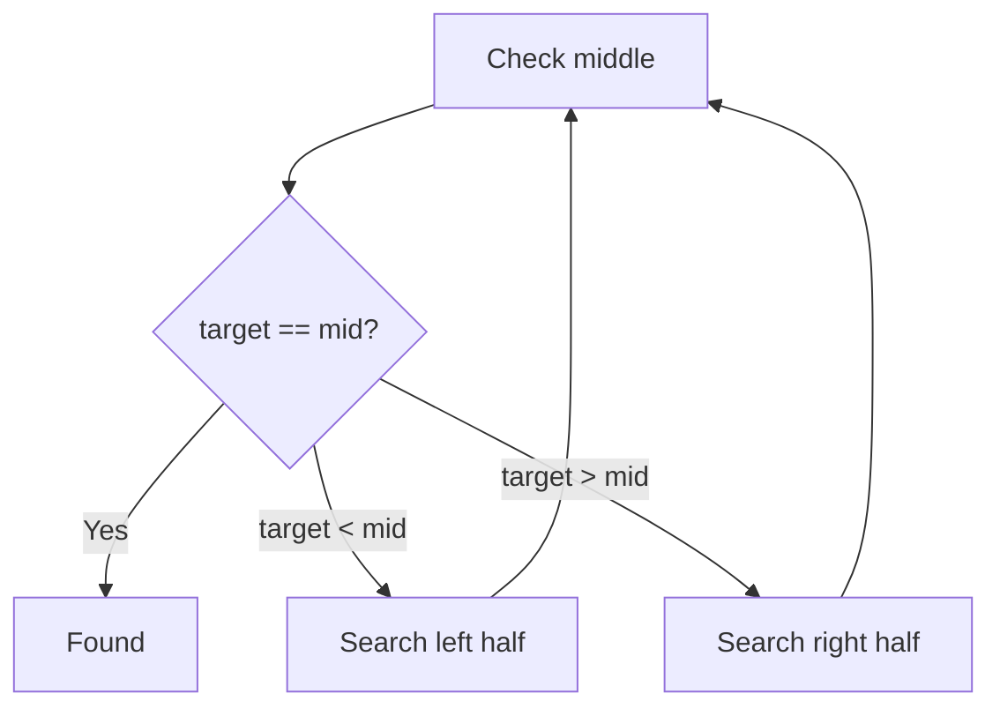
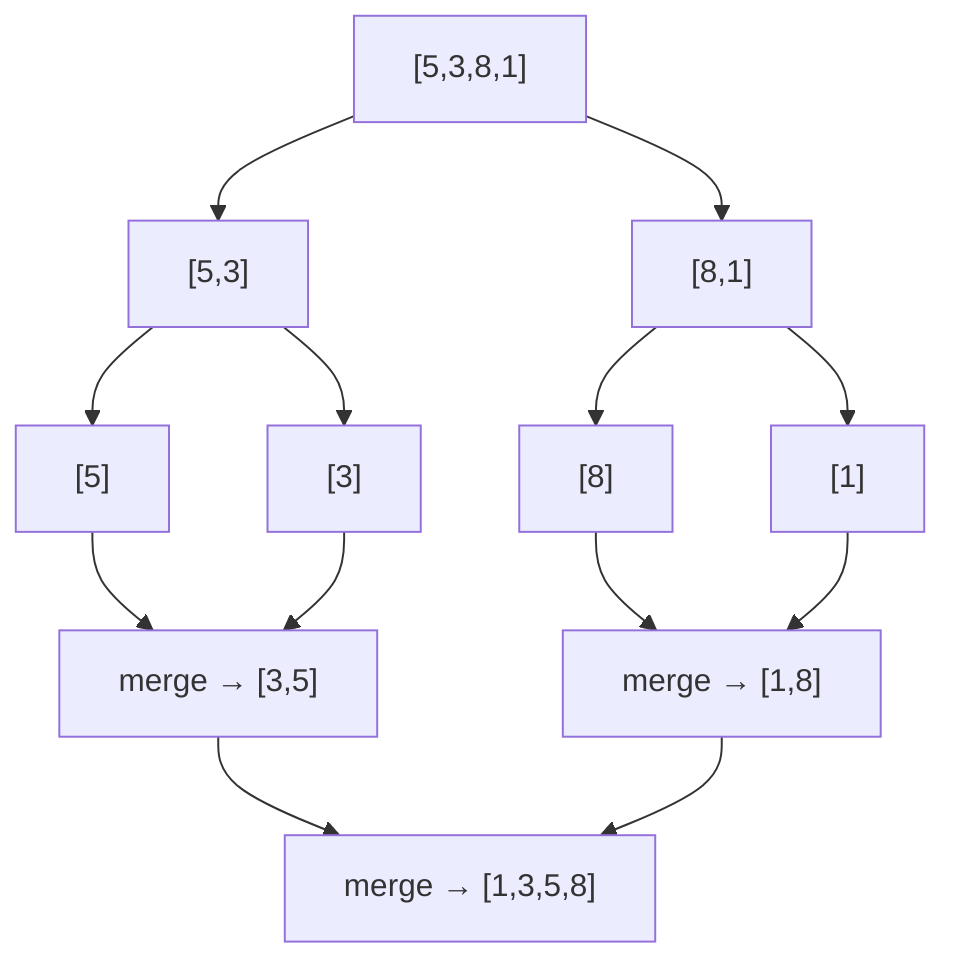
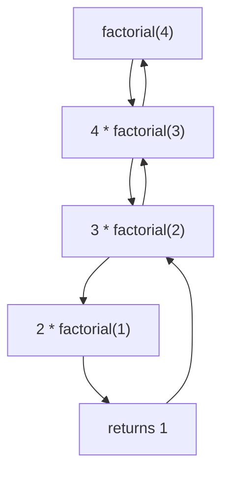
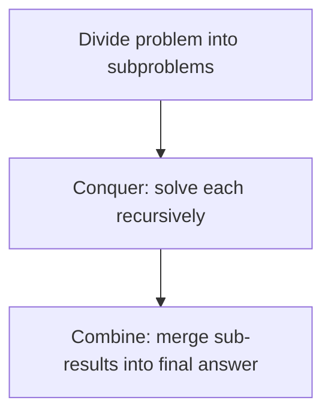
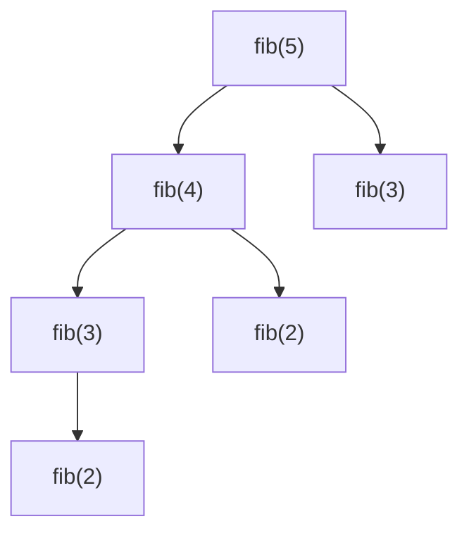

# Algorithms — Complexity, Searching, Sorting, Recursion, Greedy, DP & Graph Algorithms

!!! info "Prerequisites"
    [Arrays](arrays-deep-dive.md), [Trees](trees-deep-dive.md), [Graphs & Tries](graphs-tries-deep-dive.md).

## Part 1 — Big O, Big Ω, Big Θ

### 1.1 The Problem

You need a language-independent, hardware-independent way to describe "how does this algorithm's cost grow as the input grows?" — without benchmarking every algorithm on every machine.

### 1.2 Intuition

Big-O answers: *if I double the input size, roughly how much worse does this get?* An O(n) algorithm doubles in cost. An O(n²) algorithm quadruples. An O(log n) algorithm barely changes at all.

### 1.3 Formal Definitions

- **Big O (O)** — an *upper bound*: the algorithm never does worse than this, asymptotically.
- **Big Omega (Ω)** — a *lower bound*: the algorithm never does better than this.
- **Big Theta (Θ)** — a *tight bound*: the algorithm's growth is both O and Ω of this — i.e., this is the actual asymptotic behavior.



In casual use (interviews, most conversations), "Big O" is used loosely to mean "the tight bound," even though technically it's only an upper bound — this chapter follows that common convention except where the best/worst case genuinely differ.

### 1.4 Growth Rates, Ranked



| Notation | Name | Example from earlier chapters |
|---|---|---|
| O(1) | Constant | Array index access, hash table lookup (average) |
| O(log n) | Logarithmic | Balanced BST search, binary search |
| O(n) | Linear | Linked list search, array scan |
| O(n log n) | Linearithmic | Merge sort, quicksort (average) |
| O(n²) | Quadratic | Bubble sort, comparing every pair |
| O(2ⁿ) | Exponential | Naive recursive Fibonacci, brute-force subsets |

### 1.5 Reading Complexity From Code

```python
for i in range(n):        # O(n)
    print(i)

for i in range(n):        # O(n) outer
    for j in range(n):     # O(n) inner
        print(i, j)        # → O(n²) total

for i in range(n):
    x = arr[0]             # O(1) inside an O(n) loop → still O(n)
```

Rule of thumb: nested loops over the same input **multiply**; sequential (back-to-back) loops **add** (and adding drops the smaller term — O(n) + O(n²) simplifies to O(n²)).

---

## Part 2 — Searching

### 2.1 Linear Search — O(n)

```python
def linear_search(arr, target):
    for i, val in enumerate(arr):
        if val == target:
            return i
    return -1
```

Checks every element; makes no assumption about ordering. This is the same O(n) cost seen for array/linked-list search in earlier chapters.

### 2.2 Binary Search — O(log n)

Requires sorted input. Repeatedly halves the search space, exactly like the BST logic from the Trees chapter.

```python
def binary_search(arr, target):
    lo, hi = 0, len(arr) - 1
    while lo <= hi:
        mid = (lo + hi) // 2
        if arr[mid] == target:
            return mid
        elif arr[mid] < target:
            lo = mid + 1
        else:
            hi = mid - 1
    return -1
```



**Why O(log n):** each comparison discards half the remaining candidates, so after $k$ steps only $n / 2^k$ elements remain — solving $n/2^k = 1$ gives $k = \log_2 n$.

---

## Part 3 — Sorting

### 3.1 Bubble Sort — O(n²), the naive baseline

```python
def bubble_sort(arr):
    n = len(arr)
    for i in range(n):
        for j in range(n - i - 1):
            if arr[j] > arr[j + 1]:
                arr[j], arr[j + 1] = arr[j + 1], arr[j]
    return arr
```

Repeatedly swaps adjacent out-of-order pairs. Simple to understand, but the nested loop over the same array is exactly the O(n²) pattern from §1.5 — impractical past a few thousand elements.

### 3.2 Merge Sort — O(n log n), Divide and Conquer

```python
def merge_sort(arr):
    if len(arr) <= 1:
        return arr
    mid = len(arr) // 2
    left = merge_sort(arr[:mid])
    right = merge_sort(arr[mid:])
    return merge(left, right)

def merge(left, right):
    result = []
    i = j = 0
    while i < len(left) and j < len(right):
        if left[i] <= right[j]:
            result.append(left[i]); i += 1
        else:
            result.append(right[j]); j += 1
    result.extend(left[i:])
    result.extend(right[j:])
    return result
```



**Why O(n log n):** the array is halved $\log n$ times (the "divide"), and merging back together at each of those $\log n$ levels costs O(n) total work (the "conquer") — $O(n) \times O(\log n) = O(n \log n)$. Crucially, merge sort's worst case is *still* O(n log n) — it has no bad-input degradation, unlike quicksort below.

### 3.3 Quicksort — O(n log n) average, O(n²) worst case

```python
def quicksort(arr):
    if len(arr) <= 1:
        return arr
    pivot = arr[len(arr) // 2]
    left = [x for x in arr if x < pivot]
    mid = [x for x in arr if x == pivot]
    right = [x for x in arr if x > pivot]
    return quicksort(left) + mid + quicksort(right)
```

Picks a **pivot**, partitions everything smaller to one side and larger to the other, then recursively sorts each side. If the pivot consistently splits the array roughly in half, you get the same O(n log n) shape as merge sort — but if the pivot is consistently the smallest or largest element (e.g., already-sorted input with a naive "always pick the first element" pivot strategy), one side is empty every time, and it degrades to O(n²) — the exact same "degenerate input" failure pattern seen with unbalanced BSTs in the Trees chapter.

### 3.4 Sorting Complexity Summary

| Algorithm | Best | Average | Worst | Space |
|---|---|---|---|---|
| Bubble sort | O(n) | O(n²) | O(n²) | O(1) |
| Merge sort | O(n log n) | O(n log n) | O(n log n) | O(n) |
| Quicksort | O(n log n) | O(n log n) | O(n²) | O(log n) |

---

## Part 4 — Recursion

### 4.1 The Core Idea

A recursive function solves a problem by solving a smaller version of the *same* problem, until it reaches a **base case** simple enough to answer directly.

```python
def factorial(n):
    if n <= 1:            # base case
        return 1
    return n * factorial(n - 1)   # recursive case
```



Every recursive call pushes a new **stack frame** (directly the same mechanism from the Python Functions chapter) — this is why deep uncontrolled recursion causes a `RecursionError`/stack overflow: each call's frame consumes real memory, and Python caps recursion depth (default ~1000) specifically to catch runaway recursion before it exhausts memory.

### 4.2 Divide and Conquer — Recursion With a Pattern

Divide and conquer is recursion structured specifically as: **divide** the problem into smaller subproblems, **conquer** each recursively, **combine** the results. Merge sort (§3.2) is the canonical example.



---

## Part 5 — Greedy Algorithms

### 5.1 The Idea

A greedy algorithm builds a solution by always making the choice that looks best *right now*, never reconsidering past choices, and hoping (or proving) that local best choices add up to a global best solution.

### 5.2 Example — Coin Change (Greedy Version)

```python
def greedy_coin_change(coins, amount):
    coins = sorted(coins, reverse=True)
    count = 0
    for coin in coins:
        count += amount // coin
        amount %= coin
    return count if amount == 0 else -1

greedy_coin_change([25, 10, 5, 1], 63)   # 2x25 + 1x10 + 0x5 + 3x1 = 6 coins
```

### 5.3 The Catch — Greedy Doesn't Always Give the Optimal Answer

With coin denominations `[1, 3, 4]` and target `6`, greedy picks `4 + 1 + 1` (3 coins), but the true optimum is `3 + 3` (2 coins). Greedy is fast (usually O(n log n) for the sort, then O(n)) but **only correct when the problem has a provable "greedy-choice property"** — otherwise it silently gives a wrong (suboptimal) answer, which is why the next section, dynamic programming, exists.

---

## Part 6 — Dynamic Programming

### 6.1 The Idea

Dynamic programming (DP) solves problems by breaking them into overlapping subproblems, solving each **exactly once**, and reusing (caching) that result — trading memory for a massive reduction in redundant recomputation.

### 6.2 Motivating Example — Naive Recursive Fibonacci Is Exponential

```python
def fib_naive(n):
    if n <= 1:
        return n
    return fib_naive(n - 1) + fib_naive(n - 2)
```



Notice `fib(3)` and `fib(2)` are recomputed from scratch multiple times, and this duplication compounds — the naive version is O(2ⁿ), catastrophically slow past n≈35.

### 6.3 Memoization — Top-Down DP

```python
def fib_memo(n, cache={}):
    if n in cache:
        return cache[n]           # O(1) hash table lookup — reuses the Hash Tables chapter
    if n <= 1:
        return n
    cache[n] = fib_memo(n - 1, cache) + fib_memo(n - 2, cache)
    return cache[n]
```

Same recursive shape as before, but a hash table cache means each distinct subproblem is computed exactly once — this collapses the cost from O(2ⁿ) to O(n).

### 6.4 Tabulation — Bottom-Up DP

```python
def fib_tabulation(n):
    if n <= 1:
        return n
    table = [0] * (n + 1)
    table[1] = 1
    for i in range(2, n + 1):
        table[i] = table[i - 1] + table[i - 2]
    return table[n]
```

Builds up from the base cases iteratively instead of recursing downward — same O(n) result, no call-stack growth, often the preferred production style.


### 6.5 When to Reach for DP

The signal is: a brute-force recursive solution exists, and it recomputes the same subproblem repeatedly. If subproblems *don't* overlap, plain divide-and-conquer (§4.2) is already sufficient and DP adds nothing.

---

## Part 7 — Graph Algorithms (Beyond BFS/DFS)

### 7.1 Dijkstra's Algorithm — Shortest Path, Weighted Graph

Builds directly on the heap and graph chapters: repeatedly pop the unvisited node with the smallest known distance (a min-heap operation), relax its neighbors' distances, repeat.

```python
import heapq

def dijkstra(graph, start):
    distances = {node: float("inf") for node in graph}
    distances[start] = 0
    pq = [(0, start)]                       # (distance, node) — heap orders by distance
    while pq:
        dist, node = heapq.heappop(pq)      # O(log n) — always the current minimum
        if dist > distances[node]:
            continue
        for neighbor, weight in graph[node]:
            new_dist = dist + weight
            if new_dist < distances[neighbor]:
                distances[neighbor] = new_dist
                heapq.heappush(pq, (new_dist, neighbor))
    return distances
```

Overall complexity: O((V + E) log V) — the log V factor is the heap operations, directly inherited from the Trees/Heaps chapter.

### 7.2 Why This Matters for AI/ML Specifically

- **DP** underlies sequence alignment problems and some classical NLP algorithms (edit distance, and conceptually the beam-search style decoding used in LLM generation, Book 9).
- **Greedy decoding** is literally the name for the simplest LLM text-generation strategy (always pick the highest-probability next token) — same greedy-vs-optimal trade-off as §5.3 applies: fast, but not guaranteed to produce the overall best full sequence.
- **Graph shortest-path thinking** underlies routing/recommendation-adjacent problems and knowledge-graph traversal (Book 10).

---

## Common Errors & Debugging (All Sections)

- Off-by-one errors in binary search bounds (`lo <= hi` vs `lo < hi`) — the single most common bug in this entire chapter.
- Forgetting a base case in recursion → infinite recursion → `RecursionError`.
- Applying greedy to a problem without a proven greedy-choice property → silently wrong (not crashing) answers, the most dangerous kind of bug.
- Writing a "DP" solution that's really just memoized recursion without checking whether subproblems actually overlap — wasted complexity if they don't.

## Interview Questions

1. What's the difference between Big O, Big Ω, and Big Θ?
2. Derive why binary search is O(log n).
3. Why does merge sort guarantee O(n log n) but quicksort doesn't?
4. Walk through why naive recursive Fibonacci is O(2ⁿ) and how memoization fixes it.
5. Give an example where a greedy algorithm fails to find the optimal solution.
6. Why does Dijkstra's algorithm need a heap rather than a plain queue?

## Mastery Ladder

- [ ] L1 — I can state the complexity of the core operations from every earlier chapter
- [ ] L2 — I understand why nested loops multiply and sequential loops add
- [ ] L3 — I can implement binary search, merge sort, and greedy coin change from scratch
- [ ] L4 — I can derive the O(log n) and O(n log n) results, not just recite them
- [ ] L5 — I can convert naive exponential recursion into memoized/tabulated DP
- [ ] L6 — I can debug off-by-one search bugs and missing base cases
- [ ] L7 — I know when greedy is provably optimal vs. when it silently fails
- [ ] L8 — I choose the right algorithm family (search/sort/greedy/DP/graph) deliberately per problem
- [ ] L9 — I can answer the interview bank above cleanly
- [ ] L10 — I can connect greedy decoding and DP-style beam search directly to LLM generation (Book 9) unprompted
