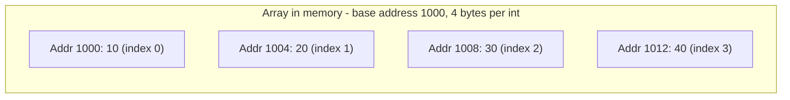
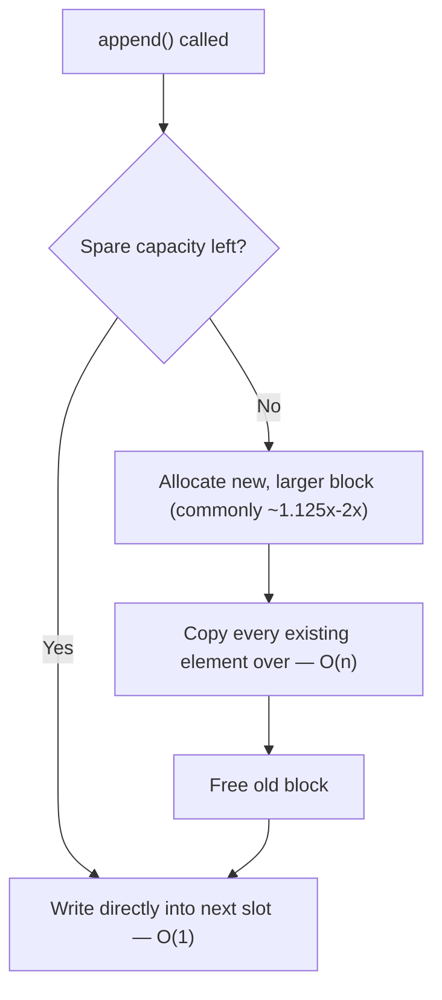
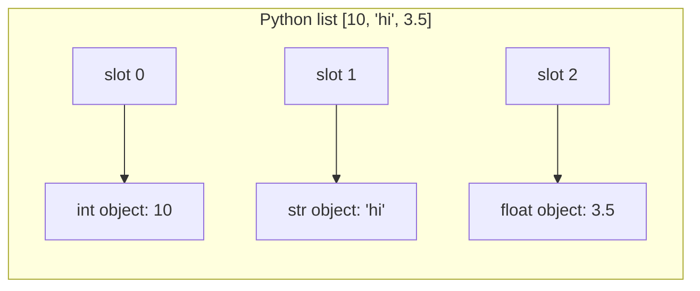
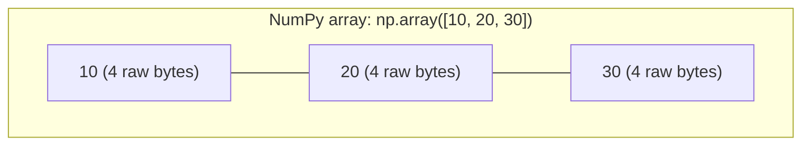

# Arrays — The Foundation of Data Structures

!!! info "Prerequisites"
    [How Computers Execute Programs](../00-computer-science/how-computers-execute-programs.md) (specifically memory addresses).

## 1. The Problem

You need to store many values of the same kind (100 exam scores, 1 million pixel values) and be able to grab any one of them instantly, without searching through the others one by one.

## 2. Intuition

Picture a street of houses, all the same size, numbered in order, standing right next to each other with no gaps. If you know house #47 is exactly 47 house-widths from house #0, you can walk straight there without checking houses #0–46 first. An array is that idea applied to memory.

## 3. Formal Definition

An array is a **contiguous block of memory** divided into equal-sized slots, where element $i$ lives at:

$$
\text{address}(i) = \text{base\_address} + i \times \text{element\_size}
$$

This single formula is *why* array access is $O(1)$ (constant time) — the CPU computes an address with one multiply and one add, no searching required.

## 4. Visual Explanation



To read index 2: `1000 + 2 * 4 = 1008` — jump straight there. No traversal.

## 5. Static Arrays vs Dynamic Arrays

A **static array** (like a C array, or NumPy's underlying buffer) has a fixed size decided at creation — resizing it means allocating an entirely new, bigger block and copying every element over.

A **dynamic array** (Python's `list`, Java's `ArrayList`) *looks* resizable because it manages this reallocation for you automatically: it over-allocates extra hidden capacity, and only triggers a full copy-and-grow when that spare capacity runs out.



This is why `list.append()` is described as **"amortized O(1)"** rather than strictly O(1): most calls are cheap, but occasionally one call pays the cost of a full copy. Averaged over many appends, the cost per append still works out to a constant.

## 6. Time Complexity Summary

| Operation | Array | Why |
|---|---|---|
| Access by index | O(1) | Direct address calculation (§3) |
| Search by value | O(n) | Must check elements one by one (no shortcut without extra structure) |
| Append at end | O(1) amortized | See §5 |
| Insert at front/middle | O(n) | Every element after the insertion point must shift over one slot |
| Delete at front/middle | O(n) | Same shifting problem, in reverse |

## 7. Implementation — A Minimal Dynamic Array From Scratch

```python
class DynamicArray:
    def __init__(self):
        self._capacity = 2
        self._size = 0
        self._data = [None] * self._capacity

    def __len__(self):
        return self._size

    def __getitem__(self, i):
        if not 0 <= i < self._size:
            raise IndexError("index out of range")
        return self._data[i]

    def append(self, value):
        if self._size == self._capacity:
            self._resize(self._capacity * 2)
        self._data[self._size] = value
        self._size += 1

    def _resize(self, new_capacity):
        new_data = [None] * new_capacity
        for i in range(self._size):
            new_data[i] = self._data[i]
        self._data = new_data
        self._capacity = new_capacity
```

This is, structurally, a simplified version of what CPython's `list` actually does internally — a raw block of pointers, a tracked size, a tracked capacity, and a doubling-style growth strategy when capacity is exceeded.

## 8. Python Lists Are Arrays of *Pointers*, Not Values

This is a critical and commonly missed detail: a Python `list` is a contiguous array — but of **references to objects**, not the raw values themselves.



That's why a Python list can hold mixed types — each slot is just a pointer, and pointers are all the same size regardless of what they point to. It's also why Python lists are slower for numeric work than NumPy arrays.

## 9. NumPy Arrays — Contiguous *Values*, Not Pointers



No pointer indirection, no per-element Python object overhead, and elements sit truly back-to-back in memory — which is exactly what lets modern CPUs process them with vectorized instructions (SIMD) and what lets NumPy hand a raw contiguous buffer straight to optimized C/BLAS routines. This is the concrete mechanism behind "NumPy is faster than a Python loop," referenced back in the Linear Regression chapter.

## 10. Edge Cases & Common Errors

```python
arr = [1, 2, 3]
print(arr[3])       # IndexError: list index out of range
print(arr[-1])       # 3 — negative indexing counts from the end
arr.insert(0, 99)    # O(n): every element shifts right by one
```

- `IndexError` — the single most common array bug, from off-by-one errors (`<=` vs `<` in a loop bound).
- Inserting/deleting at the front of a large list is a frequent hidden performance bug — looks like one line, costs O(n).

## 11. Debugging Checklist

- Unexpected slowness on repeated inserts at index 0 → you're paying O(n) per call; consider `collections.deque` (O(1) at both ends) instead.
- `IndexError` on the last iteration of a loop → check `range(len(arr))` vs `range(len(arr) + 1)`.
- Two variables seem to "share" changes unexpectedly → you copied a reference to the same list, not the list itself (`b = a` vs `b = a.copy()`; see the Python Functions chapter's memory model for why).

## 12. Real-World Usage

Every image (Book 7) is a multi-dimensional array of pixel values. Every batch fed into a neural network (Book 6) is an array (tensor). Every embedding (Book 9) is an array of floats. Mastering *this* chapter's mental model — contiguous memory, index-to-address arithmetic, and the pointer vs. raw-value distinction — is what makes tensors in later books feel obvious rather than magical.

## 13. Interview Questions

1. Why is array access O(1) but search O(n)?
2. Why is `list.append()` called "amortized" O(1) instead of just O(1)?
3. What's the real difference between a Python `list` and a NumPy array in memory?
4. Why is inserting at the front of an array O(n)?
5. When would you reach for a `deque` instead of a `list`?

## Mastery Ladder

- [ ] L1 — I can state that array access is O(1) via address arithmetic
- [ ] L2 — I understand why static arrays can't resize in place
- [ ] L3 — I can implement a dynamic array with a doubling growth strategy
- [ ] L4 — I can compute the address of element $i$ given base address and element size
- [ ] L5 — I can explain Python lists as arrays of pointers, not values
- [ ] L6 — I can diagnose an O(n)-per-call bug from front-inserts
- [ ] L7 — I can explain why NumPy arrays outperform Python lists numerically
- [ ] L8 — I choose `list` vs `deque` vs NumPy array deliberately based on access pattern
- [ ] L9 — I can answer the interview bank above cleanly
- [ ] L10 — I can connect array memory layout directly to how tensors work in Book 6/9
