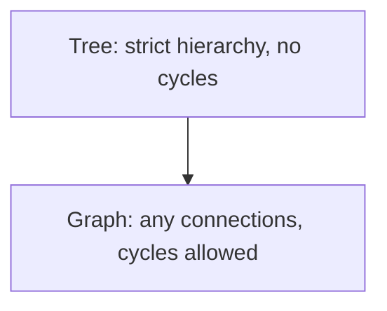
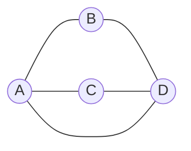
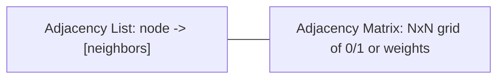
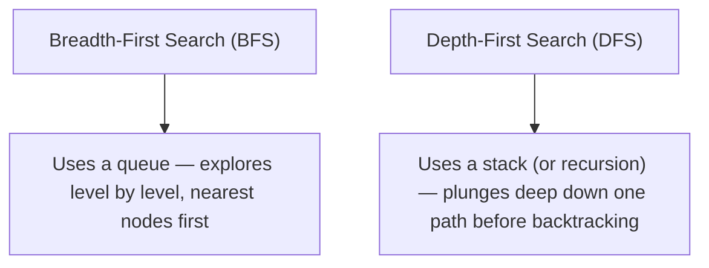
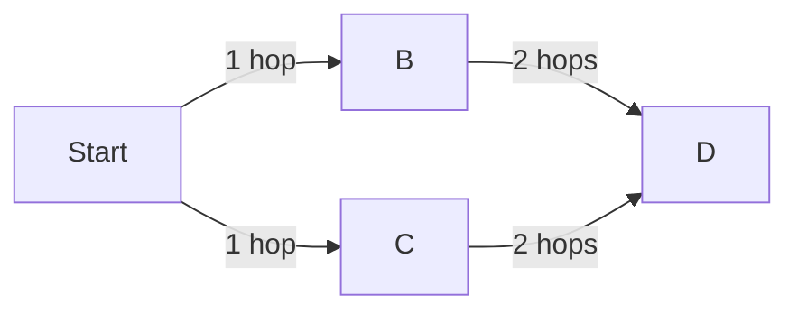
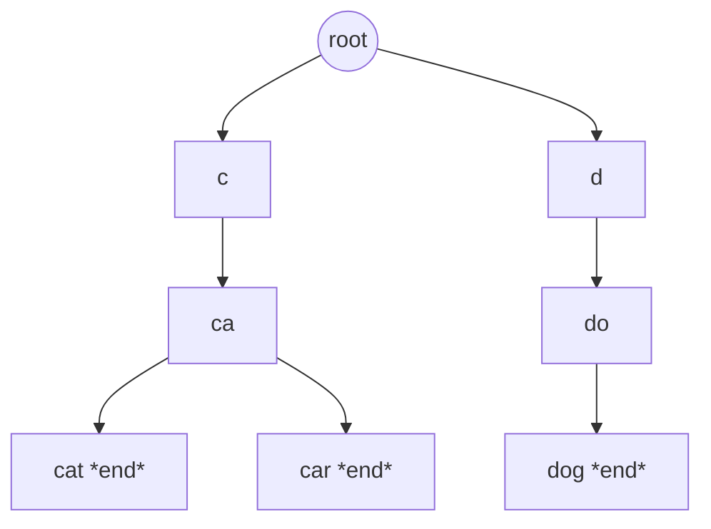

# Graphs & Tries

!!! info "Prerequisites"
    [Trees](trees-deep-dive.md), [Hash Tables & Sets](hash-tables-sets-deep-dive.md).

## 1. The Problem

Trees only allow one parent per node — a strict hierarchy. Real relationships are often messier: web pages link to each other arbitrarily, people follow each other in tangled webs, cities connect via roads that don't form a hierarchy at all. You need a structure with no restriction on how nodes connect.

## 2. Intuition

A tree is actually just a special, restricted kind of graph — one with no cycles and exactly one path between any two nodes. A **graph** drops all those restrictions: any node can connect to any other node, in any pattern, including cycles.



## 3. Formal Definition

A graph $G = (V, E)$ consists of a set of **vertices** (nodes) $V$ and a set of **edges** (connections) $E$ between pairs of vertices.



- **Directed graph**: edges have a direction (A → B doesn't imply B → A) — e.g., "follows" on social media, hyperlinks.
- **Undirected graph**: edges go both ways — e.g., "is friends with" (mutual), road connections.
- **Weighted graph**: edges carry a cost/distance/strength — e.g., road distances, similarity scores.

## 4. Representing a Graph in Code

Two standard representations, with a real trade-off between them:



```python
# Adjacency list — a dict of sets/lists, one entry per node
graph = {
    "A": ["B", "C"],
    "B": ["D"],
    "C": ["D"],
    "D": ["A"],
}

# Adjacency matrix — an N x N array; matrix[i][j] = 1 if edge exists
#      A  B  C  D
# A  [ 0, 1, 1, 0 ]
# B  [ 0, 0, 0, 1 ]
# C  [ 0, 0, 0, 1 ]
# D  [ 1, 0, 0, 0 ]
```

| | Adjacency List | Adjacency Matrix |
|---|---|---|
| Space | O(V + E) — efficient for sparse graphs | O(V²) — wasteful if most nodes aren't connected |
| "Are X and Y connected?" | O(degree of X) | O(1) — direct index lookup |
| Iterate all neighbors of X | O(degree of X) | O(V) — must scan the whole row |

Most real-world graphs (social networks, web links) are **sparse** (each node connects to relatively few others out of millions), so adjacency lists dominate in practice.

## 5. Traversal — BFS and DFS

These are the two fundamental ways to visit every reachable node, and they directly reuse the **queue** and **stack** from the earlier chapter.



```python
from collections import deque

def bfs(graph, start):
    visited = {start}
    queue = deque([start])
    order = []
    while queue:
        node = queue.popleft()      # FIFO — the queue chapter's O(1) dequeue
        order.append(node)
        for neighbor in graph[node]:
            if neighbor not in visited:   # O(1) average — the set/hash-table chapter
                visited.add(neighbor)
                queue.append(node if False else neighbor)
    return order

def dfs(graph, start, visited=None, order=None):
    if visited is None:
        visited, order = set(), []
    visited.add(start)
    order.append(start)
    for neighbor in graph[start]:
        if neighbor not in visited:
            dfs(graph, neighbor, visited, order)
    return order
```

Note how three earlier chapters combine here: the **queue** (BFS ordering), the **stack**/recursion (DFS ordering), and the **set** (O(1) average "have I visited this?" check, avoiding infinite loops on cyclic graphs). This is a good example of why the earlier "boring" data-structure chapters matter — graph algorithms are mostly composition of them.

## 6. Why BFS Finds the Shortest Path (Unweighted)

Because BFS explores strictly level-by-level (everything one hop away, then everything two hops away, and so on), the *first* time it reaches a target node is guaranteed to be via the fewest possible edges. DFS gives no such guarantee — it might stumble onto a long, winding path to the target long before finding a shorter one.



BFS visits `D` for the first time via a shortest 2-hop path — it can't discover a 3-hop path first, because all 2-hop nodes are exhausted before 3-hop nodes are even queued.

## 7. Weighted Graphs — Dijkstra's Algorithm (Preview)

When edges carry different costs, "fewest edges" (BFS) isn't the same as "cheapest total cost." **Dijkstra's algorithm** solves shortest-cost-path by repeatedly picking the unvisited node with the smallest known distance so far — which is exactly the "always retrieve the minimum instantly" job the **heap** chapter was built for. (Full algorithm covered in Book 0 Algorithms.)

## 8. Tries — A Tree Specialized for Prefixes

A **trie** (prefix tree) is a tree where each edge represents one character, and any path from the root spells out a string prefix.



```python
class TrieNode:
    def __init__(self):
        self.children = {}      # char -> TrieNode, itself a hash table
        self.is_end_of_word = False

class Trie:
    def __init__(self):
        self.root = TrieNode()

    def insert(self, word):
        node = self.root
        for ch in word:
            if ch not in node.children:
                node.children[ch] = TrieNode()
            node = node.children[ch]
        node.is_end_of_word = True

    def starts_with(self, prefix):
        node = self.root
        for ch in prefix:
            if ch not in node.children:
                return False
            node = node.children[ch]
        return True   # every stored word sharing this prefix is reachable from here
```

## 9. Why Tries Beat a Plain List/Set for Prefix Search

Checking "does any word start with 'ca'?" against a `set` of words means checking every single word's prefix — O(n × word length). A trie answers the same question by walking exactly `len(prefix)` steps from the root, regardless of how many words are stored: **O(prefix length)**, independent of the dataset size.

## 10. Time Complexity Summary

| Operation | Adjacency List Graph | Adjacency Matrix Graph | Trie |
|---|---|---|---|
| Add edge / word | O(1) | O(1) | O(word length) |
| Check connection / prefix | O(degree) | O(1) | O(prefix length) |
| Traverse all neighbors | O(degree) | O(V) | O(children at node) |
| Space | O(V + E) | O(V²) | O(total characters stored) |

## 11. Common Errors & Debugging

- Running DFS/BFS on a graph with cycles without tracking `visited` → infinite loop.
- Using an adjacency matrix for a huge, sparse graph (e.g., millions of users, each following a handful of others) → wastes enormous memory; use an adjacency list.
- Reaching for a `set` of full strings when you actually need prefix queries repeatedly → a trie is the right tool, not a workaround.

## 12. Real-World Usage

Search-engine autocomplete and spell-checkers (tries); social network "degrees of connection" and web crawling (BFS/DFS on graphs); route planning (Dijkstra); and — directly ahead in this program — **knowledge graphs** in Generative AI (Book 10) and **attention** in Transformers (Book 9), which is literally a fully-connected weighted graph between tokens, recomputed at every layer.

## 13. Interview Questions

1. Why is a tree a special case of a graph?
2. When would you choose an adjacency matrix over an adjacency list, and vice versa?
3. Why does BFS guarantee the shortest path in an unweighted graph but DFS doesn't?
4. Why is a heap the natural fit for Dijkstra's algorithm?
5. Why is a trie faster than a hash set for prefix queries specifically?

## Mastery Ladder

- [ ] L1 — I can define a graph as vertices + edges and name directed/undirected/weighted
- [ ] L2 — I understand adjacency list vs matrix trade-offs
- [ ] L3 — I can implement BFS and DFS from scratch
- [ ] L4 — N/A
- [ ] L5 — I can explain why BFS uses a queue and DFS uses a stack
- [ ] L6 — I can debug an infinite loop from a missing visited-set
- [ ] L7 — I understand why Dijkstra needs a heap, not a plain queue
- [ ] L8 — I choose graph representation and traversal deliberately based on the problem
- [ ] L9 — I can answer the interview bank above cleanly
- [ ] L10 — I can connect graphs to attention (Book 9) and tries to autocomplete/tokenization unprompted
