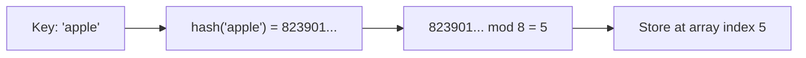
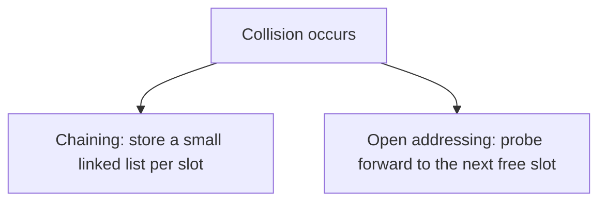
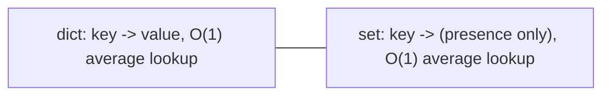

# Hash Tables & Sets

!!! info "Prerequisites"
    [Arrays](arrays-deep-dive.md).

## 1. The Problem

Arrays and linked lists both need O(n) to search by value — you must check elements one by one. What if you want to look something up by *key* almost instantly, regardless of how many items you're storing?

## 2. Intuition

Imagine a library where, instead of searching shelf by shelf, you could compute exactly which shelf a book belongs on directly from its title, in one calculation, and go straight there. A hash table applies this trick to arbitrary data using a **hash function**.

## 3. Formal Definition

A hash table stores key-value pairs. To find where a key lives:

$$
\text{slot} = \text{hash}(\text{key}) \bmod \text{table\_size}
$$

`hash(key)` converts the key into a large integer (deterministically — same key always produces the same number). Taking that number modulo the table's size squeezes it into a valid array index. The value is then stored (or retrieved) at that index in an underlying **array** — this is why hash tables are built *on top of* the arrays chapter, not a separate primitive.



## 4. Why This Gives O(1) Average Lookup

Because computing a hash and taking a modulo is constant-time work regardless of how many keys are already stored, both insertion and lookup are **O(1) on average** — a dramatic improvement over an array's O(n) linear search. This is the single most important idea in this chapter.

## 5. Collisions — Two Keys, One Slot

Different keys can hash to the same slot (a "collision") — with enough keys and a finite table size, this is mathematically guaranteed eventually (the pigeonhole principle). Two common resolution strategies:



- **Chaining**: each array slot holds a linked list (or small array) of all key-value pairs that hashed there. Lookup becomes "compute the slot, then linear-search the short list in that slot" — still effectively O(1) if collisions stay rare.
- **Open addressing**: on collision, keep probing subsequent slots (linearly, or via a second hash) until a free one is found. This is what CPython's `dict` actually uses internally.

## 6. Why Average Case, Not Worst Case

If the hash function is poor, or the table gets too full, many keys collide into the same slot(s), degrading lookup toward O(n) in the worst case. This is why hash tables:

- Use carefully designed hash functions that spread keys evenly.
- **Resize (rehash)** once they get too full (a "load factor" threshold, often ~2/3), redistributing every existing entry into a larger table — conceptually similar to the dynamic array resize from the Arrays chapter, just more expensive because every key must be re-hashed into new slot positions, not just copied.

## 7. Implementation From Scratch (Chaining)

```python
class HashTable:
    def __init__(self, capacity=8):
        self._capacity = capacity
        self._buckets = [[] for _ in range(capacity)]

    def _slot(self, key):
        return hash(key) % self._capacity

    def put(self, key, value):
        bucket = self._buckets[self._slot(key)]
        for i, (k, v) in enumerate(bucket):
            if k == key:
                bucket[i] = (key, value)   # overwrite existing
                return
        bucket.append((key, value))

    def get(self, key):
        bucket = self._buckets[self._slot(key)]
        for k, v in bucket:
            if k == key:
                return v
        raise KeyError(key)
```

This mirrors, at a simplified level, what happens when you write `d["apple"] = 5` or `d["apple"]` on a real Python `dict`.

## 8. Why Keys Must Be Hashable (and Immutable in Practice)

```python
d = {[1, 2]: "value"}   # TypeError: unhashable type: 'list'
```

If a key's contents could change after insertion, its hash would change too — but the table already placed it based on the *old* hash, so it would become permanently unfindable at its new hash's slot. This is why Python only allows **immutable** types (str, int, tuple of immutables, frozenset) as dict keys/set members — mutability and hashing are fundamentally incompatible.

## 9. Sets — Hash Tables With No Values

A **set** is exactly a hash table where you only care about key *presence*, not an associated value.

```python
seen = set()
seen.add("apple")
"apple" in seen   # O(1) average — same hash lookup as a dict
```



This is why "check if I've seen this before" in a loop should almost always use a `set`, not a `list` — `x in some_list` is O(n), `x in some_set` is O(1) average.

## 10. Time Complexity Summary

| Operation | Array | Linked List | Hash Table |
|---|---|---|---|
| Search by key/value | O(n) | O(n) | O(1) average |
| Insert | O(n) worst / O(1) amortized append | O(1) at head | O(1) average |
| Delete | O(n) | O(1) if node known | O(1) average |
| Ordered iteration | Yes (by index) | Yes (by link order) | No guaranteed order* |

*CPython dicts happen to preserve insertion order as an implementation detail since 3.7, but this is not the *reason* hash tables exist, and other languages' hash maps make no such guarantee.

## 11. Common Errors & Debugging

- Using a `list` for repeated membership checks in a loop → silently O(n) each check, O(n²) overall; switch to `set`.
- Trying to use a mutable object (list, dict) as a dict key or set element → `TypeError: unhashable type`.
- Assuming dict/set iteration order is meaningful across different Python versions or languages — treat as an implementation detail, not a guarantee, unless the docs explicitly promise it.

## 12. Real-World Usage

Caching (memoization), deduplicating data, counting frequencies (`collections.Counter` is dict-based), fast "have I seen this ID before" checks in data pipelines (Book 3), and vocabulary lookups mapping tokens to IDs in NLP (Book 8) — token-to-ID and ID-to-embedding lookups are hash-table operations at their core.

## 13. Interview Questions

1. Why is hash table lookup O(1) on average but not guaranteed worst-case?
2. What's a collision, and name the two main strategies to resolve one?
3. Why must dict keys be immutable?
4. Why is `x in set` faster than `x in list`?
5. What triggers a hash table to resize, and why is that resize more expensive than a dynamic array's resize?

## Mastery Ladder

- [ ] L1 — I can state that hash tables give O(1) average lookup
- [ ] L2 — I understand what a hash function and collision are
- [ ] L3 — I can implement a simple chaining-based hash table from scratch
- [ ] L4 — I can explain `slot = hash(key) mod capacity`
- [ ] L5 — I know CPython's dict uses open addressing internally
- [ ] L6 — I can spot an O(n²) bug from list-based membership checks
- [ ] L7 — I understand load factor and why resizing is triggered
- [ ] L8 — I choose set/dict deliberately for membership/lookup-heavy code
- [ ] L9 — I can answer the interview bank above cleanly
- [ ] L10 — I can explain why mutability and hashing are fundamentally incompatible, unprompted
