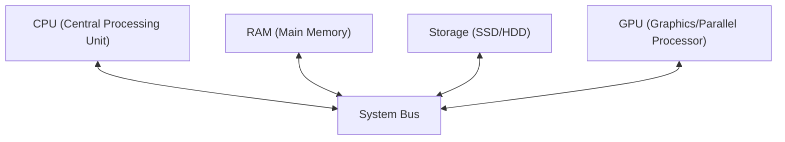
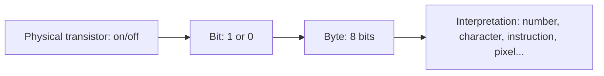
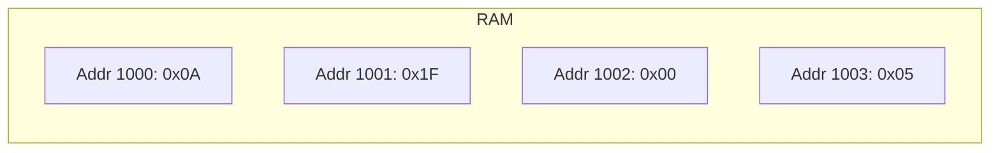
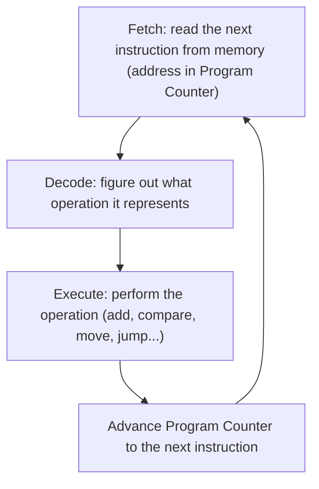
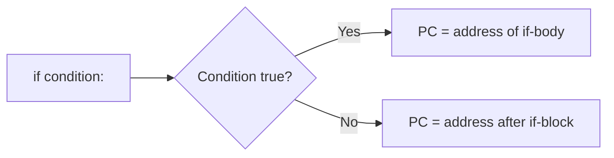
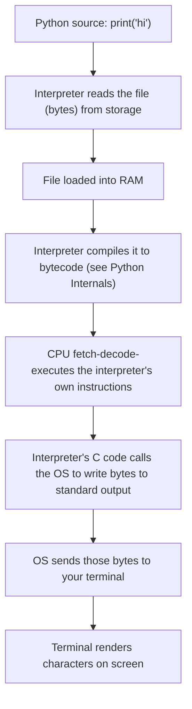

# How a Computer Executes a Program

!!! info "Prerequisites"
    None — this is the true bedrock of the entire program.

## 1. The Problem

Every topic in this curriculum — a Python `for` loop, a matrix multiply, a neural network's forward pass — eventually becomes electrical signals in a chip. Before any of that makes sense, you need a mental model of what a CPU, memory, and "running a program" actually *are*.

## 2. Intuition

A computer is, at its core, an extremely fast, extremely obedient, extremely literal-minded machine that can only do a handful of primitive things — add two numbers, compare two numbers, move data from one place to another, jump to a different instruction — but it can do billions of them per second, without ever getting bored or making a typo.

Everything you consider "computing" — a spreadsheet, a video game, GPT-4 — is those handful of primitives, composed billions of times over, at a speed no human could follow by hand.

## 3. The Physical Pieces

- **CPU** — executes instructions one (or a handful, with modern pipelining) at a time. Contains **registers** (a tiny number of ultra-fast storage slots, directly wired into the arithmetic circuits) and a **cache** (small, fast memory that keeps frequently-used data close to the CPU so it doesn't have to wait on slower RAM).
- **RAM** — larger, slower than registers/cache, but still fast; holds the program's data and instructions *while running*. Wiped when powered off.
- **Storage (SSD/HDD)** — much larger, much slower than RAM, but persists after power-off. Your Python files live here until you run them, at which point they get loaded into RAM.
- **GPU** — like a CPU but built for **massive parallelism**: thousands of simple cores doing the same operation on different data simultaneously, rather than one core doing complex sequential logic. This is *why* GPUs matter for AI/ML — matrix multiplication is exactly that pattern (Book 6 & 9).

## 4. Binary — The Only Language a CPU Understands

A CPU's circuits are transistors — physical switches that are either on or off. That's it. There is no native concept of the letter "A" or the number 7 — only **1s and 0s** (a "bit"). Everything else is a convention for interpreting patterns of bits.

**Number systems**, concretely:

| Decimal | Binary | Hex |
|---|---|---|
| 0 | `0000` | `0x0` |
| 5 | `0101` | `0x5` |
| 10 | `1010` | `0xA` |
| 255 | `11111111` | `0xFF` |

A **byte** is 8 bits, and can represent $2^8 = 256$ distinct values (0–255). This is why an unsigned 8-bit integer maxes out at 255, and why `uint8` image pixel values (Book 7) range 0–255 — it's literally one byte per channel.

## 5. Memory Addresses

RAM is organized as a giant numbered array of byte-sized slots. Every piece of data your program uses lives at some **address** — a number identifying its slot.

When you write `x = 5` in any language, ultimately: some bytes representing `5` get written to some address, and the name `x` becomes a way for you (and the compiler/interpreter) to refer to that address without memorizing the raw number. This is the exact same idea you saw in the Python Functions chapter, where a name in a namespace points to an object on the heap — that mechanism is built on top of *this* one.

## 6. Instruction Execution — The Fetch-Decode-Execute Cycle

A running program is a sequence of instructions sitting in memory. The CPU repeats one loop, extremely fast, forever:

The **Program Counter (PC)** is a special register holding the address of the *next* instruction to fetch. A "jump" instruction (which is what powers `if`, `for`, `while`, and function calls in every language) works by simply **overwriting the Program Counter** with a different address instead of letting it advance normally.

This is the physical-layer reality behind every `if` statement, loop, and function call you'll ever write.

## 7. Registers vs Cache vs RAM — Why Speed Differs

| Layer | Typical size | Speed | Analogy |
|---|---|---|---|
| Registers | ~dozens of slots, a few bytes each | Fastest (part of the CPU itself) | Items in your hands |
| Cache (L1/L2/L3) | KB–MB | Very fast | Items on your desk |
| RAM | GB | Fast | Items in a filing cabinet across the room |
| Storage (SSD/HDD) | TB | Slow | Items in a warehouse across town |

This hierarchy exists because faster memory is exponentially more expensive per byte, so systems use a small amount of very fast memory close to the CPU, backed by progressively larger, slower, cheaper tiers. **Cache misses** (needing data that isn't in the fast cache, forcing a trip to slow RAM) are one of the most common hidden causes of "why is my code slow" once you get into performance tuning (relevant later for NumPy/vectorization and GPU training loops).

## 8. Processes, Threads, and the Operating System

You never talk to the CPU directly — the **Operating System** manages it for you:

- A **process** is a running program with its own private memory space.
- A **thread** is a unit of execution *within* a process; multiple threads in the same process share that process's memory.
- The OS's **scheduler** rapidly switches the CPU between processes/threads (on a single core, this is an illusion of parallelism via fast switching; on multi-core CPUs, genuinely simultaneous).

This matters directly for Python: the **GIL** (Global Interpreter Lock, covered in the Python Internals chapter) exists because CPython's memory management isn't thread-safe by default, so it restricts *true* parallel execution of Python bytecode to one thread at a time — which is why CPU-bound Python work often reaches for `multiprocessing` (separate processes, separate memory) instead of `threading`.

## 9. Files and Networking, Briefly

- A **file** is just a named, persistent sequence of bytes on storage, with metadata (name, size, permissions) tracked by the OS's filesystem.
- **Networking** is the same idea extended across machines: bytes get packaged, addressed, and sent over physical links (following protocols like TCP/IP) so a program on one computer can exchange data with a program on another — the mechanism underneath every API call you'll make throughout this program.

## 10. Putting It Together — Running `print("hi")`

Every layer above sits on top of the fetch-decode-execute cycle from §6 — there is no "magic" layer; it's binary, addresses, and jumps, all the way down.

## 11. Common Misconceptions

- "Computers understand numbers and letters" → No — they understand voltage patterns interpreted as bits; numbers/letters/instructions are just different *conventions* for reading those same bits.
- "RAM and storage are the same, just RAM is faster" → They're different technologies with a critical difference: RAM loses its contents when powered off (volatile), storage doesn't (non-volatile).
- "More cores always means faster" → Only for problems that can genuinely be split into independent chunks (parallelizable) — this is exactly why GPUs help matrix multiplication (embarrassingly parallel) but wouldn't help a program that's one long dependent chain of steps.

## 12. Interview Questions

1. Describe the fetch-decode-execute cycle.
2. Why is a jump instruction the mechanism behind `if` and loops?
3. What's the practical difference between RAM and storage?
4. Why does cache memory exist if RAM is already fast?
5. Why can a GPU outperform a CPU on matrix multiplication despite each individual GPU core being weaker?

## Mastery Ladder

- [ ] L1 — I can name CPU, RAM, storage, GPU and their roles
- [ ] L2 — I understand why everything reduces to binary
- [ ] L3 — I can explain a memory address in my own words
- [ ] L4 — N/A (no dedicated math layer beyond number systems)
- [ ] L5 — I can describe the fetch-decode-execute cycle
- [ ] L6 — I can explain why an `if` statement is implemented as a conditional jump
- [ ] L7 — I understand why cache misses slow programs down
- [ ] L8 — I can explain why GPUs suit ML workloads at a hardware level
- [ ] L9 — I can answer the interview bank above cleanly
- [ ] L10 — I can trace `print("hi")` from source code to screen output unprompted
