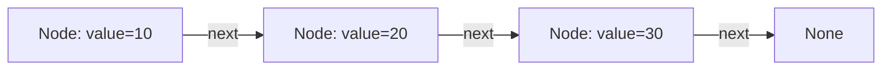
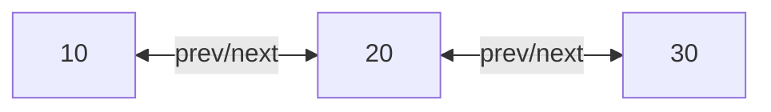
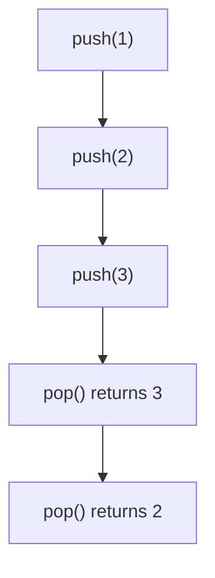
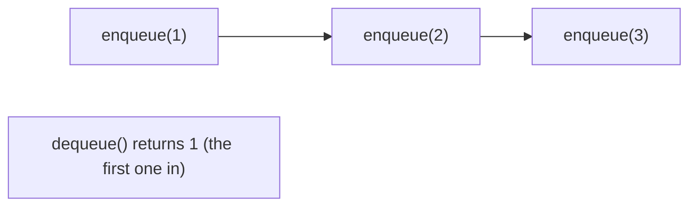
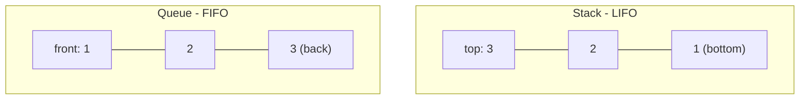

# Linked Lists, Stacks & Queues

!!! info "Prerequisites"
    [Arrays](arrays-deep-dive.md).

## 1. The Problem

Arrays are fast to *access* by index but expensive to *insert into or delete from* at the front/middle (O(n), since everything after must shift). What if you need frequent insertions/deletions and don't care about instant random access?

## 2. Intuition

Instead of a street of houses that must stand contiguously in order, imagine a scavenger hunt: each clue tells you where to find the next one. You don't need every clue-location to be physically adjacent — you just need each one to know where the next is. That's a linked list.

## 3. Formal Definition

A **linked list** is a sequence of **nodes**, each storing a value and a reference ("pointer") to the next node. Unlike an array, nodes can live anywhere in memory — there's no address arithmetic; you can only reach node $i$ by walking through nodes $0, 1, ..., i-1$ first.



## 4. Singly vs Doubly Linked

- **Singly linked**: each node points only forward. Cheap to build, but you can't walk backward.
- **Doubly linked**: each node points forward *and* backward, at the cost of an extra pointer per node — this is what Python's `collections.deque` uses internally.



## 5. Implementation From Scratch

```python
class Node:
    def __init__(self, value):
        self.value = value
        self.next = None

class LinkedList:
    def __init__(self):
        self.head = None

    def push_front(self, value):
        node = Node(value)
        node.next = self.head
        self.head = node          # O(1) — no shifting required

    def find(self, value):
        current = self.head
        while current is not None:
            if current.value == value:
                return current
            current = current.next
        return None                # O(n) — must walk the chain

    def to_list(self):
        result = []
        current = self.head
        while current is not None:
            result.append(current.value)
            current = current.next
        return result
```

`push_front` is O(1) here — no shifting, unlike an array's O(n) front-insert from the previous chapter. That's the entire trade you're making: give up O(1) random access, gain O(1) front insertion/deletion.

## 6. Time Complexity Comparison

| Operation | Array | Linked List |
|---|---|---|
| Access by index | O(1) | O(n) — must walk from head |
| Insert/delete at front | O(n) | O(1) |
| Insert/delete at end | O(1) amortized | O(1) if tail pointer kept, else O(n) |
| Search by value | O(n) | O(n) |
| Memory overhead per element | none extra | one (or two) pointers extra |

## 7. Stacks — Last In, First Out (LIFO)



A stack only allows adding/removing from **one end** ("the top"). Both `push` and `pop` are O(1) — whether backed by a dynamic array (append/remove at the end) or a linked list (insert/remove at the head).

**Where stacks show up constantly:**
- Function calls — the "call stack" from the Python Functions chapter is literally a stack of frames; the most recently called function is the first to return.
- Undo functionality, expression parsing, depth-first search/traversal (Book 0 Algorithms), backtracking.

```python
stack = []
stack.append(1)
stack.append(2)
stack.append(3)
stack.pop()   # 3
stack.pop()   # 2
```

## 8. Queues — First In, First Out (FIFO)



A queue removes from the *opposite* end it adds to. This matters for a subtle but important reason: **a plain Python list is a poor choice for a queue**, because `list.pop(0)` (removing the first element) is O(n) — every remaining element shifts left. Use `collections.deque` instead, which is a doubly linked list under the hood, giving O(1) at both ends.

```python
from collections import deque

queue = deque()
queue.append(1)      # enqueue
queue.append(2)
queue.append(3)
queue.popleft()       # dequeue → 1, O(1)
```

**Where queues show up constantly:** breadth-first search/traversal (Book 0 Algorithms), task scheduling, request handling in web servers, message queues in production systems (Book 12 MLOps).

## 9. Visual Comparison



## 10. Common Errors & Debugging

- Using `list.pop(0)` in a hot loop expecting it to be cheap → it's O(n); swap to `deque.popleft()`.
- Popping from an empty stack/queue → raises `IndexError`; always check `if stack:` first, or catch the exception.
- Confusing a stack's "top" with a queue's "front" when translating a problem into code — draw the diagram in §9 before writing anything.

## 11. Interview Questions

1. Why is inserting at the front of a linked list O(1) but O(n) for an array?
2. Why shouldn't you use `list.pop(0)` for a queue in Python?
3. What real system component (mentioned in Book 1) is literally a stack?
4. When would you choose a doubly linked list over a singly linked one?
5. Give one real-world example each of a stack-appropriate and a queue-appropriate problem.

## Mastery Ladder

- [ ] L1 — I can draw a linked list of nodes and pointers
- [ ] L2 — I understand the array-vs-linked-list trade-off (access vs insertion cost)
- [ ] L3 — I can implement a singly linked list with push_front and find
- [ ] L4 — N/A
- [ ] L5 — I can explain why deque is doubly linked internally
- [ ] L6 — I can spot an O(n)-disguised-as-O(1) bug (`list.pop(0)` in a loop)
- [ ] L7 — I know when a stack vs queue vs deque is the right structure
- [ ] L8 — I connect stacks to the call stack and queues to BFS/task scheduling
- [ ] L9 — I can answer the interview bank above cleanly
- [ ] L10 — I can implement all three (linked list, stack, queue) from memory, from scratch
