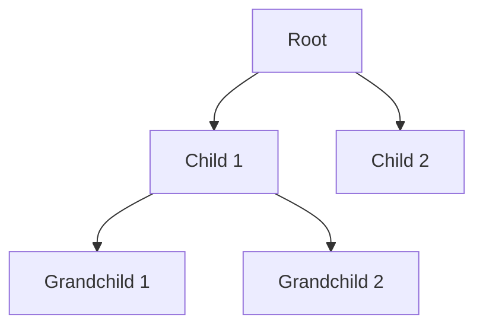
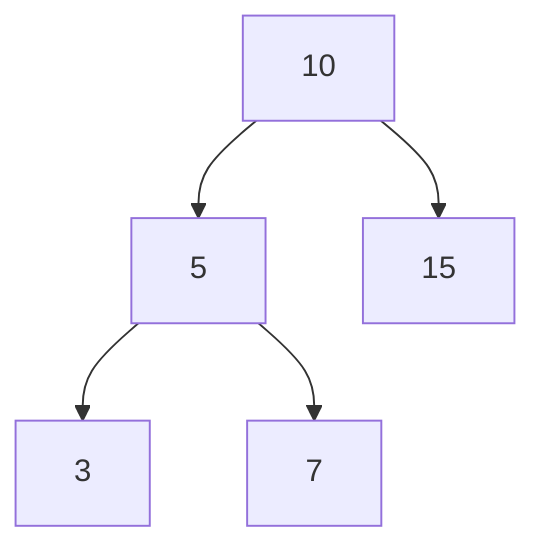
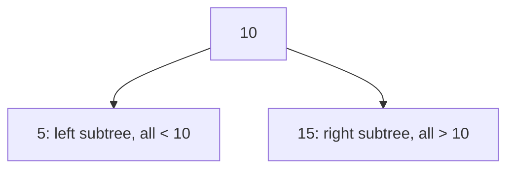
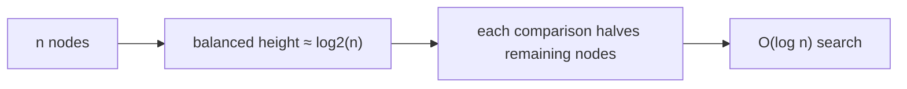
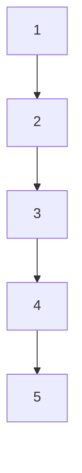
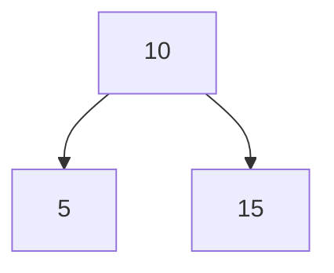
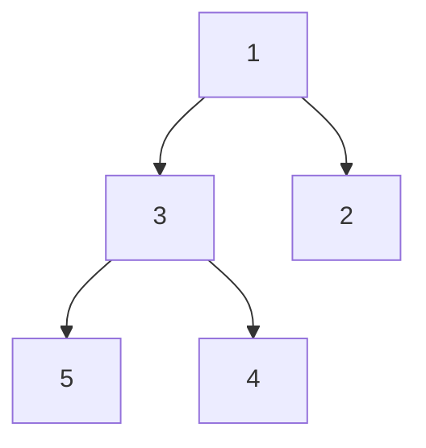

# Trees — Binary Trees, BSTs & Heaps

!!! info "Prerequisites"
    [Linked Lists, Stacks & Queues](linked-lists-stacks-queues-deep-dive.md), [Arrays](arrays-deep-dive.md).

## 1. The Problem

A hash table gives O(1) lookup but no useful ordering. A sorted array gives ordering but O(n) insertion. What if you need fast lookup, insertion, *and* an ordered structure — like "find the smallest," "find everything between X and Y," or "always know the maximum instantly"?

## 2. Intuition

A tree is a linked list that's allowed to branch. Instead of each node pointing to exactly one "next," each node can point to several "children" — and that branching structure, if organized well, lets you eliminate half the remaining possibilities with every step, the same way a good binary search does.

## 3. Formal Definition

A **tree** is a hierarchical structure of nodes where each node has one parent (except a single root, which has none) and zero or more children.



Key vocabulary: **root** (top), **leaf** (no children), **depth** (distance from root), **height** (longest path from a node down to a leaf).

## 4. Binary Trees

A **binary tree** restricts every node to at most two children, conventionally called **left** and **right**.



```python
class TreeNode:
    def __init__(self, value):
        self.value = value
        self.left = None
        self.right = None
```

## 5. Binary Search Trees (BST) — Ordering Is the Whole Point

A **BST** adds one rule: for every node, everything in its left subtree is smaller, everything in its right subtree is larger.



This single rule is what makes search fast: at each node, comparing your target value tells you which entire half of the tree to discard, without looking at it.

```python
class BST:
    def __init__(self):
        self.root = None

    def insert(self, value):
        self.root = self._insert(self.root, value)

    def _insert(self, node, value):
        if node is None:
            return TreeNode(value)
        if value < node.value:
            node.left = self._insert(node.left, value)
        else:
            node.right = self._insert(node.right, value)
        return node

    def search(self, value):
        node = self.root
        while node is not None:
            if value == node.value:
                return True
            node = node.left if value < node.value else node.right
        return False
```

## 6. Why BST Search Is O(log n) — But Only Sometimes

Each comparison halves the remaining search space — the same logic as binary search on a sorted array (Book 0 Algorithms). For a **balanced** tree with $n$ nodes, height is $\log_2 n$, so search/insert/delete are all $O(\log n)$.



**The catch**: if you insert already-sorted data (1, 2, 3, 4, 5...) into a plain BST, every new node becomes the right child of the previous one — the tree degenerates into a straight line, identical to a linked list, and search becomes O(n).



This is precisely why **self-balancing trees** (AVL trees, Red-Black trees — used internally by many production databases and language standard libraries) exist: they perform extra rotation work on insert/delete specifically to guarantee height stays $O(\log n)$ regardless of insertion order.

## 7. Traversal Orders



- **In-order** (left, root, right) → visits nodes in sorted order for a BST: `5, 10, 15`.
- **Pre-order** (root, left, right) → useful for copying/serializing a tree's structure: `10, 5, 15`.
- **Post-order** (left, right, root) → useful for safely deleting a tree bottom-up: `5, 15, 10`.

```python
def in_order(node, result):
    if node is None:
        return
    in_order(node.left, result)
    result.append(node.value)
    in_order(node.right, result)
```

## 8. Heaps — Priority, Not Full Ordering

A **heap** relaxes the BST rule: it only guarantees that every parent is smaller (min-heap) or larger (max-heap) than its children — siblings can be in either order relative to each other. This weaker guarantee is exactly what makes heaps ideal for one specific job: **instantly retrieving the minimum (or maximum) element.**



Unlike a BST, a heap is almost always stored as a plain **array**, not linked nodes — because heaps are kept "complete" (filled left-to-right, level by level), so a node's children can be found by pure arithmetic on its index:

$$
\text{left\_child}(i) = 2i + 1 \qquad \text{right\_child}(i) = 2i + 2 \qquad \text{parent}(i) = \lfloor (i-1)/2 \rfloor
$$

No pointers needed at all — this is a direct callback to the address-arithmetic idea from the Arrays chapter, applied to a tree shape.

```python
import heapq

nums = [5, 1, 8, 3, 2]
heapq.heapify(nums)          # O(n), rearranges in place into a min-heap
heapq.heappop(nums)          # O(log n) — always returns the current minimum
heapq.heappush(nums, 0)      # O(log n)
```

## 9. Time Complexity Summary

| Operation | Sorted Array | BST (balanced) | BST (degenerate) | Heap |
|---|---|---|---|---|
| Search arbitrary value | O(log n) | O(log n) | O(n) | O(n) — not what heaps are for |
| Insert | O(n) | O(log n) | O(n) | O(log n) |
| Find min/max | O(1) (if sorted) | O(log n) | O(n) | O(1) |
| Remove min/max | O(n) | O(log n) | O(n) | O(log n) |

## 10. Common Errors & Debugging

- Assuming any binary tree gives O(log n) search — only true if it's a valid BST *and* reasonably balanced.
- Inserting sorted/near-sorted data into a plain BST expecting O(log n) — silently degrades to O(n); use a self-balancing structure or shuffle input first if a plain BST is required.
- Reaching for a heap when you need arbitrary-value search — heaps only excel at min/max retrieval, not general lookup.

## 11. Real-World Usage

BSTs (and their balanced variants) back many database indexes and language standard-library ordered maps. Heaps power priority queues (task schedulers, Dijkstra's shortest-path algorithm in Book 0 Algorithms), and — directly relevant later — **top-k retrieval**, such as pulling the k most similar vectors in a similarity search for RAG (Book 10) or the k highest-probability tokens during LLM sampling (Book 9).

## 12. Interview Questions

1. Why does BST search work in O(log n), and under what condition does that break down?
2. What's the difference between a BST and a heap's ordering guarantee?
3. Why can a heap be stored as a plain array with no pointers?
4. Name a real use case where you'd reach for a heap instead of a BST.
5. What are in-order, pre-order, and post-order traversal each useful for?

## Mastery Ladder

- [ ] L1 — I can draw a binary tree with root/children/leaves labeled
- [ ] L2 — I understand the BST left-smaller/right-larger invariant
- [ ] L3 — I can implement BST insert and search from scratch
- [ ] L4 — I can derive a heap's child/parent index formulas
- [ ] L5 — I can implement/use the three traversal orders
- [ ] L6 — I can explain why a sorted-input BST degenerates to O(n)
- [ ] L7 — I know why self-balancing trees exist
- [ ] L8 — I choose BST vs heap vs hash table deliberately based on the access pattern needed
- [ ] L9 — I can answer the interview bank above cleanly
- [ ] L10 — I can connect heaps to top-k retrieval in RAG/LLM sampling unprompted
