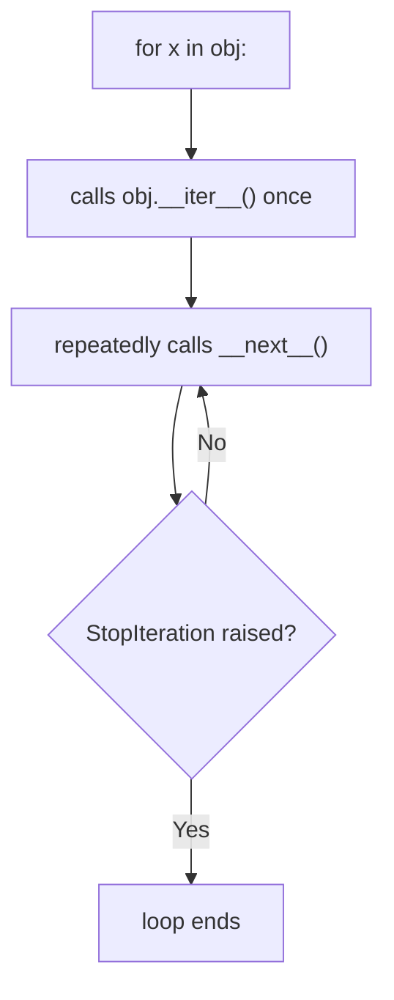
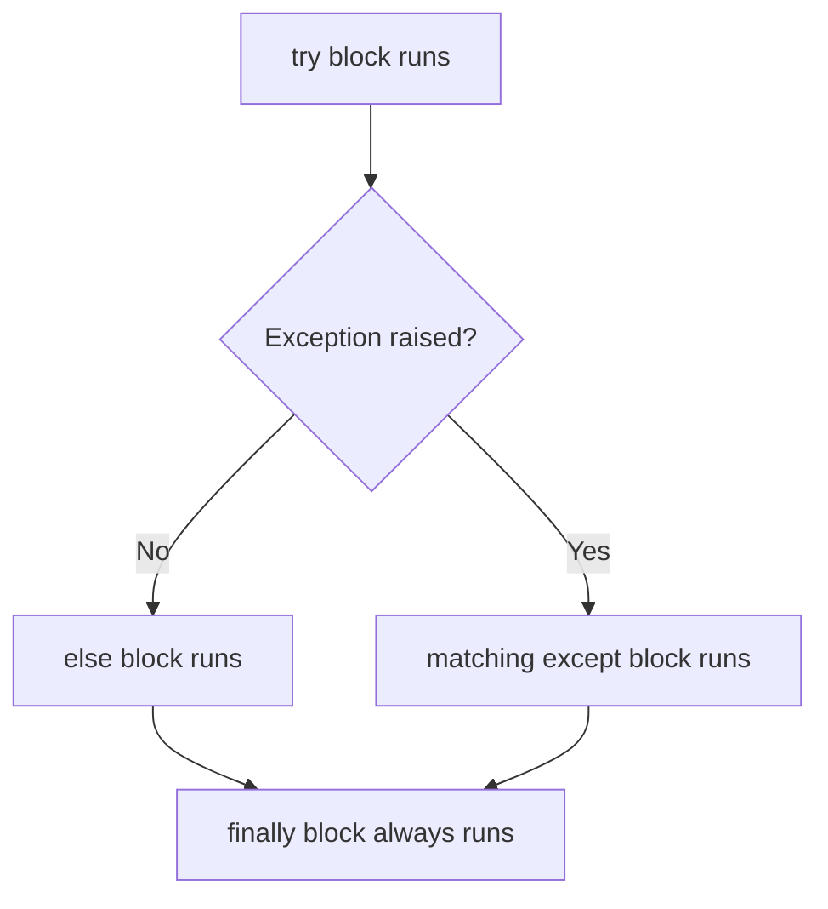
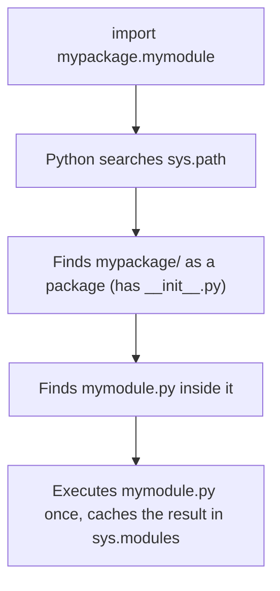
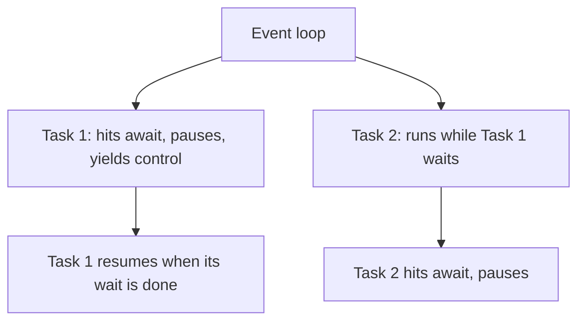
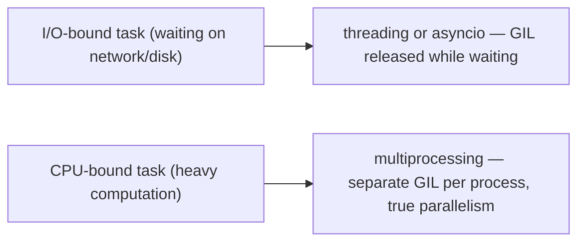

# Advanced Python — Iterators, Generators, Context Managers, Exceptions, Concurrency

!!! info "Prerequisites"
    [Python Fundamentals, Control Flow & Collections](fundamentals-control-flow-collections-deep-dive.md), [Python OOP](oop-deep-dive.md).

## 1. The Iterator Protocol

`for x in something` works on anything implementing two magic methods:

```python
class CountUpTo:
    def __init__(self, limit):
        self.limit = limit
        self.n = 0

    def __iter__(self):
        return self

    def __next__(self):
        if self.n >= self.limit:
            raise StopIteration
        self.n += 1
        return self.n

for x in CountUpTo(3):
    print(x)   # 1, 2, 3
```



This is the exact mechanism every `list`, `dict`, `set`, file object, and string relies on — `for` is just repeated `__next__()` calls under the hood, caught by a `try/except StopIteration` you never see.

## 2. Generators — Iterators Without the Boilerplate

```python
def count_up_to(limit):
    n = 0
    while n < limit:
        n += 1
        yield n

for x in count_up_to(3):
    print(x)   # 1, 2, 3
```

`yield` transforms a function into a **generator function**: calling it doesn't run the body immediately — it returns a generator object that runs the body *lazily*, pausing at each `yield` and resuming exactly where it left off on the next `__next__()` call. This is what the `CountUpTo` class above does manually, generated for you automatically.

**Why this matters for memory**: `range(10_000_000)` and a generator expression don't build a 10-million-element list in memory — they produce values one at a time, on demand.

```python
squares = (x * x for x in range(1_000_000))   # generator expression — lazy
squares_list = [x * x for x in range(1_000_000)]  # list comprehension — eager, all in memory at once
```

## 3. Comprehensions

```python
[x * 2 for x in range(5)]                     # list comprehension: [0, 2, 4, 6, 8]
{x: x * 2 for x in range(3)}                  # dict comprehension
{x for x in [1, 1, 2, 2, 3]}                   # set comprehension: {1, 2, 3}
[x for x in range(10) if x % 2 == 0]            # with a filter
```

Comprehensions are syntactic sugar for a loop building up a collection — often faster than the equivalent explicit loop in CPython, because the loop body is compiled to a specialized, tighter bytecode path than a general `for` loop with repeated `.append()` calls.

## 4. Context Managers — Guaranteed Cleanup

```python
with open("file.txt") as f:
    data = f.read()
# file is automatically closed here, even if an exception occurred inside the block
```

`with` relies on two magic methods, `__enter__` and `__exit__`:

```python
class Timer:
    def __enter__(self):
        import time
        self.start = time.time()
        return self

    def __exit__(self, exc_type, exc_value, traceback):
        import time
        print(f"Elapsed: {time.time() - self.start:.4f}s")
        return False   # False = don't suppress exceptions

with Timer():
    do_something_slow()
```

`__exit__` is called **even if an exception was raised inside the block** — this is precisely why `with` is the correct tool for anything that must be cleaned up reliably (file handles, network connections, locks), instead of manual `open()`/`close()` pairs that skip the `close()` if an exception strikes in between.

## 5. Exceptions

```python
try:
    result = 10 / 0
except ZeroDivisionError as e:
    print(f"Caught: {e}")
else:
    print("No exception occurred")   # runs only if try succeeded
finally:
    print("Always runs")              # runs no matter what
```



Custom exceptions simply subclass `Exception`:

```python
class InsufficientFundsError(Exception):
    pass

raise InsufficientFundsError("balance too low")
```

## 6. Modules, Packages, and Virtual Environments



A **module** is just a `.py` file; a **package** is a folder containing an `__init__.py` (making it importable as a namespace). A **virtual environment** (`venv`) is an isolated Python installation with its own separately installed packages, so different projects on the same machine can depend on different, potentially conflicting library versions without interfering with each other.

## 7. Type Hints

```python
def add(a: int, b: int) -> int:
    return a + b
```

Type hints are **not enforced at runtime** by default — Python remains dynamically typed regardless of hints. They exist for tooling: static checkers (like `mypy`), IDE autocomplete, and documentation. This matters when debugging: a type-hint mismatch will never itself raise an error while the program runs; only a separate type-checking tool catches it.

## 8. `async`/`await` — Concurrency Without Threads

```python
import asyncio

async def fetch_data():
    await asyncio.sleep(1)   # yields control back to the event loop while "waiting"
    return "data"

async def main():
    result = await fetch_data()
    print(result)

asyncio.run(main())
```



`async`/`await` gives **cooperative concurrency on a single thread** — great for I/O-bound work (network requests, waiting on a database), where a task spends most of its time waiting rather than computing. It does **not** give you parallel CPU execution — for that, see below.

## 9. Threads vs Multiprocessing — and the GIL

```python
from threading import Thread
from multiprocessing import Process

# threading: shares memory, but the GIL means only one thread runs Python
# bytecode at a time — good for I/O-bound tasks, not CPU-bound ones
t = Thread(target=some_io_bound_function)

# multiprocessing: separate processes, separate memory, separate GIL each —
# genuinely parallel on multiple CPU cores, at the cost of higher memory
# and slower inter-process communication
p = Process(target=some_cpu_bound_function)
```

This directly reuses the "processes vs threads" concept from the CS Foundations chapter, plus the GIL concept previewed there: CPython's Global Interpreter Lock permits only one thread to execute Python bytecode at any instant, regardless of how many CPU cores are available. Threads still help when a task spends most of its time *waiting* (I/O), because the GIL is released during blocking I/O calls — but for CPU-bound number crunching, `threading` won't parallelize, while `multiprocessing` (separate interpreters entirely) will.



## Common Errors & Debugging

- `StopIteration` leaking out of a `for` loop unexpectedly → almost always a sign you manually called `next()` outside a `for`, without handling exhaustion.
- Forgetting that a generator is **exhausted after one full iteration** — trying to loop over the same generator object twice silently produces nothing the second time.
- Using `threading` for CPU-bound work and being confused it isn't faster → the GIL; switch to `multiprocessing`.
- `with` block not actually preventing a resource leak → check that `__exit__` doesn't swallow exceptions silently by accidentally returning `True`.

## Interview Questions

1. What two methods make an object iterable, and what exception signals "done"?
2. Why is a generator expression more memory-efficient than a list comprehension for large data?
3. What guarantees does `with` give you that manual `open()`/`close()` doesn't?
4. Why doesn't `threading` speed up CPU-bound Python code?
5. What's the practical difference between `asyncio` concurrency and `multiprocessing` parallelism?

## Mastery Ladder

- [ ] L1 — I can explain what `for` actually calls under the hood
- [ ] L2 — I understand generators are lazy, iterators/lists are eager
- [ ] L3 — I can write a custom iterator class and a generator function
- [ ] L4 — N/A
- [ ] L5 — I can explain `__enter__`/`__exit__` and why `with` guarantees cleanup
- [ ] L6 — I can debug an exhausted-generator or GIL-related "why isn't this faster" bug
- [ ] L7 — I know when to reach for asyncio vs threading vs multiprocessing
- [ ] L8 — I use context managers and custom exceptions deliberately in real code
- [ ] L9 — I can answer the interview bank above cleanly
- [ ] L10 — I can explain the GIL's exact effect on threads vs processes unprompted
