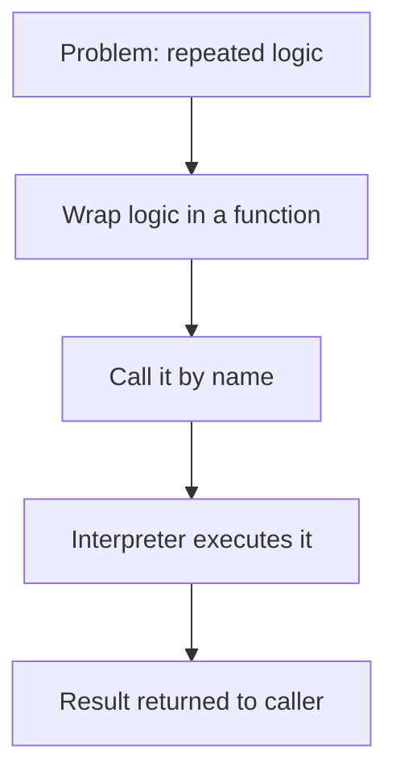
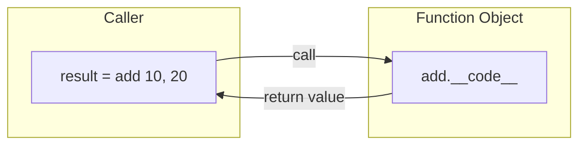
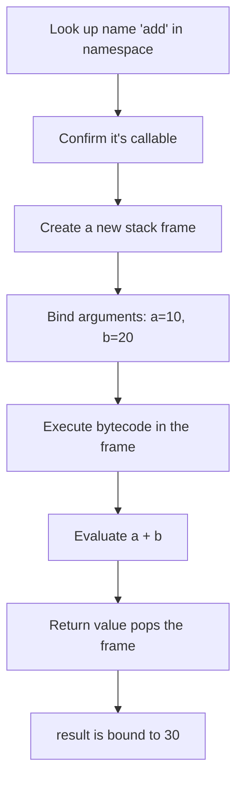
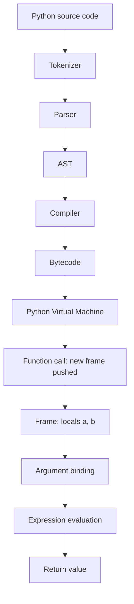
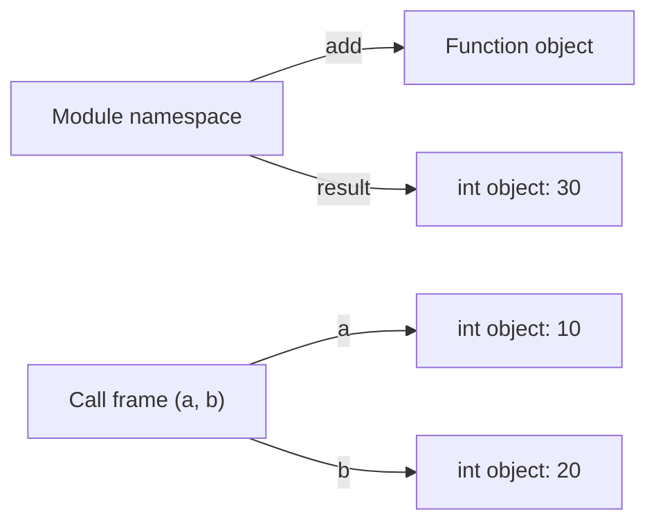

# Python Functions — From "What" to CPython Internals

!!! info "Prerequisites"
    Variables, assignment, basic data types. See [Part A — Fundamentals](index.md).

## 1. Big Picture

A function is the smallest unit of *reusable, callable behavior* in Python. Everything bigger — classes, modules, frameworks — is built on top of the same call mechanism you'll see in this chapter.



## 2. Intuition

Before functions exist conceptually, imagine copy-pasting the same five lines of code every time you need them. A function is that block given **a name**, **a place to plug in different inputs**, and **a promise to hand back an output.**

## 3. Formal Definition

A function in Python is a first-class object that binds a name to a block of code, accepts zero or more arguments, executes a sequence of statements, and returns a value (`None` if no explicit `return`).

```python
def add(a, b):
    return a + b
```

## 4. Visual Explanation



## 5. What Happens When You Write `def add(a, b): ...`

At **module load time** (before you ever call it), Python:

1. Compiles the function body into a **code object** (bytecode).
2. Creates a **function object** wrapping that code object, along with its defaults, closure, and `__name__`.
3. Binds the name `add` in the current namespace to that function object.

No addition happens yet — `def` only *defines*, it doesn't *execute* the body.

## 6. Execution — `result = add(10, 20)`



## 7. Runtime — Source to Execution



## 8. Memory Model

```python
result = add(10, 20)
```

- `10` and `20` are small-int objects. CPython **caches integers -5 to 256**, so these don't get freshly allocated — the names `a` and `b` inside the frame just hold **references** to the existing int objects.
- `add` is a name in the module namespace pointing to a function object on the heap.
- `result` is a name in the module namespace pointing to whatever int object `30` resolves to (also cached, since it's in the -5..256 range).



Nothing is "passed by value" or "passed by copy" here — **names are bound to objects, and objects are passed by object reference.** This is why mutable arguments (like lists) can be changed in place inside a function, while rebinding a name inside a function never affects the caller's name.

## 9. Internals — Bytecode

```python
import dis

def add(a, b):
    return a + b

dis.dis(add)
```

Conceptually, this disassembles to something like:

```text
  2           0 LOAD_FAST                0 (a)
              2 LOAD_FAST                1 (b)
              4 BINARY_ADD
              6 RETURN_VALUE
```

- `LOAD_FAST` pushes a local variable onto the frame's value stack directly by slot index — this is faster than `LOAD_NAME`/`LOAD_GLOBAL` because locals are stored in a fixed-size array on the frame, not a dict lookup.
- `BINARY_ADD` pops two values, calls `a.__add__(b)` (falling back to `b.__radd__(a)`), and pushes the result.
- `RETURN_VALUE` pops the frame and hands the value back to the caller.

## 10. Edge Cases

```python
add("10", "20")   # "1020"  — str defines __add__ as concatenation
add(10, "20")     # TypeError: unsupported operand type(s)
```

`+` isn't "addition" at the bytecode level — it's a dispatch to whatever `__add__`/`__radd__` the operand types define. This is why the same one-line function behaves completely differently depending on what you hand it — a preview of Python's duck typing.

## 11. Common Errors & Debugging

| Symptom | Cause | Fix |
|---|---|---|
| `TypeError: add() missing 1 required positional argument` | Called with too few args | Check the call site against the signature |
| `UnboundLocalError` | Assigned to a name inside the function before reading it, without `global`/`nonlocal` | Declare intent or pass the value in |
| Silent wrong result | Mutable default argument (`def f(x=[])`) shared across calls | Use `None` as default, create the list inside the body |

## 12. Engineering Judgment

- Use a **function** when behavior is stateless or the state is fully captured by its parameters.
- Reach for a **class** when you need to bundle state *and* behavior that changes together over time.
- Over-abstracting (a function for every three-line block) hurts readability as much as under-abstracting.

## 13. Interview Questions

1. What happens internally when a Python function is called?
2. What is a stack frame, and what does it hold?
3. Are Python arguments passed by value or by reference?
4. What's the difference between an object and a variable/name?
5. Why is `LOAD_FAST` faster than `LOAD_GLOBAL`?

## Mastery Ladder

- [ ] L0 — I've heard the term "function"
- [ ] L1 — I can define one
- [ ] L2 — I understand the intuition
- [ ] L3 — I can implement one with `*args`/`**kwargs`, defaults, closures
- [ ] L4 — N/A (no dedicated math layer for this topic)
- [ ] L5 — I can read its bytecode with `dis`
- [ ] L6 — I can debug `UnboundLocalError` / mutable-default bugs
- [ ] L7 — I know when `LOAD_FAST` vs dict-based lookup matters for performance
- [ ] L8 — I use functions vs classes deliberately in real projects
- [ ] L9 — I can answer the interview bank above cleanly
- [ ] L10 — I can explain CPython's frame/call internals from memory
