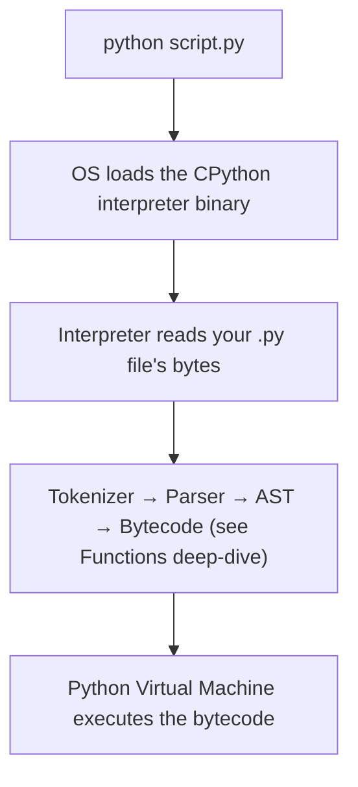
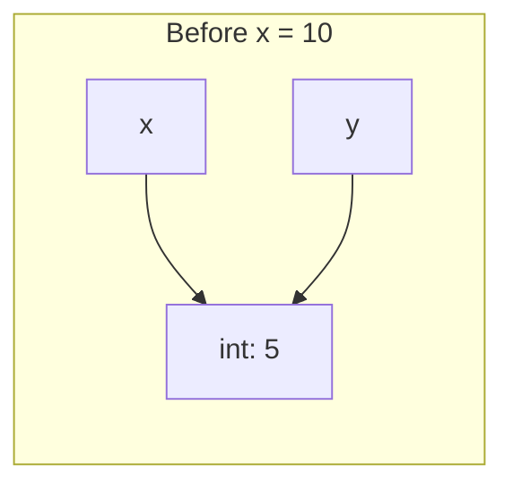
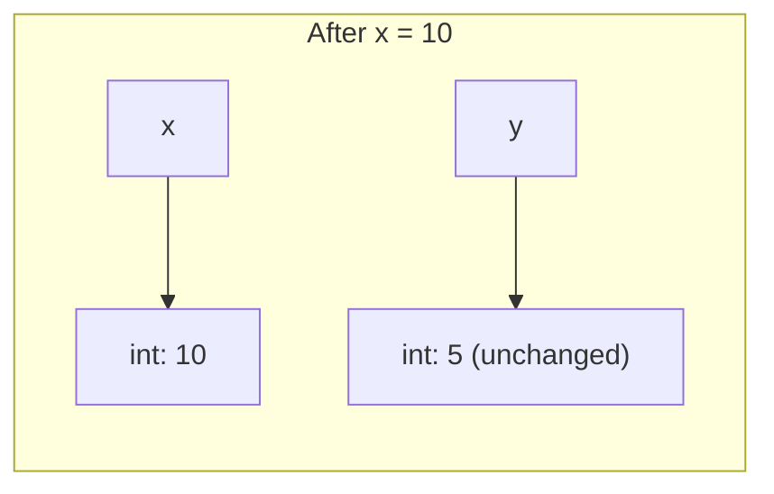

# Python Fundamentals, Control Flow & Collections

!!! info "Prerequisites"
    [How Computers Execute Programs](../00-computer-science/how-computers-execute-programs.md).

## Part A — Fundamentals

### A.1 What Happens When You Run `python script.py`



The **REPL** (`python` with no arguments) runs the same pipeline one line at a time, immediately showing each result — useful for exploration, not for real programs.

### A.2 Variables Are Names, Not Boxes

```python
x = 5
y = x
x = 10
print(y)   # still 5, not 10
```

This is the single most important mental model correction for beginners: `x = 5` does **not** create a box called `x` containing `5`. It creates an `int` object `5` somewhere in memory, and makes the name `x` point to it. `y = x` copies the *pointer*, not the object. `x = 10` then points `x` at a *different* object entirely — `y` never notices, because it was never connected to `x`, only to the object `x` used to point to.




### A.3 Objects, Types, and `id()`

Every value in Python — `5`, `"hi"`, `[1,2]`, even a function — is an **object**: a chunk of memory with a type, a value, and (for most types) a reference count. `type(x)` tells you the type; `id(x)` gives the object's actual memory address (in CPython specifically).

```python
type(5)          # <class 'int'>
id(5)             # some integer address
type("hi")        # <class 'str'>
```

### A.4 Core Data Types

| Type | Example | Mutable? |
|---|---|---|
| `int` | `42` | No |
| `float` | `3.14` | No |
| `str` | `"hi"` | No |
| `bool` | `True`, `False` | No |
| `None` | `None` | N/A (singleton) |

`bool` is technically a subclass of `int` — `True == 1` and `False == 0` both evaluate to `True`, which explains why `True + True` legally evaluates to `2`.

### A.5 Operators

```python
7 // 2      # 3   — floor division
7 % 2       # 1   — modulo (remainder)
2 ** 10     # 1024 — exponentiation
"a" + "b"    # "ab" — str defines + as concatenation (same __add__ dispatch as the Functions chapter)
```

---

## Part B — Control Flow

### B.1 Conditionals

```python
if score >= 90:
    grade = "A"
elif score >= 80:
    grade = "B"
else:
    grade = "F"
```

At the bytecode level (see the Functions deep-dive for `dis`), this compiles to conditional jump instructions — `if` is not a special "decision-making" primitive; it's an instruction that overwrites the Program Counter based on a comparison, exactly as described in the CS Foundations chapter.

### B.2 Loops

```python
for item in [1, 2, 3]:
    print(item)

i = 0
while i < 3:
    print(i)
    i += 1
```

`for` in Python iterates over anything implementing the **iterator protocol** (covered fully in Part F) — it is not restricted to counting integers the way `for` loops are in C.

### B.3 `break`, `continue`, `pass`

```python
for i in range(10):
    if i == 5:
        break        # exit the loop entirely
    if i % 2 == 0:
        continue     # skip to the next iteration
    print(i)          # prints 1, 3
```

`pass` is a no-op placeholder — used when syntax requires a block but you have nothing to put there yet (e.g., stubbing out a function during design).

### B.4 `match` Statement (Structural Pattern Matching)

```python
def describe(value):
    match value:
        case 0:
            return "zero"
        case [x, y]:
            return f"pair: {x}, {y}"
        case {"type": "user", "name": name}:
            return f"user named {name}"
        case _:
            return "unknown"
```

Unlike a chain of `if/elif`, `match` can **destructure** the value's shape (unpacking a list, matching dict keys) as part of the comparison itself — closer to what other languages call pattern matching than a simple switch statement.

---

## Part C — Collections

### C.1 Lists — Ordered, Mutable

```python
nums = [1, 2, 3]
nums.append(4)         # amortized O(1) — see Arrays chapter
nums.insert(0, 0)      # O(n) — every element shifts
nums[1:3]               # slicing → [2, 3]
```

A Python list is, concretely, the dynamic array of *pointers* described in the Arrays chapter — this is why it holds mixed types freely.

### C.2 Tuples — Ordered, Immutable

```python
point = (3, 4)
x, y = point            # unpacking
```

Because tuples can't change after creation, they're **hashable** (if their contents are hashable) — which is exactly why they, unlike lists, are legal as dict keys or set members (see the Hash Tables chapter's immutability requirement).

### C.3 Sets — Unordered, Unique

```python
seen = {1, 2, 3}
seen.add(2)              # no-op, already present
3 in seen                 # O(1) average — see Hash Tables chapter
```

### C.4 Dictionaries — Key-Value Pairs

```python
person = {"name": "Sam", "age": 30}
person["age"]              # O(1) average lookup
person.get("email", "n/a")  # safe lookup with a default
```

Dicts are hash tables under the hood — every concept from the Hash Tables chapter (hashing, collisions, immutable-keys-only) applies directly here.

### C.5 Nested Collections and 2D Arrays

```python
grid = [[0, 0, 0], [0, 0, 0]]
grid[1][2] = 5
```

A common beginner bug: `grid = [[0]*3] * 2` creates **two references to the same inner list**, so mutating one row mutates both — because `* 2` copies the *pointer* to the list, not the list's contents (a direct consequence of the A.2 name/object model).

### C.6 Iteration, Membership, Mutability, Copying

```python
for k, v in person.items():
    print(k, v)

a = [1, 2, 3]
b = a              # b is the SAME list object
c = a.copy()        # c is a NEW list with the same contents
a.append(4)
print(b)   # [1, 2, 3, 4] — changed, because b IS a
print(c)   # [1, 2, 3]    — unchanged, because c is a separate object
```

This is the same reference-vs-object distinction from A.2, now applied to mutable collections — where it actually has visible consequences, unlike with immutable ints/strings.

---

## Common Errors & Debugging

- Expecting `y = x; x = 10` to change `y` too — misunderstanding names as boxes instead of pointers (§A.2).
- `grid = [[0]*3]*2` producing shared rows — copying a reference, not the data (§C.5).
- `b = a` followed by surprise mutations — same root cause; use `.copy()` (or `copy.deepcopy()` for nested structures) when you actually want an independent copy.
- Off-by-one slicing errors — Python slices are `[start:stop)`, exclusive of `stop`.

## Interview Questions

1. Explain why `y = x` followed by `x = 10` doesn't change `y`.
2. Why are tuples hashable but lists aren't?
3. What's wrong with `grid = [[0]*3]*2`, and how do you fix it?
4. What's the difference between `break`, `continue`, and `pass`?
5. Why can `for` in Python iterate over things that aren't numeric ranges?

## Mastery Ladder

- [ ] L1 — I can list Python's core types and control-flow constructs
- [ ] L2 — I understand names as references to objects, not boxes
- [ ] L3 — I can write nested loops, conditionals, and comprehensable slicing
- [ ] L4 — N/A
- [ ] L5 — I can explain why `if` compiles to a conditional jump
- [ ] L6 — I can debug the shared-reference nested-list bug
- [ ] L7 — I know when `.copy()` vs `deepcopy()` vs plain assignment is correct
- [ ] L8 — I choose list/tuple/set/dict deliberately based on ordering, mutability, and lookup needs
- [ ] L9 — I can answer the interview bank above cleanly
- [ ] L10 — I can trace the reference model through multi-level nested mutable structures unprompted
