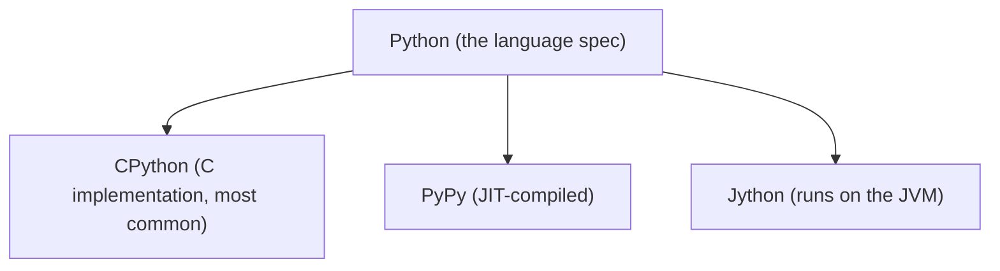
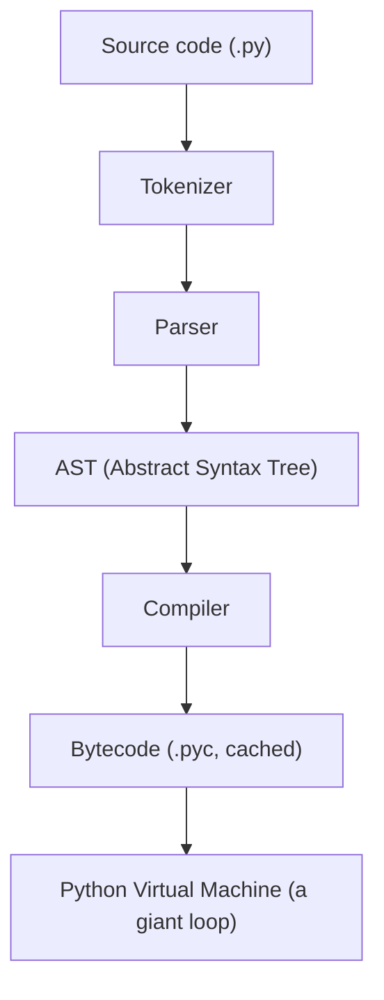
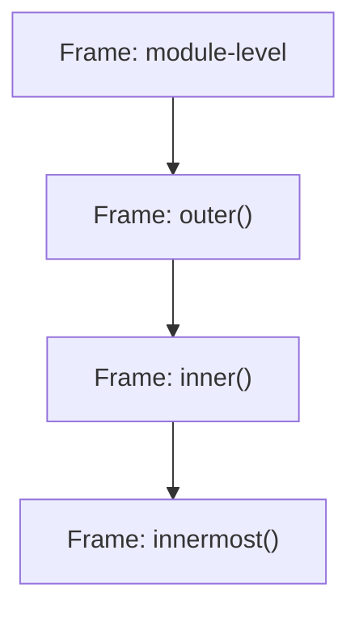
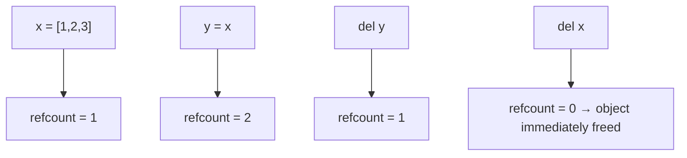
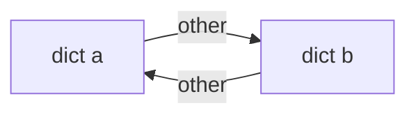
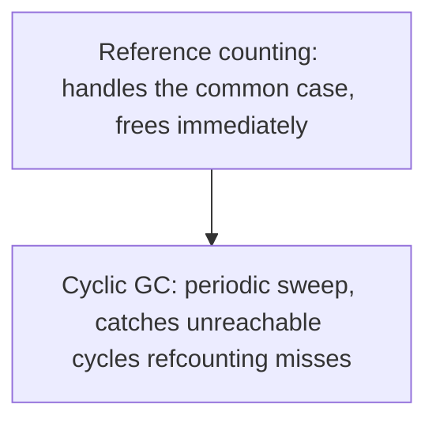
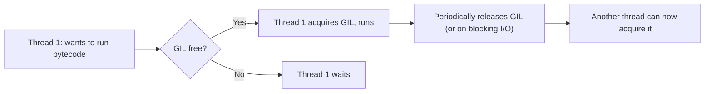
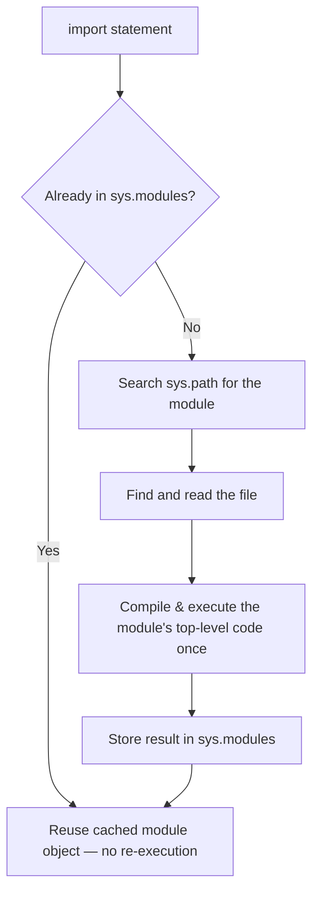
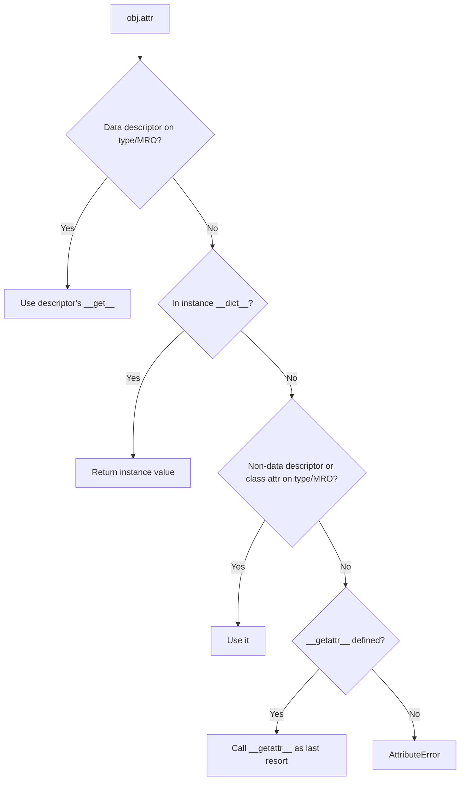

# Python Internals — CPython, Bytecode, GC, the GIL & Attribute Lookup

!!! info "Prerequisites"
    [Python Functions](functions-deep-dive.md) (bytecode/frame basics), [Advanced Python](advanced-python-deep-dive.md) (GIL preview), [How Computers Execute Programs](../00-computer-science/how-computers-execute-programs.md).

## 1. What Is CPython?

"Python" is a *language specification*; **CPython** is the reference *implementation* — a program, written in C, that reads Python source and executes it. It's the interpreter you get by default when you run `python`. Other implementations exist (PyPy, with a JIT compiler; Jython, targeting the JVM), but CPython is what almost everyone means by "Python" in practice, and every internal detail in this chapter is specific to it — the language spec itself doesn't mandate a GIL, reference counting, or any of what follows.



## 2. The Full Pipeline — Source to Execution



- **Tokenizer** breaks raw text into tokens (`def`, `add`, `(`, `a`, `,`, `b`, `)`, `:`, ...).
- **Parser** arranges tokens into a tree reflecting grammar (a function definition containing a return statement containing a binary operation).
- **AST** is that tree, inspectable directly:

```python
import ast
tree = ast.parse("x = 1 + 2")
print(ast.dump(tree))
# Module(body=[Assign(targets=[Name(id='x')], value=BinOp(left=Constant(1), op=Add(), right=Constant(2)))])
```

- **Compiler** walks the AST and emits bytecode — the same bytecode you saw with `dis.dis()` in the Functions chapter.
- **`.pyc` caching**: CPython caches compiled bytecode in a `__pycache__` folder so it doesn't have to re-tokenize/re-parse/re-compile a module every single run — only the *execution* (the VM loop) happens fresh each time; if the source file hasn't changed, the cached bytecode is reused directly.

## 3. The Python Virtual Machine — A Stack Machine

The VM is, structurally, one large loop (`switch`-like dispatch in the CPython C source) that repeatedly reads the next bytecode instruction and acts on it, manipulating a **value stack** local to the current frame.


This is genuinely just a loop doing "read instruction, push/pop the stack, repeat" — there's no deeper magic beneath it; it's the fetch-decode-execute cycle from CS Foundations, one abstraction layer up, implemented in software instead of silicon.

## 4. Stack Frames, Revisited

Every function call creates a **frame object** holding: the local variables array (what `LOAD_FAST` reads from), the value stack for that call, a reference to the calling frame (so execution can resume there on return), and the current bytecode instruction position. `sys._getframe()` can inspect this directly, and it's what powers tracebacks — a traceback is literally a chain of frames, printed from innermost to outermost.



Recursion (Algorithms chapter) pushes one new frame per call — this is precisely the memory cost that makes runaway recursion crash with `RecursionError` well before it exhausts actual system memory; CPython deliberately caps the frame stack depth (`sys.getrecursionlimit()`, default 1000) as an early warning rather than letting a bug silently consume gigabytes.

## 5. The Heap, References, and Reference Counting

Every Python object lives on the **heap** and carries a hidden reference count — the number of names/containers currently pointing to it.

```python
import sys
x = [1, 2, 3]
print(sys.getrefcount(x))   # baseline count (includes a temporary ref from getrefcount's own call)
y = x
print(sys.getrefcount(x))   # count increased by 1 — y now also points to it
del y
print(sys.getrefcount(x))   # back down
```



**The moment an object's reference count hits zero, CPython frees it immediately** — this is why Python's memory management feels deterministic and immediate for most objects, unlike languages with purely "whenever the GC gets around to it" garbage collection.

## 6. Why Reference Counting Alone Isn't Enough — Cycles

```python
a = {}
b = {}
a["other"] = b
b["other"] = a
del a
del b
# a and b still reference each other! Refcount never hits 0 via this path alone.
```



This is a **reference cycle** — two (or more) objects only reachable from each other, unreachable from anywhere else in the program, but never hitting refcount zero because they keep referencing each other. Pure reference counting would leak this memory forever. This is exactly why CPython also runs a **cyclic garbage collector** (`gc` module) periodically, which specifically hunts for and cleans up unreachable cycles that refcounting alone can't catch.



## 7. The GIL — Full Explanation

The **Global Interpreter Lock** is a single mutex inside CPython that only one thread may hold at a time; holding it is required to execute Python bytecode. Practically: **no two threads execute Python bytecode simultaneously in CPython, ever, regardless of CPU core count.**



**Why does it exist at all?** Reference counting (§5) isn't thread-safe by default — if two threads simultaneously incremented/decremented the same object's refcount without synchronization, you could get corrupted counts, premature frees, or crashes. The GIL sidesteps needing fine-grained locks around every single object's refcount by simply ensuring only one thread ever touches interpreter state at once.

**The practical consequence**, tying directly back to the Advanced Python chapter: CPU-bound multi-threaded Python code gets **no speedup** from additional threads (the GIL serializes them anyway), while I/O-bound code *does* benefit from threads, because the GIL is explicitly released during blocking I/O calls (file reads, network waits), letting another thread run Python code during that wait. True CPU parallelism in CPython requires `multiprocessing` (separate processes, each with its own GIL) instead.

## 8. The Import System

```python
import mypackage.mymodule
```



This is why import side-effects (like a `print` at module level) only ever run **once** per process, no matter how many times the module is imported elsewhere — subsequent imports just fetch the cached module object from `sys.modules`.

## 9. The Descriptor Protocol

A **descriptor** is any object defining `__get__`, `__set__`, or `__delete__`, controlling what happens when it's accessed as a class attribute. This is the mechanism underneath `@property`:

```python
class Celsius:
    def __init__(self):
        self._value = 0

    def __get__(self, instance, owner):
        return self._value

    def __set__(self, instance, value):
        if value < -273.15:
            raise ValueError("below absolute zero")
        self._value = value

class Weather:
    temperature = Celsius()

w = Weather()
w.temperature = 25       # actually calls Celsius.__set__
print(w.temperature)      # actually calls Celsius.__get__
```

`@property`, `@staticmethod`, and `@classmethod` are all implemented as descriptors under the hood — this protocol is the actual mechanism that makes attribute access "smart" rather than a plain dict lookup.

## 10. Attribute Lookup Order

```python
obj.attr
```

CPython's real lookup order, roughly: check the **type's** `__getattribute__` (usually the default), which looks for `attr` as a **data descriptor** on the type (or its MRO) first, then the **instance's own `__dict__`**, then a **non-data descriptor** or plain class attribute on the type (following the MRO from Part E), and only falls back to `__getattr__` (if defined) when everything above fails.



This explains a common surprise: **instance attributes normally shadow class attributes of the same name** — *except* when the class attribute is a data descriptor (defines both `__get__` and `__set__`, as `@property` does), in which case the descriptor wins even over an instance dict entry.

## Common Errors & Debugging

- `RecursionError` on deep (but not infinite) recursion → hitting the frame-stack depth cap from §4; consider an iterative rewrite or `sys.setrecursionlimit()` (with caution — it's a real memory trade-off, not a free fix).
- A program's memory grows even though objects are `del`eted → likely a reference cycle (§6) waiting on the cyclic GC; check with the `gc` module, or restructure to avoid mutual references (e.g., use `weakref` for back-references).
- Multi-threaded CPU-bound code showing no speedup → the GIL (§7); switch to `multiprocessing` or move the hot loop into a C extension/NumPy that releases the GIL internally.
- Confusing `@property`-based attribute access with plain instance attributes when debugging "why did setting this value trigger validation" → check for a descriptor (§9) before assuming it's a plain dict write.

## Interview Questions

1. What's the difference between the Python language and CPython specifically?
2. Why does an object get freed the instant its refcount hits zero, and why isn't that always true (in the case of leaks)?
3. Explain the actual reason the GIL exists, in terms of reference counting.
4. Why does I/O-bound multithreaded Python benefit from threads while CPU-bound code doesn't?
5. What's a descriptor, and what real Python feature is implemented using one?
6. Walk through CPython's attribute lookup order for `obj.attr`.

## Mastery Ladder

- [ ] L1 — I can name the tokenizer → parser → AST → compiler → bytecode → VM pipeline
- [ ] L2 — I understand reference counting frees objects immediately at refcount zero
- [ ] L3 — I can inspect an AST and disassemble bytecode myself
- [ ] L4 — N/A
- [ ] L5 — I can explain why reference cycles need a separate cyclic GC
- [ ] L6 — I can diagnose a GIL-related "why no speedup" bug and a reference-cycle leak
- [ ] L7 — I understand exactly what the GIL protects and why
- [ ] L8 — I can implement a basic descriptor and explain `@property`'s real mechanism
- [ ] L9 — I can answer the interview bank above cleanly
- [ ] L10 — I can trace CPython's full attribute lookup order from memory, unprompted
