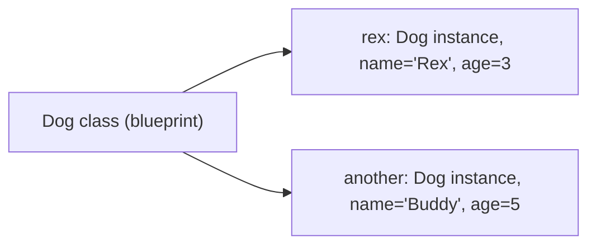
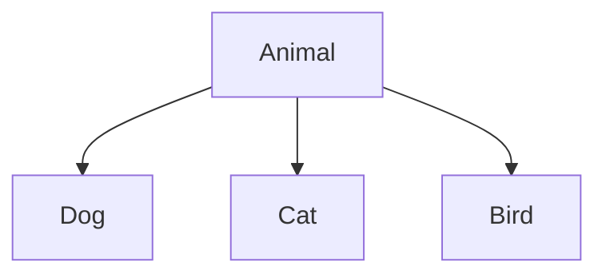

# Python OOP — Classes, Inheritance, Magic Methods & Dataclasses

!!! info "Prerequisites"
    [Python Fundamentals, Control Flow & Collections](fundamentals-control-flow-collections-deep-dive.md), [Python Functions](functions-deep-dive.md).

## 1. The Problem

Functions alone are great for stateless logic, but many real problems involve **state that persists and changes together with behavior that operates on it** — a bank account with a balance and a `withdraw` method, a game character with health and an `attack` method. OOP bundles data and behavior into one unit.

## 2. Intuition

A class is a blueprint; an object (instance) is one concrete thing built from that blueprint. "Dog" the concept is a class; your actual dog Rex, with his own name and age, is an instance.

## 3. Classes and Objects

```python
class Dog:
    def __init__(self, name, age):
        self.name = name          # instance attribute
        self.age = age

    def bark(self):
        return f"{self.name} says woof!"

rex = Dog("Rex", 3)
rex.bark()   # "Rex says woof!"
```

`__init__` is the **constructor** — called automatically when you write `Dog("Rex", 3)`. `self` is the instance itself, explicitly passed as the first parameter to every instance method (Python doesn't hide this the way some languages do — it's a real parameter you must name, conventionally `self`).



## 4. Instance Variables vs Class Variables

```python
class Dog:
    species = "Canis familiaris"   # class variable — shared by ALL instances

    def __init__(self, name):
        self.name = name             # instance variable — unique per instance

rex = Dog("Rex")
buddy = Dog("Buddy")
print(rex.species is buddy.species)   # True — same shared object
print(rex.name is buddy.name)          # False — different objects
```

A class variable lives once on the class object; an instance variable lives separately on each instance. This distinction matters especially with mutable class variables (a shared default list is a classic bug source — the same mutable-default trap from the Functions chapter, one level up).

## 5. Inheritance and Polymorphism

```python
class Animal:
    def __init__(self, name):
        self.name = name

    def speak(self):
        raise NotImplementedError

class Dog(Animal):
    def speak(self):
        return f"{self.name} says Woof"

class Cat(Animal):
    def speak(self):
        return f"{self.name} says Meow"

for animal in [Dog("Rex"), Cat("Whiskers")]:
    print(animal.speak())   # each calls its OWN speak(), automatically
```

**Polymorphism** is exactly this: calling the same method name (`speak()`) on different types and getting type-appropriate behavior, without the caller needing to check "is this a Dog or a Cat?" first.



## 6. Encapsulation and Abstraction

```python
class BankAccount:
    def __init__(self, balance):
        self._balance = balance      # convention: leading underscore = "internal, don't touch directly"

    def withdraw(self, amount):
        if amount > self._balance:
            raise ValueError("insufficient funds")
        self._balance -= amount

    def get_balance(self):
        return self._balance
```

Python has no true "private" enforcement (unlike some languages) — a single leading underscore is a *convention* signaling "internal use," and a double leading underscore (`__balance`) triggers **name mangling** (Python internally renames it to `_ClassName__balance`) to reduce accidental collisions in subclasses, but it's still technically accessible. **Encapsulation** here means hiding the raw data behind methods that enforce rules (like "can't withdraw more than the balance"); **abstraction** means the caller only needs to know `withdraw()` exists, not how it's implemented internally.

## 7. Magic Methods (Dunder Methods)

```python
class Vector:
    def __init__(self, x, y):
        self.x, self.y = x, y

    def __add__(self, other):
        return Vector(self.x + other.x, self.y + other.y)

    def __repr__(self):
        return f"Vector({self.x}, {self.y})"

    def __eq__(self, other):
        return self.x == other.x and self.y == other.y

v1 = Vector(1, 2)
v2 = Vector(3, 4)
print(v1 + v2)     # Vector(4, 6) — dispatches to __add__, same mechanism as int + int in the Functions chapter
print(v1 == v2)     # False — dispatches to __eq__
```

This is the exact same operator-dispatch mechanism from the Python Functions chapter (`BINARY_ADD` calling `__add__`/`__radd__`) — now you're defining that behavior yourself for a custom type. Common magic methods: `__init__` (construct), `__repr__` (developer-facing string), `__str__` (user-facing string), `__len__` (`len(obj)`), `__getitem__` (`obj[i]`), `__eq__`/`__lt__` (comparisons), `__iter__`/`__next__` (iteration, covered in Part F).

## 8. Dataclasses — Less Boilerplate for Data-Holding Classes

```python
from dataclasses import dataclass

@dataclass
class Point:
    x: float
    y: float

p1 = Point(1.0, 2.0)
p2 = Point(1.0, 2.0)
print(p1 == p2)   # True — __eq__ generated automatically
print(p1)          # Point(x=1.0, y=2.0) — __repr__ generated automatically
```

`@dataclass` auto-generates `__init__`, `__repr__`, and `__eq__` for classes whose main job is holding data — eliminating the repetitive boilerplate seen in the `Vector` example above when all you need is a container of fields.

## 9. The Method Resolution Order (MRO), Briefly

```python
class A:
    def greet(self):
        return "A"

class B(A):
    def greet(self):
        return "B"

class C(A):
    pass

class D(B, C):
    pass

print(D().greet())   # "B" — Python searches D, then B, then C, then A, in that order
```

With multiple inheritance, Python resolves which class's method "wins" using the **C3 linearization algorithm** — visible via `D.__mro__`. This is worth knowing exists, even if multiple inheritance itself is used sparingly in most real code.

## Common Errors & Debugging

- Forgetting `self` as the first parameter of an instance method → `TypeError: method takes 0 positional arguments but 1 was given`.
- Using a mutable class variable (e.g., `items = []` at class level) expecting each instance to get its own — all instances share the same list unless it's created in `__init__` instead.
- Defining `__eq__` without `__hash__` → instances become unhashable by default (can't be used in a set/dict) unless `__hash__` is also defined or intentionally left as `None`.
- Deep inheritance chains making it hard to trace which class actually defines a given method — use `ClassName.__mro__` to check.

## Interview Questions

1. What is `self`, and why must you write it explicitly in every method signature?
2. What's the difference between a class variable and an instance variable, and what bug does confusing them cause?
3. How does Python achieve polymorphism without explicit type-checking?
4. What does `@dataclass` generate for you automatically?
5. What is name mangling, and why does it exist?

## Mastery Ladder

- [ ] L1 — I can define a class with `__init__` and instance methods
- [ ] L2 — I understand class vs instance variables
- [ ] L3 — I can implement inheritance and override a parent method
- [ ] L4 — N/A
- [ ] L5 — I can explain how `v1 + v2` dispatches to `__add__`
- [ ] L6 — I can debug a shared-mutable-class-variable bug
- [ ] L7 — I know when `@dataclass` is sufficient vs. needing a full custom class
- [ ] L8 — I use encapsulation (leading underscore, method-gated access) deliberately in real code
- [ ] L9 — I can answer the interview bank above cleanly
- [ ] L10 — I can trace an MRO for a multiple-inheritance hierarchy unprompted
