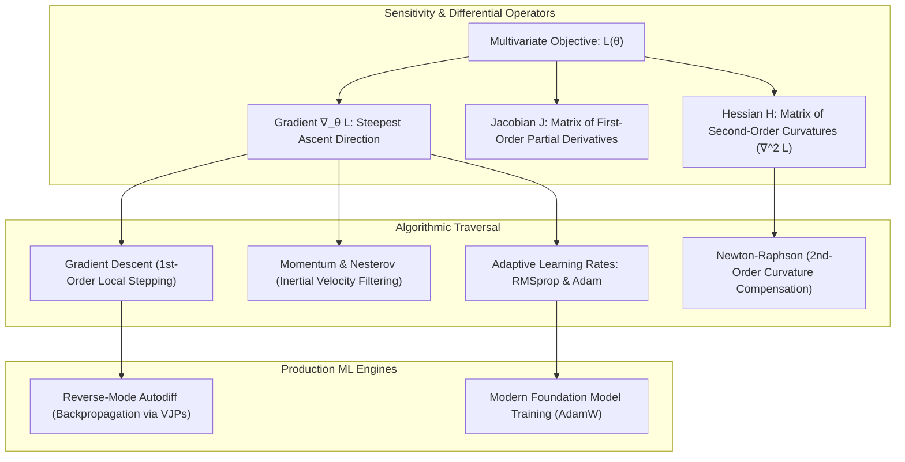
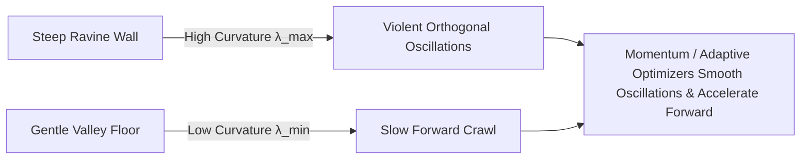
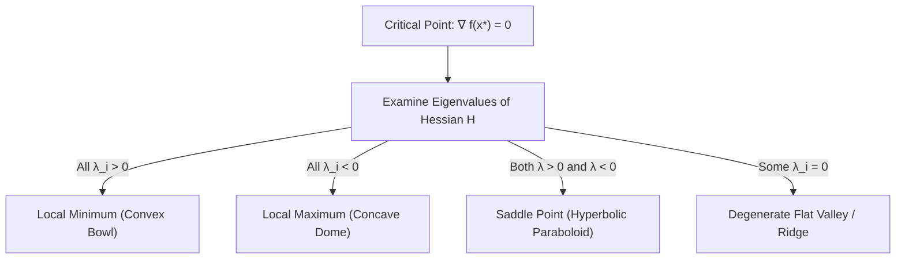
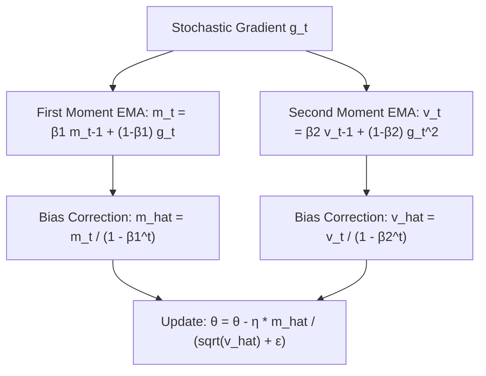

# Multivariate Calculus & Optimization — Gradients, Hessians & First/Second-Order Optimizers

!!! info "Prerequisites"
    Multivariate functions, vector spaces, dot products, and matrix operations. See [Mathematical Foundations](foundations-math-deep-dive.md) and [Linear Algebra](linear-algebra-deep-dive.md).

---

## 1. The Big Picture

All machine learning models learn by adjusting parameters to minimize an objective function. **Calculus** provides the mathematical lens to measure sensitivity: *if I nudge this weight by an infinitesimal amount, in which direction and by how much will the loss change?* **Optimization** provides the navigational algorithms that use these sensitivity measurements to traverse high-dimensional, non-convex loss surfaces toward optimal parameter configurations.



Without an exact understanding of gradients, Jacobians, Hessians, and optimizer dynamics, machine learning practitioners struggle to debug vanishing/exploding gradients, ill-conditioned training ravines, saddle point stalls, and optimizer-regularizer interactions.

---

## 2. Intuition & Real-World Framing

### Traversing a Foggy Mountain at Midnight

Imagine standing on a rugged mountain range in complete darkness with dense fog. You cannot see the global valley below; you can only feel the slope of the ground directly beneath your feet with your boots.

1. **Gradient ($\nabla f$)**: The direction of steepest uphill slope. To descend, you take a step in the exact opposite direction: $-\nabla f$.
2. **Learning Rate ($\eta$)**: The length of the stride you take. If your stride is too small, you will take years to reach the base. If your stride is too large, you will leap blindly across valleys and crash into opposing peaks.
3. **Hessian ($H$)**: The curvature of the terrain. Is the slope flattening out into a wide plateau, curving up into a bowl, or dropping away into a treacherous, knife-edge gorge?
4. **Ill-conditioned Ravines**: A canyon whose walls are thousands of times steeper than the gentle downward slope along the valley floor. Standard gradient descent bounces violently back and forth between the steep canyon walls, making virtually zero forward progress down the riverbed.



---

## 3. Differential Calculus: Limits, Gradients, Jacobians, and Hessians

### 3.1 The Limit and Single-Variable Derivative

For a scalar function $f: \mathbb{R} \to \mathbb{R}$, the derivative $f'(x)$ is the instantaneous rate of change:

$$
f'(x) = \lim_{h \to 0} \frac{f(x + h) - f(x)}{h}
$$

### 3.2 Partial Derivatives and the Gradient Vector

For a multivariable function $f: \mathbb{R}^d \to \mathbb{R}$, the partial derivative with respect to coordinate $x_i$ holds all other coordinates fixed:

$$
\frac{\partial f}{\partial x_i} = \lim_{h \to 0} \frac{f(x_1, \dots, x_i + h, \dots, x_d) - f(x_1, \dots, x_d)}{h}
$$

The **gradient** $\nabla f(\mathbf{x}) \in \mathbb{R}^d$ gathers all $d$ first-order partial derivatives into a vector:

$$
\nabla f(\mathbf{x}) = \begin{bmatrix} \frac{\partial f}{\partial x_1} \\ \frac{\partial f}{\partial x_2} \\ \vdots \\ \frac{\partial f}{\partial x_d} \end{bmatrix}
$$

#### Fundamental Properties of the Gradient:
1. **Direction of Steepest Ascent**: The directional derivative $D_{\mathbf{u}} f(\mathbf{x}) = \nabla f(\mathbf{x})^T \mathbf{u}$ along a unit direction $\|\mathbf{u}\|_2 = 1$ is maximized when $\mathbf{u} = \frac{\nabla f(\mathbf{x})}{\|\nabla f(\mathbf{x})\|_2}$.
2. **Orthogonal to Level Sets**: The gradient $\nabla f(\mathbf{x})$ is strictly perpendicular to the tangent hyperplane of the contour surface $f(\mathbf{x}) = c$ at point $\mathbf{x}$.

### 3.3 The Jacobian Matrix

When a function maps a vector to a vector, $\mathbf{f}: \mathbb{R}^n \to \mathbb{R}^m$, the first-order partial derivatives form an $m \times n$ matrix called the **Jacobian** $J \in \mathbb{R}^{m \times n}$:

$$
J = \frac{\partial \mathbf{f}}{\partial \mathbf{x}} = \begin{bmatrix}
\frac{\partial f_1}{\partial x_1} & \frac{\partial f_1}{\partial x_2} & \cdots & \frac{\partial f_1}{\partial x_n} \\
\frac{\partial f_2}{\partial x_1} & \frac{\partial f_2}{\partial x_2} & \cdots & \frac{\partial f_2}{\partial x_n} \\
\vdots & \vdots & \ddots & \vdots \\
\frac{\partial f_m}{\partial x_1} & \frac{\partial f_m}{\partial x_2} & \cdots & \frac{\partial f_m}{\partial x_n}
\end{bmatrix}, \qquad J_{ij} = \frac{\partial f_i}{\partial x_j}
$$

### 3.4 The Hessian Matrix

For a scalar function $f: \mathbb{R}^d \to \mathbb{R}$, the matrix of all second-order partial derivatives is the **Hessian** $H \in \mathbb{R}^{d \times d}$:

$$
H_{ij} = \frac{\partial^2 f}{\partial x_i \partial x_j}
$$

By **Schwarz's Theorem** (Clairaut's Theorem), if the second partial derivatives are continuous, the order of differentiation does not matter:

$$
\frac{\partial^2 f}{\partial x_i \partial x_j} = \frac{\partial^2 f}{\partial x_j \partial x_i} \implies H = H^T
$$

The Hessian is always a **real symmetric matrix**, meaning it can be orthogonally diagonalized per the [Spectral Theorem](linear-algebra-deep-dive.md#62-spectral-theorem-for-real-symmetric-matrices):

$$
H = Q \Lambda Q^T = \sum_{i=1}^d \lambda_i \mathbf{q}_i \mathbf{q}_i^T
$$

#### Curvature Classification at Critical Points ($\nabla f(\mathbf{x}^*) = \mathbf{0}$):
- **Local Minimum**: $H \succ 0$ (Strictly Positive Definite, all $\lambda_i > 0$). The surface curves upward in all directions.
- **Local Maximum**: $H \prec 0$ (Strictly Negative Definite, all $\lambda_i < 0$). The surface curves downward in all directions.
- **Saddle Point**: $H$ is **indefinite** (has both positive and negative eigenvalues, $\lambda_{\max} > 0$ and $\lambda_{\min} < 0$). The surface curves up along some directions and down along others.



---

## 4. Taylor Series Approximations and Convexity

### 4.1 Multivariate Taylor Expansions

Any smooth function $f: \mathbb{R}^d \to \mathbb{R}$ can be approximated locally around point $\mathbf{x}_0$ by its Taylor series:

$$
f(\mathbf{x}_0 + \Delta \mathbf{x}) = \underbrace{f(\mathbf{x}_0)}_{\text{0th-Order}} + \underbrace{\nabla f(\mathbf{x}_0)^T \Delta \mathbf{x}}_{\text{1st-Order (Linear)}} + \underbrace{\frac{1}{2} \Delta \mathbf{x}^T H(\mathbf{x}_0) \Delta \mathbf{x}}_{\text{2nd-Order (Quadratic)}} + \mathcal{O}(\|\Delta \mathbf{x}\|^3)
$$

- **First-Order Methods (Gradient Descent)** use the linear approximation:
  $$f(\mathbf{x}_0 + \Delta \mathbf{x}) \approx f(\mathbf{x}_0) + \nabla f(\mathbf{x}_0)^T \Delta \mathbf{x}$$
- **Second-Order Methods (Newton's Method)** use the full quadratic model including the Hessian:
  $$m(\Delta \mathbf{x}) = f(\mathbf{x}_0) + \nabla f(\mathbf{x}_0)^T \Delta \mathbf{x} + \frac{1}{2} \Delta \mathbf{x}^T H(\mathbf{x}_0) \Delta \mathbf{x}$$

### 4.2 Mathematical Convexity

A set $\mathcal{C} \subseteq \mathbb{R}^d$ is convex if for all $\mathbf{x}, \mathbf{y} \in \mathcal{C}$ and $\theta \in [0, 1]$:

$$
\theta \mathbf{x} + (1 - \theta) \mathbf{y} \in \mathcal{C}
$$

A function $f: \mathcal{C} \to \mathbb{R}$ is **convex** if:

$$
f(\theta \mathbf{x} + (1 - \theta)\mathbf{y}) \le \theta f(\mathbf{x}) + (1 - \theta) f(\mathbf{y}) \quad \forall \mathbf{x}, \mathbf{y} \in \mathcal{C}, \; \theta \in [0, 1]
$$

#### Equivalent First- and Second-Order Characterizations:
1. **First-Order Condition**: $f$ is convex if and only if the tangent hyperplane always lies below the function:
   $$f(\mathbf{y}) \ge f(\mathbf{x}) + \nabla f(\mathbf{x})^T (\mathbf{y} - \mathbf{x}) \quad \forall \mathbf{x}, \mathbf{y}$$
2. **Second-Order Condition**: A twice-differentiable function is convex if and only if its Hessian is positive semi-definite everywhere:
   $$\nabla^2 f(\mathbf{x}) \succeq 0 \quad \forall \mathbf{x} \in \mathcal{C}$$

**Fundamental Property of Convex Functions:** Any local minimum of a convex function is guaranteed to be a **global minimum**.

---

## 5. Reverse-Mode Automatic Differentiation & Computational Graphs

How do deep learning frameworks compute exact gradients for millions of parameters without symbolic expression explosion or numerical approximation error? Through **Reverse-Mode Automatic Differentiation** (Backpropagation).

### 5.1 The Multivariate Chain Rule

Let $y = f(u_1, u_2, \dots, u_k)$, where each intermediate variable $u_j = g_j(x)$ depends on scalar input $x$. The chain rule states:

$$
\frac{dy}{dx} = \sum_{j=1}^k \frac{\partial y}{\partial u_j} \frac{\partial u_j}{\partial x}
$$

In vector notation, if $\mathbf{y} = \mathbf{f}(\mathbf{u})$ and $\mathbf{u} = \mathbf{g}(\mathbf{x})$:

$$
\frac{\partial \mathbf{y}}{\partial \mathbf{x}} = \frac{\partial \mathbf{y}}{\partial \mathbf{u}} \frac{\partial \mathbf{u}}{\partial \mathbf{x}} = J_{\mathbf{f}} J_{\mathbf{g}}
$$

### 5.2 Forward-Mode vs. Reverse-Mode Autodiff

Consider a function $\mathbf{f}: \mathbb{R}^n \to \mathbb{R}^m$:
- **Forward-Mode (Jacobian-Vector Products - JVPs)**: Propagates derivatives $\frac{\partial v}{\partial x_{\text{in}}}$ forward from inputs to outputs alongside function evaluation. Computing the full Jacobian requires $n$ forward passes (one per input dimension).
- **Reverse-Mode (Vector-Jacobian Products - VJPs)**: First evaluates all operations forward (recording the DAG and intermediate values), then sweeps **backward** from the scalar loss $L \in \mathbb{R}$ to all inputs.

In machine learning, we optimize a **single scalar loss** $L \in \mathbb{R}$ with respect to $P = 10^9$ parameters ($n = 10^9, m = 1$).
- Forward mode requires $10^9$ forward passes.
- Reverse mode requires **exactly ONE backward pass**!

```mermaid
flowchart LR
    subgraph Forward Pass (Evaluation)
        X["Inputs: x1, x2"] --> N1["Node v1 = x1 * x2"]
        N1 --> N2["Node v2 = sin(v1)"]
        N2 --> L["Scalar Loss L = v2 + x1"]
    end
    subgraph Backward Pass (Adjoint Propagation)
        L_adj["dL/dL = 1.0"] --> N2_adj["dL/dv2 = 1.0"]
        N2_adj --> N1_adj["dL/dv1 = cos(v1) * dL/dv2"]
        N1_adj --> X_adj["dL/dx1, dL/dx2 via VJPs"]
    end
```

### 5.3 Matrix Backpropagation Equations

For a fully connected linear layer $\mathbf{Y} = \mathbf{X} \mathbf{W} + \mathbf{b}$, where $\mathbf{X} \in \mathbb{R}^{B \times d_{\text{in}}}$, $\mathbf{W} \in \mathbb{R}^{d_{\text{in}} \times d_{\text{out}}}$, and $\mathbf{b} \in \mathbb{R}^{d_{\text{out}}}$, given incoming upstream gradient $\frac{\partial L}{\partial \mathbf{Y}} \in \mathbb{R}^{B \times d_{\text{out}}}$:

$$
\frac{\partial L}{\partial \mathbf{W}} = \mathbf{X}^T \left( \frac{\partial L}{\partial \mathbf{Y}} \right) \in \mathbb{R}^{d_{\text{in}} \times d_{\text{out}}}
$$

$$
\frac{\partial L}{\partial \mathbf{X}} = \left( \frac{\partial L}{\partial \mathbf{Y}} \right) \mathbf{W}^T \in \mathbb{R}^{B \times d_{\text{in}}}
$$

$$
\frac{\partial L}{\partial \mathbf{b}} = \sum_{i=1}^B \left( \frac{\partial L}{\partial \mathbf{Y}} \right)_{i, :} = \mathbf{1}^T \left( \frac{\partial L}{\partial \mathbf{Y}} \right) \in \mathbb{R}^{d_{\text{out}}}
$$

Notice the exact transposition patterns: inner dimensions align naturally with tensor contractions.

---

## 6. Optimization Algorithms: From SGD to Adam

### 6.1 Stochastic Gradient Descent (SGD)

The base update rule using noisy mini-batch gradient $\mathbf{g}_t = \nabla_\theta L_B(\boldsymbol{\theta}_t)$:

$$
\boldsymbol{\theta}_{t+1} = \boldsymbol{\theta}_t - \eta \mathbf{g}_t
$$

### 6.2 SGD with Classical Momentum (Polyak Heavy Ball)

Momentum simulates a physical particle with mass rolling down the loss surface, accumulating velocity $\mathbf{v}_t$:

$$
\mathbf{v}_t = \beta \mathbf{v}_{t-1} + \eta \mathbf{g}_t
$$

$$
\boldsymbol{\theta}_{t+1} = \boldsymbol{\theta}_t - \mathbf{v}_t
$$

where $\beta \in [0.9, 0.99]$ is the momentum decay coefficient. Momentum cancels high-frequency orthogonal oscillations in narrow ravines while compounding consistent forward momentum.

### 6.3 RMSprop (Root Mean Square Propagation)

RMSprop scales the gradient coordinate-wise by the running exponential average of squared gradients, equalizing step sizes across steep and flat dimensions:

$$
\mathbf{s}_t = \gamma \mathbf{s}_{t-1} + (1 - \gamma) \mathbf{g}_t^2
$$

$$
\boldsymbol{\theta}_{t+1} = \boldsymbol{\theta}_t - \frac{\eta}{\sqrt{\mathbf{s}_t} + \epsilon} \odot \mathbf{g}_t
$$

where $\odot$ denotes elementwise Hadamard multiplication, $\gamma \approx 0.99$, and $\epsilon = 10^{-8}$.

### 6.4 Adam (Adaptive Moment Estimation)

Adam combines the advantages of Momentum (first moment $\mathbf{m}_t$) and RMSprop (second moment $\mathbf{v}_t$).

#### Algorithm Equations:
1. Update biased first moment estimate:
   $$\mathbf{m}_t = \beta_1 \mathbf{m}_{t-1} + (1 - \beta_1) \mathbf{g}_t$$
2. Update biased second raw moment estimate:
   $$\mathbf{v}_t = \beta_2 \mathbf{v}_{t-1} + (1 - \beta_2) \mathbf{g}_t^2$$
3. Compute bias-corrected first moment:
   $$\hat{\mathbf{m}}_t = \frac{\mathbf{m}_t}{1 - \beta_1^t}$$
4. Compute bias-corrected second moment:
   $$\hat{\mathbf{v}}_t = \frac{\mathbf{v}_t}{1 - \beta_2^t}$$
5. Apply parameter update:
   $$\boldsymbol{\theta}_{t+1} = \boldsymbol{\theta}_t - \frac{\eta}{\sqrt{\hat{\mathbf{v}}_t} + \epsilon} \odot \hat{\mathbf{m}}_t$$

Standard default hyperparameters: $\eta = 0.001$, $\beta_1 = 0.9$, $\beta_2 = 0.999$, $\epsilon = 10^{-8}$.



### 6.5 Full Derivation of Adam's Bias Corrections

Why are the denominators $1 - \beta_1^t$ and $1 - \beta_2^t$ necessary?

At time $t=0$, moments are initialized to zero: $\mathbf{m}_0 = \mathbf{0}, \mathbf{v}_0 = \mathbf{0}$. Unrolling the recursive equation for $\mathbf{m}_t$:

$$
\mathbf{m}_1 = (1 - \beta_1) \mathbf{g}_1
$$

$$
\mathbf{m}_2 = \beta_1 \mathbf{m}_1 + (1 - \beta_1) \mathbf{g}_2 = \beta_1 (1 - \beta_1) \mathbf{g}_1 + (1 - \beta_1) \mathbf{g}_2
$$

By induction, at step $t$:

$$
\mathbf{m}_t = (1 - \beta_1) \sum_{i=1}^t \beta_1^{t - i} \mathbf{g}_i
$$

Now take mathematical expectations of both sides, assuming the true gradients $\mathbf{g}_i$ come from a stationary distribution with true mean $\mathbb{E}[\mathbf{g}_i] = \mathbb{E}[\mathbf{g}]$:

$$
\mathbb{E}[\mathbf{m}_t] = \mathbb{E}\left[ (1 - \beta_1) \sum_{i=1}^t \beta_1^{t - i} \mathbf{g}_i \right] = (1 - \beta_1) \sum_{i=1}^t \beta_1^{t - i} \mathbb{E}[\mathbf{g}]
$$

The summation is a finite geometric series:

$$
\sum_{i=1}^t \beta_1^{t - i} = \sum_{k=0}^{t-1} \beta_1^k = \frac{1 - \beta_1^t}{1 - \beta_1}
$$

Substitute this sum back:

$$
\mathbb{E}[\mathbf{m}_t] = (1 - \beta_1) \cdot \left( \frac{1 - \beta_1^t}{1 - \beta_1} \right) \mathbb{E}[\mathbf{g}] = (1 - \beta_1^t) \mathbb{E}[\mathbf{g}]
$$

Notice that for early timesteps (e.g., $t=1$, $\beta_1 = 0.9$):

$$\mathbb{E}[\mathbf{m}_1] = (1 - 0.9^1) \mathbb{E}[\mathbf{g}] = 0.1 \mathbb{E}[\mathbf{g}]$$

The uncorrected moment is biased toward zero by a factor of 10!
To make the estimator strictly unbiased ($\mathbb{E}[\hat{\mathbf{m}}_t] = \mathbb{E}[\mathbf{g}]$), we must divide by $(1 - \beta_1^t)$:

$$
\hat{\mathbf{m}}_t = \frac{\mathbf{m}_t}{1 - \beta_1^t}
$$

The exact same algebraic derivation applies to the second raw moment $\mathbf{v}_t$, giving $\hat{\mathbf{v}}_t = \frac{\mathbf{v}_t}{1 - \beta_2^t}$.

### 6.6 Second-Order Optimization: Newton-Raphson

Using the quadratic Taylor expansion:

$$
m(\Delta \mathbf{x}) = f(\mathbf{x}_t) + \nabla f(\mathbf{x}_t)^T \Delta \mathbf{x} + \frac{1}{2} \Delta \mathbf{x}^T H(\mathbf{x}_t) \Delta \mathbf{x}
$$

To find the minimum of this quadratic surrogate, take the gradient with respect to $\Delta \mathbf{x}$ and set it to $\mathbf{0}$:

$$
\nabla_{\Delta \mathbf{x}} m(\Delta \mathbf{x}) = \nabla f(\mathbf{x}_t) + H(\mathbf{x}_t) \Delta \mathbf{x} = \mathbf{0}
$$

$$
\Delta \mathbf{x}^* = - [H(\mathbf{x}_t)]^{-1} \nabla f(\mathbf{x}_t)
$$

The **Newton-Raphson parameter update** is:

$$
\mathbf{x}_{t+1} = \mathbf{x}_t - [H(\mathbf{x}_t)]^{-1} \nabla f(\mathbf{x}_t)
$$

#### Why Newton's Method is Impractical for Deep Learning:
1. **Computational Complexity**: For a model with $P = 10^9$ parameters, the Hessian contains $P^2 = 10^{18}$ entries (requiring 4 exabytes of memory). Inverting $H$ costs $\mathcal{O}(P^3) \approx 10^{27}$ FLOPs per step!
2. **Saddle Point Attraction**: If $\mathbf{x}_t$ is near a saddle point where $H$ has negative eigenvalues, Newton's method jumps aggressively toward the saddle point (or toward local maxima), whereas gradient descent naturally flows away along negative curvature.

---

## 7. Python Implementation: Autodiff Engine & 2D Optimizer Suite

Below is a complete, runnable script featuring:
1. A micro **Scalar Autodiff Engine** (`Value`) building dynamic computational DAGs.
2. From-scratch optimizers: **SGD**, **Momentum**, **RMSprop**, and **Adam**.
3. Benchmark optimization on the notorious non-convex **Beale Function** ($f(x, y) = (1.5 - x + xy)^2 + (2.25 - x + xy^2)^2 + (2.625 - x + xy^3)^2$, global minimum at $(3.0, 0.5)$).

```python
"""
calculus_optimization_deep_dive.py
Reverse-mode automatic differentiation engine and 2D optimizer suite.
"""

from typing import List, Set, Tuple
import math
import numpy as np


class Value:
    """
    Scalar node in a computational graph supporting reverse-mode autodiff.
    """
    def __init__(self, data: float, _children: Tuple["Value", ...] = (), _op: str = ""):
        self.data = float(data)
        self.grad = 0.0
        self._backward = lambda: None
        self._prev = set(_children)
        self._op = _op

    def __repr__(self) -> str:
        return f"Value(data={self.data:.4f}, grad={self.grad:.4f})"

    def __add__(self, other) -> "Value":
        other = other if isinstance(other, Value) else Value(other)
        out = Value(self.data + other.data, (self, other), "+")

        def _backward():
            self.grad += 1.0 * out.grad
            other.grad += 1.0 * out.grad
        out._backward = _backward
        return out

    def __mul__(self, other) -> "Value":
        other = other if isinstance(other, Value) else Value(other)
        out = Value(self.data * other.data, (self, other), "*")

        def _backward():
            self.grad += other.data * out.grad
            other.grad += self.data * out.grad
        out._backward = _backward
        return out

    def __pow__(self, other: float) -> "Value":
        assert isinstance(other, (int, float)), "Power only supports numeric exponents"
        out = Value(self.data ** other, (self,), f"**{other}")

        def _backward():
            self.grad += (other * (self.data ** (other - 1))) * out.grad
        out._backward = _backward
        return out

    def __sub__(self, other) -> "Value":
        return self + (-other)

    def __neg__(self) -> "Value":
        return self * -1.0

    def backward(self):
        """Topological sort sweep for reverse-mode automatic differentiation."""
        topo: List[Value] = []
        visited: Set[Value] = set()

        def build_topo(v: Value):
            if v not in visited:
                visited.add(v)
                for child in v._prev:
                    build_topo(child)
                topo.append(v)

        build_topo(self)
        self.grad = 1.0
        for node in reversed(topo):
            node._backward()


# ---------------------------------------------------------
# Non-Convex Benchmark Function: Beale Function
# ---------------------------------------------------------
def beale_loss(x: float, y: float) -> Tuple[float, float, float]:
    """
    Evaluates Beale function and analytic gradients:
    f(x, y) = (1.5 - x + x*y)^2 + (2.25 - x + x*y^2)^2 + (2.625 - x + x*y^3)^2
    Global minimum: f(3.0, 0.5) = 0.0
    """
    # Term 1
    t1 = 1.5 - x + x * y
    dt1_dx = -1.0 + y
    dt1_dy = x

    # Term 2
    t2 = 2.25 - x + x * (y ** 2)
    dt2_dx = -1.0 + y ** 2
    dt2_dy = 2.0 * x * y

    # Term 3
    t3 = 2.625 - x + x * (y ** 3)
    dt3_dx = -1.0 + y ** 3
    dt3_dy = 3.0 * x * (y ** 2)

    val = t1**2 + t2**2 + t3**2
    grad_x = 2.0 * t1 * dt1_dx + 2.0 * t2 * dt2_dx + 2.0 * t3 * dt3_dx
    grad_y = 2.0 * t1 * dt1_dy + 2.0 * t2 * dt2_dy + 2.0 * t3 * dt3_dy

    return val, grad_x, grad_y


# ---------------------------------------------------------
# Optimizer Implementations
# ---------------------------------------------------------
def optimize_2d(optimizer: str, lr: float = 0.01, steps: int = 500) -> Tuple[float, float, float]:
    """Runs a 2D optimization on Beale function starting from (1.5, 1.5)."""
    x, y = 1.5, 1.5

    # Momentum state
    vx, vy = 0.0, 0.0
    beta = 0.9

    # RMSprop / Adam state
    sx, sy = 0.0, 0.0
    gamma = 0.99
    eps = 1e-8

    # Adam moments
    mx, my = 0.0, 0.0
    beta1, beta2 = 0.9, 0.999

    for t in range(1, steps + 1):
        loss, gx, gy = beale_loss(x, y)

        if optimizer == "sgd":
            x -= lr * gx
            y -= lr * gy

        elif optimizer == "momentum":
            vx = beta * vx + lr * gx
            vy = beta * vy + lr * gy
            x -= vx
            y -= vy

        elif optimizer == "rmsprop":
            sx = gamma * sx + (1.0 - gamma) * (gx ** 2)
            sy = gamma * sy + (1.0 - gamma) * (gy ** 2)
            x -= (lr / (math.sqrt(sx) + eps)) * gx
            y -= (lr / (math.sqrt(sy) + eps)) * gy

        elif optimizer == "adam":
            mx = beta1 * mx + (1.0 - beta1) * gx
            my = beta1 * my + (1.0 - beta1) * gy
            sx = beta2 * sx + (1.0 - beta2) * (gx ** 2)
            sy = beta2 * sy + (1.0 - beta2) * (gy ** 2)

            # Bias correction
            mx_hat = mx / (1.0 - beta1 ** t)
            my_hat = my / (1.0 - beta1 ** t)
            sx_hat = sx / (1.0 - beta2 ** t)
            sy_hat = sy / (1.0 - beta2 ** t)

            x -= (lr / (math.sqrt(sx_hat) + eps)) * mx_hat
            y -= (lr / (math.sqrt(sy_hat) + eps)) * my_hat

    final_loss, _, _ = beale_loss(x, y)
    return x, y, final_loss


# ---------------------------------------------------------
# Verification & Execution
# ---------------------------------------------------------
if __name__ == "__main__":
    print("=== Testing Micro-Autodiff Engine ===")
    x_val = Value(2.0)
    y_val = Value(3.0)
    # f(x, y) = x^2 * y + x * y^2
    f_val = (x_val ** 2) * y_val + x_val * (y_val ** 2)
    f_val.backward()

    # Analytic: df/dx = 2xy + y^2 = 2(2)(3) + 9 = 21
    #           df/dy = x^2 + 2xy = 4 + 2(2)(3) = 16
    print(f"Value f: {f_val.data:.4f} (Expected: 30.0)")
    print(f"df/dx:   {x_val.grad:.4f} (Expected: 21.0)")
    print(f"df/dy:   {y_val.grad:.4f} (Expected: 16.0)\n")

    print("=== Benchmarking 2D Optimizers on Beale Surface ===")
    print("Target Global Minimum: x = 3.0, y = 0.5, Loss = 0.0")
    for opt in ["sgd", "momentum", "rmsprop", "adam"]:
        lr = 0.05 if opt in ("rmsprop", "adam") else 0.001
        res_x, res_y, loss = optimize_2d(opt, lr=lr, steps=1000)
        print(f"[{opt.upper():8s}] Final (x, y): ({res_x:.4f}, {res_y:.4f}) | Loss: {loss:.6e}")
```

---

## 8. Common Errors & Debugging

| Bug / Phenomenon | Root Cause | Diagnosis Method | Production Fix |
|---|---|---|---|
| **Vanishing Gradients** | Backpropagating through dozens of saturated activations ($\sigma' \approx 0$) shrinks gradients exponentially: $\|\nabla_\theta L\| \to 0$. | Monitor layer-by-layer gradient norms in TensorBoard or Weights & Biases. | Use residual skip connections (ResNets), Layer Normalization, and non-saturating activations (ReLU, GELU). |
| **Exploding Gradients** | Repeatedly multiplying weight matrices with spectral norm $\sigma_{\max}(W) > 1$ creates exponentially large gradients, causing `inf`/`NaN`. | Check for sudden `NaN` losses or monitor $\|\mathbf{g}_t\|_2 > 10^3$. | Apply **Gradient Clipping**: $\mathbf{g} \leftarrow \mathbf{g} \cdot \min\left(1, \frac{C}{\|\mathbf{g}\|_2}\right)$. |
| **Saddle Point Stalling** | Gradient is near zero ($\|\nabla L\| \approx 0$), but Hessian has negative eigenvalues (escapable downhill direction). | Optimizer loss plateaus at a high value for hundreds of iterations. | Add stochastic noise (mini-batch noise), momentum, or adaptive learning rates (Adam). |
| **Adam Divergence / Overshooting** | Learning rate $\eta$ is too high during early training before moment estimates $\hat{\mathbf{v}}_t$ stabilize. | Loss spikes to `inf` during the first few hundred steps. | Use a **Learning Rate Warmup Schedule** (linearly increasing $\eta$ from 0 to target over initial steps). |
| **L2 Regularization vs. Weight Decay Bug** | Adding $\frac{1}{2}\lambda \|\mathbf{w}\|^2$ to loss in Adam penalizes weights inversely proportional to adaptive gradient scale $\sqrt{\mathbf{v}_t}$. | Weights with large frequent gradients are under-regularized. | Use **AdamW** (decoupled weight decay): apply direct parameter shrinkage $\boldsymbol{\theta} \leftarrow \boldsymbol{\theta}(1 - \eta \lambda)$ outside the momentum update. |

---

## 9. Staff-Level Technical Interview Questions

### Q1: Prove the bias correction formulas for both the first and second moments in the Adam optimizer.
**Model Answer:**
Adam initializes moments to $\mathbf{m}_0 = \mathbf{0}$ and $\mathbf{v}_0 = \mathbf{0}$.
Unrolling the first moment recurrence relation $\mathbf{m}_t = \beta_1 \mathbf{m}_{t-1} + (1 - \beta_1) \mathbf{g}_t$:
$$\mathbf{m}_t = (1 - \beta_1) \sum_{i=1}^t \beta_1^{t - i} \mathbf{g}_i$$
Taking expectations of both sides under the assumption that the true stochastic gradients $\mathbf{g}_i$ share a constant expectation $\mathbb{E}[\mathbf{g}_i] = \mathbb{E}[\mathbf{g}]$:
$$\mathbb{E}[\mathbf{m}_t] = \mathbb{E}\left[ (1 - \beta_1) \sum_{i=1}^t \beta_1^{t - i} \mathbf{g}_i \right] = (1 - \beta_1) \left( \sum_{i=1}^t \beta_1^{t - i} \right) \mathbb{E}[\mathbf{g}]$$
The sum is a finite geometric progression: $\sum_{k=0}^{t-1} \beta_1^k = \frac{1 - \beta_1^t}{1 - \beta_1}$. Substituting this in:
$$\mathbb{E}[\mathbf{m}_t] = (1 - \beta_1) \cdot \frac{1 - \beta_1^t}{1 - \beta_1} \cdot \mathbb{E}[\mathbf{g}] = (1 - \beta_1^t) \mathbb{E}[\mathbf{g}]$$
To make the estimator unbiased ($\mathbb{E}[\hat{\mathbf{m}}_t] = \mathbb{E}[\mathbf{g}]$), we divide by $(1 - \beta_1^t)$:
$$\hat{\mathbf{m}}_t = \frac{\mathbf{m}_t}{1 - \beta_1^t}$$
The second moment follows the identical recurrence $\mathbf{v}_t = (1 - \beta_2) \sum_{i=1}^t \beta_2^{t-i} \mathbf{g}_i^2$. Assuming stationary second moment $\mathbb{E}[\mathbf{g}_i^2] = \mathbb{E}[\mathbf{g}^2]$, the sum evaluates to $\frac{1 - \beta_2^t}{1 - \beta_2}$, yielding $\mathbb{E}[\mathbf{v}_t] = (1 - \beta_2^t) \mathbb{E}[\mathbf{g}^2]$. Thus, the bias-corrected second moment is $\hat{\mathbf{v}}_t = \frac{\mathbf{v}_t}{1 - \beta_2^t}$.

---

### Q2: Explain the fundamental difference between forward-mode and reverse-mode automatic differentiation. When is reverse-mode computationally superior?
**Model Answer:**
Consider a function $\mathbf{f}: \mathbb{R}^n \to \mathbb{R}^m$.
- **Forward-Mode AD** applies the chain rule from the inside out (from inputs to outputs). It computes **Jacobian-Vector Products (JVPs)**, evaluating $\nabla_{\mathbf{x}} v_i$ concurrently with the primal value $v_i$. To obtain the full $m \times n$ Jacobian, forward mode must be evaluated $n$ times (once per unit basis vector $\mathbf{e}_j \in \mathbb{R}^n$).
- **Reverse-Mode AD** evaluates the function forward, records the execution graph (tape/DAG), and then propagates derivatives from the outside in (from outputs back to inputs) using **Vector-Jacobian Products (VJPs)**. Computing gradients with respect to all $n$ inputs requires $m$ backward sweeps.

**ML Superiority:**
In deep learning, the loss function maps millions of parameters to a single scalar objective ($n \approx 10^7 \text{ to } 10^{11}$, $m = 1$).
- Forward mode would require $10^{11}$ full network evaluations to get the gradient vector!
- Reverse mode requires **a single forward pass and a single backward pass**, running in $\mathcal{O}(1)$ relative to parameter count $n$. Hence, reverse-mode autodiff is fundamentally necessary for training modern deep models.

---

### Q3: What is a saddle point, why are saddle points vastly more prevalent than local minima in high-dimensional deep learning loss surfaces, and how do second-order methods behave near them?
**Model Answer:**
A saddle point $\mathbf{x}^*$ is a stationary point ($\nabla f(\mathbf{x}^*) = \mathbf{0}$) where the Hessian $H(\mathbf{x}^*)$ is indefinite—possessing both strictly positive eigenvalues ($\lambda > 0$, local minimum along that eigenvector) and strictly negative eigenvalues ($\lambda < 0$, local maximum along that eigenvector).

**Prevalence in High Dimensions ($d \gg 1$):**
Dauphin et al. (2014) showed that for a non-convex function in $d$ dimensions, the probability of a critical point being a true local minimum requires all $d$ eigenvalues of the Hessian to be simultaneously positive. If each eigenvalue has independent sign probability $\approx 0.5$, the probability of a critical point being a local minimum scales as $2^{-d}$. In a network with $d = 10^7$, the ratio of saddle points to local minima is astronomical: almost all zero-gradient points are saddle points.

**Second-Order Newton Failure:**
The Newton update is $\Delta \mathbf{x} = - H^{-1} \nabla f$. Near a saddle point where $\nabla f \approx \mathbf{0}$, if an eigenvalue $\lambda_i < 0$, Newton's method steps in the direction that *maximizes* the objective along that eigenvector (jumping toward the saddle point), actively trapping the optimization. In contrast, first-order gradient descent with stochastic noise or momentum escapes saddle points because negative curvature directions naturally accelerate downhill.

---

### Q4: Derive the second-order Taylor expansion of a multivariate function. How does Newton-Raphson optimization utilize the Hessian, and why is exact Newton's method impractical in deep learning?
**Model Answer:**
The second-order multivariate Taylor expansion of $f(\mathbf{x})$ around $\mathbf{x}_t$ for a displacement $\Delta \mathbf{x}$ is:
$$f(\mathbf{x}_t + \Delta \mathbf{x}) \approx m(\Delta \mathbf{x}) = f(\mathbf{x}_t) + \nabla f(\mathbf{x}_t)^T \Delta \mathbf{x} + \frac{1}{2} \Delta \mathbf{x}^T H(\mathbf{x}_t) \Delta \mathbf{x}$$
Differentiating $m(\Delta \mathbf{x})$ with respect to $\Delta \mathbf{x}$ and setting the derivative to zero:
$$\nabla_{\Delta \mathbf{x}} m(\Delta \mathbf{x}) = \nabla f(\mathbf{x}_t) + H(\mathbf{x}_t) \Delta \mathbf{x} = \mathbf{0} \implies H(\mathbf{x}_t) \Delta \mathbf{x} = -\nabla f(\mathbf{x}_t)$$
If $H$ is invertible, the optimal step is $\Delta \mathbf{x}^* = - [H(\mathbf{x}_t)]^{-1} \nabla f(\mathbf{x}_t)$.

**Why Impractical in Deep Learning:**
1. **Memory Complexity:** For $P$ parameters, $H \in \mathbb{R}^{P \times P}$. For $P = 10^8$, storing $H$ in float32 requires $4 \times 10^{16}$ bytes ($40$ Petabytes).
2. **Computational Inversion Cost:** Solving $H \Delta \mathbf{x} = -\mathbf{g}$ via Cholesky or LU decomposition requires $\mathcal{O}(P^3)$ operations per step.
3. **Non-Convexity Instability:** In deep nets, $H$ is rarely positive definite. Inverting an indefinite Hessian leads directly to saddle points or local maxima.

---

### Q5: What is the condition number of the Hessian matrix at a local minimum, and how does it affect the convergence rate of first-order Gradient Descent?
**Model Answer:**
At a local minimum $\mathbf{x}^*$ with strictly positive definite Hessian $H \succ 0$, the condition number is:
$$\kappa(H) = \frac{\lambda_{\max}(H)}{\lambda_{\min}(H)} \ge 1$$
For a quadratic objective $f(\mathbf{x}) = \frac{1}{2} \mathbf{x}^T H \mathbf{x}$, standard Gradient Descent with optimal learning rate $\eta = \frac{2}{\lambda_{\max} + \lambda_{\min}}$ exhibits the linear convergence bound:
$$\|\mathbf{x}_k - \mathbf{x}^*\|_H \le \left( \frac{\kappa(H) - 1}{\kappa(H) + 1} \right)^k \|\mathbf{x}_0 - \mathbf{x}^*\|_H$$
- When $\kappa(H) \approx 1$ (isotropic, circular contours), $\frac{\kappa - 1}{\kappa + 1} \approx 0$, converging in a single step.
- When $\kappa(H) \gg 1$ (e.g., $\kappa = 10^4$, highly ill-conditioned ravine), $\frac{\kappa - 1}{\kappa + 1} \approx 1 - \frac{2}{\kappa} = 0.9998$. Gradient descent crawls, oscillating violently along the eigenvector of $\lambda_{\max}$ while making virtually zero progress along the eigenvector of $\lambda_{\min}$. This necessitates adaptive optimizers (Adam) or batch normalization to condition the landscape.

---

### Q6: Derive the matrix calculus backpropagation equations for a dense linear layer $Y = XW + b$.
**Model Answer:**
Let $\mathbf{X} \in \mathbb{R}^{B \times d_{\text{in}}}$, $\mathbf{W} \in \mathbb{R}^{d_{\text{in}} \times d_{\text{out}}}$, and $\mathbf{b} \in \mathbb{R}^{d_{\text{out}}}$, giving $\mathbf{Y} = \mathbf{X} \mathbf{W} + \mathbf{1} \mathbf{b}^T \in \mathbb{R}^{B \times d_{\text{out}}}$.
Let the incoming upstream gradient from the scalar loss $L$ be $\mathbf{G} = \frac{\partial L}{\partial \mathbf{Y}} \in \mathbb{R}^{B \times d_{\text{out}}}$, where $G_{ij} = \frac{\partial L}{\partial Y_{ij}}$.

1. **Gradient with respect to weights $\mathbf{W}$:**
   By chain rule:
   $$\frac{\partial L}{\partial W_{jk}} = \sum_{i=1}^B \frac{\partial L}{\partial Y_{ik}} \frac{\partial Y_{ik}}{\partial W_{jk}}$$
   Since $Y_{ik} = \sum_{l} X_{il} W_{lk} + b_k$, we have $\frac{\partial Y_{ik}}{\partial W_{jk}} = X_{ij}$.
   $$\frac{\partial L}{\partial W_{jk}} = \sum_{i=1}^B X_{ij} G_{ik} = \sum_{i=1}^B (X^T)_{ji} G_{ik} = (\mathbf{X}^T \mathbf{G})_{jk} \implies \frac{\partial L}{\partial \mathbf{W}} = \mathbf{X}^T \mathbf{G}$$

2. **Gradient with respect to inputs $\mathbf{X}$:**
   $$\frac{\partial L}{\partial X_{ij}} = \sum_{k=1}^{d_{\text{out}}} \frac{\partial L}{\partial Y_{ik}} \frac{\partial Y_{ik}}{\partial X_{ij}} = \sum_{k=1}^{d_{\text{out}}} G_{ik} W_{jk} = \sum_{k=1}^{d_{\text{out}}} G_{ik} (W^T)_{kj} = (\mathbf{G} \mathbf{W}^T)_{ij} \implies \frac{\partial L}{\partial \mathbf{X}} = \mathbf{G} \mathbf{W}^T$$

3. **Gradient with respect to bias $\mathbf{b}$:**
   $$\frac{\partial L}{\partial b_k} = \sum_{i=1}^B \frac{\partial L}{\partial Y_{ik}} \frac{\partial Y_{ik}}{\partial b_k} = \sum_{i=1}^B G_{ik} \cdot 1 \implies \frac{\partial L}{\partial \mathbf{b}} = \sum_{i=1}^B \mathbf{G}_{i, :} = \mathbf{1}^T \mathbf{G}$$

---

### Q7: Explain why standard L2 regularization interacts poorly with adaptive optimizers like Adam, and how AdamW resolves this.
**Model Answer:**
In standard L2 regularization, an extra penalty term $\frac{1}{2} \lambda \|\boldsymbol{\theta}\|^2$ is added directly to the loss function:
$$L_{\text{reg}}(\boldsymbol{\theta}) = L(\boldsymbol{\theta}) + \frac{1}{2} \lambda \|\boldsymbol{\theta}\|^2 \implies \nabla L_{\text{reg}}(\boldsymbol{\theta}) = \mathbf{g}_t + \lambda \boldsymbol{\theta}_t$$
In standard SGD, this yields the intended weight decay:
$$\boldsymbol{\theta}_{t+1} = \boldsymbol{\theta}_t - \eta (\mathbf{g}_t + \lambda \boldsymbol{\theta}_t) = (1 - \eta \lambda) \boldsymbol{\theta}_t - \eta \mathbf{g}_t$$
However, in **Adam**, the regularized gradient is fed into the second moment $\mathbf{v}_t$:
$$\mathbf{v}_t = \beta_2 \mathbf{v}_{t-1} + (1 - \beta_2) (\mathbf{g}_t + \lambda \boldsymbol{\theta}_t)^2$$
The parameter update becomes:
$$\boldsymbol{\theta}_{t+1} = \boldsymbol{\theta}_t - \frac{\eta}{\sqrt{\hat{\mathbf{v}}_t} + \epsilon} (\hat{\mathbf{m}}_t + \lambda \boldsymbol{\theta}_t)$$
**The Pathology:**
Parameters with large, frequent historical gradients have huge $\hat{\mathbf{v}}_t$. Their effective weight decay penalty $\frac{\eta \lambda}{\sqrt{\hat{\mathbf{v}}_t}}$ is heavily suppressed! Conversely, parameters with sparse or small gradients receive disproportionately large regularization.

**The AdamW Solution (Loshchilov & Hutter, 2017):**
Decouple weight decay entirely from gradient moment estimation. The loss gradient $\mathbf{g}_t = \nabla L(\boldsymbol{\theta}_t)$ enters Adam's moments purely, and weight decay is applied as a direct parameter contraction:
$$\boldsymbol{\theta}_{t+1} = \boldsymbol{\theta}_t(1 - \eta \lambda) - \frac{\eta}{\sqrt{\hat{\mathbf{v}}_t} + \epsilon} \hat{\mathbf{m}}_t$$
This ensures uniform weight decay rate $\eta \lambda$ across all parameters regardless of gradient history.

---

## 10. Mastery Ladder

Complete this checklist to verify your depth in calculus and optimization for ML:

- [ ] **L1:** You can compute partial derivatives, gradients, and directional derivatives by hand.
- [ ] **L2:** You can write out the Jacobian matrix for arbitrary vector-valued functions $\mathbf{f}: \mathbb{R}^n \to \mathbb{R}^m$.
- [ ] **L3:** You can construct the Hessian matrix and classify stationary points as local minima, maxima, or saddle points using eigenvalue signs.
- [ ] **L4:** You can state the mathematical definition of convexity and verify it via the second-order Hessian condition ($\nabla^2 f \succeq 0$).
- [ ] **L5:** You can explain the algorithmic difference between forward-mode (JVPs) and reverse-mode (VJPs) automatic differentiation.
- [ ] **L6:** You can derive matrix backpropagation equations for a fully connected dense layer ($\frac{\partial L}{\partial W} = X^T G, \frac{\partial L}{\partial X} = G W^T$).
- [ ] **L7:** You can implement a working scalar automatic differentiation engine (`Value`) with topological sort DAG evaluation from scratch.
- [ ] **L8:** You can derive the exact bias correction formulas $\frac{1}{1-\beta_1^t}$ and $\frac{1}{1-\beta_2^t}$ in the Adam optimizer.
- [ ] **L9:** You can explain how the condition number of the Hessian $\kappa(H)$ bounds the linear convergence rate of first-order gradient descent.
- [ ] **L10:** You can mathematically explain the distinction between L2 regularization and decoupled weight decay in AdamW.
