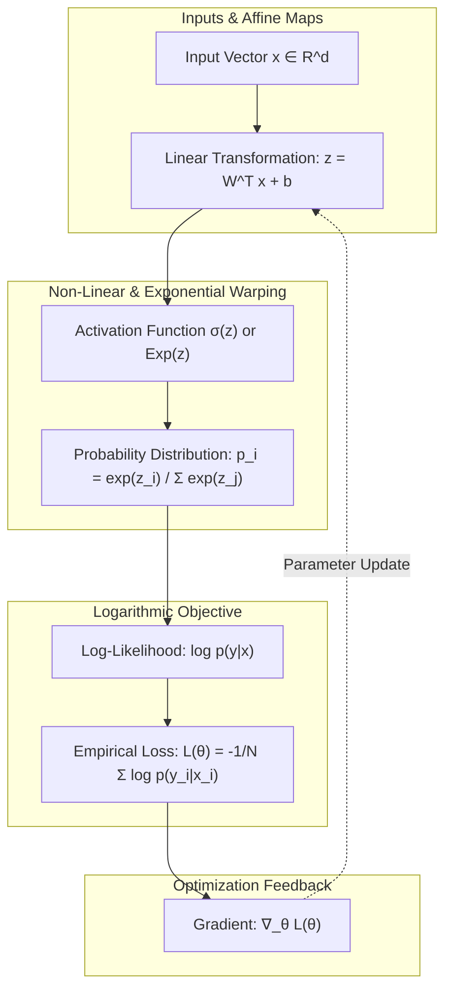
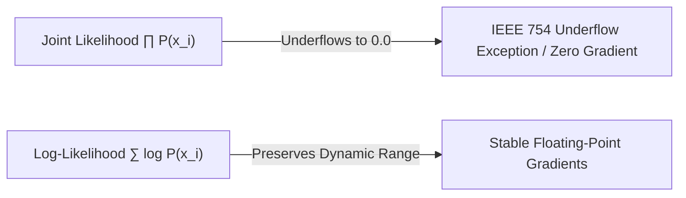
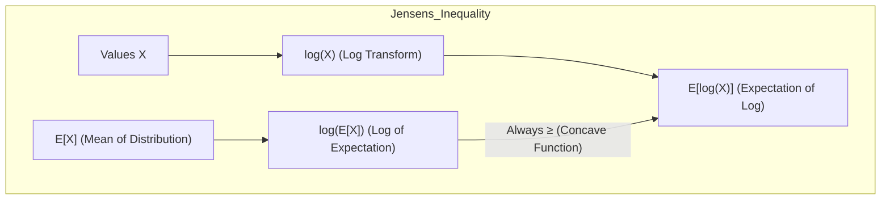
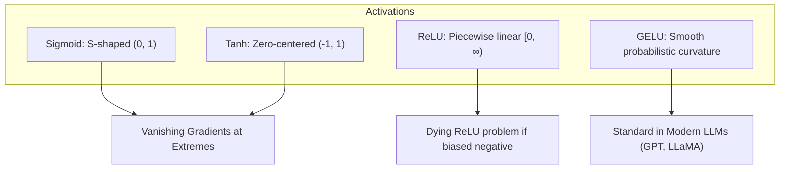
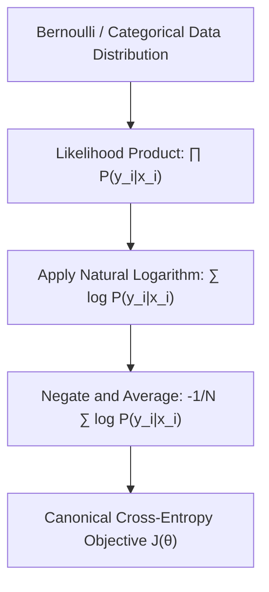
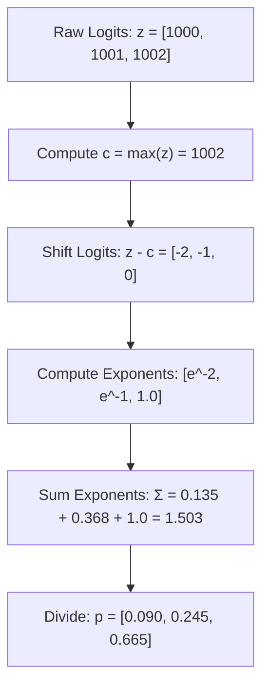

# Mathematical Foundations for Machine Learning

!!! info "Prerequisites"
    Basic Python and arithmetic operations. See [Python Fundamentals](../01-python/fundamentals-control-flow-collections-deep-dive.md), [Python Functions](../01-python/functions-deep-dive.md), and [Arrays & Memory](../00-computer-science/arrays-deep-dive.md).

---

## 1. The Big Picture

Every machine learning model is an algebraic composition of mathematical functions. When a neural network processes an image, a gradient boosted tree predicts customer churn, or a linear regressor estimates real estate valuations, the core computation boils down to three primary mathematical primitives:

1. **Mapping functions**: Transforming input representations $\mathbf{x} \in \mathbb{R}^d$ into latent spaces or target predictions $\hat{\mathbf{y}} \in \mathbb{R}^k$.
2. **Exponential and logarithmic scaling**: Compressing unbounded real numbers into well-behaved probability distributions (Softmax) and converting multi-variable multiplicative joint likelihoods into tractable additive sums (Log-Likelihood).
3. **Loss formulations**: Quantifying prediction errors through convex geometric distance metrics and divergence measurements.

Without absolute mastery over algebraic identities, function graphs, logarithmic properties, and numerical precision limits in floating-point representations, practitioners frequently produce models that suffer from silent `NaN` gradient crashes, catastrophic cancellation, numerical underflow, and ill-posed objective surfaces.



---

## 2. Intuition & Real-World Framing

### Why ML Lives in Log-Space

In classical algebra, you learn that $\log(ab) = \log(a) + \log(b)$. In high school, this is introduced as a computational convenience for slide rules. In machine learning and deep learning, **this single identity prevents modern artificial intelligence systems from crashing to zero**.

Consider evaluating the likelihood of an independent and identically distributed (i.i.d.) dataset of $N = 100{,}000$ tokens in an autoregressive language model:

$$
P(X) = \prod_{i=1}^N P(x_i \mid x_{<i})
$$

If each conditional probability $P(x_i \mid x_{<i})$ is roughly $0.05$:

$$
P(X) \approx (0.05)^{100{,}000} \approx 10^{-130{,}103}
$$

Standard 64-bit IEEE 754 floating-point numbers underflow to absolute zero at approximately $10^{-308}$ (`DBL_MIN` $\approx 2.22 \times 10^{-308}$). In 32-bit floating point (standard GPU tensor precision), underflow occurs at roughly $10^{-38}$. Naively multiplying probabilities instantly zeroes out the likelihood, yields zero gradients, and terminates training.

By transforming the objective into the logarithmic domain:

$$
\log P(X) = \sum_{i=1}^N \log P(x_i \mid x_{<i}) \approx 100{,}000 \times \log(0.05) \approx -299{,}573.2
$$

The value $-299{,}573.2$ fits comfortably into standard 32-bit floating point numbers (range up to $\approx \pm 3.4 \times 10^{38}$). Furthermore, the derivative of a sum is the sum of derivatives, drastically simplifying backpropagation.



---

## 3. Formal Mathematical Foundations

### 3.1 Arithmetic, Algebra, and Summation Notation

Machine learning notation relies heavily on multi-index summations, products, and vector-scalar contractions.

#### Summation Identities
For any sequences $a_i, b_i$ and constant $c \in \mathbb{R}$:

$$
\sum_{i=1}^N c = N \cdot c, \qquad \sum_{i=1}^N c \cdot a_i = c \sum_{i=1}^N a_i
$$

$$
\sum_{i=1}^N (a_i + b_i) = \sum_{i=1}^N a_i + \sum_{i=1}^N b_i
$$

Double summations over separable products factorize cleanly:

$$
\sum_{i=1}^N \sum_{j=1}^M a_i b_j = \left( \sum_{i=1}^N a_i \right) \left( \sum_{j=1}^M b_j \right)
$$

### 3.2 Equations, Inequalities, and Bounds

Machine learning theory (e.g., generalization bounds, convergence rates, and variational approximations) relies fundamentally on inequalities.

#### Cauchy-Schwarz Inequality
For any vectors $\mathbf{u}, \mathbf{v} \in \mathbb{R}^d$:

$$
|\mathbf{u}^T \mathbf{v}| \le \|\mathbf{u}\|_2 \|\mathbf{v}\|_2
$$

Equality holds if and only if $\mathbf{u}$ and $\mathbf{v}$ are linearly dependent ($\mathbf{u} = \alpha \mathbf{v}$ for some scalar $\alpha$).

#### Arithmetic Mean - Geometric Mean (AM-GM) Inequality
For non-negative real numbers $a_1, a_2, \dots, a_n \ge 0$:

$$
\frac{1}{n} \sum_{i=1}^n a_i \ge \left( \prod_{i=1}^n a_i \right)^{\frac{1}{n}}
$$

#### Jensen's Inequality
Let $f: \mathbb{R} \to \mathbb{R}$ be a convex function (such that $f''(\cdot) \ge 0$). For any random variable $X$:

$$
f(\mathbb{E}[X]) \le \mathbb{E}[f(X)]
$$

Conversely, if $g$ is strictly concave (such as the natural logarithm $g(x) = \log x$ for $x > 0$):

$$
\mathbb{E}[\log X] \le \log(\mathbb{E}[X])
$$

This concave form of Jensen's inequality is the exact mathematical foundation of the **Evidence Lower Bound (ELBO)** in Variational Autoencoders (VAEs) and the Expectation-Maximization (EM) algorithm:

$$
\log p_\theta(\mathbf{x}) = \log \int p_\theta(\mathbf{x}, \mathbf{z}) d\mathbf{z} = \log \mathbb{E}_{q_\phi(\mathbf{z}|\mathbf{x})}\left[ \frac{p_\theta(\mathbf{x}, \mathbf{z})}{q_\phi(\mathbf{z}|\mathbf{x})} \right] \ge \mathbb{E}_{q_\phi(\mathbf{z}|\mathbf{x})}\left[ \log \frac{p_\theta(\mathbf{x}, \mathbf{z})}{q_\phi(\mathbf{z}|\mathbf{x})} \right]
$$



---

## 4. Functions, Graphs, and Model Activation Profiles

A mathematical function $f: \mathcal{X} \to \mathcal{Y}$ maps elements from domain $\mathcal{X}$ to codomain $\mathcal{Y}$. In machine learning, functions must balance expressivity (non-linearity) with optimization tractability (smooth gradients, bounded values).

### 4.1 Classical Activation Functions

| Function Name | Mathematical Formula | Codomain / Range | First Derivative $f'(x)$ | Saturation Behavior |
|---|---|---|---|---|
| **Linear** | $f(x) = x$ | $(-\infty, \infty)$ | $f'(x) = 1$ | Never saturates |
| **Sigmoid ($\sigma$)** | $\sigma(x) = \frac{1}{1 + e^{-x}}$ | $(0, 1)$ | $\sigma(x)(1 - \sigma(x))$ | Saturates as $x \to \pm\infty$ ($\sigma' \to 0$) |
| **Hyperbolic Tangent ($\tanh$)** | $\tanh(x) = \frac{e^x - e^{-x}}{e^x + e^{-x}}$ | $(-1, 1)$ | $1 - \tanh^2(x)$ | Saturates as $x \to \pm\infty$ ($\tanh' \to 0$) |
| **ReLU** | $\text{ReLU}(x) = \max(0, x)$ | $[0, \infty)$ | $H(x) = \begin{cases} 1 & x > 0 \\ 0 & x < 0 \end{cases}$ | Saturates (dies) for $x < 0$ |
| **Leaky ReLU** | $\text{LReLU}(x) = \max(\alpha x, x)$ | $(-\infty, \infty)$ | $\begin{cases} 1 & x > 0 \\ \alpha & x < 0 \end{cases}$ | Constant gradient $\alpha$ for $x < 0$ |
| **GELU** | $x \Phi(x) = x P(X \le x)$ | $[-0.17, \infty)$ | Smooth probabilistic gating | Smooth non-monotonic minimum |



### 4.2 Derivation: Sigmoid Derivative Identity
The derivative of the logistic sigmoid function $\sigma(z) = \frac{1}{1 + e^{-z}} = (1 + e^{-z})^{-1}$:

$$
\frac{d}{dz}\sigma(z) = -1(1 + e^{-z})^{-2} \cdot (-e^{-z}) = \frac{e^{-z}}{(1 + e^{-z})^2}
$$

Splitting the numerator:

$$
\frac{d}{dz}\sigma(z) = \left(\frac{1}{1 + e^{-z}}\right) \left(\frac{e^{-z}}{1 + e^{-z}}\right) = \left(\frac{1}{1 + e^{-z}}\right) \left(\frac{1 + e^{-z} - 1}{1 + e^{-z}}\right)
$$

$$
\frac{d}{dz}\sigma(z) = \sigma(z) (1 - \sigma(z))
$$

Notice that when $|z| \ge 5$, $\sigma(z) \approx 0$ or $\sigma(z) \approx 1$, meaning $\sigma'(z) \to 0$. In deep networks, chaining this derivative across multiple layers causes gradients to vanish exponentially.

---

## 5. Exponents, Logarithms, and Information Theory

### 5.1 Formal Properties of Exponents & Logarithms

For $b > 0, b \ne 1$, and $x, y > 0$:

1. $b^x \cdot b^y = b^{x+y}$
2. $(b^x)^y = b^{xy}$
3. $\log_b(xy) = \log_b(x) + \log_b(y)$
4. $\log_b\left(\frac{x}{y}\right) = \log_b(x) - \log_b(y)$
5. $\log_b(x^k) = k \log_b(x)$
6. Change of base: $\log_a(x) = \frac{\log_b(x)}{\log_b(a)}$

In machine learning and statistical computing, $\log$ universally denotes the natural logarithm with base $e$ ($\ln$), unless an explicit subscript indicates base 2 (used in information theory for bits/shannons) or base 10.

### 5.2 Derivation: Cross-Entropy from Maximum Likelihood

Why is cross-entropy the universal classification loss? Let us derive it directly from probability foundations.

Suppose we observe an independent dataset $\mathcal{D} = \{(\mathbf{x}_i, y_i)\}_{i=1}^N$, where each label $y_i \in \{1, \dots, K\}$ follows a categorical distribution parameterized by model weights $\boldsymbol{\theta}$. The model outputs conditional class probabilities:

$$
P(Y = k \mid \mathbf{x}_i; \boldsymbol{\theta}) = p_{i, k}
$$

Using one-hot target indicators $\mathbf{y}_i \in \{0, 1\}^K$ where $y_{i, k} = 1$ if sample $i$ belongs to class $k$ and $0$ otherwise, the likelihood for a single sample is:

$$
P(\mathbf{y}_i \mid \mathbf{x}_i; \boldsymbol{\theta}) = \prod_{k=1}^K (p_{i, k})^{y_{i, k}}
$$

For the entire i.i.d. dataset, the total joint likelihood is:

$$
\mathcal{L}(\boldsymbol{\theta}) = \prod_{i=1}^N \prod_{k=1}^K (p_{i, k})^{y_{i, k}}
$$

To make this computationally tractable for optimization, take the natural logarithm:

$$
\ell(\boldsymbol{\theta}) = \log \mathcal{L}(\boldsymbol{\theta}) = \sum_{i=1}^N \sum_{k=1}^K y_{i, k} \log(p_{i, k})
$$

Maximizing the log-likelihood is equivalent to minimizing the negative log-likelihood (NLL). Normalizing by sample size $N$ gives the canonical **Categorical Cross-Entropy Loss**:

$$
J(\boldsymbol{\theta}) = -\frac{1}{N} \sum_{i=1}^N \sum_{k=1}^K y_{i, k} \log(p_{i, k})
$$

For binary classification ($K=2$, $y \in \{0, 1\}$, $p = \sigma(z)$), this collapses to **Binary Cross-Entropy (BCE)**:

$$
J_{\text{BCE}}(\boldsymbol{\theta}) = -\frac{1}{N} \sum_{i=1}^N \Big[ y_i \log(p_i) + (1 - y_i) \log(1 - p_i) \Big]
$$



---

## 6. Numerical Precision: Softmax and LogSumExp

### 6.1 The Softmax Explosion Problem

The Softmax function converts an unconstrained logit vector $\mathbf{z} = [z_1, z_2, \dots, z_K]^T \in \mathbb{R}^K$ into a probability simplex:

$$
\text{softmax}(\mathbf{z})_i = \frac{e^{z_i}}{\sum_{j=1}^K e^{z_j}}
$$

If any $z_j > 709.78$ in standard IEEE 754 float64 (or $z_j > 88.72$ in float32):

$$
e^{z_j} \to \infty \quad (\text{Overflow to } \texttt{+inf})
$$

Evaluating $\frac{\infty}{\infty}$ immediately yields `NaN` (Not a Number), polluting every weight in the network.

Conversely, if all $z_j \ll 0$ (e.g., $z_j = -1000$ in float32), all numerators become $0.0$, producing $\frac{0}{0} = \texttt{NaN}$.

### 6.2 Proof of Shift Invariance

The Softmax function is strictly invariant to adding an arbitrary scalar constant $c \in \mathbb{R}$ to all elements of $\mathbf{z}$:

$$
\text{softmax}(\mathbf{z} + c)_i = \frac{e^{z_i + c}}{\sum_{j=1}^K e^{z_j + c}} = \frac{e^{z_i} \cdot e^c}{\sum_{j=1}^K (e^{z_j} \cdot e^c)} = \frac{e^{z_i} \cdot e^c}{e^c \sum_{j=1}^K e^{z_j}} = \frac{e^{z_i}}{\sum_{j=1}^K e^{z_j}} = \text{softmax}(\mathbf{z})_i
$$

### 6.3 The Stabilized Softmax Algorithm

By setting $c = -\max_k(z_k)$, every exponent is non-positive:

$$
z_i - \max_k(z_k) \le 0 \quad \implies \quad 0 < e^{z_i - \max_k(z_k)} \le 1
$$

This guarantees that:

1. No exponent ever exceeds $e^0 = 1$ (overflow is physically impossible).
2. At least one term in the denominator is $e^0 = 1$, ensuring $\sum_{j=1}^K e^{z_j - c} \ge 1 > 0$ (division by zero is physically impossible).



### 6.4 The LogSumExp (LSE) Trick

When evaluating the log-softmax or cross-entropy directly from logits:

$$
\log(\text{softmax}(\mathbf{z})_i) = \log\left(\frac{e^{z_i}}{\sum_j e^{z_j}}\right) = z_i - \log\left(\sum_{j=1}^K e^{z_j}\right)
$$

The term $\log\left(\sum_j e^{z_j}\right)$ is known as **LogSumExp**. Evaluating it naively causes the same overflow. We stabilize it using the identical max-shift identity:

$$
\log\left(\sum_{j=1}^K e^{z_j}\right) = \log\left(\sum_{j=1}^K e^{z_j - c} \cdot e^c\right) = \log\left(e^c \sum_{j=1}^K e^{z_j - c}\right) = c + \log\left(\sum_{j=1}^K e^{z_j - c}\right)
$$

where $c = \max_j(z_j)$.

---

## 7. Python Implementation: From Scratch & Numerical Stability

Below is a production-grade, vectorized implementation comparing naive, vulnerable mathematical formulations with stabilized numerical routines.

```python
"""
mathematical_foundations.py
Production-grade implementations of fundamental mathematical transforms,
numerical stability routines, and loss functions.
"""

from typing import Tuple
import numpy as np


def naive_softmax(z: np.ndarray) -> np.ndarray:
    """
    Naive Softmax implementation susceptible to numerical overflow.
    z shape: (batch_size, num_classes) or (num_classes,)
    """
    exp_z = np.exp(z)
    return exp_z / np.sum(exp_z, axis=-1, keepdims=True)


def stable_softmax(z: np.ndarray) -> np.ndarray:
    """
    Numerically stable Softmax utilizing the max-shift identity.
    Guaranteed no float overflow or division by zero.
    """
    # Shift logits by subtracting max along class axis
    max_z = np.max(z, axis=-1, keepdims=True)
    exp_shifted = np.exp(z - max_z)
    sum_exp = np.sum(exp_shifted, axis=-1, keepdims=True)
    return exp_shifted / sum_exp


def log_sum_exp(z: np.ndarray) -> np.ndarray:
    """
    Numerically stable LogSumExp: log(sum(exp(z))).
    Avoids intermediate overflow in sum(exp(z)).
    """
    max_z = np.max(z, axis=-1, keepdims=True)
    # If all elements in a row are -inf, max_z is -inf; handle gracefully
    max_z_finite = np.where(np.isneginf(max_z), 0.0, max_z)
    exp_shifted = np.exp(z - max_z_finite)
    sum_exp = np.sum(exp_shifted, axis=-1, keepdims=True)
    lse = max_z_finite + np.log(sum_exp)
    return np.squeeze(lse, axis=-1)


def stable_cross_entropy_from_logits(
    logits: np.ndarray, targets: np.ndarray
) -> float:
    """
    Computes Categorical Cross-Entropy directly from raw logits.
    targets: 1D array of class indices (shape: (N,))
    logits: 2D array of unnormalized logits (shape: (N, K))
    """
    batch_size = logits.shape[0]
    # LSE over classes for each sample: shape (N,)
    lse = log_sum_exp(logits)
    # Logit corresponding to the true target class
    target_logits = logits[np.arange(batch_size), targets]
    # Loss = -log(softmax(logits)[target]) = -(target_logit - LSE) = LSE - target_logit
    loss = np.mean(lse - target_logits)
    return float(loss)


def stable_binary_cross_entropy_with_logits(
    logits: np.ndarray, targets: np.ndarray
) -> float:
    """
    Numerically stable Binary Cross-Entropy from unactivated logits z.
    Formula: max(z, 0) - z * y + log(1 + exp(-|z|))
    Avoids computing sigmoid(z) which underflows/overflows at extreme z.
    """
    # Equivalent formulation of: -(y * log(sigma(z)) + (1-y) * log(1-sigma(z)))
    # z - y*z + log(1 + exp(-z)) for z >= 0
    # -y*z + log(1 + exp(z)) for z < 0
    loss = np.maximum(logits, 0) - logits * targets + np.log1p(np.exp(-np.abs(logits)))
    return float(np.mean(loss))


# ---------------------------------------------------------
# Demonstration and Verification
# ---------------------------------------------------------
if __name__ == "__main__":
    print("=== Testing Softmax Stability ===")
    extreme_logits = np.array([[1000.0, 1001.0, 1002.0],
                               [-1000.0, -1001.0, -1002.0]])

    print(f"Input Logits:\n{extreme_logits}\n")

    # Naive Softmax will emit RuntimeWarnings and produce NaNs
    with np.errstate(over="ignore", invalid="ignore"):
        naive_out = naive_softmax(extreme_logits)
    print(f"Naive Softmax Output (notice NaNs from overflow):\n{naive_out}\n")

    # Stable Softmax executes cleanly
    stable_out = stable_softmax(extreme_logits)
    print(f"Stable Softmax Output:\n{stable_out}\n")
    print(f"Row sums (must equal 1.0): {np.sum(stable_out, axis=-1)}\n")

    print("=== Testing Loss Stability ===")
    targets = np.array([2, 0])
    loss = stable_cross_entropy_from_logits(extreme_logits, targets)
    print(f"Stable Cross-Entropy Loss from extreme logits: {loss:.6f}")

    bce_logits = np.array([50.0, -50.0, 0.0])
    bce_targets = np.array([1.0, 0.0, 1.0])
    bce_loss = stable_binary_cross_entropy_with_logits(bce_logits, bce_targets)
    print(f"Stable BCE Loss from extreme logits: {bce_loss:.6f}")
```

### Verification Against Framework Implementations

In production, libraries like PyTorch and SciPy combine these operations under the hood:

```python
import torch
import torch.nn.functional as F
from scipy.special import logsumexp as scipy_lse

# PyTorch verification
pt_logits = torch.tensor([[1000.0, 1001.0, 1002.0]], dtype=torch.float32)
pt_targets = torch.tensor([2], dtype=torch.long)

pt_softmax = F.softmax(pt_logits, dim=-1)
pt_loss = F.cross_entropy(pt_logits, pt_targets)

print("PyTorch Softmax:", pt_softmax.numpy())
print("PyTorch Cross-Entropy Loss:", pt_loss.item())
```

Both our scratch implementation and PyTorch yield identical probabilities: `[0.09003, 0.24473, 0.66524]` with zero numerical degradation.

---

## 8. Common Errors & Debugging

| Bug / Phenomenon | Root Cause | Diagnosis Method | Production Fix |
|---|---|---|---|
| **`NaN` Loss in Softmax Layer** | Exponentiating raw logits with magnitude $> 88$ in float32 creates `inf`, followed by `inf / inf = NaN`. | Check `np.any(np.isnan(loss))` or `torch.autograd.set_detect_anomaly(True)`. | Apply max-shift identity: $\mathbf{z}' = \mathbf{z} - \max(\mathbf{z})$. |
| **`inf` Loss in Binary Cross-Entropy** | Model predicts exactly $p = 0.0$ or $p = 1.0$, causing $\log(0) = -\infty$. | Inspect minimum and maximum of probabilities: `min(p) == 0.0`. | Use `log_loss_with_logits` combining activation with loss, or clamp $\epsilon = 10^{-15} \le p \le 1 - 10^{-15}$. |
| **Catastrophic Cancellation** | Subtracting two large, nearly identical floating point numbers loses significant precision bits. | Check condition numbers or monitor if $x - y$ yields $0.0$ despite $x \ne y$. | Use dedicated algebraic equivalents like `np.log1p(x)` ($\log(1+x)$) and `np.expm1(x)` ($e^x - 1$). |
| **Silent Underflow to Zero in Joint Likelihood** | Multiplying thousands of un-normalized probabilities $\prod P(x_i)$. | Model probabilities decay to $0.0$ after a few dozen sequential steps. | Transform multiplicative joint likelihoods into additive sums in the log domain: $\sum \log P(x_i)$. |
| **Vanishing Gradients in Sigmoid/Tanh** | Inputs enter saturation regime $|z| > 5$, where $\sigma'(z) = \sigma(z)(1 - \sigma(z)) < 0.006$. | Track layer-by-layer gradient norms: $\|\nabla_{\mathbf{W}_l} L\| \to 0$ for early layers. | Switch hidden layer activations to ReLU/GELU; apply Layer Normalization or Batch Normalization. |

---

## 9. Staff-Level Technical Interview Questions

### Q1: Why do machine learning models optimize log-likelihood instead of raw likelihood?
**Model Answer:**
There are four primary mathematical and computational reasons:

1. **Numerical Stability (Underflow Prevention):** For an i.i.d. dataset of size $N$, the joint likelihood is a product of probabilities $\prod_{i=1}^N p(x_i \mid \theta)$. As $N$ grows, this product approaches zero exponentially, easily breaching the IEEE 754 float32 underflow limit ($\approx 1.18 \times 10^{-38}$). The logarithm converts products into sums $\sum_{i=1}^N \log p(x_i \mid \theta)$, keeping values within standard precision ranges.
2. **Computational Tractability of Derivatives:** The derivative of a sum is simply the sum of derivatives ($\frac{d}{d\theta} \sum f_i = \sum \frac{d}{d\theta} f_i$), whereas differentiating a product of $N$ terms requires the multi-term product rule, creating an $O(N^2)$ computational graph.
3. **Strict Monotonicity Preserves Extrema:** The natural logarithm is a strictly monotonically increasing function on $\mathbb{R}^+$. Therefore:
   $$\arg\max_\theta \prod_{i=1}^N p(x_i \mid \theta) = \arg\max_\theta \sum_{i=1}^N \log p(x_i \mid \theta)$$
   The exact location of the optimal parameter set $\boldsymbol{\theta}^*$ remains unchanged.

4. **Exponential Family Compatibility:** Many probability distributions (Gaussian, Bernoulli, Poisson, Exponential) belong to the exponential family $p(x \mid \eta) = h(x) \exp(\eta^T T(x) - A(\eta))$. Taking the logarithm cancels the exponential operator, transforming the log-likelihood into a linear or concave function of natural parameters, greatly simplifying optimization.

---

### Q2: Derive the exact mathematical identity that stabilizes Softmax against floating-point overflow and underflow.
**Model Answer:**
Given logit vector $\mathbf{z} \in \mathbb{R}^K$, the standard Softmax probability is:
$$p_i = \frac{e^{z_i}}{\sum_{j=1}^K e^{z_j}}$$
Let $c = \max_{j} z_j$. We multiply both numerator and denominator by $e^{-c}$:
$$p_i = \frac{e^{z_i} e^{-c}}{\left(\sum_{j=1}^K e^{z_j}\right) e^{-c}} = \frac{e^{z_i - c}}{\sum_{j=1}^K e^{z_j - c}}$$
Because $c = \max_j z_j$:

1. $z_i - c \le 0$ for all $i \in \{1, \dots, K\}$, which guarantees $e^{z_i - c} \in (0, 1]$. Hence, intermediate terms cannot overflow past $1.0$ (overflow ceiling eliminated).
2. For the maximum index $k^* = \arg\max_j z_j$, $z_{k^*} - c = 0$, so $e^0 = 1$. This guarantees the denominator $\sum_{j=1}^K e^{z_j - c} \ge 1.0 > 0$, making division by zero impossible even if all other terms underflow to zero.

---

### Q3: Derive the relationship between Shannon Entropy, Cross-Entropy, and Kullback-Leibler (KL) Divergence.
**Model Answer:**
Let $P$ be the true data distribution and $Q$ be the model distribution over discrete support $\mathcal{X}$.

1. **Shannon Entropy** measures the intrinsic uncertainty/information content of the true distribution:
   $$H(P) = -\sum_{x \in \mathcal{X}} P(x) \log P(x) = \mathbb{E}_{x \sim P}[-\log P(x)]$$

2. **Cross-Entropy** measures the expected number of bits required to encode events drawn from $P$ using an optimal code designed for $Q$:
   $$H(P, Q) = -\sum_{x \in \mathcal{X}} P(x) \log Q(x) = \mathbb{E}_{x \sim P}[-\log Q(x)]$$

3. **KL Divergence (Relative Entropy)** measures the statistical inefficiency or information lost by approximating $P$ with $Q$:
   $$D_{\text{KL}}(P \parallel Q) = \sum_{x \in \mathcal{X}} P(x) \log \frac{P(x)}{Q(x)}$$

Expanding the KL Divergence logarithm:
$$D_{\text{KL}}(P \parallel Q) = \sum_{x \in \mathcal{X}} P(x) \log P(x) - \sum_{x \in \mathcal{X}} P(x) \log Q(x) = -H(P) + H(P, Q)$$
Rearranging yields:
$$H(P, Q) = H(P) + D_{\text{KL}}(P \parallel Q)$$
Because the true data distribution $P$ is fixed with respect to model parameters $\boldsymbol{\theta}$, its entropy $H(P)$ is a constant ($0$ in the case of empirical point targets). Thus:
$$\arg\min_\theta H(P, Q_\theta) = \arg\min_\theta D_{\text{KL}}(P \parallel Q_\theta)$$
Minimizing cross-entropy is mathematically equivalent to minimizing the KL divergence between true data and model predictions.

---

### Q4: Why do we prefer the Huber loss over Mean Squared Error (MSE) and Mean Absolute Error (MAE) in robust regression?
**Model Answer:**
The Huber loss is defined as:
$$L_\delta(r) = \begin{cases} \frac{1}{2} r^2 & \text{for } |r| \le \delta \\ \delta \left(|r| - \frac{1}{2}\delta\right) & \text{for } |r| > \delta \end{cases}$$
where $r = y - \hat{y}$ is the residual.

- **Comparison to MSE ($L_2$):** For large residuals ($|r| > \delta$), MSE scales quadratically ($r^2$), which causes gradients to grow linearly ($\nabla L = r$). A single outlier with an error of $1000$ exerts a gradient of $1000$, dominating the batch update and destabilizing weights. Huber transitions to linear error for large residuals, bounding the gradient magnitude to $\pm\delta$, making it robust against outliers.
- **Comparison to MAE ($L_1$):** MAE has a constant gradient magnitude $\pm 1$ everywhere except $r = 0$, where its derivative is undefined (a subdifferential discontinuity). Near zero, MAE oscillates or requires decaying learning rates to settle. Huber loss is quadratic near zero ($|r| \le \delta$), providing smooth, continuous first derivatives ($\nabla L = r$) that diminish smoothly to zero, enabling stable convergence under gradient descent.
- At the transition point $|r| = \delta$:
  $$\lim_{|r| \to \delta^-} L_\delta(r) = \frac{1}{2}\delta^2, \quad \lim_{|r| \to \delta^+} L_\delta(r) = \delta\left(\delta - \frac{1}{2}\delta\right) = \frac{1}{2}\delta^2$$
  The function and its derivative ($\pm\delta$) are $C^1$ continuous.

---

### Q5: What is catastrophic cancellation in floating-point arithmetic, and how does it manifest in common ML formulas?
**Model Answer:**
Catastrophic cancellation occurs in finite-precision IEEE 754 arithmetic when subtracting two nearly equal floating-point numbers ($x \approx y$). Because both numbers share their leading significant bits, subtraction cancels those leading bits, leaving only the trailing bits, which are dominated by rounding noise and truncation error.

**Manifestation in ML:**

1. **Variance calculation:** The textbook formula $\text{Var}(X) = \mathbb{E}[X^2] - (\mathbb{E}[X])^2$ computes two large numbers and subtracts them. If data has high mean $\mu = 10^8$ and low variance $\sigma^2 = 1$, $\mathbb{E}[X^2] \approx 10^{16}$ and $(\mathbb{E}[X])^2 \approx 10^{16}$. In 32-bit float (24 bits of mantissa, $\approx 7$ decimal digits), both round to identical representations, producing $\text{Var}(X) = 0.0$ or even negative variance! Production libraries use **Welford's algorithm**, which computes variance online via incremental differences $(x_k - \bar{x}_{k-1})(x_k - \bar{x}_k)$.
2. **Log-prob near 1:** Evaluating $\log(1 + x)$ for $|x| \ll 1$. Floating point adds $1 + x$, immediately rounding small $x$ into the least significant bits of 1. Calling `log1p(x)` uses a Taylor expansion avoiding the explicit $+1$.

---

### Q6: Prove Jensen's inequality for a convex function of two points, and explain how it bounds the log-marginal likelihood in Variational Autoencoders.
**Model Answer:**
**Definition of Convexity:** A function $f: \mathbb{R} \to \mathbb{R}$ is convex if for all $x_1, x_2 \in \text{dom}(f)$ and any $\theta \in [0, 1]$:
$$f(\theta x_1 + (1-\theta)x_2) \le \theta f(x_1) + (1-\theta)f(x_2)$$
For a two-point discrete distribution where $X = x_1$ with probability $\theta$ and $X = x_2$ with probability $1-\theta$:
$$\mathbb{E}[X] = \theta x_1 + (1-\theta)x_2, \quad \mathbb{E}[f(X)] = \theta f(x_1) + (1-\theta)f(x_2)$$
Substituting into the definition directly yields:
$$f(\mathbb{E}[X]) \le \mathbb{E}[f(X)]$$
(By induction, this extends to any finite combination $\sum p_i = 1$ and general probability measures via measure theory).

**Application in VAEs:**
The log function is strictly concave, so reversing the inequality yields $\log \mathbb{E}[Z] \ge \mathbb{E}[\log Z]$.
In latent variable models, the marginal log-likelihood $\log p_\theta(\mathbf{x}) = \log \int p_\theta(\mathbf{x}, \mathbf{z}) d\mathbf{z}$ is intractable. We introduce an inference distribution $q_\phi(\mathbf{z} \mid \mathbf{x})$:
$$\log p_\theta(\mathbf{x}) = \log \int q_\phi(\mathbf{z} \mid \mathbf{x}) \frac{p_\theta(\mathbf{x}, \mathbf{z})}{q_\phi(\mathbf{z} \mid \mathbf{x})} d\mathbf{z} = \log \mathbb{E}_{\mathbf{z} \sim q_\phi}\left[ \frac{p_\theta(\mathbf{x}, \mathbf{z})}{q_\phi(\mathbf{z} \mid \mathbf{x})} \right]$$
Applying Jensen's inequality:
$$\log \mathbb{E}_{\mathbf{z} \sim q_\phi}\left[ \frac{p_\theta(\mathbf{x}, \mathbf{z})}{q_\phi(\mathbf{z} \mid \mathbf{x})} \right] \ge \mathbb{E}_{\mathbf{z} \sim q_\phi}\left[ \log \frac{p_\theta(\mathbf{x}, \mathbf{z})}{q_\phi(\mathbf{z} \mid \mathbf{x})} \right] \equiv \text{ELBO}(\theta, \phi)$$
The Evidence Lower Bound (ELBO) provides a computationally tractable objective whose maximization directly drives up the true marginal log-likelihood.

---

## 10. Mastery Ladder

Complete this checklist to verify your depth in mathematical foundations:

- [ ] **L1:** You can calculate multi-index summations, products, and factorizations by hand.
- [ ] **L2:** You understand the difference between IEEE 754 float16, bfloat16, float32, and float64 dynamic ranges and precision limits.
- [ ] **L3:** You can derive the first derivative of the logistic sigmoid $\sigma'(z) = \sigma(z)(1-\sigma(z))$ and hyperbolic tangent $\tanh'(z) = 1 - \tanh^2(z)$.
- [ ] **L4:** You can explain how vanishing gradients manifest when inputs to saturating activation functions exceed $|z| > 5$.
- [ ] **L5:** You can state Jensen's inequality for both convex and concave functions and sketch its geometric proof.
- [ ] **L6:** You can mathematically prove why Softmax is invariant to constant additive shifts ($z_i \to z_i - c$).
- [ ] **L7:** You can write a vectorized, numerically stabilized Softmax and LogSumExp from scratch in NumPy without using pre-built library helpers.
- [ ] **L8:** You can derive Categorical Cross-Entropy from the maximum likelihood estimation of a categorical distribution.
- [ ] **L9:** You can explain catastrophic cancellation in floating-point operations and describe Welford's algorithm for numerically stable variance calculation.
- [ ] **L10:** You can derive the relationship between KL Divergence, Shannon Entropy, and Cross-Entropy and explain why optimizing Cross-Entropy optimizes KL Divergence.
