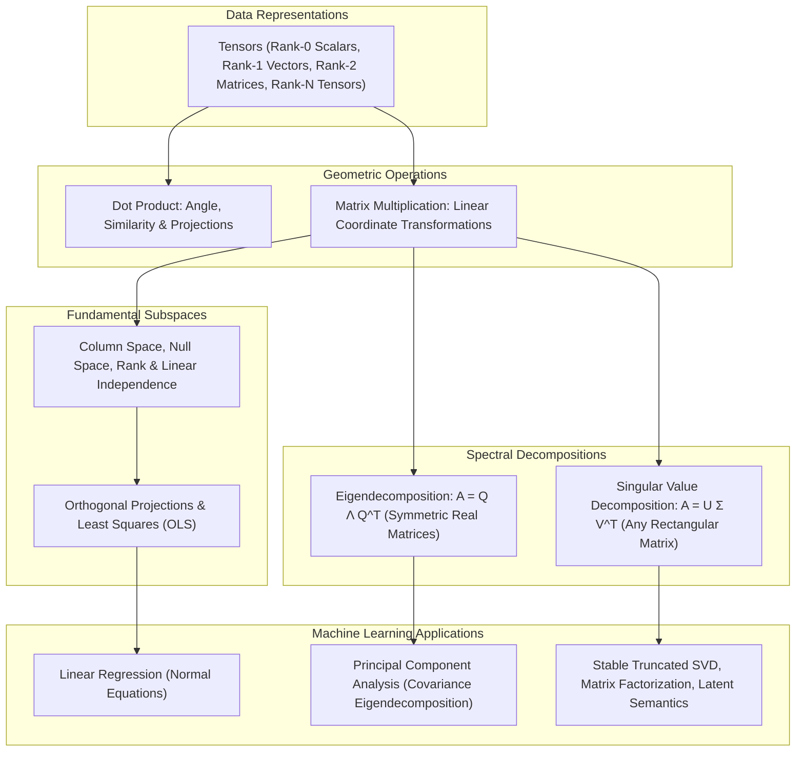
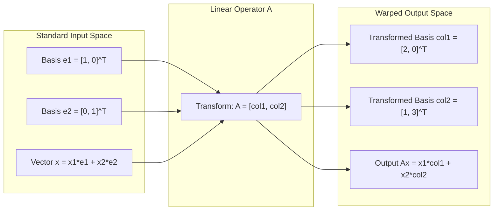
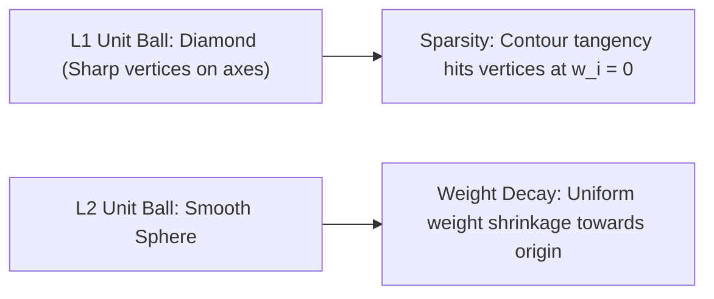
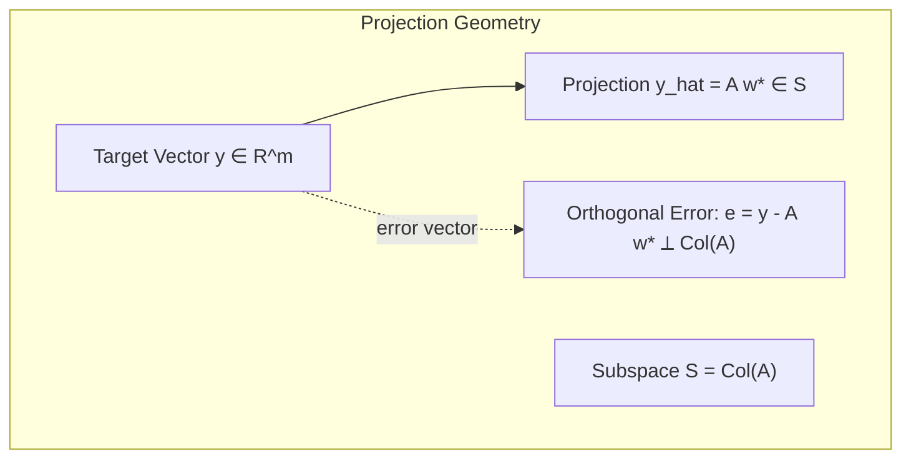
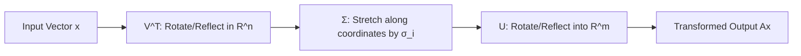
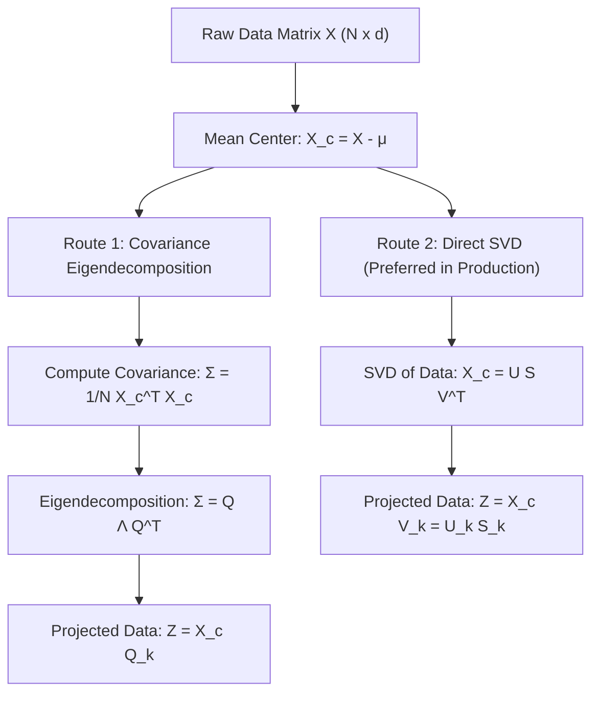

# Linear Algebra for Machine Learning — Vector Spaces, Decompositions & SVD

!!! info "Prerequisites"
    Basic algebra, functions, and arrays. See [Mathematical Foundations](foundations-math-deep-dive.md) and [Arrays & Memory](../00-computer-science/arrays-deep-dive.md).

---

## 1. The Big Picture

Linear algebra is the native language of machine learning. Almost every dataset, neural network parameter, attention mechanism, and loss calculation is expressed as operations on vectors, matrices, and multi-dimensional tensors.



Mastering linear algebra in machine learning is not merely about executing row reductions by hand; it is about developing **geometric intuition** for transformations:

- How does a linear operator rotate, stretch, or collapse geometric space?
- Which directions preserve the maximum variance of high-dimensional data?
- How do we project high-dimensional signals onto lower-dimensional subspaces while minimizing reconstruction error?

---

## 2. Intuition & Real-World Framing

### Matrix Multiplication as Dynamic Coordinate Warping

Rather than viewing matrix multiplication $A\mathbf{x}$ as a tedious mechanical sequence of dot products, view the columns of $A$ as **the new coordinate axes of the transformed space**.

Suppose the original 2D space has standard basis vectors $\mathbf{e}_1 = \begin{bmatrix} 1 \\ 0 \end{bmatrix}$ and $\mathbf{e}_2 = \begin{bmatrix} 0 \\ 1 \end{bmatrix}$. If we apply a matrix:

$$
A = \begin{bmatrix} 2 & 1 \\ 0 & 3 \end{bmatrix}
$$

The first column $\begin{bmatrix} 2 \\ 0 \end{bmatrix}$ is where $\mathbf{e}_1$ lands. The second column $\begin{bmatrix} 1 \\ 3 \end{bmatrix}$ is where $\mathbf{e}_2$ lands. Any arbitrary input vector $\mathbf{x} = \begin{bmatrix} x_1 \\ x_2 \end{bmatrix} = x_1 \mathbf{e}_1 + x_2 \mathbf{e}_2$ is linearly mapped to:

$$
A\mathbf{x} = x_1 \begin{bmatrix} 2 \\ 0 \end{bmatrix} + x_2 \begin{bmatrix} 1 \\ 3 \end{bmatrix}
$$



If the columns of $A$ collapse onto a single line, $A$ flattens 2D space into 1D (rank deficiency). Information is destroyed, the transformation cannot be inverted, and the determinant is zero.

---

## 3. Vectors, Spaces, and Fundamental Properties

### 3.1 Scalars, Vectors, Matrices, and Tensors

| Tensor Order / Rank | Mathematical Object | Notation | NumPy Shape | Example in ML |
|---|---|---|---|---|
| 0 | Scalar | $s \in \mathbb{R}$ | `()` | Learning rate $\eta$, scalar loss $L$ |
| 1 | Vector | $\mathbf{x} \in \mathbb{R}^d$ | `(d,)` | Feature vector of a single sample, bias $\mathbf{b}$ |
| 2 | Matrix | $A \in \mathbb{R}^{m \times n}$ | `(m, n)` | Weight matrix $\mathbf{W}$, dataset design matrix $\mathbf{X}$ |
| 3 | 3-Tensor | $\mathcal{T} \in \mathbb{R}^{B \times T \times D}$ | `(B, T, D)` | Transformer sequence batch (Batch, Sequence Length, Embedding Dim) |
| 4 | 4-Tensor | $\mathcal{T} \in \mathbb{R}^{B \times C \times H \times W}$ | `(B, C, H, W)` | Computer vision batch (Batch, Channels, Height, Width) |

### 3.2 Dot Product, Cosine Similarity, and Orthogonality

For vectors $\mathbf{u}, \mathbf{v} \in \mathbb{R}^d$:

$$
\mathbf{u} \cdot \mathbf{v} = \mathbf{u}^T \mathbf{v} = \sum_{i=1}^d u_i v_i = \|\mathbf{u}\|_2 \|\mathbf{v}\|_2 \cos \theta
$$

where $\theta$ is the angle between the vectors.

- **Cosine Similarity**:
  $$\text{cosine\_sim}(\mathbf{u}, \mathbf{v}) = \frac{\mathbf{u}^T \mathbf{v}}{\|\mathbf{u}\|_2 \|\mathbf{v}\|_2} = \cos \theta \in [-1, 1]$$
  This is the foundation of dense vector retrieval, semantic search, and self-attention in Transformers.

- **Orthogonality**: Two non-zero vectors are orthogonal ($\mathbf{u} \perp \mathbf{v}$) if and only if $\mathbf{u}^T \mathbf{v} = 0$ ($\theta = 90^\circ$).

### 3.3 Linear Independence, Span, Basis, and Rank

- **Span**: The set of all possible linear combinations of a collection of vectors $\{\mathbf{v}_1, \dots, \mathbf{v}_k\}$:
  $$\text{span}(\mathbf{v}_1, \dots, \mathbf{v}_k) = \left\{ \sum_{i=1}^k c_i \mathbf{v}_i \;\middle|\; c_i \in \mathbb{R} \right\}$$

- **Linear Independence**: Vectors $\{\mathbf{v}_1, \dots, \mathbf{v}_k\}$ are linearly independent if:
  $$\sum_{i=1}^k c_i \mathbf{v}_i = \mathbf{0} \implies c_1 = c_2 = \dots = c_k = 0$$
  If any non-zero coefficients satisfy the equation, at least one vector is redundant and lies within the span of the others (multicollinearity).

- **Basis**: A linearly independent set of vectors that spans vector space $\mathcal{V}$. The number of vectors in any basis for $\mathcal{V}$ defines the **dimension** of $\mathcal{V}$.
- **Matrix Rank**:
  - The **column rank** of $A$ is the dimension of the span of its columns (the column space $\mathcal{C}(A)$).
  - The **row rank** of $A$ is the dimension of the span of its rows.
  - **Fundamental Theorem of Linear Algebra**: $\text{column\_rank}(A) = \text{row\_rank}(A) = \text{rank}(A) \le \min(m, n)$.
  - A matrix $A \in \mathbb{R}^{m \times n}$ is **full rank** if $\text{rank}(A) = \min(m, n)$.

---

## 4. Vector and Matrix Norms

Norms quantify the "size" or "magnitude" of vectors and matrices. They serve as regularizers (penalties) in machine learning to prevent overfitting.

### 4.1 Vector $L_p$ Norms

For $\mathbf{x} \in \mathbb{R}^d$ and $p \ge 1$:

$$
\|\mathbf{x}\|_p = \left( \sum_{i=1}^d |x_i|^p \right)^{1/p}
$$

| Norm | Formula | Geometric Unit Ball | ML Role |
|---|---|---|---|
| **$L_1$ Norm (Manhattan)** | $\|\mathbf{x}\|_1 = \sum_{i=1}^d \|x_i\|$ | Diamond / Cross-polytope (sharp corners on axes) | Lasso regression; induces **exact sparsity** (weights forced to 0.0) |
| **$L_2$ Norm (Euclidean)** | $\|\mathbf{x}\|_2 = \sqrt{\sum_{i=1}^d x_i^2} = \sqrt{\mathbf{x}^T \mathbf{x}}$ | Smooth hypersphere | Ridge regression, weight decay in neural networks; shrinks weights smoothly |
| **$L_\infty$ Norm (Max)** | $\|\mathbf{x}\|_\infty = \max_{1 \le i \le d} \|x_i\|$ | Hypercube | Adversarial perturbations (FGSM), worst-case error bounds |



### 4.2 Matrix Norms

For matrix $A \in \mathbb{R}^{m \times n}$:

- **Frobenius Norm**: Entrywise $L_2$ norm:
  $$\|A\|_F = \sqrt{\sum_{i=1}^m \sum_{j=1}^n A_{ij}^2} = \sqrt{\text{Tr}(A^T A)} = \sqrt{\sum_{i=1}^{\min(m, n)} \sigma_i^2}$$

- **Spectral Norm ($L_2$ Operator Norm)**: Maximum amplification factor:
  $$\|A\|_2 = \max_{\mathbf{x} \ne \mathbf{0}} \frac{\|A\mathbf{x}\|_2}{\|\mathbf{x}\|_2} = \sigma_{\max}(A)$$
  Used in Spectral Normalization for GANs to enforce Lipschitz continuity.

- **Nuclear Norm (Trace Norm)**: Sum of singular values:
  $$\|A\|_* = \sum_{i=1}^{\min(m,n)} \sigma_i(A)$$
  The convex relaxation of matrix rank, widely used in matrix completion and collaborative filtering.

---

## 5. Orthogonality, Projections, and the Normal Equations

### 5.1 Orthogonal Projection onto a Subspace

Let $\mathcal{S}$ be a subspace of $\mathbb{R}^m$ spanned by the linearly independent columns of matrix $A \in \mathbb{R}^{m \times n}$. We want to project an arbitrary vector $\mathbf{y} \in \mathbb{R}^m$ onto $\mathcal{S}$ to find the closest point $\hat{\mathbf{y}} = A\mathbf{w}$.



The error vector $\mathbf{e} = \mathbf{y} - \hat{\mathbf{y}} = \mathbf{y} - A\mathbf{w}^*$ must be strictly orthogonal to every column of $A$:

$$
A^T \mathbf{e} = \mathbf{0} \implies A^T (\mathbf{y} - A\mathbf{w}^*) = \mathbf{0}
$$

Expanding:

$$
A^T \mathbf{y} - A^T A \mathbf{w}^* = \mathbf{0} \implies A^T A \mathbf{w}^* = A^T \mathbf{y}
$$

If $A$ has full column rank, $A^T A$ is strictly positive definite and invertible:

$$
\mathbf{w}^* = (A^T A)^{-1} A^T \mathbf{y}
$$

The optimal projection $\hat{\mathbf{y}}$ is:

$$
\hat{\mathbf{y}} = A\mathbf{w}^* = A (A^T A)^{-1} A^T \mathbf{y} = P \mathbf{y}
$$

where $P = A(A^T A)^{-1} A^T$ is the **orthogonal projection matrix**.

#### Properties of Projection Matrix $P$:
1. **Symmetric**: $P^T = (A(A^T A)^{-1} A^T)^T = A ((A^T A)^{-1})^T A^T = A(A^T A)^{-1} A^T = P$.
2. **Idempotent**: Projecting an already projected point changes nothing:
   $$P^2 = \left(A(A^T A)^{-1} A^T\right)\left(A(A^T A)^{-1} A^T\right) = A (A^T A)^{-1} \left(A^T A\right) (A^T A)^{-1} A^T = A (A^T A)^{-1} A^T = P$$

This exact derivation produces the **Ordinary Least Squares (OLS) Normal Equations** in [Linear Regression](../04-classical-ml/linear-regression-deep-dive.md).

---

## 6. Spectral Theory: Eigenvalues, Eigenvectors, and Eigendecomposition

### 6.1 Formal Definition

For a square matrix $A \in \mathbb{R}^{n \times n}$, a non-zero vector $\mathbf{v} \in \mathbb{R}^n$ is an **eigenvector** with corresponding **eigenvalue** $\lambda \in \mathbb{C}$ if:

$$
A\mathbf{v} = \lambda \mathbf{v} \iff (A - \lambda I)\mathbf{v} = \mathbf{0}
$$

Geometrically, the linear transformation $A$ does not change the direction of $\mathbf{v}$; it merely scales it by factor $\lambda$.

The eigenvalues are the roots of the characteristic polynomial:

$$
\det(A - \lambda I) = 0
$$

### 6.2 Spectral Theorem for Real Symmetric Matrices

If $A \in \mathbb{R}^{n \times n}$ is real and symmetric ($A = A^T$):

1. All $n$ eigenvalues $\lambda_1, \dots, \lambda_n$ are strictly **real numbers** ($\lambda_i \in \mathbb{R}$).
2. Eigenvectors corresponding to distinct eigenvalues are **mutually orthogonal**.
3. $A$ can be orthogonally diagonalized:
   $$A = Q \Lambda Q^T = \sum_{i=1}^n \lambda_i \mathbf{q}_i \mathbf{q}_i^T$$
   where $Q = [\mathbf{q}_1, \dots, \mathbf{q}_n]$ is an orthonormal matrix ($Q^T Q = Q Q^T = I$), and $\Lambda = \text{diag}(\lambda_1, \dots, \lambda_n)$.

### 6.3 Positive Semi-Definite (PSD) Matrices

A symmetric matrix $M \in \mathbb{R}^{n \times n}$ is:

- **Positive Semi-Definite ($M \succeq 0$)** if for all non-zero $\mathbf{x} \in \mathbb{R}^n$, $\mathbf{x}^T M \mathbf{x} \ge 0$. Equivalent to: all $\lambda_i \ge 0$.
- **Positive Definite ($M \succ 0$)** if for all non-zero $\mathbf{x} \in \mathbb{R}^n$, $\mathbf{x}^T M \mathbf{x} > 0$. Equivalent to: all $\lambda_i > 0$.

In ML, every empirical covariance matrix $\Sigma = \frac{1}{N} X^T X$ and every Gram/Kernel matrix $K_{ij} = k(\mathbf{x}_i, \mathbf{x}_j)$ is inherently positive semi-definite.


---

## 7. Singular Value Decomposition (SVD)

Eigendecomposition requires a square, diagonalizable matrix. **Singular Value Decomposition (SVD)** generalizes spectral factorization to **any** rectangular matrix $A \in \mathbb{R}^{m \times n}$.

### 7.1 The Fundamental SVD Theorem

Any real matrix $A \in \mathbb{R}^{m \times n}$ can be factored into:

$$
A = U \Sigma V^T
$$

where:

- $U \in \mathbb{R}^{m \times m}$ is an orthonormal matrix whose columns $\mathbf{u}_i$ are the **left singular vectors** of $A$ (the eigenvectors of $A A^T$).
- $\Sigma \in \mathbb{R}^{m \times n}$ is a rectangular diagonal matrix with non-negative entries $\sigma_1 \ge \sigma_2 \ge \dots \ge \sigma_r > 0$ along the main diagonal, called the **singular values** of $A$ ($r = \text{rank}(A)$).
- $V \in \mathbb{R}^{n \times n}$ is an orthonormal matrix whose columns $\mathbf{v}_i$ are the **right singular vectors** of $A$ (the eigenvectors of $A^T A$).



### 7.2 Outer Product Expansion and Truncated SVD

The SVD can be written as the sum of $r$ rank-1 matrices:

$$
A = \sum_{i=1}^r \sigma_i \mathbf{u}_i \mathbf{v}_i^T
$$

### 7.3 The Eckart-Young-Mirsky Theorem

The fundamental theorem of low-rank matrix approximation states that for any target rank $k < r$, the optimal rank-$k$ approximation $A_k$ that minimizes the approximation error under both the Frobenius norm and spectral norm is obtained by truncating the SVD at the top $k$ terms:

$$
A_k = \sum_{i=1}^k \sigma_i \mathbf{u}_i \mathbf{v}_i^T = U_k \Sigma_k V_k^T
$$

$$
\min_{\text{rank}(B) \le k} \|A - B\|_F = \|A - A_k\|_F = \sqrt{\sum_{i=k+1}^r \sigma_i^2}
$$

$$
\min_{\text{rank}(B) \le k} \|A - B\|_2 = \|A - A_k\|_2 = \sigma_{k+1}
$$

This theorem provides the rigorous mathematical backing for image compression, latent semantic analysis (LSA), collaborative filtering, and low-rank adaptation (LoRA) of Large Language Models.

---

## 8. Principal Component Analysis (PCA): Full Mathematical Derivation

Principal Component Analysis (PCA) finds the orthogonal directions of maximum variance in high-dimensional data.

### 8.1 Problem Formulation

Let $X \in \mathbb{R}^{N \times d}$ be a dataset of $N$ samples and $d$ features that has been **zero-centered**:

$$
\frac{1}{N} \sum_{i=1}^N \mathbf{x}_i = \mathbf{0}
$$

The empirical sample covariance matrix is:

$$
\Sigma = \frac{1}{N} X^T X \in \mathbb{R}^{d \times d}
$$

We seek a unit projection vector $\mathbf{w} \in \mathbb{R}^d$ ($\|\mathbf{w}\|_2 = 1 \implies \mathbf{w}^T \mathbf{w} = 1$) such that the variance of the projected points $\mathbf{z} = X\mathbf{w} \in \mathbb{R}^N$ is maximized.

The sample variance of the projected data is:

$$
\text{Var}(X\mathbf{w}) = \frac{1}{N} (X\mathbf{w})^T (X\mathbf{w}) = \frac{1}{N} \mathbf{w}^T X^T X \mathbf{w} = \mathbf{w}^T \left( \frac{1}{N} X^T X \right) \mathbf{w} = \mathbf{w}^T \Sigma \mathbf{w}
$$

### 8.2 Derivation via Lagrange Multipliers

We formulate the constrained optimization problem:

$$
\max_{\mathbf{w}} \mathbf{w}^T \Sigma \mathbf{w} \quad \text{subject to} \quad \mathbf{w}^T \mathbf{w} = 1
$$

Define the Lagrangian function $\mathcal{L}(\mathbf{w}, \lambda)$:

$$
\mathcal{L}(\mathbf{w}, \lambda) = \mathbf{w}^T \Sigma \mathbf{w} - \lambda (\mathbf{w}^T \mathbf{w} - 1)
$$

Compute the gradient with respect to $\mathbf{w}$ and set it to $\mathbf{0}$ (noting that $\Sigma$ is symmetric):

$$
\nabla_\mathbf{w} \mathcal{L} = 2 \Sigma \mathbf{w} - 2 \lambda \mathbf{w} = \mathbf{0}
$$

$$
\Sigma \mathbf{w} = \lambda \mathbf{w}
$$

This is the standard **eigenvalue equation**. The vector $\mathbf{w}$ must be an eigenvector of the covariance matrix $\Sigma$.

To determine which eigenvector maximizes the variance, substitute $\Sigma \mathbf{w} = \lambda \mathbf{w}$ back into the objective:

$$
\text{Var}(X\mathbf{w}) = \mathbf{w}^T \Sigma \mathbf{w} = \mathbf{w}^T (\lambda \mathbf{w}) = \lambda (\mathbf{w}^T \mathbf{w}) = \lambda
$$

Therefore, the maximum variance is achieved by selecting the eigenvector corresponding to the **largest eigenvalue** $\lambda_1$. The second principal component is the eigenvector corresponding to $\lambda_2$, which is guaranteed to be orthogonal to $\mathbf{w}_1$ by the Spectral Theorem.

### 8.3 Connection: PCA via SVD vs. Covariance Eigendecomposition

Given centered data $X \in \mathbb{R}^{N \times d}$, compute the economy SVD:

$$
X = U \Sigma_{\text{svd}} V^T
$$

Substitute this into the covariance matrix:

$$
\Sigma = \frac{1}{N} X^T X = \frac{1}{N} (U \Sigma_{\text{svd}} V^T)^T (U \Sigma_{\text{svd}} V^T) = \frac{1}{N} V \Sigma_{\text{svd}}^T U^T U \Sigma_{\text{svd}} V^T
$$

Since $U$ is orthonormal ($U^T U = I$):

$$
\Sigma = V \left( \frac{\Sigma_{\text{svd}}^2}{N} \right) V^T
$$

Notice that:

1. The right singular vectors $V$ of $X$ are **identical** to the principal component eigenvectors of $\Sigma$.
2. The eigenvalues of $\Sigma$ relate directly to the singular values of $X$:
   $$\lambda_i = \frac{\sigma_i^2}{N}$$

3. The projected principal coordinates are simply:
   $$X V = U \Sigma_{\text{svd}} V^T V = U \Sigma_{\text{svd}}$$

Computing SVD directly on $X$ avoids forming $X^T X$, preserving dynamic range and preventing squaring of condition numbers.



---

## 9. Python Implementation: From Scratch & Numerical Algorithms

Below is a complete, runnable suite containing:

1. **Power Iteration** for computing dominant eigenvalues/eigenvectors.
2. **Gram-Schmidt QR Orthogonalization**.
3. **PCA from scratch** using both Covariance Eigendecomposition and SVD.
4. **Low-rank Matrix Approximation**.

```python
"""
linear_algebra_deep_dive.py
Production-grade linear algebra algorithms from scratch using NumPy.
"""

from typing import Tuple
import numpy as np


def power_iteration(
    A: np.ndarray, num_simulations: int = 100, eps: float = 1e-12
) -> Tuple[float, np.ndarray]:
    """
    Computes the dominant eigenvalue and eigenvector of square matrix A
    using the Power Iteration algorithm.
    """
    n = A.shape[0]
    # Initialize random non-zero vector
    b_k = np.random.randn(n)
    b_k = b_k / np.linalg.norm(b_k)

    eigenvalue_old = 0.0

    for _ in range(num_simulations):
        # Calculate matrix-by-vector product
        b_k1 = A @ b_k
        norm = np.linalg.norm(b_k1)
        if norm < eps:
            return 0.0, b_k
        b_k = b_k1 / norm

        # Rayleigh quotient: (b_k^T A b_k) / (b_k^T b_k)
        eigenvalue = float(b_k.T @ A @ b_k)
        if abs(eigenvalue - eigenvalue_old) < eps:
            break
        eigenvalue_old = eigenvalue

    return eigenvalue, b_k


def gram_schmidt_qr(A: np.ndarray) -> Tuple[np.ndarray, np.ndarray]:
    """
    Computes QR decomposition of matrix A using Modified Gram-Schmidt (MGS).
    A = Q @ R, where Q has orthonormal columns and R is upper triangular.
    """
    m, n = A.shape
    Q = np.zeros((m, n), dtype=np.float64)
    R = np.zeros((n, n), dtype=np.float64)

    V = A.astype(np.float64).copy()

    for i in range(n):
        R[i, i] = np.linalg.norm(V[:, i])
        if R[i, i] > 1e-12:
            Q[:, i] = V[:, i] / R[i, i]
        for j in range(i + 1, n):
            R[i, j] = np.dot(Q[:, i], V[:, j])
            V[:, j] = V[:, j] - R[i, j] * Q[:, i]

    return Q, R


class ScratchPCA:
    """
    Principal Component Analysis implemented from scratch.
    Supports both Covariance Eigendecomposition and Direct SVD backends.
    """
    def __init__(self, n_components: int, method: str = "svd"):
        assert method in ("svd", "eig"), "Method must be 'svd' or 'eig'"
        self.n_components = n_components
        self.method = method
        self.mean_: np.ndarray = None
        self.components_: np.ndarray = None  # Shape (n_components, d)
        self.explained_variance_: np.ndarray = None
        self.explained_variance_ratio_: np.ndarray = None

    def fit(self, X: np.ndarray) -> "ScratchPCA":
        N, d = X.shape
        # 1. Zero-center data
        self.mean_ = np.mean(X, axis=0)
        X_centered = X - self.mean_

        if self.method == "eig":
            # 2a. Covariance matrix formulation
            cov_matrix = (X_centered.T @ X_centered) / (N - 1)
            eigenvalues, eigenvectors = np.linalg.eigh(cov_matrix)
            # Sort in descending order
            idx = np.argsort(eigenvalues)[::-1]
            eigenvalues = eigenvalues[idx]
            eigenvectors = eigenvectors[:, idx]

            self.components_ = eigenvectors[:, : self.n_components].T
            self.explained_variance_ = eigenvalues[: self.n_components]
            total_variance = np.sum(eigenvalues)
            self.explained_variance_ratio_ = (
                self.explained_variance_ / total_variance
            )

        elif self.method == "svd":
            # 2b. Direct SVD formulation (Production standard)
            U, S, Vt = np.linalg.svd(X_centered, full_matrices=False)
            eigenvalues = (S ** 2) / (N - 1)

            self.components_ = Vt[: self.n_components]
            self.explained_variance_ = eigenvalues[: self.n_components]
            total_variance = np.sum(eigenvalues)
            self.explained_variance_ratio_ = (
                self.explained_variance_ / total_variance
            )

        return self

    def transform(self, X: np.ndarray) -> np.ndarray:
        X_centered = X - self.mean_
        return X_centered @ self.components_.T

    def inverse_transform(self, Z: np.ndarray) -> np.ndarray:
        return (Z @ self.components_) + self.mean_


def low_rank_approximation(A: np.ndarray, k: int) -> np.ndarray:
    """
    Computes optimal rank-k approximation of matrix A via SVD (Eckart-Young-Mirsky).
    """
    U, S, Vt = np.linalg.svd(A, full_matrices=False)
    # Truncate to top k singular components
    U_k = U[:, :k]
    S_k = np.diag(S[:k])
    Vt_k = Vt[:k, :]
    return U_k @ S_k @ Vt_k


# ---------------------------------------------------------
# Verification & Benchmarks
# ---------------------------------------------------------
if __name__ == "__main__":
    np.random.seed(42)

    # 1. Test Power Iteration
    sym_mat = np.array([[4.0, 1.0], [1.0, 3.0]])
    dominant_val, dominant_vec = power_iteration(sym_mat)
    np_vals, np_vecs = np.linalg.eigh(sym_mat)
    print(f"Power Iteration Dominant Eigenvalue: {dominant_val:.6f}")
    print(f"NumPy Dominant Eigenvalue:           {np_vals[-1]:.6f}\n")

    # 2. Test QR Decomposition
    test_mat = np.random.randn(4, 3)
    Q, R = gram_schmidt_qr(test_mat)
    print(f"QR Orthogonality Check (Q^T @ Q ≈ I):\n{np.round(Q.T @ Q, 4)}")
    print(f"Reconstruction Error: {np.linalg.norm(test_mat - Q @ R):.2e}\n")

    # 3. Test PCA Implementations
    synthetic_data = np.random.randn(200, 5) @ np.diag([5.0, 3.0, 1.0, 0.5, 0.1])
    pca_svd = ScratchPCA(n_components=2, method="svd").fit(synthetic_data)
    pca_eig = ScratchPCA(n_components=2, method="eig").fit(synthetic_data)

    print("Explained Variance Ratio (SVD method):", pca_svd.explained_variance_ratio_)
    print("Explained Variance Ratio (Eig method):", pca_eig.explained_variance_ratio_)
    print(f"Variance alignment check: {np.allclose(pca_svd.explained_variance_, pca_eig.explained_variance_)}\n")

    # 4. Low-Rank Approximation
    rand_matrix = np.random.randn(50, 30)
    rank_5_approx = low_rank_approximation(rand_matrix, k=5)
    print(f"Original shape: {rand_matrix.shape}, Approx shape: {rank_5_approx.shape}")
    print(f"Effective Rank of Approx: {np.linalg.matrix_rank(rank_5_approx, tol=1e-5)}")
```

---

## 10. Common Errors & Debugging

| Bug / Phenomenon | Root Cause | Diagnosis Method | Production Fix |
|---|---|---|---|
| **`LinAlgError: Singular matrix`** | Inverting $X^T X$ when features are collinear or samples $N <$ features $d$ ($\text{rank} < d$). | Check `np.linalg.matrix_rank(X) < X.shape[1]` or `np.linalg.cond(X) > 1e12`. | Add Ridge regularization: $(X^T X + \lambda I)^{-1}$, or use pseudo-inverse `np.linalg.pinv(X)` via SVD. |
| **PCA Fails / Nonsense Projection** | Failing to zero-center features prior to SVD. The first component simply captures the dataset mean vector. | Verify `np.allclose(np.mean(X, axis=0), 0)`. | Explicitly subtract mean: `X_centered = X - np.mean(X, axis=0)`. |
| **Broadcasting Shape Mismatches** | Adding bias vector $(d,)$ to batch matrix $(N, d)$ along wrong axis or mismatched inner product dimensions $(N, d) \times (k, d)$. | Print `.shape` on all tensors immediately prior to matrix multiplication. | Ensure inner dimensions match: $(N, d) \times (d, k) \to (N, k)$. Use `assert A.shape[1] == B.shape[0]`. |
| **Negative Eigenvalues on Covariance Matrix** | Floating point rounding error causing symmetric covariance to have small negative eigenvalues (e.g., $-10^{-16}$). | Check `np.any(eigenvalues < 0)` on an empirical covariance matrix. | Clip negative eigenvalues to zero: `np.maximum(eigenvalues, 0.0)`, or use `scipy.linalg.eigh(..., check_finite=True)`. |
| **Condition Number Explosion ($\kappa > 10^{15}$)** | Features have vastly different scales (e.g., income in millions vs. age in years), causing $X^T X$ condition number $\kappa(X^T X) = \kappa(X)^2$ to explode. | Inspect `np.linalg.cond(X)`. | Standardize features to zero mean and unit variance before fitting linear models or decompositions. |

---

## 11. Staff-Level Technical Interview Questions

### Q1: Prove that the eigenvalues of a real symmetric matrix are strictly real, and eigenvectors corresponding to distinct eigenvalues are mutually orthogonal.
**Model Answer:**
Let $A \in \mathbb{R}^{n \times n}$ with $A = A^T$.

1. **Eigenvalues are real:**
   Let $\lambda \in \mathbb{C}$ be an eigenvalue with non-zero eigenvector $\mathbf{v} \in \mathbb{C}^n$:
   $$A\mathbf{v} = \lambda \mathbf{v}$$
   Take the conjugate transpose (Hermitian) on both sides:
   $$\mathbf{v}^* A^T = \bar{\lambda} \mathbf{v}^* \implies \mathbf{v}^* A = \bar{\lambda} \mathbf{v}^* \quad (\text{since } A \text{ is real and symmetric, } A^* = A^T = A)$$
   Multiply the original equation on the left by $\mathbf{v}^*$:
   $$\mathbf{v}^* A \mathbf{v} = \lambda \mathbf{v}^* \mathbf{v}$$
   Multiply the conjugated equation on the right by $\mathbf{v}$:
   $$\mathbf{v}^* A \mathbf{v} = \bar{\lambda} \mathbf{v}^* \mathbf{v}$$
   Subtracting the two equations:
   $$(\lambda - \bar{\lambda}) \|\mathbf{v}\|_2^2 = 0$$
   Since $\mathbf{v} \ne \mathbf{0}$, $\|\mathbf{v}\|_2^2 > 0$, forcing $\lambda - \bar{\lambda} = 0 \implies \lambda = \bar{\lambda}$. Therefore, $\lambda \in \mathbb{R}$.

2. **Orthogonality of eigenvectors:**
   Let $A\mathbf{v}_1 = \lambda_1 \mathbf{v}_1$ and $A\mathbf{v}_2 = \lambda_2 \mathbf{v}_2$ with $\lambda_1 \ne \lambda_2$:
   $$\lambda_1 (\mathbf{v}_1^T \mathbf{v}_2) = (\lambda_1 \mathbf{v}_1)^T \mathbf{v}_2 = (A\mathbf{v}_1)^T \mathbf{v}_2 = \mathbf{v}_1^T A^T \mathbf{v}_2 = \mathbf{v}_1^T (A\mathbf{v}_2) = \mathbf{v}_1^T (\lambda_2 \mathbf{v}_2) = \lambda_2 (\mathbf{v}_1^T \mathbf{v}_2)$$
   Rearranging:
   $$(\lambda_1 - \lambda_2) (\mathbf{v}_1^T \mathbf{v}_2) = 0$$
   Since $\lambda_1 \ne \lambda_2$, it follows that $\mathbf{v}_1^T \mathbf{v}_2 = 0$. Hence, $\mathbf{v}_1 \perp \mathbf{v}_2$.

---

### Q2: Derive the closed-form orthogonal projection matrix $P = A(A^T A)^{-1} A^T$ onto the column space of $A$. Prove it is idempotent and symmetric.
**Model Answer:**
Let $\mathbf{y} \in \mathbb{R}^m$ and let the columns of $A \in \mathbb{R}^{m \times n}$ be linearly independent ($m > n$).
The projection $\hat{\mathbf{y}} = P\mathbf{y}$ lies in the column space $\mathcal{C}(A)$, meaning $\hat{\mathbf{y}} = A\mathbf{w}$ for some $\mathbf{w} \in \mathbb{R}^n$.
The residual vector $\mathbf{e} = \mathbf{y} - \hat{\mathbf{y}} = \mathbf{y} - A\mathbf{w}$ is orthogonal to $\mathcal{C}(A)$. Thus, for every column $\mathbf{a}_j$ of $A$, $\mathbf{a}_j^T \mathbf{e} = 0$, which in matrix form is:
$$A^T (\mathbf{y} - A\mathbf{w}) = \mathbf{0} \implies A^T \mathbf{y} = A^T A \mathbf{w}$$
Because $A$ has full column rank, $A^T A$ is positive definite and invertible:
$$\mathbf{w} = (A^T A)^{-1} A^T \mathbf{y}$$
Substituting $\mathbf{w}$ back into $\hat{\mathbf{y}} = A\mathbf{w}$:
$$\hat{\mathbf{y}} = A (A^T A)^{-1} A^T \mathbf{y} \equiv P \mathbf{y}$$
where $P = A(A^T A)^{-1} A^T$.

**Proof of Symmetry:**
$$P^T = \left(A (A^T A)^{-1} A^T\right)^T = (A^T)^T \left((A^T A)^{-1}\right)^T A^T = A \left((A^T A)^T\right)^{-1} A^T = A (A^T A)^{-1} A^T = P$$

**Proof of Idempotence ($P^2 = P$):**
$$P^2 = \left(A (A^T A)^{-1} A^T\right) \left(A (A^T A)^{-1} A^T\right) = A (A^T A)^{-1} \left(A^T A\right) (A^T A)^{-1} A^T = A (A^T A)^{-1} A^T = P$$

---

### Q3: State the Eckart-Young-Mirsky Theorem. Why does truncated SVD provide the optimal low-rank matrix approximation?
**Model Answer:**
The **Eckart-Young-Mirsky Theorem** states that if $A \in \mathbb{R}^{m \times n}$ has SVD $A = \sum_{i=1}^r \sigma_i \mathbf{u}_i \mathbf{v}_i^T$ with $\sigma_1 \ge \sigma_2 \ge \dots \ge \sigma_r > 0$, then for any integer $k < r$, the truncated SVD matrix:
$$A_k = \sum_{i=1}^k \sigma_i \mathbf{u}_i \mathbf{v}_i^T$$
is the best rank-$k$ approximation of $A$ under both the **Frobenius norm** and the **Spectral ($L_2$) operator norm**:

1. **Frobenius error:** $\min_{\text{rank}(B) \le k} \|A - B\|_F = \|A - A_k\|_F = \sqrt{\sum_{i=k+1}^r \sigma_i^2}$
2. **Spectral error:** $\min_{\text{rank}(B) \le k} \|A - B\|_2 = \|A - A_k\|_2 = \sigma_{k+1}$

**Intuition:**
Singular values decompose total matrix energy into orthogonal rank-1 components sorted by variance / magnitude. Any other rank-$k$ matrix subspace fails to align with the dominant orthogonal axes, necessarily leaking more residual energy into discarded dimensions.

---

### Q4: Why do production implementations of PCA (e.g., `scikit-learn`) compute the SVD of the centered data matrix rather than the eigendecomposition of $X^T X$?
**Model Answer:**
There are two critical reasons: **numerical stability** and **computational complexity**.

1. **Condition Number Squaring:**
   The condition number $\kappa(X) = \frac{\sigma_{\max}}{\sigma_{\min}}$ measures sensitivity to perturbation.
   When explicitly computing the covariance matrix $X^T X$:
   $$\kappa(X^T X) = (\kappa(X))^2$$
   If $\kappa(X) = 10^8$ (well within 64-bit float precision), $\kappa(X^T X) = 10^{16}$, which exhausts all 53 bits of IEEE 754 float64 mantissa. The smallest singular components collapse entirely into numerical noise, producing erroneous zero or negative eigenvalues. SVD operates directly on $X$, preserving $\kappa(X)$.

2. **Computational and Memory Efficiency:**
   For a high-dimensional dataset where $N \gg d$ (e.g., $N = 10^7, d = 100$):
   Computing $X^T X$ requires $O(N d^2)$ operations. Randomized / Truncated SVD algorithms (e.g., Halko-Martinsson-Tropp) can extract the top $k$ components in $O(N d \log k)$ without ever computing all singular vectors or storing full intermediate matrices.

---

### Q5: Explain the condition number $\kappa(A) = \sigma_{\max} / \sigma_{\min}$. How does an ill-conditioned design matrix affect parameter estimation in linear regression?
**Model Answer:**
The condition number $\kappa(A) = \frac{\sigma_{\max}(A)}{\sigma_{\min}(A)} \ge 1$ quantifies the worst-case relative error amplification of a linear system $A\mathbf{w} = \mathbf{y}$ under perturbations in $\mathbf{y}$ or $A$:
$$\frac{\|\delta \mathbf{w}\|}{\|\mathbf{w}\|} \le \kappa(A) \frac{\|\delta \mathbf{y}\|}{\|\mathbf{y}\|}$$
In Ordinary Least Squares, the estimated weights are $\mathbf{w}^* = (X^T X)^{-1} X^T \mathbf{y}$, and the parameter covariance matrix is:
$$\text{Cov}(\mathbf{w}^*) = \sigma^2 (X^T X)^{-1}$$
If $X$ has an ill-conditioned geometry ($\kappa(X) \gg 1$), $\sigma_{\min}(X) \approx 0$, which means $X^T X$ has an eigenvalue $\lambda_{\min} = \sigma_{\min}^2 \approx 0$.
The inverse $(X^T X)^{-1}$ has an eigenvalue $\frac{1}{\lambda_{\min}} = \frac{1}{\sigma_{\min}^2} \to \infty$.

**Impact on estimation:**

1. **Variance Explosion:** The variance of the estimated parameter along the direction of the corresponding right singular vector explodes. Tiny changes in the training data cause massive swings in learned weights.
2. **Loss of Interpretability:** Weight coefficients take on huge positive and negative values that cancel each other out, making individual feature attributions meaningless.
3. **Remedy:** Ridge regression adds a regularization penalty $\lambda I$, shifting all eigenvalues upward: $\frac{1}{\sigma_i^2 + \lambda}$, bounding parameter variance.

---

### Q6: Compare vector norms ($L_1, L_2, L_\infty$) and matrix norms (Frobenius, Spectral, Nuclear). Explain geometrically why $L_1$ induces sparsity in optimization.
**Model Answer:**

- **Vector Norms:**
  - $L_1$: $\|\mathbf{x}\|_1 = \sum |x_i|$. The unit ball is a cross-polytope (diamond in 2D) with sharp vertices positioned precisely on the coordinate axes.
  - $L_2$: $\|\mathbf{x}\|_2 = \sqrt{\sum x_i^2}$. The unit ball is a smooth hypersphere with no corners.
  - $L_\infty$: $\|\mathbf{x}\|_\infty = \max |x_i|$. The unit ball is a hypercube.
- **Matrix Norms:**
  - Frobenius $\|A\|_F = \sqrt{\sum \sigma_i^2}$: Euclidean entrywise norm.
  - Spectral $\|A\|_2 = \sigma_{\max}$: Maximum stretch factor.
  - Nuclear $\|A\|_* = \sum \sigma_i$: $L_1$ norm of the singular values; induces low-rank sparsity in matrix recovery.

**Geometric Sparsity Mechanism:**
In constrained optimization ($\min L(\mathbf{w})$ subject to $\|\mathbf{w}\| \le C$), the optimal solution occurs where the elliptical level curves of the objective function $L(\mathbf{w})$ first touch the constraint boundary.

- For $L_2$, the constraint boundary is a smooth sphere. The tangent point between an arbitrary ellipse and a sphere can occur at any continuous angle; the probability of touching exactly on an axis ($w_i = 0$) is measure zero.
- For $L_1$, the boundary possesses sharp corners situated exactly on the coordinate axes ($w_1 = 0, w_2 = \pm C$, etc.). As the loss contours expand outwards from the unconstrained minimum, they are statistically far more likely to first hit one of these protruding corners, forcing non-essential weights to be exactly zero.

---

## 12. Mastery Ladder

Complete this checklist to verify your depth in linear algebra for machine learning:

- [ ] **L1:** You can compute dot products, outer products, matrix products, and trace identities by hand.
- [ ] **L2:** You can determine the rank, column space, and null space of a given rectangular matrix.
- [ ] **L3:** You can state the geometric definition of $L_1, L_2,$ and $L_\infty$ norms and draw their 2D unit balls.
- [ ] **L4:** You can prove why the orthogonal projection matrix $P = A(A^T A)^{-1} A^T$ is symmetric and idempotent ($P^2 = P$).
- [ ] **L5:** You can state the Spectral Theorem for real symmetric matrices and prove all eigenvalues are real.
- [ ] **L6:** You can implement the Power Iteration algorithm from scratch to find the dominant eigenvalue and eigenvector.
- [ ] **L7:** You can derive the SVD formulation $A = U \Sigma V^T$ and connect $U$ and $V$ to the eigenvectors of $A A^T$ and $A^T A$.
- [ ] **L8:** You can state the Eckart-Young-Mirsky Theorem and calculate the Frobenius approximation error of a truncated SVD.
- [ ] **L9:** You can derive PCA as a constrained variance maximization problem using Lagrange multipliers.
- [ ] **L10:** You can mathematically explain why production PCA packages compute the SVD of $X$ rather than the eigendecomposition of $X^T X$, citing condition number squaring.
