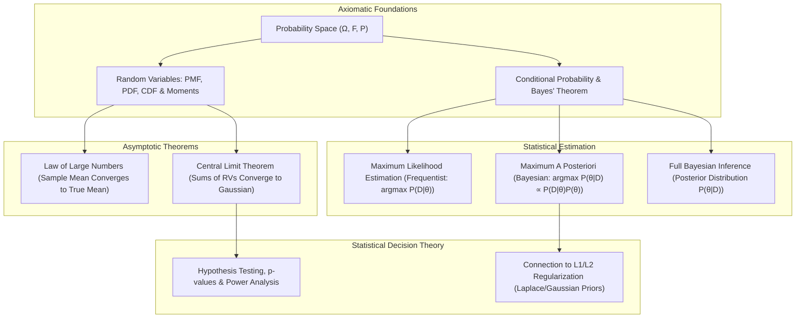
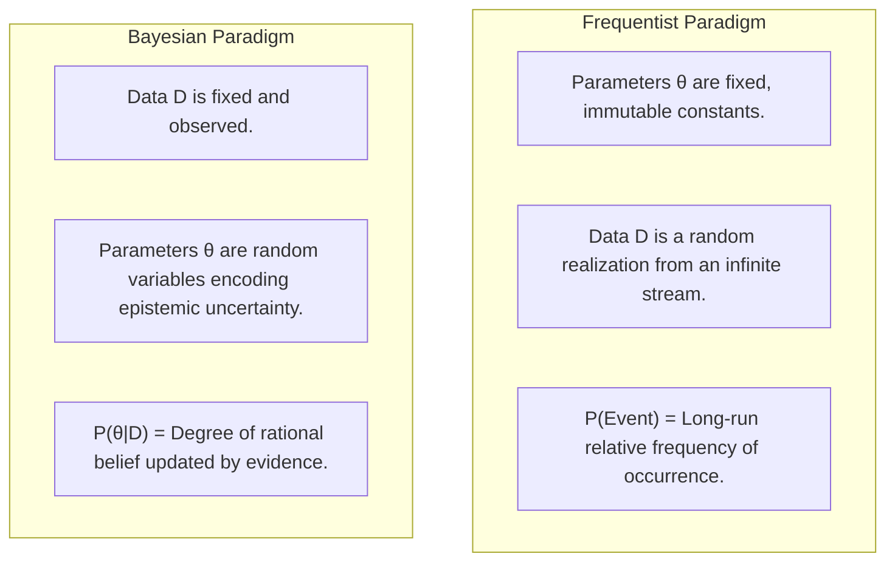
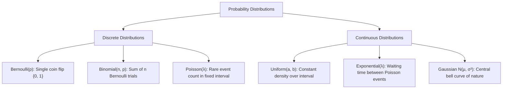
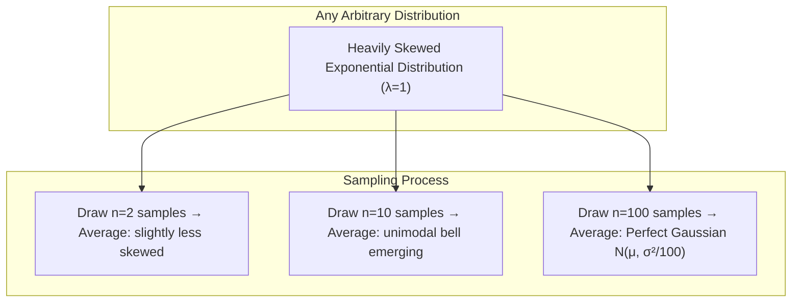
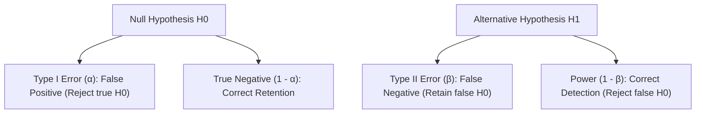

# Probability & Mathematical Statistics for Machine Learning

!!! info "Prerequisites"
    Calculus (integrals, partial derivatives) and linear algebra (vectors, covariance matrices). See [Foundations](foundations-math-deep-dive.md), [Linear Algebra](linear-algebra-deep-dive.md), and [Calculus & Optimization](calculus-optimization-deep-dive.md).

---

## 1. The Big Picture

Deterministic algorithms assume exact inputs and produce exact outputs. Machine learning, in contrast, operates in an inherently uncertain world: data is corrupted by noise, observations are incomplete, and real-world processes are stochastic.

**Probability theory** provides the mathematical framework for modeling uncertainty and quantifying belief before and after observing data. **Mathematical statistics** provides the operational machinery to make principled inferences, estimate unknown model parameters, and test scientific hypotheses from empirical samples.



Every foundational machine learning concept—from loss functions (cross-entropy, mean squared error) to generative modeling (diffusion, VAEs) and regularization penalties—originates directly from probability and mathematical statistics.

---

## 2. Intuition & Real-World Framing

### Frequentist vs. Bayesian: Two Paradigms of Reality

Consider the statement: *"There is an 80% probability that model version A is better than model version B."*



- **Frequentist Thinking**: The true parameter $\theta^*$ is an unknown, fixed physical constant. We calculate the probability of observing our empirical data given a hypothetical parameter value ($P(\mathcal{D} \mid \theta)$). Confidence intervals state: *"If we repeat this experiment an infinite number of times, 95% of the computed intervals will cover the true fixed $\theta^*$."*
- **Bayesian Thinking**: Only the collected data $\mathcal{D}$ is fixed and real. The parameter $\theta$ is uncertain. We express our prior belief about $\theta$ as a distribution $P(\theta)$, observe evidence $\mathcal{D}$, and compute the updated posterior belief $P(\theta \mid \mathcal{D})$ using Bayes' theorem. A 95% credible interval states: *"Given the observed data and prior, there is exactly a 95% probability that $\theta$ lies within this interval."*

---

## 3. Probability Foundations: Axioms, Conditional Probability and Bayes' Theorem

### 3.1 Kolmogorov's Axioms

Let $\Omega$ be the sample space of all possible outcomes. An event $A$ is a subset of $\Omega$ belonging to event space $\mathcal{F}$. A probability measure $P: \mathcal{F} \to [0, 1]$ satisfies:

1. **Non-negativity**: $P(A) \ge 0$ for all $A \in \mathcal{F}$.
2. **Unit Measure**: $P(\Omega) = 1$.
3. **Countable Additivity**: For any sequence of mutually disjoint events $A_1, A_2, \dots$ ($A_i \cap A_j = \emptyset$ for $i \ne j$):
   $$P\left( \bigcup_{i=1}^\infty A_i \right) = \sum_{i=1}^\infty P(A_i)$$

### 3.2 Conditional Probability and Independence

The conditional probability of event $A$ given that event $B$ has occurred ($P(B) > 0$) is:

$$
P(A \mid B) = \frac{P(A \cap B)}{P(B)}
$$

Two events $A$ and $B$ are **statistically independent** ($A \perp B$) if and only if:

$$
P(A \cap B) = P(A) P(B) \iff P(A \mid B) = P(A)
$$

### 3.3 Law of Total Probability

If events $\{B_1, B_2, \dots, B_K\}$ form a partition of the sample space $\Omega$ ($\bigcup_{k=1}^K B_k = \Omega$ and $B_i \cap B_j = \emptyset$ for $i \ne j$):

$$
P(A) = \sum_{k=1}^K P(A \cap B_k) = \sum_{k=1}^K P(A \mid B_k) P(B_k)
$$

### 3.4 Bayes' Theorem

Equating joint probabilities $P(A \cap B) = P(A \mid B)P(B) = P(B \mid A)P(A)$ yields:

$$
P(A \mid B) = \frac{P(B \mid A) P(A)}{P(B)} = \frac{P(B \mid A) P(A)}{\sum_{k=1}^K P(B \mid A_k) P(A_k)}
$$

In machine learning inference where $\theta$ represents model parameters and $\mathcal{D}$ represents observed data:

$$
\underbrace{P(\theta \mid \mathcal{D})}_{\text{Posterior}} = \frac{\overbrace{P(\mathcal{D} \mid \theta)}^{\text{Likelihood}} \overbrace{P(\theta)}^{\text{Prior}}}{\underbrace{P(\mathcal{D})}_{\text{Evidence / Marginal Likelihood}}} = \frac{P(\mathcal{D} \mid \theta) P(\theta)}{\int_\Theta P(\mathcal{D} \mid \theta') P(\theta') d\theta'}
$$


---

## 4. Random Variables, Distributions, and Moments

### 4.1 Discrete vs. Continuous Random Variables

| Property | Discrete Random Variable $X$ | Continuous Random Variable $X$ |
|---|---|---|
| **Support** | Countable set $\{x_1, x_2, \dots\}$ | Uncountable continuum $\mathbb{R}$ or interval $[a, b]$ |
| **Probability Function** | Probability Mass Function (PMF): $p(x) = P(X = x)$ | Probability Density Function (PDF): $f(x)$ |
| **Sum / Integral Condition** | $\sum_{x} p(x) = 1$ | $\int_{-\infty}^\infty f(x) dx = 1$ |
| **Point Probability** | $P(X = x) \in [0, 1]$ | $P(X = x) = 0$ (Measure of a single point is zero!) |
| **Interval Probability** | $P(a \le X \le b) = \sum_{x=a}^b p(x)$ | $P(a \le X \le b) = \int_a^b f(x) dx$ |
| **Cumulative Distribution** | $F(x) = P(X \le x) = \sum_{t \le x} p(t)$ | $F(x) = P(X \le x) = \int_{-\infty}^x f(t) dt$ |
| **Density Recovery** | Difference: $p(x_k) = F(x_k) - F(x_{k-1})$ | Derivative: $f(x) = \frac{d}{dx} F(x)$ |

### 4.2 Mathematical Expectation, Variance, and Covariance

#### Expectation (First Moment / Center of Mass):
- Discrete: $\mathbb{E}[X] = \sum_x x \, p(x)$
- Continuous: $\mathbb{E}[X] = \int_{-\infty}^\infty x \, f(x) dx$
- **Linearity of Expectation** (always holds, even for dependent variables):
  $$\mathbb{E}[aX + bY + c] = a \mathbb{E}[X] + b \mathbb{E}[Y] + c$$

#### Variance (Second Central Moment / Spread):
$$\text{Var}(X) = \sigma^2 = \mathbb{E}\left[(X - \mathbb{E}[X])^2\right] = \mathbb{E}[X^2] - (\mathbb{E}[X])^2$$

- Scaling property: $\text{Var}(aX + b) = a^2 \text{Var}(X)$.

#### Covariance and Correlation Matrix:
For random vector $\mathbf{X} = [X_1, \dots, X_d]^T \in \mathbb{R}^d$ with mean $\boldsymbol{\mu} = \mathbb{E}[\mathbf{X}]$:

$$\Sigma = \text{Cov}(\mathbf{X}) = \mathbb{E}\left[ (\mathbf{X} - \boldsymbol{\mu})(\mathbf{X} - \boldsymbol{\mu})^T \right] \in \mathbb{R}^{d \times d}$$

$$\Sigma_{ij} = \text{Cov}(X_i, X_j) = \mathbb{E}[(X_i - \mu_i)(X_j - \mu_j)]$$

- **Pearson Correlation Coefficient**:
  $$\rho(X_i, X_j) = \frac{\text{Cov}(X_i, X_j)}{\sigma_{X_i} \sigma_{X_j}} \in [-1, 1]$$

- The covariance matrix $\Sigma$ is always **symmetric** and **positive semi-definite** ($\Sigma \succeq 0$), connecting directly to the [Spectral Theorem in Linear Algebra](linear-algebra-deep-dive.md#62-spectral-theorem-for-real-symmetric-matrices).

---

## 5. Core Probability Distributions in Machine Learning

### 5.1 Distribution Taxonomy



### 5.2 Mathematical Summary of Key Distributions

| Distribution | Notation | Support | PMF / PDF | Mean $\mathbb{E}[X]$ | Variance $\text{Var}(X)$ | ML Context |
|---|---|---|---|---|---|---|
| **Bernoulli** | $\text{Bern}(p)$ | $k \in \{0, 1\}$ | $p^k (1-p)^{1-k}$ | $p$ | $p(1-p)$ | Binary classification labels |
| **Binomial** | $\text{Bin}(n, p)$ | $k \in \{0, \dots, n\}$ | $\binom{n}{k} p^k (1-p)^{n-k}$ | $n p$ | $n p (1-p)$ | Click-through rates, A/B test counts |
| **Poisson** | $\text{Pois}(\lambda)$ | $k \in \{0, 1, 2, \dots\}$ | $\frac{\lambda^k e^{-\lambda}}{k!}$ | $\lambda$ | $\lambda$ | Request arrival rates, count regression |
| **Uniform** | $\mathcal{U}(a, b)$ | $x \in [a, b]$ | $\frac{1}{b - a}$ | $\frac{a + b}{2}$ | $\frac{(b - a)^2}{12}$ | Weight initialization (Xavier / He uniform) |
| **Exponential** | $\text{Exp}(\lambda)$ | $x \in [0, \infty)$ | $\lambda e^{-\lambda x}$ | $\frac{1}{\lambda}$ | $\frac{1}{\lambda^2}$ | Survival analysis, inter-arrival latencies |
| **Gaussian (1D)** | $\mathcal{N}(\mu, \sigma^2)$ | $x \in (-\infty, \infty)$ | $\frac{1}{\sigma \sqrt{2\pi}} \exp\left(-\frac{(x - \mu)^2}{2\sigma^2}\right)$ | $\mu$ | $\sigma^2$ | Noise models, regression errors, VAEs |
| **Multivariate Gaussian** | $\mathcal{N}(\boldsymbol{\mu}, \Sigma)$ | $\mathbf{x} \in \mathbb{R}^d$ | $\frac{1}{(2\pi)^{d/2} \|\Sigma\|^{1/2}} \exp\left(-\frac{1}{2}(\mathbf{x}-\boldsymbol{\mu})^T \Sigma^{-1} (\mathbf{x}-\boldsymbol{\mu})\right)$ | $\boldsymbol{\mu}$ | $\Sigma$ | Gaussian Processes, GMM clustering |

---

## 6. Asymptotic Theorems: LLN and the Central Limit Theorem

### 6.1 The Law of Large Numbers (LLN)

Let $X_1, X_2, \dots, X_n$ be independent and identically distributed (i.i.d.) random variables with finite mean $\mu = \mathbb{E}[X_i]$ and variance $\sigma^2$. The sample average is $\bar{X}_n = \frac{1}{n} \sum_{i=1}^n X_i$.

- **Weak Law (WLLN)**: Sample mean converges in probability to the true mean:
  $$\lim_{n \to \infty} P(|\bar{X}_n - \mu| \ge \epsilon) = 0 \quad \forall \epsilon > 0$$

- **Strong Law (SLLN)**: Sample mean converges almost surely to the true mean:
  $$P\left(\lim_{n \to \infty} \bar{X}_n = \mu\right) = 1$$

This justifies **Monte Carlo integration**: we approximate intractable expectations by empirical sample averages:

$$
\mathbb{E}_{x \sim p}[f(x)] \approx \frac{1}{N} \sum_{i=1}^N f(x_i), \quad x_i \sim p(x)
$$

### 6.2 The Central Limit Theorem (CLT)

Let $X_1, X_2, \dots, X_n$ be i.i.d. random variables drawn from **any** arbitrary distribution (uniform, exponential, beta, bimodal) with finite mean $\mu$ and finite variance $\sigma^2 < \infty$.

As sample size $n \to \infty$, the standardized sample mean converges in distribution to the standard normal distribution:

$$
Z_n = \frac{\bar{X}_n - \mu}{\sigma / \sqrt{n}} = \frac{\sum_{i=1}^n X_i - n\mu}{\sigma \sqrt{n}} \xrightarrow{d} \mathcal{N}(0, 1)
$$

Equivalently, the unstandardized sample average is asymptotically Gaussian:

$$
\bar{X}_n \sim \mathcal{N}\left(\mu, \frac{\sigma^2}{n}\right) \quad \text{as } n \to \infty
$$



The standard deviation of the sample mean, $\frac{\sigma}{\sqrt{n}}$, is the **Standard Error (SE)**. To cut the estimation uncertainty in half, one must quadruple the sample size ($n \to 4n$).

---

## 7. Point Estimation: MLE, MAP and Conjugate Bayesian Inference

### 7.1 Maximum Likelihood Estimation (MLE) of Gaussian Parameters

Let $\mathcal{D} = \{x_1, x_2, \dots, x_N\}$ be an i.i.d. sample from $\mathcal{N}(\mu, \sigma^2)$. The joint likelihood function is:

$$
L(\mu, \sigma^2) = \prod_{i=1}^N \frac{1}{\sqrt{2\pi \sigma^2}} \exp\left(-\frac{(x_i - \mu)^2}{2\sigma^2}\right)
$$

The log-likelihood $\ell(\mu, \sigma^2) = \ln L(\mu, \sigma^2)$ is:

$$
\ell(\mu, \sigma^2) = -\frac{N}{2} \ln(2\pi) - \frac{N}{2} \ln(\sigma^2) - \frac{1}{2\sigma^2} \sum_{i=1}^N (x_i - \mu)^2
$$

#### 1. Derivation of MLE for Mean $\mu$:
Take the partial derivative with respect to $\mu$ and set to 0:

$$
\frac{\partial \ell}{\partial \mu} = \frac{1}{\sigma^2} \sum_{i=1}^N (x_i - \mu) = 0 \implies \sum_{i=1}^N x_i - N\mu = 0
$$

$$
\hat{\mu}_{\text{MLE}} = \frac{1}{N} \sum_{i=1}^N x_i = \bar{x}
$$

**Check Unbiasedness:**
$$\mathbb{E}[\hat{\mu}_{\text{MLE}}] = \mathbb{E}\left[\frac{1}{N} \sum_{i=1}^N X_i\right] = \frac{1}{N} \sum_{i=1}^N \mathbb{E}[X_i] = \frac{1}{N} (N\mu) = \mu$$
$\hat{\mu}_{\text{MLE}}$ is strictly **unbiased**.

#### 2. Derivation of MLE for Variance $\sigma^2$:
Let $s = \sigma^2$. Differentiate with respect to $s$:

$$
\frac{\partial \ell}{\partial s} = -\frac{N}{2s} + \frac{1}{2s^2} \sum_{i=1}^N (x_i - \mu)^2 = 0
$$

Multiply by $2s^2$:

$$
-N s + \sum_{i=1}^N (x_i - \mu)^2 = 0 \implies \hat{\sigma}^2_{\text{MLE}} = \frac{1}{N} \sum_{i=1}^N (x_i - \hat{\mu})^2
$$

#### 3. Bessel's Correction: Why the MLE Variance is Biased:
Evaluate the expectation $\mathbb{E}[\hat{\sigma}^2_{\text{MLE}}]$:

$$
\sum_{i=1}^N (x_i - \hat{\mu})^2 = \sum_{i=1}^N \Big( (x_i - \mu) - (\hat{\mu} - \mu) \Big)^2 = \sum_{i=1}^N (x_i - \mu)^2 - 2(\hat{\mu} - \mu)\sum_{i=1}^N(x_i - \mu) + N(\hat{\mu} - \mu)^2
$$

Since $\sum_{i=1}^N (x_i - \mu) = N(\hat{\mu} - \mu)$:

$$
\sum_{i=1}^N (x_i - \hat{\mu})^2 = \sum_{i=1}^N (x_i - \mu)^2 - N(\hat{\mu} - \mu)^2
$$

Take the expectation:

$$
\mathbb{E}\left[ \sum_{i=1}^N (x_i - \hat{\mu})^2 \right] = \sum_{i=1}^N \text{Var}(X_i) - N \text{Var}(\hat{\mu}) = N \sigma^2 - N \left( \frac{\sigma^2}{N} \right) = (N - 1) \sigma^2
$$

Dividing by $N$:

$$
\mathbb{E}[\hat{\sigma}^2_{\text{MLE}}] = \frac{N - 1}{N} \sigma^2 \ne \sigma^2
$$

The MLE variance systematically **underestimates** true variance because $\hat{\mu}$ is computed from the same sample, artificially minimizing squared deviations. To obtain an unbiased estimator $S^2$, multiply by Bessel's correction factor $\frac{N}{N-1}$:

$$
S^2 = \frac{1}{N - 1} \sum_{i=1}^N (x_i - \hat{\mu})^2 \implies \mathbb{E}[S^2] = \sigma^2
$$

---

### 7.2 Beta-Binomial Conjugate Bayesian Inference

A prior distribution is **conjugate** to the likelihood if the resulting posterior distribution belongs to the exact same parametric family as the prior.

Let $k$ be the number of successes in $n$ independent Bernoulli trials:

$$
P(k \mid \theta) = \binom{n}{k} \theta^k (1 - \theta)^{n - k} \quad (\text{Binomial Likelihood})
$$

We place a **Beta prior** on the success probability $\theta \in [0, 1]$ parameterized by pseudo-counts $\alpha, \beta > 0$:

$$
P(\theta; \alpha, \beta) = \frac{1}{\text{B}(\alpha, \beta)} \theta^{\alpha - 1} (1 - \theta)^{\beta - 1}
$$

Using Bayes' theorem to compute the posterior $P(\theta \mid k)$:

$$
P(\theta \mid k) \propto P(k \mid \theta) P(\theta) \propto \left( \theta^k (1 - \theta)^{n - k} \right) \left( \theta^{\alpha - 1} (1 - \theta)^{\beta - 1} \right)
$$

Combining exponents:

$$
P(\theta \mid k) \propto \theta^{(\alpha + k) - 1} (1 - \theta)^{(\beta + n - k) - 1}
$$

This is recognized immediately as a **Beta distribution** with updated parameters:

$$
\theta \mid k \sim \text{Beta}(\alpha_{\text{post}}, \beta_{\text{post}}) = \text{Beta}(\alpha + k, \; \beta + n - k)
$$


#### Maximum A Posteriori (MAP) Estimate of $\theta$:
The mode of the $\text{Beta}(\alpha', \beta')$ distribution is:

$$
\hat{\theta}_{\text{MAP}} = \frac{\alpha_{\text{post}} - 1}{\alpha_{\text{post}} + \beta_{\text{post}} - 2} = \frac{k + \alpha - 1}{n + \alpha + \beta - 2}
$$

Compare this to the MLE estimate $\hat{\theta}_{\text{MLE}} = \frac{k}{n}$:

- As $n \to \infty$, the data dominates the prior: $\lim_{n \to \infty} \hat{\theta}_{\text{MAP}} = \frac{k}{n} = \hat{\theta}_{\text{MLE}}$.
- When data is sparse ($n=1, k=1$), MLE predicts $1.0$ (catastrophic overconfidence), whereas MAP with a neutral prior ($\alpha=2, \beta=2$) predicts $\frac{1 + 1}{1 + 2} = \frac{2}{3}$ (Laplace smoothing).

---

## 8. Hypothesis Testing, Confidence Intervals and Decision Theory

### 8.1 The Decision Matrix: Type I and Type II Errors

When testing a null hypothesis $H_0$ against an alternative hypothesis $H_1$:

| Reality \ Decision | Fail to Reject $H_0$ (Predict Negative) | Reject $H_0$ (Predict Positive) |
|---|---|---|
| **$H_0$ is Actually True** | Correct Decision (True Negative, $1 - \alpha$) | **Type I Error ($\alpha$)** (False Positive / False Alarm) |
| **$H_0$ is Actually False** | **Type II Error ($\beta$)** (False Negative / Missed Detection) | Correct Decision (True Positive / **Statistical Power $1 - \beta$)** |



- **Significance Level ($\alpha$)**: The probability of committing a Type I error (standard threshold $\alpha = 0.05$).
- **p-value**: The probability of observing a test statistic at least as extreme as the one computed from the sample, assuming the null hypothesis $H_0$ is strictly true. If $p < \alpha$, we reject $H_0$.
- **Statistical Power ($1 - \beta$)**: The probability of correctly rejecting a false null hypothesis (industry standard benchmark: $1 - \beta \ge 0.80$).

### 8.2 Welch's Two-Sample t-Test

To test whether the means of two experimental groups (e.g., A/B test variant A vs. control B) differ when variances cannot be assumed equal:

$$
t = \frac{\bar{X}_1 - \bar{X}_2}{\sqrt{\frac{s_1^2}{N_1} + \frac{s_2^2}{N_2}}}
$$

Degrees of freedom are computed via the Welch-Satterthwaite equation:

$$
\nu \approx \frac{\left(\frac{s_1^2}{N_1} + \frac{s_2^2}{N_2}\right)^2}{\frac{(s_1^2 / N_1)^2}{N_1 - 1} + \frac{(s_2^2 / N_2)^2}{N_2 - 1}}
$$

---

## 9. Python Implementation: From Scratch & Statistical Simulation

Below is a runnable suite implementing:

1. From-scratch **MLE for Gaussian Distribution** with Bessel's bias demonstration.
2. **Beta-Binomial Bayesian Updating**.
3. **Monte Carlo Central Limit Theorem** demonstrating convergence of heavily skewed data.
4. **Two-Sample Hypothesis Testing** (Welch's t-test and Bootstrap Confidence Intervals).

```python
"""
probability_statistics_deep_dive.py
Production-grade implementations of probability distributions, MLE,
Bayesian updating, CLT simulation, and hypothesis testing.
"""

from typing import Tuple
import numpy as np
from scipy import stats


def gaussian_mle(data: np.ndarray) -> Tuple[float, float, float]:
    """
    Computes Gaussian MLE for mean, biased MLE variance, and unbiased sample variance.
    Returns: (mu_mle, var_mle_biased, var_unbiased)
    """
    N = len(data)
    mu_mle = float(np.sum(data) / N)
    var_mle_biased = float(np.sum((data - mu_mle) ** 2) / N)
    var_unbiased = float(np.sum((data - mu_mle) ** 2) / (N - 1))
    return mu_mle, var_mle_biased, var_unbiased


class BetaBinomialBayesianUpdater:
    """
    Exact conjugate Bayesian inference engine for Bernoulli / Binomial data.
    """
    def __init__(self, prior_alpha: float = 1.0, prior_beta: float = 1.0):
        self.alpha = float(prior_alpha)
        self.beta = float(prior_beta)

    def update(self, successes: int, trials: int):
        """Bayesian conjugate parameter update."""
        failures = trials - successes
        self.alpha += successes
        self.beta += failures

    @property
    def posterior_mean(self) -> float:
        return self.alpha / (self.alpha + self.beta)

    @property
    def map_estimate(self) -> float:
        if self.alpha > 1 and self.beta > 1:
            return (self.alpha - 1.0) / (self.alpha + self.beta - 2.0)
        return self.posterior_mean

    def credible_interval(self, confidence: float = 0.95) -> Tuple[float, float]:
        tail = (1.0 - confidence) / 2.0
        low = float(stats.beta.ppf(tail, self.alpha, self.beta))
        high = float(stats.beta.ppf(1.0 - tail, self.alpha, self.beta))
        return low, high


def simulate_clt(
    distribution_type: str = "exponential",
    sample_sizes: Tuple[int, ...] = (2, 10, 100),
    num_simulations: int = 10000,
) -> dict:
    """
    Simulates Central Limit Theorem convergence from highly non-Gaussian distributions.
    """
    results = {}
    for n in sample_sizes:
        if distribution_type == "exponential":
            # Highly skewed: Exp(1), mean=1, var=1
            samples = np.random.exponential(scale=1.0, size=(num_simulations, n))
        elif distribution_type == "uniform":
            samples = np.random.uniform(low=0.0, high=1.0, size=(num_simulations, n))
        sample_means = np.mean(samples, axis=1)

        # Normality test: Shapiro-Wilk or skewness/kurtosis
        skew = float(stats.skew(sample_means))
        kurt = float(stats.kurtosis(sample_means))  # Excess kurtosis (0 for normal)
        results[n] = {
            "mean": float(np.mean(sample_means)),
            "std": float(np.std(sample_means)),
            "skewness": skew,
            "excess_kurtosis": kurt,
        }
    return results


def welch_t_test(
    sample_a: np.ndarray, sample_b: np.ndarray
) -> Tuple[float, float, float]:
    """
    Computes Welch's two-sample t-test from scratch.
    Returns: (t_statistic, degrees_of_freedom, p_value)
    """
    n1, n2 = len(sample_a), len(sample_b)
    m1, m2 = np.mean(sample_a), np.mean(sample_b)
    v1, v2 = np.var(sample_a, ddof=1), np.var(sample_b, ddof=1)

    se_diff = np.sqrt(v1 / n1 + v2 / n2)
    t_stat = (m1 - m2) / se_diff

    # Welch-Satterthwaite degrees of freedom
    df_num = (v1 / n1 + v2 / n2) ** 2
    df_den = ((v1 / n1) ** 2) / (n1 - 1) + ((v2 / n2) ** 2) / (n2 - 1)
    df = df_num / df_den

    # Two-sided p-value
    p_val = 2.0 * (1.0 - stats.t.cdf(abs(t_stat), df=df))
    return float(t_stat), float(df), float(p_val)


def bootstrap_mean_diff_ci(
    sample_a: np.ndarray,
    sample_b: np.ndarray,
    n_bootstrap: int = 5000,
    alpha: float = 0.05,
) -> Tuple[float, float]:
    """Non-parametric bootstrap confidence interval for difference in means."""
    diffs = []
    for _ in range(n_bootstrap):
        boot_a = np.random.choice(sample_a, size=len(sample_a), replace=True)
        boot_b = np.random.choice(sample_b, size=len(sample_b), replace=True)
        diffs.append(np.mean(boot_a) - np.mean(boot_b))
    low = float(np.percentile(diffs, 100 * (alpha / 2)))
    high = float(np.percentile(diffs, 100 * (1 - alpha / 2)))
    return low, high


# ---------------------------------------------------------
# Verification & Demonstrations
# ---------------------------------------------------------
if __name__ == "__main__":
    np.random.seed(42)

    # 1. Demonstrate Bessel's Correction Bias in Small Samples
    print("=== Bessel's Correction Bias Demonstration ===")
    true_sigma = 2.0
    true_var = true_sigma ** 2  # 4.0
    small_N = 5
    mle_vars = []
    unbiased_vars = []

    for _ in range(20000):
        samp = np.random.normal(loc=10.0, scale=true_sigma, size=small_N)
        _, v_mle, v_unb = gaussian_mle(samp)
        mle_vars.append(v_mle)
        unbiased_vars.append(v_unb)

    print(f"True Population Variance:                {true_var:.4f}")
    print(f"Average MLE Biased Variance (N=5):       {np.mean(mle_vars):.4f} (Expected: (4/5)*4 = 3.2000)")
    print(f"Average Unbiased Sample Variance (N-1):  {np.mean(unbiased_vars):.4f}\n")

    # 2. Test Beta-Binomial Bayesian Updating
    print("=== Beta-Binomial Bayesian Updating ===")
    updater = BetaBinomialBayesianUpdater(prior_alpha=2.0, prior_beta=2.0)
    print(f"Prior Mean: {updater.posterior_mean:.4f}")

    # Observe 8 successes out of 10 trials
    updater.update(successes=8, trials=10)
    ci_low, ci_high = updater.credible_interval(confidence=0.95)
    print(f"Posterior Alpha: {updater.alpha}, Posterior Beta: {updater.beta}")
    print(f"Posterior Mean:  {updater.posterior_mean:.4f}")
    print(f"MAP Estimate:    {updater.map_estimate:.4f}")
    print(f"95% Credible Interval: [{ci_low:.4f}, {ci_high:.4f}]\n")

    # 3. Simulate Central Limit Theorem Convergence
    print("=== Central Limit Theorem Simulation (Exponential Data) ===")
    clt_stats = simulate_clt(distribution_type="exponential", sample_sizes=(2, 10, 100))
    for n, s in clt_stats.items():
        print(f"Sample Size n={n:3d} | Mean={s['mean']:.4f} | Std={s['std']:.4f} | Skewness={s['skewness']:.4f} (Normal=0) | Excess Kurtosis={s['excess_kurtosis']:.4f}")
    print()

    # 4. Two-Sample Welch t-Test vs SciPy
    print("=== Two-Sample Welch's t-Test Verification ===")
    group_ctrl = np.random.normal(loc=100.0, scale=15.0, size=50)
    group_var = np.random.normal(loc=107.0, scale=22.0, size=40)

    t_calc, df_calc, p_calc = welch_t_test(group_var, group_ctrl)
    scipy_res = stats.ttest_ind(group_var, group_ctrl, equal_var=False)

    print(f"Calculated: t = {t_calc:.4f}, df = {df_calc:.2f}, p-value = {p_calc:.6f}")
    print(f"SciPy:      t = {scipy_res.statistic:.4f}, df = {scipy_res.df:.2f}, p-value = {scipy_res.pvalue:.6f}")

    boot_ci = bootstrap_mean_diff_ci(group_var, group_ctrl)
    print(f"Bootstrap 95% CI for Difference in Means: [{boot_ci[0]:.4f}, {boot_ci[1]:.4f}]")
```

---

## 10. Common Errors & Debugging

| Bug / Phenomenon | Root Cause | Diagnosis Method | Production Fix |
|---|---|---|---|
| **Confusing Density with Probability** | Assuming continuous PDF height cannot exceed 1.0 (e.g., evaluating $\mathcal{N}(0, 0.01^2)$ yields $f(0) \approx 39.89$). | Asserting `assert f(x) <= 1.0` on a continuous density function. | Only *integrals* over intervals $\int_a^b f(x)dx$ are probabilities $\le 1.0$; density height $f(x)$ can be arbitrarily large. |
| **Probability Product Underflow** | Multiplying likelihoods across thousands of samples directly: $\prod_{i=1}^N P(x_i \mid \theta) \to 0.0$. | Inspect likelihood values; evaluate if return equals exact `0.0`. | Sum log-likelihoods: $\sum_{i=1}^N \log P(x_i \mid \theta)$. |
| **p-Hacking / Multiple Testing Inflation** | Running $M = 50$ statistical tests at $\alpha = 0.05$ without correction; false alarm rate explodes to $1 - (1-0.05)^{50} \approx 92.3\%$. | Check if multiple variants, metrics, or slices are checked until $p < 0.05$ emerges. | Apply **Bonferroni correction** ($\alpha' = \alpha / M$) or **Benjamini-Hochberg False Discovery Rate (FDR)** control. |
| **Bessel's Correction Omission in Features** | Computing sample variance with divisor $N$ instead of $N-1$ when standardizing small mini-batches. | Verify `ddof` setting in `np.std(..., ddof=1)`. | Use `ddof=1` for unbiased sample variance estimation. |
| **Conflating Correlation with Causation** | Assuming feature correlation $\rho(X, Y) \ne 0$ implies feature $X$ drives target $Y$ (ignoring lurking confounders). | Check Directed Acyclic Graphs (DAGs) using causal discovery or do-calculus. | Run randomized controlled trials (A/B tests) or apply instrumental variable / propensity score matching. |

---

## 11. Staff-Level Technical Interview Questions

### Q1: Derive the Maximum Likelihood Estimator for the parameters $\mu$ and $\sigma^2$ of a 1D Gaussian distribution. Prove that the MLE for $\sigma^2$ is biased, and derive Bessel's correction.
**Model Answer:**
Given an i.i.d. sample $x_1, \dots, x_N \sim \mathcal{N}(\mu, \sigma^2)$, the log-likelihood is:
$$\ell(\mu, \sigma^2) = -\frac{N}{2} \ln(2\pi) - \frac{N}{2} \ln(\sigma^2) - \frac{1}{2\sigma^2} \sum_{i=1}^N (x_i - \mu)^2$$

1. **Deriving $\hat{\mu}_{\text{MLE}}$:**
   $$\frac{\partial \ell}{\partial \mu} = \frac{1}{\sigma^2} \sum_{i=1}^N (x_i - \mu) = 0 \implies \hat{\mu}_{\text{MLE}} = \frac{1}{N} \sum_{i=1}^N x_i = \bar{x}$$
   $\mathbb{E}[\hat{\mu}_{\text{MLE}}] = \frac{1}{N} \sum \mathbb{E}[X_i] = \mu$ (unbiased).

2. **Deriving $\hat{\sigma}^2_{\text{MLE}}$:**
   Let $s = \sigma^2$:
   $$\frac{\partial \ell}{\partial s} = -\frac{N}{2s} + \frac{1}{2s^2} \sum_{i=1}^N (x_i - \hat{\mu})^2 = 0 \implies \hat{\sigma}^2_{\text{MLE}} = \frac{1}{N} \sum_{i=1}^N (x_i - \hat{\mu})^2$$

3. **Proof of Bias:**
   Expand the sum of squares around the true population mean $\mu$:
   $$\sum_{i=1}^N (x_i - \hat{\mu})^2 = \sum_{i=1}^N \Big( (x_i - \mu) - (\hat{\mu} - \mu) \Big)^2 = \sum_{i=1}^N (x_i - \mu)^2 - N (\hat{\mu} - \mu)^2$$
   Take the mathematical expectation:
   $$\mathbb{E}\left[ \sum_{i=1}^N (x_i - \hat{\mu})^2 \right] = \sum_{i=1}^N \text{Var}(X_i) - N \text{Var}(\hat{\mu}) = N \sigma^2 - N \left( \frac{\sigma^2}{N} \right) = (N - 1) \sigma^2$$
   Therefore:
   $$\mathbb{E}[\hat{\sigma}^2_{\text{MLE}}] = \frac{N - 1}{N} \sigma^2 \ne \sigma^2$$
   The MLE estimator is systematically biased downwards by factor $\frac{N-1}{N}$.
   Multiplying by Bessel's correction $\frac{N}{N-1}$ yields the unbiased estimator:
   $$S^2 = \frac{1}{N - 1} \sum_{i=1}^N (x_i - \hat{\mu})^2 \implies \mathbb{E}[S^2] = \sigma^2$$

---

### Q2: Derive the posterior distribution for a Bernoulli likelihood with a Beta prior (Beta-Binomial conjugate model). What is the MAP estimate of $\theta$?
**Model Answer:**
Let likelihood be Binomial: $P(k \mid \theta) = \binom{n}{k} \theta^k (1 - \theta)^{n - k}$.
Prior is $\text{Beta}(\alpha, \beta)$: $P(\theta) = \frac{1}{\text{B}(\alpha, \beta)} \theta^{\alpha - 1} (1 - \theta)^{\beta - 1}$.
By Bayes' rule:
$$P(\theta \mid k) \propto P(k \mid \theta) P(\theta) \propto \theta^k (1 - \theta)^{n - k} \cdot \theta^{\alpha - 1} (1 - \theta)^{\beta - 1} = \theta^{(\alpha + k) - 1} (1 - \theta)^{(\beta + n - k) - 1}$$
Since the functional form matches the Beta distribution kernel, the posterior is:
$$\theta \mid k \sim \text{Beta}(\alpha + k, \; \beta + n - k)$$

**Deriving the MAP Estimate:**
The MAP estimate maximizes the log-posterior:
$$\log P(\theta \mid k) = (\alpha + k - 1) \ln \theta + (\beta + n - k - 1) \ln(1 - \theta) + \text{const}$$
Differentiating with respect to $\theta$ and setting to 0:
$$\frac{\alpha + k - 1}{\theta} - \frac{\beta + n - k - 1}{1 - \theta} = 0 \implies (1 - \theta)(\alpha + k - 1) = \theta (\beta + n - k - 1)$$
$$(\alpha + k - 1) = \theta (\alpha + \beta + n - 2) \implies \hat{\theta}_{\text{MAP}} = \frac{k + \alpha - 1}{n + \alpha + \beta - 2}$$
As sample size $n \to \infty$, the constants $\alpha, \beta$ vanish asymptotically, and $\hat{\theta}_{\text{MAP}} \to \frac{k}{n} = \hat{\theta}_{\text{MLE}}$.

---

### Q3: State the Central Limit Theorem precisely. What are the minimal regularity conditions, and when does the CLT break down?
**Model Answer:**
**Lindeberg-Lévy Central Limit Theorem:**
Let $X_1, X_2, \dots$ be a sequence of independent and identically distributed (i.i.d.) random variables with finite expectation $\mathbb{E}[X_i] = \mu < \infty$ and finite variance $\text{Var}(X_i) = \sigma^2 < \infty$ ($\sigma^2 > 0$).
Then the standardized sample mean converges in distribution to a standard normal random variable as $n \to \infty$:
$$\frac{\bar{X}_n - \mu}{\sigma / \sqrt{n}} \xrightarrow{d} \mathcal{N}(0, 1)$$

**Minimal Conditions:**

1. **Finite Variance:** $\sigma^2 < \infty$.
2. **Independence:** Weak dependence is permitted under mixing conditions, but strong correlations invalidate the standard rate.

**Breakdown Cases:**

- **Heavy-Tailed Distributions (Infinite Variance):** The **Cauchy distribution** ($f(x) = \frac{1}{\pi(1+x^2)}$) or Pareto distributions with shape $\alpha \le 2$ have undefined or infinite variance. The average of $n$ Cauchy variables is *identically Cauchy*, never converging to a Gaussian!
- **Non-identically distributed variables with dominating outliers:** Unless the Lindeberg or Lyapunov conditions are satisfied, a few extreme variables can prevent convergence.

---

### Q4: Distinguish between Type I ($\alpha$) and Type II ($\beta$) errors. What is statistical power ($1-\beta$), and how do you calculate the minimum sample size for an A/B test?
**Model Answer:**

- **Type I Error ($\alpha$):** Rejecting the null hypothesis $H_0$ when $H_0$ is actually true (False Positive). We set $\alpha$ (typically $0.05$).
- **Type II Error ($\beta$):** Failing to reject $H_0$ when $H_0$ is actually false (False Negative).
- **Statistical Power ($1 - \beta$):** The probability of correctly detecting a real effect of a given magnitude (typically $0.80$).

**Sample Size Formula:**
For testing a difference between two proportions $p_1$ and $p_2$ with pooled variance $\bar{p} = \frac{p_1 + p_2}{2}$ and Minimum Detectable Effect $\delta = |p_1 - p_2|$:
$$N = \frac{2 \left( Z_{1 - \alpha/2} + Z_{1 - \beta} \right)^2 \bar{p}(1 - \bar{p})}{\delta^2}$$
where $Z_{1 - \alpha/2} = 1.96$ for $\alpha = 0.05$ and $Z_{1 - \beta} = 0.84$ for $80\%$ power.
Notice that sample size scales inversely with the **square** of the effect size ($\delta^{-2}$). Detecting an effect half as large requires **four times** the traffic.

---

### Q5: Explain the Multiple Testing Problem. Why does testing $M=20$ metrics inflate false alarm rates, and how do Bonferroni and Benjamini-Hochberg corrections resolve this?
**Model Answer:**
When testing a single hypothesis at $\alpha = 0.05$, the probability of a false positive is $0.05$.
When testing $M$ independent true null hypotheses simultaneously, the **Family-Wise Error Rate (FWER)** is:
$$\text{FWER} = P(\ge 1 \text{ false positive}) = 1 - (1 - \alpha)^M$$
For $M = 20$: $\text{FWER} = 1 - (0.95)^{20} \approx 0.6415$ ($64.2\%$ false alarm probability!).

**Remedies:**

1. **Bonferroni Correction (Controls FWER):**
   Enforce individual test significance threshold $\alpha' = \frac{\alpha}{M}$.
   By Boole's inequality:
   $$P\left( \bigcup_{i=1}^M (p_i \le \alpha') \right) \le \sum_{i=1}^M P(p_i \le \alpha') = M \cdot \frac{\alpha}{M} = \alpha$$
   Guarantees FWER $\le \alpha$, but is highly conservative, suppressing statistical power.

2. **Benjamini-Hochberg Procedure (Controls False Discovery Rate - FDR):**
   Controls $\text{FDR} = \mathbb{E}\left[\frac{\text{False Discoveries}}{\text{Total Discoveries}}\right]$.
   Sort all $M$ p-values: $p_{(1)} \le p_{(2)} \le \dots \le p_{(M)}$.
   Find largest index $k$ such that:
   $$p_{(k)} \le \frac{k}{M} Q$$
   Reject all null hypotheses for $i \le k$. Provides vastly higher power while strictly bounding the expected fraction of false discoveries.

---

### Q6: Explain the mathematical connection between Maximum A Posteriori (MAP) estimation and L2/L1 regularization.
**Model Answer:**
In Bayesian linear regression, we seek to maximize the posterior distribution over weights $\mathbf{w}$ given data $\mathcal{D} = (X, \mathbf{y})$:
$$\mathbf{w}_{\text{MAP}} = \arg\max_\mathbf{w} \log P(\mathbf{w} \mid \mathcal{D}) = \arg\max_\mathbf{w} \Big[ \log P(\mathbf{y} \mid X, \mathbf{w}) + \log P(\mathbf{w}) \Big]$$
Assuming Gaussian observational noise $\mathbf{y} \sim \mathcal{N}(X\mathbf{w}, \sigma^2 I)$, the log-likelihood is:
$$\log P(\mathbf{y} \mid X, \mathbf{w}) = -\frac{1}{2\sigma^2} \|\mathbf{y} - X\mathbf{w}\|_2^2 + \text{const}$$

1. **Gaussian Prior yields L2 Regularization (Ridge):**
   If we place an independent zero-mean Gaussian prior on weights $w_j \sim \mathcal{N}(0, \tau^2)$:
   $$\log P(\mathbf{w}) = -\frac{1}{2\tau^2} \|\mathbf{w}\|_2^2 + \text{const}$$
   Maximizing the log-posterior:
   $$\arg\max_\mathbf{w} \left[ -\frac{1}{2\sigma^2} \|\mathbf{y} - X\mathbf{w}\|_2^2 - \frac{1}{2\tau^2} \|\mathbf{w}\|_2^2 \right] = \arg\min_\mathbf{w} \left[ \|\mathbf{y} - X\mathbf{w}\|_2^2 + \frac{\sigma^2}{\tau^2} \|\mathbf{w}\|_2^2 \right]$$
   Setting $\lambda = \frac{\sigma^2}{\tau^2}$ yields exact **Ridge Regression (L2 regularization)**!

2. **Laplace Prior yields L1 Regularization (Lasso):**
   If we place an independent Laplace prior on weights $P(w_j) = \frac{1}{2b} \exp\left(-\frac{|w_j|}{b}\right)$:
   $$\log P(\mathbf{w}) = -\frac{1}{b} \|\mathbf{w}\|_1 + \text{const}$$
   Maximizing the log-posterior:
   $$\arg\min_\mathbf{w} \left[ \|\mathbf{y} - X\mathbf{w}\|_2^2 + \frac{2\sigma^2}{b} \|\mathbf{w}\|_1 \right]$$
   Setting $\lambda = \frac{2\sigma^2}{b}$ yields exact **Lasso Regression (L1 regularization)**!

---

### Q7: What is the difference between a Frequentist 95% Confidence Interval and a Bayesian 95% Credible Interval?
**Model Answer:**

- **Frequentist 95% Confidence Interval:**
  The true parameter $\theta^*$ is a fixed, non-random physical constant. The computed interval $[L(D), U(D)]$ is a random variable that varies from sample to sample.
  **Meaning:** If the data collection experiment is replicated an infinite number of times under identical conditions, 95% of the resulting confidence intervals will encompass $\theta^*$. For any *specific, observed* interval (e.g., $[3.2, 5.8]$), the statement *"there is a 95% probability that $\theta^*$ lies between 3.2 and 5.8"* is mathematically invalid—it either does ($100\%$) or does not ($0\%$).

- **Bayesian 95% Credible Interval:**
  The collected data $D$ is fixed and observed. The parameter $\theta$ is a random variable modeled by the posterior distribution $P(\theta \mid D)$.
  **Meaning:** Integrating the posterior density:
  $$\int_L^U P(\theta \mid D) d\theta = 0.95$$
  Given our prior assumptions and the observed data, there is **genuinely a 95% subjective probability** that the true parameter lies within $[L, U]$.

---

## 12. Mastery Ladder

Complete this checklist to verify your depth in probability and statistics for ML:

- [ ] **L1:** You can calculate joint, marginal, and conditional probabilities and apply Bayes' theorem to solve diagnostic test problems.
- [ ] **L2:** You can write out the PMF/PDF, expectation, and variance for Bernoulli, Binomial, Poisson, Gaussian, and Uniform distributions.
- [ ] **L3:** You can state the difference between probability mass (discrete) and probability density (continuous) and explain why $f(x) > 1$ is valid.
- [ ] **L4:** You can prove the linearity of expectation and state when $\text{Var}(X + Y) = \text{Var}(X) + \text{Var}(Y)$.
- [ ] **L5:** You can state the Law of Large Numbers and explain how it validates Monte Carlo simulations.
- [ ] **L6:** You can formulate the Central Limit Theorem and calculate standard errors ($\sigma / \sqrt{n}$) for sample means.
- [ ] **L7:** You can derive the Maximum Likelihood Estimator for a 1D Gaussian distribution and prove why the variance MLE is biased by $\frac{N-1}{N}$.
- [ ] **L8:** You can derive the exact conjugate Bayesian posterior for a Beta-Binomial model and calculate the MAP parameter estimate.
- [ ] **L9:** You can distinguish Type I ($\alpha$) and Type II ($\beta$) errors, compute statistical power, and estimate required sample sizes for A/B tests.
- [ ] **L10:** You can explain how placing Gaussian and Laplace priors on model parameters mathematically produces Ridge (L2) and Lasso (L1) regularization under MAP estimation.
