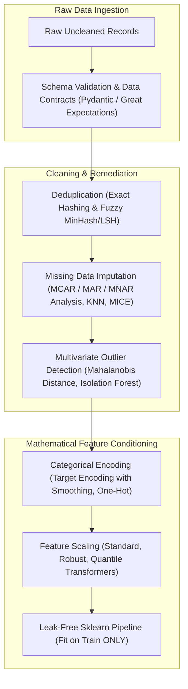
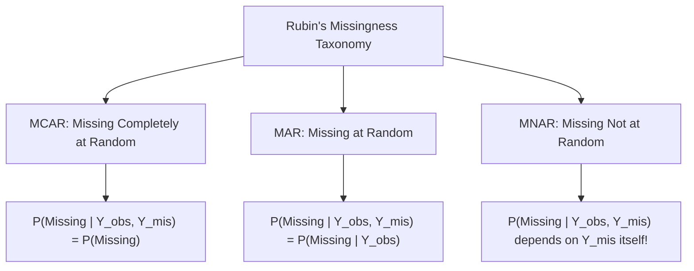
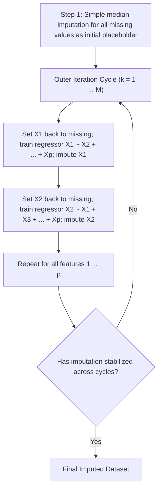
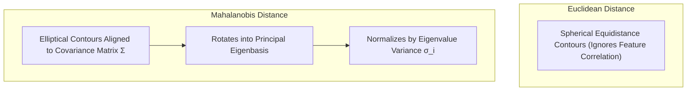
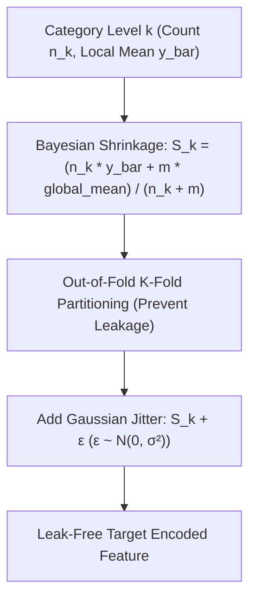
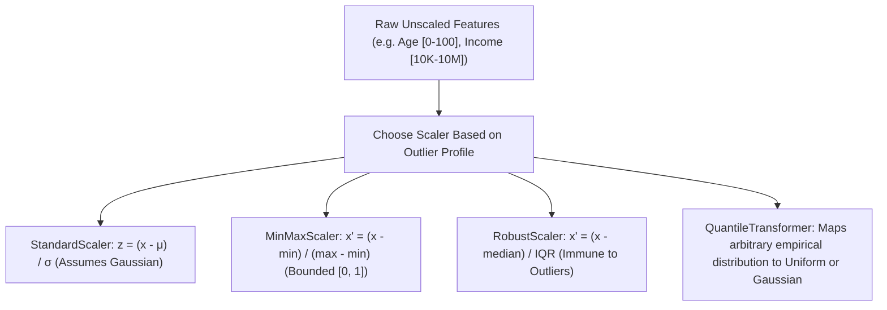

# Data Cleaning, Preprocessing & Integrity Contracts for Machine Learning

!!! info "Prerequisites"
    Probability distributions, expectation, covariance, and linear transformations. See [Probability & Statistics](../02-mathematics/probability-statistics-deep-dive.md) and [Linear Algebra](../02-mathematics/linear-algebra-deep-dive.md).

---

## 1. The Big Picture

A machine learning model is an empirical pattern extractor. If fed corrupted, unscaled, leaked, or misaligned data, it will not fail loudly with an exception—it will silently learn spurious artifacts, collapse under production distribution shifts, or deliver catastrophically biased predictions.

**Data cleaning and preprocessing** is the systematic discipline of transforming raw, messy observational data into mathematically well-conditioned, leak-free feature matrices that conform strictly to statistical assumptions and structural data contracts.



Every preprocessing step involves deep mathematical trade-offs: How do we impute missing values without destroying natural covariance? How do we encode high-cardinality categories without leaking target statistics? How do we scale features without letting extreme outliers crush variance?

---

## 2. Intuition & Real-World Framing

### The Fallacy of "Just Fill with the Mean"

Imagine building a loan default prediction model. The dataset contains an `Income` feature with 25% missing values.


1. **Variance Distortion**: Replacing 25% of points with the mean artificially shrinks the sample variance:
   $$\sigma^2_{\text{imputed}} = 0.75 \sigma^2_{\text{true}} + 0.25 (0) = 0.75 \sigma^2_{\text{true}}$$

2. **Covariance Destruction**: If income naturally correlates with credit score ($\rho \approx 0.6$), imputing the static mean completely ignores the applicant's credit score, diluting the correlation toward zero.
3. **Distribution Shift**: If wealthier individuals systematically choose not to disclose their income (Missing Not at Random - MNAR), assigning them the population average assigns high-wealth individuals an artificially low income, severely degrading the model's risk assessment.

---

## 3. Missing Data Mechanisms: Rubin's Taxonomy

Donald Rubin (1976) formulated the rigorous statistical framework governing missing data mechanisms based on the probability of missingness $R$ relative to observed data $Y_{\text{obs}}$ and unobserved data $Y_{\text{mis}}$.



### 3.1 Missing Completely at Random (MCAR)

- **Definition**: The probability of a value being missing is completely independent of both observed features and the unobserved value itself:
  $$P(R \mid Y_{\text{obs}}, Y_{\text{mis}}) = P(R)$$

- **Real-World Example**: A lab technician accidentally drops and breaks a test tube; a random network packet drops due to physical wire noise.
- **Consequence**: Deleting missing rows (complete-case analysis) reduces sample size and statistical power, but **does not introduce bias**.

### 3.2 Missing at Random (MAR)

- **Definition**: The probability of missingness depends systematically on **observed** features, but *not* on the unobserved missing value itself:
  $$P(R \mid Y_{\text{obs}}, Y_{\text{mis}}) = P(R \mid Y_{\text{obs}})$$

- **Real-World Example**: Male patients are statistically less likely to report depression symptoms on medical surveys than female patients. If we condition on `Gender` (observed), missingness in `Depression_Score` is random.
- **Consequence**: Complete-case analysis is biased. However, conditioned on observed covariates, principled imputation (e.g., KNN, MICE) yields **unbiased parameter estimates**.

### 3.3 Missing Not at Random (MNAR)

- **Definition**: The probability of missingness depends directly on the **unobserved value itself**, even after controlling for all observed variables:
  $$P(R \mid Y_{\text{obs}}, Y_{\text{mis}}) \ne P(R \mid Y_{\text{obs}})$$

- **Real-World Example**: Individuals with severe mental health symptoms or extreme wealth systematically refuse to answer depression or income survey questions.
- **Consequence**: Standard statistical imputation cannot recover the true distribution. You must explicitly model the missingness mechanism (e.g., Heckman selection model) or add an explicit binary missingness indicator column (`is_missing_income`).

---

## 4. Imputation Strategies: From Simple to MICE

### 4.1 Imputation Methods Compared

| Method | Mechanism | Preserves Variance? | Preserves Covariance? | Computational Cost | When to Use |
|---|---|---|---|---|---|
| **Mean / Median** | Replace NaN with univariate center | No (severely compresses) | No (dilutes correlations) | $\mathcal{O}(N)$ | Fast baseline for low missingness ($< 2\%$) under MCAR |
| **Mode / Constant** | Replace with frequent class or "Unknown" | No | No | $\mathcal{O}(N)$ | Categorical variables; explicit missing token |
| **KNN Imputation** | Weighted average of $K$ nearest neighbors in feature space | Partially | Yes (locally) | $\mathcal{O}(N^2 d)$ | Tabular data with non-linear relationships ($N < 50{,}000$) |
| **MICE (Iterative)** | Chained regression equations across all features | Yes | Yes (accurately reproduces full covariance matrix) | $\mathcal{O}(M \cdot K \cdot N d)$ | Gold-standard for tabular data with complex dependencies |

### 4.2 The MICE Algorithm (Multivariate Imputation by Chained Equations)

Let dataset $X$ have columns $X_1, X_2, \dots, X_p$, each containing missing values:



Because each feature serves alternately as the target and as a predictor, MICE preserves the complex multivariate joint distribution across all features.

---

## 5. Outlier Detection: IQR, Z-Score and Mahalanobis Distance

### 5.1 Univariate Outlier Detection

- **Z-Score**: For Gaussian data, $z = \frac{x - \mu}{\sigma}$. Points with $|z| > 3$ ($99.73\%$ rule) are flagged. *Vulnerability:* The mean $\mu$ and standard deviation $\sigma$ are themselves distorted by extreme outliers!
- **Tukey's IQR Method**: Robust against extreme values using percentiles:
  $$\text{IQR} = Q_3 - Q_1$$
  $$\text{Outlier Bounds} = [Q_1 - 1.5 \cdot \text{IQR}, \quad Q_3 + 1.5 \cdot \text{IQR}]$$

### 5.2 Multivariate Outlier Detection: The Mahalanobis Distance

Consider two features, `Height` and `Weight`, which are strongly correlated ($\rho \approx 0.8$). A person with height $5'2"$ and weight $240\text{ lbs}$ has unexceptional univariate values (both values exist in the population), but their **combination** is an extreme multivariate anomaly. Euclidean distance ignores feature correlation, failing to detect this point.



The **Mahalanobis Distance** $D_M(\mathbf{x})$ measures the distance of vector $\mathbf{x} \in \mathbb{R}^d$ from mean $\boldsymbol{\mu} \in \mathbb{R}^d$, scaled by the covariance matrix $\Sigma \in \mathbb{R}^{d \times d}$:

$$
D_M(\mathbf{x}) = \sqrt{(\mathbf{x} - \boldsymbol{\mu})^T \Sigma^{-1} (\mathbf{x} - \boldsymbol{\mu})}
$$

- If features are uncorrelated with unit variance ($\Sigma = I$), Mahalanobis distance collapses to Euclidean distance:
  $$D_M(\mathbf{x}) = \sqrt{(\mathbf{x} - \boldsymbol{\mu})^T I (\mathbf{x} - \boldsymbol{\mu})} = \|\mathbf{x} - \boldsymbol{\mu}\|_2$$

- Under multivariate normality $\mathbf{x} \sim \mathcal{N}(\boldsymbol{\mu}, \Sigma)$, the squared Mahalanobis distance follows a Chi-Square distribution with $d$ degrees of freedom:
  $$D_M^2(\mathbf{x}) \sim \chi^2_d$$
  Points with $D_M^2(\mathbf{x}) > \chi^2_{d, 1 - \alpha}$ (e.g., $p < 0.001$) are statistically confirmed multivariate outliers.

---

## 6. Categorical Encoding and Target Leakage Prevention

### 6.1 Categorical Encoding Methods

| Encoding Method | Cardinality Suitability | Degrees of Freedom | Risk | Best Used For |
|---|---|---|---|---|
| **One-Hot Encoding** | Low ($< 15$ unique categories) | $K - 1$ | Feature space explosion, sparse matrix memory | Linear models, distance-based models |
| **Ordinal Encoding** | Natural hierarchy | $1$ | Imposes artificial Euclidean distances if applied to nominal data | Tree models with ordered data (e.g., Low, Med, High) |
| **Frequency Encoding** | Medium to High | $1$ | Collision if two categories share identical frequencies | Tree-based models (LightGBM, XGBoost) |
| **Target Encoding** | High ($> 100$ categories) | $1$ | **Severe Target Leakage** if unregularized | High-cardinality nominals (ZIP codes, device IDs) |

### 6.2 Bayesian Smoothed Target Encoding

For a categorical variable with level $k$, naive target encoding computes the empirical mean of the target $y$:

$$\hat{S}_k = \frac{1}{n_k} \sum_{i \in \text{Category}_k} y_i = \bar{y}_k$$

**The Vulnerability:** If a category appears only once in the dataset ($n_k = 1$) and has label $y = 1$, naive target encoding assigns it $1.0$, allowing the model to memorize the sample with zero training loss, destroying test performance.

We apply **Empirical Bayesian Smoothing** (Micci-Barreca, 2001) to shrink low-count category estimates toward the global prior:

$$
S_k = \lambda(n_k) \bar{y}_k + (1 - \lambda(n_k)) \bar{y}_{\text{global}}
$$

where the smoothing weight function $\lambda(n_k) \in [0, 1]$ is:

$$
\lambda(n_k) = \frac{n_k}{n_k + m}
$$

Here, $m$ is the smoothing weight parameter:

- If $n_k \gg m$: $\lambda \to 1$, the estimate relies purely on category evidence $\bar{y}_k$.
- If $n_k \ll m$: $\lambda \to 0$, the estimate shrinks entirely to the global prior $\bar{y}_{\text{global}}$.



### 6.3 Out-of-Fold (K-Fold) Target Encoding

Even with smoothing, computing target statistics using a sample's own label leaks ground truth into the feature.
To guarantee mathematical isolation, we use **Out-of-Fold Target Encoding**:

1. Partition the training set into $K$ cross-validation folds.
2. For samples in fold $k$, compute smoothed target encoding statistics using **only samples from the other $K-1$ folds**.
3. For test and production data, compute encodings using the entire training set.

---

## 7. Feature Scaling and Normalization

Distance-based models (KNN, SVM, K-Means) and gradient-based models (Neural Networks, Logistic Regression, Linear Regression) depend fundamentally on feature scaling. Tree-based models (Random Forest, XGBoost) are invariant to monotonic scaling because split points depend only on feature rank order.



### 7.1 Scaling Formulations

| Scaler | Transformation Formula | Output Range | Outlier Sensitivity |
|---|---|---|---|
| **StandardScaler** | $z = \frac{x - \mu}{\sigma}$ | $(-\infty, \infty)$, $\mu=0, \sigma=1$ | **High**: Outliers distort $\mu$ and inflate $\sigma$, compressing inliers into a tiny clump. |
| **MinMaxScaler** | $x' = \frac{x - x_{\min}}{x_{\max} - x_{\min}}$ | $[0, 1]$ | **Extreme**: A single outlier sets $x_{\max}$, squashing all normal data into $[0, 0.01]$. |
| **RobustScaler** | $x' = \frac{x - \text{median}(x)}{\text{IQR}(x)}$ | $(-\infty, \infty)$, median $=0$, IQR $=1$ | **Immune**: Median and IQR are calculated from percentiles, completely ignoring extreme tails. |
| **QuantileTransformer** | $x' = G^{-1}(F_X(x))$ | $[0, 1]$ (Uniform) or $(-\infty, \infty)$ (Normal) | **Immune**: Smooths outliers into continuous percentile ranks. |

---

## 8. Data Integrity Contracts: Pydantic and Great Expectations

Machine learning pipelines deployed in production must enforce strict **Data Integrity Contracts** to prevent silent feature corruption, unhandled nulls, and type mutations at ingestion time.


---

## 9. Python Implementation: Out-of-Fold Target Encoder and Mahalanobis Filter

Below is a complete, runnable script featuring:

1. A production-grade **Out-of-Fold Target Encoder with Bayesian Smoothing**.
2. A from-scratch **Mahalanobis Distance Outlier Detector**.
3. A **Pydantic v2 Data Integrity Contract** with field validators.
4. A leak-free **Scikit-Learn Preprocessing Pipeline**.

```python
"""
data_cleaning_preprocessing_deep_dive.py
Production implementations of Bayesian smoothed out-of-fold target encoding,
multivariate Mahalanobis outlier detection, and Pydantic data contracts.
"""

from typing import List, Tuple
import numpy as np
import pandas as pd
from pydantic import BaseModel, Field, field_validator
from scipy import stats
from sklearn.base import BaseEstimator, TransformerMixin
from sklearn.model_selection import KFold


class OutOfFoldTargetEncoder(BaseEstimator, TransformerMixin):
    """
    Leak-free Out-of-Fold Target Encoder with empirical Bayesian smoothing.
    """
    def __init__(self, m_smoothing: float = 10.0, n_splits: int = 5, noise_level: float = 0.01):
        self.m_smoothing = float(m_smoothing)
        self.n_splits = int(n_splits)
        self.noise_level = float(noise_level)
        self.global_mean_: float = 0.0
        self.mapping_: dict = {}

    def fit(self, X: pd.Series, y: np.ndarray) -> "OutOfFoldTargetEncoder":
        y_arr = np.asarray(y)
        self.global_mean_ = float(np.mean(y_arr))

        # Compute full-dataset smoothed mapping for test/inference time
        df = pd.DataFrame({"cat": X, "target": y_arr})
        stats_df = df.groupby("cat")["target"].agg(["count", "mean"])
        counts = stats_df["count"]
        means = stats_df["mean"]

        # Bayesian smoothing: (n * mean + m * global) / (n + m)
        smoothed = (counts * means + self.m_smoothing * self.global_mean_) / (counts + self.m_smoothing)
        self.mapping_ = smoothed.to_dict()
        return self

    def fit_transform(self, X: pd.Series, y: np.ndarray) -> np.ndarray:
        y_arr = np.asarray(y)
        self.global_mean_ = float(np.mean(y_arr))
        encoded = np.zeros(len(X), dtype=np.float64)

        # K-Fold out-of-fold encoding for training data
        kf = KFold(n_splits=self.n_splits, shuffle=True, random_state=42)
        for train_idx, val_idx in kf.split(X):
            X_train, y_train = X.iloc[train_idx], y_arr[train_idx]
            X_val = X.iloc[val_idx]

            fold_global = float(np.mean(y_train))
            df_train = pd.DataFrame({"cat": X_train, "target": y_train})
            stats_df = df_train.groupby("cat")["target"].agg(["count", "mean"])
            counts = stats_df["count"]
            means = stats_df["mean"]

            smoothed = (counts * means + self.m_smoothing * fold_global) / (counts + self.m_smoothing)
            fold_map = smoothed.to_dict()

            val_enc = X_val.map(fold_map).fillna(fold_global).values
            encoded[val_idx] = val_enc

        # Add small Gaussian noise to break identical ties
        if self.noise_level > 0.0:
            encoded += np.random.normal(0, self.noise_level * np.std(encoded), size=len(encoded))

        # Also fit full mapping for future transforms
        self.fit(X, y)
        return encoded

    def transform(self, X: pd.Series) -> np.ndarray:
        return X.map(self.mapping_).fillna(self.global_mean_).values


def mahalanobis_outlier_detection(
    X: np.ndarray, alpha: float = 0.01
) -> Tuple[np.ndarray, np.ndarray]:
    """
    Computes Mahalanobis distances and identifies multivariate outliers
    using the Chi-Square distribution critical value.
    """
    N, d = X.shape
    mean = np.mean(X, axis=0)
    diff = X - mean
    cov = np.cov(X, rowvar=False)

    # Invert covariance matrix (use pseudo-inverse for numerical stability)
    inv_cov = np.linalg.pinv(cov)

    # Mahalanobis distance squared: (x - mu)^T Sigma^-1 (x - mu)
    # Vectorized computation: sum((diff @ inv_cov) * diff, axis=1)
    d_squared = np.sum((diff @ inv_cov) * diff, axis=1)
    distances = np.sqrt(d_squared)

    # Critical threshold from Chi-Square distribution with d degrees of freedom
    chi2_cutoff = stats.chi2.ppf(1.0 - alpha, df=d)
    outlier_mask = d_squared > chi2_cutoff

    return distances, outlier_mask


# ---------------------------------------------------------
# Pydantic v2 Data Integrity Contract
# ---------------------------------------------------------
class ApplicantFeatureContract(BaseModel):
    """Data integrity contract defining expected types and domain bounds."""
    applicant_id: int = Field(gt=0)
    age: int = Field(ge=18, le=120)
    income: float = Field(ge=0.0)
    credit_score: int = Field(ge=300, le=850)
    employment_type: str

    @field_validator("employment_type")
    @classmethod
    def validate_employment(cls, v: str) -> str:
        allowed = {"Full-Time", "Part-Time", "Self-Employed", "Unemployed"}
        if v not in allowed:
            raise ValueError(f"Invalid employment type: '{v}'. Must be one of {allowed}")
        return v


# ---------------------------------------------------------
# Verification & Execution
# ---------------------------------------------------------
if __name__ == "__main__":
    np.random.seed(42)

    # 1. Test Out-of-Fold Target Encoder
    print("=== Testing Out-of-Fold Target Encoding ===")
    sample_categories = pd.Series(["A", "A", "A", "B", "B", "C", "C", "D"] * 100)
    sample_targets = np.array([1, 1, 0, 0, 0, 1, 0, 0] * 100)

    encoder = OutOfFoldTargetEncoder(m_smoothing=5.0, n_splits=3)
    train_encoded = encoder.fit_transform(sample_categories, sample_targets)
    test_encoded = encoder.transform(pd.Series(["A", "C", "NEW_UNKNOWN"]))

    print(f"Global Target Mean: {encoder.global_mean_:.4f}")
    print(f"Full Learned Mappings: {encoder.mapping_}")
    print(f"Test Encoded ['A', 'C', 'NEW_UNKNOWN']: {np.round(test_encoded, 4)}\n")

    # 2. Test Mahalanobis Outlier Detection
    print("=== Testing Mahalanobis Outlier Detection ===")
    # Generate correlated 2D Gaussian data
    mean = [50.0, 50.0]
    cov = [[10.0, 8.0], [8.0, 10.0]]  # Strong positive correlation
    normal_points = np.random.multivariate_normal(mean, cov, size=200)

    # Inject subtle multivariate anomaly: normal univariate ranges, but breaks correlation!
    # Point at (45, 65) is far from the correlation diagonal
    anomaly = np.array([[45.0, 65.0]])
    data_with_anomaly = np.vstack([normal_points, anomaly])

    dists, outliers = mahalanobis_outlier_detection(data_with_anomaly, alpha=0.01)
    print(f"Total Points: {len(data_with_anomaly)}")
    print(f"Flagged Outliers: {np.sum(outliers)}")
    print(f"Anomaly Mahalanobis Distance: {dists[-1]:.4f} (Flagged: {outliers[-1]})\n")

    # 3. Test Pydantic Data Contract Validation
    print("=== Testing Pydantic Data Contract ===")
    valid_record = {
        "applicant_id": 1001,
        "age": 34,
        "income": 85000.0,
        "credit_score": 720,
        "employment_type": "Full-Time",
    }
    validated = ApplicantFeatureContract(**valid_record)
    print(f"Successfully validated record: ID={validated.applicant_id}, Employment={validated.employment_type}")

    try:
        invalid_record = {
            "applicant_id": 1002,
            "age": 15,  # Violates ge=18
            "income": -500.0,  # Violates ge=0.0
            "credit_score": 950,  # Violates le=850
            "employment_type": "Freelance",  # Invalid enum
        }
        ApplicantFeatureContract(**invalid_record)
    except Exception as e:
        print(f"Correctly caught contract violation:\n{e}")
```

---

## 10. Common Errors and Debugging

| Bug / Phenomenon | Root Cause | Diagnosis Method | Production Fix |
|---|---|---|---|
| **Data Leakage in Scalers / Imputers** | Calling `scaler.fit_transform(X)` on the entire dataset *before* train-test splitting. | Test set performance drops dramatically when deployed to production. | Split data first (`train_test_split`), then `fit` only on `X_train` and `transform` on `X_test`. |
| **Target Leakage in Target Encoding** | Using global category target means without cross-validation out-of-fold splitting. | Model achieves near 100% training accuracy but random test accuracy. | Implement **Out-of-Fold (K-Fold) Target Encoding** with Bayesian smoothing and additive noise. |
| **Zero Variance Division in StandardScaler** | Feature has identical constant values across all rows ($\sigma = 0$), causing $\frac{x - \mu}{0} = \texttt{NaN}$. | Check for `np.isnan(X_scaled)` after standard scaling. | Drop zero-variance features using `VarianceThreshold()`, or add $\epsilon = 10^{-8}$ to divisor. |
| **Extreme Outlier Feature Compression** | Using `MinMaxScaler` on data with heavy-tailed distributions. Normal values get compressed into $[0, 0.001]$. | Check minimum, maximum, and 99th percentile: `p99 / max < 0.1`. | Switch to `RobustScaler` or apply a power/log transform prior to scaling. |
| **High-Cardinality One-Hot Explosion** | One-hot encoding a categorical feature with 10,000 unique values, creating 10,000 sparse columns and exhausting RAM. | Monitor matrix memory: `X_encoded.shape[1] > 1000`. | Use Frequency Encoding, Target Encoding, or low-dimensional dense Entity Embeddings. |

---

## 11. Staff-Level Technical Interview Questions

### Q1: Distinguish between MCAR, MAR, and MNAR missing data mechanisms. Give real-world examples, and explain why mean/median imputation causes severe bias under MNAR.
**Model Answer:**

- **MCAR (Missing Completely at Random):** Missingness is completely independent of both observed features and the missing value itself: $P(R \mid Y_{\text{obs}}, Y_{\text{mis}}) = P(R)$. Example: A random sensor battery fails due to physical shock. Complete-case analysis is inefficient but unbiased.
- **MAR (Missing at Random):** Missingness depends systematically on observed covariates, but not on the unobserved value itself: $P(R \mid Y_{\text{obs}}, Y_{\text{mis}}) = P(R \mid Y_{\text{obs}})$. Example: Elderly patients miss blood glucose follow-ups more often; if age is observed, missingness is random within each age bracket. Unbiased imputation is possible by conditioning on observed features (e.g., MICE).
- **MNAR (Missing Not at Random):** Missingness depends directly on the unobserved variable itself: $P(R \mid Y_{\text{obs}}, Y_{\text{mis}}) \ne P(R \mid Y_{\text{obs}})$. Example: High-income individuals decline to report income on surveys.

**Why Mean/Median Imputation Fails Under MNAR:**
If high-income individuals systematically refuse to report income, the observed income values represent a truncated, left-skewed subset of the population. The empirical mean $\bar{Y}_{\text{obs}}$ severely underestimates the true population mean: $\mathbb{E}[\bar{Y}_{\text{obs}}] \ll \mathbb{E}[Y]$. Imputing $\bar{Y}_{\text{obs}}$ into missing records assigns high-earning individuals artificially low incomes, destroying the model's capacity to assess high-income risk. Under MNAR, one must explicitly add a binary missingness indicator feature or model the selection mechanism.

---

### Q2: Derive the Bayesian smoothed target encoding formula. Why does naive target encoding cause target leakage, and how does Out-of-Fold target encoding resolve it?
**Model Answer:**
Naive target encoding computes the category average: $\hat{S}_k = \frac{1}{n_k} \sum_{i \in C_k} y_i$.
If a category contains only 1 sample ($n_k = 1$) with label $y=1$, the encoded feature becomes $1.0$. In decision trees, a single split on this feature isolates the sample, allowing the model to achieve 100% training accuracy purely by memorizing sample labels (target leakage).

**Bayesian Smoothing Derivation:**
We place a conjugate prior on the category mean: the prior is the global target mean $\bar{y}_{\text{global}}$ with pseudo-count weight $m$.
The posterior mean combines prior and empirical likelihood:
$$S_k = \frac{n_k \bar{y}_k + m \bar{y}_{\text{global}}}{n_k + m} = \lambda(n_k) \bar{y}_k + (1 - \lambda(n_k)) \bar{y}_{\text{global}}, \quad \text{where } \lambda(n_k) = \frac{n_k}{n_k + m}$$

- As $n_k \to 0$, $S_k \to \bar{y}_{\text{global}}$ (prevents rare categories from taking extreme values).
- As $n_k \to \infty$, $S_k \to \bar{y}_k$.

**Out-of-Fold (K-Fold) Resolution:**
Even with smoothing, sample $i$'s own target $y_i$ is included in computing $\bar{y}_k$. In **Out-of-Fold encoding**, data is partitioned into $K$ folds. For each sample in fold $j$, its target encoding is computed using data from the remaining $K-1$ folds exclusively. The sample's own label never participates in computing its own feature, mathematically eliminating target leakage.

---

### Q3: What is Mahalanobis distance, how does it differ from Euclidean distance, and why is it superior for multivariate outlier detection in correlated feature spaces?
**Model Answer:**
Euclidean distance $\|\mathbf{x} - \boldsymbol{\mu}\|_2 = \sqrt{(\mathbf{x} - \boldsymbol{\mu})^T (\mathbf{x} - \boldsymbol{\mu})}$ measures spherical distance in unweighted Cartesian space. It assumes:

1. Features have identical variance ($\sigma_1 = \sigma_2 = \dots = \sigma_d$).
2. Features are completely uncorrelated ($\text{Cov}(X_i, X_j) = 0$).

**Mahalanobis Distance:**
$$D_M(\mathbf{x}) = \sqrt{(\mathbf{x} - \boldsymbol{\mu})^T \Sigma^{-1} (\mathbf{x} - \boldsymbol{\mu})}$$
where $\Sigma$ is the empirical covariance matrix.
By decomposing $\Sigma = Q \Lambda Q^T$ via the Spectral Theorem:
$$D_M(\mathbf{x}) = \sqrt{(\mathbf{x} - \boldsymbol{\mu})^T Q \Lambda^{-1} Q^T (\mathbf{x} - \boldsymbol{\mu})}$$
Geometrically, Mahalanobis distance:

1. Multiplies by $Q^T$ to **rotate** the coordinate system into the orthogonal principal eigenbasis of the data.
2. Scales each coordinate by $\Lambda^{-1/2}$ ($\frac{1}{\sqrt{\lambda_i}}$), **normalizing each axis by its standard deviation**.
3. Computes Euclidean distance in this standardized, decorrelated space.

**Superiority:**
In correlated data (e.g., salary vs. years of experience), points that violate the correlation structure (e.g., 0 years experience with a \$500,000 salary) lie well within univariate normal bounds, but have massive Mahalanobis distance because they lie orthogonal to the principal variance axis.

---

### Q4: Explain the MICE algorithm. How does it handle mixed categorical and numerical missing features iteratively?
**Model Answer:**
MICE (Multivariate Imputation by Chained Equations) operates on the Fully Conditional Specification (FCS) principle:

1. **Initialization:** Fill all missing values in all features with simple median/mode placeholders.
2. **Cycle Iteration ($t = 1 \dots M$):** For each feature $j \in \{1, \dots, p\}$ with missing values:
   - Reset feature $j$'s missing values back to NaN.
   - Separate data into observed rows $X_{\text{obs}, j}$ and missing rows $X_{\text{mis}, j}$.
   - Train a regression model $f_j$ using all other features as predictors:
     $$X_j \sim f_j(X_{-j})$$
     - If $X_j$ is continuous: train a linear regression or gradient boosted tree.
     - If $X_j$ is binary/categorical: train a logistic regression or classification tree.
   - Predict missing values for $X_{\text{mis}, j}$ using the trained model $f_j(X_{\text{mis}, -j})$ and update the column.
3. **Convergence:** Repeat the cycle across all features for 10–20 iterations until imputed values stabilize.

By modeling each variable conditioned on all other variables iteratively, MICE preserves both linear and non-linear interactions across mixed data types without requiring an intractable analytical joint distribution.

---

### Q5: Why must feature scaling parameters be computed strictly on the training set and applied to the test/production set? What errors occur if fit on the full dataset?
**Model Answer:**
In machine learning, the test set simulates unseen future production data.
If a preprocessing transformer (e.g., `StandardScaler`) calls `.fit(X)` on the concatenated train and test data:
$$\mu_{\text{global}} = \frac{1}{N_{\text{train}} + N_{\text{test}}} \left(\sum x_{\text{train}} + \sum x_{\text{test}}\right)$$
$$\sigma_{\text{global}} = \sqrt{\frac{1}{N_{\text{train}} + N_{\text{test}}} \sum (x_i - \mu_{\text{global}})^2}$$

**Consequences of this Data Leakage:**

1. **Information Leakage:** Information from the test set (its mean, variance, and extreme values) leaks into the training pipeline.
2. **Over-Optimistic Cross-Validation:** Metrics computed during validation are artificially inflated because the model was trained on features normalized using knowledge of test set distribution bounds.
3. **Production Deployment Failure:** In real-time production inference, inputs arrive as single rows ($N = 1$). Computing a batch mean on a single sample is mathematically impossible. If the pipeline was architected assuming access to test distributions, serving code crashes or generates distribution shifts.
The rule is absolute: **`fit` only on `X_train`, and `transform` on `X_test` and production payloads.**

---

### Q6: Compare StandardScaler, RobustScaler, and QuantileTransformer. When would you strictly choose RobustScaler or QuantileTransformer?
**Model Answer:**

- **StandardScaler ($z = \frac{x - \mu}{\sigma}$):**
  Centers data at 0 with unit variance. Assumes features follow an approximately Gaussian distribution. Highly sensitive to outliers because sample mean $\mu$ and variance $\sigma^2$ are heavily distorted by extreme values, squashing inliers into near-zero intervals.

- **RobustScaler ($x' = \frac{x - \text{median}}{\text{IQR}}$):**
  Uses median and Interquartile Range ($Q_3 - Q_1$). Because percentiles are order statistics, RobustScaler is **strictly immune to extreme outliers**. Choose RobustScaler when features contain genuine heavy-tailed outliers that must be preserved for detection (e.g., fraud amounts, network packet spikes) without distorting normal feature ranges.

- **QuantileTransformer ($x' = G^{-1}(F_X(x))$):**
  Computes empirical cumulative distribution function (CDF) $F_X(x)$ and maps values to a Uniform $[0, 1]$ or standard Gaussian distribution. Completely removes linear scaling relationships, transforming arbitrary multi-modal distributions into smooth bell curves. Choose QuantileTransformer when using linear or distance models on heavily non-linear, skewed, or multimodal data, provided you do not need to preserve exact linear ratio relationships.

---

### Q7: What are Data Integrity Contracts, and how do tools like Pydantic and Great Expectations protect production ML inference pipelines?
**Model Answer:**
In production ML systems, upstream APIs, microservices, and databases frequently undergo schema changes: columns are renamed, optional fields start returning `None`, types change from `int` to `string`, or numerical scales change (e.g., currency reported in cents instead of dollars). Without validation, models fail silently, producing erroneous predictions.

**Data Integrity Contracts** define programmatic, enforceable guarantees on data schemas:

1. **Row-Level Structural Validation (Pydantic):**
   Validates incoming payloads at API boundaries in sub-millisecond runtime:
   - Type validation and strict coercion.
   - Value range bounds (`age: int = Field(ge=18, le=120)`).
   - Regex patterns and enumerated categorical memberships.
   - Throws immediate 422 Unprocessable Entity exceptions before garbage inputs reach inference models.
2. **Batch-Level Statistical Validation (Great Expectations):**
   Validates macro properties of batch feature pipelines:
   - Asserting column presence and ordering.
   - Asserting maximum allowed missingness thresholds (`expect_column_values_to_not_be_null(mostly=0.95)`).
   - Asserting statistical distribution bounds (e.g., `expect_column_mean_to_be_between(45.0, 55.0)`).
   - Prevents retraining pipelines from executing on corrupted upstream ETL data.

---

## 12. Mastery Ladder

Complete this checklist to verify your depth in data cleaning and preprocessing:

- [ ] **L1:** You can classify any missing data scenario into Rubin's taxonomy (MCAR, MAR, MNAR).
- [ ] **L2:** You can explain why mean/median imputation compresses feature variance and dilutes covariance.
- [ ] **L3:** You can explain how the MICE algorithm iteratively imputes mixed numerical and categorical features.
- [ ] **L4:** You can compute univariate outlier bounds using Tukey's IQR rule ($Q_1 - 1.5 \cdot \text{IQR}, Q_3 + 1.5 \cdot \text{IQR}$).
- [ ] **L5:** You can derive the Mahalanobis distance formula $D_M(\mathbf{x}) = \sqrt{(\mathbf{x} - \boldsymbol{\mu})^T \Sigma^{-1} (\mathbf{x} - \boldsymbol{\mu})}$ and explain its geometric rotation and scaling.
- [ ] **L6:** You can derive the Bayesian smoothed target encoding formula and explain why Out-of-Fold (K-Fold) partitioning is required.
- [ ] **L7:** You can write a custom scikit-learn compatible transformer implementing leak-free target encoding with smoothing.
- [ ] **L8:** You can state the mathematical transformations for StandardScaler, MinMaxScaler, RobustScaler, and QuantileTransformer.
- [ ] **L9:** You can explain why fitting feature scalers on the full dataset constitutes data leakage and diagnose its symptoms.
- [ ] **L10:** You can construct production Data Integrity Contracts using Pydantic v2 to validate feature types and range constraints.
