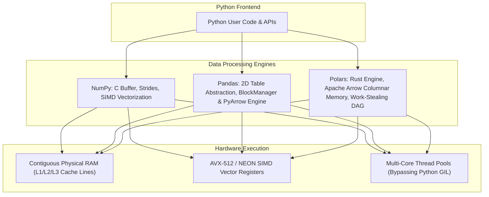
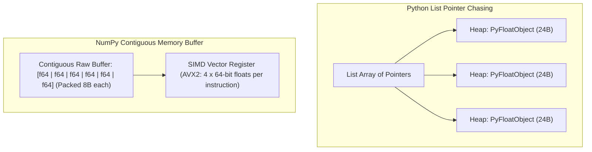
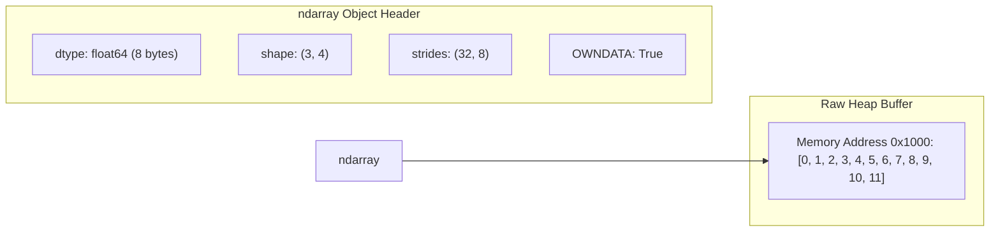
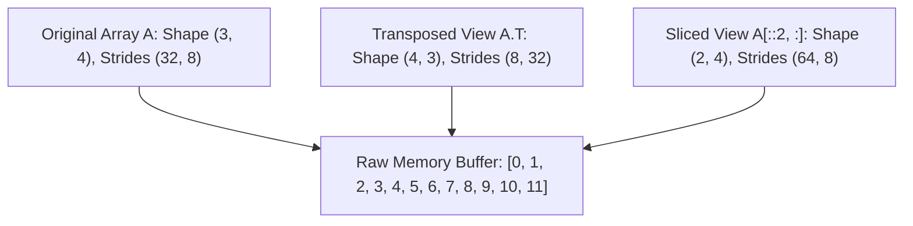
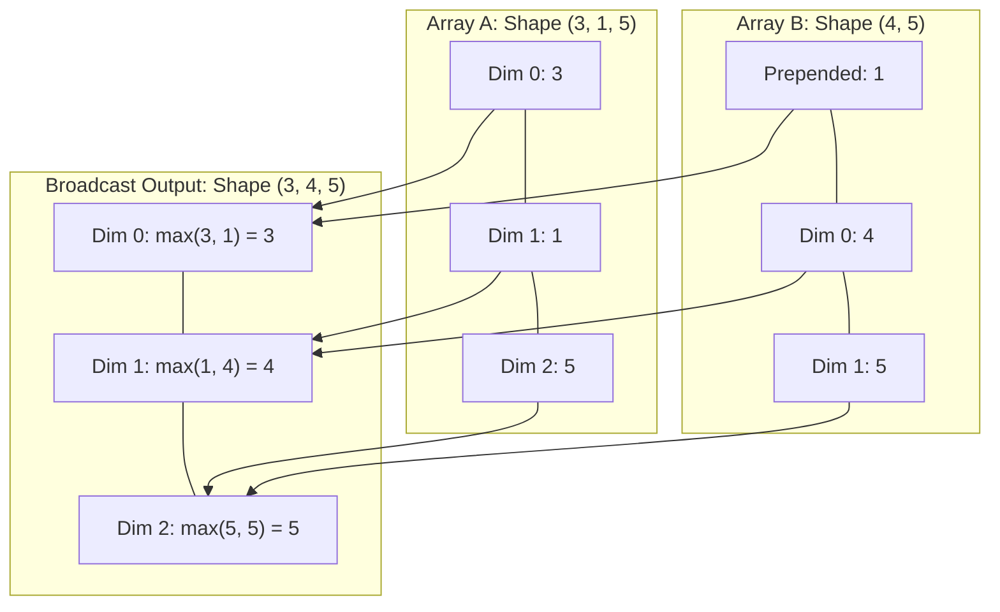
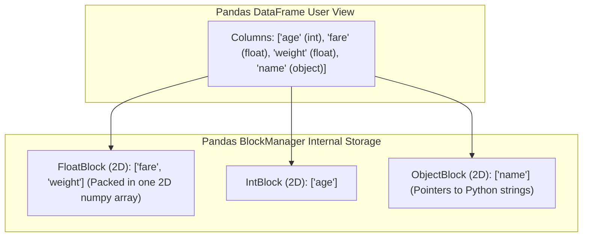
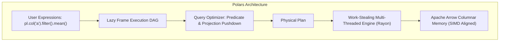
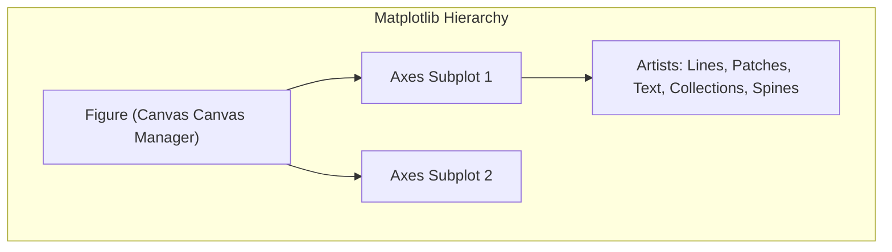

# The Python Data Ecosystem — NumPy Internals, Pandas Architecture & Polars Engine

!!! info "Prerequisites"
    Memory layouts, cache locality, and Python internals. See [Arrays & Memory](../00-computer-science/arrays-deep-dive.md), [Python Internals](../01-python/internals-deep-dive.md), and [Linear Algebra](../02-mathematics/linear-algebra-deep-dive.md).

---

## 1. The Big Picture

High-level Python code is famously interpreted, dynamically typed, and bounded by the Global Interpreter Lock (GIL). Yet Python dominates machine learning and high-performance data processing. The secret lies in the **native data layer**: C, C++, and Rust engines wrapped in idiomatic Python APIs.



Understanding how NumPy manages raw memory strides, how Pandas organizes columnar chunks via its `BlockManager`, and how Polars executes multi-threaded lazy query plans over Apache Arrow buffers is essential for building production ML pipelines that scale gracefully without out-of-memory (OOM) crashes.

---

## 2. Intuition & Real-World Framing

### Cache Lines, CPU Registers, and the Overhead of Python Objects

Consider calculating the sum of 10 million 64-bit floating point numbers.

1. **Pure Python List (`list[float]`)**:
   - A Python `list` is an array of 64-bit **pointers** to heap-allocated `PyFloatObject` structs.
   - Each `PyFloatObject` occupies 24 bytes (16 bytes object header + 8 bytes payload).
   - Traversing the list causes continuous pointer chasing across random heap addresses, producing **L1/L2 cache misses** on almost every access.
   - The Python bytecode evaluation loop checks types and unboxes values on every iteration, subject to the GIL.
   - Total runtime: $\approx 500\text{ ms}$.

2. **NumPy Array (`np.ndarray`)**:
   - A NumPy array stores the numbers in a **single contiguous C-allocated memory buffer** (80 MB for 10M `float64` elements).
   - The CPU prefetcher streams consecutive 64-byte cache lines directly from L3/L2 cache to L1 without stalls.
   - Modern CPUs execute **SIMD (Single Instruction, Multiple Data)** vector instructions (AVX2 / AVX-512 / ARM NEON), processing 4 to 8 floating point additions per clock cycle in hardware registers.
   - Total runtime: $\approx 5\text{ ms}$ (**100x faster**).



---

## 3. NumPy Internals: Strides, Buffers, Views and Broadcasting

### 3.1 The Anatomy of an `ndarray`

A NumPy `ndarray` consists of two distinct components:
1. **The Array Header (Metadata)**: A lightweight Python/C struct storing:
   - `dtype`: Data type and byte width (e.g., `float64`, 8 bytes).
   - `shape`: Tuple representing dimensions (e.g., `(1000, 50)`).
   - `strides`: Tuple indicating how many bytes to skip in raw memory to advance by 1 index along each axis.
   - `flags`: Memory status (`C_CONTIGUOUS`, `F_CONTIGUOUS`, `OWNDATA`, `WRITEABLE`).
2. **The Data Buffer**: A contiguous block of raw memory on the heap containing the raw bytes.



### 3.2 Strides: C-Contiguous vs. Fortran-Contiguous

Let an array have shape $(3, 4)$ with `dtype=float64` (itemsize = 8 bytes).
The raw buffer contains 12 sequential numbers: $[0, 1, \dots, 11]$.

- **C-Order (Row-Major, standard in C/Python)**:
  - Rows are contiguous in memory.
  - To move to the next column: jump 1 element $= 8$ bytes.
  - To move to the next row: jump 4 elements $= 4 \times 8 = 32$ bytes.
  - **Strides**: `(32, 8)`.
- **Fortran-Order (Column-Major, standard in BLAS/LAPACK/MATLAB)**:
  - Columns are contiguous in memory.
  - To move to the next row: jump 1 element $= 8$ bytes.
  - To move to the next column: jump 3 elements $= 3 \times 8 = 24$ bytes.
  - **Strides**: `(8, 24)`.

The memory address of element $(i, j)$ is computed algebraically via:

$$
\text{Address}(i, j) = \text{Data\_Pointer} + i \cdot \text{strides}[0] + j \cdot \text{strides}[1]
$$

### 3.3 Views vs. Copies

Because NumPy decouples array metadata from the underlying memory buffer, many transformations are **zero-copy views**:
- **Reshaping**: `arr.reshape(2, 6)` modifies only `shape` and `strides`. No memory is copied!
- **Transposition**: `arr.T` simply reverses `shape` and `strides` tuples: `(3, 4)` with strides `(32, 8)` becomes `(4, 3)` with strides `(8, 32)`. Execution time is $\mathcal{O}(1)$.
- **Basic Slicing**: `arr[::2, :]` creates a view by doubling the row stride: `strides = (64, 8)`.



**When Copies Occur:**
1. **Fancy Indexing**: `arr[[0, 2], :]` (indexing with integer arrays or boolean masks) always forces an explicit memory copy.
2. **Flattening a Non-Contiguous View**: Calling `.reshape(-1)` or `.flatten()` on an array with non-contiguous strides forces a buffer re-allocation.

### 3.4 The Mechanics of NumPy Broadcasting

Broadcasting enables operations between arrays of different shapes without allocating intermediate memory.

#### The Formal Broadcasting Rules:
Two arrays are compatible for broadcasting if, starting from the **trailing (rightmost) dimensions** and working backwards:
1. The dimensions are equal, OR
2. One of the dimensions is exactly $1$.



#### Under the Hood: The Zero-Stride Trick:
When dimension $k$ of an array has size $1$ and is broadcast to size $M$, NumPy does **not** copy the data $M$ times. Instead, it sets the stride for that axis to **0 bytes**:

$$
\text{strides}[k] = 0
$$

As the CPU iterates along that dimension, the memory offset advances by $i \cdot 0 = 0$, repeatedly re-reading the exact same memory address directly out of the L1 cache!

---

## 4. Pandas Architecture: Series, DataFrame and the BlockManager

### 4.1 The BlockManager in Pandas 1.x

Historically, Pandas structured a DataFrame internally as a collection of 2D NumPy arrays grouped by homogeneous dtype, managed by the **BlockManager**:
- One 2D float block storing all `float64` columns.
- One 2D int block storing all `int64` columns.
- One object block storing strings, dates, and Python objects.



#### Pathologies of the BlockManager:
1. **Consolidation Overhead**: Inserting or altering a single column frequently triggered full consolidation, re-allocating and copying entire 2D blocks.
2. **String Memory Explosion**: Strings were stored as arrays of pointers to `PyUnicode` objects, consuming 50-80 bytes per string and causing severe memory bloat.
3. **Missing Value Inconsistency**: `NaN` was exclusively a float (`np.nan`). Storing a single missing value in an integer column silently cast the entire column to `float64`!

### 4.2 Pandas 2.0 and the PyArrow Backend

Pandas 2.0 introduced first-class integration with the **Apache Arrow** columnar format:
- True missing value support (`pd.NA`) without dtype casting.
- Zero-copy string representation using UTF-8 contiguous byte buffers and offset arrays.
- 5x–10x memory reduction and accelerated vectorized execution via PyArrow kernels.

---

## 5. Polars: Apache Arrow and the Rust Multi-Threaded Engine

Polars was designed from scratch in Rust to address the architectural bottlenecks of Pandas.



### 5.1 The Apache Arrow Memory Format

Apache Arrow specifies a standardized, language-agnostic in-memory columnar format:
1. **Bitmaps for Nulls**: Nullability is tracked via a compact validity bitmap (1 bit per row). Null values consume zero memory in the data buffer.
2. **Contiguous Arrays**: Primitive numeric types are stored in contiguous 64-byte aligned buffers, ready for AVX-512 vectorization.
3. **Variable-Length Binary / String Layout**:
   - `Offsets Buffer`: Array of 32-bit or 64-bit integers pointing to byte starts.
   - `Values Buffer`: Flat contiguous UTF-8 byte stream.
   - Slicing strings is an $\mathcal{O}(1)$ operation updating offsets; bytes are never copied.

### 5.2 Polars Query Optimizations

Unlike Pandas, which evaluates operations **eagerly** step by step, Polars operates primarily through **LazyFrames**:

```python
import polars as pl

# Builds a logical execution DAG without executing any data reads
query = (
    pl.scan_parquet("large_dataset.parquet")
    .filter(pl.col("country") == "US")
    .select(["user_id", "revenue"])
    .group_by("user_id")
    .agg(pl.col("revenue").sum())
)
```

#### Key Optimization Passes:
1. **Predicate Pushdown**: Moves `.filter()` conditions as close to the storage layer as possible. When reading Parquet files, row groups that do not match the filter are skipped entirely at the file metadata level (Parquet statistics pruning).
2. **Projection Pushdown**: Drops unneeded columns at scan time. If a table has 200 columns and the query only selects 2, only those 2 columns are read from disk into RAM.
3. **Common Sub-expression Elimination**: Computes identical expressions once and caches results across downstream branches.

---

## 6. Visualization Architecture: Matplotlib, Seaborn and Plotly

| Dimension | Matplotlib | Seaborn | Plotly |
|---|---|---|---|
| **Paradigm** | Imperative, Object-Oriented (`Figure`, `Axes`) | Declarative, Statistical facade over Matplotlib | Declarative JSON schema specification |
| **Output Type** | Raster (PNG) or Vector (SVG, PDF) | Static raster/vector via Matplotlib | Web-native interactive HTML/WebGL |
| **Data Format** | NumPy arrays, raw lists | Pandas / Polars DataFrames (tidy long-form) | Tidy tabular data, JSON dictionaries |
| **Best Used For** | Precise publication-quality figures, custom plots | Exploratory data analysis, statistical distributions | Dashboards, interactive exploration, 3D embeddings |



---

## 7. Python Implementation: Memory Profiling and Stride Tricks

Below is a complete, runnable script demonstrating:
1. Memory buffer inspection and stride manipulation (`as_strided` for zero-copy sliding windows).
2. The zero-stride broadcasting mechanism.
3. A performance benchmark comparing **Python List vs. NumPy vs. Pandas vs. Polars**.

```python
"""
data_ecosystem_deep_dive.py
Demonstration of NumPy memory strides, zero-copy buffer views,
and high-performance data processing benchmarks.
"""

from typing import Tuple
import time
import numpy as np
from numpy.lib.stride_tricks import as_strided
import pandas as pd
import polars as pl


def inspect_array_memory(name: str, arr: np.ndarray):
    """Prints comprehensive memory metadata for a NumPy array."""
    print(f"--- Array: {name} ---")
    print(f"Shape:            {arr.shape}")
    print(f"Dtype:            {arr.dtype} ({arr.itemsize} bytes per element)")
    print(f"Strides:          {arr.strides}")
    print(f"Buffer Address:   {hex(arr.ctypes.data)}")
    print(f"Owns Data:        {arr.flags.owndata}")
    print(f"C-Contiguous:     {arr.flags.c_contiguous}")
    print(f"F-Contiguous:     {arr.flags.f_contiguous}")
    print(f"Total Bytes:      {arr.nbytes} bytes\n")


def zero_copy_sliding_window_1d(
    arr: np.ndarray, window_size: int, step: int = 1
) -> np.ndarray:
    """
    Creates a 2D view of a 1D array representing overlapping sliding windows
    without copying any data using NumPy stride tricks.
    """
    assert arr.ndim == 1, "Input must be 1D"
    n_elements = arr.shape[0]
    num_windows = (n_elements - window_size) // step + 1
    elem_bytes = arr.strides[0]

    new_shape = (num_windows, window_size)
    new_strides = (elem_bytes * step, elem_bytes)

    return as_strided(arr, shape=new_shape, strides=new_strides, writeable=False)


def benchmark_engine_runtimes():
    """Benchmarks pure Python, NumPy, Pandas, and Polars on 5 million rows."""
    N = 5_000_000
    print(f"=== Execution Benchmark: Summing & Filtering {N:,} Elements ===")

    # 1. NumPy
    raw_np = np.random.randn(N).astype(np.float64)

    t0 = time.perf_counter()
    np_sum = np.sum(raw_np[raw_np > 0.0])
    t_np = (time.perf_counter() - t0) * 1000.0
    print(f"NumPy (C/SIMD):    {t_np:8.2f} ms | Result: {np_sum:.2f}")

    # 2. Pandas (NumPy backend)
    df_pd = pd.DataFrame({"val": raw_np})
    t0 = time.perf_counter()
    pd_sum = df_pd.loc[df_pd["val"] > 0.0, "val"].sum()
    t_pd = (time.perf_counter() - t0) * 1000.0
    print(f"Pandas (BlockMgr): {t_pd:8.2f} ms | Result: {pd_sum:.2f}")

    # 3. Polars (Apache Arrow / Rust multi-threaded)
    df_pl = pl.DataFrame({"val": raw_np})
    t0 = time.perf_counter()
    pl_sum = df_pl.filter(pl.col("val") > 0.0).select(pl.col("val").sum())[0, 0]
    t_pl = (time.perf_counter() - t0) * 1000.0
    print(f"Polars (Rust/Arrow): {t_pl:6.2f} ms | Result: {pl_sum:.2f}\n")


# ---------------------------------------------------------
# Execution & Verification
# ---------------------------------------------------------
if __name__ == "__main__":
    # 1. Inspect Base Array and Transpose
    base = np.arange(12, dtype=np.int64).reshape(3, 4)
    inspect_array_memory("Original Matrix (3, 4)", base)

    transposed = base.T
    inspect_array_memory("Transposed Matrix (4, 3)", transposed)
    print("Notice: Buffer address is IDENTICAL; only shape and strides swapped!\n")

    # 2. Stride Tricks Sliding Window
    timeseries = np.array([10, 20, 30, 40, 50, 60, 70], dtype=np.int64)
    windows = zero_copy_sliding_window_1d(timeseries, window_size=3, step=1)
    print("Original Time Series:", timeseries)
    print(f"Sliding Windows (Window=3, Step=1):\n{windows}")
    print(f"Windows base matches timeseries: {windows.base is timeseries}\n")

    # 3. Zero-Stride Broadcasting Verification
    x = np.array([1, 2, 3], dtype=np.int64)
    # Broadcast (3,) to (4, 3) without copying
    broadcasted = np.broadcast_to(x, (4, 3))
    inspect_array_memory("Broadcasted Array (4, 3)", broadcasted)
    print("Notice: Stride for axis 0 is exactly 0 bytes!\n")

    # 4. Engine Benchmarks
    benchmark_engine_runtimes()
```

---

## 8. Common Errors and Debugging

| Bug / Phenomenon | Root Cause | Diagnosis Method | Production Fix |
|---|---|---|---|
| **`SettingWithCopyWarning`** | Chained indexing `df[mask]['col'] = val` acts on an intermediate object that may be a copy or a view. | Look for chained square brackets `df[...] [...] = ...`. | Use `.loc[row_indexer, col_indexer] = val` for atomic in-place modification. |
| **`as_strided` Memory Corruption / Segfault** | Constructing invalid stride shapes that read or write past allocated buffer boundaries. | Immediate Python interpreter crash (Segmentation fault). | Always verify index bounds: $(N - W) \cdot \text{stride} \le \text{buffer\_bytes}$; set `writeable=False` on views. |
| **Silent Memory Duplication on Non-Contiguous Reshape** | Calling `.reshape(-1)` on a transposed or non-contiguous view forces an implicit buffer allocation. | Check `arr.flags.c_contiguous` prior to flattening. | If a contiguous buffer is required, use `np.ascontiguousarray(arr)`. |
| **Broadcasting Shape Traps** | Operating on shapes `(N,)` and `(N, 1)` produces an unintended outer product of shape `(N, N)`. | Check `arr.ndim` and `arr.shape` for missing singleton axes. | Enforce explicit shapes using `arr.reshape(-1, 1)` or `assert a.shape == b.shape`. |
| **Object Dtype Memory Bloat in Pandas** | Leaving text columns as `object` dtype (Python string pointers) instead of `category` or PyArrow `string`. | Profile DataFrame memory with `df.info(memory_usage='deep')`. | Convert to Arrow string or category: `df['col'] = df['col'].astype('string[pyarrow]')`. |

---

## 9. Staff-Level Technical Interview Questions

### Q1: Explain NumPy strides and how `as_strided` enables creating sliding window views without memory copies. What are the memory safety risks?
**Model Answer:**
In NumPy, an `ndarray` consists of a pointer to a flat memory buffer and a `strides` tuple that defines the number of bytes to step along each axis to locate the next item. The byte position of index $(i, j)$ is:
$$\text{offset} = i \cdot \text{strides}[0] + j \cdot \text{strides}[1]$$
To construct an overlapping sliding window view of length $W$ over a 1D array of length $N$ with step $S$:
- Output shape is: $\left(\frac{N - W}{S} + 1, \; W\right)$
- Output strides are: $(S \cdot \text{itemsize}, \; \text{itemsize})$
`np.lib.stride_tricks.as_strided` creates an array header with this shape and strides pointing to the exact same buffer. Time and memory complexities are $\mathcal{O}(1)$.

**Memory Safety Risks:**
`as_strided` performs no bounds checking. If the user specifies strides or shapes that evaluate to offsets beyond the buffer allocation, indexing into the array reads arbitrary process memory or writes into foreign heap regions, causing **segmentation faults, silent memory corruption, or security vulnerabilities**. Always mark strided views as `writeable=False`.

---

### Q2: How does NumPy broadcasting work under the hood in terms of array strides and shape tuples?
**Model Answer:**
NumPy compares shapes elementwise from trailing to leading dimensions. Two axes are compatible if their dimensions match or if one of them is $1$.
Under the hood:
1. **Prepending Dimensions:** If arrays have different numbers of dimensions, the array with fewer dimensions is prepended with dimensions of size 1 until shapes have equal length.
2. **Zero-Stride Mapping:** For every axis where an array has dimension $1$ while the other array has dimension $M > 1$, NumPy sets the corresponding stride value for that axis to **0 bytes**:
   $$\text{strides}[k] = 0, \quad \text{shape}[k] = M$$
When looping over that axis during a C-level kernel operation, the memory pointer advances by $i \cdot 0 = 0$. The single existing value in memory is repeatedly read directly from the CPU L1 cache line without allocating an expanded $M$-element buffer.

---

### Q3: Explain the internal architecture of the Pandas BlockManager. Why did Pandas 1.x struggle with memory fragmentation, and how does the Apache Arrow backend in Pandas 2.0 address this?
**Model Answer:**
In Pandas 1.x, a DataFrame was represented internally by the `BlockManager`, which grouped columns of identical NumPy dtypes into consolidated 2D NumPy arrays ("blocks"):
- A single 2D float block held all float columns; a 2D integer block held integers; an object block held strings/objects.

**Bottlenecks:**
1. **Memory Fragmentation & Re-allocation:** Adding, deleting, or type-casting a single column invalidated the 2D block, forcing a copy of all companion columns in that block.
2. **Type Coercion for Missing Values:** Because NumPy had no native bitmask for missing integers, inserting `np.nan` into an `int64` column coerced the entire column and its block to `float64`.
3. **Object String Overhead:** Strings were stored as arrays of pointers to individual Python `PyUnicode` objects, wasting memory on object headers and destroying CPU cache locality.

**Pandas 2.0 PyArrow Solution:**
Pandas 2.0 replaces the BlockManager with 1D **Apache Arrow Array** columns:
- Nulls are tracked natively with 1-bit boolean validity bitmaps without type coercion.
- Strings are stored in packed, contiguous UTF-8 byte buffers with integer offset arrays.
- Columns are independent Arrow chunks, eliminating 2D block re-allocation overhead.

---

### Q4: Compare the query execution model of Polars with Pandas. How does Polars utilize Rust, Apache Arrow, and work-stealing parallelism?
**Model Answer:**
- **Pandas (Eager, Single-Threaded, Block-Based):**
  Operations are evaluated eagerly one statement at a time. Intermediate DataFrames are materialized in RAM. The Python GIL limits execution to a single thread unless external C routines release it.
- **Polars (Lazy, Multi-Threaded, Columnar Arrow Engine):**
  1. **Expression Trees & DAGs:** Polars expressions (`pl.col('x').mean()`) construct an abstract syntax tree (AST). In `LazyFrame` mode, the full sequence of operations forms a Directed Acyclic Graph (DAG) before execution.
  2. **Query Optimizer:** The DAG is optimized via rule-based passes (predicate pushdown, projection pushdown, slice pushdown, common sub-expression elimination) before touching data.
  3. **Work-Stealing Multi-Threading:** Built in Rust using the `Rayon` concurrency library, Polars divides data into chunks and processes them across available CPU cores using a lock-free work-stealing pool, completely bypassing the Python GIL.
  4. **Vectorized SIMD on Arrow:** Contiguous 64-byte aligned Arrow buffers allow Rust kernels to execute AVX-512 instructions across millions of rows per core.

---

### Q5: What is predicate pushdown and projection pushdown in query optimization? Walk through how they transform a physical query plan reading large datasets.
**Model Answer:**
- **Projection Pushdown (Column Pruning):**
  Analyzes the query AST to determine the exact subset of columns needed by downstream aggregations, filters, or outputs. Unreferenced columns are eliminated at the scan layer. If a Parquet or Arrow table has 100 columns and the query only uses 3, the disk I/O reader decodes only the chunks corresponding to those 3 columns, saving up to 97% of disk bandwidth and memory.
- **Predicate Pushdown (Filter Early):**
  Moves `.filter()` conditions down the query tree to the data source.
  When reading columnar formats like Apache Parquet or Apache Iceberg, files contain **row group metadata** with summary statistics (`min` and `max` values per column chunk).
  If a filter specifies `filter(date >= '2024-01-01')` and a Parquet row group records `max_date = '2023-12-31'`, the entire row group (often 100,000+ rows) is skipped **without reading or decompressing the bytes from disk**.

---

### Q6: Explain the `SettingWithCopyWarning` in Pandas. Under what exact conditions does Pandas return a view versus a copy, and why does chained assignment fail?
**Model Answer:**
The warning is emitted during **chained assignment**, such as:
```python
df[df['age'] > 30]['salary'] = 100000
```
This expression executes in two distinct steps:
1. `temp = df[df['age'] > 30]`
2. `temp['salary'] = 100000`

**The Core Issue:**
Depending on whether the original DataFrame is contiguous, consolidated, or multi-typed, step 1 may return:
- A **view** pointing to the original buffer: the assignment in step 2 modifies the original `df`.
- A **copy** stored in a newly allocated buffer: the assignment in step 2 modifies the temporary object `temp`, which is immediately garbage collected! The original `df` remains unchanged.

Because Pandas cannot guarantee whether step 1 produced a view or a copy, it raises `SettingWithCopyWarning`.

**Production Fix:**
Use `.loc` for atomic, single-step indexing:
```python
df.loc[df['age'] > 30, 'salary'] = 100000
```
This bypasses intermediate object creation and updates the buffer in place.

---

### Q7: Compare the architectural pipelines of Matplotlib, Seaborn, and Plotly.
**Model Answer:**
- **Matplotlib (Imperative Object-Oriented Canvas):**
  Architectured around a strict hierarchy: `Figure` $\to$ `Axes` $\to$ `Artists` (`Line2D`, `PathCollection`, `Text`). Every geometric element must be imperatively configured and transformed through Matplotlib's coordinate transformation pipeline (Data $\to$ Axes $\to$ Figure $\to$ Display). Renders statically to raster (Agg backend) or vector (PDF/SVG).
- **Seaborn (Declarative Statistical Facade):**
  Operates on top of Matplotlib's backend. Accepts tidy DataFrames and automatically maps data columns to visual channels (hue, size, style). Executes statistical computations (KDE estimation, regression lines, confidence intervals via bootstrapping) before constructing the underlying Matplotlib `Axes` and `Artist` elements.
- **Plotly (Declarative JSON / WebGL Engine):**
  Does not use Matplotlib. Plotly Python builds a declarative JSON tree conforming to the open-source `plotly.js` schema. Rendering occurs client-side in browser environments using HTML5 Canvas, SVG, or hardware-accelerated **WebGL** (via `Scattergl`), enabling 60 FPS interactive panning, zooming, and 3D rendering over millions of data points.

---

## 10. Mastery Ladder

Complete this checklist to verify your depth in the Python data ecosystem:

- [ ] **L1:** You can inspect `shape`, `dtype`, and `strides` on any NumPy array and calculate physical byte offsets.
- [ ] **L2:** You understand the difference between C-contiguous and Fortran-contiguous memory layouts and their cache implications.
- [ ] **L3:** You can explain why transposing or reshaping an array produces a zero-copy view rather than a memory duplication.
- [ ] **L4:** You can state the broadcasting rules and explain how NumPy implements broadcasting via zero-byte strides.
- [ ] **L5:** You can write a zero-copy sliding window view using `np.lib.stride_tricks.as_strided` and explain its safety requirements.
- [ ] **L6:** You can diagnose and resolve the Pandas `SettingWithCopyWarning` using atomic `.loc` indexing.
- [ ] **L7:** You can explain how the Pandas 1.x `BlockManager` caused memory fragmentation and how the Apache Arrow backend resolves it.
- [ ] **L8:** You can describe the Apache Arrow memory specification (bitmaps for nulls, contiguous value buffers, offset arrays for strings).
- [ ] **L9:** You can explain predicate pushdown and projection pushdown in Polars and demonstrate how they accelerate Parquet reading.
- [ ] **L10:** You can explain the architectural trade-offs between Matplotlib, Seaborn, and Plotly (WebGL rendering vs. rasterized display).
