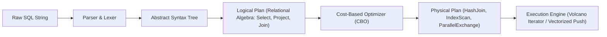
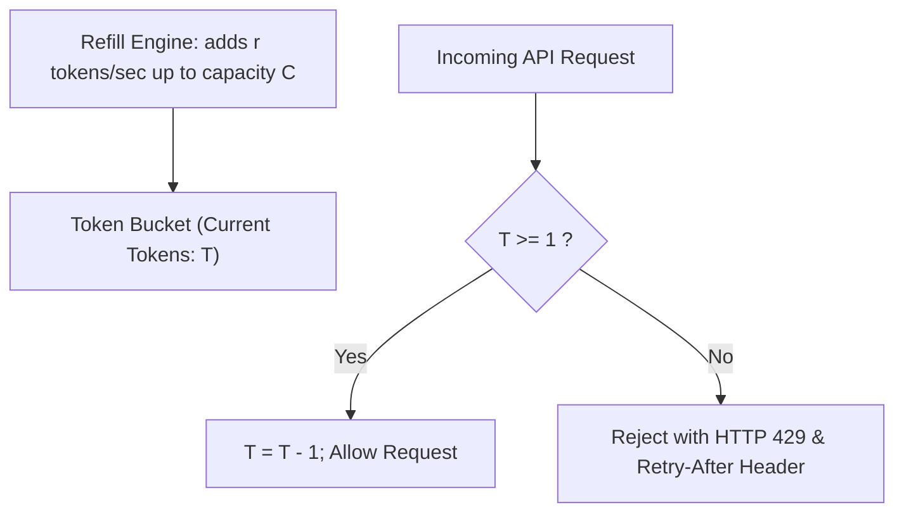

# Data Formats, Storage & Query Engines — Row vs. Columnar, Parquet, SQL & Lakehouses

!!! info "Prerequisites"
    Memory layouts, hashing, and trees. See [The Python Data Ecosystem](data-ecosystem-deep-dive.md), [Hash Tables & Sets](../00-computer-science/hash-tables-sets-deep-dive.md), and [Trees & Heaps](../00-computer-science/trees-deep-dive.md).

---

## 1. The Big Picture

Machine learning models rarely consume pristine data from an in-memory array. Production features and training sets are extracted from diverse, multi-tier data storage architectures: relational databases, streaming event buses, distributed analytical warehouses, and cloud object lakes.

```mermaid
flowchart TD
    subgraph Operational Ingestion (OLTP)
        APP["Application Event Producers"] --> API["REST / gRPC APIs (Token Bucket Rate Limiting)"]
        API --> OLTP["OLTP RDBMS: PostgreSQL / MySQL (Row-Oriented, B-Tree, ACID)"]
    end
    subgraph Analytical Transformation (OLAP)
        OLTP --> CDC["Change Data Capture (Debezium / Kafka)"]
        CDC --> LAKE["Cloud Object Storage (AWS S3 / GCS / Azure Blob)"]
        LAKE --> LH["Lakehouse Table Format: Delta Lake / Apache Iceberg (ACID, Snapshot Isolation)"]
        LH --> PAR["Columnar Storage: Apache Parquet (Snappy/ZSTD, Dictionary Encoding)"]
    end
    subgraph Query Execution & Feature Serving
        PAR --> DUCK["Vectorized Query Engines: DuckDB / ClickHouse / Snowflake / BigQuery"]
        DUCK --> ML["ML Feature Stores & Training Pipelines"]
    end
```

Choosing the wrong storage format, ingestion pattern, or SQL execution strategy can mean the difference between an ETL pipeline that finishes in 3 minutes for \$0.50 and one that crashes with Out-Of-Memory errors after 12 hours, costing \$5,000 on cloud infrastructure.

---

## 2. Intuition & Real-World Framing

### Row-Oriented vs. Column-Oriented Storage

Imagine a table of 100,000,000 retail transactions with 50 columns (Customer ID, Timestamp, Item ID, Category, Price, Latitude, Longitude, Payment Method, Tax, etc.).

We run an analytical machine learning aggregation query:

```sql
SELECT Category, AVG(Price) 
FROM transactions 
WHERE Timestamp >= '2024-01-01' 
GROUP BY Category;
```

#### 1. The Row-Oriented Approach (CSV, JSON, PostgreSQL Heap Pages):
- Data is stored on disk row-by-row:
  $$\text{Row 1} \to [c_1, c_2, \dots, c_{50}], \quad \text{Row 2} \to [c_1, c_2, \dots, c_{50}]$$
- To evaluate `AVG(Price)`, the storage engine must load **all 50 columns** of every single row from disk into RAM.
- If each row is 500 bytes, scanning 100M rows requires reading **50 GB of disk I/O**, even though `Price`, `Category`, and `Timestamp` only account for 20 bytes per row (96% of disk bandwidth is wasted reading discarded features).

#### 2. The Column-Oriented Approach (Apache Parquet, ClickHouse, Snowflake):
- Data is grouped into blocks and stored column-by-column:
  $$\text{Block 1} \to \text{Category}[1 \dots N], \quad \text{Price}[1 \dots N], \quad \text{Timestamp}[1 \dots N]$$
- The engine reads **only the 3 relevant columns** from disk (2 GB instead of 50 GB).
- Because all values in a column share the exact same data type and high statistical redundancy (e.g., millions of repeated "Electronics" strings), compression algorithms compress the data by 80% to 90%.
- Total disk read drops from **50 GB to 300 MB** (**160x reduction in disk I/O**).

```mermaid
flowchart TD
    subgraph Row Storage (CSV / OLTP)
        R1["Row 1: [ID: 1 | Cat: Shoes | Price: 50.0 | User: Bob]"]
        R2["Row 2: [ID: 2 | Cat: Tech  | Price: 900.0| User: Ann]"]
        R1 --- R2
    end
    subgraph Columnar Storage (Parquet / OLAP)
        C1["Column 'Category': ['Shoes', 'Tech'] (High compression, RLE)"]
        C2["Column 'Price': [50.0, 900.0] (SIMD float vectorization)"]
        C3["Column 'User': ['Bob', 'Ann'] (Dictionary encoded)"]
    end
```

---

## 3. Storage Formats and Compression Codecs

### 3.1 Format Comparison Matrix

| Format | Orientation | Schema Enforcement | Compression Efficiency | Splittable (Parallel Read) | Best Used For |
|---|---|---|---|---|---|
| **CSV** | Row | None (Plain text) | Very Poor | Difficult (requires newline scanning) | Ad-hoc small data exchange ($< 50\text{ MB}$) |
| **JSON / JSONL** | Row | Dynamic / Semi-structured | Poor | Line-delimited (JSONL) is splittable | Web API responses, document storage, LLM fine-tuning data |
| **Apache Parquet** | Columnar | Strict binary schema | Excellent (Snappy, ZSTD, Dictionary) | Yes (Row Groups) | Production ML feature storage, analytical query lakes |
| **Apache Arrow / Feather** | Columnar | Strict binary schema | Uncompressed or LZ4 | Yes | Zero-copy inter-process RAM transfer between Python/Rust |

### 3.2 Anatomy of an Apache Parquet File

A Parquet file is organized hierarchically to allow parallel reading and fine-grained metadata pruning:

```mermaid
flowchart TD
    subgraph Parquet File
        MAGIC1["Magic Number: 'PAR1'"]
        subgraph Row Group 1 (e.g. 512MB / 1,000,000 rows)
            subgraph Column Chunk 1 (Feature A)
                P1["Dictionary Page"]
                P2["Data Page 1 (Snappy compressed)"]
                P3["Data Page 2 (Snappy compressed)"]
            end
            subgraph Column Chunk 2 (Feature B)
                P4["Data Page 1"]
            end
        end
        subgraph Row Group 2
            RG2["Row Group 2 Chunks..."]
        end
        subgraph File Footer Metadata
            META["Schema Definition"]
            STATS["Column Statistics: min/max/null_count per Row Group"]
            OFFSETS["Byte Offsets to every Column Chunk & Page"]
        end
        MAGIC2["Magic Number: 'PAR1'"]
    end
    MAGIC1 --> Row Group 1 --> Row Group 2 --> File Footer Metadata --> MAGIC2
```

#### Why Parquet Reads Are Fast:
1. **Footer-First Reading**: Parquet readers seek directly to the end of the file to parse the **File Footer Metadata**.
2. **Row Group Pruning**: The footer stores `min` and `max` statistics for each column in every Row Group. If a query filters for `Price > 1000` and Row Group 1 has `max_price = 450`, the reader **skips the entire Row Group without reading a single byte of its data**.
3. **Dictionary Encoding**: Strings are replaced with small integers (e.g., 1 byte) pointing to a unique vocabulary page.
4. **Run-Length Encoding (RLE) & Bit-Packing**: Repeated values (e.g., ten consecutive zeros: `0, 0, 0, 0, 0, 0, 0, 0, 0, 0`) are encoded as `(10, 0)`.

---

## 4. Database Indexing and the SQL Execution Engine

### 4.1 Index Architectures: B-Tree vs. LSM-Tree

Indexes are auxiliary data structures used by query engines to locate records without executing full table scans.

```mermaid
flowchart TD
    subgraph B-Tree (Read-Optimized, In-Place Updates)
        ROOT["Root Node [50]"] --> N1["Internal Node [20, 35]"]
        ROOT --> N2["Internal Node [65, 80]"]
        N1 --> L1["Leaf: [10, 15]"]
        N1 --> L2["Leaf: [25, 30]"]
    end
    subgraph LSM-Tree (Write-Optimized, Append-Only)
        W["Incoming Writes"] --> WAL["Write-Ahead Log (Disk)"]
        W --> MEM["MemTable (RAM Red-Black Tree)"]
        MEM -- Flush --> L0["SSTable Level 0 (Immutable sorted disk files)"]
        L0 -- Compaction --> L1_DISK["SSTable Level 1"]
    end
```

| Dimension | B-Tree Index | Log-Structured Merge (LSM) Tree |
|---|---|---|
| **Underlying Structure** | Balanced multi-way search tree on disk pages | In-memory MemTable flushed to immutable Sorted String Tables (SSTables) |
| **Write Model** | In-place random disk writes (page modification) | Append-only sequential disk writes |
| **Write Amplification** | High (updating 1 row rewrites entire 4KB-16KB page) | Moderate to High (due to background compaction) |
| **Write Throughput** | Moderate | Extremely High |
| **Point Lookup** | $\mathcal{O}(\log_B N)$ (1-3 random disk seeks) | $\mathcal{O}(1)$ via Bloom Filters, then binary search on SSTable |
| **Range Scan** | Extremely fast (leaf nodes are doubly linked lists) | Slower (requires merging multiple active SSTable levels) |
| **Used In** | PostgreSQL, MySQL (InnoDB), SQLite, Oracle | RocksDB, Cassandra, ClickHouse, Apache Lucene/Elasticsearch |

### 4.2 The Lifecycle of a SQL Query

When a query is dispatched to a database engine, it passes through four distinct phases:



### 4.3 Join Algorithms in Query Engines

When joining two tables $R$ (Build side, smaller) and $S$ (Probe side, larger) on $R.\text{id} = S.\text{user\_id}$:

1. **Nested Loop Join**:
   - For each row in $R$, scan all rows in $S$. Time complexity: $\mathcal{O}(|R| \cdot |S|)$.
   - Only selected for tiny tables or when an index exists on the join column of $S$ ($\mathcal{O}(|R| \log |S|)$).
2. **Hash Join**:
   - Phase 1 (Build): Hash the smaller table $R$ into an in-memory hash table using the join key.
   - Phase 2 (Probe): Scan table $S$ sequentially, hashing each row's key and probing the hash table for matches.
   - Time complexity: $\mathcal{O}(|R| + |S|)$. Memory complexity: $\mathcal{O}(|R|)$.
3. **Sort-Merge Join**:
   - Both tables are sorted by the join key (or read from an index that is already sorted).
   - Two pointers advance through the tables in lockstep.
   - Time complexity: $\mathcal{O}(|R| \log |R| + |S| \log |S| + |R| + |S|)$. Preferred when data is already sorted or exceeds available RAM.

### 4.4 Advanced SQL: Window Functions

Unlike `GROUP BY`, which collapses multiple rows into a single summary row, **window functions** compute aggregations over an explicit partition of rows while preserving each individual row's identity.

```sql
SELECT 
    user_id,
    transaction_date,
    amount,
    -- Ranking within user partition
    ROW_NUMBER() OVER(PARTITION BY user_id ORDER BY transaction_date DESC) as tx_rank,
    -- Running cumulative sum over user history
    SUM(amount) OVER(
        PARTITION BY user_id 
        ORDER BY transaction_date 
        ROWS BETWEEN UNBOUNDED PRECEDING AND CURRENT ROW
    ) as cumulative_spend,
    -- Prior transaction amount for lag feature
    LAG(amount, 1, 0.0) OVER(PARTITION BY user_id ORDER BY transaction_date) as prev_amount
FROM transactions;
```

---

## 5. Ingestion Protocols: REST APIs, Rate Limiting and Pagination

### 5.1 The Token Bucket Rate Limiting Algorithm

To protect backend ML inference and data ingestion services from being overwhelmed by bursty traffic, production gateways enforce **Token Bucket Rate Limiting**:
- A bucket holds up to $C$ tokens (maximum burst capacity).
- Tokens are continuously added to the bucket at a constant fill rate $r$ tokens per second.
- When an API request arrives:
  - If tokens $\ge 1$, 1 token is consumed, and the request proceeds.
  - If tokens $< 1$, the request is rejected immediately with HTTP status `429 Too Many Requests`.



#### Differential Refill Formulation:
Instead of running a background timer that ticks every millisecond, production implementations calculate replenishment **lazily** upon request arrival:

$$
T_{\text{now}} = \min\left(C, \; T_{\text{last}} + (t_{\text{now}} - t_{\text{last}}) \cdot r\right)
$$

### 5.2 API Pagination: Offset vs. Keyset (Cursor-Based)

When ingesting millions of records across an HTTP REST API or database query:

```mermaid
flowchart TD
    subgraph Offset Pagination (O(N) Degradation)
        O1["SELECT * FROM events ORDER BY id LIMIT 10 OFFSET 1000000;"]
        O2["Database must scan and discard 1,000,000 rows in index!"]
        O3["Concurrent inserts cause duplicate / skipped records!"]
        O1 --> O2 --> O3
    end
    subgraph Keyset / Cursor Pagination (O(1) Seek)
        K1["SELECT * FROM events WHERE id > 1000000 ORDER BY id LIMIT 10;"]
        K2["B-Tree seeks directly to key 1000000 in O(log N) time!"]
        K3["Completely immune to concurrent insert shifts!"]
        K1 --> K2 --> K3
    end
```

---

## 6. Analytical Warehouses and Lakehouse Architectures

### 6.1 OLTP vs. OLAP vs. The Data Lakehouse

```mermaid
flowchart LR
    subgraph OLTP (Transactional)
        T1["PostgreSQL / MySQL"]
        T2["Row-oriented, Normalized (3NF), B-Trees, Short ACID transactions"]
        T1 --- T2
    end
    subgraph OLAP (Analytical Warehouse)
        A1["Snowflake / BigQuery / ClickHouse"]
        A2["Columnar, Denormalized, Massively Parallel Processing (MPP)"]
        A1 --- A2
    end
    subgraph Modern Lakehouse
        L1["Delta Lake / Apache Iceberg / Apache Hudi"]
        L2["ACID transactions over cheap object storage (S3) via Parquet + Transaction Log"]
        L1 --- L2
    end
```

### 6.2 How Lakehouses Achieve ACID over Object Storage

Cloud object stores (AWS S3, Google Cloud Storage) are inherently **dumb, eventually-consistent key-value stores**. They do not support multi-file atomic commits, row-level updates, or transactions.

Modern lakehouse table formats (**Apache Iceberg**, **Delta Lake**) decouple table metadata from the raw data files:

```mermaid
flowchart TD
    subgraph Metadata Layer (ACID & Snapshots)
        LOG["Table Metadata / Commit Log: snapshot_v3.json"]
        M1["Manifest List: Identifies valid manifest files for snapshot"]
        M2["Manifest Files: Tracks list of active Parquet files + min/max stats"]
        LOG --> M1 --> M2
    end
    subgraph Physical Storage Layer (Immutable Parquet)
        M2 --> F1["data_file_001.parquet"]
        M2 --> F2["data_file_002.parquet"]
        M2 --> F3["data_file_003.parquet (Added in v3)"]
    end
```

#### The Mechanics of ACID Guarantees:
1. **Copy-on-Write / Merge-on-Read**: Data files on disk are **strictly immutable**. When an `UPDATE` or `DELETE` occurs, old files are never modified in place. New Parquet files containing the updated rows are written.
2. **Atomic Log Commits**: An update succeeds only when a new metadata commit JSON file is atomically written. If two processes attempt to commit simultaneously, the engine uses **Optimistic Concurrency Control (OCC)**: the second writer detects the version conflict, replays its change against the new snapshot, and retries.
3. **Time Travel**: Because previous snapshots and their corresponding Parquet files are retained until explicit garbage collection, queries can query exact historical states: `SELECT * FROM table TIMESTAMP AS OF '2024-01-01'`.

---

## 7. Python Implementation: Rate Limiter, Pagination and Analytical SQL

Below is a complete, runnable script featuring:
1. A thread-safe **Token Bucket Rate Limiter**.
2. An automated **Keyset (Cursor-Based) Pagination Client**.
3. **PyArrow Parquet Generation** with dictionary encoding inspection.
4. **DuckDB In-Memory Analytical Execution** running window functions and physical query plan generation.

```python
"""
data_formats_storage_deep_dive.py
Production implementations of Token Bucket rate limiters, Keyset pagination,
Parquet encoding inspection, and DuckDB analytical query execution.
"""

from typing import Generator, List, Tuple
import threading
import time
import duckdb
import pyarrow as pa
import pyarrow.parquet as pq


class TokenBucketRateLimiter:
    """
    Thread-safe Token Bucket Rate Limiter using lazy differential replenishment.
    """
    def __init__(self, capacity: float, refill_rate_per_sec: float):
        self.capacity = float(capacity)
        self.refill_rate = float(refill_rate_per_sec)
        self.tokens = float(capacity)
        self.last_refill_timestamp = time.monotonic()
        self.lock = threading.Lock()

    def acquire(self, tokens_requested: float = 1.0) -> bool:
        """Attempts to acquire tokens. Returns True if granted, False if rate-limited."""
        with self.lock:
            now = time.monotonic()
            elapsed = now - self.last_refill_timestamp
            self.last_refill_timestamp = now

            # Replenish tokens based on elapsed wall time
            self.tokens = min(self.capacity, self.tokens + elapsed * self.refill_rate)

            if self.tokens >= tokens_requested:
                self.tokens -= tokens_requested
                return True
            return False


def simulate_database_keyset_pagination(
    total_records: int = 50, page_size: int = 10
) -> Generator[List[dict], None, None]:
    """
    Simulates high-performance Keyset (Cursor-Based) pagination over an indexed primary key.
    Avoids OFFSET performance degradation.
    """
    # Simulated database table: [(id, timestamp, payload), ...]
    db_table = [
        {"id": i, "created_at": 1700000000 + i * 10, "value": f"metric_{i}"}
        for i in range(1, total_records + 1)
    ]

    last_seen_id = 0  # Initial cursor
    while True:
        # SELECT * FROM table WHERE id > last_seen_id ORDER BY id ASC LIMIT page_size
        page = [row for row in db_table if row["id"] > last_seen_id][:page_size]
        if not page:
            break
        yield page
        last_seen_id = page[-1]["id"]


def demonstrate_parquet_columnar_storage(output_path: str = "transactions.parquet"):
    """
    Generates a Parquet file with PyArrow and inspects internal chunk metadata.
    """
    categories = ["Electronics", "Clothing", "Groceries", "Home", "Automotive"] * 2000
    prices = [19.99, 49.50, 5.25, 120.00, 89.90] * 2000
    user_ids = [101, 102, 103, 104, 105] * 2000

    table = pa.Table.from_arrays(
        [
            pa.array(user_ids, type=pa.int64()),
            pa.array(categories, type=pa.string()).dictionary_encode(),
            pa.array(prices, type=pa.float64()),
        ],
        names=["user_id", "category", "price"],
    )

    # Write with Snappy compression and dictionary encoding
    pq.write_table(
        table,
        output_path,
        compression="SNAPPY",
        use_dictionary=True,
        row_group_size=5000,
    )

    # Inspect file metadata
    parquet_file = pq.ParquetFile(output_path)
    meta = parquet_file.metadata
    print(f"--- Parquet Metadata: {output_path} ---")
    print(f"Number of Rows:       {meta.num_rows}")
    print(f"Number of Columns:    {meta.num_columns}")
    print(f"Number of Row Groups: {meta.num_row_groups}")
    for i in range(meta.num_columns):
        col_meta = meta.row_group(0).column(i)
        print(f"  Col {i} ({col_meta.path_in_schema}): Enc={col_meta.encodings}, Total Size={col_meta.total_compressed_size} bytes")
    print()


def run_duckdb_analytical_pipeline():
    """
    Runs high-performance in-memory vectorized SQL on Parquet data using DuckDB.
    """
    con = duckdb.connect()

    # Query directly from Parquet file using vectorized engine and window functions
    query = """
    EXPLAIN ANALYZE
    WITH ranked_tx AS (
        SELECT 
            user_id,
            category,
            price,
            AVG(price) OVER(PARTITION BY category) as avg_cat_price,
            ROW_NUMBER() OVER(PARTITION BY user_id ORDER BY price DESC) as rank_by_spend
        FROM 'transactions.parquet'
    )
    SELECT 
        user_id, 
        category, 
        price, 
        ROUND(avg_cat_price, 2) as cat_avg
    FROM ranked_tx
    WHERE rank_by_spend = 1
    ORDER BY price DESC;
    """
    result = con.execute(query).fetchall()
    print("=== DuckDB Vectorized Execution Plan & Timings ===")
    print(result[0][1])  # Print execution plan breakdown


# ---------------------------------------------------------
# Verification & Execution
# ---------------------------------------------------------
if __name__ == "__main__":
    # 1. Test Token Bucket Rate Limiter
    print("=== Testing Token Bucket Rate Limiter ===")
    limiter = TokenBucketRateLimiter(capacity=3.0, refill_rate_per_sec=2.0)
    for req in range(5):
        granted = limiter.acquire(1.0)
        print(f"Request {req+1}: {'Granted (200 OK)' if granted else 'Blocked (429 Too Many Requests)'}")
    print("Sleeping 0.6 seconds to allow token replenishment...")
    time.sleep(0.6)
    print(f"Request 6 after sleep: {'Granted (200 OK)' if limiter.acquire(1.0) else 'Blocked (429)'}\n")

    # 2. Test Keyset Pagination
    print("=== Testing Keyset (Cursor-Based) Pagination ===")
    for page_idx, page_records in enumerate(simulate_database_keyset_pagination(total_records=25, page_size=10)):
        ids = [r["id"] for r in page_records]
        print(f"Page {page_idx+1}: Fetched {len(page_records)} rows | Record IDs: {ids}")
    print()

    # 3. Create and Inspect Parquet Storage
    demonstrate_parquet_columnar_storage()

    # 4. Execute DuckDB Vectorized Pipeline
    run_duckdb_analytical_pipeline()
```

---

## 8. Common Errors and Debugging

| Bug / Phenomenon | Root Cause | Diagnosis Method | Production Fix |
|---|---|---|---|
| **The "Small File Problem"** | Spark or streaming jobs writing millions of tiny (10KB–100KB) Parquet files to object storage. | List operations take hours; query engines spend 99% of time opening S3 connections rather than reading data. | Run automated **File Compaction** (e.g., `OPTIMIZE table COMPACT` in Delta Lake) to pack files into optimal 128MB–512MB chunks. |
| **Offset Pagination Database Starvation** | Running `OFFSET 10000000` forces the database to read and discard 10M index records per query page. | Database CPU reaches 100%; query latency increases linearly with page number. | Refactor API and queries to **Keyset Pagination**: `WHERE (created_at, id) > (:cursor_date, :cursor_id) LIMIT 100`. |
| **Cartesian Product Join Explosion** | Joining two tables on a non-unique column without adequate compound keys, producing an $M \times N$ cross product. | Query runs indefinitely, runs out of memory (OOM), or produces billions of duplicate rows. | Profile join keys: check `SELECT key, COUNT(*) FROM table GROUP BY key HAVING COUNT(*) > 1`; ensure 1:1 or 1:N cardinality. |
| **Schema Evolution Mismatch on Read** | Writing new Parquet files with an added column or altered dtype, causing legacy queries to fail. | `PyArrow.ArrowInvalid: Schema mismatch between partitions/files`. | Use Lakehouse table formats (Iceberg/Delta) with explicit schema evolution policies or configure `merge_schemas=True`. |
| **Rate Limiter Clock Drift Under Leap Seconds** | Using `time.time()` (wall-clock time) instead of monotonic clock for token replenishment. | If NTP adjusts system clock backward, refill elapsed time becomes negative, breaking replenishment. | Always use `time.monotonic()` for interval calculation in rate limiters and timing loops. |

---

## 9. Staff-Level Technical Interview Questions

### Q1: Walk through the physical storage layout of an Apache Parquet file. How do dictionary encoding, run-length encoding (RLE), and bit-packing combine to compress columnar data?
**Model Answer:**
An Apache Parquet file is divided into one or more **Row Groups** (typically 128MB–512MB in size). Each Row Group contains **Column Chunks** for every column in the schema. Column chunks are subdivided into **Pages** (typically 1MB), consisting of a Header, an optional Dictionary Page, and Data Pages.

**Compression and Encoding Pipeline:**
1. **Dictionary Encoding:** High-cardinality data like strings or categorical identifiers are replaced with integer dictionary IDs. The unique strings are stored once in a Dictionary Page at the head of the Column Chunk. Subsequent Data Pages store only compact integer indices.
2. **Bit-Packing:** If the dictionary contains only 5 unique values, standard 32-bit integers are wasteful. Bit-packing stores each integer using only $\lceil \log_2(5) \rceil = 3$ bits, packing eight 3-bit values into 3 bytes.
3. **Run-Length Encoding (RLE):** If identical values repeat sequentially (common in sorted data or boolean validity masks), RLE encodes the run as a pair: `(count, value)`. For example, 10,000 consecutive true values compress to `(10000, 1)`.
4. **Snappy / ZSTD Block Compression:** After structural encodings (Dictionary + RLE + Bit-packing), the resulting byte stream is compressed using a general-purpose LZ77-derivative codec (Snappy for high decompression speed, or ZSTD for high compression ratio).

---

### Q2: Compare the read, write, and space amplification characteristics of B-Trees vs. Log-Structured Merge (LSM) Trees.
**Model Answer:**
- **Write Amplification (WA):** Ratio of bytes written to physical storage vs. bytes submitted by user.
  - *B-Tree:* High WA. Updating a single 50-byte record requires rewriting an entire 4KB or 16KB leaf page to disk, plus writing to the Write-Ahead Log (WAL).
  - *LSM-Tree:* Low initial WA (writes are appended sequentially to MemTable and WAL). However, background compactions rewrite data across SSTable levels, leading to moderate-to-high amortized WA ($\approx 10\times$ to $30\times$).
- **Read Amplification (RA):** Number of disk reads required to satisfy a single point query.
  - *B-Tree:* Minimal RA ($\mathcal{O}(\log_B N)$). Typically 2 to 4 page reads, almost all cached in RAM except the leaf.
  - *LSM-Tree:* High RA. A key might reside in the MemTable or across any SSTable level (L0 to Ln). Mitigated by **Bloom Filters**, which eliminate non-existent lookups in $\mathcal{O}(1)$ without disk I/O.
- **Space Amplification (SA):** Ratio of disk space used vs. raw data size.
  - *B-Tree:* High SA ($33\% - 50\%$ fragmentation due to page splits and empty page fill factors).
  - *LSM-Tree:* Low SA. SSTables are immutable, sequential, fully packed, and easily compressed.

---

### Q3: Explain why `OFFSET 1000000 LIMIT 10` is a database anti-pattern. How does Keyset pagination resolve this?
**Model Answer:**
When executing `SELECT * FROM table ORDER BY id LIMIT 10 OFFSET 1000000`, the database engine cannot jump directly to the 1,000,000th row because rows vary in byte length and deleted/updated rows leave dead tuples. The engine must scan the index, materialize the first 1,000,010 rows, discard the first 1,000,000, and return the final 10.
- **Time Complexity:** $\mathcal{O}(N)$ where $N$ is the offset magnitude. As users page deeper, query latency degrades linearly, causing CPU spikes.
- **Inconsistency Under Concurrent Writes:** If a new row is inserted into page 1 while a user navigates to page 2, all subsequent rows shift downward by 1, causing the user to see duplicate records or miss records entirely.

**Keyset Pagination Solution:**
The client provides the last seen values of the sort keys as an opaque cursor:
```sql
SELECT * FROM table 
WHERE (created_at, id) < (:last_created_at, :last_id)
ORDER BY created_at DESC, id DESC 
LIMIT 10;
```
The B-Tree index seeks directly to the tuple `(:last_created_at, :last_id)` in $\mathcal{O}(\log N)$ time and reads the next 10 sequential leaf pointers. Performance remains constant ($\mathcal{O}(1)$ with respect to depth), and pagination is immune to concurrent inserts.

---

### Q4: How do ACID transactions work on top of stateless object storage in Delta Lake and Apache Iceberg?
**Model Answer:**
Object storage systems like AWS S3 lack POSIX file locking and atomic multi-file operations. Table formats solve this by introducing an explicit **Metadata Transaction Log**:
1. **Atomicity & Consistency:** Every table mutation (append, overwrite, delete) writes new immutable Parquet data files to S3. It then writes a new commit JSON file (e.g., `000004.json` in Delta) or updates a pointer to the newest `metadata.json` (Iceberg) via an atomic compare-and-swap operation (e.g., AWS S3 PutObject with conditional headers or a catalog like AWS Glue/DynamoDB).
2. **Isolation (Snapshot Isolation via MVCC):** Readers read the latest valid commit metadata file at query start time. The metadata explicitly enumerates the exact set of active Parquet files for that snapshot. Even if concurrent writers are actively writing new files or compacting old ones, the reader sees a completely stable, consistent snapshot of the data.
3. **Optimistic Concurrency Control (OCC):** When two writers attempt to commit concurrently, both assume no conflict. The first writer's commit succeeds. The second writer detects that its base version is outdated, inspects whether the first commit modified the same partitions/files, and if no logical conflict exists, replays its metadata commit forward; otherwise, it aborts.

---

### Q5: Compare Hash Join, Sort-Merge Join, and Broadcast Hash Join. When does a query optimizer select each?
**Model Answer:**
- **Hash Join:**
  - *Mechanism:* Builds an in-memory hash table on the join key of the smaller table $R$ ($\mathcal{O}(|R|)$), then streams the larger table $S$ and probes the hash table ($\mathcal{O}(|S|)$).
  - *Best When:* Joining unsorted, moderately sized tables where the build side fits comfortably in RAM (`work_mem`).
- **Sort-Merge Join:**
  - *Mechanism:* Sorts both tables by the join key (if not already sorted by an index), then merges them via two pointers in lockstep.
  - *Best When:* Tables are already ordered on the join key, the join condition contains inequalities ($<, \le$), or tables are far too massive to fit in RAM (sort runs can spill to disk gracefully).
- **Broadcast Hash Join (Distributed SQL / Spark):**
  - *Mechanism:* In a cluster of $K$ worker nodes, if one table is very small (e.g., $< 10\text{ MB}$ dimension table), the driver broadcasts the entire small table to every worker node. Each node performs a local hash join against its local partition of the massive fact table.
  - *Advantage:* Eliminates the massive network shuffle (data exchange) of the large table across the cluster, transforming an $\mathcal{O}(N)$ network bottleneck into local CPU processing.

---

### Q6: Explain the "Small File Problem" in data lakes, why it degrades query performance, and what automated compaction strategies resolve it.
**Model Answer:**
The **Small File Problem** arises when streaming ingestion pipelines (e.g., Kafka consumers or micro-batch Spark jobs) commit micro-batches every few seconds, generating millions of tiny (10KB to 1MB) Parquet or ORC files in cloud object storage.

**Why It Degrades Performance:**
1. **Metadata Bloat:** Query engines (Trino, Athena, Spark) must issue `LIST` and `GET` requests to discover and open each file. In AWS S3, each HTTP request introduces 10-30 ms of round-trip latency. Opening 100,000 small files consumes 30 minutes in pure HTTP handshake overhead before any computation begins!
2. **Compression Inefficiency:** Columnar compression (dictionary encoding, RLE) requires large statistical sample sizes (50,000+ rows) to achieve high compression ratios. A 500-row file exhibits virtually zero compression.
3. **Loss of Row Group Pruning:** Tiny files contain only a single small row group, rendering Parquet footer min/max statistics ineffective.

**Compaction Strategies:**
- **Scheduled Bin-Packing (Compaction Jobs):** Run background jobs (e.g., `OPTIMIZE my_table COMPACT` in Delta Lake or Iceberg rewrite actions) that read clusters of small files within a partition and coalesce them into optimal 128MB–512MB files.
- **Hierarchical Partitioning & Buffering:** Buffer streaming events in an append-ahead buffer (e.g., Kafka or Apache Arrow memory ring buffers) and flush to object storage only when file size reaches $\ge 64\text{ MB}$ or a maximum time threshold (e.g., 15 minutes) elapses.

---

## 10. Mastery Ladder

Complete this checklist to verify your depth in data formats and storage architectures:

- [ ] **L1:** You can explain the difference between row-oriented and columnar disk layouts and their I/O implications.
- [ ] **L2:** You can describe the internal hierarchy of a Parquet file (Header, Row Groups, Column Chunks, Pages, Footer).
- [ ] **L3:** You can explain how dictionary encoding, bit-packing, and RLE achieve high compression on columnar data.
- [ ] **L4:** You can explain the architectural trade-offs between B-Trees (read-optimized) and LSM-Trees (write-optimized).
- [ ] **L5:** You can state how Hash Join, Sort-Merge Join, and Broadcast Hash Join operate and when an optimizer selects each.
- [ ] **L6:** You can write complex SQL window functions (`ROW_NUMBER`, `SUM OVER`, `LAG`) for feature extraction.
- [ ] **L7:** You can implement a thread-safe Token Bucket rate limiter using lazy differential replenishment.
- [ ] **L8:** You can explain why `OFFSET` pagination degrades to $\mathcal{O}(N)$ and implement Keyset (cursor-based) pagination.
- [ ] **L9:** You can explain how Lakehouse formats (Delta Lake, Apache Iceberg) enforce ACID transactions and time travel over S3.
- [ ] **L10:** You can diagnose the "Small File Problem" in distributed data lakes and formulate an automated compaction strategy.
