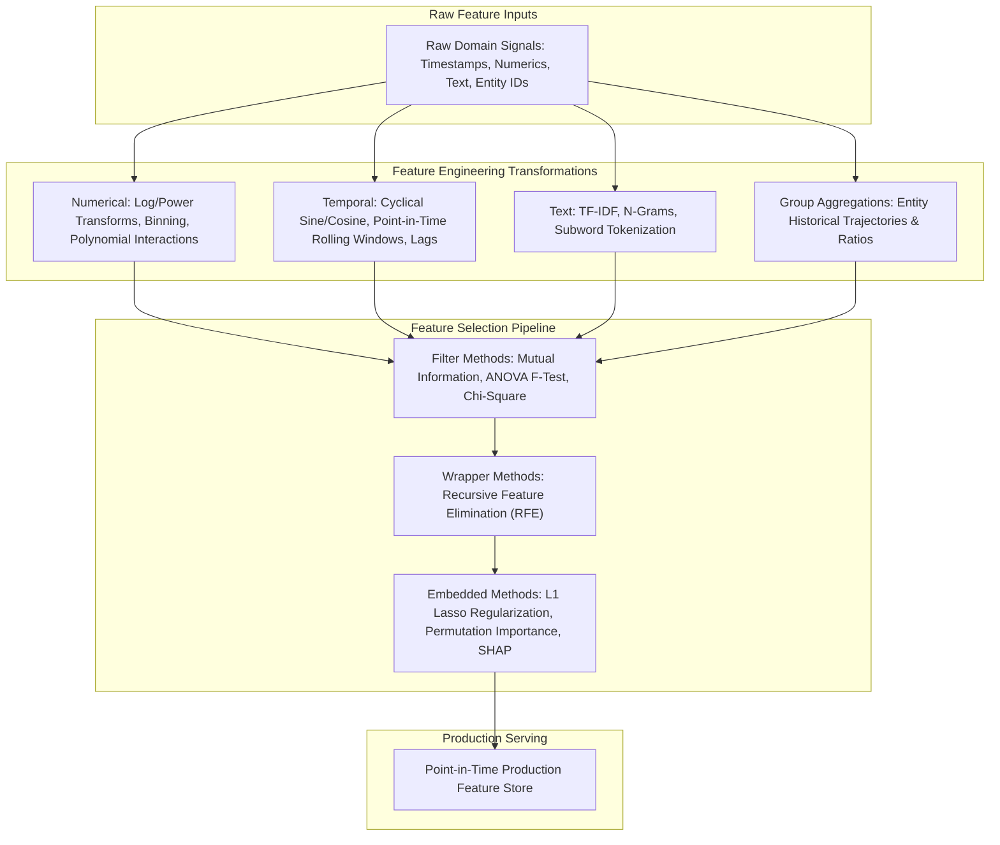
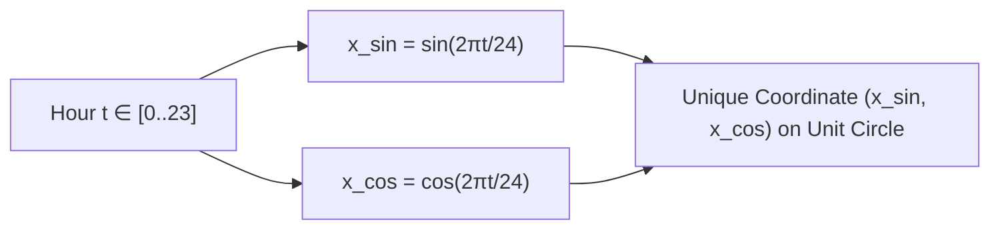
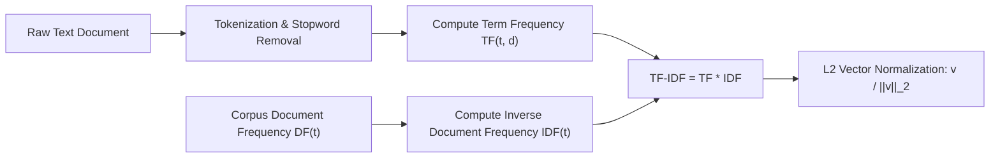
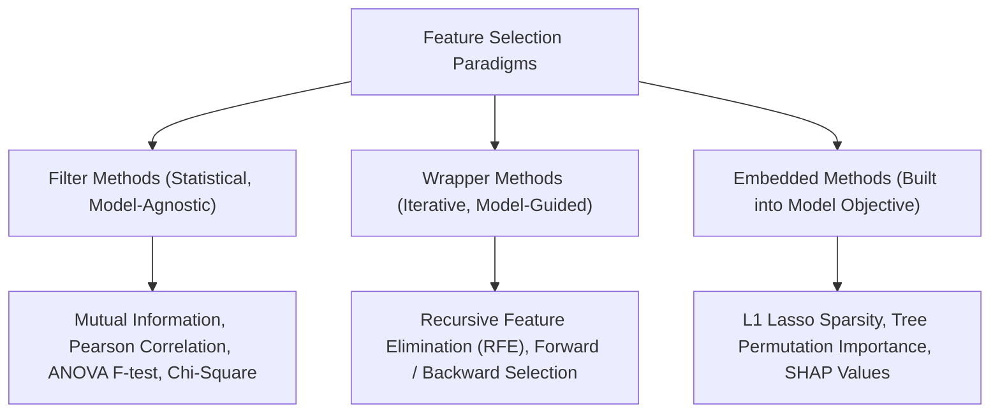
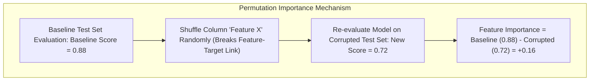

# Feature Engineering & Selection — Transforms, Signals & Redundancy Elimination

!!! info "Prerequisites"
    Information theory (entropy, mutual information), probability distributions, and linear models. See [Mathematical Foundations](../02-mathematics/foundations-math-deep-dive.md), [Probability & Statistics](../02-mathematics/probability-statistics-deep-dive.md), and [Linear Regression](../04-classical-ml/linear-regression-deep-dive.md).

---

## 1. The Big Picture

Machine learning models cannot learn signals that are absent from their input representations. While deep learning architectures can discover latent representations from raw perceptual data (pixels, audio waveforms, text tokens), tabular and structured predictive systems live or die by **Feature Engineering and Feature Selection**:

- **Feature Engineering**: Creating informative mathematical representations $\mathbf{z} = \phi(\mathbf{x})$ that expose the underlying physical, economic, or temporal mechanics of the problem directly to the learning algorithm.
- **Feature Selection**: Pruning uninformative, noisy, or collinear features to maximize signal-to-noise ratio, prevent the curse of dimensionality, eliminate lookahead leakage, and reduce inference latency.



---

## 2. Intuition & Real-World Framing

### Feature Representation Defines Model Inductive Bias

Consider predicting an outcome that varies continuously with the hour of the day ($t \in \{0, 1, \dots, 23\}$).
At 23:59 (11:59 PM), the temperature or traffic condition is nearly identical to 00:01 (12:01 AM).

If represented as a raw integer $t \in [0, 23]$:
- The mathematical distance between 23:00 and 00:00 is $|23 - 0| = 23$ (the maximum possible distance in the feature space!).
- A linear regressor or neural network must learn an abrupt, discontinuous cliff at midnight.
- A decision tree must create artificial, brittle split thresholds at both ends ($t \le 1$ and $t \ge 22$).

By projecting $t$ onto the 2D unit circle via trigonometric transforms:

$$
x_{\sin} = \sin\left(\frac{2\pi t}{24}\right), \qquad x_{\cos} = \cos\left(\frac{2\pi t}{24}\right)
$$

The Euclidean distance between 23:00 and 00:00 becomes:

$$\sqrt{(\sin(23\pi/12) - \sin(0))^2 + (\cos(23\pi/12) - \cos(0))^2} \approx 0.26$$

The geometry of the feature space now mirrors the physical reality: 23:00 and 00:00 are immediate geometric neighbors.

```mermaid
flowchart TD
    subgraph Linear Integer Line (Flawed)
        L1["0 (Midnight)"] --- L2["6 (Dawn)"] --- L3["12 (Noon)"] --- L4["18 (Dusk)"] --- L5["23 (Night)"]
        L5 -. "False Discontinuous Distance = 23" .-> L1
    end
    subgraph Cyclical Unit Circle (Preserves Physical Topology)
        C["2D Unit Circle: (sin(2πt/24), cos(2πt/24))"]
        C --> N1["00:00 (1.0, 0.0)"]
        C --> N2["23:00 (0.96, -0.26)"]
        N1 -. "True Smooth Distance = 0.26" .- N2
    end
```

---

## 3. Numerical Transformations: Power Transforms, Discretization and Interactions

### 3.1 Power Transformations: Box-Cox & Yeo-Johnson

Many parametric models (linear regression, logistic regression, Gaussian Naive Bayes) assume that features are approximately normally distributed with constant variance (homoscedasticity). Skewed, heavy-tailed features degrade gradient convergence and violate statistical assumptions.

#### The Box-Cox Transformation ($y > 0$ strictly):
The Box-Cox transform parameter $\lambda$ is estimated via Maximum Likelihood Estimation:

$$
y^{(\lambda)} = \begin{cases} 
\frac{y^\lambda - 1}{\lambda} & \text{if } \lambda \ne 0 \\
\ln(y) & \text{if } \lambda = 0 
\end{cases}
$$

- $\lambda = 1$: Linear (no transformation).
- $\lambda = 0.5$: Square root transformation ($\sqrt{y}$).
- $\lambda = 0$: Natural log transformation ($\ln y$).
- $\lambda = -1$: Reciprocal transformation ($1/y$).

#### The Yeo-Johnson Transformation (Supports zero and negative values):
To handle zero and negative values ($y \le 0$):

$$
\psi(\lambda, y) = \begin{cases}
\frac{(y + 1)^\lambda - 1}{\lambda} & \text{if } \lambda \ne 0, \; y \ge 0 \\
\ln(y + 1) & \text{if } \lambda = 0, \; y \ge 0 \\
-\frac{(-y + 1)^{2 - \lambda} - 1}{2 - \lambda} & \text{if } \lambda \ne 2, \; y < 0 \\
-\ln(-y + 1) & \text{if } \lambda = 2, \; y < 0
\end{cases}
$$

### 3.2 Binning & Discretization

Discretization converts continuous variables into discrete intervals (bins):
1. **Uniform Binning (Equal Width)**: Divides range $[x_{\min}, x_{\max}]$ into $K$ intervals of equal size $\frac{x_{\max} - x_{\min}}{K}$. Sensitive to outliers (outliers leave middle bins empty).
2. **Quantile Binning (Equal Frequency)**: Divides data using sample percentiles such that every bin contains exactly $N / K$ samples. Robust against outliers and normalizes feature distribution.

### 3.3 Polynomial & Non-Linear Interaction Features

For feature vector $\mathbf{x} = [x_1, x_2]^T$, degree-2 polynomial expansion generates:

$$
\phi(\mathbf{x}) = [1, \; x_1, \; x_2, \; x_1^2, \; x_1 x_2, \; x_2^2]
$$

Interaction terms like $x_1 x_2$ allow linear models to capture multiplicative synergies (e.g., $\text{Price} \times \text{Quantity} = \text{Total Revenue}$).
*The Risk:* For $d$ features, degree-$k$ expansion generates $\binom{d + k}{k}$ features. For $d = 100, k = 2$, features explode to $\approx 5{,}150$, causing high multicollinearity and overfitting.

---

## 4. Temporal Features: Cyclical Encoding, Lags and Point-in-Time Windows

### 4.1 Trigonometric Cyclical Encoding

For any periodic feature $t$ with natural cycle period $T$ (e.g., hour $T=24$, day of week $T=7$, month $T=12$):

$$
x_{\sin} = \sin\left(\frac{2\pi t}{T}\right), \qquad x_{\cos} = \cos\left(\frac{2\pi t}{T}\right)
$$

**Why both sine and cosine are strictly required:**
If you only include $\sin\left(\frac{2\pi t}{T}\right)$, two distinct times will produce identical feature values:
$$\sin\left(\frac{2\pi \cdot 2}{24}\right) = \sin\left(\frac{\pi}{6}\right) = 0.5$$
$$\sin\left(\frac{2\pi \cdot 10}{24}\right) = \sin\left(\frac{5\pi}{6}\right) = 0.5$$
2:00 AM and 10:00 AM would map to identical coordinates! Cosine provides the orthogonal phase information: $\cos(2:00) \approx 0.866$ while $\cos(10:00) \approx -0.866$, uniquely identifying every point on the unit circle.



### 4.2 Point-in-Time Aggregations and Lookahead Leakage Prevention

In temporal machine learning (financial forecasting, fraud detection, churn prediction), **Lookahead Leakage** occurs when feature values incorporate information that occurred after the prediction timestamp $T_{\text{event}}$.

```mermaid
flowchart TD
    subgraph Data Leakage (Flawed Future Leak)
        E1["Event Timestamp: 2024-06-01 14:00"]
        F1["Rolling Average includes data up to 2024-06-01 23:59!"]
        E1 -. Lookahead Bias .-> F1
    end
    subgraph Point-in-Time Correct (Leak-Free)
        E2["Event Timestamp: 2024-06-01 14:00"]
        F2["Rolling Average strictly filtered: timestamp < 2024-06-01 14:00"]
        E2 --> F2
    end
```

#### Point-in-Time Mathematical Formulation:
For an entity $e$ at prediction time $t$, rolling window features over historical interval $W$ must satisfy:

$$
\text{Mean\_Spend}_{e}(t, W) = \frac{1}{|\mathcal{T}_{e}(t, W)|} \sum_{i \in \mathcal{T}_{e}(t, W)} y_i
$$

where the index set is strictly bounded by:

$$
\mathcal{T}_{e}(t, W) = \{i \mid \text{entity}_i = e, \quad t - W \le \tau_i < t\}
$$

Notice the strict inequality $\tau_i < t$: the current event's own transaction cannot participate in historical feature computation.

---

## 5. Text Representations: TF-IDF and Subword Tokenization

Before deep language models, classical ML represented text via statistical term-frequency matrices.

### 5.1 Term Frequency - Inverse Document Frequency (TF-IDF)

TF-IDF quantifies the importance of word $t$ within document $d$ relative to a corpus collection $\mathcal{D}$ of $N$ documents:

$$
\text{TF-IDF}(t, d, \mathcal{D}) = \text{TF}(t, d) \times \text{IDF}(t, \mathcal{D})
$$

1. **Term Frequency $\text{TF}(t, d)$**: Relative frequency of token $t$ in document $d$:
   $$\text{TF}(t, d) = \frac{f_{t, d}}{\sum_{t' \in d} f_{t', d}}$$
2. **Smooth Inverse Document Frequency $\text{IDF}(t, \mathcal{D})$**:
   $$\text{IDF}(t, \mathcal{D}) = \ln\left( \frac{1 + N}{1 + \text{DF}(t)} \right) + 1$$
   where $\text{DF}(t)$ is the number of documents in corpus $\mathcal{D}$ containing term $t$. Words appearing in every document (e.g., "the", "is") yield $\text{IDF} \approx 1$, while rare diagnostic keywords yield large IDF multipliers.
3. **L2 Normalization**: To eliminate document length bias, each document vector $\mathbf{v}_d$ is projected onto the unit sphere:
   $$\mathbf{v}_d \leftarrow \frac{\mathbf{v}_d}{\|\mathbf{v}_d\|_2}$$



---

## 6. Feature Selection: Filter, Wrapper and Embedded Paradigms



### 6.1 Filter Methods: Information Theory & Mutual Information

Filter methods evaluate the statistical relationship between each feature $X$ and the target $Y$ independently of any predictive model.

#### Mutual Information $I(X; Y)$:
Mutual Information measures the reduction in uncertainty (entropy) of target $Y$ given knowledge of feature $X$:

$$
I(X; Y) = H(Y) - H(Y \mid X) = \sum_{x \in \mathcal{X}} \sum_{y \in \mathcal{Y}} p(x, y) \log \left( \frac{p(x, y)}{p(x) p(y)} \right)
$$

- $I(X; Y) = 0$ if and only if $X$ and $Y$ are **strictly statistically independent**.
- Unlike Pearson correlation $\rho$, which detects only linear relationships ($\rho = 0$ for $Y = X^2$ on $[-1, 1]$), Mutual Information detects **arbitrary non-linear, non-monotonic dependencies**.

### 6.2 Wrapper Methods: Recursive Feature Elimination (RFE)

Wrapper methods treat model training as an evaluation sub-routine:
1. Train model on the full set of $d$ features.
2. Rank features by importance (e.g., absolute weight $|w_j|$ in linear models or feature importances in trees).
3. Prune the least important $k$ features.
4. Retrain model on remaining features and repeat until desired feature count is achieved.

*Trade-Off:* Highly accurate because it accounts for feature interactions, but computationally expensive ($\mathcal{O}(d)$ full model training iterations).

### 6.3 Embedded Methods: L1 Regularization (Lasso)

As derived in [Linear Algebra](../02-mathematics/linear-algebra-deep-dive.md#41-vector-l_p-norms) and [Probability & Statistics](../02-mathematics/probability-statistics-deep-dive.md#11-staff-level-technical-interview-questions), optimizing under an $L_1$ penalty:

$$
\min_\mathbf{w} \frac{1}{N} \|X\mathbf{w} - \mathbf{y}\|_2^2 + \lambda \|\mathbf{w}\|_1
$$

forces non-essential feature weights to become **identically zero**. Features with $w_j^* = 0$ are automatically eliminated during model fitting.

### 6.4 Tree Importance: MDI vs. Permutation Importance vs. SHAP

| Method | Mechanism | Computational Cost | Major Pathology / Bias |
|---|---|---|---|
| **Mean Decrease in Impurity (MDI / Gini)** | Sum of impurity reductions across all tree splits on feature $j$ | Zero (computed during training) | **Severely biased toward continuous, high-cardinality features** or random noise! |
| **Permutation Feature Importance** | Measure drop in test metric after randomly shuffling column $j$ | Low ($\mathcal{O}(d)$ inferences) | Correlated features split importance; shuffling out-of-distribution points |
| **SHAP (Shapley Additive Explanations)** | Axiomatic cooperative game theory attribution across all feature subsets | High ($\mathcal{O}(2^d)$ exact, or $\mathcal{O}(T \cdot L \cdot D^2)$ via TreeSHAP) | Gold standard for consistent, additive, theoretically grounded feature attributions |



---

## 7. Python Implementation: Cyclical Encoders, Point-in-Time Windows and Mutual Information

Below is a complete, runnable script featuring:
1. A from-scratch **Cyclical Sine/Cosine Temporal Transformer**.
2. A from-scratch **Discrete Mutual Information Estimator**.
3. A **Point-in-Time Leak-Free Aggregator** for temporal event logs.
4. A comparison between **MDI Gini Importance vs. Permutation Feature Importance** demonstrating cardinality bias.

```python
"""
feature_engineering_selection_deep_dive.py
Production implementations of cyclical transforms, point-in-time windowing,
mutual information calculation, and permutation importance.
"""

from typing import Dict, List, Tuple
import math
import numpy as np
import pandas as pd
from sklearn.base import BaseEstimator, TransformerMixin
from sklearn.ensemble import RandomForestClassifier
from sklearn.inspection import permutation_importance


class CyclicalDateTimeEncoder(BaseEstimator, TransformerMixin):
    """
    Transforms periodic integer timestamps into 2D unit circle coordinates (sin, cos).
    """
    def __init__(self, period: float):
        self.period = float(period)

    def fit(self, X: np.ndarray, y=None):
        return self

    def transform(self, X: np.ndarray) -> np.ndarray:
        x_arr = np.asarray(X, dtype=np.float64)
        radians = 2.0 * np.pi * x_arr / self.period
        sin_feat = np.sin(radians)
        cos_feat = np.cos(radians)
        return np.column_stack([sin_feat, cos_feat])


def calculate_discrete_mutual_information(x: np.ndarray, y: np.ndarray) -> float:
    """
    Calculates exact Shannon Mutual Information I(X; Y) between discrete arrays x and y.
    Formula: I(X; Y) = sum p(x, y) * log( p(x, y) / (p(x) * p(y)) )
    """
    assert len(x) == len(y), "Inputs must have identical length"
    N = len(x)

    # Compute joint frequencies
    joint_counts: Dict[Tuple, int] = {}
    x_counts: Dict = {}
    y_counts: Dict = {}

    for xi, yi in zip(x, y):
        joint_counts[(xi, yi)] = joint_counts.get((xi, yi), 0) + 1
        x_counts[xi] = x_counts.get(xi, 0) + 1
        y_counts[yi] = y_counts.get(yi, 0) + 1

    mi = 0.0
    for (xi, yi), n_xy in joint_counts.items():
        p_xy = n_xy / N
        p_x = x_counts[xi] / N
        p_y = y_counts[yi] / N
        mi += p_xy * math.log(p_xy / (p_x * p_y))

    return float(mi)


def point_in_time_rolling_features(
    events_df: pd.DataFrame, window_seconds: int = 3600
) -> pd.DataFrame:
    """
    Generates point-in-time rolling customer spend features strictly avoiding lookahead bias.
    Guarantees: each transaction uses ONLY events strictly prior to its own timestamp.
    """
    df = events_df.sort_values("timestamp").copy()
    rolling_means = []

    # Fast point-in-time rolling calculation per user
    for user_id, group in df.groupby("user_id"):
        times = group["timestamp"].values
        amounts = group["amount"].values

        for i in range(len(group)):
            current_time = times[i]
            # Strict inequality: time < current_time and time >= current_time - window
            window_mask = (times < current_time) & (times >= current_time - window_seconds)
            window_amounts = amounts[window_mask]

            mean_val = float(np.mean(window_amounts)) if len(window_amounts) > 0 else 0.0
            rolling_means.append((group.index[i], mean_val))

    rolling_df = pd.DataFrame(rolling_means, columns=["index", f"spend_mean_prev_{window_seconds}s"]).set_index("index")
    df = df.join(rolling_df)
    return df


def demonstrate_mdi_cardinality_bias():
    """
    Demonstrates how Random Forest MDI Gini importance severely overestimates
    random high-cardinality noise features compared to Permutation Importance.
    """
    np.random.seed(42)
    N = 1000

    # True informative binary feature
    informative = np.random.binomial(1, 0.5, size=N)
    # Target is driven strictly by the informative feature
    target = informative.copy()

    # Noise feature with high cardinality (unique IDs)
    random_high_cardinality = np.random.randint(0, 1000, size=N)
    # Noise feature with low cardinality
    random_low_cardinality = np.random.randn(N)

    X = np.column_stack([informative, random_high_cardinality, random_low_cardinality])
    feature_names = ["Informative_Feature", "Random_High_Card_Noise", "Random_Continuous_Noise"]

    rf = RandomForestClassifier(n_estimators=100, random_state=42)
    rf.fit(X, target)

    print("=== MDI Gini Importance vs Permutation Feature Importance ===")
    print("MDI Gini Importances (Notice high cardinality noise is ranked HIGHEST!):")
    for name, imp in zip(feature_names, rf.feature_importances_):
        print(f"  {name:25s}: {imp:.4f}")

    # Compute Permutation Feature Importance on a validation holdout
    perm_res = permutation_importance(rf, X, target, n_repeats=10, random_state=42)
    print("\nPermutation Feature Importance (Correctly identifies true signal!):")
    for name, imp in zip(feature_names, perm_res.importances_mean):
        print(f"  {name:25s}: {imp:.4f}")
    print()


# ---------------------------------------------------------
# Verification & Execution
# ---------------------------------------------------------
if __name__ == "__main__":
    # 1. Test Cyclical Encoder
    print("=== Testing Cyclical Encoding ===")
    hours = np.array([0, 6, 12, 18, 23])
    encoder = CyclicalDateTimeEncoder(period=24)
    encoded_hours = encoder.transform(hours)
    for h, (s, c) in zip(hours, encoded_hours):
        print(f"Hour {h:2d} -> Sin: {s:7.4f}, Cos: {c:7.4f}")

    # Euclidean distance between 23:00 and 00:00
    dist_23_0 = np.linalg.norm(encoded_hours[4] - encoded_hours[0])
    print(f"Euclidean distance between 23:00 and 00:00 on unit circle: {dist_23_0:.4f}\n")

    # 2. Test Discrete Mutual Information
    print("=== Testing Mutual Information ===")
    x_independent = np.random.randint(0, 2, size=1000)
    y_independent = np.random.randint(0, 2, size=1000)
    mi_indep = calculate_discrete_mutual_information(x_independent, y_independent)

    x_dependent = np.random.randint(0, 2, size=1000)
    y_dependent = x_dependent  # Perfect deterministic dependence
    mi_dep = calculate_discrete_mutual_information(x_dependent, y_dependent)

    print(f"Mutual Information (Independent Features):  {mi_indep:.6f} (Expected ≈ 0.0)")
    print(f"Mutual Information (Deterministic Identity): {mi_dep:.6f} (Expected = ln(2) ≈ 0.6931)\n")

    # 3. Test Point-in-Time Rolling Aggregator
    print("=== Testing Point-in-Time Rolling Feature Extraction ===")
    events = pd.DataFrame({
        "user_id": [1, 1, 1, 2, 2],
        "timestamp": [1000, 2000, 5000, 1000, 3000],  # Seconds
        "amount": [50.0, 100.0, 20.0, 200.0, 300.0],
    })
    pit_df = point_in_time_rolling_features(events, window_seconds=3600)
    print(pit_df[["user_id", "timestamp", "amount", "spend_mean_prev_3600s"]])
    print("Notice: First transaction for each user has 0.0 prior spend; no future events leaked!\n")

    # 4. Demonstrate MDI Gini Cardinality Bias
    demonstrate_mdi_cardinality_bias()
```

---

## 8. Common Errors and Debugging

| Bug / Phenomenon | Root Cause | Diagnosis Method | Production Fix |
|---|---|---|---|
| **Lookahead Bias in Time Series** | Using `df['spend'].rolling(10).mean()` without shifting (`.shift(1)`), leaking the current and future values into the predictor. | Check feature importance: feature has unrealistic 0.99 AUC or test error spikes on future out-of-time splits. | Always apply strict temporal bounds: $\tau < t_{\text{prediction}}$ or call `.shift(1)` after rolling windows. |
| **Variance Inflation Factor (VIF) Explosion** | Adding polynomial interaction terms ($x_1 x_2, x_1^2$) creates severe multicollinearity, inflating weight variance. | Compute $\text{VIF}_j = \frac{1}{1 - R_j^2}$. If $\text{VIF} > 10$, collinearity is severe. | Apply PCA to orthogonalize features, or use $L_1$ Lasso / Ridge regularization. |
| **Box-Cox Negative Value Crash** | Feeding non-positive values ($x \le 0$) to standard Box-Cox transform raises `ValueError: Data must be positive`. | Inspect `np.min(X) <= 0`. | Use the **Yeo-Johnson transformation** or apply an explicit shift: $x' = x - \min(x) + 1$. |
| **MDI Feature Importance Mirage** | Trusting default Random Forest `.feature_importances_` on datasets with high-cardinality noise columns (e.g., user IDs). | Compare MDI rankings with Permutation Importance on a holdout set. | Use **Permutation Feature Importance** or **TreeSHAP** for unbiased feature attributions. |
| **Target Leakage via Rolling Target Means** | Computing running target rates across an entity without excluding the current target record. | Model achieves near-perfect cross-validation score, but fails completely on live unseen inference. | Enforce out-of-fold historical isolation; only aggregate features, never target labels from the active prediction point. |

---

## 9. Staff-Level Technical Interview Questions

### Q1: Explain cyclical feature encoding using sine and cosine transformations. Why is a single sine or cosine transformation insufficient?
**Model Answer:**
Periodic temporal features (hour of day, day of week, day of year) possess a continuous cyclical topology where the maximum value wraps immediately to the minimum value (e.g., 23:59 to 00:00). Linear representations introduce an artificial cliff of magnitude $T-1$.

To preserve topological continuity, we map periodic scalar $t \in [0, T)$ onto the 2D unit circle:
$$x_{\sin} = \sin\left(\frac{2\pi t}{T}\right), \qquad x_{\cos} = \cos\left(\frac{2\pi t}{T}\right)$$
**Why a single function is insufficient:**
Both $\sin(\theta)$ and $\cos(\theta)$ are non-monotonic on $[0, 2\pi)$. Specifically:
- $\sin(\pi - \theta) = \sin(\theta)$. For hour $T=24$, $\sin\left(\frac{2\pi \cdot 2}{24}\right) = \sin\left(\frac{\pi}{6}\right) = 0.5$, and $\sin\left(\frac{2\pi \cdot 10}{24}\right) = \sin\left(\frac{5\pi}{6}\right) = 0.5$. A model relying solely on sine cannot distinguish 2:00 AM from 10:00 AM!
- $\cos(-\theta) = \cos(\theta)$. A model relying solely on cosine cannot distinguish morning from evening.
Together, the pair $(\sin, \cos)$ forms a unique bijection to the unit circle: $\sin^2\theta + \cos^2\theta = 1$. The Euclidean distance between any two points $t_1, t_2$ is strictly proportional to their shortest circular arc distance along the period.

---

### Q2: Derive the Mutual Information metric between feature $X$ and target $Y$. Why can Mutual Information capture dependencies that Pearson and Spearman correlation miss?
**Model Answer:**
The Mutual Information $I(X; Y)$ is defined in terms of Shannon entropy:
$$I(X; Y) = H(X) - H(X \mid Y) = H(Y) - H(Y \mid X) = H(X) + H(Y) - H(X, Y)$$
Expanding in terms of joint and marginal probability distributions:
$$I(X; Y) = \sum_{x \in \mathcal{X}} \sum_{y \in \mathcal{Y}} p(x, y) \log \left( \frac{p(x, y)}{p(x) p(y)} \right) = D_{\text{KL}}(p(x, y) \parallel p(x)p(y))$$
$I(X; Y)$ is the Kullback-Leibler divergence between the true joint distribution $p(x, y)$ and the factored independent distribution $p(x)p(y)$.

**Comparison with Correlation:**
- **Pearson Correlation ($\rho$):** Measures exclusively linear co-variation: $\rho = \frac{\text{Cov}(X, Y)}{\sigma_X \sigma_Y}$. If $X \sim \mathcal{U}(-1, 1)$ and $Y = X^2$, $Y$ is completely deterministically determined by $X$, yet $\text{Cov}(X, Y) = \mathbb{E}[X^3] - \mathbb{E}[X]\mathbb{E}[X^2] = 0 - 0 = 0$. Pearson correlation is exactly $0$!
- **Spearman Correlation ($r_s$):** Evaluates monotonic rank relationships; also fails on parabolic or circular dependencies.
- **Mutual Information:** Since $p(x, y) \ne p(x)p(y)$ for $Y = X^2$, $I(X; X^2) = H(X^2) > 0$. Mutual Information makes no parametric or functional assumptions, capturing arbitrary non-linear, non-monotonic, and multi-modal statistical dependencies.

---

### Q3: What is lookahead bias in time-series feature engineering, and how do point-in-time feature stores prevent it?
**Model Answer:**
**Lookahead Bias (Temporal Data Leakage):** Occurs when a feature computed for training example at time $t$ incorporates information from events that occurred at timestamp $\tau \ge t$.
Example: Computing a customer's `average_monthly_spend` by executing a SQL `GROUP BY user_id` across the entire database history. When predicting whether a customer will churn on March 1st, the feature contains their spending in April, May, and June! The model achieves near-zero training error, but collapses when deployed live because future data does not exist at inference time.

**Point-in-Time Resolution in Feature Stores (e.g., Feast, Hopsworks):**
Production feature stores enforce **Point-in-Time Joins** (also called "AS OF" joins):
1. The training dataset consists of entity IDs with explicit observation timestamps: $(\text{user\_id}, t_{\text{obs}})$.
2. For each record, the feature store joins historical feature values by querying the feature log strictly as it existed at $t_{\text{obs}}$:
   $$\text{Feature Value} = \max_{\tau < t_{\text{obs}}} f(\text{user\_id}, \tau)$$
3. Ensures that historical training feature vectors exactly match the state of the production key-value store when an inference request arrives at timestamp $t_{\text{obs}}$.

---

### Q4: Contrast Mean Decrease in Impurity (MDI / Gini Importance), Permutation Feature Importance, and SHAP values. Why does MDI bias toward high-cardinality features?
**Model Answer:**
- **Mean Decrease in Impurity (MDI):**
  Accumulates the total Gini impurity (or MSE) reduction brought by all splits on feature $j$ across all trees in an ensemble.
  *The Cardinality Pathology:* Decision tree split algorithms evaluate all possible split points. A random noise feature with high cardinality (e.g., a random integer ID $\in [1, 1000]$) offers thousands of opportunities to accidentally find a split that separates training samples by chance. The tree splits on the noise feature near the leaves, achieving massive training impurity reduction, causing MDI to rank random noise as the most important feature!
- **Permutation Feature Importance:**
  Evaluates the trained model on a validation holdout set, shuffles column $j$ to destroy its relationship with target $y$, and records the metric drop: $\Delta = \text{Score}_{\text{base}} - \text{Score}_{\text{shuffled}}$.
  Because evaluation occurs on unseen validation data, splitting on random noise does not generalize; shuffling noise causes zero drop in validation score. Immune to cardinality bias!
- **SHAP (Shapley Additive Explanations):**
  Derived from cooperative game theory. Measures the marginal contribution of feature $j$ across all possible subsets (coalitions) of remaining features:
  $$\phi_j = \sum_{S \subseteq F \setminus \{j\}} \frac{|S|!(|F| - |S| - 1)!}{|F|!} \Big( f(S \cup \{j\}) - f(S) \Big)$$
  Provides local, sample-level explanations with strict mathematical guarantees of **Efficiency**, **Symmetry**, and **Additivity**.

---

### Q5: Derive the Box-Cox and Yeo-Johnson transformations. When must Yeo-Johnson be chosen over Box-Cox?
**Model Answer:**
- **Box-Cox Transformation:**
  Designed to normalize positive continuous variables:
  $$y^{(\lambda)} = \begin{cases} \frac{y^\lambda - 1}{\lambda} & \text{if } \lambda \ne 0 \\ \ln y & \text{if } \lambda = 0 \end{cases}$$
  As $\lambda \to 0$, by L'Hôpital's rule: $\lim_{\lambda \to 0} \frac{d/d\lambda(y^\lambda - 1)}{d/d\lambda(\lambda)} = \lim_{\lambda \to 0} \frac{y^\lambda \ln y}{1} = \ln y$.
  **Limitation:** Strictly undefined for $y \le 0$ because $\ln y$ and fractional powers of negative numbers are non-real.
- **Yeo-Johnson Transformation:**
  Extends Box-Cox to all real numbers ($y \in \mathbb{R}$) while ensuring strict continuity and monotonicity across zero:
  $$\psi(\lambda, y) = \begin{cases}
  \frac{(y + 1)^\lambda - 1}{\lambda} & \text{if } \lambda \ne 0, \; y \ge 0 \\
  \ln(y + 1) & \text{if } \lambda = 0, \; y \ge 0 \\
  -\frac{(-y + 1)^{2 - \lambda} - 1}{2 - \lambda} & \text{if } \lambda \ne 2, \; y < 0 \\
  -\ln(-y + 1) & \text{if } \lambda = 2, \; y < 0
  \end{cases}$$
  **Decision Rule:** Yeo-Johnson must strictly be selected whenever features contain zero values (e.g., revenue, rainfall) or negative values (e.g., profit/loss, temperature, financial returns).

---

### Q6: Compare Filter, Wrapper, and Embedded feature selection paradigms.
**Model Answer:**
1. **Filter Methods (e.g., Mutual Information, ANOVA, Chi-Square):**
   - *Complexity:* $\mathcal{O}(d \cdot N)$. Fast, univariate screening.
   - *Model Dependency:* Completely model-agnostic; evaluates intrinsic statistical correlation.
   - *Risk:* Ignores complex multi-feature interactions; redundant features that correlate with the target are all selected together.
2. **Wrapper Methods (e.g., Recursive Feature Elimination - RFE):**
   - *Complexity:* $\mathcal{O}(d \cdot \text{Model\_Train\_Time})$. Very slow; trains $d$ model instances.
   - *Model Dependency:* Strongly coupled to chosen model; optimizes performance for that specific model architecture.
   - *Risk:* High risk of overfitting to the validation split if sample size is small; computationally prohibitive for deep networks or massive datasets.
3. **Embedded Methods (e.g., L1 Lasso, Tree-based Permutation / SHAP):**
   - *Complexity:* $\mathcal{O}(\text{Model\_Train\_Time})$. Selection happens concurrently with parameter optimization.
   - *Model Dependency:* Bound to the model's loss formulation.
   - *Advantage:* Directly penalizes complexity in the loss function, natively accounting for interactions while maintaining computational efficiency.

---

### Q7: What is the Variance Inflation Factor (VIF), how do you calculate it, and what threshold indicates severe multicollinearity?
**Model Answer:**
The **Variance Inflation Factor (VIF)** measures how much the variance of an estimated regression coefficient $\hat{\beta}_j$ is inflated due to linear multicollinearity with other features in the design matrix.

**Calculation:**
For each feature $X_j$:
1. Fit an Ordinary Least Squares regression treating $X_j$ as the dependent variable and all other features $X_{-j}$ as predictors:
   $$X_j = \alpha_0 + \sum_{k \ne j} \alpha_k X_k + \epsilon$$
2. Compute the coefficient of determination $R_j^2$ from this regression.
3. Calculate VIF:
   $$\text{VIF}_j = \frac{1}{1 - R_j^2}$$

**Interpretation:**
- If $X_j$ is completely orthogonal to all other features, $R_j^2 = 0 \implies \text{VIF}_j = 1$ (no variance inflation).
- If $X_j$ is strongly collinear ($R_j^2 = 0.90$), $\text{VIF}_j = \frac{1}{1 - 0.90} = 10$. The variance of $\hat{\beta}_j$ is inflated by a factor of 10.
- **Rule of Thumb:** $\text{VIF} > 5$ indicates moderate collinearity; $\text{VIF} > 10$ indicates severe multicollinearity that destabilizes parameter estimates, requiring feature elimination or regularization.

---

## 10. Mastery Ladder

Complete this checklist to verify your depth in feature engineering and selection:

- [ ] **L1:** You can explain how cyclical encoding via $(\sin, \cos)$ preserves continuous topological distance on periodic features.
- [ ] **L2:** You can state why both sine and cosine are required to form a unique bijection to the 2D unit circle.
- [ ] **L3:** You can state the Box-Cox and Yeo-Johnson formulas and explain why Yeo-Johnson is required for zero/negative values.
- [ ] **L4:** You can explain lookahead bias in time-series features and formulate point-in-time window filtering.
- [ ] **L5:** You can calculate TF-IDF with smooth IDF and explain why L2 document normalization is required.
- [ ] **L6:** You can derive Mutual Information $I(X; Y)$ from Shannon entropy and explain why it captures non-linear relationships.
- [ ] **L7:** You can compare Filter, Wrapper, and Embedded feature selection paradigms in terms of time complexity and interaction modeling.
- [ ] **L8:** You can explain why Random Forest MDI Gini importance is severely biased toward high-cardinality features.
- [ ] **L9:** You can implement Permutation Feature Importance from scratch and interpret validation metric drops.
- [ ] **L10:** You can define the Variance Inflation Factor (VIF), explain how it is derived from auxiliary regressions, and diagnose multicollinearity.
