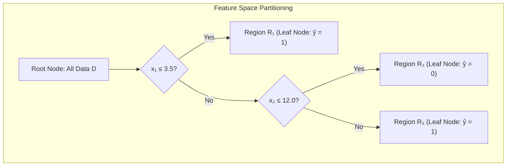

# Decision Trees — CART, Splitting Criteria & Cost-Complexity Pruning

!!! info "Prerequisites"
    Binary trees, Shannon entropy, and variance. Review [Trees (Binary, BST, Heaps)](../00-computer-science/trees-deep-dive.md), [Probability & Statistics](../02-mathematics/probability-statistics-deep-dive.md), and [Foundations of Math](../02-mathematics/foundations-math-deep-dive.md).

---

## 1. The Big Picture

Linear models construct global hyperplanes that span the entire feature space. When real-world data contains complex localized non-linearities, conditional hierarchies, or nested rules (e.g., "if credit score < 600 AND income > \$100k, then approve"), fitting global linear coefficients requires manual interaction feature engineering.

**Decision Trees (CART — Classification and Regression Trees)** solve this by recursively partitioning the feature space into disjoint **axis-aligned hyper-rectangles** (boxes). Predictions within each region are simple local constants: the majority class for classification, or the conditional sample mean for regression.



Trees offer complete human interpretability and automatic feature selection, but unpruned trees suffer from **high variance** and extreme sensitivity to small perturbations in the training data.

---

## 2. Tree Topology & Recursive Binary Splitting

### 2.1 Geometric Space Partitioning

A decision tree represents a recursive partition of the $p$-dimensional domain $\mathcal{X} \subset \mathbb{R}^p$ into $M$ disjoint regions $\{R_1, R_2, \dots, R_M\}$:

$$
\mathcal{X} = \bigcup_{m=1}^M R_m, \qquad R_j \cap R_k = \emptyset \quad \forall j \ne k
$$

The model's hypothesis function is a piecewise-constant function:

$$
f(\mathbf{x}) = \sum_{m=1}^M c_m \cdot \mathbb{I}(\mathbf{x} \in R_m)
$$

- For **Regression**: $c_m = \frac{1}{|R_m|} \sum_{i: \mathbf{x}_i \in R_m} y_i$ (the mean response in region $R_m$).
- For **Classification**: $c_m = \arg\max_{k} \hat{p}_{mk}$, where $\hat{p}_{mk} = \frac{1}{|R_m|} \sum_{i: \mathbf{x}_i \in R_m} \mathbb{I}(y_i = k)$.

Because splits are strictly axis-aligned ($x_j \le \theta$), each region $R_m$ is an open or closed hyper-rectangle bounded by coordinates parallel to the feature axes.

### 2.2 The Greedy Top-Down Search (CART)

Finding the globally optimal tree that minimizes empirical error is an **NP-complete** combinatorial optimization problem. Practical algorithms (CART, ID3, C4.5) employ a **greedy heuristic**: at every internal node, evaluate all features $j \in \{1, \dots, p\}$ and all candidate split thresholds $\theta$, choosing the single pair $(j, \theta)$ that yields the maximum reduction in impurity.


---

## 3. Splitting Criteria for Classification & Regression

Let node $S$ contain $N$ samples across $K$ classes. Let $p_k = \frac{1}{N} \sum_{i \in S} \mathbb{I}(y_i = k)$ denote the empirical probability of class $k$.

### 3.1 Shannon Entropy & Information Gain

Derived from Claude Shannon's information theory, **Entropy** quantifies the average uncertainty or surprise in bits:

$$
H(S) = -\sum_{k=1}^K p_k \log_2 p_k \qquad (\text{with } 0 \log_2 0 \equiv 0)
$$

- If all samples belong to a single class (pure node): $H(S) = -1 \log_2 1 = 0$ bits (minimum uncertainty).
- If samples are uniformly distributed across $K$ classes: $H(S) = \log_2 K$ bits (maximum uncertainty).

The **Information Gain (IG)** of splitting $S$ into $S_L$ ($N_L$ samples) and $S_R$ ($N_R$ samples) via split $A = (j, \theta)$ is:

$$
IG(S, A) = H(S) - \left( \frac{N_L}{N} H(S_L) + \frac{N_R}{N} H(S_R) \right)
$$

### 3.2 Gini Impurity

Used by the CART algorithm, **Gini Impurity** measures the probability that a randomly chosen element from the set would be incorrectly labeled if it were randomly labeled according to the class distribution in the subset:

$$
G(S) = \sum_{k=1}^K p_k (1 - p_k) = \sum_{k=1}^K (p_k - p_k^2) = \sum_{k=1}^K p_k - \sum_{k=1}^K p_k^2 = 1 - \sum_{k=1}^K p_k^2
$$

$$G(S) = 1 - \sum_{k=1}^K p_k^2$$

- Pure node: $p_1 = 1 \implies G(S) = 1 - 1^2 = 0$.
- Two equally balanced classes ($p_1 = 0.5, p_2 = 0.5$): $G(S) = 1 - (0.25 + 0.25) = 0.5$.
- Maximum impurity across $K$ classes: $1 - \frac{1}{K}$.

**Gini vs. Entropy Comparison**:
In binary classification with $p$ as positive class probability:
- $G(p) = 2p(1 - p)$
- $H(p) = -p \log_2 p - (1-p) \log_2(1-p)$

Using Taylor series expansion $\ln(1 - x) \approx -x$:
$$H(S) = \frac{1}{\ln 2} \sum_{k} p_k \ln \frac{1}{p_k} \approx \frac{1}{\ln 2} \sum_k p_k (1 - p_k) = \frac{1}{\ln 2} G(S) \approx 1.4427 \cdot G(S)$$
Gini impurity is a first-order quadratic approximation of entropy. It behaves virtually identically in ranking splits, but executes significantly faster because it avoids expensive $\log_2$ transcendental function evaluations.

### 3.3 Variance Reduction for Regression Trees

For continuous targets $y \in \mathbb{R}$, impurity is defined as the sample variance within node $S$:

$$
\text{Var}(S) = \frac{1}{|S|} \sum_{i \in S} (y_i - \bar{y}_S)^2, \qquad \bar{y}_S = \frac{1}{|S|} \sum_{i \in S} y_i
$$

The split objective selects $(j, \theta)$ maximizing **Variance Reduction**:

$$
\Delta \text{Var}(S, A) = \text{Var}(S) - \left( \frac{N_L}{N} \text{Var}(S_L) + \frac{N_R}{N} \text{Var}(S_R) \right)
$$

Because $|S| \text{Var}(S) = \sum_{i \in S} (y_i - \bar{y})^2 = \text{SSE}(S)$, maximizing variance reduction is mathematically identical to minimizing the sum of squared errors across children:

$$
\arg\max_{(j, \theta)} \Delta \text{Var} \iff \arg\min_{(j, \theta)} \left[ \sum_{i \in S_L} (y_i - \bar{y}_L)^2 + \sum_{i \in S_R} (y_i - \bar{y}_R)^2 \right]
$$

---

## 4. Continuous Feature Splitting & Computational Complexity

### 4.1 Candidate Threshold Evaluation

For a continuous feature $x_j$, there are uncountably many real values $\theta$. However, the classification or regression loss can only change when $\theta$ crosses a distinct training value.

1. Sort the unique values of feature $j$ across the $N$ node samples:
   $$x_{(1), j} < x_{(2), j} < \dots < x_{(m), j}$$
2. The candidate thresholds are the midpoints between adjacent sorted values:
   $$\theta_i = \frac{x_{(i), j} + x_{(i+1), j}}{2}, \quad i \in \{1, \dots, m-1\}$$


### 4.2 Incremental Prefix Sums Optimization

Evaluating a candidate threshold from scratch takes $\mathcal{O}(N)$ operations, which would make scanning all $N-1$ thresholds cost $\mathcal{O}(N^2)$ per feature.

Instead, we sort once in $\mathcal{O}(N \log N)$ time, and then **sweep a pointer from left to right**:
- Maintain running counts of class frequencies: $C_{L, k}$ and $C_{R, k} = \text{Total}_k - C_{L, k}$.
- When the threshold moves past sample $i$, simply update $C_{L, y_i} \leftarrow C_{L, y_i} + 1$ in $\mathcal{O}(1)$ time.
- The overall complexity to find the optimal split across $p$ features at a node of size $N$ is $\mathcal{O}(p \cdot N \log N)$.

---

## 5. Overfitting Control: Pre-Pruning & Cost-Complexity Pruning

An unconstrained decision tree will grow until every leaf contains a single sample ($N_{\text{leaf}} = 1$) or is completely pure ($G = 0$). Such a tree memorizes noise, creating hundreds of tiny axis-aligned boxes around individual training points (high variance, severe overfitting).

### 5.1 Pre-Pruning (Early Stopping Hyperparameters)

Halts tree expansion before full memorization occurs:
- `max_depth`: Limits the maximum distance from root to any leaf.
- `min_samples_split`: The minimum number of samples required to split an internal node.
- `min_samples_leaf`: The minimum number of samples required to form a valid leaf node.
- `max_leaf_nodes`: Limits total leaves using best-first expansion.

*Limitation*: Greedy early stopping can miss valuable splits. A split that yields near-zero impurity drop might unlock a subsequent deep split that separates the classes perfectly (the XOR problem).

### 5.2 Post-Pruning: Minimal Cost-Complexity Pruning (CART)

Breiman et al. (1984) developed **Minimal Cost-Complexity Pruning**, which grows a full unconstrained tree $T_{\max}$ and then prunes it back systematically.

#### The Cost-Complexity Criterion:
For a tree $T$ and complexity tuning parameter $\alpha \ge 0$:

$$
R_\alpha(T) = R(T) + \alpha |T|
$$

where:
- $R(T) = \sum_{t \in \text{leaves}(T)} \frac{N_t}{N} I(t)$ is the total empirical training impurity (misclassification rate, Gini, or MSE).
- $|T|$ is the number of terminal leaf nodes in $T$.
- $\alpha \ge 0$ is the regularization penalty governing the trade-off between tree size and fit to training data:
  - $\alpha = 0 \implies$ full unpruned tree $T_{\max}$.
  - $\alpha \to \infty \implies$ trivial single-node tree consisting only of the root.

#### Weakest-Link Pruning:
For each internal node $t$:
- If node $t$ is collapsed into a single leaf, its empirical risk is $R(t)$.
- If subtree $T_t$ rooted at $t$ is retained, its cost-complexity is $R_\alpha(T_t) = R(T_t) + \alpha |T_t|$.

The subtree $T_t$ yields a strictly better cost-complexity than collapsing node $t$ as long as:

$$
R(T_t) + \alpha |T_t| < R(t) + \alpha \cdot 1 \iff \alpha (|T_t| - 1) > R(t) - R(T_t)
$$

The two values become identical when $\alpha$ reaches the **effective alpha** $\alpha_{\text{eff}}(t)$:

$$
\alpha_{\text{eff}}(t) = \frac{R(t) - R(T_t)}{|T_t| - 1}
$$

$$\alpha_{\text{eff}}(t) = \frac{R(t) - R(T_t)}{|T_t| - 1}$$

- $\alpha_{\text{eff}}(t)$ represents the rate of increase in training error per leaf pruned from subtree $T_t$.
- CART finds the internal node $t^*$ that minimizes $\alpha_{\text{eff}}(t)$, collapses $T_{t^*}$ into a leaf, and records $\alpha_1 = \alpha_{\text{eff}}(t^*)$.
- Repeating this recursively produces a finite nested sequence of pruned subtrees:
  $$T_0 \supset T_1 \supset T_2 \dots \supset T_{\text{root}}$$
- The optimal $\alpha$ is chosen via K-Fold Cross-Validation.

---

## 6. Implementation 1 — Vectorized CART Classifier & Regressor (Pure Python & NumPy)

Below is a complete, modular from-scratch implementation of a CART decision tree supporting both **Gini/Entropy classification** and **Variance Reduction regression**.

```python
import numpy as np


class Node:
    """Internal decision node or terminal leaf."""
    def __init__(self, feature=None, threshold=None, left=None, right=None, *, value=None):
        self.feature = feature
        self.threshold = threshold
        self.left = left
        self.right = right
        self.value = value

    @property
    def is_leaf(self):
        return self.value is not None


class ScratchDecisionTree:
    """
    CART Decision Tree supporting both Classification and Regression.
    """
    def __init__(
        self,
        criterion='gini',
        max_depth=10,
        min_samples_split=2,
        min_samples_leaf=1
    ):
        self.criterion = criterion
        self.max_depth = max_depth
        self.min_samples_split = min_samples_split
        self.min_samples_leaf = min_samples_leaf
        self.root = None
        self.is_classifier = criterion in ('gini', 'entropy')

    def _impurity(self, y: np.ndarray) -> float:
        n = len(y)
        if n == 0:
            return 0.0

        if self.is_classifier:
            _, counts = np.unique(y, return_counts=True)
            probs = counts / n
            if self.criterion == 'gini':
                return 1.0 - np.sum(probs ** 2)
            elif self.criterion == 'entropy':
                return -np.sum(probs * np.log2(probs + 1e-12))
        else:
            # Regression: Mean Squared Error (Sample Variance)
            return float(np.var(y))

    def _leaf_value(self, y: np.ndarray):
        if self.is_classifier:
            # Majority vote
            values, counts = np.unique(y, return_counts=True)
            return values[np.argmax(counts)]
        else:
            # Sample mean for regression
            return float(np.mean(y))

    def _best_split(self, X: np.ndarray, y: np.ndarray):
        n_samples, n_features = X.shape
        if n_samples < self.min_samples_split:
            return None, None

        parent_impurity = self._impurity(y)
        best_gain = -1.0
        best_feature = None
        best_threshold = None

        for feat_idx in range(n_features):
            col = X[:, feat_idx]
            unique_vals = np.unique(col)
            if len(unique_vals) <= 1:
                continue

            # Candidate split thresholds: midpoints
            thresholds = (unique_vals[:-1] + unique_vals[1:]) / 2.0

            for thr in thresholds:
                left_mask = col <= thr
                right_mask = ~left_mask

                n_left = np.sum(left_mask)
                n_right = n_samples - n_left

                if n_left < self.min_samples_leaf or n_right < self.min_samples_leaf:
                    continue

                # Child impurities
                imp_left = self._impurity(y[left_mask])
                imp_right = self._impurity(y[right_mask])

                child_impurity = (n_left / n_samples) * imp_left + (n_right / n_samples) * imp_right
                gain = parent_impurity - child_impurity

                if gain > best_gain:
                    best_gain = gain
                    best_feature = feat_idx
                    best_threshold = thr

        return best_feature, best_threshold

    def _build_tree(self, X: np.ndarray, y: np.ndarray, depth: int = 0) -> Node:
        n_samples = len(y)
        # Stop if max_depth reached or pure
        if depth >= self.max_depth or len(np.unique(y)) <= 1 or n_samples < self.min_samples_split:
            return Node(value=self._leaf_value(y))

        feat, thr = self._best_split(X, y)
        if feat is None:
            return Node(value=self._leaf_value(y))

        left_mask = X[:, feat] <= thr
        right_mask = ~left_mask

        left_child = self._build_tree(X[left_mask], y[left_mask], depth + 1)
        right_child = self._build_tree(X[right_mask], y[right_mask], depth + 1)

        return Node(feature=feat, threshold=thr, left=left_child, right=right_child)

    def fit(self, X: np.ndarray, y: np.ndarray):
        X = np.asarray(X, dtype=np.float64)
        y = np.asarray(y)
        self.root = self._build_tree(X, y, depth=0)
        return self

    def _predict_sample(self, x: np.ndarray, node: Node):
        if node.is_leaf:
            return node.value
        if x[node.feature] <= node.threshold:
            return self._predict_sample(x, node.left)
        return self._predict_sample(x, node.right)

    def predict(self, X: np.ndarray) -> np.ndarray:
        X = np.asarray(X, dtype=np.float64)
        return np.array([self._predict_sample(x, self.root) for x in X])
```

---

## 7. Implementation 2 — scikit-learn Benchmarking & Cost-Complexity Pruning

```python
import numpy as np
from sklearn.tree import DecisionTreeClassifier, DecisionTreeRegressor
from sklearn.datasets import make_classification, make_regression
from sklearn.metrics import accuracy_score, mean_squared_error

# 1. Classification Verification
X_c, y_c = make_classification(
    n_samples=400, n_features=6, n_informative=4, n_classes=2, random_state=42
)

scratch_tree = ScratchDecisionTree(criterion='gini', max_depth=5, min_samples_split=4)
scratch_tree.fit(X_c, y_c)

sk_tree = DecisionTreeClassifier(criterion='gini', max_depth=5, min_samples_split=4, random_state=42)
sk_tree.fit(X_c, y_c)

acc_scratch = accuracy_score(y_c, scratch_tree.predict(X_c))
acc_sk = accuracy_score(y_c, sk_tree.predict(X_c))
print(f"CART Classification — Scratch Acc: {acc_scratch:.4f} | Sklearn Acc: {acc_sk:.4f}")
assert abs(acc_scratch - acc_sk) < 0.03, "Scratch tree deviates significantly from reference!"

# 2. Cost-Complexity Pruning in Scikit-Learn
pruning_path = sk_tree.cost_complexity_pruning_path(X_c, y_c)
ccp_alphas, impurities = pruning_path.ccp_alphas, pruning_path.impurities

print(f"Pruning sequence length: {len(ccp_alphas)} subtrees")
print(f"Optimal Alpha candidates (first 3): {ccp_alphas[:3]}")

# 3. Regression Verification
X_r, y_r = make_regression(n_samples=300, n_features=5, noise=0.1, random_state=42)
scratch_reg = ScratchDecisionTree(criterion='mse', max_depth=4)
scratch_reg.fit(X_r, y_r)

sk_reg = DecisionTreeRegressor(max_depth=4, random_state=42)
sk_reg.fit(X_r, y_r)

mse_scratch = mean_squared_error(y_r, scratch_reg.predict(X_r))
mse_sk = mean_squared_error(y_r, sk_reg.predict(X_r))
print(f"CART Regression — Scratch MSE: {mse_scratch:.2f} | Sklearn MSE: {mse_sk:.2f}")
```

---

## 8. Common Errors & Production Debugging

### 8.1 Extrapolation Failure in Regression Trees

A decision tree regressor predicts the average target value $c_m$ of training samples falling into leaf region $R_m$. Consequently, **a decision tree can never predict a value higher than the maximum training target or lower than the minimum training target**:

$$\min_{i} y_i \le \hat{y}(\mathbf{x}) \le \max_{i} y_i \quad \forall \mathbf{x} \in \mathbb{R}^p$$

If trained on historical financial data where inflation causes asset prices to trend upwards over time, a regression tree will output flat, horizontal predictions for future timestamps, failing catastrophically to capture secular trends.

**Remedy**: Detrend target variables via differencing ($y_t - y_{t-1}$) or use linear models / hybrid tree-linear models.

### 8.2 Instability & High Variance (Orthogonal Axis Sensitivity)

Decision trees construct splits strictly perpendicular to coordinate axes ($x_j \le \theta$). If the true boundary is diagonal ($x_1 + x_2 \le 5$), a decision tree must construct an inefficient staircase of many microscopic splits. A small rotation of the input coordinates radically alters the entire tree topology.


**Remedy**: Apply Principal Component Analysis (PCA) before tree fitting, or use Ensembles (Random Forests, Gradient Boosting) to average out variance.

### 8.3 Bias Toward High-Cardinality Categorical Features

If a categorical feature has many unique categories (e.g., `user_id` or `zip_code` with 10,000 levels), an unregularized tree will split on it immediately. Because a high-cardinality variable provides $2^{C-1} - 1$ possible split subsets, it easily creates pure leaves by chance that fail to generalize.

**Remedy**: Apply Target Encoding with smoothing, group low-frequency levels, or use categorical-native algorithms like CatBoost.

---

## 9. Staff-Level Interview Questions & Model Answers

### Q1: Compare Gini Impurity vs. Shannon Entropy. Why does CART default to Gini, and does the choice of metric materially impact classification accuracy?

**Model Answer:**
For a node with class probabilities $\mathbf{p} = [p_1, \dots, p_K]$:
- **Gini Impurity**: $G = 1 - \sum_{k=1}^K p_k^2$
- **Shannon Entropy**: $H = -\sum_{k=1}^K p_k \log_2 p_k$

**Mathematical Connection:**
Using the first-order Taylor series expansion of the natural logarithm around $x = 1$: $\ln(x) \approx x - 1$.
Substituting $x = p_k$: $\ln(p_k) \approx p_k - 1$.
$$H = -\frac{1}{\ln 2} \sum_{k=1}^K p_k \ln p_k \approx -\frac{1}{\ln 2} \sum_{k=1}^K p_k (p_k - 1) = \frac{1}{\ln 2} \sum_{k=1}^K (p_k - p_k^2) = \frac{1}{\ln 2} G \approx 1.4427 \cdot G$$
Both metrics are strictly concave functions of the probability vector that attain minimum value $0$ when the node is pure ($p_k = 1$ for some $k$) and reach their maximum when classes are uniformly distributed ($p_k = 1/K$).

**Empirical Impact & Engineering Justification:**
Raileanu & Stoffel (2004) proved empirically and theoretically that Gini Impurity and Entropy choose the exact same split feature and threshold in **over 98% of cases**. The choice of metric has virtually no statistically significant impact on generalization accuracy.
CART defaults to Gini Impurity strictly for **computational efficiency**: computing Gini requires only floating-point additions and multiplications ($\sum p_k^2$), completely avoiding expensive transcendental $\log_2$ evaluations. When evaluating millions of candidate splits across deep trees, Gini accelerates tree construction by 2x to 3x.

---

### Q2: Derive the Cost-Complexity Pruning algorithm (Minimal Cost-Complexity Pruning) and explain how the effective alpha $\alpha_{\text{eff}}$ is derived.

**Model Answer:**
Let $T_{\max}$ be the full unpruned tree. The cost-complexity criterion is:
$$R_\alpha(T) = R(T) + \alpha |T|$$
where $R(T) = \sum_{t \in \tilde{T}} R(t)$ is total training error/impurity across leaves $\tilde{T}$, and $|T| = |\tilde{T}|$ is the number of terminal leaves.
Consider any single internal node $t$. If we collapse the entire subtree $T_t$ rooted at $t$ into a single leaf node $\{t\}$:
- The single collapsed leaf has cost-complexity: $R_\alpha(\{t\}) = R(t) + \alpha \cdot 1$.
- The unpruned subtree $T_t$ has cost-complexity: $R_\alpha(T_t) = R(T_t) + \alpha |T_t|$.

Because $T_t$ was grown by minimizing impurity, $R(T_t) < R(t)$, but it uses $|T_t| > 1$ leaves.
For very small $\alpha$, $R_\alpha(T_t) < R_\alpha(\{t\})$, meaning the subtree is preferred.
As $\alpha$ increases, the penalty for complexity grows until a critical threshold is reached where collapsing $T_t$ yields equal or lower cost-complexity:
$$R(t) + \alpha \le R(T_t) + \alpha |T_t| \iff R(t) - R(T_t) \le \alpha (|T_t| - 1)$$
Solving for $\alpha$ gives the **effective alpha** for node $t$:
$$\alpha_{\text{eff}}(t) = \frac{R(t) - R(T_t)}{|T_t| - 1}$$
**Algorithmic Sequence (Weakest-Link Pruning):**
1. Compute $\alpha_{\text{eff}}(t)$ for every internal node in the current tree.
2. The node with the smallest $\alpha_{\text{eff}}$ is the **weakest link**—it provides the smallest impurity reduction per leaf.
3. Collapse this subtree to create $T_1$, recording $\alpha_1 = \min_t \alpha_{\text{eff}}(t)$.
4. Repeat this process until only the root node remains, producing a strictly nested sequence of subtrees:
   $$T_0 \supset T_1 \supset T_2 \dots \supset T_m = \{ \text{root} \}$$
5. Use K-Fold Cross-Validation on the training folds to evaluate the validation score of each subtree in the sequence, selecting $\alpha^*$.

---

### Q3: What is the computational complexity of finding the optimal split across continuous features, and how do modern libraries optimize it?

**Model Answer:**
Consider an internal node with $N$ samples and $p$ features:
1. **Sorting Candidate Thresholds:**
   For a continuous feature $j$, sorting the $N$ sample values requires $\mathcal{O}(N \log N)$ operations.
2. **Impurity Evaluation:**
   Evaluating each of the $N-1$ candidate midpoints naively takes $\mathcal{O}(N)$ time. However, by maintaining running cumulative sums (prefix sums) of target values (or class frequencies), each threshold evaluation requires only $\mathcal{O}(1)$ updates:
   $$\text{SSE}_{\text{left}} = \sum_{i=1}^k y_i^2 - \frac{(\sum_{i=1}^k y_i)^2}{k}, \qquad \text{SSE}_{\text{right}} = \text{SSE}_{\text{total}} - \text{SSE}_{\text{left}}$$
   Thus, scanning all thresholds for one sorted feature takes $\mathcal{O}(N)$ time.
3. **Total Node Cost:**
   Across all $p$ features:
   $$\text{Cost}_{\text{node}} = \mathcal{O}(p \cdot N \log N)$$

**Modern Optimizations (XGBoost, LightGBM):**
For massive datasets ($N = 10^7$), sorting every feature at every tree node is computationally prohibitive.
- **Histogram-based Binning (LightGBM / Scikit-learn HistGradientBoosting):** Discretizes continuous features into $B = 256$ discrete integer bins upfront before tree construction. Finding optimal splits scans 256 bin boundaries in $\mathcal{O}(B)$ time, reducing complexity to $\mathcal{O}(p \cdot N + p \cdot B)$ independent of sorting!
- **Histogram Subtraction:** When node $S$ splits into $S_L$ and $S_R$, we build the histogram for the smaller child (e.g., $S_L$) in $\mathcal{O}(N_L)$ time, and obtain the histogram for $S_R$ by simple subtraction: $\text{Hist}(S_R) = \text{Hist}(S) - \text{Hist}(S_L)$ in $\mathcal{O}(B)$ operations.

---

### Q4: Why are decision trees incapable of extrapolation in regression tasks, and how does this differ from linear regression?

**Model Answer:**
A decision tree partitions the feature space into $M$ axis-aligned bounding hyper-rectangles $\{R_1, \dots, R_M\}$. The prediction for any input $\mathbf{x}$ is the sample average of the training points contained in the leaf region into which $\mathbf{x}$ falls:
$$\hat{y}(\mathbf{x}) = \sum_{m=1}^M \bar{y}_m \mathbb{I}(\mathbf{x} \in R_m)$$
Let the global maximum and minimum training targets be $y_{\max} = \max_i y_i$ and $y_{\min} = \min_i y_i$. Because each leaf value $\bar{y}_m$ is a convex combination of a subset of training points, $\bar{y}_m \in [y_{\min}, y_{\max}]$ for all $m$.
For any unseen query point $\mathbf{x}_{\text{test}}$ lying far outside the support of the training data (e.g., future time points $t > t_{\text{train}}$), the tree's split conditions will inevitably route $\mathbf{x}_{\text{test}}$ to the outermost boundary leaf node. The prediction will simply be the constant historical average of that boundary leaf! The tree's derivative with respect to features outside the training hull is identically zero:
$$\nabla_{\mathbf{x}} \hat{y}(\mathbf{x}) = \mathbf{0} \quad \text{for } \mathbf{x} \text{ outside the training envelope}$$
In contrast, Linear Regression estimates a continuous gradient $\hat{y} = \mathbf{w}^T \mathbf{x} + b$. As $x \to \infty$, $\hat{y} \to \pm\infty$, allowing linear models to project secular linear trends indefinitely.

---

### Q5: How do surrogate splits handle missing feature values during inference in CART?

**Model Answer:**
Breiman's CART handles missing values gracefully without imputation via **Surrogate Splits**:
1. **Primary Split Selection:** When evaluating an internal node, the optimal split $(j^*, \theta^*)$ is found using only the subset of training samples that have non-missing values for feature $j^*$.
2. **Surrogate Split Ranking:** Once the primary split is established (which sends some non-missing points to the left child and others to the right child), the algorithm searches through all other features to find an alternative split $(k, \theta_k)$ that mimics the primary split as closely as possible.
3. The quality of a surrogate split is measured by its **predictive agreement** with the primary split:
   $$\lambda(j^*, k) = \frac{\text{Number of points sent to same child by both } j^* \text{ and } k}{\text{Total non-missing points}}$$
4. A ranked list of primary and secondary surrogate splits is stored inside the node.
5. **Inference Handling:** When evaluating an unseen test sample at runtime:
   - If feature $j^*$ is present, use the primary split.
   - If feature $j^*$ is missing, use the first surrogate split.
   - If the first surrogate is also missing, fall back to the second surrogate, and so on.
   - If all surrogates are missing, default to sending the sample down the branch that received the majority of training instances.

---

## 10. Mastery Ladder

- [ ] **L1:** You can draw a decision tree topology and explain how it partitions feature space into hyper-rectangles.
- [ ] **L2:** You can state the formulas for Shannon Entropy, Information Gain, and Gini Impurity.
- [ ] **L3:** You can prove why Gini Impurity is a first-order Taylor approximation of Shannon Entropy.
- [ ] **L4:** You can explain why Variance Reduction in regression trees is mathematically equivalent to minimizing SSE.
- [ ] **L5:** You can explain how continuous thresholds are generated from midpoints and scanned in $\mathcal{O}(N)$ using prefix sums.
- [ ] **L6:** You can list pre-pruning hyperparameters (`max_depth`, `min_samples_split`, `min_samples_leaf`).
- [ ] **L7:** You can derive the effective alpha formula $\alpha_{\text{eff}}(t) = \frac{R(t) - R(T_t)}{|T_t| - 1}$ for Cost-Complexity Pruning.
- [ ] **L8:** You can explain why decision trees cannot extrapolate in regression tasks.
- [ ] **L9:** You can explain surrogate splits and how CART handles missing data at runtime.
- [ ] **L10:** You can implement a CART classifier and regressor from scratch in NumPy and benchmark against scikit-learn.
