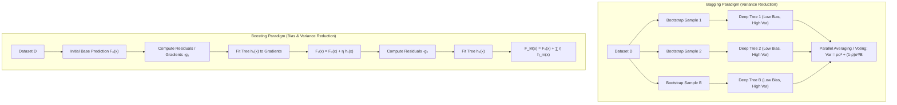
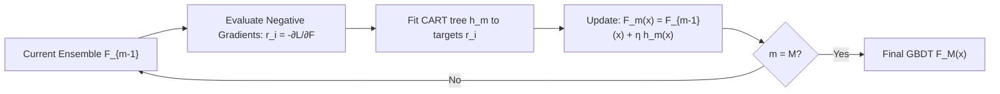
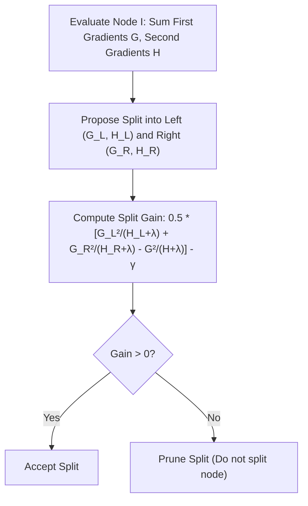
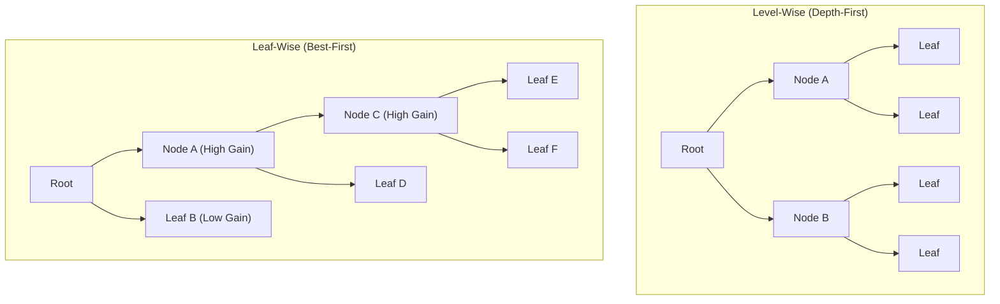
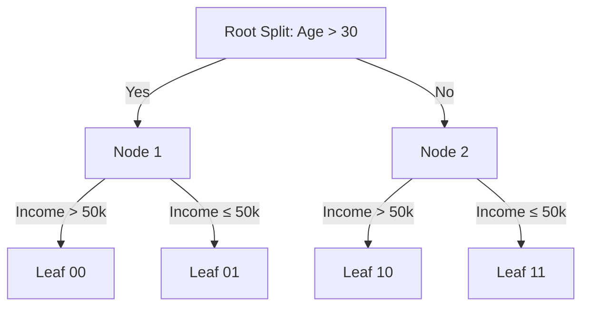

# Ensemble Learning — Random Forests, GBDT, XGBoost, LightGBM & CatBoost

!!! info "Prerequisites"
    Decision trees and Taylor series expansions. Review [Decision Trees](decision-trees-deep-dive.md), [Calculus & Optimization](../02-mathematics/calculus-optimization-deep-dive.md), and [Probability & Statistics](../02-mathematics/probability-statistics-deep-dive.md).

---

## 1. The Big Picture

Individual machine learning models face a fundamental dilemma: simple models suffer from **high bias** (underfitting), while expressive models suffer from **high variance** (overfitting).

**Ensemble Learning** combines multiple base estimators (weak learners) to produce a unified meta-model with strictly superior generalization. Modern tabular ML is dominated by two foundational ensemble paradigms:

1. **Bagging (Bootstrap Aggregating) & Random Forests**: Trains hundreds of high-capacity, deep decision trees independently in parallel on resampled subsets of data and features. Reduces **variance** by averaging decorrelated predictions.
2. **Boosting (GBDT, XGBoost, LightGBM, CatBoost)**: Trains a sequence of shallow, high-bias trees iteratively. Each new tree fits the pseudo-residuals (negative gradients) of the previous ensemble. Reduces **bias** and variance simultaneously via gradient descent in function space.



---

## 2. Bagging & Random Forests: The Mathematics of Variance Reduction

### 2.1 The Variance of an Averaged Ensemble

Let $B$ base estimators $\hat{f}_1(\mathbf{x}), \dots, \hat{f}_B(\mathbf{x})$ each have variance $\text{Var}(\hat{f}_b(\mathbf{x})) = \sigma^2$.
Suppose the pairwise Pearson correlation between any two estimators is $\text{Corr}(\hat{f}_j, \hat{f}_k) = \rho$.
The variance of the ensemble average $\bar{f}(\mathbf{x}) = \frac{1}{B} \sum_{b=1}^B \hat{f}_b(\mathbf{x})$ is:

$$
\begin{aligned}
\text{Var}(\bar{f}) &= \text{Var}\left( \frac{1}{B} \sum_{b=1}^B \hat{f}_b \right) = \frac{1}{B^2} \sum_{j=1}^B \sum_{k=1}^B \text{Cov}(\hat{f}_j, \hat{f}_k) \\
&= \frac{1}{B^2} \left[ \sum_{j=1}^B \text{Var}(\hat{f}_j) + \sum_{j=1}^B \sum_{k \ne j}^B \text{Cov}(\hat{f}_j, \hat{f}_k) \right] \\
&= \frac{1}{B^2} \left[ B \sigma^2 + B(B - 1) \rho \sigma^2 \right] \\
&= \frac{\sigma^2}{B} + \frac{B - 1}{B} \rho \sigma^2 = \rho \sigma^2 + \frac{1 - \rho}{B} \sigma^2
\end{aligned}
$$

$$\text{Var}(\bar{f}(\mathbf{x})) = \rho \sigma^2 + \frac{1 - \rho}{B} \sigma^2$$

#### Crucial Insights from the Formula:
1. As the number of trees $B \to \infty$:
   $$\lim_{B \to \infty} \text{Var}(\bar{f}) = \rho \sigma^2$$
   The second term $\frac{1 - \rho}{B} \sigma^2$ vanishes, but the first term $\rho \sigma^2$ acts as an **irreducible variance floor** dictated entirely by the correlation $\rho$ between trees!

2. If trees are identical ($\rho = 1$), averaging does nothing: $\text{Var} = \sigma^2$.
3. If trees are completely uncorrelated ($\rho = 0$), variance drops linearly: $\text{Var} = \sigma^2 / B$.

### 2.2 Random Forest Decorrelation: Feature Subsampling

Standard Bagging builds trees using bootstrap samples of rows. However, if the dataset contains one dominant, highly predictive feature (e.g., $x_1$), every tree will split on $x_1$ at the root node. The resulting trees look very similar, yielding a high correlation $\rho \approx 0.8$.

Breiman's **Random Forest** introduces a second source of randomization: **Feature Subsampling**.
At every candidate split in every tree, the algorithm considers only a random subset of $m$ features out of all $p$ features:

- For **Classification**: $m = \lfloor\sqrt{p}\rfloor$
- For **Regression**: $m = \lfloor p / 3 \rfloor$

By forcing trees to split on suboptimal alternative features, Random Forests artificially suppress pairwise correlation $\rho \downarrow$, pushing the variance floor $\rho \sigma^2$ significantly lower.

### 2.3 Out-of-Bag (OOB) Error Estimation

In bootstrap sampling with replacement, we draw $n$ samples from a dataset of size $n$.
The probability that a specific training sample $i$ is **not** selected in a single draw is $1 - \frac{1}{n}$.
The probability that sample $i$ is omitted across all $n$ independent draws is:

$$
P(\text{omitted}) = \left( 1 - \frac{1}{n} \right)^n
$$

Using the fundamental limit of calculus $\lim_{n \to \infty} (1 - \frac{1}{n})^n = e^{-1}$:

$$
\lim_{n \to \infty} \left( 1 - \frac{1}{n} \right)^n = \frac{1}{e} \approx 0.367879 \approx 36.8\%
$$

Each bootstrap tree is trained on approximately $63.2\%$ of the samples, leaving the remaining $36.8\%$ as **Out-of-Bag (OOB)** samples.
For each sample $i$, we compute predictions using only the subset of trees that never saw sample $i$ during training. The resulting **OOB Error** serves as a built-in cross-validation estimate with zero data leakage and zero additional training cost!

---

## 3. The Boosting Paradigm & Gradient Boosted Decision Trees (GBDT)

### 3.1 Boosting as Functional Gradient Descent

While Bagging trains learners in parallel, Boosting builds an additive model sequentially:

$$
F_M(\mathbf{x}) = \sum_{m=1}^M \eta \cdot h_m(\mathbf{x})
$$

where $h_m(\mathbf{x})$ are base decision trees and $\eta \in (0, 1]$ is the shrinkage learning rate.
Jerome Friedman (1999) reframed boosting as **Gradient Descent in Function Space**.

Let the training objective be:

$$
\mathcal{L}(F) = \sum_{i=1}^n L(y_i, F(\mathbf{x}_i))
$$

Instead of computing derivatives with respect to parameters $\mathbf{w}$, we differentiate the loss with respect to the model's predictions $F(\mathbf{x}_i)$.
The negative gradient vector $-\mathbf{g} \in \mathbb{R}^n$ represents the direction of steepest descent in $\mathbb{R}^n$:

$$
-g_i = -\left[ \frac{\partial L(y_i, F(\mathbf{x}_i))}{\partial F(\mathbf{x}_i)} \right]_{F(\mathbf{x}) = F_{m-1}(\mathbf{x})}
$$

These negative gradients are called **pseudo-residuals**. Tree $h_m(\mathbf{x})$ is trained using least squares to fit these pseudo-residuals:

$$
h_m = \arg\min_{h} \sum_{i=1}^n \left( (-g_i) - h(\mathbf{x}_i) \right)^2
$$

Once tree $h_m$ is constructed, we update the ensemble:

$$
F_m(\mathbf{x}) = F_{m-1}(\mathbf{x}) + \eta \cdot h_m(\mathbf{x})
$$



---

## 4. XGBoost: Second-Order Optimization & Regularized Trees

Tianqi Chen & Carlos Guestrin (2016) revolutionized gradient boosting with **XGBoost (Extreme Gradient Boosting)** by incorporating a second-order Taylor expansion and explicit tree complexity regularization.

### 4.1 The Regularized Objective Function

At boosting step $t$, the objective is:

$$
\mathcal{L}^{(t)} = \sum_{i=1}^n L(y_i, \hat{y}_i^{(t-1)} + f_t(\mathbf{x}_i)) + \Omega(f_t)
$$

The tree complexity penalty $\Omega(f_t)$ penalizes both the number of leaves $T$ and the $L_2$ norm of leaf weights $\mathbf{w}$:

$$
\Omega(f_t) = \gamma T + \frac{1}{2} \lambda \sum_{j=1}^T w_j^2
$$

### 4.2 Second-Order Taylor Expansion

Taking the second-order Taylor expansion of the loss function around the current prediction $\hat{y}_i^{(t-1)}$:

$$
L(y_i, \hat{y}_i^{(t-1)} + f_t(\mathbf{x}_i)) \approx L(y_i, \hat{y}_i^{(t-1)}) + g_i f_t(\mathbf{x}_i) + \frac{1}{2} h_i f_t^2(\mathbf{x}_i)
$$

where $g_i$ and $h_i$ are the first and second-order gradients:

$$
g_i = \frac{\partial L(y_i, \hat{y}_i^{(t-1)})}{\partial \hat{y}_i^{(t-1)}}, \qquad h_i = \frac{\partial^2 L(y_i, \hat{y}_i^{(t-1)})}{\partial (\hat{y}_i^{(t-1)})^2}
$$

Removing constant terms independent of $f_t$, the simplified surrogate objective is:

$$
\tilde{\mathcal{L}}^{(t)} = \sum_{i=1}^n \left[ g_i f_t(\mathbf{x}_i) + \frac{1}{2} h_i f_t^2(\mathbf{x}_i) \right] + \gamma T + \frac{1}{2} \lambda \sum_{j=1}^T w_j^2
$$

Let $I_j = \{i \mid q(\mathbf{x}_i) = j\}$ denote the set of training instances mapped to leaf $j$. Rewriting the sum across leaves:

$$
\tilde{\mathcal{L}}^{(t)} = \sum_{j=1}^T \left[ \left( \sum_{i \in I_j} g_i \right) w_j + \frac{1}{2} \left( \sum_{i \in I_j} h_i + \lambda \right) w_j^2 \right] + \gamma T
$$

Define $G_j = \sum_{i \in I_j} g_i$ and $H_j = \sum_{i \in I_j} h_i$. Then:

$$
\tilde{\mathcal{L}}^{(t)} = \sum_{j=1}^T \left[ G_j w_j + \frac{1}{2} (H_j + \lambda) w_j^2 \right] + \gamma T
$$

### 4.3 Optimal Leaf Weights & Split Gain Derivation

Differentiating with respect to leaf weight $w_j$ and setting to zero:

$$
\frac{\partial \tilde{\mathcal{L}}^{(t)}}{\partial w_j} = G_j + (H_j + \lambda) w_j = 0 \implies w_j^* = -\frac{G_j}{H_j + \lambda}
$$

$$w_j^* = -\frac{\sum_{i \in I_j} g_i}{\sum_{i \in I_j} h_i + \lambda}$$

Substituting the optimal weights $w_j^*$ back into the objective yields the minimal cost of tree structure $q$:

$$
\tilde{\mathcal{L}}^{(t)}(q) = -\frac{1}{2} \sum_{j=1}^T \frac{G_j^2}{H_j + \lambda} + \gamma T
$$

When evaluating a split of node $I$ into left child $I_L$ and right child $I_R$, the reduction in loss (the **Analytic Split Gain**) is:

$$
\text{Gain} = \frac{1}{2} \left[ \frac{G_L^2}{H_L + \lambda} + \frac{G_R^2}{H_R + \lambda} - \frac{(G_L + G_R)^2}{H_L + H_R + \lambda} \right] - \gamma
$$

If $\text{Gain} \le 0$, the split is not worth the structural penalty $\gamma$, implementing **automatic built-in post-pruning**!



### 4.4 Sparsity-Aware Split Finding

In real datasets, features often contain missing values (`NaN`). XGBoost handles missingness natively:

1. For a split candidate, all samples with non-missing values are partitioned into $I_L$ and $I_R$.
2. All missing samples are tentatively placed entirely in $I_L$, and the Gain is calculated.
3. Then all missing samples are placed entirely in $I_R$, and the Gain is calculated.
4. The direction that yields the highest Gain is retained as the **default branch**. At inference time, any sample with a missing value is automatically routed down this default branch.

---

## 5. LightGBM: Architectural Innovations

Microsoft's **LightGBM** (Ke et al., 2017) was designed to train orders of magnitude faster on massive web-scale datasets using three core algorithmic innovations.

### 5.1 Gradient-Based One-Side Sampling (GOSS)

In gradient boosting, instances with large gradients $|g_i|$ contribute much more to the split gain than instances with small gradients (which are already well-trained).
GOSS balances sample size reduction with statistical unbiasedness:

1. Rank all $n$ training instances by absolute gradient $|g_i|$.
2. Keep the top $a \times 100\%$ instances with the largest gradients (e.g., $a = 0.2$).
3. Randomly sample a fraction $b \times 100\%$ from the remaining $(1 - a)$ small-gradient instances (e.g., $b = 0.1$).
4. To prevent skewing the gradient sum distribution, amplify the small-gradient samples by weight $\frac{1 - a}{b}$:
   $$\tilde{g}_i = g_i \cdot \frac{1 - a}{b} \quad \text{for sampled small-gradient points}$$

GOSS reduces sample size by 70–80% while provably preserving split gain accuracy!

### 5.2 Exclusive Feature Bundling (EFB)

High-dimensional tabular data is often highly sparse (e.g., one-hot encodings). Sparse features are rarely non-zero simultaneously (mutually exclusive).
EFB solves an exact Graph Coloring problem to bundle mutually exclusive features into a single dense feature. By adding an offset to the bin ranges of the bundled features (e.g., Feature A takes bins $[0, 10]$, Feature B takes bins $[11, 25]$), LightGBM collapses thousands of sparse columns into a few dense columns with zero loss of information.

### 5.3 Leaf-Wise (Best-First) Tree Growth

Traditional GBDT (and scikit-learn) grows trees **level-wise** (depth-first), splitting all nodes at the current depth before moving deeper.
LightGBM grows trees **leaf-wise** (best-first): it always splits the single leaf that produces the maximum global gain across the entire tree, regardless of depth. This achieves significantly lower loss for the same total number of leaves.



---

## 6. CatBoost: Categorical Dominance & Oblivious Trees

Developed by Yandex (Prokhorenkova et al., 2018), **CatBoost** eliminates target leakage and accelerates CPU inference via two key technologies.

### 6.1 Ordered Target Encoding (Preventing Target Leakage)

Standard target encoding replaces a categorical level $c$ with the target mean: $\bar{y}_c = \frac{\sum_{i: x_i = c} y_i}{N_c}$.
However, because sample $i$'s own target $y_i$ is included in the mean, this introduces catastrophic **conditional shift / target leakage**, causing trees to overfit immediately.

CatBoost introduces **Ordered Target Encoding**:

1. Generate an online random permutation $\sigma = (\sigma_1, \dots, \sigma_n)$ of the training instances.
2. For sample $i$, calculate the target encoding using strictly the historical instances preceding it in the permutation:
   $$\hat{x}_{\sigma_k} = \frac{\sum_{j=1}^{k-1} \mathbb{I}(x_{\sigma_j} = x_{\sigma_k}) y_{\sigma_j} + a \cdot P}{\sum_{j=1}^{k-1} \mathbb{I}(x_{\sigma_j} = x_{\sigma_k}) + a}$$
   where $P$ is the global target prior and $a > 0$ is a smoothing parameter.
Because sample $\sigma_k$ never sees its own label or labels from the "future," target leakage is mathematically eliminated.

### 6.2 Symmetric Oblivious Trees

Standard trees grow asymmetric split structures. In contrast, CatBoost builds **Oblivious Trees**:
At any given depth $d$, **all nodes across that entire level share the exact same splitting feature and threshold**.



#### The Hardware Acceleration Advantage:
Because every split at depth $d$ tests the identical boolean predicate, tree inference requires no pointer chasing or conditional branches:
$$\text{Index} = b_0 + 2 \cdot b_1 + 4 \cdot b_2 + \dots + 2^{d-1} b_{d-1}$$
The leaf index is evaluated directly using bitwise operations: `index = (feat_1 > thr_1) | ((feat_2 > thr_2) << 1) | ...`.
The leaf prediction is a simple array lookup: `leaf_table[index]`. This executes entirely within CPU L1 cache and SIMD vector registers, delivering 10x to 50x faster inference latency than XGBoost!

---

## 7. Implementation 1 — Vectorized Gradient Boosted Regressor from Scratch (NumPy)

Let us implement a functional Gradient Boosted Regressor from scratch using pure NumPy and simple regression decision trees.

```python
import numpy as np


class SimpleRegressionStump:
    """1-depth decision tree (decision stump) for boosting."""
    def __init__(self):
        self.feat = None
        self.thr = None
        self.left_val = None
        self.right_val = None

    def fit(self, X: np.ndarray, y: np.ndarray):
        n_samples, n_features = X.shape
        best_sse = float('inf')

        for f in range(n_features):
            col = X[:, f]
            thrs = np.percentile(col, np.linspace(5, 95, 10))

            for t in thrs:
                left_mask = col <= t
                right_mask = ~left_mask

                if np.sum(left_mask) == 0 or np.sum(right_mask) == 0:
                    continue

                val_l = np.mean(y[left_mask])
                val_r = np.mean(y[right_mask])

                sse = np.sum((y[left_mask] - val_l) ** 2) + np.sum((y[right_mask] - val_r) ** 2)
                if sse < best_sse:
                    best_sse = sse
                    self.feat = f
                    self.thr = t
                    self.left_val = val_l
                    self.right_val = val_r

        return self

    def predict(self, X: np.ndarray) -> np.ndarray:
        mask = X[:, self.feat] <= self.thr
        return np.where(mask, self.left_val, self.right_val)


class ScratchGBDTRegressor:
    """
    Gradient Boosted Decision Trees trained via functional gradient descent (MSE loss).
    """
    def __init__(self, n_estimators=50, learning_rate=0.1):
        self.n_estimators = n_estimators
        self.learning_rate = learning_rate
        self.base_pred = None
        self.trees = []

    def fit(self, X: np.ndarray, y: np.ndarray):
        X = np.asarray(X, dtype=np.float64)
        y = np.asarray(y, dtype=np.float64).ravel()

        # Step 1: Initialize ensemble with constant prediction minimizing loss
        # For MSE loss L(y, F) = 0.5 * (y - F)^2, optimal base prediction is the sample mean
        self.base_pred = np.mean(y)
        f_pred = np.full_like(y, self.base_pred)

        self.trees = []
        for stage in range(self.n_estimators):
            # Step 2: Compute negative gradient (pseudo-residuals)
            # -∂L/∂F = y - F
            residuals = y - f_pred

            # Step 3: Fit weak learner to residuals
            tree = SimpleRegressionStump()
            tree.fit(X, residuals)

            # Step 4: Update ensemble prediction
            h_pred = tree.predict(X)
            f_pred += self.learning_rate * h_pred

            self.trees.append(tree)

        return self

    def predict(self, X: np.ndarray) -> np.ndarray:
        X = np.asarray(X, dtype=np.float64)
        y_hat = np.full(X.shape[0], self.base_pred)
        for tree in self.trees:
            y_hat += self.learning_rate * tree.predict(X)
        return y_hat
```

---

## 8. Implementation 2 — Framework Benchmarks (Scikit-Learn, XGBoost, LightGBM)

```python
import numpy as np
from sklearn.datasets import make_regression
from sklearn.ensemble import RandomForestRegressor, GradientBoostingRegressor
from sklearn.metrics import mean_squared_error

# Generate benchmark regression dataset
X, y = make_regression(n_samples=500, n_features=10, noise=0.2, random_state=42)
X_train, X_test = X[:400], X[400:]
y_train, y_test = y[:400], y[400:]

# 1. Scratch GBDT
scratch_gbdt = ScratchGBDTRegressor(n_estimators=40, learning_rate=0.1)
scratch_gbdt.fit(X_train, y_train)
scratch_mse = mean_squared_error(y_test, scratch_gbdt.predict(X_test))

# 2. Scikit-Learn GradientBoostingRegressor
sk_gbdt = GradientBoostingRegressor(n_estimators=40, learning_rate=0.1, max_depth=1, random_state=42)
sk_gbdt.fit(X_train, y_train)
sk_mse = mean_squared_error(y_test, sk_gbdt.predict(X_test))

# 3. Scikit-Learn RandomForestRegressor (Bagging + Feature Subsampling)
rf = RandomForestRegressor(n_estimators=50, max_features='sqrt', random_state=42)
rf.fit(X_train, y_train)
rf_mse = mean_squared_error(y_test, rf.predict(X_test))

print(f"=== MSE Performance Benchmarks ===")
print(f"Scratch GBDT (Stumps) MSE:    {scratch_mse:.2f}")
print(f"Scikit-Learn GBDT (Stumps):   {sk_mse:.2f}")
print(f"Random Forest (max_feat=sqrt): {rf_mse:.2f}")
```

---

## 9. Common Errors & Production Debugging

### 9.1 Overfitting Due to High Estimator Count and Large Learning Rate

In Random Forests, increasing $B \to \infty$ **never causes overfitting** (the variance formula $\rho\sigma^2 + \frac{1-\rho}{B}\sigma^2$ strictly decreases and plateaus).
In Gradient Boosting, adding too many trees $M$ or setting learning rate $\eta$ too high **guarantees severe overfitting**, because each tree relentlessly chases microscopic residual noise from earlier trees.

```python
# BROKEN: Fitting 2000 trees with large learning rate without early stopping
from sklearn.ensemble import GradientBoostingClassifier
bad_model = GradientBoostingClassifier(n_estimators=2000, learning_rate=0.3)

# PRODUCTION FIX: Pair high n_estimators with early stopping on validation split
from sklearn.ensemble import HistGradientBoostingClassifier
good_model = HistGradientBoostingClassifier(
    max_iter=1000, learning_rate=0.05, early_stopping=True, validation_fraction=0.15
)
```

### 9.2 Gradient/Hessian Instability with Extreme Imbalance

In XGBoost/LightGBM binary classification with class imbalance (1 positive per 10,000 negatives), predicted probabilities for positive samples initially hover near zero ($\hat{p} \approx 0.0001$).
The second-order derivative $h_i = \hat{p}_i(1 - \hat{p}_i) \approx 0.0001$.
If $H_j = \sum h_i$ is tiny, optimal leaf weights $w_j^* = -\frac{G_j}{H_j + \lambda}$ can explode or divide near zero if $\lambda = 0$.

**Fix**: Always retain positive $L_2$ regularization $\lambda \ge 1.0$ and tune `min_child_weight` (which enforces a minimum threshold on $H_j = \sum h_i$ before splitting).

---

## 10. Staff-Level Interview Questions & Model Answers

### Q1: Prove the variance reduction formula for Bagging: $\text{Var}\left(\frac{1}{B}\sum_{i=1}^B T_i\right) = \rho \sigma^2 + \frac{1-\rho}{B}\sigma^2$. Why is feature subsampling essential?

**Model Answer:**
Let $T_1, \dots, T_B$ be $B$ identically distributed (but correlated) random estimators with mean $\mu$, variance $\text{Var}(T_i) = \sigma^2$, and pairwise correlation $\text{Corr}(T_i, T_j) = \rho$ for $i \ne j$.
By definition of covariance, $\text{Cov}(T_i, T_j) = \rho \sigma \sigma = \rho \sigma^2$.
Expanding the variance of the sample average $\bar{T} = \frac{1}{B}\sum_{i=1}^B T_i$:
$$\begin{aligned}
\text{Var}(\bar{T}) &= \text{Var}\left( \frac{1}{B} \sum_{i=1}^B T_i \right) = \frac{1}{B^2} \sum_{i=1}^B \sum_{j=1}^B \text{Cov}(T_i, T_j) \\
&= \frac{1}{B^2} \left[ \sum_{i=1}^B \text{Var}(T_i) + \sum_{i=1}^B \sum_{j \ne i}^B \text{Cov}(T_i, T_j) \right] \\
&= \frac{1}{B^2} \left[ B \sigma^2 + B(B - 1) \rho \sigma^2 \right] \\
&= \frac{\sigma^2}{B} + \frac{B - 1}{B} \rho \sigma^2 = \frac{\sigma^2}{B} + \left(1 - \frac{1}{B}\right) \rho \sigma^2 = \rho \sigma^2 + \frac{1 - \rho}{B} \sigma^2
\end{aligned}$$
**Why Feature Subsampling is Essential:**
Notice that as $B \to \infty$, the term $\frac{1-\rho}{B}\sigma^2 \to 0$. The asymptotic variance of the ensemble is bounded below by $\rho \sigma^2$.
In standard Bagging with bootstrap sampling alone, all trees see the full feature set. If a strong predictor exists, every single tree splits on that feature at the root node. The tree topologies become highly similar, driving the pairwise correlation $\rho$ toward $0.7 - 0.9$.
Random Forests force each tree split to randomly sample $m = \sqrt{p}$ features. By blinding the split to the dominant feature, trees are forced to explore diverse sub-spaces, aggressively reducing $\rho$. Even if individual tree variance $\sigma^2$ increases slightly, the massive reduction in $\rho$ drives down the overall ensemble variance floor $\rho \sigma^2$.

---

### Q2: Derive the optimal leaf weights $w_j^*$ and split gain formula in XGBoost using the second-order Taylor expansion.

**Model Answer:**
At boosting iteration $t$, the objective function with $L_2$ leaf penalty and tree complexity is:
$$\mathcal{L}^{(t)} = \sum_{i=1}^n L(y_i, \hat{y}_i^{(t-1)} + f_t(\mathbf{x}_i)) + \gamma T + \frac{1}{2}\lambda \sum_{j=1}^T w_j^2$$
Expanding $L$ to second order around $\hat{y}_i^{(t-1)}$:
$$\mathcal{L}^{(t)} \approx \sum_{i=1}^n \left[ L(y_i, \hat{y}_i^{(t-1)}) + g_i f_t(\mathbf{x}_i) + \frac{1}{2} h_i f_t^2(\mathbf{x}_i) \right] + \gamma T + \frac{1}{2}\lambda \sum_{j=1}^T w_j^2$$
where $g_i = \partial_{\hat{y}^{(t-1)}} L$ and $h_i = \partial^2_{\hat{y}^{(t-1)}} L$. Dropping constant $L(y_i, \hat{y}_i^{(t-1)})$ and grouping instances by leaf $I_j = \{i \mid q(\mathbf{x}_i) = j\}$ where $f_t(\mathbf{x}_i) = w_j$:
$$\tilde{\mathcal{L}}^{(t)} = \sum_{j=1}^T \left[ \left(\sum_{i \in I_j} g_i\right) w_j + \frac{1}{2} \left(\sum_{i \in I_j} h_i + \lambda\right) w_j^2 \right] + \gamma T$$
Let $G_j = \sum_{i \in I_j} g_i$ and $H_j = \sum_{i \in I_j} h_i$. Setting the partial derivative with respect to $w_j$ to zero:
$$\frac{\partial \tilde{\mathcal{L}}^{(t)}}{\partial w_j} = G_j + (H_j + \lambda) w_j = 0 \implies w_j^* = -\frac{G_j}{H_j + \lambda} = -\frac{\sum_{i \in I_j} g_i}{\sum_{i \in I_j} h_i + \lambda}$$
Substituting $w_j^*$ back into $\tilde{\mathcal{L}}^{(t)}$:
$$\tilde{\mathcal{L}}^{(t)} = \sum_{j=1}^T \left[ G_j \left(-\frac{G_j}{H_j + \lambda}\right) + \frac{1}{2}(H_j + \lambda)\left(\frac{G_j^2}{(H_j + \lambda)^2}\right) \right] + \gamma T = -\frac{1}{2}\sum_{j=1}^T \frac{G_j^2}{H_j + \lambda} + \gamma T$$
When considering splitting an existing leaf $I$ into $I_L$ and $I_R$, the loss before split is $-\frac{1}{2}\frac{(G_L + G_R)^2}{H_L + H_R + \lambda} + \gamma$. The loss after split is $-\frac{1}{2}\left[\frac{G_L^2}{H_L + \lambda} + \frac{G_R^2}{H_R + \lambda}\right] + 2\gamma$.
The **Split Gain** is the reduction in loss:
$$\text{Gain} = \mathcal{L}_{\text{before}} - \mathcal{L}_{\text{after}} = \frac{1}{2} \left[ \frac{G_L^2}{H_L + \lambda} + \frac{G_R^2}{H_R + \lambda} - \frac{(G_L + G_R)^2}{H_L + H_R + \lambda} \right] - \gamma$$

---

### Q3: Compare the core algorithmic innovations of XGBoost, LightGBM, and CatBoost.

**Model Answer:**

| Dimension | XGBoost | LightGBM | CatBoost |
|---|---|---|---|
| **Tree Growth Policy** | Level-wise (depth-first) | Leaf-wise (best-first) | Symmetric Oblivious Trees |
| **Optimization** | Second-order Taylor ($g_i, h_i$) | Second-order Taylor ($g_i, h_i$) | Second-order + Ordered Boosting |
| **Split Finding** | Exact greedy or Weighted Quantile Sketch | Histogram-based Binning | Quantized numerical features |
| **Sample Subsampling** | Uniform row subsampling | GOSS (Gradient-based One-Side Sampling) | Minimal variance sampling / Bernoulli |
| **Sparse Features** | Sparsity-aware default routing | EFB (Exclusive Feature Bundling) | Native one-hot / combinations |
| **Categorical Data** | Requires pre-encoding (one-hot / target) | Optimal subset bin sorting ($2^k$) | Ordered Target Encoding (no leakage) |
| **Inference Engine** | Pointer chasing across asymmetric nodes | Pointer chasing across asymmetric nodes | Bitwise boolean evaluation + lookup table |

---

### Q4: Explain GOSS (Gradient-based One-Side Sampling) in LightGBM and how it preserves gradient variance.

**Model Answer:**
In GBDT, sample $i$ with a small gradient has already been well-fitted (low residual error), contributing minimal gain to split criteria.
However, simply discarding all small-gradient samples skews the underlying data distribution, inducing severe bias.
**GOSS Algorithm:**

1. Sort all training samples by absolute gradient $|g_i|$.
2. Retain the top $a \times 100\%$ instances with the largest gradients: subset $A$.
3. Draw a random subsample of size $b \times 100\%$ from the remaining small-gradient pool $A^c$: subset $B$.
4. When calculating split gain, calculate the gradient sum over $A \cup B$ by weighting samples in $B$ by factor $\frac{1 - a}{b}$:
   $$\tilde{G}_j = \sum_{i \in A \cap I_j} g_i + \frac{1 - a}{b} \sum_{i \in B \cap I_j} g_i$$
Ke et al. proved that $\mathbb{E}[\tilde{G}_j] = G_j$, meaning the estimated gradient is strictly unbiased. The variance increase introduced by subsampling is bounded by $\mathcal{O}\left(\frac{1 - a}{\sqrt{b \cdot n}}\right)$, which is negligible compared to the 80% reduction in training computation.

---

### Q5: What is target leakage in naive target encoding, and how does CatBoost's Ordered Target Encoding mathematically eliminate it?

**Model Answer:**
**Naive Target Encoding & Leakage:**
For a categorical feature $x_i \in \text{Category } c$, naive target encoding replaces the category with the empirical conditional mean:
$$\hat{x}_i = \frac{\sum_{k=1}^n \mathbb{I}(x_k = c) y_k}{N_c}$$
Notice that $y_i$ is included directly in the numerator!
If a rare category appears only twice with targets $y_1 = 1, y_2 = 1$, then $\hat{x}_1 = 1.0$. The tree creates a split $\hat{x}_i > 0.9$, achieving a perfect training split. At test time, an unseen sample with that category receives an encoding that does not correlate with its true label. This is **target leakage** (or target shift).

**CatBoost Ordered Target Encoding Solution:**
CatBoost enforces a strict causal ordering to simulate historical online inference:

1. Generate an online random permutation $\boldsymbol{\sigma} = (\sigma_1, \dots, \sigma_n)$ of the training dataset.
2. For any sample $\sigma_k$, the encoding is computed **strictly using samples that precede it in the permutation**:
   $$\hat{x}_{\sigma_k} = \frac{\sum_{j=1}^{k-1} \mathbb{I}(x_{\sigma_j} = x_{\sigma_k}) y_{\sigma_j} + a \cdot P}{\sum_{j=1}^{k-1} \mathbb{I}(x_{\sigma_j} = x_{\sigma_k}) + a}$$
   where $P = \frac{1}{n}\sum_{i=1}^n y_i$ is the global prior and $a$ is a prior weight.
Because sample $\sigma_k$'s own label $y_{\sigma_k}$ is strictly excluded from the calculation, the conditional expectation $\mathbb{E}[\hat{x}_{\sigma_k} | y_{\sigma_k}]$ is independent of $y_{\sigma_k}$. Target leakage is completely eliminated. Multiple permutations are averaged across trees to stabilize variance.

---

### Q6: Why do oblivious (symmetric) trees in CatBoost execute orders of magnitude faster at inference time than standard asymmetric CART trees?

**Model Answer:**
In standard asymmetric CART/XGBoost trees:

- Evaluating an input $\mathbf{x}$ requires traversing a branching graph of pointer-linked nodes.
- At each node, the CPU fetches the node struct, evaluates a conditional branch (`if x[feat] <= thr goto left else goto right`), incurring frequent **CPU branch mispredictions** and non-contiguous memory pointer dereferences.

In CatBoost Oblivious Trees:

- At depth $d$, all nodes across that entire horizontal level share the **identical feature and threshold** $(j_d, \theta_d)$.
- For a tree of depth $D$ (typically $D = 6$), we evaluate $D$ binary boolean comparisons independently:
  $$b_0 = \mathbb{I}(x_{j_0} > \theta_0), \quad b_1 = \mathbb{I}(x_{j_1} > \theta_1), \quad \dots, \quad b_{D-1} = \mathbb{I}(x_{j_{D-1}} > \theta_{D-1})$$

- The leaf index is computed via a single bitwise shift-or expression:
  $$\text{Leaf Index} = \sum_{k=0}^{D-1} b_k \cdot 2^k = b_0 \,|\, (b_1 \ll 1) \,|\, (b_2 \ll 2) \,|\, \dots \,|\, (b_{D-1} \ll (D - 1))$$

- The prediction is fetched directly from a flat array: `values[Leaf Index]`.
This is completely **branchless**, vectorizes seamlessly via CPU SIMD (AVX2/AVX-512) instructions, and fits entirely inside the L1 CPU instruction cache.

---

## 11. Mastery Ladder

- [ ] **L1:** You can state the difference between Bagging (variance reduction) and Boosting (bias & variance reduction).
- [ ] **L2:** You can write the Bagging variance formula $\rho\sigma^2 + \frac{1-\rho}{B}\sigma^2$ and explain the correlation floor.
- [ ] **L3:** You can prove why Out-of-Bag (OOB) error leaves approximately $36.8\%$ of samples unsampled via $(1 - 1/n)^n \to e^{-1}$.
- [ ] **L4:** You can formulate GBDT as functional gradient descent on pseudo-residuals $-g_i$.
- [ ] **L5:** You can derive XGBoost optimal leaf weights $w_j^* = -\frac{\sum g_i}{\sum h_i + \lambda}$ via second-order Taylor expansion.
- [ ] **L6:** You can write the XGBoost split gain formula and explain how $\gamma$ acts as built-in pruning.
- [ ] **L7:** You can explain GOSS and EFB in LightGBM and contrast level-wise vs. leaf-wise tree growth.
- [ ] **L8:** You can explain target leakage in categorical target encoding and how CatBoost Ordered Target Encoding prevents it.
- [ ] **L9:** You can explain why symmetric oblivious trees enable branchless SIMD evaluation at inference time.
- [ ] **L10:** You can implement a functional GBDT regressor from scratch in NumPy and benchmark against scikit-learn.
