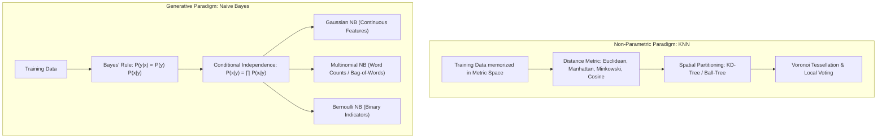
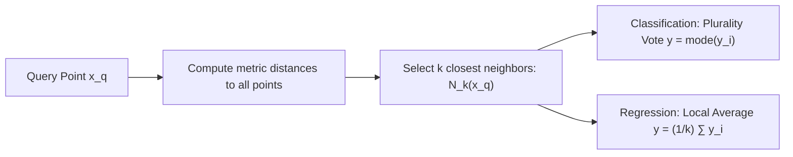
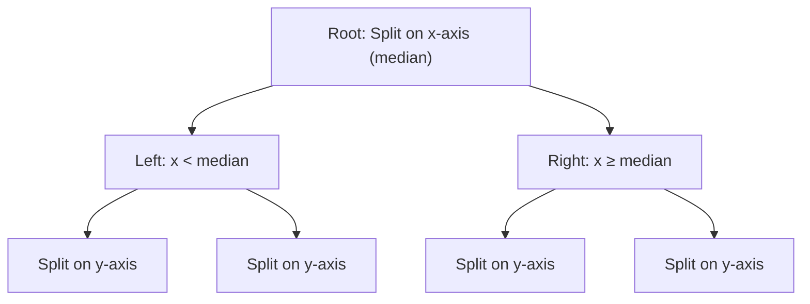
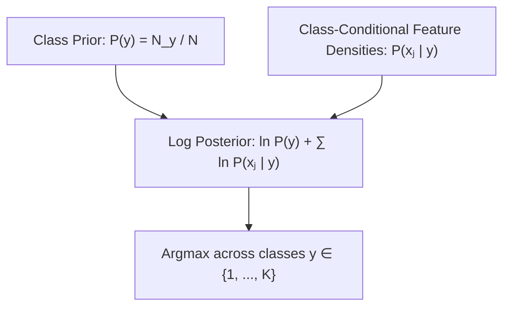

# K-Nearest Neighbors & Naive Bayes — Non-Parametric & Generative Classifiers

!!! info "Prerequisites"
    Bayes' theorem, probability density functions, vector norms, and tree data structures. Review [Probability & Statistics](../02-mathematics/probability-statistics-deep-dive.md), [Foundations of Math](../02-mathematics/foundations-math-deep-dive.md), and [Trees (Binary, BST)](../00-computer-science/trees-deep-dive.md).

---

## 1. The Big Picture

Machine learning classifiers generally fall into two distinct philosophical paradigms:

1. **Instance-Based / Non-Parametric (K-Nearest Neighbors)**: Memorizes the entire training dataset without explicitly estimating functional parameters. It assumes that instances close to each other in metric space share the same label. The model's capacity grows automatically with the size of the dataset.
2. **Generative / Probabilistic (Naive Bayes)**: Learns the underlying data-generating distribution $P(\mathbf{x} | y)$ for each class, alongside the class prior $P(y)$. By applying Bayes' rule with a conditional independence simplification, it computes posterior class probabilities $P(y | \mathbf{x})$.



---

## 2. K-Nearest Neighbors (KNN)

### 2.1 Geometric Intuition & Voronoi Tessellation

In 1-Nearest Neighbor ($k=1$), every query point $\mathbf{x}_{\text{query}}$ is assigned the label of its closest training instance $\mathbf{x}^{(i)}$. This partitions the entire $p$-dimensional feature space into convex polyhedral cells called a **Voronoi Tessellation**.

For a training set $\{\mathbf{x}^{(1)}, \dots, \mathbf{x}^{(n)}\}$, the Voronoi cell $V_i$ corresponding to sample $\mathbf{x}^{(i)}$ is:

$$
V_i = \left\{ \mathbf{x} \in \mathbb{R}^p \;\Big|\; d(\mathbf{x}, \mathbf{x}^{(i)}) \le d(\mathbf{x}, \mathbf{x}^{(j)}) \quad \forall j \ne i \right\}
$$

The decision boundary is composed of hyperplanes that perpendicularly bisect the line segments connecting training points of opposing classes.



### 2.2 Distance Metrics

The geometry of the neighborhood is dictated entirely by the metric $d(\mathbf{u}, \mathbf{v})$:

1. **Euclidean Distance ($L_2$ norm)**:
   $$d_2(\mathbf{u}, \mathbf{v}) = \|\mathbf{u} - \mathbf{v}\|_2 = \sqrt{\sum_{j=1}^p (u_j - v_j)^2}$$
   Measures direct straight-line distance; assumes isotropic variance across coordinates.

2. **Manhattan Distance ($L_1$ norm / Taxicab)**:
   $$d_1(\mathbf{u}, \mathbf{v}) = \|\mathbf{u} - \mathbf{v}\|_1 = \sum_{j=1}^p |u_j - v_j|$$
   Measures axis-aligned grid distance; robust against coordinate-level outliers.

3. **Minkowski Distance ($L_q$ norm)**:
   $$d_q(\mathbf{u}, \mathbf{v}) = \left( \sum_{j=1}^p |u_j - v_j|^q \right)^{1/q}$$
   Generalizes $L_1$ ($q=1$), $L_2$ ($q=2$), and Chebyshev / infinity norm ($q \to \infty$: $\max_j |u_j - v_j|$).

4. **Cosine Distance**:
   $$d_{\cos}(\mathbf{u}, \mathbf{v}) = 1 - \frac{\mathbf{u}^T \mathbf{v}}{\|\mathbf{u}\|_2 \|\mathbf{v}\|_2}$$
   Measures angular divergence while ignoring vector magnitude; ideal for high-dimensional text TF-IDF and embedding vectors.

### 2.3 The Curse of Dimensionality: Analytical Proof

As the dimension $p \to \infty$, the geometry of high-dimensional Euclidean space defies human intuition:

#### A. Hypercube Volume Concentration:
Consider a unit hypercube $[0, 1]^p$ with volume $V_{\text{cube}} = 1$. To capture a fraction $r \in (0, 1)$ of the data points uniformly distributed inside the hypercube using a sub-cube of side length $s$, the side length must satisfy:

$$
s^p = r \implies s = r^{1/p}
$$

For $r = 0.01$ (capturing just 1% of the data):
- In $p = 1$: $s = 0.01^1 = 0.01$ (a tight local neighborhood).
- In $p = 10$: $s = 0.01^{1/10} \approx 0.63$ (requires covering 63% of each feature axis!).
- In $p = 100$: $s = 0.01^{1/100} \approx 0.955$ (requires spanning 95.5% of the entire domain).

**Conclusion**: In high dimensions, there are no "local" neighbors! Any neighborhood large enough to contain even a few points must span almost the entire range of every feature.

#### B. Distance Metric Degeneration:
Beyer et al. (1999) proved that under broad distributional assumptions, the difference in distance between the nearest neighbor and farthest neighbor vanishes relative to the distance to the nearest neighbor:

$$
\lim_{p \to \infty} \frac{d_{\max} - d_{\min}}{d_{\min}} = 0
$$

As dimension grows, all pairs of points become virtually equidistant from the query point. Distance-based classification degrades to random guessing unless dimensionality reduction is performed.

### 2.4 Spatial Search Indexing: KD-Trees & Ball-Trees

Brute-force KNN requires comparing $\mathbf{x}_{\text{query}}$ against all $n$ training points: $\mathcal{O}(n \cdot p)$ per query. Spatial data structures organize training points into hierarchical geometric trees to achieve $\mathcal{O}(p \log n)$ average query time.



- **KD-Tree ($k$-dimensional Tree)**:
  1. Recursively partitions space along coordinate axes rotating cycling through dimensions $j = \text{depth} \pmod p$.
  2. Splits at the median value of feature $j$.
  3. Query Pruning: During search, if the distance from $\mathbf{x}_{\text{query}}$ to the bounding splitting hyperplane is greater than the current $k$-th best distance, the entire opposite branch is pruned.
  *Limitation*: When $p \ge 20$, the curse of dimensionality forces the search algorithm to inspect nearly every leaf, degrading to $\mathcal{O}(n)$.
- **Ball-Tree**:
  Partitions space into nested hyperspheres (balls). Better suited for higher dimensions and arbitrary metric spaces where coordinate-aligned splitting is ineffective.

---

## 3. Naive Bayes Classifiers

### 3.1 Bayes' Rule for Classification

Given an input feature vector $\mathbf{x} = [x_1, x_2, \dots, x_p]^T$, we seek the class $y \in \{1, \dots, K\}$ maximizing the posterior probability $P(y | \mathbf{x})$:

$$
P(y | \mathbf{x}) = \frac{P(y) P(\mathbf{x} | y)}{P(\mathbf{x})} = \frac{P(y) P(\mathbf{x} | y)}{\sum_{c=1}^K P(y = c) P(\mathbf{x} | y = c)}
$$

Because the evidence denominator $P(\mathbf{x})$ is independent of the class label $y$:

$$
\hat{y} = \arg\max_{y} P(y) P(\mathbf{x} | y)
$$

### 3.2 The Conditional Independence Assumption

Modeling the full multivariate class-conditional joint probability $P(x_1, x_2, \dots, x_p | y)$ requires estimating an intractable number of parameters ($\mathcal{O}(K \cdot S^p)$ for discrete features of cardinality $S$).

The **Naive Bayes assumption** asserts that given the class label $y$, all features $x_1, \dots, x_p$ are conditionally independent:

$$
P(\mathbf{x} | y) = P(x_1, x_2, \dots, x_p | y) = \prod_{j=1}^p P(x_j | y)
$$

The classification decision rule in log-space (to prevent numerical underflow) is:

$$
\hat{y} = \arg\max_{y} \left[ \ln P(y) + \sum_{j=1}^p \ln P(x_j | y) \right]
$$



### 3.3 Three Classic Naive Bayes Formulations

Depending on the nature of the feature variables, different distributions are assumed for $P(x_j | y)$:

#### A. Gaussian Naive Bayes (Continuous Features):
Assumes each feature within class $y$ follows a univariate normal distribution:

$$
P(x_j | y) = \frac{1}{\sqrt{2\pi \sigma_{yj}^2}} \exp\left( -\frac{(x_j - \mu_{yj})^2}{2\sigma_{yj}^2} \right)
$$

Parameters are estimated via sample mean $\hat{\mu}_{yj}$ and sample variance $\hat{\sigma}_{yj}^2$ per class.

#### B. Multinomial Naive Bayes (Word Counts / Frequencies):
Models integer count vectors $\mathbf{x} = [x_1, \dots, x_p]^T$ (e.g., word occurrences in document classification):

$$
P(\mathbf{x} | y) = \frac{(\sum_j x_j)!}{\prod_j x_j!} \prod_{j=1}^p \theta_{yj}^{x_j}
$$

where $\theta_{yj} = P(\text{feature } j | y)$ is the probability that a token in class $y$ is feature $j$.

#### C. Bernoulli Naive Bayes (Binary Indicators):
Models binary presence/absence indicators $x_j \in \{0, 1\}$:

$$
P(\mathbf{x} | y) = \prod_{j=1}^p \theta_{yj}^{x_j} (1 - \theta_{yj})^{1 - x_j}
$$

Notice that unlike Multinomial NB, Bernoulli NB **explicitly penalizes the absence of words** ($1 - \theta_{yj}$).

### 3.4 The Zero-Frequency Problem & Laplace / Lidstone Smoothing

If a word or feature value $x_j$ never appears in class $y$ during training, the Maximum Likelihood Estimate is $\hat{\theta}_{yj} = 0$.
Because probabilities are multiplied:

$$
P(\mathbf{x} | y) = \hat{\theta}_{yj} \times \prod_{k \ne j} P(x_k | y) = 0 \times \dots = 0
$$

A single unseen word completely zeroes out the entire class probability regardless of all other evidence!

To prevent this, **Laplace smoothing** ($\alpha = 1$) or **Lidstone smoothing** ($0 < \alpha < 1$) adds pseudo-counts:

$$
\hat{\theta}_{yj} = \frac{N_{yj} + \alpha}{N_y + \alpha \cdot d}
$$

where $N_{yj} = \sum_{i \in \text{class } y} X_{ij}$ is the total count of feature $j$ in class $y$, $N_y = \sum_{j=1}^d N_{yj}$ is the total count of all features in class $y$, and $d$ is the vocabulary size.
This corresponds to Bayesian MAP estimation under a symmetric **Dirichlet prior** $\text{Dir}(\alpha, \dots, \alpha)$.

---

## 4. Implementation 1 — Vectorized KD-Tree KNN from Scratch (NumPy)

Let us implement a complete KD-Tree spatial index and K-Nearest Neighbors classifier from scratch in pure Python and NumPy.

```python
import numpy as np


class KDNode:
    """A single node in a k-dimensional tree."""
    def __init__(self, point, label, axis, left=None, right=None):
        self.point = point
        self.label = label
        self.axis = axis
        self.left = left
        self.right = right


class ScratchKDTree:
    """Recursive spatial partitioning tree for fast KNN queries."""
    def __init__(self, X: np.ndarray, y: np.ndarray):
        self.p = X.shape[1]
        self.root = self._build_tree(X, y, depth=0)

    def _build_tree(self, X: np.ndarray, y: np.ndarray, depth: int):
        n = len(X)
        if n == 0:
            return None

        axis = depth % self.p

        # Sort by the current axis and pick median
        sorted_indices = np.argsort(X[:, axis])
        median_idx = n // 2

        median_point = X[sorted_indices[median_idx]]
        median_label = y[sorted_indices[median_idx]]

        left_idx = sorted_indices[:median_idx]
        right_idx = sorted_indices[median_idx + 1:]

        return KDNode(
            point=median_point,
            label=median_label,
            axis=axis,
            left=self._build_tree(X[left_idx], y[left_idx], depth + 1),
            right=self._build_tree(X[right_idx], y[right_idx], depth + 1)
        )

    def query(self, target: np.ndarray, k: int):
        best_neighbors = []  # List of tuples: (-distance, label)

        def _search(node):
            if node is None:
                return

            dist = np.linalg.norm(node.point - target)

            # Maintain heap/sorted list of k best
            best_neighbors.append((dist, node.label))
            best_neighbors.sort(key=lambda item: item[0])
            if len(best_neighbors) > k:
                best_neighbors.pop()

            axis = node.axis
            diff = target[axis] - node.point[axis]

            # Recurse down primary branch first
            near_branch = node.left if diff < 0 else node.right
            far_branch = node.right if diff < 0 else node.left

            _search(near_branch)

            # Pruning check: Can the hypersphere centered at target reach across the boundary?
            worst_dist = best_neighbors[-1][0] if len(best_neighbors) == k else float('inf')
            if abs(diff) < worst_dist:
                _search(far_branch)

        _search(self.root)
        return best_neighbors


class ScratchKNNClassifier:
    """K-Nearest Neighbors Classifier backed by a KD-Tree spatial index."""
    def __init__(self, k: int = 5):
        self.k = k
        self.tree = None

    def fit(self, X: np.ndarray, y: np.ndarray):
        X = np.asarray(X, dtype=np.float64)
        y = np.asarray(y)
        self.tree = ScratchKDTree(X, y)
        return self

    def predict(self, X: np.ndarray) -> np.ndarray:
        predictions = []
        for x in X:
            neighbors = self.tree.query(x, self.k)
            labels = [label for _, label in neighbors]
            # Plurality vote
            values, counts = np.unique(labels, return_counts=True)
            predictions.append(values[np.argmax(counts)])
        return np.array(predictions)
```

---

## 5. Implementation 2 — Gaussian & Multinomial Naive Bayes from Scratch (NumPy)

```python
import numpy as np


class ScratchGaussianNB:
    """Gaussian Naive Bayes for continuous features."""
    def __init__(self, var_smoothing=1e-9):
        self.var_smoothing = var_smoothing
        self.classes_ = None
        self.priors_ = None
        self.means_ = None
        self.vars_ = None

    def fit(self, X: np.ndarray, y: np.ndarray):
        n_samples, n_features = X.shape
        self.classes_ = np.unique(y)
        n_classes = len(self.classes_)

        self.priors_ = np.zeros(n_classes)
        self.means_ = np.zeros((n_classes, n_features))
        self.vars_ = np.zeros((n_classes, n_features))

        for idx, c in enumerate(self.classes_):
            X_c = X[y == c]
            self.priors_[idx] = len(X_c) / n_samples
            self.means_[idx] = np.mean(X_c, axis=0)
            # Add var_smoothing to prevent division by zero in zero-variance features
            self.vars_[idx] = np.var(X_c, axis=0) + self.var_smoothing

        return self

    def predict_proba(self, X: np.ndarray) -> np.ndarray:
        n_samples = X.shape[0]
        n_classes = len(self.classes_)
        log_posteriors = np.zeros((n_samples, n_classes))

        for idx in range(n_classes):
            prior_log = np.log(self.priors_[idx])
            mean = self.means_[idx]
            var = self.vars_[idx]

            # Vectorized Gaussian log-density:
            # -0.5 * ln(2*pi*var) - ((x - mean)^2) / (2 * var)
            log_likelihood = -0.5 * np.sum(np.log(2.0 * np.pi * var)) - 0.5 * np.sum(((X - mean) ** 2) / var, axis=1)
            log_posteriors[:, idx] = prior_log + log_likelihood

        # Log-Sum-Exp trick for stable posterior probabilities
        max_log = np.max(log_posteriors, axis=1, keepdims=True)
        exp_post = np.exp(log_posteriors - max_log)
        return exp_post / np.sum(exp_post, axis=1, keepdims=True)

    def predict(self, X: np.ndarray) -> np.ndarray:
        probs = self.predict_proba(X)
        return self.classes_[np.argmax(probs, axis=1)]


class ScratchMultinomialNB:
    """Multinomial Naive Bayes with Laplace smoothing."""
    def __init__(self, alpha=1.0):
        self.alpha = float(alpha)
        self.classes_ = None
        self.class_log_prior_ = None
        self.feature_log_prob_ = None

    def fit(self, X: np.ndarray, y: np.ndarray):
        n_samples, n_features = X.shape
        self.classes_ = np.unique(y)
        n_classes = len(self.classes_)

        self.class_log_prior_ = np.zeros(n_classes)
        self.feature_log_prob_ = np.zeros((n_classes, n_features))

        for idx, c in enumerate(self.classes_):
            X_c = X[y == c]
            self.class_log_prior_[idx] = np.log(len(X_c) / n_samples)

            # Laplace / Lidstone smoothed word probabilities:
            # (count(w, c) + alpha) / (total_tokens_in_c + alpha * d)
            token_counts = np.sum(X_c, axis=0)
            total_tokens = np.sum(token_counts)
            smoothed_prob = (token_counts + self.alpha) / (total_tokens + self.alpha * n_features)
            self.feature_log_prob_[idx] = np.log(smoothed_prob)

        return self

    def predict(self, X: np.ndarray) -> np.ndarray:
        # log P(c|x) ∝ log P(c) + X @ (log P(w|c))^T
        log_posteriors = self.class_log_prior_ + X @ self.feature_log_prob_.T
        return self.classes_[np.argmax(log_posteriors, axis=1)]
```

---

## 6. Implementation 3 — scikit-learn Benchmarking & Verification

```python
import numpy as np
from sklearn.neighbors import KNeighborsClassifier
from sklearn.naive_bayes import GaussianNB, MultinomialNB
from sklearn.datasets import make_classification
from sklearn.metrics import accuracy_score

# 1. Benchmark KNN with KD-Tree
X_knn, y_knn = make_classification(
    n_samples=300, n_features=6, n_informative=4, n_classes=2, random_state=42
)

scratch_knn = ScratchKNNClassifier(k=5)
scratch_knn.fit(X_knn, y_knn)
sk_knn = KNeighborsClassifier(n_neighbors=5, algorithm='kd_tree')
sk_knn.fit(X_knn, y_knn)

acc_s_knn = accuracy_score(y_knn, scratch_knn.predict(X_knn))
acc_sk_knn = accuracy_score(y_knn, sk_knn.predict(X_knn))
print(f"KNN Comparison — Scratch KD-Tree Acc: {acc_s_knn:.4f} | Sklearn Acc: {acc_sk_knn:.4f}")
assert abs(acc_s_knn - acc_sk_knn) < 1e-4, "KD-Tree KNN predictions differ from scikit-learn!"

# 2. Benchmark Gaussian Naive Bayes
X_gnb, y_gnb = make_classification(
    n_samples=400, n_features=5, n_informative=4, n_classes=3, random_state=42
)

scratch_gnb = ScratchGaussianNB()
scratch_gnb.fit(X_gnb, y_gnb)
sk_gnb = GaussianNB()
sk_gnb.fit(X_gnb, y_gnb)

acc_s_gnb = accuracy_score(y_gnb, scratch_gnb.predict(X_gnb))
acc_sk_gnb = accuracy_score(y_gnb, sk_gnb.predict(X_gnb))
print(f"Gaussian NB Comparison — Scratch Acc: {acc_s_gnb:.4f} | Sklearn Acc: {acc_sk_gnb:.4f}")
assert abs(acc_s_gnb - acc_sk_gnb) < 1e-4, "Gaussian NB predictions differ from scikit-learn!"

# 3. Benchmark Multinomial Naive Bayes (Non-negative count matrix)
np.random.seed(42)
X_mnb = np.random.randint(0, 5, size=(300, 20))
y_mnb = np.random.choice([0, 1], size=300)

scratch_mnb = ScratchMultinomialNB(alpha=1.0)
scratch_mnb.fit(X_mnb, y_mnb)
sk_mnb = MultinomialNB(alpha=1.0)
sk_mnb.fit(X_mnb, y_mnb)

acc_s_mnb = accuracy_score(y_mnb, scratch_mnb.predict(X_mnb))
acc_sk_mnb = accuracy_score(y_mnb, sk_mnb.predict(X_mnb))
print(f"Multinomial NB Comparison — Scratch Acc: {acc_s_mnb:.4f} | Sklearn Acc: {acc_sk_mnb:.4f}")
assert abs(acc_s_mnb - acc_sk_mnb) < 1e-4, "Multinomial NB predictions differ from scikit-learn!"
```

---

## 7. Common Errors & Production Debugging

### 7.1 Unscaled Features in Distance Metrics

KNN computes Euclidean distance across all dimensions equally. If feature $x_1$ (salary) ranges from $\$30,000$ to $\$200,000$ and $x_2$ (age) ranges from $18$ to $80$, the squared difference in salary $(x_{1a} - x_{1b})^2 \approx 10^9$ completely drowns out age $(x_{2a} - x_{2b})^2 \approx 10^3$. The model effectively ignores age!

**Production Rule**: Always standardize features (`StandardScaler` or `MinMaxScaler`) before passing them to KNN.

### 7.2 Underflow in Naive Bayes Likelihood Products

Evaluating $P(\mathbf{x} | y) = \prod_{j=1}^{10,000} P(x_j | y)$ by multiplying probabilities directly will cause immediate IEEE 754 underflow to `0.0`, resulting in `NaN` predictions.

**Production Rule**: Never multiply probabilities in Naive Bayes. Always sum log-likelihoods in log-space: $\ln P(y) + \sum_{j} \ln P(x_j | y)$. When computing normalized posterior probabilities, apply the **Log-Sum-Exp** trick:
$$\ln \sum_k e^{z_k} = m + \ln \sum_k e^{z_k - m}, \quad \text{where } m = \max_k z_k$$

### 7.3 Zero-Frequency Tokens Without Smoothing

Fitting `MultinomialNB` with `alpha=0.0` means any token in production that was not observed in a training class receives probability $0$. If an email contains a single novel typo, its spam likelihood becomes $0 \times \dots = 0$. Always retain Laplace smoothing $\alpha \ge 1.0$.

---

## 8. Staff-Level Interview Questions & Model Answers

### Q1: Prove how the Curse of Dimensionality impacts distance metrics in KNN as dimension $p \to \infty$.

**Model Answer:**
Beyer et al. (1999) formalized the phenomenon that in high-dimensional spaces, nearest-neighbor query algorithms lose their discriminative power.
Let $\mathbf{x} \in \mathbb{R}^p$ be a query point and $\mathbf{x}^{(1)}, \dots, \mathbf{x}^{(n)}$ be $n$ independent and identically distributed data points. Let $d_{\min} = \min_{i} \|\mathbf{x} - \mathbf{x}^{(i)}\|_2$ and $d_{\max} = \max_{i} \|\mathbf{x} - \mathbf{x}^{(i)}\|_2$.
Assume that the distance distribution satisfies:
$$\lim_{p \to \infty} \text{Var}\left( \frac{\|\mathbf{x} - \mathbf{x}^{(i)}\|_2}{\mathbb{E}[\|\mathbf{x} - \mathbf{x}^{(i)}\|_2]} \right) = 0$$
Then:
$$\lim_{p \to \infty} \frac{d_{\max} - d_{\min}}{d_{\min}} = 0$$
**Proof Intuition:**
Let $D_i = \|\mathbf{x} - \mathbf{x}^{(i)}\|_2^2 = \sum_{j=1}^p (x_j - x_j^{(i)})^2$. Under independent coordinates with mean coordinate distance $\mu$ and variance $\sigma^2$, by the Central Limit Theorem:
$$\frac{D_i - p\mu}{\sqrt{p}\sigma} \xrightarrow{d} \mathcal{N}(0, 1)$$
Notice that the mean of the squared distance grows linearly with dimension $p$ ($\mathbb{E}[D_i] = p\mu$), while the standard deviation grows only with the square root of dimension ($\sqrt{p}\sigma$).
The relative standard deviation (coefficient of variation) is:
$$\frac{\sqrt{\text{Var}(D_i)}}{\mathbb{E}[D_i]} = \frac{\sqrt{p}\sigma}{p\mu} = \frac{\sigma}{\mu \sqrt{p}} \xrightarrow{p \to \infty} 0$$
Because the relative spread around the mean collapses to zero, the distances from the query point to all $n$ data points cluster tightly around the mean distance $\sqrt{p\mu}$. The ratio of distance to the nearest neighbor versus the farthest neighbor converges to $1$. Consequently, proximity loses metric meaning, and nearest-neighbor classification degrades to a random draw.

---

### Q2: Why does Naive Bayes frequently perform exceptionally well in practice despite its conditional independence assumption being blatantly false?

**Model Answer:**
Domingos & Pazzani (1997) proved that **zero classification error does not require zero probability estimation error**.
In binary classification, the decision rule is:
$$\hat{y} = 1 \iff \frac{P(y=1|\mathbf{x})}{P(y=0|\mathbf{x})} \ge 1 \iff \ln \frac{P(y=1)}{P(y=0)} + \sum_{j=1}^p \ln \frac{P(x_j|y=1)}{P(x_j|y=0)} \ge 0$$
Violations of the conditional independence assumption distort the estimated posterior probabilities—pushing them severely toward extreme values of $0.0$ or $1.0$ (overconfidence).
However, classification accuracy depends strictly on whether the sign of the log-odds ratio agrees with the true Bayes optimal decision boundary. Even if the estimated probability is wildly inaccurate (e.g., estimating $0.9999$ when the true probability is $0.60$), **as long as the rank order of the classes is preserved, the classification decision is 100% correct**.
The decision boundary formed by Naive Bayes is a linear hyperplane (or quadratic surface for Gaussian NB with unequal variances). The classifier succeeds because its simple inductive bias prevents overfitting on small datasets, yielding remarkably low variance that often compensates for the bias introduced by independence violations.

---

### Q3: Derive the decision boundary of Gaussian Naive Bayes. Under what conditions is it strictly linear vs. quadratic?

**Model Answer:**
In binary classification ($y \in \{0, 1\}$), the log-odds ratio is:
$$\ln \frac{P(y=1|\mathbf{x})}{P(y=0|\mathbf{x})} = \ln \frac{P(y=1)}{P(y=0)} + \sum_{j=1}^p \ln \frac{\frac{1}{\sqrt{2\pi \sigma_{1j}^2}} \exp\left(-\frac{(x_j - \mu_{1j})^2}{2\sigma_{1j}^2}\right)}{\frac{1}{\sqrt{2\pi \sigma_{0j}^2}} \exp\left(-\frac{(x_j - \mu_{0j})^2}{2\sigma_{0j}^2}\right)}$$
Expanding the sum:
$$\ln \frac{P(y=1|\mathbf{x})}{P(y=0|\mathbf{x})} = \ln \frac{P(y=1)}{P(y=0)} + \sum_{j=1}^p \ln \frac{\sigma_{0j}}{\sigma_{1j}} + \sum_{j=1}^p \left[ \frac{(x_j - \mu_{0j})^2}{2\sigma_{0j}^2} - \frac{(x_j - \mu_{1j})^2}{2\sigma_{1j}^2} \right]$$
Expanding the quadratic terms inside the bracket:
$$\frac{x_j^2 - 2x_j\mu_{0j} + \mu_{0j}^2}{2\sigma_{0j}^2} - \frac{x_j^2 - 2x_j\mu_{1j} + \mu_{1j}^2}{2\sigma_{1j}^2} = x_j^2 \left( \frac{1}{2\sigma_{0j}^2} - \frac{1}{2\sigma_{1j}^2} \right) + x_j \left( \frac{\mu_{1j}}{\sigma_{1j}^2} - \frac{\mu_{0j}}{\sigma_{0j}^2} \right) + \text{const}$$

**Two Distinct Cases:**
1. **Equal Feature Variances ($\sigma_{0j}^2 = \sigma_{1j}^2 = \sigma_j^2$ for all $j$):**
   The quadratic coefficient $\left( \frac{1}{2\sigma_{0j}^2} - \frac{1}{2\sigma_{1j}^2} \right) = 0$. The squared terms $x_j^2$ cancel out completely! The log-odds becomes a strictly affine function:
   $$\ln \frac{P(y=1|\mathbf{x})}{P(y=0|\mathbf{x})} = \mathbf{w}^T \mathbf{x} + b$$
   where $w_j = \frac{\mu_{1j} - \mu_{0j}}{\sigma_j^2}$. The decision boundary is a **strictly linear hyperplane**, mathematically equivalent to Linear Discriminant Analysis (LDA) with a diagonal covariance matrix.
2. **Unequal Feature Variances ($\sigma_{0j}^2 \ne \sigma_{1j}^2$):**
   The quadratic terms do not cancel out. The decision boundary is a **quadratic hypersurface** (ellipsoid, paraboloid, or hyperboloid), equivalent to Quadratic Discriminant Analysis (QDA) with diagonal covariance matrices.

---

### Q4: Derive Laplace and Lidstone smoothing from a Bayesian perspective using Dirichlet conjugate priors.

**Model Answer:**
Consider a categorical variable $X$ with $d$ discrete outcomes and class-conditional probabilities $\boldsymbol{\theta} = [\theta_1, \dots, \theta_d]^T$ where $\sum \theta_j = 1$.
The likelihood of observing counts $\mathbf{c} = [c_1, \dots, c_d]^T$ is Multinomial:
$$p(\mathbf{c} | \boldsymbol{\theta}) \propto \prod_{j=1}^d \theta_j^{c_j}$$
The conjugate prior for the multinomial distribution is the **Dirichlet distribution** parameterised by hyperparameters $\boldsymbol{\alpha} = [\alpha_1, \dots, \alpha_d]^T$:
$$p(\boldsymbol{\theta} | \boldsymbol{\alpha}) = \frac{1}{\text{B}(\boldsymbol{\alpha})} \prod_{j=1}^d \theta_j^{\alpha_j - 1}$$
By Bayes' theorem, the posterior distribution is:
$$p(\boldsymbol{\theta} | \mathbf{c}) \propto p(\mathbf{c} | \boldsymbol{\theta}) p(\boldsymbol{\theta}) \propto \prod_{j=1}^d \theta_j^{c_j} \cdot \prod_{j=1}^d \theta_j^{\alpha_j - 1} = \prod_{j=1}^d \theta_j^{c_j + \alpha_j - 1}$$
This is another Dirichlet distribution: $\text{Dir}(\mathbf{c} + \boldsymbol{\alpha})$.
The Bayes estimator under squared error loss is the posterior mean:
$$\hat{\theta}_j = \mathbb{E}[\theta_j | \mathbf{c}] = \frac{c_j + \alpha_j}{\sum_{k=1}^d (c_k + \alpha_k)}$$
Under a symmetric prior where $\alpha_j = \alpha$ for all $j$:
$$\hat{\theta}_j = \frac{c_j + \alpha}{\sum_{k=1}^d c_k + \alpha \cdot d} = \frac{N_{yj} + \alpha}{N_y + \alpha \cdot d}$$
- Setting $\alpha = 1$ yields **Laplace smoothing**, equivalent to a uniform prior where every outcome was observed once before training.
- Setting $0 < \alpha < 1$ yields **Lidstone smoothing**, representing weaker prior pseudo-evidence.

---

### Q5: Compare Multinomial Naive Bayes and Bernoulli Naive Bayes for text classification. When does each fail?

**Model Answer:**
- **Multinomial Naive Bayes (MNB):**
  Takes word count vectors $\mathbf{x} = [x_1, \dots, x_d]^T$ where $x_j \in \{0, 1, 2, \dots\}$. The likelihood is $P(\mathbf{x}|y) \propto \prod_j \theta_{yj}^{x_j}$.
  *Characteristics:* Models document length and word repetition. A word appearing 10 times contributes 10 times to the log-likelihood ($\sum x_j \ln \theta_{yj}$).
  *Failure Mode:* Severely influenced by document length variations. Long documents accumulate much larger negative log-likelihoods than short ones unless normalized.
- **Bernoulli Naive Bayes (BNB):**
  Takes binary occurrence indicators $\mathbf{x} = [b_1, \dots, b_d]^T$ where $b_j \in \{0, 1\}$. The likelihood is $P(\mathbf{x}|y) = \prod_j \theta_{yj}^{b_j} (1 - \theta_{yj})^{1 - b_j}$.
  *Characteristics:* Evaluates both presence AND absence of words. If a document does not contain word $j$, BNB penalizes the class by $\ln(1 - \theta_{yj})$.
  *Failure Mode:* Highly sensitive to vocabulary size and short queries. If vocabulary $d = 50,000$ and a test tweet contains 10 words, BNB evaluates 49,990 "absence" terms ($1 - \theta_{yj}$), which can easily overwhelm the signal from the words that actually appeared.

---

### Q6: How does the choice of $k$ in KNN govern the bias-variance tradeoff? What happens at $k=1$ and $k=n$?

**Model Answer:**
The parameter $k$ controls model flexibility and hypothesis capacity:
- **At $k = 1$ (Maximum Variance, Minimum Bias):**
  The model memorizes every training sample. Every training point lies in its own Voronoi cell with training error identically $0$. The decision boundary is highly irregular, jagged, and sensitive to individual noisy labels or outliers. The model has maximum degrees of freedom ($\text{effective df} = n$) and high variance.
- **At $k = n$ (Minimum Variance, Maximum Bias):**
  The model pools all $n$ training instances for every query. It predicts the majority class of the entire training dataset regardless of the input feature $\mathbf{x}$. The decision boundary vanishes entirely. The model has minimum capacity ($\text{effective df} = 1$), zero variance, and extreme bias (underfitting).
- **Optimal $k$ Selection:**
  Typically chosen via Stratified K-Fold Cross-Validation. A common heuristic starting point is $k = \lfloor\sqrt{n}\rfloor$ (often odd to avoid ties in binary voting). As $n \to \infty$, Cover & Hart (1967) proved that if $k(n) \to \infty$ and $k(n)/n \to 0$, the $k$-NN error rate asymptotically approaches the optimal Bayes risk $\mathcal{R}^*$.

---

## 9. Mastery Ladder

- [ ] **L1:** You can state the difference between parametric (Naive Bayes) and non-parametric (KNN) classifiers.
- [ ] **L2:** You can write formulas for Euclidean, Manhattan, Minkowski, and Cosine distance metrics.
- [ ] **L3:** You can explain Voronoi tessellation and how $k=1$ yields zero training error.
- [ ] **L4:** You can prove the Curse of Dimensionality via hypercube volume shrinkage $s = r^{1/p}$.
- [ ] **L5:** You can explain the KD-tree recursive partitioning algorithm and its pruning condition.
- [ ] **L6:** You can write Bayes' rule and state the conditional independence assumption.
- [ ] **L7:** You can derive Laplace/Lidstone smoothing as Bayesian MAP with a Dirichlet conjugate prior.
- [ ] **L8:** You can prove that Gaussian Naive Bayes produces a linear boundary when class feature variances are equal.
- [ ] **L9:** You can explain why Naive Bayes classifies accurately even when probabilities are badly miscalibrated.
- [ ] **L10:** You can implement a KD-Tree KNN classifier and Gaussian/Multinomial Naive Bayes from scratch in NumPy.
