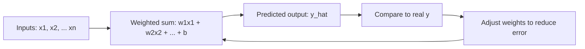
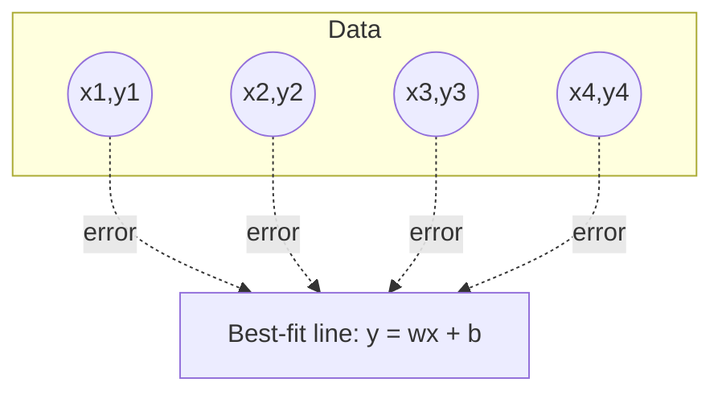
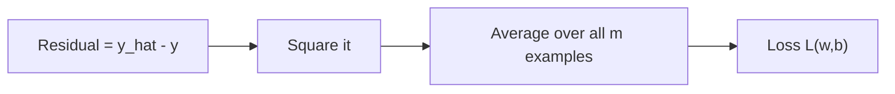
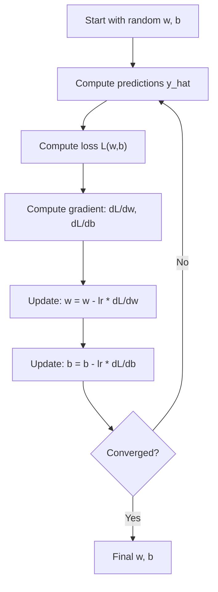
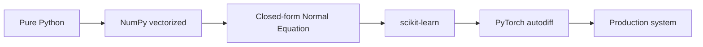
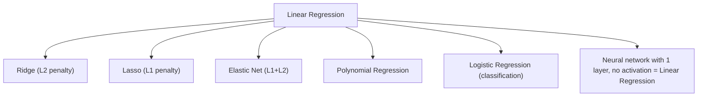

# Linear Regression — Full Deep Dive

!!! info "Prerequisites"
    [Vectors & matrices](../02-mathematics/index.md), [derivatives & gradients](../02-mathematics/index.md), [NumPy basics](../03-data-engineering/index.md).

## 1. The Problem

You have inputs (square footage, number of rooms, age of house) and a number you want to predict (price). You suspect the relationship is roughly a straight line (or plane, in higher dimensions). Linear regression is the simplest possible model that says: **assume the output is a weighted sum of the inputs, plus a constant offset.**



## 2. Intuition

Picture a scatter plot of house size vs. price. Linear regression asks: **what single straight line, if I had to pick one, makes the vertical distances from every point to the line as small as possible on average?**

That's it. Everything else in this chapter — the math, the code, the internals — is machinery for answering that one question precisely and efficiently.

## 3. Formal Definition

For a single input feature (simple linear regression):

$$
\hat{y} = w x + b
$$

For multiple features (multiple linear regression), stacked as vectors:

$$
\hat{y} = \mathbf{w}^T \mathbf{x} + b = w_1 x_1 + w_2 x_2 + \dots + w_n x_n + b
$$

- $\mathbf{x}$ — the feature vector for one example
- $\mathbf{w}$ — the learned weight vector (one weight per feature)
- $b$ — the bias/intercept term
- $\hat{y}$ — the model's prediction (as opposed to $y$, the true value)

## 4. Visual Explanation



Each dotted line is a **residual** — the vertical gap between what the model predicts and what actually happened. Linear regression's entire job is to choose $w$ and $b$ so that, on average, these gaps are as small as possible.

## 5. The Loss Function — Mean Squared Error

We need a single number that says "how wrong is this line, overall." We use the **Mean Squared Error (MSE)**:

$$
L(w, b) = \frac{1}{m} \sum_{i=1}^{m} \left( \hat{y}^{(i)} - y^{(i)} \right)^2
$$

Why squared, not absolute difference?

- Squaring makes all errors positive (no cancellation between over- and under-predictions).
- Squaring **punishes large errors disproportionately more** than small ones — a residual of 10 contributes 100, a residual of 2 contributes only 4. This pushes the model to avoid being wildly wrong on any single point.
- Squared error is differentiable everywhere, which absolute error is not (there's a kink at zero) — this matters enormously once we get to gradient descent in §7.



## 6. The Closed-Form Solution — Ordinary Least Squares

For linear regression specifically (unlike almost every other ML model in this book), you don't *have* to search for the minimum iteratively — you can solve for it directly with calculus and linear algebra.

Stack every example's features as rows of a matrix $X$ (with a column of 1s prepended for the bias), and every target as a vector $\mathbf{y}$. The optimal weight vector $\mathbf{w}^*$ (including bias) is:

$$
\mathbf{w}^* = (X^T X)^{-1} X^T \mathbf{y}
$$

**Where does this come from?** Take the loss in matrix form, $L(\mathbf{w}) = \frac{1}{m}(X\mathbf{w} - \mathbf{y})^T(X\mathbf{w} - \mathbf{y})$, differentiate with respect to $\mathbf{w}$, and set the gradient to zero (the minimum of a convex bowl-shaped function is where its slope is exactly flat):

$$
\nabla_w L = \frac{2}{m} X^T (X\mathbf{w} - \mathbf{y}) = 0 \quad \Rightarrow \quad X^T X \mathbf{w} = X^T \mathbf{y} \quad \Rightarrow \quad \mathbf{w} = (X^T X)^{-1} X^T \mathbf{y}
$$

This is called the **Normal Equation**. It requires inverting the $n \times n$ matrix $X^T X$, which costs roughly $O(n^3)$ — fine for tens or hundreds of features, painfully slow or numerically unstable for tens of thousands, which is exactly why gradient descent (next section) exists as an alternative.

## 7. Gradient Descent — The Iterative Alternative

Instead of solving for the minimum in one shot, gradient descent **walks downhill** on the loss surface, step by step.



The gradients, derived by differentiating the MSE loss with respect to each parameter:

$$
\frac{\partial L}{\partial w} = \frac{2}{m}\sum_{i=1}^m \left(\hat{y}^{(i)} - y^{(i)}\right) x^{(i)}
\qquad
\frac{\partial L}{\partial b} = \frac{2}{m}\sum_{i=1}^m \left(\hat{y}^{(i)} - y^{(i)}\right)
$$

Intuitively: if your predictions are systematically too high for large-$x$ points, the gradient with respect to $w$ will be positive, and subtracting it shrinks $w$ — pulling the line down where it's needed, proportional to how wrong and how large the input was.

**Why not always use the closed form, then?** Because gradient descent scales to millions of features and rows, generalizes to models that have no closed-form solution (every neural network in Book 6), and lets you add regularization, mini-batches, and streaming data naturally.

## 8. Implementation 1 — Pure Python (no libraries)

```python
def train_linear_regression(xs, ys, lr=0.01, epochs=1000):
    w, b = 0.0, 0.0
    m = len(xs)
    for _ in range(epochs):
        y_pred = [w * x + b for x in xs]
        error = [yp - y for yp, y in zip(y_pred, ys)]
        dw = (2 / m) * sum(e * x for e, x in zip(error, xs))
        db = (2 / m) * sum(error)
        w -= lr * dw
        b -= lr * db
    return w, b

xs = [1, 2, 3, 4, 5]
ys = [3, 5, 7, 9, 11]   # y = 2x + 1
w, b = train_linear_regression(xs, ys, lr=0.01, epochs=2000)
print(w, b)  # approaches (2.0, 1.0)
```

This is deliberately slow and explicit — every operation is a Python-level loop — so you can see exactly what "gradient descent" is doing with nothing hidden.

## 9. Implementation 2 — NumPy (vectorized)

```python
import numpy as np

def train_linear_regression_np(X, y, lr=0.01, epochs=1000):
    m, n = X.shape
    w = np.zeros(n)
    b = 0.0
    for _ in range(epochs):
        y_pred = X @ w + b
        error = y_pred - y
        dw = (2 / m) * (X.T @ error)
        db = (2 / m) * np.sum(error)
        w -= lr * dw
        b -= lr * db
    return w, b

X = np.array([[1], [2], [3], [4], [5]], dtype=float)
y = np.array([3, 5, 7, 9, 11], dtype=float)
w, b = train_linear_regression_np(X, y)
```

The entire inner loop over examples in §8 is replaced by `X @ w` — a single matrix-vector multiply. NumPy delegates this to compiled C/BLAS code, so instead of Python interpreting a `for` loop element-by-element (with all the bytecode dispatch overhead from the Python internals chapter), the CPU runs it as tight vectorized machine instructions. This is the same reason `x * 2` on a NumPy array beats a Python list comprehension — see [Behind the Code: NumPy](../03-data-engineering/index.md).

## 10. Implementation 3 — Closed-Form (Normal Equation) with NumPy

```python
import numpy as np

def normal_equation(X, y):
    X_b = np.c_[np.ones((X.shape[0], 1)), X]  # prepend bias column
    w = np.linalg.inv(X_b.T @ X_b) @ X_b.T @ y
    return w  # w[0] is bias, w[1:] are feature weights

w = normal_equation(X, y)
```

No `lr`, no `epochs`, no loop — one line computes the exact optimum directly from §6.

## 11. Implementation 4 — scikit-learn

```python
from sklearn.linear_model import LinearRegression

model = LinearRegression()
model.fit(X, y)
print(model.coef_, model.intercept_)
print(model.predict([[6]]))
```

Internally, scikit-learn's `LinearRegression` uses a numerically stable variant of the normal equation (SVD-based least squares via `scipy.linalg.lstsq`) rather than literally inverting $X^TX$ — matrix inversion can blow up numerically when features are correlated (multicollinearity), so production implementations avoid `np.linalg.inv` directly.

## 12. Implementation 5 — PyTorch (gradient-based, framework style)

```python
import torch

X_t = torch.tensor(X, dtype=torch.float32)
y_t = torch.tensor(y, dtype=torch.float32).view(-1, 1)

model = torch.nn.Linear(in_features=1, out_features=1)
optimizer = torch.optim.SGD(model.parameters(), lr=0.01)
loss_fn = torch.nn.MSELoss()

for epoch in range(1000):
    optimizer.zero_grad()
    y_pred = model(X_t)
    loss = loss_fn(y_pred, y_t)
    loss.backward()
    optimizer.step()
```

Same algorithm as §9, but `loss.backward()` computes the gradients automatically via **autodiff** instead of you deriving `dw`/`db` by hand — this is the bridge into Book 6 (Deep Learning), where models are too complex to differentiate manually.



## 13. Evaluation

| Metric | Formula (intuition) | What it tells you |
|---|---|---|
| MSE | avg of squared residuals | Penalizes large errors heavily |
| RMSE | $\sqrt{\text{MSE}}$ | Same units as the target — interpretable |
| MAE | avg of absolute residuals | Robust to outliers, less punishing |
| $R^2$ | 1 − (model error / variance of just guessing the mean) | Fraction of variance explained; 1.0 = perfect, 0.0 = no better than predicting the average |

## 14. Failure Modes

- **Non-linear relationships**: if the true relationship curves, a straight line systematically under/over-predicts at the extremes (underfitting — see [ML Theory](../05-ml-theory/index.md)).
- **Multicollinearity**: when input features are highly correlated with each other, $X^TX$ becomes near-singular, and the closed-form solution becomes numerically unstable (huge, unstable coefficient estimates) — this is why Ridge regression (§16) exists.
- **Outliers**: because the loss is *squared*, a single extreme outlier can drag the entire line toward it.
- **Unscaled features**: if one feature ranges 0–1 and another 0–1,000,000, gradient descent (not the closed form) converges very slowly unless features are standardized first.

## 15. Debugging Checklist

- Loss not decreasing / diverging → learning rate too high, or features unscaled.
- Loss decreasing but predictions look flat → learning rate too low, or too few epochs.
- Huge/unstable coefficients → multicollinearity; check correlation matrix or condition number of $X^TX$.
- Great training score, poor test score → overfitting (more relevant once you add polynomial features — see next chapter, Ridge/Lasso).

## 16. Where This Leads

Plain linear regression is the ancestor of an entire family:



## 17. Interview Questions

1. Derive the gradient of MSE with respect to $w$.
2. Why does linear regression use squared error instead of absolute error?
3. When would you prefer gradient descent over the normal equation, and vice versa?
4. What does multicollinearity do to the normal equation, and how do you detect it?
5. What does an $R^2$ of 0 actually mean?
6. How is a neural network with one linear layer and no activation function related to linear regression?

## Mastery Ladder

- [ ] L1 — I can state the formula $\hat{y} = w^Tx + b$
- [ ] L2 — I understand why squared error is used
- [ ] L3 — I can implement gradient descent from scratch in pure Python
- [ ] L4 — I can derive the normal equation from the loss function
- [ ] L5 — I can explain why NumPy's vectorized version is faster
- [ ] L6 — I can diagnose a diverging/flat loss curve
- [ ] L7 — I know when the closed form breaks down numerically
- [ ] L8 — I can choose linear regression appropriately vs. reaching for a bigger model
- [ ] L9 — I can answer the interview bank above without notes
- [ ] L10 — I can connect it to Ridge/Lasso and to a 1-layer neural network unprompted
