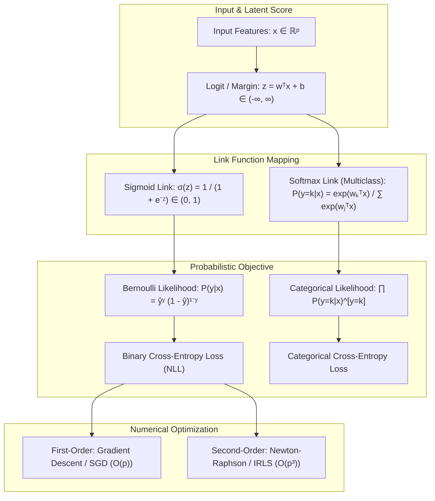
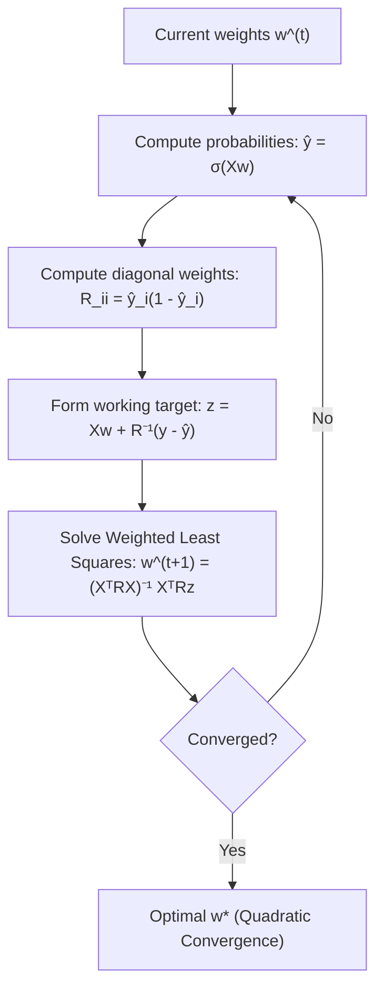
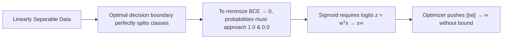

# Logistic & Softmax Regression — Probabilistic Classification & IRLS

!!! info "Prerequisites"
    Linear combinations, gradients, and maximum likelihood estimation. Review [Linear Regression](linear-regression-deep-dive.md), [Probability & Statistics](../02-mathematics/probability-statistics-deep-dive.md), and [Calculus & Optimization](../02-mathematics/calculus-optimization-deep-dive.md).

---

## 1. The Big Picture

Linear regression predicts continuous real values $\hat{y} \in (-\infty, \infty)$. If we attempt to use linear regression for classification by thresholding predictions at $0.5$, two catastrophic failure modes emerge:

1. **Probability Range Violations**: A linear function $\mathbf{w}^T \mathbf{x} + b$ is unconstrained. For inputs far from the decision boundary, $\hat{y}$ produces nonsensical values like $-2.4$ or $+4.8$, which cannot be interpreted as probabilities $P(y=1|\mathbf{x}) \in [0, 1]$.
2. **Sensitivity to Distant Outliers**: Least squares squares the residual $(\mathbf{w}^T \mathbf{x} + b - 1)^2$. An extreme positive training sample that is "too correctly classified" (e.g., $\mathbf{w}^T \mathbf{x} + b = 10$) incurs an enormous penalty $(10 - 1)^2 = 81$, causing the decision boundary to rotate toward the outlier and misclassify closer points.

**Logistic Regression** resolves this by modeling the **log-odds** of the positive class as an affine function, mapping $(-\infty, \infty)$ strictly into $(0, 1)$ via the **logistic sigmoid** link function. For multi-class scenarios, **Softmax Regression** generalizes this principle to probability simplices across $K$ mutually exclusive categories.



---

## 2. Odds, Log-Odds, and the Sigmoid Link

### 2.1 The Probability to Log-Odds Continuum

Let $p = P(y = 1 | \mathbf{x}) \in (0, 1)$ denote the conditional probability of the positive class.

1. **Probability ($p$)**: Bounded in $(0, 1)$. Unsuitable for linear combinations because sums can exceed $1$ or drop below $0$.
2. **Odds ($\frac{p}{1-p}$)**: The ratio of probability of success to probability of failure, bounded in $(0, \infty)$:
   $$\text{Odds} = \frac{p}{1 - p}$$

3. **Log-Odds or Logit ($\ln \frac{p}{1-p}$)**: The natural logarithm of the odds maps $(0, \infty)$ to the entire real line $(-\infty, \infty)$:
   $$\text{logit}(p) = \ln \left( \frac{p}{1 - p} \right) = z = \mathbf{w}^T \mathbf{x} + b$$

### 2.2 Derivation of the Standard Logistic Sigmoid

Solving the logit equation for $p$:

$$
\frac{p}{1 - p} = e^z \implies p = e^z (1 - p) = e^z - p e^z
$$

$$
p (1 + e^z) = e^z \implies p = \frac{e^z}{1 + e^z} = \frac{1}{1 + e^{-z}} \equiv \sigma(z)
$$

The logistic sigmoid $\sigma(z)$ satisfies key analytical properties:

- **Symmetry**: $\sigma(-z) = 1 - \sigma(z)$.
- **Asymptotes**: $\lim_{z \to \infty} \sigma(z) = 1$, and $\lim_{z \to -\infty} \sigma(z) = 0$.
- **Decision Boundary**: $z = 0 \iff \sigma(z) = 0.5 \iff \mathbf{w}^T \mathbf{x} + b = 0$, forming a linear hyperplane separating class $1$ from class $0$.

### 2.3 Derivative of the Sigmoid Function

The derivative of $\sigma(z)$ can be expressed elegantly in terms of its output:

$$
\begin{aligned}
\frac{d}{dz} \sigma(z) &= \frac{d}{dz} (1 + e^{-z})^{-1} = -(1 + e^{-z})^{-2} (-e^{-z}) \\
&= \frac{e^{-z}}{(1 + e^{-z})^2} = \left( \frac{1}{1 + e^{-z}} \right) \left( \frac{e^{-z}}{1 + e^{-z}} \right) \\
&= \sigma(z) \left( \frac{1 + e^{-z} - 1}{1 + e^{-z}} \right) = \sigma(z) \left( 1 - \frac{1}{1 + e^{-z}} \right) \\
&= \sigma(z) (1 - \sigma(z))
\end{aligned}
$$

$$\sigma'(z) = \sigma(z)(1 - \sigma(z))$$

This simple derivative eliminates transcendental function calls during backpropagation and gradient updates.

---

## 3. Loss Function: Binary Cross-Entropy from Bernoulli MLE

### 3.1 Bernoulli Likelihood Formulation

Consider $n$ independent and identically distributed training pairs $(\mathbf{x}_i, y_i)$, where $y_i \in \{0, 1\}$.
Let $\hat{y}_i = P(y_i = 1 | \mathbf{x}_i; \mathbf{w}) = \sigma(\mathbf{w}^T \mathbf{x}_i)$. The probability mass function of a single Bernoulli trial is:

$$
P(y_i | \mathbf{x}_i; \mathbf{w}) = \hat{y}_i^{y_i} (1 - \hat{y}_i)^{1 - y_i}
$$

For the full dataset, the joint data likelihood is the product over all samples:

$$
\mathcal{L}(\mathbf{w}) = \prod_{i=1}^n P(y_i | \mathbf{x}_i; \mathbf{w}) = \prod_{i=1}^n \hat{y}_i^{y_i} (1 - \hat{y}_i)^{1 - y_i}
$$

### 3.2 Negative Log-Likelihood (Binary Cross-Entropy)

Maximizing the likelihood is mathematically equivalent to minimizing the Negative Log-Likelihood (NLL). Taking the natural logarithm:

$$
\ln \mathcal{L}(\mathbf{w}) = \sum_{i=1}^n \left[ y_i \ln \hat{y}_i + (1 - y_i) \ln(1 - \hat{y}_i) \right]
$$

Dividing by $n$ and negating yields the **Binary Cross-Entropy (BCE)** loss:

$$
J(\mathbf{w}) = -\frac{1}{n} \sum_{i=1}^n \left[ y_i \ln \hat{y}_i + (1 - y_i) \ln(1 - \hat{y}_i) \right]
$$


---

## 4. Analytical Gradient & Hessian Derivations

### 4.1 Gradient Vector Derivation

Let $z_i = \mathbf{w}^T \mathbf{x}_i$, so $\hat{y}_i = \sigma(z_i)$. Applying the multivariate chain rule for a single sample $i$:

$$
\frac{\partial J_i}{\partial w_j} = \frac{\partial J_i}{\partial \hat{y}_i} \cdot \frac{\partial \hat{y}_i}{\partial z_i} \cdot \frac{\partial z_i}{\partial w_j}
$$

Evaluating each partial derivative:

1. $\frac{\partial J_i}{\partial \hat{y}_i} = -\left( \frac{y_i}{\hat{y}_i} - \frac{1 - y_i}{1 - \hat{y}_i} \right) = -\frac{y_i(1 - \hat{y}_i) - (1 - y_i)\hat{y}_i}{\hat{y}_i(1 - \hat{y}_i)} = \frac{\hat{y}_i - y_i}{\hat{y}_i(1 - \hat{y}_i)}$
2. $\frac{\partial \hat{y}_i}{\partial z_i} = \hat{y}_i(1 - \hat{y}_i)$
3. $\frac{\partial z_i}{\partial w_j} = X_{ij}$

Multiplying them together, the denominators cancel out:

$$
\frac{\partial J_i}{\partial w_j} = \left( \frac{\hat{y}_i - y_i}{\hat{y}_i(1 - \hat{y}_i)} \right) \cdot \left[ \hat{y}_i(1 - \hat{y}_i) \right] \cdot X_{ij} = (\hat{y}_i - y_i) X_{ij}
$$

Summing over all $n$ samples, the full gradient vector is:

$$
\nabla_{\mathbf{w}} J(\mathbf{w}) = \frac{1}{n} \sum_{i=1}^n (\hat{y}_i - y_i) \mathbf{x}_i = \frac{1}{n} X^T (\hat{\mathbf{y}} - \mathbf{y})
$$

$$\nabla_{\mathbf{w}} J(\mathbf{w}) = \frac{1}{n} X^T (\hat{\mathbf{y}} - \mathbf{y})$$

**Notice the profound mathematical harmony**: The gradient of Logistic Regression with Binary Cross-Entropy has the **exact same algebraic form** as the gradient of Linear Regression with Mean Squared Error ($X^T(\hat{\mathbf{y}} - \mathbf{y})$)! The non-linearity is encapsulated entirely inside $\hat{\mathbf{y}} = \sigma(X\mathbf{w})$.

### 4.2 Hessian Matrix & Strict Convexity Proof

To compute the second-order partial derivatives, differentiate the gradient with respect to $w_k$:

$$
H_{jk} = \frac{\partial^2 J}{\partial w_j \partial w_k} = \frac{1}{n} \sum_{i=1}^n \frac{\partial (\hat{y}_i - y_i)}{\partial w_k} X_{ij} = \frac{1}{n} \sum_{i=1}^n \left( \frac{\partial \hat{y}_i}{\partial z_i} \frac{\partial z_i}{\partial w_k} \right) X_{ij}
$$

Since $\frac{\partial \hat{y}_i}{\partial z_i} = \hat{y}_i(1 - \hat{y}_i)$ and $\frac{\partial z_i}{\partial w_k} = X_{ik}$:

$$
H_{jk} = \frac{1}{n} \sum_{i=1}^n X_{ij} \left[ \hat{y}_i(1 - \hat{y}_i) \right] X_{ik}
$$

In matrix notation, define the diagonal weight matrix $R \in \mathbb{R}^{n \times n}$:

$$
R = \text{diag}\left( \hat{y}_1(1 - \hat{y}_1), \, \hat{y}_2(1 - \hat{y}_2), \, \dots, \, \hat{y}_n(1 - \hat{y}_n) \right)
$$

The Hessian matrix is:

$$
H = \nabla_{\mathbf{w}}^2 J(\mathbf{w}) = \frac{1}{n} X^T R X
$$

#### Proof of Convexity:
For any non-zero vector $\mathbf{v} \in \mathbb{R}^p$:

$$
\mathbf{v}^T H \mathbf{v} = \frac{1}{n} \mathbf{v}^T (X^T R X) \mathbf{v} = \frac{1}{n} (X\mathbf{v})^T R (X\mathbf{v})
$$

Let $\mathbf{u} = X\mathbf{v} \in \mathbb{R}^n$. Then:

$$
\mathbf{v}^T H \mathbf{v} = \frac{1}{n} \mathbf{u}^T R \mathbf{u} = \frac{1}{n} \sum_{i=1}^n u_i^2 \hat{y}_i(1 - \hat{y}_i)
$$

Because $0 < \hat{y}_i < 1$ for all finite weights, every diagonal element $R_{ii} = \hat{y}_i(1 - \hat{y}_i) > 0$.
Since $u_i^2 \ge 0$, the sum is non-negative: $\mathbf{v}^T H \mathbf{v} \ge 0$.
If $X$ has full column rank, $X\mathbf{v} \ne \mathbf{0}$ for $\mathbf{v} \ne \mathbf{0}$, meaning $\mathbf{v}^T H \mathbf{v} > 0$.

Therefore, **the Hessian is strictly positive definite ($H \succ 0$)**. The Binary Cross-Entropy loss surface is **globally convex with no local minima**. Any local minimum found by gradient descent or Newton's method is the unique global minimum!

---

## 5. Optimization: First-Order GD vs. Newton-Raphson IRLS

### 5.1 Gradient Descent & Stochastic Gradient Descent

First-order Gradient Descent updates weights using only the gradient:

$$
\mathbf{w}^{(t+1)} = \mathbf{w}^{(t)} - \eta \nabla J(\mathbf{w}^{(t)}) = \mathbf{w}^{(t)} - \frac{\eta}{n} X^T (\hat{\mathbf{y}}^{(t)} - \mathbf{y})
$$

- **Computational Cost per step**: $\mathcal{O}(n \cdot p)$ floating-point operations.
- **Convergence Rate**: Linear convergence $\mathcal{O}(1/t)$ on smooth convex functions. Requires careful learning rate tuning $\eta$.

### 5.2 Newton-Raphson & Iteratively Reweighted Least Squares (IRLS)

Newton's method approximates the objective function locally using a second-order Taylor expansion:

$$
J(\mathbf{w} + \Delta\mathbf{w}) \approx J(\mathbf{w}) + \nabla J(\mathbf{w})^T \Delta\mathbf{w} + \frac{1}{2} \Delta\mathbf{w}^T H \Delta\mathbf{w}
$$

Differentiating with respect to $\Delta\mathbf{w}$ and setting to zero yields the Newton step:

$$
\Delta\mathbf{w} = -H^{-1} \nabla J(\mathbf{w}) \implies \mathbf{w}^{(t+1)} = \mathbf{w}^{(t)} - H^{-1} \nabla J(\mathbf{w}^{(t)})
$$

Substituting our derived gradient $\nabla J = X^T(\hat{\mathbf{y}} - \mathbf{y})$ and Hessian $H = X^T R X$:

$$
\mathbf{w}^{(t+1)} = \mathbf{w}^{(t)} - (X^T R_t X)^{-1} X^T (\hat{\mathbf{y}}^{(t)} - \mathbf{y})
$$

Factoring out $(X^T R_t X)^{-1} X^T R_t$:

$$
\begin{aligned}
\mathbf{w}^{(t+1)} &= (X^T R_t X)^{-1} \left[ X^T R_t X \mathbf{w}^{(t)} - X^T (\hat{\mathbf{y}}^{(t)} - \mathbf{y}) \right] \\
&= (X^T R_t X)^{-1} X^T R_t \left[ X\mathbf{w}^{(t)} + R_t^{-1} (\mathbf{y} - \hat{\mathbf{y}}^{(t)}) \right]
\end{aligned}
$$

Define the **adjusted response vector** $\mathbf{z}_t \in \mathbb{R}^n$:

$$
\mathbf{z}_t = X\mathbf{w}^{(t)} + R_t^{-1} (\mathbf{y} - \hat{\mathbf{y}}^{(t)})
$$

Then the update equation becomes:

$$
\mathbf{w}^{(t+1)} = (X^T R_t X)^{-1} X^T R_t \mathbf{z}_t
$$

$$\mathbf{w}^{(t+1)} = (X^T R_t X)^{-1} X^T R_t \mathbf{z}_t$$

**Why is it called IRLS?**
Recall that in Weighted Least Squares (WLS) with weight matrix $W$, the optimal solution is $\mathbf{w}^* = (X^T W X)^{-1} X^T W \mathbf{y}$.
The Newton-Raphson update solves a weighted least squares problem at every iteration with weights $R_t$ and working response $\mathbf{z}_t$. Because $R_t$ and $\mathbf{z}_t$ depend on the current parameter estimates $\mathbf{w}^{(t)}$, we **iteratively reweight** the least squares problem until convergence.



- **Convergence Rate**: **Quadratic convergence** ($\|w^{(t+1)} - w^*\| \le M \|w^{(t)} - w^*\|^2$). Typically reaches machine precision in 5 to 10 iterations!
- **Computational Cost**: $\mathcal{O}(n p^2 + p^3)$ per iteration to invert the $p \times p$ matrix $X^T R X$. Ideal when $p$ is small-to-moderate ($p \le 2000$).

---

## 6. Multinomial Logistic Regression (Softmax Regression)

When classifying samples into $K > 2$ mutually exclusive classes ($y \in \{1, 2, \dots, K\}$), we assign a separate parameter vector $\mathbf{w}_k \in \mathbb{R}^p$ to each class, organized into a weight matrix $W \in \mathbb{R}^{p \times K}$.

### 6.1 Softmax Formulation

The conditional probability of class $k$ given input $\mathbf{x}$ is computed via the **Softmax function**:

$$
P(y = k | \mathbf{x}) = \hat{p}_k = \frac{\exp(\mathbf{w}_k^T \mathbf{x})}{\sum_{j=1}^K \exp(\mathbf{w}_j^T \mathbf{x})}
$$

Properties:

- $\hat{p}_k > 0$ for all $k$.
- $\sum_{k=1}^K \hat{p}_k = 1$. The output vector $\hat{\mathbf{p}}$ lies on the standard $(K-1)$-simplex.

### 6.2 Categorical Cross-Entropy Loss

Represent the target using a one-hot encoded vector $\mathbf{y}_i \in \{0, 1\}^K$, where $y_{ik} = 1$ if sample $i$ belongs to class $k$. The multi-sample Categorical Cross-Entropy (CCE) loss is:

$$
J(W) = -\frac{1}{n} \sum_{i=1}^n \sum_{k=1}^K y_{ik} \ln \hat{p}_{ik}
$$

### 6.3 Softmax Cross-Entropy Gradient Derivation

Let $z_{ik} = \mathbf{w}_k^T \mathbf{x}_i$. The derivative of the softmax output with respect to logits is:

$$
\frac{\partial \hat{p}_{im}}{\partial z_{ik}} = \begin{cases} \hat{p}_{ik}(1 - \hat{p}_{ik}) & \text{if } m = k \\ -\hat{p}_{im} \hat{p}_{ik} & \text{if } m \ne k \end{cases} = \hat{p}_{im} (\delta_{mk} - \hat{p}_{ik})
$$

Differentiating the loss with respect to class logit $z_{ik}$:

$$
\frac{\partial J_i}{\partial z_{ik}} = -\sum_{m=1}^K \frac{y_{im}}{\hat{p}_{im}} \frac{\partial \hat{p}_{im}}{\partial z_{ik}} = -\sum_{m=1}^K \frac{y_{im}}{\hat{p}_{im}} \left[ \hat{p}_{im} (\delta_{mk} - \hat{p}_{ik}) \right] = -\sum_{m=1}^K y_{im} (\delta_{mk} - \hat{p}_{ik})
$$

Since $\sum_{m=1}^K y_{im} = 1$ for one-hot encoding:

$$
\frac{\partial J_i}{\partial z_{ik}} = -y_{ik} + \hat{p}_{ik} \sum_{m=1}^K y_{im} = \hat{p}_{ik} - y_{ik}
$$

The full gradient matrix with respect to weight matrix $W \in \mathbb{R}^{p \times K}$ is:

$$
\nabla_W J(W) = \frac{1}{n} X^T (\hat{P} - Y)
$$

where $\hat{P} \in \mathbb{R}^{n \times K}$ and $Y \in \mathbb{R}^{n \times K}$ are matrices of predicted probabilities and ground truth one-hot targets.

---

## 7. Implementation 1 — Vectorized Binary & Softmax Logistic Regression (NumPy)

Below is a complete, production-grade from-scratch implementation supporting both **IRLS (Newton-Raphson)** and **SGD/Mini-batch Gradient Descent** for binary classification, plus a vectorized **Softmax Regression** classifier.

```python
import numpy as np


class ScratchLogisticRegression:
    """
    Binary Logistic Regression supporting both first-order Gradient Descent
    and second-order Newton-Raphson Iteratively Reweighted Least Squares (IRLS).
    """
    def __init__(self, solver='irls', lr=0.05, max_iter=100, tol=1e-6, l2_reg=1e-4):
        self.solver = solver
        self.lr = lr
        self.max_iter = max_iter
        self.tol = tol
        self.l2_reg = l2_reg
        self.coef_ = None
        self.intercept_ = None

    @staticmethod
    def _sigmoid(z: np.ndarray) -> np.ndarray:
        # Numerically stable sigmoid to prevent exp overflow
        return np.where(
            z >= 0,
            1.0 / (1.0 + np.exp(-z)),
            np.exp(z) / (1.0 + np.exp(z))
        )

    def fit(self, X: np.ndarray, y: np.ndarray):
        n_samples, n_features = X.shape
        X = np.asarray(X, dtype=np.float64)
        y = np.asarray(y, dtype=np.float64).ravel()

        # Augment design matrix with bias column of 1s
        X_b = np.hstack([np.ones((n_samples, 1)), X])
        p = n_features + 1
        w = np.zeros(p, dtype=np.float64)

        if self.solver == 'irls':
            # Newton-Raphson Iteratively Reweighted Least Squares
            reg_matrix = self.l2_reg * np.eye(p)
            reg_matrix[0, 0] = 0.0  # Do not regularize intercept

            for it in range(self.max_iter):
                z = X_b @ w
                y_hat = self._sigmoid(z)

                # Weights: r_i = y_hat_i * (1 - y_hat_i)
                # Clip r to prevent division by zero or singular matrix
                r = np.clip(y_hat * (1.0 - y_hat), 1e-12, 0.25)

                # Gradient: g = X_b^T (y_hat - y) + reg * w
                gradient = X_b.T @ (y_hat - y) + reg_matrix @ w

                # Hessian: H = X_b^T R X_b + reg
                # Efficient computation without constructing full n x n diagonal matrix:
                H = (X_b.T * r) @ X_b + reg_matrix

                # Newton step: delta_w = H^-1 * gradient
                try:
                    delta_w = np.linalg.solve(H, gradient)
                except np.linalg.LinAlgError:
                    delta_w = np.linalg.pinv(H) @ gradient

                w -= delta_w

                if np.max(np.abs(delta_w)) < self.tol:
                    break

        elif self.solver == 'gd':
            # Standard Batch Gradient Descent
            for it in range(self.max_iter):
                z = X_b @ w
                y_hat = self._sigmoid(z)
                grad = (X_b.T @ (y_hat - y)) / n_samples
                grad[1:] += self.l2_reg * w[1:]  # L2 regularization on features only

                w -= self.lr * grad

        self.intercept_ = w[0]
        self.coef_ = w[1:]
        return self

    def predict_proba(self, X: np.ndarray) -> np.ndarray:
        z = X @ self.coef_ + self.intercept_
        p1 = self._sigmoid(z)
        return np.column_stack([1.0 - p1, p1])

    def predict(self, X: np.ndarray, threshold: float = 0.5) -> np.ndarray:
        return (self.predict_proba(X)[:, 1] >= threshold).astype(int)


class ScratchSoftmaxRegression:
    """
    Multinomial Logistic Regression (Softmax) trained via Vectorized Gradient Descent.
    """
    def __init__(self, lr=0.1, max_iter=500, l2_reg=1e-3, tol=1e-5):
        self.lr = lr
        self.max_iter = max_iter
        self.l2_reg = l2_reg
        self.tol = tol
        self.W_ = None
        self.b_ = None

    @staticmethod
    def _softmax(logits: np.ndarray) -> np.ndarray:
        # Subtract max for numerical stability (prevents overflow in exp)
        shifted = logits - np.max(logits, axis=1, keepdims=True)
        exp_vals = np.exp(shifted)
        return exp_vals / np.sum(exp_vals, axis=1, keepdims=True)

    def fit(self, X: np.ndarray, y: np.ndarray):
        n_samples, n_features = X.shape
        classes = np.unique(y)
        n_classes = len(classes)
        self.classes_ = classes

        # Convert y to one-hot encoding
        Y = np.zeros((n_samples, n_classes))
        for idx, c in enumerate(classes):
            Y[y == c, idx] = 1.0

        # Initialize weights
        W = np.zeros((n_features, n_classes))
        b = np.zeros((1, n_classes))

        for it in range(self.max_iter):
            logits = X @ W + b
            P = self._softmax(logits)

            # Gradient: (1/n) * X^T (P - Y) + reg * W
            error = P - Y
            grad_W = (X.T @ error) / n_samples + self.l2_reg * W
            grad_b = np.mean(error, axis=0, keepdims=True)

            W -= self.lr * grad_W
            b -= self.lr * grad_b

            if np.max(np.abs(grad_W)) < self.tol:
                break

        self.W_ = W
        self.b_ = b.ravel()
        return self

    def predict_proba(self, X: np.ndarray) -> np.ndarray:
        logits = X @ self.W_ + self.b_
        return self._softmax(logits)

    def predict(self, X: np.ndarray) -> np.ndarray:
        return self.classes_[np.argmax(self.predict_proba(X), axis=1)]
```

---

## 8. Implementation 2 — scikit-learn Benchmarking & Verification

Let us verify both binary IRLS and Softmax regression against scikit-learn's `LogisticRegression`.

```python
import numpy as np
from sklearn.linear_model import LogisticRegression
from sklearn.datasets import make_classification
from sklearn.metrics import accuracy_score, log_loss

# 1. Binary Classification Benchmark
X_bin, y_bin = make_classification(
    n_samples=500, n_features=10, n_informative=6, n_classes=2, random_state=42
)

# Scratch IRLS
model_irls = ScratchLogisticRegression(solver='irls', l2_reg=1e-3, max_iter=20)
model_irls.fit(X_bin, y_bin)

# Scikit-learn Logistic Regression (lbfgs solver, C=1000 for minimal regularization)
sk_bin = LogisticRegression(C=1000.0, solver='lbfgs', fit_intercept=True)
sk_bin.fit(X_bin, y_bin)

irls_acc = accuracy_score(y_bin, model_irls.predict(X_bin))
sk_acc = accuracy_score(y_bin, sk_bin.predict(X_bin))
print(f"Binary Dataset — Scratch IRLS Accuracy: {irls_acc:.4f} | Sklearn Accuracy: {sk_acc:.4f}")
assert abs(irls_acc - sk_acc) < 0.02, "Binary IRLS accuracy diverges from scikit-learn!"

# 2. Multiclass Classification Benchmark (Softmax)
X_multi, y_multi = make_classification(
    n_samples=600, n_features=8, n_informative=6, n_classes=3, random_state=42
)

# Scratch Softmax
model_softmax = ScratchSoftmaxRegression(lr=0.2, max_iter=1000, l2_reg=1e-3)
model_softmax.fit(X_multi, y_multi)

# Sklearn Multinomial Logistic Regression
sk_multi = LogisticRegression(multi_class='multinomial', solver='lbfgs', C=1000.0)
sk_multi.fit(X_multi, y_multi)

soft_acc = accuracy_score(y_multi, model_softmax.predict(X_multi))
sk_m_acc = accuracy_score(y_multi, sk_multi.predict(X_multi))
print(f"Multiclass — Scratch Softmax Accuracy: {soft_acc:.4f} | Sklearn Accuracy: {sk_m_acc:.4f}")
assert abs(soft_acc - sk_m_acc) < 0.03, "Softmax accuracy diverges from scikit-learn!"
```

---

## 9. Common Errors & Production Debugging

### 9.1 Numerical Underflow/Overflow in Sigmoid & Log-Loss

Computing $\frac{1}{1 + e^{-z}}$ naively fails when $z \ll -709$ or $z \gg 709$ in IEEE 754 64-bit floating-point:

- If $z = -1000 \implies e^{1000} \to \text{inf} \implies \text{OverflowError}$.
- If $\hat{y} = 1.0 \implies \ln(1 - \hat{y}) = \ln(0) = -\infty \implies \text{NaN}$.

```python
# BROKEN: Direct naive sigmoid evaluation
def naive_sigmoid(z):
    return 1.0 / (1.0 + np.exp(-z))  # Overflows for negative z < -709

# PRODUCTION FIX: Piecewise stable sigmoid
def stable_sigmoid(z):
    return np.where(z >= 0, 1.0 / (1.0 + np.exp(-z)), np.exp(z) / (1.0 + np.exp(z)))

# PRODUCTION FIX: Log-Sum-Exp trick for Binary Cross-Entropy
# -[y ln σ(z) + (1-y) ln(1 - σ(z))] = max(z, 0) - y*z + ln(1 + exp(-|z|))
def stable_bce_loss(z, y):
    return np.mean(np.maximum(z, 0) - y * z + np.log1p(np.exp(-np.abs(z))))
```

### 9.2 The Perfect Separation Problem & Exploding Weights

If the training dataset is **linearly separable**, an unregularized logistic regression model will never converge!



**Symptom**: Coefficients inflate to thousands, variance explodes, and Newton/IRLS produces singular Hessian warnings.
**Fix**: Always apply $L_2$ regularization (`penalty='l2'` in scikit-learn, parameter `C`). $L_2$ penalizes weight magnitude, halting parameter explosion at a finite optimal margin.

---

## 10. Staff-Level Interview Questions & Model Answers

### Q1: Prove that the Binary Cross-Entropy loss for Logistic Regression is strictly convex, and explain what this implies for optimization.

**Model Answer:**
A twice continuously differentiable function is strictly convex if and only if its Hessian matrix is strictly positive definite everywhere in its domain ($\mathbf{v}^T H \mathbf{v} > 0$ for all $\mathbf{v} \ne \mathbf{0}$).
The Hessian of Binary Cross-Entropy is:
$$H = \frac{1}{n} X^T R X$$
where $R \in \mathbb{R}^{n \times n}$ is a diagonal matrix with diagonal elements $R_{ii} = \hat{y}_i(1 - \hat{y}_i)$.
Because $\hat{y}_i = \sigma(\mathbf{w}^T \mathbf{x}_i) \in (0, 1)$ for any finite weight vector $\mathbf{w}$, the product $\hat{y}_i(1 - \hat{y}_i)$ is strictly bounded in $(0, 0.25]$. Therefore, $R$ is a strictly positive definite diagonal matrix ($R \succ 0$).
For any non-zero vector $\mathbf{v} \in \mathbb{R}^p$:
$$\mathbf{v}^T H \mathbf{v} = \frac{1}{n} \mathbf{v}^T X^T R X \mathbf{v} = \frac{1}{n} (X\mathbf{v})^T R (X\mathbf{v})$$
Let $\mathbf{u} = X\mathbf{v} \in \mathbb{R}^n$. Then:
$$\mathbf{v}^T H \mathbf{v} = \frac{1}{n} \mathbf{u}^T R \mathbf{u} = \frac{1}{n} \sum_{i=1}^n R_{ii} u_i^2$$
Assuming the design matrix $X$ has full column rank ($n \ge p$ with linearly independent columns), $X\mathbf{v} = \mathbf{0} \iff \mathbf{v} = \mathbf{0}$. For any $\mathbf{v} \ne \mathbf{0}$, at least one component $u_i \ne 0$, meaning the sum is strictly positive: $\mathbf{v}^T H \mathbf{v} > 0$.
**Optimization Implications:**

1. The loss surface has no local minima, saddle points, or plateaus with zero gradient other than the unique global minimum $\mathbf{w}^*$.
2. Any standard descent algorithm (Gradient Descent, Conjugate Gradient, Newton-Raphson) will reliably converge to the exact same optimal parameters.

---

### Q2: Derive the Newton-Raphson update for Logistic Regression and show that it is mathematically identical to Iteratively Reweighted Least Squares (IRLS).

**Model Answer:**
The standard multivariate Newton-Raphson update for finding the minimum of $J(\mathbf{w})$ is:
$$\mathbf{w}^{(t+1)} = \mathbf{w}^{(t)} - H^{-1} \nabla J(\mathbf{w}^{(t)})$$
For Logistic Regression with BCE loss:
$$\nabla J(\mathbf{w}^{(t)}) = X^T (\hat{\mathbf{y}}^{(t)} - \mathbf{y}), \qquad H = X^T R_t X$$
Substituting these expressions:
$$\mathbf{w}^{(t+1)} = \mathbf{w}^{(t)} - (X^T R_t X)^{-1} X^T (\hat{\mathbf{y}}^{(t)} - \mathbf{y})$$
Factoring $(X^T R_t X)^{-1} X^T R_t$ out of the entire right-hand side:
$$\begin{aligned}
\mathbf{w}^{(t+1)} &= (X^T R_t X)^{-1} \left[ (X^T R_t X)\mathbf{w}^{(t)} - X^T (\hat{\mathbf{y}}^{(t)} - \mathbf{y}) \right] \\
&= (X^T R_t X)^{-1} X^T \left[ R_t X\mathbf{w}^{(t)} - (\hat{\mathbf{y}}^{(t)} - \mathbf{y}) \right] \\
&= (X^T R_t X)^{-1} X^T R_t \left[ X\mathbf{w}^{(t)} + R_t^{-1}(\mathbf{y} - \hat{\mathbf{y}}^{(t)}) \right]
\end{aligned}$$
Define the working response vector $\mathbf{z}_t = X\mathbf{w}^{(t)} + R_t^{-1}(\mathbf{y} - \hat{\mathbf{y}}^{(t)})$. The equation simplifies to:
$$\mathbf{w}^{(t+1)} = (X^T R_t X)^{-1} X^T R_t \mathbf{z}_t$$
In classical statistics, minimizing the weighted least squares objective $\sum_{i=1}^n w_i (z_i - \mathbf{x}_i^T \mathbf{w})^2 = (\mathbf{z} - X\mathbf{w})^T W (\mathbf{z} - X\mathbf{w})$ yields the analytical solution:
$$\mathbf{w}^* = (X^T W X)^{-1} X^T W \mathbf{z}$$
Comparing the two reveals that the Newton-Raphson step is exactly equivalent to solving a Weighted Least Squares regression where the response is $\mathbf{z}_t$ and the sample weights are $R_t$. Because $R_t$ and $\mathbf{z}_t$ depend on $\mathbf{w}^{(t)}$, this linear regression is solved iteratively—hence Iteratively Reweighted Least Squares.

---

### Q3: What happens when Logistic Regression is fit on linearly separable data without regularization? Why does this occur, and how do you diagnose it?

**Model Answer:**
**Phenomenon:**
When data is linearly separable, there exists a hyperplane $(\mathbf{w}, b)$ such that $\mathbf{w}^T \mathbf{x}_i + b > 0$ for all $y_i = 1$ and $\mathbf{w}^T \mathbf{x}_i + b < 0$ for all $y_i = 0$.
The Binary Cross-Entropy loss is:
$$J(\mathbf{w}) = -\sum_{i=1}^n \left[ y_i \ln \sigma(z_i) + (1 - y_i) \ln(1 - \sigma(z_i)) \right]$$
To achieve $J(\mathbf{w}) \to 0$, the predicted probabilities must satisfy $\hat{y}_i \to 1$ for $y_i=1$ and $\hat{y}_i \to 0$ for $y_i=0$.
Because the sigmoid function reaches $1.0$ only as $z \to +\infty$ and $0.0$ only as $z \to -\infty$, the optimizer scales the magnitude of the weight vector $\|\mathbf{w}\| \to \infty$ along the normal vector of the separating hyperplane.

**Consequences & Diagnosis:**

1. Gradient descent never terminates: gradients become tiny not because the optimum is reached, but because $\sigma'(z) \to 0$ in the saturation zones.
2. Estimated coefficients explode to numbers like $\pm 10^4$ or $\pm 10^7$.
3. The standard errors of the parameters computed from the Fisher Information matrix / inverse Hessian $H^{-1} = (X^T R X)^{-1}$ explode to infinity because $R_{ii} = \hat{y}_i(1 - \hat{y}_i) \to 0$, making $H$ singular.
4. **Diagnosis in Scikit-Learn**: Large coefficient magnitudes and `ConvergenceWarning: lbfgs failed to converge`.
5. **Remedy**: Apply $L_2$ regularization (Ridge penalty $\frac{\lambda}{2}\|\mathbf{w}\|_2^2$), which penalizes infinite weights and yields a finite maximum margin solution (equivalent to a hard-margin SVM).

---

### Q4: Why can't we use Mean Squared Error (MSE) as the loss function for Logistic Regression?

**Model Answer:**
While MSE $J(\mathbf{w}) = \frac{1}{2n}\sum_{i=1}^n (\sigma(\mathbf{w}^T \mathbf{x}_i) - y_i)^2$ is mathematically permissible, it is profoundly inferior to Cross-Entropy for two fundamental reasons:

1. **Non-Convexity & Local Minima**:
   When $\hat{y}_i = \sigma(z_i)$ is substituted into MSE, the loss function is no longer quadratic in $z_i$. Differentiating MSE:
   $$\frac{\partial J}{\partial w_j} = \frac{1}{n} \sum_{i=1}^n (\hat{y}_i - y_i) \cdot \sigma'(z_i) \cdot X_{ij} = \frac{1}{n} \sum_{i=1}^n (\hat{y}_i - y_i) \hat{y}_i(1 - \hat{y}_i) X_{ij}$$
   Computing the second derivative yields terms containing both $\sigma'(z)$ and $\sigma''(z)$. Because $\sigma''(z) = \sigma(z)(1-\sigma(z))(1-2\sigma(z))$ changes sign across $z=0$, the Hessian matrix ceases to be positive semi-definite everywhere. MSE creates a **non-convex loss landscape plagued by saddle points and local minima**.

2. **Vanishing Gradients on Wildly Wrong Predictions**:
   Suppose the true label is $y_i = 1$, but the current model is catastrophically wrong with $z_i = -10$, predicting $\hat{y}_i \approx 0.000045$.
   Under MSE:
   $$\frac{\partial J_i}{\partial w_j} = (\hat{y}_i - 1) \cdot \hat{y}_i(1 - \hat{y}_i) \cdot X_{ij} \approx (-1) \cdot (0.000045) \cdot (1) \cdot X_{ij} \approx -0.000045 X_{ij}$$
   The gradient is virtually zero! Because the sigmoid is saturated, the model learns almost nothing when it is most wrong.
   Under Cross-Entropy:
   $$\frac{\partial J_i}{\partial w_j} = (\hat{y}_i - y_i) X_{ij} \approx (0.000045 - 1) X_{ij} \approx -0.999955 X_{ij}$$
   The gradient has maximum magnitude $\approx 1$, propelling the parameters rapidly away from the catastrophic error.

---

### Q5: How do One-vs-Rest (OvR) and Multinomial Softmax differ for multi-class classification, and when is Softmax preferred?

**Model Answer:**

- **One-vs-Rest (OvR / One-vs-All):**
  Trains $K$ independent binary logistic regression models. Model $k$ predicts $P(y = k \text{ vs } y \ne k)$.
  *Limitations:* The binary models are uncoordinated; their independent probabilities do not sum to 1 ($\sum_{k=1}^K P(y=k|\mathbf{x}) \ne 1$). Calibrating probabilities requires ad-hoc post-processing normalization. Furthermore, each binary classifier suffers from class imbalance (1 positive class vs $K-1$ negative classes).

- **Multinomial Softmax Regression:**
  Trains all $K$ classes simultaneously under a single unified objective. The categorical cross-entropy loss couples the class weights through the softmax denominator $\sum_{j=1}^K e^{\mathbf{w}_j^T \mathbf{x}}$.
  *Advantages:* The outputs are guaranteed to form a mathematically valid probability distribution on the simplex ($\sum \hat{p}_k = 1$). A boost in the logit for class $k$ automatically depresses the probabilities of competing classes. Softmax is mathematically consistent with maximum likelihood estimation for categorical random variables.
  *Decision Rule:* Multinomial Softmax is strictly preferred whenever classes are mutually exclusive (e.g., digit recognition, medical diagnosis of distinct conditions). OvR is only retained for multi-label classification where an example can belong to multiple classes simultaneously.

---

### Q6: Interpret the coefficients of a Logistic Regression model in terms of the Odds Ratio (OR).

**Model Answer:**
Let $\ln \left( \frac{p(\mathbf{x})}{1 - p(\mathbf{x})} \right) = w_0 + w_1 x_1 + \dots + w_j x_j + \dots + w_p x_p$.
Suppose feature $x_j$ increases by 1 unit while holding all other features fixed at $\mathbf{x}_{-j}$:
$$\text{logit}(p(\mathbf{x} + \mathbf{e}_j)) = \text{logit}(p(\mathbf{x})) + w_j$$
Exponentiating both sides:
$$\frac{p(\mathbf{x} + \mathbf{e}_j)}{1 - p(\mathbf{x} + \mathbf{e}_j)} = \frac{p(\mathbf{x})}{1 - p(\mathbf{x})} \cdot e^{w_j}$$
The ratio of the odds after the 1-unit increase to the odds before is the **Odds Ratio (OR)**:
$$\text{OR}_j = \frac{\text{Odds}(x_j + 1)}{\text{Odds}(x_j)} = e^{w_j}$$

- If $w_j = 0 \implies \text{OR} = 1$: Feature $j$ has no association with the positive class odds.
- If $w_j > 0 \implies \text{OR} > 1$: Every 1-unit increase in $x_j$ multiplies the odds of the outcome by $e^{w_j}$ (e.g., $w_j = 0.693 \implies e^{0.693} \approx 2.0$, doubling the odds of success).
- If $w_j < 0 \implies \text{OR} < 1$: Every 1-unit increase diminishes the odds of success.

---

## 11. Mastery Ladder

- [ ] **L1:** You can write the logistic sigmoid $\sigma(z) = \frac{1}{1 + e^{-z}}$ and state why linear regression fails for classification.
- [ ] **L2:** You can define odds, log-odds (logit), and derive the sigmoid function by inverting the logit.
- [ ] **L3:** You can prove the sigmoid derivative identity $\sigma'(z) = \sigma(z)(1 - \sigma(z))$.
- [ ] **L4:** You can derive Binary Cross-Entropy loss from the Bernoulli likelihood via Maximum Likelihood Estimation.
- [ ] **L5:** You can derive the gradient $\nabla_{\mathbf{w}} J = \frac{1}{n} X^T (\hat{\mathbf{y}} - \mathbf{y})$ using the chain rule.
- [ ] **L6:** You can derive the Hessian $H = \frac{1}{n} X^T R X$ and prove strict convexity ($H \succ 0$).
- [ ] **L7:** You can derive the Newton-Raphson IRLS update $\mathbf{w}^{(t+1)} = (X^T R_t X)^{-1} X^T R_t \mathbf{z}_t$.
- [ ] **L8:** You can write the Softmax function, formulate Categorical Cross-Entropy, and derive its gradient matrix.
- [ ] **L9:** You can explain the perfect separation problem and interpret logistic weights as Odds Ratios ($e^{w_j}$).
- [ ] **L10:** You can implement vectorized IRLS and Softmax regression from scratch in NumPy with numerical overflow guards.
