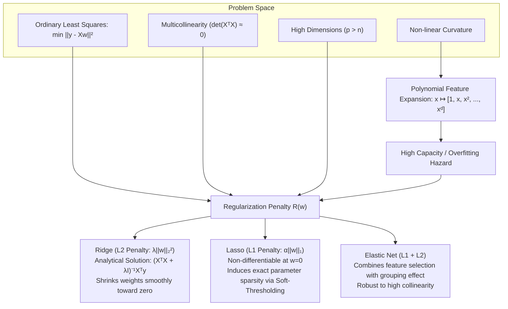
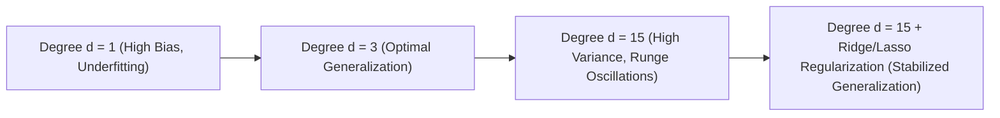
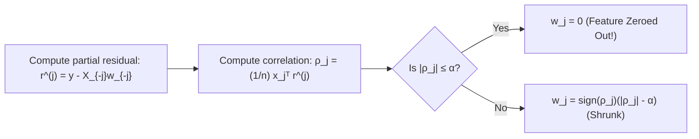
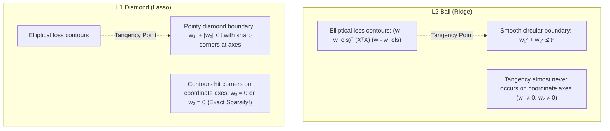

# Regularized & Polynomial Regression — Ridge, Lasso, and Elastic Net

!!! info "Prerequisites"
    Ordinary Least Squares and matrix calculus. Review [Linear Regression](linear-regression-deep-dive.md), [Linear Algebra & Matrix Inversion](../02-mathematics/linear-algebra-deep-dive.md), and [Calculus & Optimization](../02-mathematics/calculus-optimization-deep-dive.md).

---

## 1. The Big Picture

Ordinary Least Squares (OLS) minimizes training residual sum of squares without constraint. While statistically optimal when the Gauss-Markov assumptions hold, unconstrained least squares suffers from two fatal vulnerabilities in production machine learning:

1. **Multicollinearity & Numerical Instability**: When predictors are correlated, the Gram matrix $X^T X$ becomes ill-conditioned or non-invertible ($\det(X^T X) \approx 0$). Estimated weights explode in magnitude with wildly oscillating signs and astronomical variance.
2. **Overfitting in High Dimensions ($p > n$)**: When the number of features $p$ approaches or exceeds the sample size $n$, OLS memorizes noise. The system of normal equations is underdetermined, yielding infinitely many zero-loss solutions that fail catastrophically on test data.

**Regularization** injects a controlled inductive bias into the objective function. By penalizing parameter magnitude, we trade a small amount of training bias for a dramatic reduction in variance. **Polynomial Regression** increases model capacity to capture non-linear curvature, while **Ridge ($L_2$)**, **Lasso ($L_1$)**, and **Elastic Net ($L_1 + L_2$)** rein in that capacity.



---

## 2. Polynomial Regression & Capacity Control

### 2.1 The Polynomial Feature Mapping

Real-world physical, biological, and economic relationships are rarely strictly affine. For a scalar feature $x \in \mathbb{R}$, a degree-$d$ polynomial model is:

$$
\hat{y} = w_0 + w_1 x + w_2 x^2 + w_3 x^3 + \dots + w_d x^d = \sum_{j=0}^d w_j x^j
$$

Although the hypothesis is non-linear with respect to the input $x$, it remains **strictly linear with respect to the parameter vector $\mathbf{w}$**. We define a non-linear feature mapping $\phi: \mathbb{R} \to \mathbb{R}^{d+1}$:

$$
\phi(x) = \begin{bmatrix} 1 & x & x^2 & \dots & x^d \end{bmatrix}^T
$$

The design matrix $\Phi \in \mathbb{R}^{n \times (d+1)}$ is a **Vandermonde matrix**:

$$
\Phi = \begin{bmatrix}
1 & x_1 & x_1^2 & \dots & x_1^d \\
1 & x_2 & x_2^2 & \dots & x_2^d \\
\vdots & \vdots & \vdots & \ddots & \vdots \\
1 & x_n & x_n^2 & \dots & x_n^d
\end{bmatrix}
$$

For multivariate inputs $\mathbf{x} \in \mathbb{R}^p$, degree-$d$ expansion generates all monomials $\prod_{j=1}^p x_j^{k_j}$ such that $\sum_{j=1}^p k_j \le d$. The number of generated features scales combinatorially:

$$
\dim(\phi(\mathbf{x})) = \binom{p + d}{d} = \frac{(p + d)!}{p! \, d!}
$$

For $p = 100$ features and degree $d = 3$, the model creates $\binom{103}{3} = 176,851$ features!

### 2.2 Runge's Phenomenon & Overfitting Dynamics

As polynomial degree $d$ increases, the model's hypothesis space expands. While training error monotonically approaches zero, the polynomial develops violent high-frequency oscillations between interpolation nodes—an instability known in numerical analysis as **Runge's phenomenon**.



Without parameter regularization, fitting high-degree polynomials produces astronomical weights with alternating signs (e.g., $w_4 = +10^6, w_5 = -10^6$) that delicately cancel out at the training points but explode in between.

---

## 3. Ridge Regression ($L_2$ Regularization)

### 3.1 Objective Function

Ridge regression (also known as Tikhonov regularization) adds an $L_2$ squared Euclidean norm penalty to the Mean Squared Error:

$$
\mathcal{L}_{\text{Ridge}}(\mathbf{w}) = \frac{1}{2n} \|\mathbf{y} - X\mathbf{w}\|_2^2 + \frac{\lambda}{2} \|\mathbf{w}\|_2^2
$$

where $\lambda \ge 0$ is the regularization hyperparameter:
- $\lambda = 0 \implies$ Ordinary Least Squares.
- $\lambda \to \infty \implies \mathbf{w}^* \to \mathbf{0}$.

*(Note: The intercept $w_0$ / bias $b$ is never regularized; we assume features $X$ and target $\mathbf{y}$ are centered, or the bias is unpenalized).*

### 3.2 Mathematical Derivation of the Closed-Form Solution

Expanding the objective function in matrix notation:

$$
\mathcal{L}_{\text{Ridge}}(\mathbf{w}) = \frac{1}{2n} \left( \mathbf{y}^T \mathbf{y} - 2 \mathbf{w}^T X^T \mathbf{y} + \mathbf{w}^T X^T X \mathbf{w} \right) + \frac{\lambda}{2} \mathbf{w}^T \mathbf{w}
$$

Taking the vector derivative with respect to $\mathbf{w}$ using matrix calculus rules:

$$
\nabla_{\mathbf{w}} \mathcal{L}_{\text{Ridge}}(\mathbf{w}) = \frac{1}{n} \left( -X^T \mathbf{y} + X^T X \mathbf{w} \right) + \lambda \mathbf{w}
$$

Setting the gradient to zero to find the stationary point:

$$
\frac{1}{n} X^T X \mathbf{w} + \lambda \mathbf{w} = \frac{1}{n} X^T \mathbf{y}
$$

Multiplying through by $n$ (absorbing $n\lambda \to \lambda'$ or adopting the unscaled objective $\mathcal{L} = \|\mathbf{y} - X\mathbf{w}\|_2^2 + \lambda \|\mathbf{w}\|_2^2$):

$$
(X^T X + \lambda I_p) \mathbf{w} = X^T \mathbf{y}
$$

Because $(X^T X + \lambda I_p)$ is strictly positive definite for any $\lambda > 0$, it is invertible:

$$
\mathbf{w}^*_{\text{Ridge}} = (X^T X + \lambda I_p)^{-1} X^T \mathbf{y}
$$

### 3.3 Proof of Guaranteed Invertibility and Conditioning Improvement

Let the eigendecomposition of the symmetric Gram matrix be:

$$
X^T X = V \Lambda V^T, \quad \text{where } \Lambda = \text{diag}(\sigma_1^2, \sigma_2^2, \dots, \sigma_p^2), \; \sigma_j^2 \ge 0
$$

The regularized matrix is:

$$
X^T X + \lambda I_p = V \Lambda V^T + \lambda V I_p V^T = V (\Lambda + \lambda I_p) V^T
$$

The eigenvalues of $(X^T X + \lambda I_p)$ are:

$$
\mu_j = \sigma_j^2 + \lambda
$$

Since $\sigma_j^2 \ge 0$ and $\lambda > 0$, every eigenvalue $\mu_j \ge \lambda > 0$. The determinant is:

$$
\det(X^T X + \lambda I_p) = \prod_{j=1}^p (\sigma_j^2 + \lambda) \ge \lambda^p > 0
$$

The matrix is **guaranteed to be non-singular and invertible**, even when $p > n$ or when columns of $X$ are perfectly collinear!

Furthermore, consider the matrix **condition number** $\kappa(A) = \frac{\mu_{\max}}{\mu_{\min}}$:
- For OLS: $\kappa(X^T X) = \frac{\sigma_1^2}{\sigma_p^2} \to \infty$ as $\sigma_p \to 0$.
- For Ridge: $\kappa(X^T X + \lambda I) = \frac{\sigma_1^2 + \lambda}{\sigma_p^2 + \lambda} < \frac{\sigma_1^2}{\sigma_p^2}$.

Ridge directly bounds numerical error propagation during matrix inversion.

### 3.4 SVD Perspective on Weight Shrinkage

Using the Singular Value Decomposition (SVD) of the design matrix $X = U \Sigma V^T$:
- $U \in \mathbb{R}^{n \times p}$ has orthonormal columns ($U^T U = I_p$).
- $\Sigma = \text{diag}(\sigma_1, \dots, \sigma_p)$ contains singular values.
- $V \in \mathbb{R}^{p \times p}$ is an orthogonal matrix of right singular vectors ($V^T V = V V^T = I_p$).

Substituting $X = U \Sigma V^T$ into the Ridge formula:

$$
\begin{aligned}
\mathbf{w}^*_{\text{Ridge}} &= (V \Sigma^2 V^T + \lambda V I V^T)^{-1} V \Sigma U^T \mathbf{y} \\
&= \left[ V (\Sigma^2 + \lambda I) V^T \right]^{-1} V \Sigma U^T \mathbf{y} \\
&= V (\Sigma^2 + \lambda I)^{-1} V^T V \Sigma U^T \mathbf{y} \\
&= V (\Sigma^2 + \lambda I)^{-1} \Sigma U^T \mathbf{y} \\
&= \sum_{j=1}^p \mathbf{v}_j \left( \frac{\sigma_j}{\sigma_j^2 + \lambda} \right) \mathbf{u}_j^T \mathbf{y} = \sum_{j=1}^p \left( \frac{\sigma_j^2}{\sigma_j^2 + \lambda} \right) \frac{\mathbf{u}_j^T \mathbf{y}}{\sigma_j} \mathbf{v}_j
\end{aligned}
$$

Recall that the unregularized OLS solution is:

$$
\mathbf{w}^*_{\text{OLS}} = \sum_{j=1}^p \frac{\mathbf{u}_j^T \mathbf{y}}{\sigma_j} \mathbf{v}_j
$$

Therefore, along each principal direction $\mathbf{v}_j$, Ridge applies a **multiplicative shrinkage factor**:

$$
f_j = \frac{\sigma_j^2}{\sigma_j^2 + \lambda} < 1
$$

- For large singular values ($\sigma_j^2 \gg \lambda$): $f_j \approx 1$. High-variance, informative data directions are preserved untouched.
- For small singular values ($\sigma_j^2 \ll \lambda$): $f_j \approx \frac{\sigma_j^2}{\lambda} \approx 0$. Low-variance directions (noise, collinear axes) are crushed toward zero.

---

## 4. Lasso Regression ($L_1$ Regularization)

### 4.1 Objective Function & Non-Differentiability

Lasso (Least Absolute Shrinkage and Selection Operator) penalizes the $L_1$ norm of the parameter vector:

$$
\mathcal{L}_{\text{Lasso}}(\mathbf{w}) = \frac{1}{2n} \|\mathbf{y} - X\mathbf{w}\|_2^2 + \alpha \|\mathbf{w}\|_1 = \frac{1}{2n} \sum_{i=1}^n \left( y_i - \sum_{j=1}^p X_{ij} w_j \right)^2 + \alpha \sum_{j=1}^p |w_j|
$$

Because the absolute value function $|w_j|$ has a sharp "kink" at $w_j = 0$, the gradient $\nabla_{\mathbf{w}} \mathcal{L}$ does not exist when any weight is zero:

$$
\frac{d}{dw_j} |w_j| = \begin{cases} +1 & \text{if } w_j > 0 \\ -1 & \text{if } w_j < 0 \\ \text{undefined} & \text{if } w_j = 0 \end{cases}
$$

Consequently, **Lasso has no closed-form solution** for arbitrary design matrices $X$. It requires convex non-smooth optimization algorithms.

### 4.2 Subgradient Calculus

A vector $\mathbf{g} \in \mathbb{R}^p$ is a **subgradient** of a convex function $f: \mathbb{R}^p \to \mathbb{R}$ at $\mathbf{w}$ if for all $\mathbf{u} \in \mathbb{R}^p$:

$$
f(\mathbf{u}) \ge f(\mathbf{w}) + \mathbf{g}^T (\mathbf{u} - \mathbf{w})
$$

The set of all subgradients at $\mathbf{w}$ is the **subdifferential** $\partial f(\mathbf{w})$.
For $f(w) = |w|$:

$$
\partial |w| = \begin{cases} \{+1\} & \text{if } w > 0 \\ \{-1\} & \text{if } w < 0 \\ [-1, 1] & \text{if } w = 0 \end{cases}
$$

A point $\mathbf{w}^*$ globally minimizes the convex objective if and only if:

$$
\mathbf{0} \in \partial \mathcal{L}(\mathbf{w}^*)
$$

### 4.3 Coordinate Descent & The Soft-Thresholding Operator

Coordinate Descent optimizes one coordinate $w_j$ at a time while holding all other coordinates $\mathbf{w}_{-j}$ fixed.

Isolating the coordinate $w_j$ in the residual sum of squares:

$$
\mathcal{L}(w_j) = \frac{1}{2n} \sum_{i=1}^n \left( y_i - \sum_{k \ne j} X_{ik} w_k - X_{ij} w_j \right)^2 + \alpha |w_j| + C
$$

Define the **partial residual** for feature $j$:

$$
r_i^{(j)} = y_i - \sum_{k \ne j} X_{ik} w_k
$$

The objective becomes:

$$
\mathcal{L}(w_j) = \frac{1}{2n} \sum_{i=1}^n (r_i^{(j)} - X_{ij} w_j)^2 + \alpha |w_j| + C
$$

Assuming features are standardized such that $\frac{1}{n} \sum_{i=1}^n X_{ij}^2 = 1$, expanding the square:

$$
\mathcal{L}(w_j) = \frac{1}{2} w_j^2 - \left( \frac{1}{n} \sum_{i=1}^n X_{ij} r_i^{(j)} \right) w_j + \alpha |w_j| + \text{const}
$$

Let $\rho_j = \frac{1}{n} \sum_{i=1}^n X_{ij} r_i^{(j)} = \frac{1}{n} \mathbf{x}_j^T \mathbf{r}^{(j)}$. Setting the subdifferential to include zero:

$$
0 \in w_j - \rho_j + \alpha \, \partial |w_j| \implies \rho_j - w_j \in \alpha \, \partial |w_j|
$$

We evaluate the three piecewise cases:

1. **If $w_j > 0$**: $\partial |w_j| = \{1\}$, so $\rho_j - w_j = \alpha \implies w_j = \rho_j - \alpha$. This requires $\rho_j > \alpha$.
2. **If $w_j < 0$**: $\partial |w_j| = \{-1\}$, so $\rho_j - w_j = -\alpha \implies w_j = \rho_j + \alpha$. This requires $\rho_j < -\alpha$.
3. **If $w_j = 0$**: $\partial |w_j| = [-1, 1]$, so $\rho_j \in [-\alpha, \alpha] \implies |\rho_j| \le \alpha$.

Combining all three conditions gives the celebrated **Soft-Thresholding Operator** $S(\rho_j, \alpha)$:

$$
w_j^* = \mathcal{S}(\rho_j, \alpha) = \text{sign}(\rho_j) \max(0, |\rho_j| - \alpha) = \begin{cases}
\rho_j - \alpha & \text{if } \rho_j > \alpha \\
0 & \text{if } |\rho_j| \le \alpha \\
\rho_j + \alpha & \text{if } \rho_j < -\alpha
\end{cases}
$$



Whenever the correlation between feature $j$ and the remaining residual is less than $\alpha$, the weight is set to **identically zero**. Lasso performs **automatic feature selection**.

### 4.4 Geometric Intuition: Diamond ($L_1$) vs. Circle ($L_2$)

Consider the constrained formulations:
- **Ridge**: $\min_{\mathbf{w}} \|\mathbf{y} - X\mathbf{w}\|_2^2$ subject to $w_1^2 + w_2^2 \le t^2$ (a Euclidean circle/sphere).
- **Lasso**: $\min_{\mathbf{w}} \|\mathbf{y} - X\mathbf{w}\|_2^2$ subject to $|w_1| + |w_2| \le t$ (a diamond/polytope).



The level curves of the squared error loss form ellipses centered at the unconstrained OLS solution $\mathbf{w}^*_{\text{OLS}}$. The regularized solution occurs at the first point where the expanding loss ellipse touches the constraint region.

Because the $L_1$ ball has sharp vertices lying directly on the coordinate axes (where one or more $w_j = 0$), expanding elliptical contours are geometrically prone to touching a corner first. In contrast, the $L_2$ sphere is completely smooth everywhere, so the tangency point almost never aligns with a coordinate axis ($P(w_j = 0) = 0$).

---

## 5. Elastic Net ($L_1 + L_2$ Regularization)

### 5.1 Limitations of Lasso

While Lasso is powerful for sparse selection, it exhibits two structural flaws in real-world tabular data:
1. **$p > n$ Dimensionality Cap**: If $p > n$, Lasso can select at most $n$ non-zero features before saturating, arbitrarily discarding remaining signals.
2. **Collinear Instability**: If a group of features are highly correlated (e.g., Pearson $r > 0.95$), Lasso arbitrarily selects one feature from the cluster and sets all others to zero, causing massive variance across cross-validation splits.

### 5.2 Objective Function & Grouping Effect

Elastic Net combines both penalties to retain Lasso's sparsity while inheriting Ridge's grouping stability:

$$
\mathcal{L}_{\text{ElasticNet}}(\mathbf{w}) = \frac{1}{2n} \|\mathbf{y} - X\mathbf{w}\|_2^2 + \alpha \rho \|\mathbf{w}\|_1 + \frac{\alpha(1-\rho)}{2} \|\mathbf{w}\|_2^2
$$

where $\alpha$ controls overall penalty strength and $\rho \in [0, 1]$ is the mixing ratio (`l1_ratio` in scikit-learn):
- $\rho = 1 \implies$ Pure Lasso.
- $\rho = 0 \implies$ Pure Ridge.

### 5.3 Mathematical Proof of the Grouping Effect

Let features $j$ and $k$ be standardized ($\|\mathbf{x}_j\|_2^2 = \|\mathbf{x}_k\|_2^2 = n$). Suppose they are highly correlated with sample correlation $\rho_{jk} = \frac{1}{n} \mathbf{x}_j^T \mathbf{x}_k$.

Assume $\hat{w}_j \hat{w}_k > 0$ (both estimated coefficients share the same sign). Zou & Hastie (2005) proved that the difference between their estimated weights satisfies:

$$
|\hat{w}_j - \hat{w}_k| \le \frac{\|\mathbf{y}\|_2}{\alpha(1 - \rho)} \sqrt{2(1 - \rho_{jk})}
$$

As the correlation $\rho_{jk} \to 1$, the right-hand side approaches zero:

$$
\lim_{\rho_{jk} \to 1} |\hat{w}_j - \hat{w}_k| = 0
$$

**Theorem Takeaway**: If two features are identical or perfectly correlated, their Elastic Net coefficients are identical ($\hat{w}_j = \hat{w}_k$). Elastic Net distributes weights evenly across correlated clusters rather than discarding them arbitrarily!

---

## 6. Implementation 1 — Vectorized Coordinate Descent from Scratch (NumPy)

Let us implement Elastic Net from scratch with pure NumPy. By setting $\rho = 1.0$ it executes pure Lasso; with $\rho = 0.0$ it solves Ridge.

```python
import numpy as np


class ScratchElasticNet:
    """
    Elastic Net Linear Regression trained via Coordinate Descent.
    Objective:
        (1 / (2n)) * ||y - Xw - b||_2^2 + alpha * l1_ratio * ||w||_1
        + 0.5 * alpha * (1 - l1_ratio) * ||w||_2^2
    """
    def __init__(self, alpha=1.0, l1_ratio=0.5, max_iter=1000, tol=1e-4):
        self.alpha = float(alpha)
        self.l1_ratio = float(l1_ratio)
        self.max_iter = max_iter
        self.tol = tol
        self.coef_ = None
        self.intercept_ = None

    @staticmethod
    def _soft_threshold(rho: float, gamma: float) -> float:
        """Evaluates S(rho, gamma) = sign(rho) * max(0, |rho| - gamma)"""
        if rho > gamma:
            return rho - gamma
        elif rho < -gamma:
            return rho + gamma
        else:
            return 0.0

    def fit(self, X: np.ndarray, y: np.ndarray):
        n_samples, n_features = X.shape
        X = np.asarray(X, dtype=np.float64)
        y = np.asarray(y, dtype=np.float64).ravel()

        # Step 1: Center y and X to avoid regularizing the intercept
        self.x_mean_ = np.mean(X, axis=0)
        self.y_mean_ = np.mean(y)
        X_centered = X - self.x_mean_
        y_centered = y - self.y_mean_

        # Precompute column norms (sum of squares per feature)
        # s_j = (1 / n) * sum_i X_ij^2
        col_norm_sq = np.sum(X_centered ** 2, axis=0) / n_samples

        # Initialize weights to zero
        w = np.zeros(n_features, dtype=np.float64)

        # Coordinate descent parameters
        l1_penalty = self.alpha * self.l1_ratio
        l2_penalty = self.alpha * (1.0 - self.l1_ratio)

        for iteration in range(self.max_iter):
            w_max_change = 0.0

            for j in range(n_features):
                if col_norm_sq[j] == 0.0:
                    continue

                w_j_old = w[j]

                # Compute partial residual: r_partial = y_centered - (X_centered @ w - X_centered[:, j] * w[j])
                # Efficient update without full O(n * p) matrix-vector product:
                y_pred = X_centered @ w
                residual_partial = y_centered - y_pred + X_centered[:, j] * w_j_old

                # Compute rho_j = (1 / n) * x_j^T * r_partial
                rho_j = np.dot(X_centered[:, j], residual_partial) / n_samples

                # Apply Elastic Net coordinate update:
                # w_j = S(rho_j, l1_penalty) / (col_norm_sq[j] + l2_penalty)
                denominator = col_norm_sq[j] + l2_penalty
                w[j] = self._soft_threshold(rho_j, l1_penalty) / denominator

                change = abs(w[j] - w_j_old)
                if change > w_max_change:
                    w_max_change = change

            if w_max_change < self.tol:
                break

        self.coef_ = w
        self.intercept_ = self.y_mean_ - np.dot(self.x_mean_, self.coef_)
        return self

    def predict(self, X: np.ndarray) -> np.ndarray:
        return np.dot(X, self.coef_) + self.intercept_
```

---

## 7. Implementation 2 — scikit-learn Benchmarking & Verification

Let us construct a synthetic problem with high multicollinearity and uninformative noise features to compare our scratch coordinate descent against scikit-learn's `Ridge`, `Lasso`, and `ElasticNet`.

```python
import numpy as np
from sklearn.linear_model import Ridge, Lasso, ElasticNet, LinearRegression
from sklearn.preprocessing import PolynomialFeatures, StandardScaler
from sklearn.pipeline import Pipeline
from sklearn.metrics import mean_squared_error

# Generate synthetic dataset: 100 samples, 10 features
# Features 0, 1, 2 are strongly collinear
np.random.seed(42)
n_samples = 150
x_base = np.random.randn(n_samples, 1)
x_collinear = x_base + np.random.normal(0, 0.01, size=(n_samples, 2))
x_independent = np.random.randn(n_samples, 7)
X = np.hstack([x_base, x_collinear, x_independent])

# True weights: only features 0, 1, 2 and 3 matter; rest are pure noise
true_w = np.array([3.0, 3.0, 3.0, -4.0, 0, 0, 0, 0, 0, 0])
y = X @ true_w + np.random.normal(0, 0.5, size=n_samples)

# Split train/test
X_train, X_test = X[:100], X[100:]
y_train, y_test = y[:100], y[100:]

# 1. Scratch Elastic Net (Lasso mode: l1_ratio=1.0)
scratch_lasso = ScratchElasticNet(alpha=0.2, l1_ratio=1.0, max_iter=2000)
scratch_lasso.fit(X_train, y_train)

# 2. Scikit-learn Lasso
sk_lasso = Lasso(alpha=0.2, fit_intercept=True, max_iter=2000)
sk_lasso.fit(X_train, y_train)

# 3. Scikit-learn Ridge
sk_ridge = Ridge(alpha=10.0, fit_intercept=True)
sk_ridge.fit(X_train, y_train)

# 4. Scikit-learn ElasticNet
sk_enet = ElasticNet(alpha=0.2, l1_ratio=0.5, fit_intercept=True)
sk_enet.fit(X_train, y_train)

print("=== Weights Comparison ===")
print("True Weights:       ", np.round(true_w, 2))
print("Scratch Lasso:      ", np.round(scratch_lasso.coef_, 2))
print("Sklearn Lasso:      ", np.round(sk_lasso.coef_, 2))
print("Sklearn Ridge:      ", np.round(sk_ridge.coef_, 2))
print("Sklearn ElasticNet: ", np.round(sk_enet.coef_, 2))

# Verify Scratch vs Sklearn agreement
diff = np.max(np.abs(scratch_lasso.coef_ - sk_lasso.coef_))
print(f"\nMax difference between Scratch Lasso & Sklearn: {diff:.6f}")
assert diff < 1e-2, "Scratch implementation diverges from reference!"
```

---

## 8. Common Errors & Production Debugging

### 8.1 Regularizing Unstandardized Features

If feature $x_1$ is measured in millimeters ($[0, 1000]$) and $x_2$ in meters ($[0, 1]$), an equivalent model requires $w_1 = w_2 / 1000$.

The regularizer penalizes $w_2^2$ a million times more severely than $w_1^2$! As a result, the optimizer artificially suppresses $w_2$ simply due to unit scaling.

```python
# BROKEN: Fitting Ridge or Lasso directly on unscaled features
from sklearn.linear_model import Ridge
model = Ridge(alpha=1.0).fit(X_raw, y)

# CORRECT: Wrap within a Pipeline ensuring feature scaling
from sklearn.pipeline import make_pipeline
from sklearn.preprocessing import StandardScaler

pipeline = make_pipeline(StandardScaler(), Ridge(alpha=1.0))
pipeline.fit(X_raw, y)
```

### 8.2 Regularizing the Intercept ($w_0$ / Bias)

The intercept represents the baseline target value when all features are zero ($\mathbb{E}[y | \mathbf{x} = \mathbf{0}]$). Penalizing $w_0$ drags the model's predictions toward zero regardless of the actual data mean. If target values are shifted by a constant $y \mapsto y + 1000$, a regularized intercept will fail to compensate, inducing severe systematic underestimation.

Always center the target ($\mathbf{y} - \bar{y}$) or configure `fit_intercept=True` (which solves for the bias unpenalized via $\bar{y} - \bar{\mathbf{x}}^T \mathbf{w}$).

### 8.3 Debugging Convergence Warnings in Coordinate Descent

```text
ConvergenceWarning: Objective did not converge. You might want to increase the number of iterations. Duality gap: 142.3, tolerance: 0.12
```

**Root Causes & Diagnosis:**
1. **Unscaled Features**: If features have widely differing variances, the Lipschitz constant varies across coordinates, slowing coordinate descent.
2. **Extremely Small $\alpha$**: As $\alpha \to 0$, the problem approaches ill-conditioned OLS where coordinate descent exhibits slow sublinear convergence.
3. **Severe Multicollinearity**: When features are near-duplicates, coordinate descent zig-zags between them.

**Fix**:
Increase `max_iter`, scale all features via `StandardScaler`, or use `ElasticNet` / `Ridge` instead of pure `Lasso`.

---

## 9. Staff-Level Interview Questions & Model Answers

### Q1: Derive the closed-form solution of Ridge regression and prove why $\det(X^T X + \lambda I) > 0$ for any $\lambda > 0$.

**Model Answer:**
The Ridge objective function in matrix notation is:
$$\mathcal{L}(\mathbf{w}) = \frac{1}{2} (\mathbf{y} - X\mathbf{w})^T(\mathbf{y} - X\mathbf{w}) + \frac{\lambda}{2} \mathbf{w}^T \mathbf{w}$$

Differentiating with respect to $\mathbf{w}$:
$$\nabla_{\mathbf{w}} \mathcal{L} = -X^T (\mathbf{y} - X\mathbf{w}) + \lambda \mathbf{w} = (X^T X + \lambda I)\mathbf{w} - X^T \mathbf{y}$$

Equating the gradient to zero yields the normal equation for Ridge:
$$(X^T X + \lambda I)\mathbf{w} = X^T \mathbf{y} \implies \mathbf{w}^* = (X^T X + \lambda I)^{-1} X^T \mathbf{y}$$

To prove positive definiteness and invertibility: The Gram matrix $X^T X \in \mathbb{R}^{p \times p}$ is real symmetric and positive semi-definite, meaning for any non-zero vector $\mathbf{v} \in \mathbb{R}^p$, $\mathbf{v}^T (X^T X) \mathbf{v} = \|X\mathbf{v}\|_2^2 \ge 0$.
The identity matrix $I$ satisfies $\mathbf{v}^T I \mathbf{v} = \|\mathbf{v}\|_2^2 > 0$ for all $\mathbf{v} \ne \mathbf{0}$.
Therefore:
$$\mathbf{v}^T (X^T X + \lambda I) \mathbf{v} = \mathbf{v}^T X^T X \mathbf{v} + \lambda \mathbf{v}^T \mathbf{v} = \|X\mathbf{v}\|_2^2 + \lambda \|\mathbf{v}\|_2^2 \ge 0 + \lambda \|\mathbf{v}\|_2^2 > 0$$
Since $\mathbf{v}^T (X^T X + \lambda I) \mathbf{v} > 0$ for all non-zero $\mathbf{v}$, the matrix is **strictly positive definite**.
By the spectral theorem, its eigenvalues satisfy $\mu_i = \sigma_i^2 + \lambda \ge \lambda > 0$. Because all eigenvalues are strictly positive:
$$\det(X^T X + \lambda I) = \prod_{i=1}^p \mu_i \ge \lambda^p > 0$$
Thus, the matrix is guaranteed to be non-singular and invertible regardless of feature collinearity or whether $p > n$.

---

### Q2: Prove geometrically and analytically why $L_1$ regularization produces exact parameter sparsity while $L_2$ only shrinks weights asymptotically.

**Model Answer:**
**Analytically (via Subgradients and Soft-Thresholding):**
In coordinate descent with standardized features, the stationarity condition for coordinate $w_j$ under $L_1$ is $0 \in w_j - \rho_j + \alpha \partial |w_j|$, where $\rho_j = \frac{1}{n} \mathbf{x}_j^T \mathbf{r}^{(j)}$.
Because the subdifferential $\partial |w_j|$ at zero is the entire interval $[-1, 1]$, any partial correlation falling inside $[-\alpha, \alpha]$ allows $0$ to satisfy the stationarity condition:
$$\rho_j - 0 \in [-\alpha, \alpha] \implies w_j^* = 0$$
There is a finite, non-zero measure interval of width $2\alpha$ where $w_j^*$ is set identically to zero.
Under $L_2$, the stationarity condition is $w_j - \rho_j + \lambda w_j = 0 \implies w_j^* = \frac{\rho_j}{1 + \lambda}$.
Here $w_j^* = 0$ if and only if $\rho_j = 0$ exactly (a set of Lebesgue measure zero). For any non-zero $\rho_j$, $w_j^*$ is merely attenuated by $\frac{1}{1 + \lambda}$ but remains strictly non-zero.

**Geometrically (Constraint Contours):**
In 2D parameter space, the $L_1$ constraint $\|\mathbf{w}\|_1 \le t$ forms a square tilted at $45^\circ$ with non-differentiable vertices (corners) lying directly on the coordinate axes ($w_1 = 0, w_2 = \pm t$ and vice-versa).
The elliptical contours of the MSE loss function $\frac{1}{2}(\mathbf{w} - \mathbf{w}_{\text{OLS}})^T X^T X (\mathbf{w} - \mathbf{w}_{\text{OLS}})$ expand outwards from the unconstrained OLS minimum. Because corners protrude into the search space, the expanding ellipse is statistically far more likely to intersect a corner than a flat edge. At a corner, one or more coordinate values are precisely zero.
Under $L_2$, the constraint boundary $\|\mathbf{w}\|_2^2 \le t^2$ is a smooth circle. The surface normal vector exists everywhere and changes continuously. The probability that an arbitrary loss ellipse achieves tangency exactly at a coordinate axis point is zero.

---

### Q3: Explain the Bayesian interpretation of Ridge and Lasso regression. What prior probability distributions do they place on the model weights?

**Model Answer:**
Both Ridge and Lasso are Maximum A Posteriori (MAP) estimators of a linear regression model under different prior beliefs over the weight vector $\mathbf{w}$.
Under Gaussian noise $\epsilon_i \sim \mathcal{N}(0, \sigma^2)$, the data likelihood is:
$$p(\mathbf{y} | X, \mathbf{w}) = \prod_{i=1}^n \frac{1}{\sqrt{2\pi\sigma^2}} \exp\left( -\frac{(y_i - \mathbf{x}_i^T \mathbf{w})^2}{2\sigma^2} \right)$$
By Bayes' theorem, the posterior distribution is:
$$p(\mathbf{w} | X, \mathbf{y}) \propto p(\mathbf{y} | X, \mathbf{w}) p(\mathbf{w})$$
Taking the negative log-posterior:
$$-\ln p(\mathbf{w} | X, \mathbf{y}) = \frac{1}{2\sigma^2} \|\mathbf{y} - X\mathbf{w}\|_2^2 - \ln p(\mathbf{w}) + \text{const}$$

1. **Ridge Regression $\iff$ Independent Gaussian Prior**:
   If we place a zero-mean isotropic Gaussian prior on weights $w_j \sim \mathcal{N}(0, \tau^2)$:
   $$p(\mathbf{w}) = \prod_{j=1}^p \frac{1}{\sqrt{2\pi\tau^2}} \exp\left(-\frac{w_j^2}{2\tau^2}\right) \implies -\ln p(\mathbf{w}) = \frac{1}{2\tau^2} \|\mathbf{w}\|_2^2 + \text{const}$$
   Setting $\lambda = \frac{\sigma^2}{\tau^2}$ exactly recovers the Ridge objective.
2. **Lasso Regression $\iff$ Independent Laplace (Double Exponential) Prior**:
   If we place a zero-mean Laplace prior on weights $p(w_j) = \frac{1}{2b} \exp\left(-\frac{|w_j|}{b}\right)$:
   $$-\ln p(\mathbf{w}) = \frac{1}{b} \|\mathbf{w}\|_1 + \text{const}$$
   Setting $\alpha = \frac{\sigma^2}{b}$ yields the Lasso objective.
   The Laplace prior has a sharp cusp at zero, reflecting the prior belief that most parameters are exactly zero.

---

### Q4: Why does Lasso struggle when two features are highly collinear, and how does Elastic Net resolve this via the Grouping Effect?

**Model Answer:**
Suppose features $\mathbf{x}_1$ and $\mathbf{x}_2$ are identical ($\mathbf{x}_1 = \mathbf{x}_2$). In unregularized linear regression, the prediction is $\hat{\mathbf{y}} = w_1 \mathbf{x}_1 + w_2 \mathbf{x}_2 = (w_1 + w_2)\mathbf{x}_1$. Any pair $(w_1, w_2)$ satisfying $w_1 + w_2 = c$ achieves identical MSE.

Under Lasso ($L_1$), the penalty is $|w_1| + |w_2|$. If $c > 0$ and $w_1, w_2 \ge 0$, then $|w_1| + |w_2| = w_1 + w_2 = c$. Every point on the line segment connecting $(c, 0)$ and $(0, c)$ has the exact same total loss! Because the objective is not strictly convex along this line segment, the optimization problem has an infinite continuum of solutions. In practice, minor floating-point fluctuations or numerical noise in coordinate descent cause Lasso to arbitrarily pick one feature and assign it $w=c$ while zeroing the other. On different bootstrap splits, the selected feature can alternate chaotically.

Under Elastic Net, the objective adds a strictly convex $L_2$ term $\frac{\lambda_2}{2}(w_1^2 + w_2^2)$. Minimizing $w_1^2 + w_2^2$ subject to $w_1 + w_2 = c$ has a unique, strictly convex minimum at $w_1 = w_2 = c/2$.
Zou & Hastie proved that for standardized features with correlation $\rho_{jk}$, $|\hat{w}_j - \hat{w}_k| \le \frac{\|\mathbf{y}\|_2}{\lambda_2} \sqrt{2(1 - \rho_{jk})}$. As $\rho_{jk} \to 1$, the difference $|\hat{w}_j - \hat{w}_k| \to 0$. Elastic Net groups collinear features together, assigning them equal weights.

---

### Q5: What is the Degrees of Freedom (DoF) for Ridge regression, and how does it compare to Ordinary Least Squares?

**Model Answer:**
For any linear smoother where $\hat{\mathbf{y}} = H \mathbf{y}$ ($H$ is the hat or projection matrix), the effective degrees of freedom is defined as the trace of the projection matrix:
$$\text{df} = \text{tr}(H)$$

For Ordinary Least Squares:
$$H_{\text{OLS}} = X (X^T X)^{-1} X^T \implies \text{tr}(H_{\text{OLS}}) = \text{tr}\left( X^T X (X^T X)^{-1} \right) = \text{tr}(I_p) = p$$
OLS always uses exactly $p$ degrees of freedom (assuming full column rank).

For Ridge regression:
$$H_{\text{Ridge}} = X (X^T X + \lambda I)^{-1} X^T$$
Using the cyclic property of the trace $\text{tr}(AB) = \text{tr}(BA)$ and SVD $X = U \Sigma V^T$:
$$\text{df}(\lambda) = \text{tr}\left( X^T X (X^T X + \lambda I)^{-1} \right) = \text{tr}\left( V \Sigma^2 (\Sigma^2 + \lambda I)^{-1} V^T \right) = \sum_{j=1}^p \frac{\sigma_j^2}{\sigma_j^2 + \lambda}$$
Notice that:
- As $\lambda \to 0$: $\frac{\sigma_j^2}{\sigma_j^2} = 1 \implies \text{df} \to p$.
- As $\lambda \to \infty$: $\frac{\sigma_j^2}{\sigma_j^2 + \lambda} \to 0 \implies \text{df} \to 0$.
The effective degrees of freedom decreases monotonically as $\lambda$ increases, providing a continuous measure of model complexity.

---

### Q6: Can coordinate descent be used for Ridge regression? Why is it rarely used compared to closed-form or conjugate gradient?

**Model Answer:**
Yes, coordinate descent can be derived for Ridge regression. Isolating coordinate $w_j$ in the Ridge objective:
$$\frac{\partial}{\partial w_j} \left[ \frac{1}{2n} \sum_{i=1}^n (r_i^{(j)} - X_{ij} w_j)^2 + \frac{\lambda}{2} w_j^2 \right] = 0 \implies w_j = \frac{\rho_j}{\frac{1}{n}\sum_i X_{ij}^2 + \lambda}$$
However, coordinate descent is rarely preferred for Ridge for two reasons:
1. **Differentiability**: Ridge is smooth and quadratic everywhere. Its gradient $\nabla \mathcal{L} = X^T(X\mathbf{w} - \mathbf{y}) + \lambda \mathbf{w}$ is Lipschitz continuous. Accelerated first-order methods (Conjugate Gradient, L-BFGS) update all coordinates simultaneously and converge in $O(p)$ iterations without coordinate-wise looping.
2. **Matrix Factorization**: When $n \ge p$ and $p$ is moderate ($p \le 10,000$), computing the Cholesky decomposition of $(X^T X + \lambda I)$ takes $O(p^3)$ flops once, after which solutions for multiple regularization parameters or cross-validation folds can be computed via rapid triangular back-substitution in $O(p^2)$ time.

---

## 10. Mastery Ladder

- [ ] **L1:** You can write the objective functions for Ridge ($L_2$), Lasso ($L_1$), and Elastic Net ($L_1 + L_2$).
- [ ] **L2:** You can explain Runge's phenomenon and why high-degree polynomial regression requires shrinkage.
- [ ] **L3:** You can derive the closed-form Ridge solution $\mathbf{w}^* = (X^T X + \lambda I)^{-1} X^T \mathbf{y}$ using matrix calculus.
- [ ] **L4:** You can prove why $(X^T X + \lambda I)$ is strictly positive definite and invertible for $\lambda > 0$.
- [ ] **L5:** You can explain how SVD decomposes Ridge into principal shrinkage factors $\frac{\sigma_j^2}{\sigma_j^2 + \lambda}$.
- [ ] **L6:** You can define a subgradient and compute the subdifferential of $f(w) = |w|$.
- [ ] **L7:** You can derive the Soft-Thresholding operator $S(\rho, \alpha)$ using subgradient calculus on partial residuals.
- [ ] **L8:** You can explain the geometric diamond vs. circle intuition and the Bayesian Gaussian vs. Laplace prior equivalence.
- [ ] **L9:** You can explain the grouping effect of Elastic Net and state its mathematical bound under collinearity.
- [ ] **L10:** You can implement vectorized coordinate descent for Elastic Net from scratch in NumPy and debug convergence warnings.
