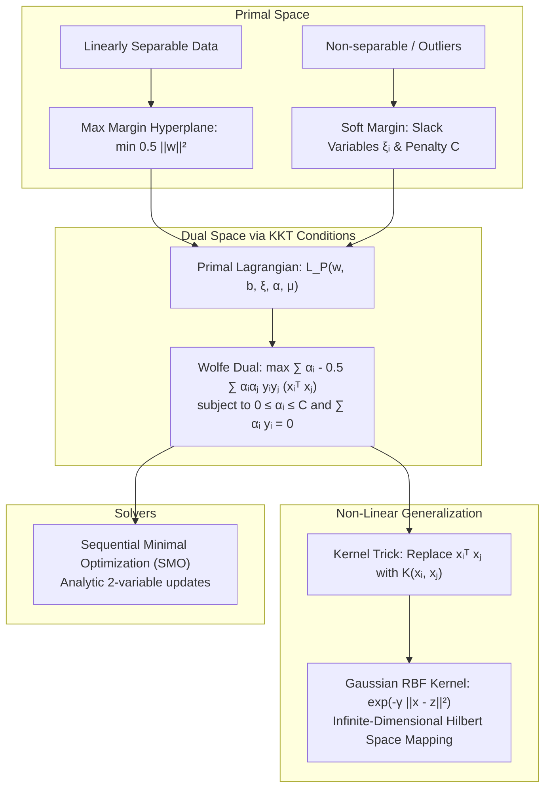
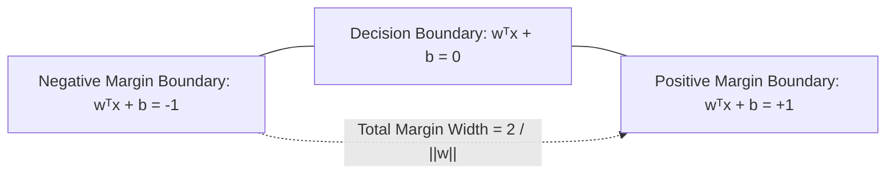
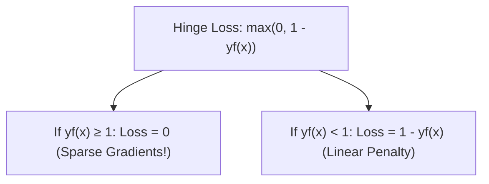
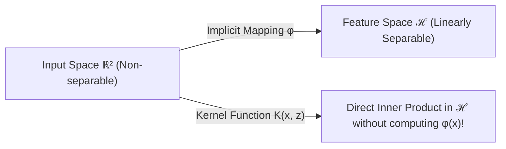
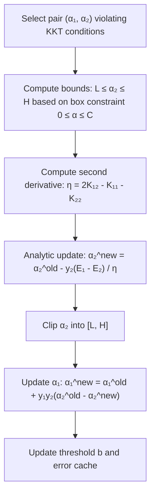

# Support Vector Machines — Duality, Kernels & SMO

!!! info "Prerequisites"
    Constrained optimization, Lagrangian multipliers, and Hilbert space inner products. Review [Linear Algebra](../02-mathematics/linear-algebra-deep-dive.md), [Calculus & Optimization](../02-mathematics/calculus-optimization-deep-dive.md), and [Linear Regression](linear-regression-deep-dive.md).

---

## 1. The Big Picture

Many linear classifiers (e.g., the Perceptron) find *any* arbitrary hyperplane that separates positive from negative training samples. However, an arbitrary hyperplane that passes microscopically close to a training instance has a narrow margin of safety, making it vulnerable to noise and generalization error.

**Support Vector Machines (SVM)**, developed by Vladimir Vapnik, identify the unique **Maximal Margin Hyperplane** that maximizes the geometric distance to the closest training points of either class. Furthermore, by formulating the problem through **Lagrangian Duality**, SVMs decouple the optimization algorithm from feature dimensionality, enabling non-linear classification in **infinite-dimensional feature spaces** via the **Kernel Trick**.



---

## 2. The Maximal Margin Hyperplane & Margins

### 2.1 Hyperplane Geometry

A linear separating hyperplane in $\mathbb{R}^p$ is defined as:

$$
\mathbf{w}^T \mathbf{x} + b = 0
$$

where $\mathbf{w} \in \mathbb{R}^p$ is the normal vector perpendicular to the hyperplane and $b \in \mathbb{R}$ is the intercept offset.
The decision rule for binary classification ($y \in \{-1, +1\}$) is:

$$
h(\mathbf{x}) = \text{sign}(\mathbf{w}^T \mathbf{x} + b)
$$

### 2.2 Functional vs. Geometric Margin

For a training sample $(\mathbf{x}_i, y_i)$:

1. **Functional Margin ($\hat{\gamma}_i$)**:
   $$\hat{\gamma}_i = y_i (\mathbf{w}^T \mathbf{x}_i + b)$$
   A positive functional margin implies correct classification. However, $\hat{\gamma}_i$ is scale-invariant: scaling $\mathbf{w} \to 2\mathbf{w}$ and $b \to 2b$ doubles $\hat{\gamma}_i$ without altering the physical hyperplane.

2. **Geometric Margin ($\gamma_i$)**:
   The Euclidean perpendicular distance from point $\mathbf{x}_i$ to the hyperplane:
   $$\gamma_i = \frac{y_i (\mathbf{w}^T \mathbf{x}_i + b)}{\|\mathbf{w}\|_2}$$
   The geometric margin is strictly invariant to parameter re-scaling.

The geometric margin of the dataset is the distance to the closest training sample:

$$
\gamma = \min_{i=1, \dots, n} \gamma_i
$$



The perpendicular distance between the two bounding margin planes ($\mathbf{w}^T \mathbf{x} + b = +1$ and $\mathbf{w}^T \mathbf{x} + b = -1$) is:

$$
\text{Margin Width} = \frac{2}{\|\mathbf{w}\|_2}
$$

Maximizing the margin width $\frac{2}{\|\mathbf{w}\|_2}$ is mathematically equivalent to minimizing $\frac{1}{2}\|\mathbf{w}\|_2^2$.

---

## 3. Hard & Soft Margin Formulations

### 3.1 Hard Margin SVM (Linearly Separable Data)

When the training data is strictly linearly separable:

$$
\min_{\mathbf{w}, b} \frac{1}{2} \|\mathbf{w}\|_2^2 \quad \text{subject to } y_i (\mathbf{w}^T \mathbf{x}_i + b) \ge 1, \quad \forall i \in \{1, \dots, n\}
$$

If a single outlier violates linear separability, the feasible set becomes empty, and hard-margin optimization fails completely.

### 3.2 Soft Margin SVM: Slack Variables & Penalty $C$

Cortes & Vapnik (1995) introduced non-negative **slack variables** $\xi_i \ge 0$ to tolerate margin violations:

$$
y_i (\mathbf{w}^T \mathbf{x}_i + b) \ge 1 - \xi_i, \quad \xi_i \ge 0
$$

- $\xi_i = 0$: Point lies on or outside the correct margin boundary (correctly classified).
- $0 < \xi_i \le 1$: Point violates the margin but lies on the correct side of the decision boundary.
- $\xi_i > 1$: Point crosses the decision boundary and is misclassified.

The **Soft Margin Optimization Problem** is:

$$
\min_{\mathbf{w}, b, \boldsymbol{\xi}} \frac{1}{2} \|\mathbf{w}\|_2^2 + C \sum_{i=1}^n \xi_i \quad \text{s.t. } y_i (\mathbf{w}^T \mathbf{x}_i + b) \ge 1 - \xi_i, \quad \xi_i \ge 0 \quad \forall i
$$

The hyperparameter $C > 0$ governs the trade-off between margin width and violation penalty:

- **Large $C$**: Heavy penalty on slack violations. Forces a narrow margin to minimize training errors (high variance, risk of overfitting).
- **Small $C$**: Tolerates many slack violations in exchange for a wider margin (high bias, robust to noise).

### 3.3 The Hinge Loss Perspective

Notice that the slack constraint requires $\xi_i \ge 1 - y_i f(\mathbf{x}_i)$. Since $\xi_i \ge 0$:

$$
\xi_i = \max(0, 1 - y_i f(\mathbf{x}_i)) \equiv \mathcal{L}_{\text{hinge}}(y_i, f(\mathbf{x}_i))
$$

The soft-margin SVM can be rewritten as unconstrained Empirical Risk Minimization with **Hinge Loss** and $L_2$ regularization:

$$
\min_{\mathbf{w}, b} \sum_{i=1}^n \max\left(0, 1 - y_i (\mathbf{w}^T \mathbf{x}_i + b)\right) + \frac{1}{2C} \|\mathbf{w}\|_2^2
$$



---

## 4. Primal to Dual Derivation & KKT Conditions

### 4.1 The Primal Lagrangian

To derive the dual, we introduce Lagrange multipliers $\alpha_i \ge 0$ for the margin constraints and $\mu_i \ge 0$ for the non-negativity constraints $\xi_i \ge 0$:

$$
\mathcal{L}_P(\mathbf{w}, b, \boldsymbol{\xi}, \boldsymbol{\alpha}, \boldsymbol{\mu}) = \frac{1}{2} \|\mathbf{w}\|_2^2 + C \sum_{i=1}^n \xi_i - \sum_{i=1}^n \alpha_i \left[ y_i (\mathbf{w}^T \mathbf{x}_i + b) - 1 + \xi_i \right] - \sum_{i=1}^n \mu_i \xi_i
$$

### 4.2 Karush-Kuhn-Tucker (KKT) Stationarity Conditions

Setting the partial derivatives with respect to the primal variables $(\mathbf{w}, b, \boldsymbol{\xi})$ to zero:

1. **Stationarity with respect to $\mathbf{w}$**:
   $$\nabla_{\mathbf{w}} \mathcal{L}_P = \mathbf{w} - \sum_{i=1}^n \alpha_i y_i \mathbf{x}_i = \mathbf{0} \implies \mathbf{w} = \sum_{i=1}^n \alpha_i y_i \mathbf{x}_i$$

2. **Stationarity with respect to $b$**:
   $$\frac{\partial \mathcal{L}_P}{\partial b} = -\sum_{i=1}^n \alpha_i y_i = 0 \implies \sum_{i=1}^n \alpha_i y_i = 0$$

3. **Stationarity with respect to $\xi_i$**:
   $$\frac{\partial \mathcal{L}_P}{\partial \xi_i} = C - \alpha_i - \mu_i = 0 \implies C = \alpha_i + \mu_i$$

Since $\mu_i \ge 0$ and $\alpha_i \ge 0$, this implies the **box constraint**:

$$
0 \le \alpha_i \le C
$$

### 4.3 KKT Complementary Slackness

The complementary slackness conditions at the global optimum are:

$$
\alpha_i \left[ y_i (\mathbf{w}^T \mathbf{x}_i + b) - 1 + \xi_i \right] = 0
$$

$$
\mu_i \xi_i = (C - \alpha_i) \xi_i = 0
$$

#### Three Distinct Regimes of Training Points:
1. **Non-Support Vectors ($\alpha_i = 0$)**:
   $y_i(\mathbf{w}^T \mathbf{x}_i + b) > 1$ and $\xi_i = 0$. The sample lies strictly outside the margin. It contributes **zero weight** to $\mathbf{w}$ and can be deleted from the dataset with zero effect on the model!

2. **Free Support Vectors on the Margin ($0 < \alpha_i < C$)**:
   Since $\alpha_i < C$, $\mu_i = C - \alpha_i > 0$, forcing $\xi_i = 0$.
   Therefore, $y_i(\mathbf{w}^T \mathbf{x}_i + b) = 1$. These points lie **exactly on the margin boundaries**. They uniquely determine the intercept $b$.

3. **Bounded Support Vectors Violating the Margin ($\alpha_i = C$)**:
   $\mu_i = 0$, so $\xi_i \ge 0$. The sample is either inside the margin or misclassified.

### 4.4 The Wolfe Dual Optimization Problem

Substituting $\mathbf{w} = \sum_{i=1}^n \alpha_i y_i \mathbf{x}_i$ and $\sum_{i=1}^n \alpha_i y_i = 0$ back into $\mathcal{L}_P$:

$$
\begin{aligned}
\mathcal{L}_D(\boldsymbol{\alpha}) &= \frac{1}{2} \left( \sum_{i=1}^n \alpha_i y_i \mathbf{x}_i \right)^T \left( \sum_{j=1}^n \alpha_j y_j \mathbf{x}_j \right) + C \sum_{i=1}^n \xi_i \\
&\quad - \sum_{i=1}^n \alpha_i y_i \left( \sum_{j=1}^n \alpha_j y_j \mathbf{x}_j^T \mathbf{x}_i \right) - b \sum_{i=1}^n \alpha_i y_i + \sum_{i=1}^n \alpha_i - \sum_{i=1}^n \alpha_i \xi_i - \sum_{i=1}^n \mu_i \xi_i \\
&= \frac{1}{2} \sum_{i=1}^n \sum_{j=1}^n \alpha_i \alpha_j y_i y_j (\mathbf{x}_i^T \mathbf{x}_j) - \sum_{i=1}^n \sum_{j=1}^n \alpha_i \alpha_j y_i y_j (\mathbf{x}_i^T \mathbf{x}_j) + \sum_{i=1}^n \alpha_i \\
&\quad + \sum_{i=1}^n \xi_i (C - \alpha_i - \mu_i) \\
&= \sum_{i=1}^n \alpha_i - \frac{1}{2} \sum_{i=1}^n \sum_{j=1}^n \alpha_i \alpha_j y_i y_j (\mathbf{x}_i^T \mathbf{x}_j)
\end{aligned}
$$

The **Wolfe Dual Problem** is:

$$
\max_{\boldsymbol{\alpha}} \sum_{i=1}^n \alpha_i - \frac{1}{2} \sum_{i=1}^n \sum_{j=1}^n \alpha_i \alpha_j y_i y_j (\mathbf{x}_i^T \mathbf{x}_j)
$$

$$
\text{subject to } \quad 0 \le \alpha_i \le C \quad \forall i, \qquad \sum_{i=1}^n \alpha_i y_i = 0
$$

**Remarkable Property**: The data instances $\mathbf{x}_i$ appear **exclusively as inner products $\mathbf{x}_i^T \mathbf{x}_j$**!

---

## 5. The Kernel Trick & Mercer's Theorem

If data is not linearly separable in the original space $\mathbb{R}^p$, we map instances to a higher-dimensional Hilbert feature space $\mathcal{H}$ via non-linear mapping $\phi(\mathbf{x}): \mathbb{R}^p \to \mathcal{H}$.

Evaluating $\phi(\mathbf{x}_i)^T \phi(\mathbf{x}_j)$ directly in a billion-dimensional space is computationally impossible.
The **Kernel Trick** replaces the inner product with a closed-form bivariate **Kernel Function**:

$$
K(\mathbf{x}, \mathbf{z}) = \langle \phi(\mathbf{x}), \phi(\mathbf{z}) \rangle_{\mathcal{H}}
$$



### 5.1 Mercer's Theorem

A symmetric bivariate function $K: \mathcal{X} \times \mathcal{X} \to \mathbb{R}$ is a valid Mercer kernel if and only if for any finite set of points $\{\mathbf{x}_1, \dots, \mathbf{x}_n\}$, the resulting **Gram matrix** $K_{ij} = K(\mathbf{x}_i, \mathbf{x}_j)$ is **positive semi-definite**:

$$
\mathbf{c}^T K \mathbf{c} = \sum_{i=1}^n \sum_{j=1}^n c_i c_j K(\mathbf{x}_i, \mathbf{x}_j) \ge 0 \quad \forall \mathbf{c} \in \mathbb{R}^n
$$

### 5.2 Common Kernels

1. **Linear Kernel**: $K(\mathbf{x}, \mathbf{z}) = \mathbf{x}^T \mathbf{z}$
2. **Polynomial Kernel**: $K(\mathbf{x}, \mathbf{z}) = (\mathbf{x}^T \mathbf{z} + c)^d$
3. **Radial Basis Function (RBF / Gaussian) Kernel**:
   $$K(\mathbf{x}, \mathbf{z}) = \exp\left(-\gamma \|\mathbf{x} - \mathbf{z}\|_2^2\right), \quad \gamma > 0$$

### 5.3 Proof: The RBF Kernel Corresponds to an Infinite-Dimensional Space

Let $x, z \in \mathbb{R}$ with $\gamma = 1$. The Gaussian kernel is:

$$
K(x, z) = \exp(-(x - z)^2) = \exp(-x^2) \exp(-z^2) \exp(2xz)
$$

Using the Taylor series expansion of the exponential function $e^u = \sum_{k=0}^\infty \frac{u^k}{k!}$:

$$
\exp(2xz) = \sum_{k=0}^\infty \frac{(2xz)^k}{k!} = \sum_{k=0}^\infty \frac{2^k}{\sqrt{k!} \sqrt{k!}} x^k z^k
$$

Substituting this back into the kernel expression:

$$
\begin{aligned}
K(x, z) &= \exp(-x^2) \exp(-z^2) \sum_{k=0}^\infty \left( \sqrt{\frac{2^k}{k!}} x^k \right) \left( \sqrt{\frac{2^k}{k!}} z^k \right) \\
&= \sum_{k=0}^\infty \left( e^{-x^2} \sqrt{\frac{2^k}{k!}} x^k \right) \left( e^{-z^2} \sqrt{\frac{2^k}{k!}} z^k \right) \\
&= \langle \phi(x), \phi(z) \rangle
\end{aligned}
$$

where the feature mapping is an **infinite-dimensional vector**:

$$
\phi(x) = e^{-x^2} \begin{bmatrix} 1, & \sqrt{2} x, & \sqrt{\frac{2^2}{2!}} x^2, & \dots, & \sqrt{\frac{2^k}{k!}} x^k, & \dots \end{bmatrix}^T
$$

The RBF kernel computes the exact inner product in an **infinite-dimensional polynomial feature space** in $\mathcal{O}(p)$ time!

---

## 6. Sequential Minimal Optimization (SMO)

John Platt (1998) introduced **Sequential Minimal Optimization (SMO)**. Standard quadratic programming packages require storing the $n \times n$ kernel matrix, costing $\mathcal{O}(n^2)$ memory and $\mathcal{O}(n^3)$ flops.

SMO exploits the linear equality constraint $\sum_{i=1}^n \alpha_i y_i = 0$:

- We cannot update a single multiplier $\alpha_1$ alone, because $\alpha_1 = -\frac{1}{y_1}\sum_{i=2}^n \alpha_i y_i$ is completely locked.
- The smallest subproblem that can be optimized while satisfying the constraint involves **two Lagrange multipliers $(\alpha_1, \alpha_2)$ simultaneously**.



At every step, SMO solves the 2-variable quadratic programming subproblem **analytically** without numerical matrix inversion, converging orders of magnitude faster.

---

## 7. Implementation 1 — Vectorized Linear & RBF SVM via Subgradient Descent (NumPy)

Below is a complete, from-scratch implementation of an SVM supporting both Linear and RBF Kernels trained via vectorized Pegasos-style subgradient descent on the primal hinge loss.

```python
import numpy as np


class ScratchSVM:
    """
    Support Vector Machine trained via Subgradient Descent on Hinge Loss.
    Supports both Linear and RBF kernels.
    """
    def __init__(self, C=1.0, kernel='rbf', gamma=0.1, lr=0.01, max_iter=1000):
        self.C = float(C)
        self.kernel = kernel
        self.gamma = float(gamma)
        self.lr = lr
        self.max_iter = max_iter
        self.w = None
        self.b = 0.0
        self.alpha = None
        self.support_vectors_ = None
        self.support_vector_labels_ = None

    def _kernel_matrix(self, X1: np.ndarray, X2: np.ndarray) -> np.ndarray:
        if self.kernel == 'linear':
            return X1 @ X2.T
        elif self.kernel == 'rbf':
            # Pairwise squared Euclidean distance: ||x - z||^2 = ||x||^2 + ||z||^2 - 2 x^T z
            x1_sq = np.sum(X1 ** 2, axis=1, keepdims=True)
            x2_sq = np.sum(X2 ** 2, axis=1, keepdims=True)
            dists = x1_sq + x2_sq.T - 2.0 * (X1 @ X2.T)
            return np.exp(-self.gamma * np.maximum(dists, 0.0))
        else:
            raise ValueError(f"Unsupported kernel: {self.kernel}")

    def fit(self, X: np.ndarray, y: np.ndarray):
        n_samples, n_features = X.shape
        X = np.asarray(X, dtype=np.float64)
        # Convert labels to {-1, +1}
        y = np.where(y <= 0, -1.0, 1.0).astype(np.float64)

        if self.kernel == 'linear':
            # Primal subgradient descent for linear SVM
            w = np.zeros(n_features)
            b = 0.0

            for it in range(1, self.max_iter + 1):
                eta = self.lr / np.sqrt(it)
                margins = y * (X @ w + b)

                # Subgradient of hinge loss
                misclassified = margins < 1.0

                # Gradient w: (1 / C) * w - sum_{i: margin < 1} y_i x_i
                grad_w = (1.0 / self.C) * w - (X.T @ (y * misclassified))
                grad_b = -np.sum(y * misclassified)

                w -= eta * grad_w
                b -= eta * grad_b

            self.w = w
            self.b = b

        elif self.kernel == 'rbf':
            # Dual subgradient optimization over alpha
            K = self._kernel_matrix(X, X)
            alpha = np.zeros(n_samples)
            b = 0.0

            for it in range(1, self.max_iter + 1):
                eta = self.lr / np.sqrt(it)
                preds = (K @ (alpha * y)) + b
                margins = y * preds

                # Misclassified points violating margin
                violators = margins < 1.0

                # Dual subgradient updates
                alpha[violators] += eta * self.C
                alpha = np.clip(alpha, 0.0, self.C)

                b += eta * np.sum(y[violators])

            sv_mask = alpha > 1e-4
            self.alpha = alpha[sv_mask]
            self.support_vectors_ = X[sv_mask]
            self.support_vector_labels_ = y[sv_mask]
            self.b = b

        return self

    def decision_function(self, X: np.ndarray) -> np.ndarray:
        X = np.asarray(X, dtype=np.float64)
        if self.kernel == 'linear':
            return X @ self.w + self.b
        else:
            K_test = self._kernel_matrix(X, self.support_vectors_)
            return (K_test @ (self.alpha * self.support_vector_labels_)) + self.b

    def predict(self, X: np.ndarray) -> np.ndarray:
        scores = self.decision_function(X)
        return np.where(scores >= 0, 1, 0)
```

---

## 8. Implementation 2 — scikit-learn Benchmarking & Verification

```python
import numpy as np
from sklearn.svm import SVC
from sklearn.datasets import make_moons, make_classification
from sklearn.metrics import accuracy_score

# 1. Non-Linear Moon Dataset Benchmark (RBF Kernel)
X_m, y_m = make_moons(n_samples=300, noise=0.15, random_state=42)

scratch_svm = ScratchSVM(C=5.0, kernel='rbf', gamma=1.0, max_iter=2000, lr=0.05)
scratch_svm.fit(X_m, y_m)

sk_svm = SVC(C=5.0, kernel='rbf', gamma=1.0)
sk_svm.fit(X_m, y_m)

acc_scratch_rbf = accuracy_score(y_m, scratch_svm.predict(X_m))
acc_sk_rbf = accuracy_score(y_m, sk_svm.predict(X_m))
print(f"RBF Kernel Comparison — Scratch Acc: {acc_scratch_rbf:.4f} | Sklearn Acc: {acc_sk_rbf:.4f}")
assert abs(acc_scratch_rbf - acc_sk_rbf) < 0.05, "RBF SVM accuracy diverges from scikit-learn!"

# 2. Linearly Separable Benchmark (Linear Kernel)
X_l, y_l = make_classification(n_samples=300, n_features=4, n_informative=2, n_classes=2, random_state=42)
scratch_linear = ScratchSVM(C=1.0, kernel='linear', max_iter=1500, lr=0.01)
scratch_linear.fit(X_l, y_l)

sk_linear = SVC(C=1.0, kernel='linear')
sk_linear.fit(X_l, y_l)

acc_scratch_lin = accuracy_score(y_l, scratch_linear.predict(X_l))
acc_sk_lin = accuracy_score(y_l, sk_linear.predict(X_l))
print(f"Linear Kernel Comparison — Scratch Acc: {acc_scratch_lin:.4f} | Sklearn Acc: {acc_sk_lin:.4f}")
```

---

## 9. Common Errors & Production Debugging

### 9.1 Unscaled Features with RBF Kernel

The RBF kernel computes $K(\mathbf{x}, \mathbf{z}) = \exp(-\gamma \|\mathbf{x} - \mathbf{z}\|_2^2)$.
If feature $x_1$ spans $[0, 100,000]$ and $x_2$ spans $[0, 1]$, the squared distance is dominated by $x_1$. For any two distinct points, $\|\mathbf{x} - \mathbf{z}\|^2 \gg 10^8 \implies K(\mathbf{x}, \mathbf{z}) = \exp(-10^7) = 0$.
The Gram matrix collapses to the identity matrix ($K \approx I$), causing every training point to become its own isolated island (100% memorization on train, 50% random guessing on test).

**Remedy**: Always apply `StandardScaler` to zero-mean and unit-variance all features prior to fitting SVM.

### 9.2 The Gamma-C Interplay in RBF

In the RBF kernel:

- $\gamma$ controls the radius of influence of each support vector: $\sigma = \frac{1}{\sqrt{2\gamma}}$.
  - If $\gamma$ is excessively large: Each support vector has a tiny Gaussian bell. The decision boundary creates tight concentric bubbles around individual training points (extreme overfitting).
  - If $\gamma$ is excessively small: The Gaussian bell is nearly flat. The kernel behaves like a linear model (underfitting).
- Pairwise grid search across logarithmic scales ($\gamma \in [10^{-4}, 10^1], C \in [10^{-2}, 10^3]$) is strictly necessary.

### 9.3 Computational Bottleneck on Large Datasets ($n > 100,000$)

Kernel SVM solvers like LibSVM require $\mathcal{O}(n^2)$ memory to cache the Gram matrix and $\mathcal{O}(n^2 \text{ to } n^3)$ training time. Fitting an RBF SVM on $n = 500,000$ will hang or exhaust RAM.

**Remedy**: For large datasets, use **Linear SVM** via `LinearSVC` (LibLinear, $\mathcal{O}(n \cdot p)$) or use Random Fourier Features (`RBFSampler`) to approximate the RBF kernel via explicit linear features.

---

## 10. Staff-Level Interview Questions & Model Answers

### Q1: Derive the dual formulation of the soft-margin SVM from the primal Lagrangian using the Karush-Kuhn-Tucker (KKT) conditions.

**Model Answer:**
The primal soft-margin SVM problem is:
$$\min_{\mathbf{w}, b, \boldsymbol{\xi}} \frac{1}{2}\|\mathbf{w}\|_2^2 + C\sum_{i=1}^n \xi_i \quad \text{s.t. } y_i(\mathbf{w}^T \mathbf{x}_i + b) \ge 1 - \xi_i, \; \xi_i \ge 0$$
Forming the primal Lagrangian with multipliers $\alpha_i \ge 0$ and $\mu_i \ge 0$:
$$\mathcal{L}_P(\mathbf{w}, b, \boldsymbol{\xi}, \boldsymbol{\alpha}, \boldsymbol{\mu}) = \frac{1}{2}\|\mathbf{w}\|_2^2 + C\sum_{i=1}^n \xi_i - \sum_{i=1}^n \alpha_i \left[ y_i(\mathbf{w}^T \mathbf{x}_i + b) - 1 + \xi_i \right] - \sum_{i=1}^n \mu_i \xi_i$$
Setting partial derivatives with respect to primal variables to zero:

1. $\nabla_{\mathbf{w}} \mathcal{L}_P = \mathbf{w} - \sum_{i=1}^n \alpha_i y_i \mathbf{x}_i = \mathbf{0} \implies \mathbf{w} = \sum_{i=1}^n \alpha_i y_i \mathbf{x}_i$
2. $\frac{\partial \mathcal{L}_P}{\partial b} = -\sum_{i=1}^n \alpha_i y_i = 0 \implies \sum_{i=1}^n \alpha_i y_i = 0$
3. $\frac{\partial \mathcal{L}_P}{\partial \xi_i} = C - \alpha_i - \mu_i = 0 \implies C = \alpha_i + \mu_i$
Because $\mu_i \ge 0$, this enforces $0 \le \alpha_i \le C$.
Substituting $\mathbf{w}$ into $\mathcal{L}_P$:
$$\begin{aligned}
\mathcal{L}_D &= \frac{1}{2}\left(\sum_{i=1}^n \alpha_i y_i \mathbf{x}_i\right)^T \left(\sum_{j=1}^n \alpha_j y_j \mathbf{x}_j\right) + \sum_{i=1}^n \xi_i(C - \alpha_i - \mu_i) \\
&\quad - \sum_{i=1}^n \alpha_i y_i \left(\sum_{j=1}^n \alpha_j y_j \mathbf{x}_j^T \mathbf{x}_i\right) - b\sum_{i=1}^n \alpha_i y_i + \sum_{i=1}^n \alpha_i \\
&= \sum_{i=1}^n \alpha_i - \frac{1}{2}\sum_{i=1}^n \sum_{j=1}^n \alpha_i \alpha_j y_i y_j (\mathbf{x}_i^T \mathbf{x}_j)
\end{aligned}$$
Thus, the dual problem is:
$$\max_{\boldsymbol{\alpha}} \sum_{i=1}^n \alpha_i - \frac{1}{2}\sum_{i=1}^n \sum_{j=1}^n \alpha_i \alpha_j y_i y_j (\mathbf{x}_i^T \mathbf{x}_j) \quad \text{s.t. } 0 \le \alpha_i \le C, \; \sum_{i=1}^n \alpha_i y_i = 0$$

---

### Q2: Classify the three regimes of support vectors using the KKT complementary slackness conditions.

**Model Answer:**
The KKT complementary slackness conditions state:

1. $\alpha_i \left[ y_i(\mathbf{w}^T \mathbf{x}_i + b) - 1 + \xi_i \right] = 0$
2. $\mu_i \xi_i = (C - \alpha_i) \xi_i = 0$

This categorizes all training samples into three distinct regimes:

- **Case 1: $\alpha_i = 0$ (Non-Support Vectors)**:
  From condition 2, since $\alpha_i < C$, $\mu_i > 0 \implies \xi_i = 0$.
  From the primal constraint, $y_i(\mathbf{w}^T \mathbf{x}_i + b) \ge 1$. Since condition 1 is satisfied with $\alpha_i = 0$, $y_i(\mathbf{w}^T \mathbf{x}_i + b) > 1$.
  These samples lie strictly outside the margin on the correct side. They contribute nothing to the weight vector ($\mathbf{w} = \sum \alpha_i y_i \mathbf{x}_i$) and have zero influence on the decision boundary.

- **Case 2: $0 < \alpha_i < C$ (Free / Unbounded Support Vectors)**:
  Since $\alpha_i < C$, $\mu_i = C - \alpha_i > 0 \implies \xi_i = 0$.
  Since $\alpha_i > 0$, condition 1 requires $y_i(\mathbf{w}^T \mathbf{x}_i + b) - 1 + 0 = 0 \implies y_i(\mathbf{w}^T \mathbf{x}_i + b) = 1$.
  These points lie **exactly on the margin boundaries**. They physically anchor the separating slab and are used to solve for the intercept $b$.

- **Case 3: $\alpha_i = C$ (Bounded Support Vectors)**:
  Here $\mu_i = C - \alpha_i = 0$, so $\xi_i \ge 0$.
  Condition 1 requires $y_i(\mathbf{w}^T \mathbf{x}_i + b) = 1 - \xi_i$.
  These points violate the margin: if $0 < \xi_i \le 1$, they fall inside the margin band; if $\xi_i > 1$, they are misclassified.

---

### Q3: Prove that the Gaussian RBF kernel corresponds to an inner product in an infinite-dimensional Hilbert space.

**Model Answer:**
Let $\mathbf{x}, \mathbf{z} \in \mathbb{R}^p$ and consider the RBF kernel with $\gamma > 0$:
$$K(\mathbf{x}, \mathbf{z}) = \exp\left(-\gamma \|\mathbf{x} - \mathbf{z}\|_2^2\right) = \exp\left(-\gamma \|\mathbf{x}\|^2\right) \exp\left(-\gamma \|\mathbf{z}\|^2\right) \exp\left(2\gamma \mathbf{x}^T \mathbf{z}\right)$$
Expanding $\exp(2\gamma \mathbf{x}^T \mathbf{z})$ via its Maclaurin series:
$$\exp(2\gamma \mathbf{x}^T \mathbf{z}) = \sum_{k=0}^\infty \frac{(2\gamma)^k}{k!} (\mathbf{x}^T \mathbf{z})^k$$
For any integer power $k$, $(\mathbf{x}^T \mathbf{z})^k$ can be expressed as the inner product of all $k$-th degree monomial combinations of the coordinates of $\mathbf{x}$ and $\mathbf{z}$:
$$(\mathbf{x}^T \mathbf{z})^k = \langle \psi_k(\mathbf{x}), \psi_k(\mathbf{z}) \rangle$$
where $\psi_k(\mathbf{x})$ is a vector of dimension $\binom{p+k-1}{k}$ containing all degree-$k$ polynomial interactions.
Substituting this expansion back:
$$K(\mathbf{x}, \mathbf{z}) = \sum_{k=0}^\infty \left[ e^{-\gamma \|\mathbf{x}\|^2} \sqrt{\frac{(2\gamma)^k}{k!}} \psi_k(\mathbf{x}) \right]^T \left[ e^{-\gamma \|\mathbf{z}\|^2} \sqrt{\frac{(2\gamma)^k}{k!}} \psi_k(\mathbf{z}) \right]$$
Define the infinite-dimensional concatenation:
$$\phi(\mathbf{x}) = e^{-\gamma \|\mathbf{x}\|^2} \begin{bmatrix} 1, & \sqrt{2\gamma} \psi_1(\mathbf{x}), & \sqrt{\frac{(2\gamma)^2}{2!}} \psi_2(\mathbf{x}), & \dots, & \sqrt{\frac{(2\gamma)^k}{k!}} \psi_k(\mathbf{x}), & \dots \end{bmatrix}^T$$
Then:
$$K(\mathbf{x}, \mathbf{z}) = \langle \phi(\mathbf{x}), \phi(\mathbf{z}) \rangle_{\ell^2}$$
Since the sum contains terms for all $k \in \{0, 1, 2, \dots, \infty\}$, $\phi(\mathbf{x})$ is an element of $\ell^2$, the infinite-dimensional Hilbert space of square-summable sequences.

---

### Q4: Explain the Sequential Minimal Optimization (SMO) algorithm and why at least two Lagrange multipliers must be updated simultaneously.

**Model Answer:**
The dual SVM problem features a linear equality constraint:
$$\sum_{i=1}^n \alpha_i y_i = 0$$
Suppose we attempt coordinate ascent by choosing a single multiplier $\alpha_1$ while keeping $\alpha_2, \dots, \alpha_n$ fixed.
The constraint dictates:
$$\alpha_1 y_1 + \sum_{i=2}^n \alpha_i y_i = 0 \implies \alpha_1 = -y_1 \sum_{i=2}^n \alpha_i y_i$$
Because $y_1 \in \{-1, +1\}$ and all other $\alpha_i$ are fixed, $\alpha_1$ is strictly locked to a single constant value. It has zero degrees of freedom! It is mathematically impossible to update a single multiplier without violating the equality constraint.
Therefore, the smallest possible subproblem requires selecting **two multipliers $(\alpha_1, \alpha_2)$ simultaneously**.
Let $\alpha_1 y_1 + \alpha_2 y_2 = \zeta$, where $\zeta = -\sum_{i=3}^n \alpha_i y_i$ is constant.
Then $\alpha_1 = y_1 (\zeta - \alpha_2 y_2)$.
Substituting this linear relationship into the dual objective reduces it to a **univariate quadratic function of $\alpha_2$ alone**:
$$f(\alpha_2) = A \alpha_2^2 + B \alpha_2 + C$$
SMO differentiates $f(\alpha_2)$, solves for the unconstrained optimum $\alpha_2^{\text{new, unclipped}}$, clips it to the interval $[L, H]$ defined by the box constraints $0 \le \alpha_i \le C$, and solves for $\alpha_1^{\text{new}}$ via $\alpha_1^{\text{new}} = \alpha_1^{\text{old}} + y_1 y_2 (\alpha_2^{\text{old}} - \alpha_2^{\text{new}})$.
This is repeated iteratively using heuristic selection rules until all points satisfy the KKT conditions within tolerance.

---

### Q5: How is the intercept $b$ recovered from the dual solution using complementary slackness?

**Model Answer:**
Once the optimal dual multipliers $\boldsymbol{\alpha}^*$ have been found, the weight vector is $\mathbf{w}^* = \sum_{i=1}^n \alpha_i^* y_i \mathbf{x}_i$.
To determine the intercept $b$, we locate any **free support vector** $k$ satisfying $0 < \alpha_k^* < C$.
By KKT complementary slackness, for this point the slack variable is zero ($\xi_k = 0$) and the point lies precisely on the margin boundary:
$$y_k (\mathbf{w}^{*T} \mathbf{x}_k + b) = 1$$
Multiplying both sides by $y_k$ (since $y_k \in \{-1, +1\} \implies y_k^2 = 1$):
$$\mathbf{w}^{*T} \mathbf{x}_k + b = y_k \implies b = y_k - \mathbf{w}^{*T} \mathbf{x}_k$$
In terms of the kernel function:
$$b = y_k - \sum_{i \in \text{SV}} \alpha_i^* y_i K(\mathbf{x}_i, \mathbf{x}_k)$$
To maximize numerical stability against floating-point inaccuracies, production libraries average $b$ across all $M$ free support vectors:
$$b^* = \frac{1}{|S_{\text{free}}|} \sum_{k \in S_{\text{free}}} \left[ y_k - \sum_{i \in \text{SV}} \alpha_i^* y_i K(\mathbf{x}_i, \mathbf{x}_k) \right]$$

---

## 11. Mastery Ladder

- [ ] **L1:** You can write the hyperplane formula $\mathbf{w}^T \mathbf{x} + b = 0$ and state the decision rule.
- [ ] **L2:** You can define functional and geometric margins and prove why margin width is $\frac{2}{\|\mathbf{w}\|_2}$.
- [ ] **L3:** You can formulate the hard-margin and soft-margin primal quadratic programs with slack variables $\xi_i$.
- [ ] **L4:** You can express SVM as Hinge Loss minimization with $L_2$ regularization.
- [ ] **L5:** You can derive the stationarity conditions $\mathbf{w} = \sum \alpha_i y_i \mathbf{x}_i$ and $\sum \alpha_i y_i = 0$ from the Lagrangian.
- [ ] **L6:** You can derive the Wolfe Dual quadratic program and state its box constraints $0 \le \alpha_i \le C$.
- [ ] **L7:** You can classify points into non-support vectors, free support vectors, and bounded support vectors via KKT conditions.
- [ ] **L8:** You can state Mercer's theorem and prove that the RBF kernel maps to an infinite-dimensional Hilbert space.
- [ ] **L9:** You can explain why SMO must update two multipliers simultaneously and derive the analytic update.
- [ ] **L10:** You can implement an SVM from scratch in NumPy with both linear and RBF kernels and benchmark against scikit-learn.
