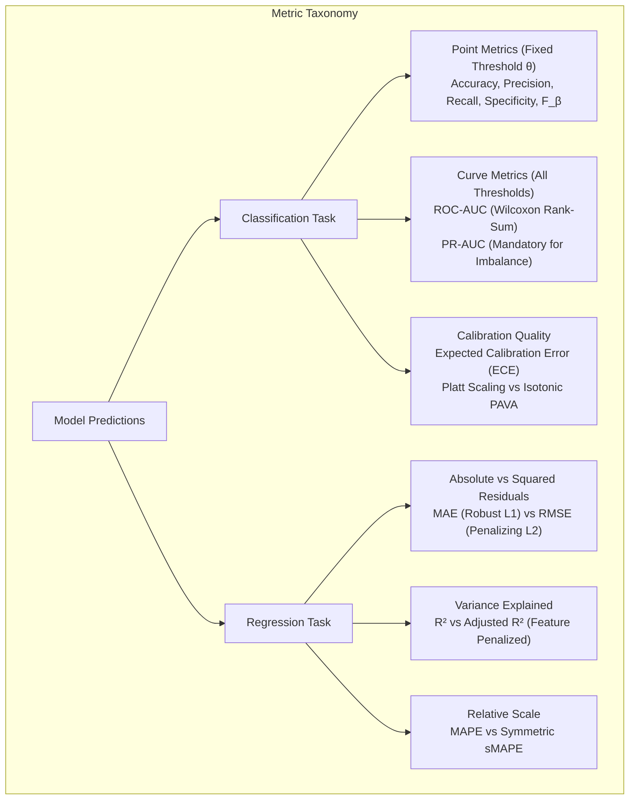
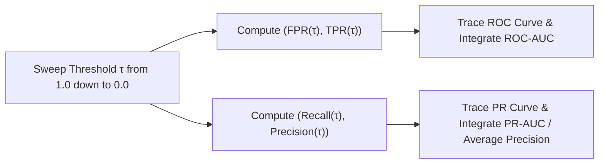
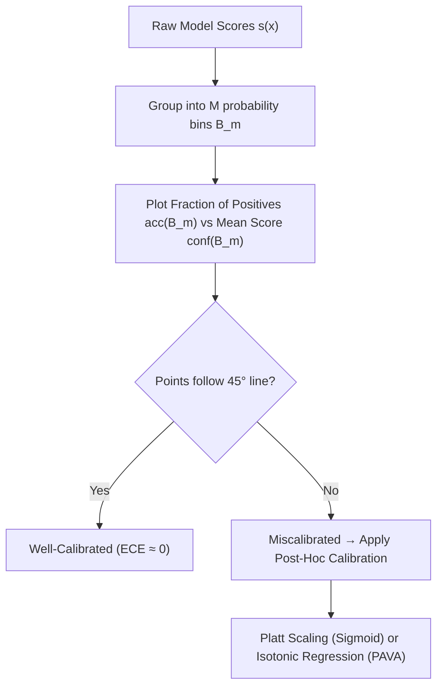

# Model Evaluation Metrics — ROC, PR-AUC, Calibration & Regression

!!! info "Prerequisites"
    Probability distributions, expectation, and classification thresholds. Review [Probability & Statistics](../02-mathematics/probability-statistics-deep-dive.md), [Model Validation & Generalization](model-validation-generalization-deep-dive.md), and [Linear Regression](../04-classical-ml/linear-regression-deep-dive.md).

---

## 1. The Big Picture

A machine learning algorithm optimizes an internal loss function (MSE, Cross-Entropy, Hinge Loss), but loss numbers do not directly reflect business utility, operational risk, or diagnostic validity.

Choosing an improper evaluation metric is one of the most frequent causes of catastrophic failure in production AI systems. A fraud model boasting $99.9\%$ accuracy may fail to detect a single real transaction theft; a medical diagnostic tool with high ROC-AUC may flood doctors with thousands of false alarms because the underlying class prevalence is tiny.

Evaluation metrics form a rigorous hierarchy across three primary domains:
1. **Classification Point Metrics**: Derived from the Confusion Matrix at a chosen decision threshold ($F_1, F_\beta$, Balanced Accuracy).
2. **Threshold-Agnostic Curve Metrics**: Evaluating discrimination across all possible operating thresholds (ROC-AUC, PR-AUC, Brier score).
3. **Probability Calibration**: Measuring whether predicted continuous probabilities reflect true empirical long-run frequencies (Reliability curves, ECE, Platt Scaling, Isotonic Regression).
4. **Regression Diagnostics**: Dissecting residual geometry, outlier vulnerability, and explanatory power ($R^2$, Adjusted $R^2$, MAE, RMSE, sMAPE).



---

## 2. Classification Point Metrics & The Confusion Matrix

### 2.1 The Confusion Matrix

For binary classification with ground truth $y \in \{0, 1\}$ and predicted binary class $\hat{y} \in \{0, 1\}$:

| | Predicted Positive ($\hat{y} = 1$) | Predicted Negative ($\hat{y} = 0$) | Total |
|---|---|---|---|
| **Actual Positive ($y = 1$)** | **True Positive (TP)** | **False Negative (FN)** (Type II Error) | $P = \text{TP} + \text{FN}$ |
| **Actual Negative ($y = 0$)** | **False Positive (FP)** (Type I Error) | **True Negative (TN)** | $N = \text{FP} + \text{TN}$ |
| **Total** | $\text{TP} + \text{FP}$ | $\text{FN} + \text{TN}$ | $n = P + N$ |

### 2.2 Point Metric Definitions

1. **Accuracy**:
   $$\text{Accuracy} = \frac{\text{TP} + \text{TN}}{\text{TP} + \text{TN} + \text{FP} + \text{FN}}$$
   *Hazard*: Deceptively inflated under class imbalance ($P \ll N$).
2. **Precision (Positive Predictive Value - PPV)**:
   $$\text{Precision} = \frac{\text{TP}}{\text{TP} + \text{FP}}$$
   "When the model predicts positive, how often is it right?" (Cost of false alarms).
3. **Recall (Sensitivity / True Positive Rate - TPR)**:
   $$\text{Recall} = \frac{\text{TP}}{\text{TP} + \text{FN}}$$
   "Out of all actual positive cases, how many did the model catch?" (Cost of misses).
4. **Specificity (True Negative Rate - TNR)**:
   $$\text{Specificity} = \frac{\text{TN}}{\text{TN} + \text{FP}} = 1 - \text{FPR}$$
5. **False Positive Rate (FPR / Fall-out)**:
   $$\text{FPR} = \frac{\text{FP}}{\text{FP} + \text{TN}} = 1 - \text{Specificity}$$

### 2.3 The $F_\beta$ Score: Derivation of Weighted Harmonic Mean

Why can't we simply take the arithmetic mean $\frac{\text{Precision} + \text{Recall}}{2}$?
Suppose a trivial classifier predicts positive for every single instance: $\text{Recall} = 1.0$, while $\text{Precision} = 0.01$. The arithmetic mean is $\frac{1.0 + 0.01}{2} = 0.505$, rewarding a useless model!

The **harmonic mean** of two numbers $x$ and $y$ is the reciprocal of the arithmetic mean of their reciprocals:

$$
H = \frac{2}{\frac{1}{x} + \frac{1}{y}} = \frac{2xy}{x + y}
$$

The harmonic mean approaches $0$ whenever *either* value approaches $0$. It strictly penalizes disparity between precision and recall.

To weight Recall $\beta$ times as heavily as Precision, we define the weighted harmonic mean:

$$
\frac{1 + \beta^2}{F_\beta} = \frac{1}{\text{Precision}} + \frac{\beta^2}{\text{Recall}}
$$

Solving for $F_\beta$:

$$
\frac{1 + \beta^2}{F_\beta} = \frac{\text{Recall} + \beta^2 \text{Precision}}{\text{Precision} \cdot \text{Recall}} \implies F_\beta = (1 + \beta^2) \frac{\text{Precision} \cdot \text{Recall}}{\beta^2 \text{Precision} + \text{Recall}}
$$

$$F_\beta = (1 + \beta^2) \frac{\text{Precision} \cdot \text{Recall}}{\beta^2 \text{Precision} + \text{Recall}}$$

- $\beta = 1 \implies F_1$: Equal weighting between Precision and Recall.
- $\beta = 2 \implies F_2$: Weights Recall twice as heavily as Precision (mandatory in cancer detection, malware screening).
- $\beta = 0.5 \implies F_{0.5}$: Weights Precision twice as heavily as Recall (search engine ranking, spam filtering).

---

## 3. Threshold-Agnostic Curve Metrics: ROC-AUC vs. PR-AUC

Rather than evaluating a single threshold ($\tau = 0.5$), curve metrics sweep $\tau \in [0, 1]$ across all possible decision boundaries.



### 3.1 ROC Curve & The Wilcoxon-Mann-Whitney Statistic

The **Receiver Operating Characteristic (ROC)** curve plots $\text{TPR}(\tau)$ against $\text{FPR}(\tau)$ for all thresholds $\tau \in [0, 1]$.
- A random guesser yields a diagonal line from $(0, 0)$ to $(1, 1)$ with $\text{AUC} = 0.5$.
- A perfect classifier achieves $\text{AUC} = 1.0$, passing through the top-left corner $(0, 1)$.

#### The Equivalence Theorem:
The Area Under the ROC Curve (ROC-AUC) is **mathematically identical to the probability that a randomly selected positive instance $x^+$ receives a higher predicted score than a randomly selected negative instance $x^-$**:

$$
\text{ROC-AUC} = P\left( \hat{s}(\mathbf{x}^+) > \hat{s}(\mathbf{x}^-) \right)
$$

For a dataset with $n_+$ positive samples and $n_-$ negative samples:

$$
\text{ROC-AUC} = \frac{1}{n_+ n_-} \sum_{i=1}^{n_+} \sum_{j=1}^{n_-} \mathbb{I}\left( \hat{s}(\mathbf{x}_i^+) > \hat{s}(\mathbf{x}_j^-) \right) = \frac{U}{n_+ n_-}
$$

where $U$ is the **Mann-Whitney $U$ statistic**! This can be computed in $\mathcal{O}(n \log n)$ time simply by sorting predictions and summing ranks.

### 3.2 PR-AUC & The Mathematical Failure of ROC on Imbalanced Data

Consider a fraud detection problem with $100$ fraudulent transactions ($P = 100$) and $1,000,000$ legitimate transactions ($N = 10^6$).
Suppose a model produces **10,000 False Positives** while capturing $90$ True Positives:
- **True Positive Rate (Recall)**: $\text{TPR} = \frac{90}{100} = 0.90$.
- **False Positive Rate**:
  $$\text{FPR} = \frac{\text{FP}}{N} = \frac{10,000}{1,000,000} = 0.01 \quad (1\%)$$
On the ROC curve, the point is at $(0.01, 0.90)$—extremely close to the top-left corner! The ROC-AUC will appear stellar ($\text{AUC} > 0.98$).

Now compute **Precision**:

$$
\text{Precision} = \frac{\text{TP}}{\text{TP} + \text{FP}} = \frac{90}{90 + 10,000} \approx 0.0089 \quad (0.89\%)
$$

**For every 1 real fraud caught, the system triggers 111 false alarms!**

#### Why ROC-AUC Fails and PR-AUC Succeeds:
$$\text{FPR} = \frac{\text{FP}}{\mathbf{N}} = \frac{\text{FP}}{\text{FP} + \text{TN}}, \qquad \text{Precision} = \frac{\text{TP}}{\text{TP} + \mathbf{FP}}$$

Because the denominator of FPR contains the total number of true negatives $N$, an astronomical $N$ violently suppresses FPR, masking thousands of false positives.
In contrast, Precision divides strictly by $\text{TP} + \text{FP}$. Any surge in false positives immediately collapses Precision.
**Production Rule**: Whenever classes are severely imbalanced ($P / N \le 0.05$), ROC-AUC is mathematically uninformative. **Precision-Recall AUC (PR-AUC / Average Precision)** is strictly mandatory.

---

## 4. Probability Calibration: ECE, Platt Scaling & Isotonic Regression

A model can achieve a perfect ROC-AUC score of $1.0$ while producing completely uncalibrated probabilities (e.g., predicting scores $[0.9991, 0.9992, 0.9993]$ that rank classes perfectly but do not represent true probabilities).

A model is **well-calibrated** if among all instances assigned predicted probability $\hat{p} \approx 0.80$, exactly $80\%$ of them are truly positive:

$$
P(y = 1 \mid \hat{p}(\mathbf{x}) = p) = p \quad \forall p \in [0, 1]
$$



### 4.1 Expected Calibration Error (ECE)

To quantify calibration error across $M$ probability bins $B_1, \dots, B_M$ (typically $M = 10$ bins of width $0.1$):

1. Compute empirical accuracy within bin $B_m$:
   $$\text{acc}(B_m) = \frac{1}{|B_m|} \sum_{i \in B_m} y_i$$
2. Compute average predicted confidence within bin $B_m$:
   $$\text{conf}(B_m) = \frac{1}{|B_m|} \sum_{i \in B_m} \hat{p}_i$$
3. The **Expected Calibration Error (ECE)** is the weighted average absolute difference:
   $$\text{ECE} = \sum_{m=1}^M \frac{|B_m|}{n} \Big| \text{acc}(B_m) - \text{conf}(B_m) \Big|$$

### 4.2 Post-Hoc Calibration Algorithms

1. **Platt Scaling (Sigmoid Calibration)**:
   Fits a scalar logistic regression model on the uncalibrated model outputs $s(\mathbf{x})$:
   $$\hat{p}_{\text{calibrated}} = \frac{1}{1 + \exp\left( A \cdot s(\mathbf{x}) + B \right)}$$
   Parameters $A$ and $B$ are fit via Maximum Likelihood on an independent validation holdout set.
   *Best for*: Models whose uncalibrated scores produce an S-shaped reliability curve (e.g., SVM margin scores).
2. **Isotonic Regression (Non-Parametric)**:
   Fits a non-decreasing, non-parametric step function $m(s)$ minimizing squared error:
   $$\min_{m} \sum_{i=1}^n \left( y_i - m(s_i) \right)^2 \quad \text{subject to } m(s_i) \le m(s_j) \text{ whenever } s_i \le s_j$$
   Solved in $\mathcal{O}(n)$ time via the **Pool Adjacent Violators Algorithm (PAVA)**.
   *Best for*: Complex models with abundant validation data ($n > 1000$). Risk of overfitting on small validation sets.

---

## 5. Regression Metrics

Let $y_i$ denote the ground truth and $\hat{y}_i$ denote the model prediction for sample $i \in \{1, \dots, n\}$.
Let $e_i = y_i - \hat{y}_i$ denote the residual.

### 5.1 Absolute vs. Squared Residual Metrics

| Metric | Formula | Units | Sensitivity to Outliers |
|---|---|---|---|
| **Mean Squared Error (MSE)** | $\frac{1}{n} \sum_{i=1}^n (y_i - \hat{y}_i)^2$ | $y^2$ | Extremely high (squares large residuals) |
| **Root Mean Squared Error (RMSE)** | $\sqrt{\frac{1}{n} \sum_{i=1}^n (y_i - \hat{y}_i)^2}$ | Same as $y$ | High (penalizes large errors heavily) |
| **Mean Absolute Error (MAE)** | $\frac{1}{n} \sum_{i=1}^n \|y_i - \hat{y}_i\|$ | Same as $y$ | Linear / Robust ($L_1$ norm) |
| **Median Absolute Error (MedAE)** | $\text{median}(\|y_1 - \hat{y}_1\|, \dots, \|y_n - \hat{y}_n\|)$ | Same as $y$ | Completely immune to up to 50% outliers |

### 5.2 Coefficient of Determination ($R^2$) and Adjusted $R^2$

#### Ordinary $R^2$:
Measures the proportion of total variance in the dependent variable explained by the model:

$$
R^2 = 1 - \frac{\text{SS}_{\text{res}}}{\text{SS}_{\text{tot}}} = 1 - \frac{\sum_{i=1}^n (y_i - \hat{y}_i)^2}{\sum_{i=1}^n (y_i - \bar{y})^2}
$$

- $R^2 = 1.0$: Perfect predictions ($\text{SS}_{\text{res}} = 0$).
- $R^2 = 0.0$: The model performs no better than simply predicting the historical target mean $\bar{y}$.
- $R^2 < 0.0$: The model is **worse than predicting the mean**! (Common on unseen test data when models overfit).

#### The Pathology of $R^2$:
Adding an arbitrary random noise feature to a linear model **never decreases $R^2$**; by chance, least squares will assign a tiny non-zero weight to the noise feature, mechanically reducing training $\text{SS}_{\text{res}}$.

#### Adjusted $R^2$:
Corrects for model parameter count $p$ using unbiased sample variance estimators:

$$
R_{\text{adj}}^2 = 1 - \frac{\text{SS}_{\text{res}} / (n - p - 1)}{\text{SS}_{\text{tot}} / (n - 1)} = 1 - \left( \frac{1 - R^2}{n - p - 1} \right) (n - 1)
$$

$$R_{\text{adj}}^2 = 1 - (1 - R^2) \frac{n - 1}{n - p - 1}$$

If a newly added feature does not reduce $\text{SS}_{\text{res}}$ enough to offset the loss of one degree of freedom in the denominator $(n - p - 1)$, $R_{\text{adj}}^2$ **strictly decreases**.

### 5.3 Percentage Metrics: MAPE and Symmetric sMAPE

#### Mean Absolute Percentage Error (MAPE):
$$
\text{MAPE} = \frac{100\%}{n} \sum_{i=1}^n \left| \frac{y_i - \hat{y}_i}{y_i} \right|
$$

**Critical Flaws of MAPE**:
1. **Division by Zero**: If any actual target $y_i = 0$, MAPE is undefined ($\infty$).
2. **Asymmetry**: Over-predictions are punished much more leniently than under-predictions.
   - If true $y = 100$ and $\hat{y} = 200 \implies \text{Error} = |100 - 200| / 100 = 100\%$.
   - If true $y = 100$ and $\hat{y} = 0 \implies \text{Error} = |100 - 0| / 100 = 100\%$ (maximum penalty for zero prediction is 100%, but over-prediction is unbounded!).

#### Symmetric MAPE (sMAPE):
Bounds percentage errors in $[0\%, 200\%]$ by averaging the actual and predicted values in the denominator:

$$
\text{sMAPE} = \frac{100\%}{n} \sum_{i=1}^n \frac{|y_i - \hat{y}_i|}{(|y_i| + |\hat{y}_i|) / 2} = \frac{200\%}{n} \sum_{i=1}^n \frac{|y_i - \hat{y}_i|}{|y_i| + |\hat{y}_i|}
$$

---

## 6. Implementation 1 — Vectorized Metric Engine & Calibration from Scratch (NumPy)

Let us implement a comprehensive evaluation suite from scratch: point metrics, Mann-Whitney ROC-AUC, Expected Calibration Error, and regression metrics.

```python
import numpy as np


class ScratchMetrics:
    """Vectorized calculation of classification, curve, and regression metrics."""

    @staticmethod
    def confusion_matrix(y_true: np.ndarray, y_pred: np.ndarray):
        """Computes [[TN, FP], [FN, TP]] for binary classification."""
        y_true = np.asarray(y_true).astype(int)
        y_pred = np.asarray(y_pred).astype(int)

        tp = np.sum((y_true == 1) & (y_pred == 1))
        tn = np.sum((y_true == 0) & (y_pred == 0))
        fp = np.sum((y_true == 0) & (y_pred == 1))
        fn = np.sum((y_true == 1) & (y_pred == 0))
        return np.array([[tn, fp], [fn, tp]])

    @classmethod
    def f_beta_score(cls, y_true: np.ndarray, y_pred: np.ndarray, beta: float = 1.0) -> float:
        cm = cls.confusion_matrix(y_true, y_pred)
        tn, fp, fn, tp = cm[0, 0], cm[0, 1], cm[1, 0], cm[1, 1]

        precision = tp / (tp + fp) if (tp + fp) > 0 else 0.0
        recall = tp / (tp + fn) if (tp + fn) > 0 else 0.0

        if precision + recall == 0.0:
            return 0.0

        beta_sq = beta ** 2
        return (1.0 + beta_sq) * (precision * recall) / (beta_sq * precision + recall)

    @staticmethod
    def roc_auc_score(y_true: np.ndarray, y_scores: np.ndarray) -> float:
        """
        Computes ROC-AUC in O(n log n) via the Wilcoxon-Mann-Whitney rank-sum statistic:
        AUC = (sum(ranks of positive samples) - n_pos * (n_pos + 1) / 2) / (n_pos * n_neg)
        """
        y_true = np.asarray(y_true)
        y_scores = np.asarray(y_scores)

        pos_mask = y_true == 1
        n_pos = np.sum(pos_mask)
        n_neg = len(y_true) - n_pos

        if n_pos == 0 or n_neg == 0:
            return 0.5

        # Rank predictions with tie-breaking
        order = np.argsort(y_scores)
        ranks = np.empty_like(order, dtype=float)
        ranks[order] = np.arange(1, len(y_scores) + 1)

        # Handle ties by assigning average rank
        unique_scores, counts = np.unique(y_scores, return_counts=True)
        for score, count in zip(unique_scores, counts):
            if count > 1:
                mask = y_scores == score
                ranks[mask] = np.mean(ranks[mask])

        rank_sum_pos = np.sum(ranks[pos_mask])
        u_stat = rank_sum_pos - (n_pos * (n_pos + 1)) / 2.0
        return float(u_stat / (n_pos * n_neg))

    @staticmethod
    def expected_calibration_error(y_true: np.ndarray, y_probs: np.ndarray, n_bins: int = 10) -> float:
        """Computes Expected Calibration Error (ECE) across uniform probability bins."""
        y_true = np.asarray(y_true)
        y_probs = np.asarray(y_probs)
        n_samples = len(y_true)

        bin_boundaries = np.linspace(0.0, 1.0, n_bins + 1)
        ece = 0.0

        for i in range(n_bins):
            bin_lower = bin_boundaries[i]
            bin_upper = bin_boundaries[i + 1]

            in_bin = (y_probs > bin_lower) & (y_probs <= bin_upper) if i > 0 else (y_probs >= bin_lower) & (y_probs <= bin_upper)
            bin_size = np.sum(in_bin)

            if bin_size > 0:
                acc_in_bin = np.mean(y_true[in_bin])
                conf_in_bin = np.mean(y_probs[in_bin])
                ece += (bin_size / n_samples) * abs(acc_in_bin - conf_in_bin)

        return float(ece)

    @staticmethod
    def r2_score(y_true: np.ndarray, y_pred: np.ndarray) -> float:
        ss_res = np.sum((y_true - y_pred) ** 2)
        ss_tot = np.sum((y_true - np.mean(y_true)) ** 2)
        return float(1.0 - (ss_res / ss_tot))

    @classmethod
    def adjusted_r2_score(cls, y_true: np.ndarray, y_pred: np.ndarray, n_features: int) -> float:
        r2 = cls.r2_score(y_true, y_pred)
        n = len(y_true)
        return float(1.0 - (1.0 - r2) * (n - 1) / (n - n_features - 1))
```

---

## 7. Implementation 2 — scikit-learn Benchmarking & Verification

```python
import numpy as np
from sklearn.metrics import confusion_matrix, f1_score, fbeta_score, roc_auc_score, r2_score
from sklearn.calibration import calibration_curve

# 1. Classification & ROC-AUC Benchmark
np.random.seed(42)
y_true_cls = np.random.choice([0, 1], size=500, p=[0.7, 0.3])
raw_scores = np.random.normal(loc=y_true_cls * 1.5, scale=1.0)
y_probs = 1.0 / (1.0 + np.exp(-raw_scores))
y_pred_cls = (y_probs >= 0.5).astype(int)

# Verify Confusion Matrix
cm_scratch = ScratchMetrics.confusion_matrix(y_true_cls, y_pred_cls)
cm_sk = confusion_matrix(y_true_cls, y_pred_cls)
assert np.array_equal(cm_scratch, cm_sk), "Confusion matrix diverges from scikit-learn!"

# Verify F_beta Score
f2_scratch = ScratchMetrics.f_beta_score(y_true_cls, y_pred_cls, beta=2.0)
f2_sk = fbeta_score(y_true_cls, y_pred_cls, beta=2.0)
assert abs(f2_scratch - f2_sk) < 1e-6, "F2 score diverges from scikit-learn!"

# Verify Wilcoxon Rank-Sum ROC-AUC
auc_scratch = ScratchMetrics.roc_auc_score(y_true_cls, y_probs)
auc_sk = roc_auc_score(y_true_cls, y_probs)
print(f"ROC-AUC — Scratch (Wilcoxon Rank-Sum): {auc_scratch:.6f} | Sklearn: {auc_sk:.6f}")
assert abs(auc_scratch - auc_sk) < 1e-5, "ROC-AUC diverges from scikit-learn!"

# Verify ECE
ece = ScratchMetrics.expected_calibration_error(y_true_cls, y_probs, n_bins=10)
print(f"Expected Calibration Error (ECE): {ece:.4f}")

# 2. Regression R² and Adjusted R² Benchmark
y_true_reg = np.array([3.0, -0.5, 2.0, 7.0, 4.2])
y_pred_reg = np.array([2.5, 0.0, 2.1, 7.8, 3.9])
r2_scratch = ScratchMetrics.r2_score(y_true_reg, y_pred_reg)
r2_sk = r2_score(y_true_reg, y_pred_reg)
print(f"Regression R² — Scratch: {r2_scratch:.6f} | Sklearn: {r2_sk:.6f}")
assert abs(r2_scratch - r2_sk) < 1e-6, "R2 diverges from scikit-learn!"
```

---

## 8. Common Errors & Production Debugging

### 8.1 Macro vs. Micro vs. Weighted Averaging in Multiclass

When extending binary metrics to multi-class classification ($K$ classes):
- **Micro Average**: Pools total global TPs, FPs, and FNs across all classes:
  $$\text{Precision}_{\text{micro}} = \frac{\sum_{k=1}^K \text{TP}_k}{\sum_{k=1}^K (\text{TP}_k + \text{FP}_k)}$$
  *Property*: Micro-Precision, Micro-Recall, and Micro-$F_1$ are all **mathematically identical to overall Accuracy**!
- **Macro Average**: Computes the metric independently for each class and calculates the unweighted arithmetic mean:
  $$\text{Macro } F_1 = \frac{1}{K} \sum_{k=1}^K F_{1, k}$$
  Weights every class equally; gives massive influence to tiny rare classes.
- **Weighted Average**: Averages per-class metrics weighted by class support (sample count $N_k$).

### 8.2 Calculating Negative $R^2$ on Out-of-Sample Test Sets

Engineers are often shocked when their model produces an $R^2 = -0.42$ on test data.
**Root Cause**: $R^2 = 1 - \frac{\text{SS}_{\text{res}}}{\text{SS}_{\text{tot}}}$. If the model has overfit or the test distribution has shifted, the test residuals can easily be larger than the variance of the test data around its mean ($\text{SS}_{\text{res}} > \text{SS}_{\text{tot}}$). A negative $R^2$ is mathematically valid; it simply means your model is worse than a horizontal line predicting $\bar{y}_{\text{test}}$.

---

## 9. Staff-Level Interview Questions & Model Answers

### Q1: Prove that the area under the ROC curve (ROC-AUC) is mathematically equivalent to the Wilcoxon-Mann-Whitney ranking statistic: $P(\hat{s}(\mathbf{x}^+) > \hat{s}(\mathbf{x}^-))$.

**Model Answer:**
Let $f_1(s)$ and $f_0(s)$ be the probability density functions of the continuous predicted scores for positive ($y = 1$) and negative ($y = 0$) instances, respectively.
Let $F_1(s) = \int_{-\infty}^s f_1(t) dt$ and $F_0(s) = \int_{-\infty}^s f_0(t) dt$ be their cumulative distribution functions.
For a given decision threshold $\tau$:
- True Positive Rate: $\text{TPR}(\tau) = P(\hat{s} > \tau \mid y = 1) = 1 - F_1(\tau)$
- False Positive Rate: $\text{FPR}(\tau) = P(\hat{s} > \tau \mid y = 0) = 1 - F_0(\tau)$

The Area Under the ROC Curve is the integral of $\text{TPR}$ with respect to $\text{FPR}$:
$$\text{ROC-AUC} = \int_{0}^{1} \text{TPR} \, d(\text{FPR})$$
Using substitution $u = \text{FPR}(\tau) = 1 - F_0(\tau) \implies du = -f_0(\tau) d\tau$.
When $\tau = -\infty$, $\text{FPR} = 1$; when $\tau = \infty$, $\text{FPR} = 0$:
$$\text{ROC-AUC} = \int_{\infty}^{-\infty} [1 - F_1(\tau)] (-f_0(\tau) d\tau) = \int_{-\infty}^{\infty} [1 - F_1(\tau)] f_0(\tau) d\tau$$
Notice what the integral represents:
- $f_0(\tau) d\tau$ is the probability that a randomly drawn negative instance $\mathbf{x}^-$ has score equal to $\tau$.
- $1 - F_1(\tau) = P(\hat{s}(\mathbf{x}^+) > \tau)$ is the probability that an independently drawn positive instance $\mathbf{x}^+$ has score strictly greater than $\tau$.
Integrating over all possible values of $\tau$ evaluates the joint continuous expectation:
$$\int_{-\infty}^{\infty} P(\hat{s}(\mathbf{x}^+) > \tau) \cdot f_0(\tau) d\tau = P\left( \hat{s}(\mathbf{x}^+) > \hat{s}(\mathbf{x}^-) \right)$$
Thus, the ROC-AUC is precisely the probability that a classifier assigns a higher score to a randomly chosen positive sample than to a randomly chosen negative sample.

---

### Q2: Derive the $F_\beta$ metric from the weighted harmonic mean of Precision and Recall. Why does the arithmetic mean fail?

**Model Answer:**
Let $P = \text{Precision}$ and $R = \text{Recall}$.
The arithmetic mean $A = \frac{P + R}{2}$ fails as an operational metric because it exhibits **compensatory behavior**: a severe defect in one dimension can be completely compensated by the other. A model with $R = 1.0$ and $P = 0.0$ scores $0.50$, masking catastrophic failure.

To enforce that both metrics must simultaneously be high, we define $F_\beta$ as a weighted harmonic mean:
$$\frac{1}{F_\beta} = \frac{w_P}{P} + \frac{w_R}{R}$$
where weights satisfy $w_P + w_R = 1$.
To reflect that Recall is considered $\beta$ times as important as Precision, we set the relative ratio of their weights to $\frac{w_R}{w_P} = \beta^2$ (squaring preserves scale consistency with squared dimension of error):
$$w_R = \frac{\beta^2}{1 + \beta^2}, \qquad w_P = \frac{1}{1 + \beta^2}$$
Substituting these weights:
$$\frac{1}{F_\beta} = \frac{\frac{1}{1 + \beta^2}}{P} + \frac{\frac{\beta^2}{1 + \beta^2}}{R} = \frac{1}{1 + \beta^2} \left( \frac{1}{P} + \frac{\beta^2}{R} \right) = \frac{1}{1 + \beta^2} \left( \frac{R + \beta^2 P}{P \cdot R} \right)$$
Inverting both sides gives the exact $F_\beta$ formula:
$$F_\beta = (1 + \beta^2) \frac{P \cdot R}{\beta^2 P + R}$$

---

### Q3: Contrast Platt Scaling and Isotonic Regression for probability calibration. When should each be chosen?

**Model Answer:**
- **Platt Scaling:**
  *Mechanism:* A parametric approach that transforms raw model output scores $s(\mathbf{x})$ into calibrated probabilities via a 2-parameter logistic sigmoid:
  $$\hat{p} = \frac{1}{1 + \exp(As + B)}$$
  *Assumptions:* Assumes the uncalibrated scores follow an approximate Gaussian distribution within each class with equal variance, yielding a sigmoidal miscalibration profile.
  *Advantages:* Extremely robust against overfitting. Uses only 2 parameters ($A, B$), making it highly effective on tiny validation sets ($n < 500$).
  *Disadvantages:* Incapable of correcting non-sigmoidal distortion (e.g., multi-modal confidence errors produced by boosted decision trees).
- **Isotonic Regression:**
  *Mechanism:* A non-parametric piecewise-constant regression model that fits a monotonic step function $m(s)$ using the Pool Adjacent Violators Algorithm (PAVA).
  *Assumptions:* Only assumes **monotonicity**—that higher raw scores should correspond to higher empirical probabilities.
  *Advantages:* Completely flexible; can correct arbitrary monotonic distortions, making it ideal for GBDTs and Random Forests.
  *Disadvantages:* Prone to severe overfitting if the calibration dataset is small ($n < 1,000$). Can produce flat regions with identical probabilities.

---

### Q4: Derive Adjusted $R^2$ and explain why it can decrease when a new feature is added to a regression model.

**Model Answer:**
Ordinary $R^2$ is defined as:
$$R^2 = 1 - \frac{\text{SS}_{\text{res}}}{\text{SS}_{\text{tot}}}$$
where $\text{SS}_{\text{res}} = \sum_{i=1}^n (y_i - \hat{y}_i)^2$ and $\text{SS}_{\text{tot}} = \sum_{i=1}^n (y_i - \bar{y})^2$.
Notice that $\frac{\text{SS}_{\text{res}}}{n}$ and $\frac{\text{SS}_{\text{tot}}}{n}$ are biased estimators of the residual variance $\sigma^2$ and total population variance $\sigma_y^2$.
The **unbiased estimator** of residual variance in multiple regression with $p$ predictors and an intercept uses $n - p - 1$ degrees of freedom:
$$s_{\text{res}}^2 = \frac{\text{SS}_{\text{res}}}{n - p - 1}$$
The unbiased estimator of total variance uses $n - 1$ degrees of freedom:
$$s_{\text{tot}}^2 = \frac{\text{SS}_{\text{tot}}}{n - 1}$$
Adjusted $R^2$ is the ratio of these unbiased variance estimators:
$$R_{\text{adj}}^2 = 1 - \frac{s_{\text{res}}^2}{s_{\text{tot}}^2} = 1 - \frac{\text{SS}_{\text{res}} / (n - p - 1)}{\text{SS}_{\text{tot}} / (n - 1)} = 1 - \left(\frac{\text{SS}_{\text{res}}}{\text{SS}_{\text{tot}}}\right) \left(\frac{n - 1}{n - p - 1}\right)$$
Substituting $\frac{\text{SS}_{\text{res}}}{\text{SS}_{\text{tot}}} = 1 - R^2$:
$$R_{\text{adj}}^2 = 1 - (1 - R^2) \frac{n - 1}{n - p - 1}$$
**Why it can decrease:**
When an uninformative feature is added, $p$ increases by 1, reducing the denominator $(n - p - 1)$. The factor $\frac{n - 1}{n - p - 1} > 1$ inflates the subtracted penalty. If the reduction in $\text{SS}_{\text{res}}$ is smaller than the penalty imposed by losing one degree of freedom, $R_{\text{adj}}^2$ strictly drops. It penalizes non-informative feature expansion.

---

## 10. Mastery Ladder

- [ ] **L1:** You can construct a Confusion Matrix and define Accuracy, Precision, Recall, and Specificity.
- [ ] **L2:** You can derive the $F_\beta$ score formula from the weighted harmonic mean.
- [ ] **L3:** You can state the Wilcoxon-Mann-Whitney theorem for ROC-AUC: $P(\hat{s}(x^+) > \hat{s}(x^-))$.
- [ ] **L4:** You can explain mathematically why ROC-AUC fails under extreme class imbalance while PR-AUC succeeds.
- [ ] **L5:** You can calculate Expected Calibration Error (ECE) across reliability bins.
- [ ] **L6:** You can explain the mechanics of Platt Scaling and Isotonic Regression via PAVA.
- [ ] **L7:** You can define MSE, RMSE, MAE, and MedAE, explaining their trade-offs regarding outlier sensitivity.
- [ ] **L8:** You can derive Adjusted $R^2$ from unbiased variance degrees of freedom.
- [ ] **L9:** You can explain why MAPE is asymmetric and state the sMAPE formula.
- [ ] **L10:** You can implement a vectorized metric suite including rank-sum ROC-AUC and ECE from scratch in NumPy.
