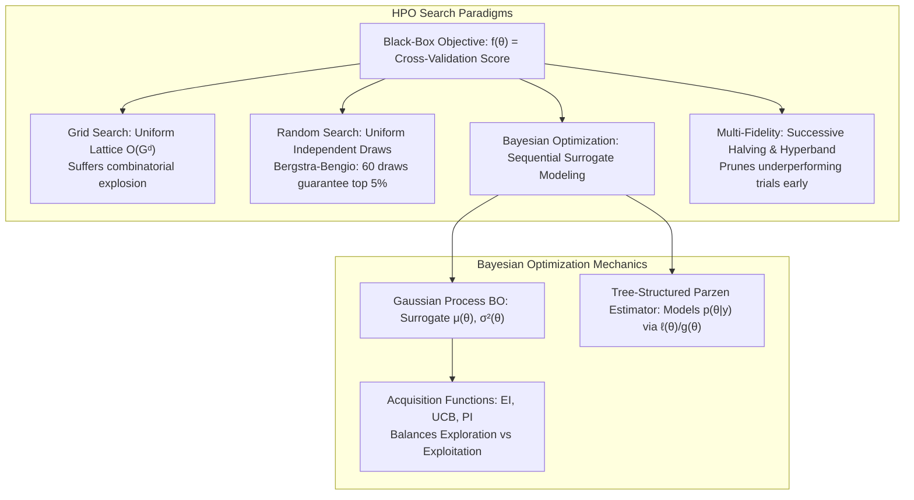
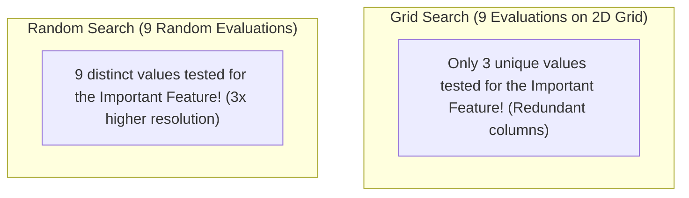
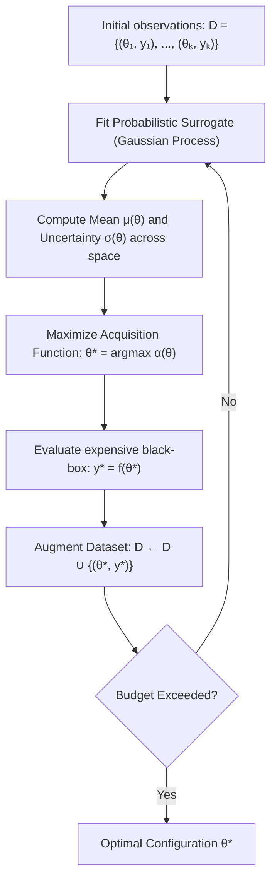
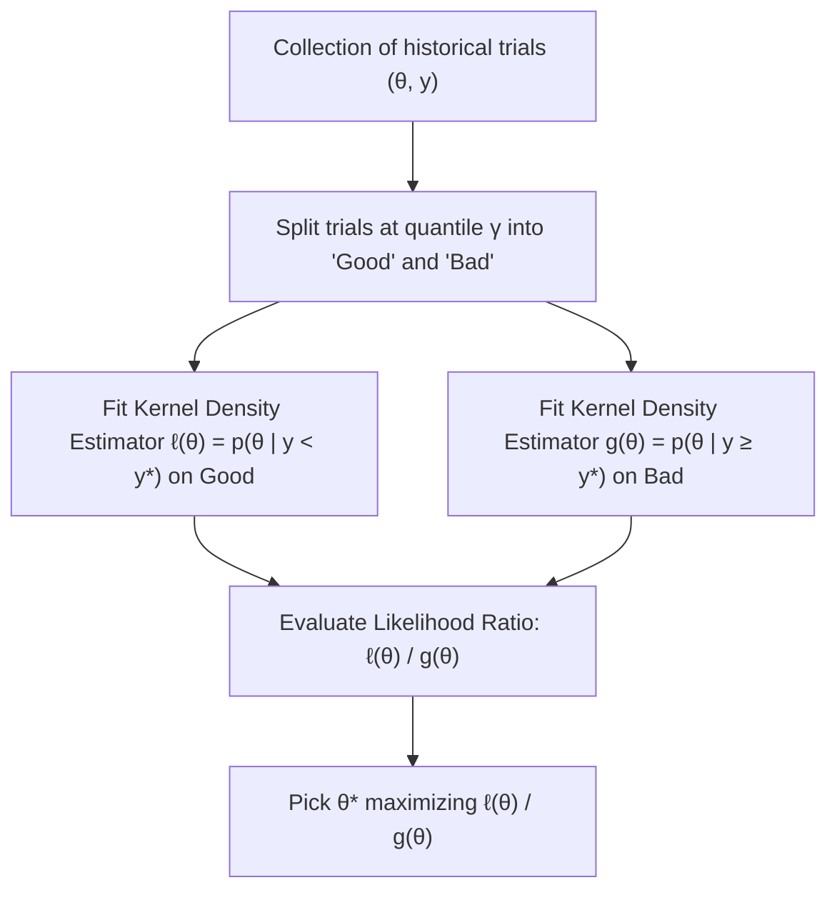
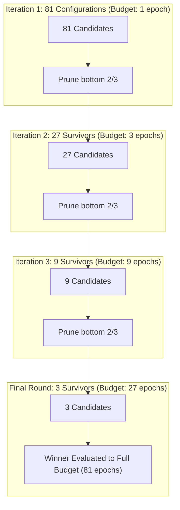

# Hyperparameter Optimization — Grid, Random, Bayesian & Optuna

!!! info "Prerequisites"
    Gaussian processes, multivariate normal distributions, and probability calculus. Review [Probability & Statistics](../02-mathematics/probability-statistics-deep-dive.md), [Calculus & Optimization](../02-mathematics/calculus-optimization-deep-dive.md), and [Model Validation & Generalization](model-validation-generalization-deep-dive.md).

---

## 1. The Big Picture

Machine learning models have two distinct tiers of parameters:
1. **Model Parameters ($\mathbf{w}, b$)**: Learned automatically during training by minimizing the loss function on the training dataset via gradient descent or closed-form equations.
2. **Hyperparameters ($\boldsymbol{\theta}$)**: Structural knobs chosen *before* training begins (learning rate $\eta$, regularization weight $\lambda$, tree depth $d$, kernel width $\gamma$, network layers).

Hyperparameter optimization (HPO) treats the entire training and cross-validation pipeline as a noisy, expensive **black-box function**:

$$
\boldsymbol{\theta}^* = \arg\max_{\boldsymbol{\theta} \in \Theta} f(\boldsymbol{\theta})
$$

Evaluating $f(\boldsymbol{\theta})$ requires training a complete model and calculating its holdout cross-validation score—an operation that costs minutes, hours, or thousands of dollars in GPU compute. HPO algorithms seek to find the global optimum $\boldsymbol{\theta}^*$ with the **minimum number of function evaluations**.



---

## 2. Grid Search vs. Random Search: The Bergstra-Bengio Proof

### 2.1 Grid Search & The Inefficiency of Low Effective Dimensionality

Grid Search evaluates a Cartesian product of predefined parameter values: $\Theta = G_1 \times G_2 \times \dots \times G_d$.
If each of $d$ hyperparameters is tested at $k$ distinct values, the total number of required training runs is:

$$
N_{\text{grid}} = k^d
$$

This exhibits severe **exponential combinatorial explosion** ($k = 10, d = 6 \implies 1,000,000$ model fits!).

Furthermore, Bergstra & Bengio (2012) proved that in real-world ML problems, **most hyperparameters have low effective dimensionality**—only a tiny subset (often 1 or 2, such as the learning rate) significantly drive model performance, while others (e.g., random seed or momentum) have negligible impact.



In a $3 \times 3$ grid where only the horizontal parameter matters, Grid Search tests only **3 unique values** of the important parameter, repeating each test 3 times redundantly. Random search with 9 evaluations tests **9 unique values** across the important dimension!

### 2.2 Mathematical Proof of Random Search Sample Complexity

Suppose we define the "top $q$" fraction of the search space as the region where $f(\boldsymbol{\theta})$ achieves near-optimal performance (e.g., $q = 0.05$, representing the top $5\%$).

Let $n$ independent and identically distributed random samples $\boldsymbol{\theta}_1, \dots, \boldsymbol{\theta}_n$ be drawn uniformly from $\Theta$.
The probability that a single random sample **misses** the top $q$ region is:

$$
P(\text{miss}) = 1 - q
$$

Because draws are independent, the probability that all $n$ random samples fail to land in the top $q$ region is:

$$
P(\text{all } n \text{ miss}) = (1 - q)^n
$$

The probability that **at least one** random sample lands in the top $q$ region is:

$$
P(\text{at least one success}) = 1 - (1 - q)^n
$$

To achieve a desired confidence level $1 - \delta$ (e.g., $95\%$ confidence, so $\delta = 0.05$):

$$
1 - (1 - q)^n \ge 1 - \delta \iff (1 - q)^n \le \delta
$$

Taking the natural logarithm on both sides:

$$
n \ln(1 - q) \le \ln(\delta) \implies n \ge \frac{\ln(\delta)}{\ln(1 - q)} \quad (\text{since } \ln(1-q) < 0)
$$

For $q = 0.05$ (top 5%) and $\delta = 0.05$ (95% confidence):

$$
n \ge \frac{\ln(0.05)}{\ln(1 - 0.05)} = \frac{-2.99573}{-0.05129} \approx 58.4 \implies n = 59
$$

$$n \ge \frac{\ln(\delta)}{\ln(1 - q)}$$

**Profound Insight**: **Exactly 60 random trials are guaranteed with 95% confidence to find a parameter configuration in the top 5% of the search space—completely independent of the dimensionality $d$!**

---

## 3. Bayesian Optimization & Gaussian Process Regressors

Random Search is memoryless: trial 60 ignores all successes and failures from trials 1 through 59.
**Bayesian Optimization (BO)** constructs a probabilistic **surrogate model** of the unknown objective function $f(\boldsymbol{\theta})$ and uses an **acquisition function** to actively balance **exploration** (searching uncertain regions) and **exploitation** (refining known high-performing regions).



### 3.1 The Gaussian Process (GP) Surrogate

A Gaussian Process is a collection of infinitely many random variables, any finite subset of which has a joint Gaussian distribution:

$$
f(\boldsymbol{\theta}) \sim \mathcal{GP}\left( m(\boldsymbol{\theta}), \, k(\boldsymbol{\theta}, \boldsymbol{\theta}') \right)
$$

Given previous observations $\mathcal{D}_{1:t} = \{(\boldsymbol{\theta}_i, y_i)\}_{i=1}^t$, the posterior predictive distribution at an unseen candidate point $\boldsymbol{\theta}$ is Gaussian:

$$
f(\boldsymbol{\theta}) \mid \mathcal{D}_{1:t} \sim \mathcal{N}\left( \mu(\boldsymbol{\theta}), \, \sigma^2(\boldsymbol{\theta}) \right)
$$

where:
- $\mu(\boldsymbol{\theta}) = \mathbf{k}^T (K + \sigma_{\text{noise}}^2 I)^{-1} \mathbf{y}$ (the expected performance).
- $\sigma^2(\boldsymbol{\theta}) = k(\boldsymbol{\theta}, \boldsymbol{\theta}) - \mathbf{k}^T (K + \sigma_{\text{noise}}^2 I)^{-1} \mathbf{k}$ (the epistemic model uncertainty).

---

## 4. Acquisition Functions: Formal Derivation of Expected Improvement (EI)

The acquisition function $\alpha(\boldsymbol{\theta})$ quantifies the expected utility of evaluating point $\boldsymbol{\theta}$.

### 4.1 Upper Confidence Bound (UCB)

Balances mean and uncertainty via a scalar trade-off parameter $\kappa \ge 0$:

$$
\alpha_{\text{UCB}}(\boldsymbol{\theta}) = \mu(\boldsymbol{\theta}) + \kappa \cdot \sigma(\boldsymbol{\theta})
$$

- $\kappa \to 0$: Pure exploitation (picks points with highest predicted mean).
- Large $\kappa$: Pure exploration (picks points with highest uncertainty).

### 4.2 Expected Improvement (EI) Derivation

Let $y^+ = \max_{i=1, \dots, t} y_i$ be the best observed target value so far.
The improvement function at an unevaluated point $\boldsymbol{\theta}$ is:

$$
I(\boldsymbol{\theta}) = \max\left( 0, \, f(\boldsymbol{\theta}) - y^+ - \xi \right)
$$

where $\xi \ge 0$ is a small exploration jitter parameter.
Because $f(\boldsymbol{\theta}) \sim \mathcal{N}(\mu, \sigma^2)$, let $y = f(\boldsymbol{\theta})$ and $\mu = \mu(\boldsymbol{\theta}), \sigma = \sigma(\boldsymbol{\theta})$.
The Expected Improvement is the expectation over the Gaussian density $p(y) = \frac{1}{\sqrt{2\pi}\sigma} \exp\left( -\frac{(y - \mu)^2}{2\sigma^2} \right)$:

$$
\text{EI}(\boldsymbol{\theta}) = \mathbb{E}[I(\boldsymbol{\theta})] = \int_{y^+ + \xi}^{\infty} (y - y^+ - \xi) \frac{1}{\sqrt{2\pi}\sigma} \exp\left( -\frac{(y - \mu)^2}{2\sigma^2} \right) dy
$$

Perform the standard normal substitution $z = \frac{y - \mu}{\sigma} \implies y = \mu + \sigma z, \; dy = \sigma dz$.
The lower limit of integration becomes:

$$
Z = \frac{\mu - y^+ - \xi}{\sigma}
$$

The integral transforms to:

$$
\begin{aligned}
\text{EI}(\boldsymbol{\theta}) &= \int_{-Z}^{\infty} (\mu + \sigma z - y^+ - \xi) \phi(z) dz \\
&= (\mu - y^+ - \xi) \int_{-Z}^{\infty} \phi(z) dz + \sigma \int_{-Z}^{\infty} z \phi(z) dz
\end{aligned}
$$

Evaluating both integrals:
1. By symmetry of the standard normal density $\phi(z)$:
   $$\int_{-Z}^{\infty} \phi(z) dz = \int_{-\infty}^{Z} \phi(z) dz = \Phi(Z)$$
2. Because $\phi'(z) = -z \phi(z)$, the second integrand is an exact derivative:
   $$\int_{-Z}^{\infty} z \phi(z) dz = \left[ -\phi(z) \right]_{-Z}^{\infty} = 0 - (-\phi(-Z)) = \phi(Z)$$

Combining both terms gives the celebrated **analytic Expected Improvement formula**:

$$
\text{EI}(\boldsymbol{\theta}) = (\mu(\boldsymbol{\theta}) - y^+ - \xi) \Phi(Z) + \sigma(\boldsymbol{\theta}) \phi(Z)
$$

where $\Phi(\cdot)$ and $\phi(\cdot)$ are the standard Gaussian CDF and PDF, and $Z = \frac{\mu(\boldsymbol{\theta}) - y^+ - \xi}{\sigma(\boldsymbol{\theta})}$.

$$\text{EI}(\boldsymbol{\theta}) = \underbrace{(\mu(\boldsymbol{\theta}) - y^+ - \xi) \Phi(Z)}_{\text{Exploitation Term: High predicted mean}} + \underbrace{\sigma(\boldsymbol{\theta}) \phi(Z)}_{\text{Exploration Term: High uncertainty}}$$

---

## 5. Tree-Structured Parzen Estimators (TPE) & Optuna

While Gaussian Processes provide elegant closed-form acquisition functions, they scale with cubic complexity $\mathcal{O}(t^3)$ in the number of trials and struggle with discrete, categorical, and conditional search spaces.

Bergstra et al. (2011) introduced the **Tree-structured Parzen Estimator (TPE)**, the default engine in modern frameworks like **Optuna**.



### 5.1 Inverting Bayes' Rule: Modeling $p(\boldsymbol{\theta} \mid y)$

Standard GP Bayesian optimization models the posterior $p(y \mid \boldsymbol{\theta})$ directly.
TPE inverts the modeling by estimating the density of hyperparameter configurations **conditioned on objective performance**:

$$
p(\boldsymbol{\theta} \mid y) = \begin{cases} \ell(\boldsymbol{\theta}) & \text{if } y < y^* \quad (\text{Top } \gamma \text{ percentile of trials}) \\ g(\boldsymbol{\theta}) & \text{if } y \ge y^* \quad (\text{Remaining trials}) \end{cases}
$$

where $y^*$ is chosen such that $P(y < y^*) = \gamma$ (typically $\gamma = 0.15$, targeting the best 15% of models).
$\ell(\boldsymbol{\theta})$ and $g(\boldsymbol{\theta})$ are modeled using Parzen window Kernel Density Estimation (KDE).

### 5.2 Proof: Maximizing EI is Equivalent to Maximizing the Likelihood Ratio $\frac{\ell(\boldsymbol{\theta})}{g(\boldsymbol{\theta})}$

Bergstra et al. proved that:

$$
\text{EI}(\boldsymbol{\theta}) = \int_{-\infty}^{y^*} (y^* - y) p(y \mid \boldsymbol{\theta}) dy = \frac{\gamma y^* \ell(\boldsymbol{\theta}) - \ell(\boldsymbol{\theta}) \int_{-\infty}^{y^*} P(y) dy}{\gamma \ell(\boldsymbol{\theta}) + (1 - \gamma) g(\boldsymbol{\theta})} \propto \left( \gamma + \frac{1 - \gamma}{\gamma} \frac{g(\boldsymbol{\theta})}{\ell(\boldsymbol{\theta})} \right)^{-1}
$$

Therefore:

$$
\arg\max_{\boldsymbol{\theta}} \text{EI}(\boldsymbol{\theta}) \equiv \arg\max_{\boldsymbol{\theta}} \frac{\ell(\boldsymbol{\theta})}{g(\boldsymbol{\theta})}
$$

$$\arg\max_{\boldsymbol{\theta}} \text{EI}(\boldsymbol{\theta}) \equiv \arg\max_{\boldsymbol{\theta}} \frac{\ell(\boldsymbol{\theta})}{g(\boldsymbol{\theta})}$$

**Intuitive Takeaway**: To maximize Expected Improvement, simply sample points that have **high probability of belonging to the top performing group $\ell(\boldsymbol{\theta})$** and **low probability of belonging to the bad group $g(\boldsymbol{\theta})$**!

---

## 6. Multi-Fidelity Optimization: Successive Halving & Hyperband

Evaluating every hyperparameter trial to full convergence (e.g., training a deep neural network for 200 epochs) is tremendously wasteful when poor configurations can be diagnosed after 5 epochs.
**Multi-Fidelity HPO** allocates small computational budgets (few epochs, small data subsets) to many candidates, progressively discarding underperformers.

### 6.1 Successive Halving (SHA)

1. Begin with $N$ configurations and evaluate each for budget $R$ (e.g., 2 epochs).
2. Rank all configurations; retain the top $1 / \eta$ fraction (typically $\eta = 3$).
3. Multiply the budget per surviving configuration by $\eta$ (e.g., 6 epochs).
4. Repeat until only the single best configuration reaches the maximum budget.

### 6.2 Hyperband: Resolving the Explore-Exploit Trade-off

Successive Halving requires picking initial trial count $N$ and minimum budget $R$:
- If $R$ is too small: Good configurations that learn slowly are discarded prematurely.
- If $R$ is too large: We cannot afford to explore many configurations $N$.

Li et al. (2018) developed **Hyperband**, which runs an outer loop over different trade-offs of $N$ vs. $R$, pairing pure random exploration with aggressive early stopping.
In Optuna, this is implemented natively via the `HyperbandPruner` and `MedianPruner`.



---

## 7. Implementation 1 — 1D Gaussian Process Expected Improvement Optimizer from Scratch (NumPy)

Let us implement a complete 1D Bayesian Optimizer backed by an analytical Gaussian Process regressor and Expected Improvement acquisition function in pure NumPy.

```python
import numpy as np


class ScratchGPRegressor:
    """Gaussian Process Regressor with RBF Kernel for 1D Bayesian Optimization."""
    def __init__(self, length_scale=1.0, noise_level=1e-4):
        self.l = length_scale
        self.noise = noise_level
        self.X_train = None
        self.y_train = None
        self.K_inv = None

    def _rbf_kernel(self, x1: np.ndarray, x2: np.ndarray) -> np.ndarray:
        dist_sq = (x1[:, None] - x2[None, :]) ** 2
        return np.exp(-0.5 * dist_sq / (self.l ** 2))

    def fit(self, X: np.ndarray, y: np.ndarray):
        self.X_train = np.asarray(X, dtype=np.float64).ravel()
        self.y_train = np.asarray(y, dtype=np.float64).ravel()
        K = self._rbf_kernel(self.X_train, self.X_train) + self.noise * np.eye(len(self.X_train))
        self.K_inv = np.linalg.inv(K)
        return self

    def predict(self, X_test: np.ndarray):
        X_test = np.asarray(X_test, dtype=np.float64).ravel()
        K_trans = self._rbf_kernel(X_test, self.X_train)
        K_test = self._rbf_kernel(X_test, X_test)

        # Posterior Mean: mu = K_* K^-1 y
        mu = K_trans @ self.K_inv @ self.y_train

        # Posterior Variance: sigma^2 = K_** - K_* K^-1 K_*^T
        var = np.diag(K_test - K_trans @ self.K_inv @ K_trans.T)
        sigma = np.sqrt(np.maximum(var, 1e-10))
        return mu, sigma


class ScratchBayesianOptimization:
    """Bayesian Optimization using Expected Improvement acquisition function."""
    def __init__(self, objective_fn, bounds=(0.0, 10.0), n_init=5, xi=0.01):
        self.obj = objective_fn
        self.bounds = bounds
        self.n_init = n_init
        self.xi = xi
        self.gp = ScratchGPRegressor(length_scale=1.5, noise_level=1e-5)
        self.X_history = []
        self.y_history = []

    @staticmethod
    def _phi(z):
        """Standard Normal PDF."""
        return np.exp(-0.5 * z ** 2) / np.sqrt(2.0 * np.pi)

    @staticmethod
    def _Phi(z):
        """Standard Normal CDF approximation (erf-based)."""
        from scipy.special import erf
        return 0.5 * (1.0 + erf(z / np.sqrt(2.0)))

    def _expected_improvement(self, X_candidates: np.ndarray) -> np.ndarray:
        mu, sigma = self.gp.predict(X_candidates)
        y_max = np.max(self.y_history)

        improvement = mu - y_max - self.xi
        Z = np.where(sigma > 1e-8, improvement / sigma, 0.0)

        ei = improvement * self._Phi(Z) + sigma * self._phi(Z)
        ei[sigma <= 1e-8] = 0.0
        return ei

    def optimize(self, n_iter=20):
        # Initial random evaluations
        init_X = np.random.uniform(self.bounds[0], self.bounds[1], size=self.n_init)
        for x in init_X:
            self.X_history.append(x)
            self.y_history.append(self.obj(x))

        # Optimization loop
        candidates = np.linspace(self.bounds[0], self.bounds[1], 1000)
        for step in range(n_iter):
            self.gp.fit(np.array(self.X_history), np.array(self.y_history))
            ei = self._expected_improvement(candidates)

            # Select candidate maximizing Expected Improvement
            best_x = candidates[np.argmax(ei)]

            self.X_history.append(best_x)
            self.y_history.append(self.obj(best_x))

        best_idx = np.argmax(self.y_history)
        return self.X_history[best_idx], self.y_history[best_idx]
```

---

## 8. Implementation 2 — Production Hyperparameter Tuning with Optuna & Scikit-Learn

Below is a production-grade hyperparameter optimization script using **Optuna (TPE engine)** with early stopping pruning, benchmarked against scikit-learn's `RandomizedSearchCV`.

```python
import numpy as np
from sklearn.datasets import make_classification
from sklearn.ensemble import HistGradientBoostingClassifier
from sklearn.model_selection import cross_val_score, StratifiedKFold
import optuna

# Suppress verbose Optuna logging in script
optuna.logging.set_verbosity(optuna.logging.WARNING)

# Generate synthetic dataset
X, y = make_classification(n_samples=1000, n_features=12, n_informative=8, random_state=42)

def objective(trial):
    # Suggest continuous parameter on log scale
    learning_rate = trial.suggest_float('learning_rate', 1e-3, 1.0, log=True)
    # Suggest integer parameters
    max_iter = trial.suggest_int('max_iter', 20, 200, step=10)
    max_leaf_nodes = trial.suggest_int('max_leaf_nodes', 15, 63)
    # Suggest continuous regularization
    l2_reg = trial.suggest_float('l2_regularization', 1e-5, 10.0, log=True)

    clf = HistGradientBoostingClassifier(
        learning_rate=learning_rate,
        max_iter=max_iter,
        max_leaf_nodes=max_leaf_nodes,
        l2_regularization=l2_reg,
        random_state=42
    )

    cv = StratifiedKFold(n_splits=3, shuffle=True, random_state=42)
    scores = cross_val_score(clf, X, y, cv=cv, scoring='accuracy')
    return float(np.mean(scores))

# Run Optuna Study using TPE Sampler and Median Pruning
study = optuna.create_study(
    direction='maximize',
    sampler=optuna.samplers.TPESampler(seed=42),
    pruner=optuna.pruners.MedianPruner()
)
study.optimize(objective, n_trials=30)

print(f"=== Optuna TPE Results ===")
print(f"Best Accuracy: {study.best_value:.4f}")
print(f"Best Parameters: {study.best_params}")
```

---

## 9. Common Errors & Production Debugging

### 9.1 Searching Exponential Knobs on a Linear Scale

Parameters like learning rate $\eta \in [10^{-4}, 10^{-1}]$ or regularization $\lambda \in [10^{-3}, 10^2]$ span several orders of magnitude.
If sampled uniformly on a linear scale $[0.0001, 0.1]$:
- $90\%$ of all random trials fall in $[0.01, 0.1]$.
- Only $1\%$ of trials test the critical small regime $[0.0001, 0.001]$!
**Fix**: Always configure `log=True` (in Optuna) or sample via `scipy.stats.loguniform`.

### 9.2 Tuning Hyperparameters on the Final Test Set (Data Snooping)

If you tune hyperparameters by maximizing score on the test set, information leaks from the test set into the hyperparameter selection. The model will overfit the test set, creating a dangerously biased estimate of production performance.
**Fix**: Always employ a 3-way split (Train / Validation / Test) or use **Nested Cross-Validation** (inner CV loop selects hyperparameters; outer CV loop assesses unbiased generalization error).

---

## 10. Staff-Level Interview Questions & Model Answers

### Q1: Prove Bergstra and Bengio's theorem on the sample complexity of Random Search. Why does it outperform Grid Search in high dimensions?

**Model Answer:**
Let the hyperparameter space be $\Theta \subset \mathbb{R}^d$. Suppose the true performance function $f(\boldsymbol{\theta})$ has a low effective dimensionality (only $d_{\text{eff}} \ll d$ dimensions materially impact $f$).
Define the optimal region $S^* \subset \Theta$ as the subset of parameters achieving performance in the top $q \in (0, 1)$ quantile of the entire distribution (e.g., $q = 0.05$). The volume ratio is $\frac{\text{Vol}(S^*)}{\text{Vol}(\Theta)} = q$.

If we evaluate $n$ independent random trials drawn uniformly from $\Theta$:
The probability that any single trial misses $S^*$ is $1 - q$.
Because draws are independent, the probability that all $n$ trials miss $S^*$ is $(1 - q)^n$.
Therefore, the probability that at least one trial lands in the top $q$ region is:
$$P(\text{success}) = 1 - (1 - q)^n$$
To achieve this with confidence $1 - \delta$:
$$1 - (1 - q)^n \ge 1 - \delta \implies (1 - q)^n \le \delta \implies n \ge \frac{\ln \delta}{\ln(1 - q)}$$
Notice that **the dimension $d$ does not appear anywhere in this formula!**
Evaluating $n = \frac{\ln(0.05)}{\ln(0.95)} \approx 59$ trials yields a 95% probability of discovering a top 5% model regardless of whether $d = 2$ or $d = 200$.
In contrast, Grid Search requires $k^d$ evaluations. If $d = 10$ and $k = 3$, Grid Search requires $3^{10} = 59,049$ runs, but evaluates only $3$ distinct values for any single feature along an axis, wasting $99.9\%$ of its compute evaluating duplicate projections.

---

### Q2: Derive the Expected Improvement (EI) acquisition function for Gaussian Process regression step-by-step.

**Model Answer:**
Let the best observed objective value so far be $y^+ = \max_{i=1, \dots, t} y_i$.
At an unevaluated candidate point $\boldsymbol{\theta}$, the GP surrogate predicts $y \sim \mathcal{N}(\mu, \sigma^2)$, where $\mu = \mu(\boldsymbol{\theta})$ and $\sigma = \sigma(\boldsymbol{\theta})$.
Define the Improvement utility function:
$$I(y) = \max(0, y - y^+ - \xi) = \begin{cases} y - y^+ - \xi & \text{if } y > y^+ + \xi \\ 0 & \text{otherwise} \end{cases}$$
The Expected Improvement is the expectation of $I(y)$ over the Gaussian density $p(y) = \frac{1}{\sqrt{2\pi}\sigma} \exp\left(-\frac{(y - \mu)^2}{2\sigma^2}\right)$:
$$\text{EI}(\boldsymbol{\theta}) = \int_{y^+ + \xi}^{\infty} (y - y^+ - \xi) \frac{1}{\sqrt{2\pi}\sigma} \exp\left(-\frac{(y - \mu)^2}{2\sigma^2}\right) dy$$
Substitute the standard normal variable $z = \frac{y - \mu}{\sigma} \implies y = \mu + \sigma z, \; dy = \sigma dz$.
The lower integration limit becomes $z_{\min} = \frac{y^+ + \xi - \mu}{\sigma} = -Z$, where $Z = \frac{\mu - y^+ - \xi}{\sigma}$.
The integral decomposes into two terms:
$$\text{EI}(\boldsymbol{\theta}) = \int_{-Z}^{\infty} (\mu - y^+ - \xi) \phi(z) dz + \sigma \int_{-Z}^{\infty} z \phi(z) dz$$
1. For the first term, by standard normal symmetry $\int_{-Z}^\infty \phi(z) dz = \int_{-\infty}^Z \phi(z) dz = \Phi(Z)$.
2. For the second term, using $\frac{d}{dz} \phi(z) = -z \phi(z)$:
   $$\int_{-Z}^{\infty} z \phi(z) dz = [-\phi(z)]_{-Z}^{\infty} = -\lim_{z \to \infty} \phi(z) - (-\phi(-Z)) = 0 + \phi(Z) = \phi(Z)$$
Combining both terms yields the closed-form analytic solution:
$$\text{EI}(\boldsymbol{\theta}) = (\mu(\boldsymbol{\theta}) - y^+ - \xi) \Phi(Z) + \sigma(\boldsymbol{\theta}) \phi(Z)$$

---

### Q3: How does the Tree-structured Parzen Estimator (TPE) algorithm work, and why is maximizing EI equivalent to maximizing $\frac{\ell(\boldsymbol{\theta})}{g(\boldsymbol{\theta})}$?

**Model Answer:**
Instead of modeling the conditional probability of performance given hyperparameters $p(y \mid \boldsymbol{\theta})$, TPE inverts the conditioning by estimating two densities over the hyperparameter space:
$$p(\boldsymbol{\theta} \mid y) = \begin{cases} \ell(\boldsymbol{\theta}) & \text{if } y < y^* \\ g(\boldsymbol{\theta}) & \text{if } y \ge y^* \end{cases}$$
where $y^*$ is the $\gamma$-quantile of observed scores ($P(y < y^*) = \gamma$, typically $\gamma = 0.15$).
$\ell(\boldsymbol{\theta})$ is the density of "good" configurations, and $g(\boldsymbol{\theta})$ is the density of "bad" configurations.
By definition of conditional probability:
$$p(y \mid \boldsymbol{\theta}) = \frac{p(\boldsymbol{\theta} \mid y) p(y)}{p(\boldsymbol{\theta})} = \frac{p(\boldsymbol{\theta} \mid y) p(y)}{\gamma \ell(\boldsymbol{\theta}) + (1 - \gamma) g(\boldsymbol{\theta})}$$
The Expected Improvement is:
$$\text{EI}(\boldsymbol{\theta}) = \int_{-\infty}^{y^*} (y^* - y) p(y \mid \boldsymbol{\theta}) dy = \frac{\int_{-\infty}^{y^*} (y^* - y) \ell(\boldsymbol{\theta}) p(y) dy}{\gamma \ell(\boldsymbol{\theta}) + (1 - \gamma) g(\boldsymbol{\theta})}$$
Factoring $\ell(\boldsymbol{\theta})$ out of the numerator:
$$\text{EI}(\boldsymbol{\theta}) = \frac{\ell(\boldsymbol{\theta}) \cdot C}{\gamma \ell(\boldsymbol{\theta}) + (1 - \gamma) g(\boldsymbol{\theta})} = \frac{C}{\gamma + (1 - \gamma) \frac{g(\boldsymbol{\theta})}{\ell(\boldsymbol{\theta})}}$$
where $C = \int_{-\infty}^{y^*} (y^* - y) p(y) dy$ is a constant independent of $\boldsymbol{\theta}$.
Notice that $\text{EI}(\boldsymbol{\theta})$ is maximized when the denominator is minimized.
The denominator $\gamma + (1 - \gamma) \frac{g(\boldsymbol{\theta})}{\ell(\boldsymbol{\theta})}$ is minimized precisely when the ratio $\frac{g(\boldsymbol{\theta})}{\ell(\boldsymbol{\theta})}$ is minimized, which is equivalent to **maximizing the likelihood ratio $\frac{\ell(\boldsymbol{\theta})}{g(\boldsymbol{\theta})}$**.

---

### Q4: Contrast Gaussian Process Bayesian Optimization with Tree-structured Parzen Estimators.

**Model Answer:**
| Dimension | Gaussian Process BO | Tree-Structured Parzen Estimator (TPE) |
|---|---|---|
| **Underlying Approach** | Discriminative: Models $p(y \mid \boldsymbol{\theta})$ directly | Generative: Models $p(\boldsymbol{\theta} \mid y)$ via KDEs |
| **Computational Complexity** | $\mathcal{O}(t^3)$ matrix inversion (fails when $t > 500$) | $\mathcal{O}(t \log t)$ KDE evaluation (scales to 10,000+ trials) |
| **Search Space Flexibility** | Continuous Euclidean vectors only | Natively handles mixed continuous, integer, and categorical |
| **Conditional Spaces** | Very difficult to model tree-structured dependencies | Natively models conditional branches (`if model == 'rf'`) |
| **Sample Efficiency ($t < 50$)** | Extremely high; optimal for tiny sample budgets | Moderate; requires initial random seeds to fit KDEs |
| **Primary Frameworks** | BoTorch, GPyOpt, Scikit-Optimize | Optuna, Hyperopt |

---

### Q5: Explain the mechanics of Successive Halving (SHA) and Hyperband.

**Model Answer:**
- **Successive Halving (SHA):**
  Given a total budget and $N$ hyperparameter candidates:
  1. Allocate a minimum resource $r$ (e.g., 1 training epoch) to all $N$ configurations.
  2. Rank all $N$ configurations by validation score.
  3. Discard the bottom $1 - 1/\eta$ fraction (typically $\eta = 3$, pruning bottom 67%).
  4. Increase the resource allocation for survivors by factor $\eta$ (e.g., 3 epochs).
  5. Repeat until the final winning configuration reaches the maximum budget $R$.
  *Flaw:* If the initial minimum budget $r$ is too small, configurations that start slowly but have high asymptotic performance are discarded.
- **Hyperband:**
  Wraps SHA in an outer loop over different values of $N$ and $r$. It systematically tests various balances of the exploration-exploitation spectrum:
  - Bracket 0: Classic SHA with many configurations evaluated on tiny initial budgets (aggressive exploration).
  - Bracket $s$: Fewer configurations evaluated on larger initial budgets (safer exploitation).
  By hedging across multiple brackets, Hyperband guarantees that slow-converging models are not discarded while still pruning obvious failures rapidly.

---

## 11. Mastery Ladder

- [ ] **L1:** You can state the black-box HPO problem $\boldsymbol{\theta}^* = \arg\max_{\boldsymbol{\theta}} f(\boldsymbol{\theta})$.
- [ ] **L2:** You can explain the exponential explosion of Grid Search $k^d$ vs. Random Search.
- [ ] **L3:** You can prove Bergstra-Bengio's sample complexity theorem $n \ge \frac{\ln \delta}{\ln(1 - q)}$.
- [ ] **L4:** You can explain how Gaussian Processes model uncertainty via $\mu(\boldsymbol{\theta})$ and $\sigma^2(\boldsymbol{\theta})$.
- [ ] **L5:** You can state the UCB acquisition function and explain the role of $\kappa$.
- [ ] **L6:** You can mathematically derive the Expected Improvement (EI) formula step-by-step.
- [ ] **L7:** You can explain how TPE inverts Bayes' rule and prove why maximizing EI is equivalent to maximizing $\frac{\ell(\boldsymbol{\theta})}{g(\boldsymbol{\theta})}$.
- [ ] **L8:** You can explain Successive Halving and Hyperband multi-fidelity budgeting.
- [ ] **L9:** You can explain why log-scale sampling is mandatory for learning rate and regularization parameters.
- [ ] **L10:** You can implement a Gaussian Process Expected Improvement optimizer from scratch in NumPy and configure production Optuna studies.
