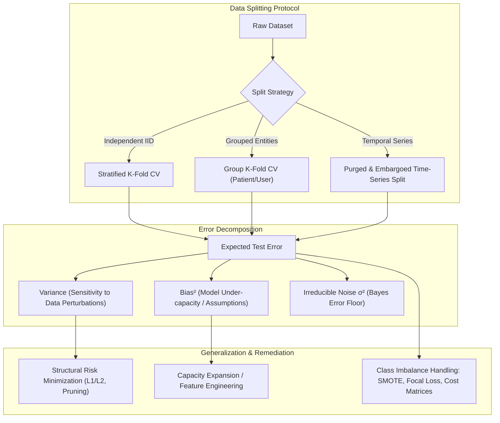
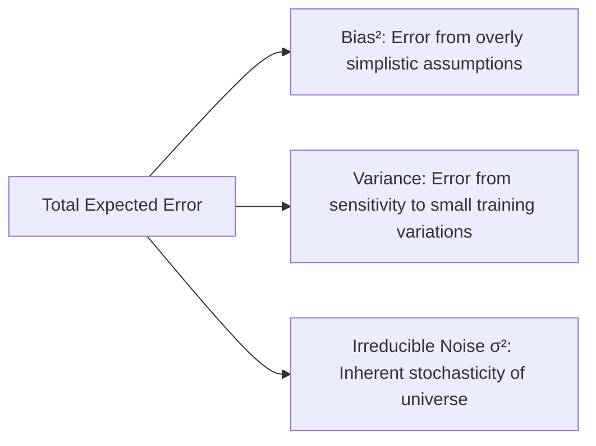
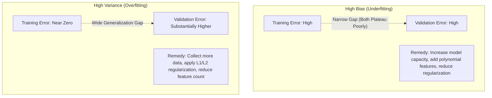
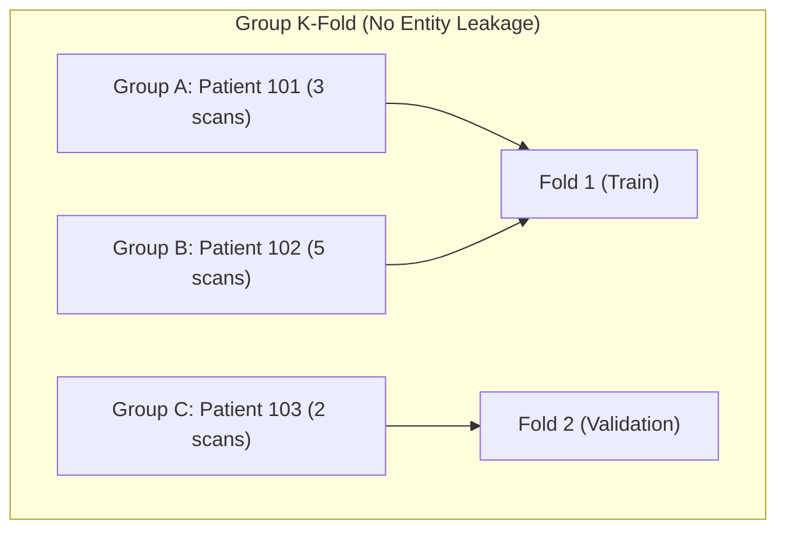
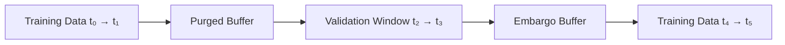
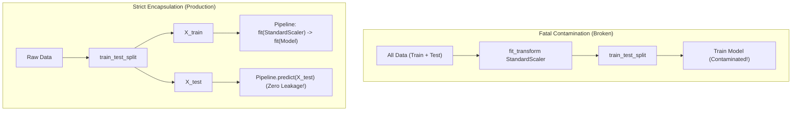
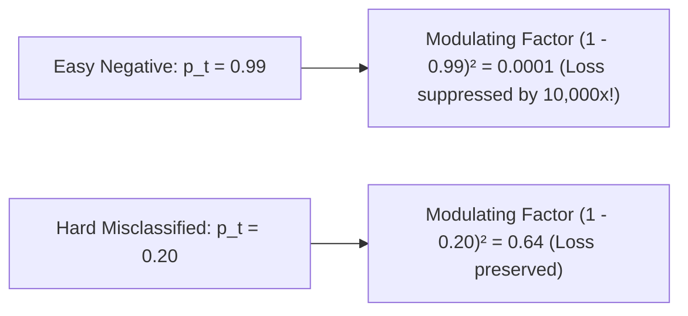
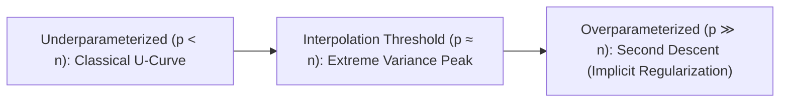

# Model Validation & Generalization — Bias-Variance, Leakage & Imbalance

!!! info "Prerequisites"
    Expectation, variance, statistical estimation, and probability distributions. Review [Probability & Statistics](../02-mathematics/probability-statistics-deep-dive.md), [Data Cleaning & Preprocessing](../03-data-engineering/data-cleaning-preprocessing-deep-dive.md), and [Feature Engineering & Selection](../03-data-engineering/feature-engineering-selection-deep-dive.md).

---

## 1. The Big Picture

The central goal of machine learning is not to memorize historical training records, but to **generalize accurately to unseen future data generated by the same underlying process**.

A model that achieves zero training error may be a master of memorization (overfitting) or the beneficiary of subtle data leakage. Establishing an uncompromised validation protocol requires understanding three foundational pillars:

1. **Statistical Learning Theory & Bias-Variance Decomposition**: The mathematical anatomy of generalization error into intrinsic bias, parameter variance, and irreducible environmental noise.
2. **Data Snooping & Leakage Elimination**: Strict separation of training distributions through encapsulated pipelines, group-aware cross-validation, and purged temporal splits.
3. **Class Asymmetry & Cost-Sensitive Learning**: Resampling geometries (SMOTE, ADASYN) and loss modifications (Focal Loss) that protect rare, high-consequence signals from being drowned out by the majority class.



---

## 2. The Bias-Variance Decomposition: Formal Mathematical Proof

### 2.1 Problem Setup

Assume the true data-generating process is:

$$
y = f(\mathbf{x}) + \epsilon
$$

where $f(\mathbf{x}) = \mathbb{E}[y | \mathbf{x}]$ is the true deterministic regression function, and $\epsilon$ is an independent noise variable with:

- Zero mean: $\mathbb{E}[\epsilon] = 0$
- Constant variance: $\text{Var}(\epsilon) = \mathbb{E}[\epsilon^2] = \sigma^2$
- Independence: $\mathbb{E}[\epsilon \cdot g(\mathbf{x})] = 0$ for any function $g$.

Let $\mathcal{D} = \{(\mathbf{x}_1, y_1), \dots, (\mathbf{x}_n, y_n)\}$ be a random training dataset drawn from the distribution. A learning algorithm fits a model $\hat{f}(\mathbf{x}; \mathcal{D})$.
Because $\mathcal{D}$ is random, the trained model $\hat{f}(\mathbf{x})$ is itself a random variable with expected prediction:

$$
\bar{f}(\mathbf{x}) = \mathbb{E}_{\mathcal{D}}[\hat{f}(\mathbf{x}; \mathcal{D})]
$$

### 2.2 Full Step-by-Step Derivation

We evaluate the expected squared prediction error at a fixed query point $\mathbf{x}$ across all possible training datasets $\mathcal{D}$:

$$
\mathbb{E}_{\mathcal{D}, \epsilon}\left[ (y - \hat{f}(\mathbf{x}))^2 \right] = \mathbb{E}_{\mathcal{D}, \epsilon}\left[ \left( (f(\mathbf{x}) + \epsilon) - \hat{f}(\mathbf{x}) \right)^2 \right]
$$

Add and subtract the expected model prediction $\bar{f}(\mathbf{x}) = \mathbb{E}_{\mathcal{D}}[\hat{f}(\mathbf{x})]$ inside the term:

$$
(y - \hat{f}(\mathbf{x})) = \underbrace{(f(\mathbf{x}) - \bar{f}(\mathbf{x}))}_{\text{Deterministic Bias}} + \underbrace{(\bar{f}(\mathbf{x}) - \hat{f}(\mathbf{x}))}_{\text{Random Estimation Error}} + \underbrace{\epsilon}_{\text{Random Noise}}
$$

Group these three components into $A = f(\mathbf{x}) - \bar{f}(\mathbf{x})$, $B = \bar{f}(\mathbf{x}) - \hat{f}(\mathbf{x})$, and $C = \epsilon$:

$$
(y - \hat{f}(\mathbf{x}))^2 = (A + B + C)^2 = A^2 + B^2 + C^2 + 2AB + 2AC + 2BC
$$

Now take the expectation $\mathbb{E}_{\mathcal{D}, \epsilon}[\cdot]$ of each term:

1. **Term $\mathbb{E}[A^2]$**:
   $A = f(\mathbf{x}) - \bar{f}(\mathbf{x})$ is completely deterministic (contains no random $\mathcal{D}$ or $\epsilon$):
   $$\mathbb{E}[A^2] = (f(\mathbf{x}) - \mathbb{E}[\hat{f}(\mathbf{x})])^2 \equiv \text{Bias}(\hat{f}(\mathbf{x}))^2$$

2. **Term $\mathbb{E}[B^2]$**:
   $B = \bar{f}(\mathbf{x}) - \hat{f}(\mathbf{x}) = -(\hat{f}(\mathbf{x}) - \mathbb{E}[\hat{f}(\mathbf{x})])$. By definition of variance:
   $$\mathbb{E}[B^2] = \mathbb{E}\left[ (\hat{f}(\mathbf{x}) - \mathbb{E}[\hat{f}(\mathbf{x})])^2 \right] \equiv \text{Var}(\hat{f}(\mathbf{x}))$$

3. **Term $\mathbb{E}[C^2]$**:
   By definition of environmental noise variance:
   $$\mathbb{E}[C^2] = \mathbb{E}[\epsilon^2] = \sigma^2 \equiv \text{Irreducible Error}$$

4. **Cross-Term $2\mathbb{E}[AB]$**:
   Since $A$ is constant with respect to $\mathcal{D}$:
   $$\mathbb{E}_{\mathcal{D}}[AB] = A \cdot \mathbb{E}_{\mathcal{D}}[\bar{f}(\mathbf{x}) - \hat{f}(\mathbf{x})] = A \cdot (\bar{f}(\mathbf{x}) - \mathbb{E}_{\mathcal{D}}[\hat{f}(\mathbf{x})]) = A \cdot (\bar{f}(\mathbf{x}) - \bar{f}(\mathbf{x})) = 0$$

5. **Cross-Term $2\mathbb{E}[AC]$**:
   Because noise $\epsilon$ has zero mean and is independent of $f$ and $\hat{f}$:
   $$\mathbb{E}[AC] = A \cdot \mathbb{E}[\epsilon] = A \cdot 0 = 0$$

6. **Cross-Term $2\mathbb{E}[BC]$**:
   Because the training dataset $\mathcal{D}$ used to fit $\hat{f}$ is independent of the test label noise $\epsilon$:
   $$\mathbb{E}_{\mathcal{D}, \epsilon}[BC] = \mathbb{E}_{\mathcal{D}}[B] \cdot \mathbb{E}_{\epsilon}[\epsilon] = \mathbb{E}_{\mathcal{D}}[B] \cdot 0 = 0$$

All three cross-terms vanish identically! We arrive at the celebrated **Bias-Variance Decomposition**:

$$
\mathbb{E}\left[ (y - \hat{f}(\mathbf{x}))^2 \right] = \text{Bias}(\hat{f}(\mathbf{x}))^2 + \text{Var}(\hat{f}(\mathbf{x})) + \sigma^2
$$

$$\mathbb{E}\left[ (y - \hat{f}(\mathbf{x}))^2 \right] = \underbrace{\left( \mathbb{E}[\hat{f}(\mathbf{x})] - f(\mathbf{x}) \right)^2}_{\text{Bias}^2} + \underbrace{\mathbb{E}\left[ (\hat{f}(\mathbf{x}) - \mathbb{E}[\hat{f}(\mathbf{x})])^2 \right]}_{\text{Variance}} + \underbrace{\sigma^2}_{\text{Irreducible Error}}$$



---

## 3. Diagnosing Underfitting vs. Overfitting with Learning Curves

Learning curves plot model performance (training error vs. cross-validation error) as a function of training dataset size $n$.



- **High Bias (Underfitting)**:
  Both training and validation errors are unacceptably high. Adding more training data does not help; the model has plateaued because its hypothesis space lacks the capacity to express the true relationship.

- **High Variance (Overfitting)**:
  Training error is low, but validation error remains high, creating a wide **generalization gap**. Adding more training samples steadily pulls the validation curve down toward the training curve.

---

## 4. Cross-Validation Schemes & Structural Leakage Prevention

A simple train/test split provides a noisy, high-variance estimate of generalization error. Cross-Validation (CV) averages multiple validation estimates, but choosing the wrong CV scheme introduces fatal optimistic bias.

### 4.1 Comparative Summary of CV Strategies

| Scheme | Splitting Mechanism | When Mandatory | Failure Mode if Violated |
|---|---|---|---|
| **K-Fold** | Random uniform partition into $K$ equal folds | IID balanced continuous regression | Class distribution shifts across folds |
| **Stratified K-Fold** | Preserves class label percentages in each fold | Any classification task (especially imbalanced) | Folds missing minority class entirely |
| **Leave-One-Out (LOOCV)** | $K = n$; trains on $n-1$, tests on 1 | Very small datasets ($n < 50$) | Astronomical variance on unstable models; $O(n)$ compute |
| **Group K-Fold** | Guarantees all records of an entity (user, patient) stay in one fold | Multi-sample entities (medical scans, user sessions) | Catastrophic identity leakage across train/val |
| **Purged TimeSeriesSplit** | Rolling expanding window with dead-zones | Financial time series, overlapping prediction horizons | Temporal lookahead leakage via autocorrelated labels |



### 4.2 Purged & Embargoed Cross-Validation (Financial Time Series)

In financial machine learning, training and testing on standard time slices produces massive leakage due to overlapping prediction labels (e.g., predicting 5-day holding returns):

1. **Purging**: Removes training labels whose evaluation horizon overlaps with the validation window.
2. **Embargoing**: Imposes a mandatory buffer period immediately following the validation window to eliminate post-validation auto-regressive memory.



---

## 5. Regularization Theory: ERM vs. Structural Risk Minimization (SRM)

In Vladimir Vapnik's Statistical Learning Theory:

- **Empirical Risk Minimization (ERM)**:
  Minimizes training error over hypothesis space $\mathcal{H}$:
  $$f_{\text{ERM}} = \arg\min_{f \in \mathcal{H}} \frac{1}{n} \sum_{i=1}^n L(y_i, f(\mathbf{x}_i))$$
  By the Vapnik-Chervonenkis (VC) inequality, with probability $1 - \delta$:
  $$R(f) \le R_{\text{emp}}(f) + \sqrt{\frac{h \left( \ln \frac{2n}{h} + 1 \right) - \ln(\delta/4)}{n}}$$
  where $h$ is the **VC Dimension** (measure of capacity). If capacity $h$ is large relative to $n$, empirical risk guarantees nothing about true risk $R(f)$!

- **Structural Risk Minimization (SRM)**:
  Defines a nested sequence of hypothesis spaces of increasing capacity $\mathcal{H}_1 \subset \mathcal{H}_2 \subset \dots \subset \mathcal{H}_\infty$.
  SRM minimizes the joint bound:
  $$f_{\text{SRM}} = \arg\min_{f} \left[ R_{\text{emp}}(f) + \Omega(f) \right]$$
  where $\Omega(f)$ is a complexity penalty (e.g., $L_2$ norm $\|\mathbf{w}\|_2^2$, tree leaf count $|T|$). Ridge, Lasso, and cost-complexity pruning are direct mathematical embodiments of Structural Risk Minimization!

---

## 6. Data & Feature Leakage: Typologies and Pipeline Encapsulation

**Data Leakage** occurs when information from outside the training dataset is inadvertently used to train the machine learning model.

### 6.1 The Three Archetypes of Leakage

1. **Train-Test Contamination (Preprocessing Leakage)**:
   Fitting a `StandardScaler`, `SimpleImputer`, or `PCA` on the entire dataset *before* performing cross-validation splitting. The mean and variance of the validation fold leak into the training fold, understating generalization error.

2. **Target Leakage**:
   Including a feature that is a proxy for the target or that is recorded *chronologically after* the target event has occurred (e.g., using `hospital_discharge_timestamp` to predict whether a patient will be admitted to the ICU).

3. **Identity / Group Leakage**:
   Multiple rows originating from the same physical entity (e.g., 10 MRI images of the same patient's brain tumor). Random splitting puts 8 images in train and 2 in validation. The convolutional net memorizes the patient's unique skull shape rather than tumor pathology!



---

## 7. Class Imbalance: Resampling Geometries & Algorithmic Cost Modifications

In fraud detection, medical diagnosis, or click-through prediction, positive events are exceedingly rare ($0.01\% - 1\%$). A naive classifier that predicts "no fraud" achieves $99.99\%$ accuracy while generating zero economic value.

### 7.1 Resampling Geometries: SMOTE & ADASYN

#### SMOTE (Synthetic Minority Over-sampling Technique):
Chawla et al. (2002) observed that naive oversampling with replacement merely duplicates points, leading to overfitting.
SMOTE synthesizes novel minority samples along the line segments connecting $k$-nearest minority neighbors:

1. For each minority instance $\mathbf{x}_i$, find its $k$-nearest minority neighbors in feature space: $\mathcal{N}_k(\mathbf{x}_i)$.
2. Randomly select one neighbor $\mathbf{x}_{zi} \in \mathcal{N}_k(\mathbf{x}_i)$.
3. Generate a synthetic instance $\mathbf{x}_{\text{new}}$ via linear convex interpolation:
   $$\mathbf{x}_{\text{new}} = \mathbf{x}_i + \lambda (\mathbf{x}_{zi} - \mathbf{x}_i), \quad \lambda \sim \mathcal{U}(0, 1)$$


#### ADASYN (Adaptive Synthetic):
He et al. (2008) extended SMOTE by allocating more synthetic samples to minority instances that are harder to learn.
Let $r_i = \Delta_i / k$ be the proportion of majority class samples among the $k$-nearest neighbors of minority sample $\mathbf{x}_i$.
ADASYN normalizes $r_i$ into a probability distribution $\Gamma_i = r_i / \sum r_j$ and generates synthetic samples proportional to $\Gamma_i$, concentrating synthetic generation along the complex decision boundary.

### 7.2 Algorithmic Cost-Sensitive Learning: Focal Loss

Instead of altering the training data geometry via resampling, **Focal Loss** (Lin et al., 2017) reshapes the loss function directly:

$$
\mathcal{L}_{\text{focal}}(p_t) = -\alpha_t (1 - p_t)^\gamma \ln(p_t)
$$

where:

- $p_t$ is the model's estimated probability for the ground-truth class:
  $$p_t = \begin{cases} \hat{p} & \text{if } y = 1 \\ 1 - \hat{p} & \text{if } y = 0 \end{cases}$$

- $\alpha_t \in [0, 1]$ is a balancing factor addressing class frequency.
- $\gamma \ge 0$ is the **focusing parameter**.



When $\gamma = 0$, Focal Loss is identical to Binary Cross-Entropy.
When $\gamma = 2$ and an easy majority instance has $p_t = 0.99$, $(1 - p_t)^2 = 0.0001$, scaling down its gradient by **$10,000\times$**! The optimizer focuses exclusively on difficult minority instances.

---

## 8. Implementation 1 — Vectorized Bias-Variance Decomposition & SMOTE from Scratch (NumPy)

```python
import numpy as np


def compute_bias_variance_decomposition(
    estimator_factory,
    X_train_pool: np.ndarray,
    y_train_pool: np.ndarray,
    X_test: np.ndarray,
    y_test: np.ndarray,
    n_bootstraps: int = 50,
    sample_size: int = 100
):
    """
    Empirically computes Bias^2, Variance, and Total MSE of a model
    across multiple bootstrap training sets.
    """
    n_test = X_test.shape[0]
    predictions = np.zeros((n_bootstraps, n_test))

    for b in range(n_bootstraps):
        # Draw random training subset
        idx = np.random.choice(len(X_train_pool), size=sample_size, replace=True)
        X_b, y_b = X_train_pool[idx], y_train_pool[idx]

        model = estimator_factory()
        model.fit(X_b, y_b)
        predictions[b] = model.predict(X_test)

    # Average prediction across all models: f_bar(x)
    f_bar = np.mean(predictions, axis=0)

    # Bias^2: (f_bar(x) - y_true)^2
    bias_squared = np.mean((f_bar - y_test) ** 2)

    # Variance: E[(f_hat(x) - f_bar(x))^2]
    variance = np.mean(np.var(predictions, axis=0))

    # Total Mean Squared Error
    total_mse = np.mean((predictions - y_test) ** 2)

    return bias_squared, variance, total_mse


class ScratchSMOTE:
    """
    Synthetic Minority Over-sampling Technique (SMOTE) from scratch in pure NumPy.
    """
    def __init__(self, k_neighbors: int = 5, sampling_ratio: float = 1.0):
        self.k = k_neighbors
        self.ratio = sampling_ratio

    def fit_resample(self, X: np.ndarray, y: np.ndarray):
        X = np.asarray(X, dtype=np.float64)
        y = np.asarray(y).ravel()

        classes, counts = np.unique(y, return_counts=True)
        minority_class = classes[np.argmin(counts)]
        majority_class = classes[np.argmax(counts)]

        X_min = X[y == minority_class]
        n_min = len(X_min)
        n_maj = np.sum(y == majority_class)

        # Number of synthetic samples to generate
        target_n_min = int(n_maj * self.ratio)
        n_synthetic = max(0, target_n_min - n_min)

        if n_synthetic == 0:
            return X, y

        # Compute pairwise Euclidean distance matrix for minority samples
        # ||x_i - x_j||^2 = ||x_i||^2 + ||x_j||^2 - 2 x_i^T x_j
        sq_norms = np.sum(X_min ** 2, axis=1, keepdims=True)
        dist_matrix = np.maximum(sq_norms + sq_norms.T - 2.0 * (X_min @ X_min.T), 0.0)
        np.fill_diagonal(dist_matrix, np.inf)  # Exclude self-distance

        # Find k nearest neighbors for each minority point
        knn_indices = np.argsort(dist_matrix, axis=1)[:, :self.k]

        synthetic_samples = np.zeros((n_synthetic, X.shape[1]))
        for i in range(n_synthetic):
            # Randomly pick a base minority sample
            base_idx = np.random.randint(0, n_min)
            # Randomly pick one of its k nearest neighbors
            neighbor_idx = np.random.choice(knn_indices[base_idx])

            # Interpolate: x_new = x_base + lambda * (x_neighbor - x_base)
            lam = np.random.uniform(0.0, 1.0)
            synthetic_samples[i] = X_min[base_idx] + lam * (X_min[neighbor_idx] - X_min[base_idx])

        # Concatenate original data with synthetic samples
        X_resampled = np.vstack([X, synthetic_samples])
        y_resampled = np.hstack([y, np.full(n_synthetic, minority_class)])

        return X_resampled, y_resampled
```

---

## 9. Implementation 2 — scikit-learn Strict Pipeline Validation & imbalanced-learn

```python
import numpy as np
from sklearn.datasets import make_classification
from sklearn.linear_model import LogisticRegression
from sklearn.model_selection import StratifiedKFold, cross_val_score
from sklearn.preprocessing import StandardScaler
from sklearn.pipeline import Pipeline
from sklearn.metrics import classification_report

# Generate severe imbalanced dataset: 1000 samples, 2% positive class
X, y = make_classification(
    n_samples=1000, n_features=8, weights=[0.98, 0.02], random_state=42
)

# 1. Verify Scratch SMOTE
smote = ScratchSMOTE(k_neighbors=3, sampling_ratio=0.5)
X_res, y_res = smote.fit_resample(X, y)
print(f"Original shape: {X.shape}, Minorities: {np.sum(y == 1)}")
print(f"Resampled shape: {X_res.shape}, Minorities: {np.sum(y_res == 1)}")
assert np.sum(y_res == 1) > np.sum(y == 1), "SMOTE failed to generate synthetic samples!"

# 2. Strict Pipeline Encapsulation (Preventing Preprocessing Leakage)
# Crucial: Preprocessing MUST happen inside cross-validation folds!
pipeline = Pipeline([
    ('scaler', StandardScaler()),
    ('classifier', LogisticRegression(class_weight='balanced', solver='lbfgs'))
])

cv = StratifiedKFold(n_splits=5, shuffle=True, random_state=42)
scores = cross_val_score(pipeline, X, y, cv=cv, scoring='roc_auc')
print(f"Encapsulated Stratified 5-Fold ROC-AUC: {np.mean(scores):.4f} ± {np.std(scores):.4f}")
```

---

## 10. Common Errors & Production Debugging

### 10.1 The Cardinal Sin: Oversampling Before Cross-Validation

```python
# CATASTROPHIC BUG: Applying SMOTE on entire dataset before CV split!
X_smote, y_smote = ScratchSMOTE().fit_resample(X_raw, y_raw)
scores = cross_val_score(model, X_smote, y_smote, cv=5)  # FAKE 99% ACCURACY!
```

**Why this is fatal**:
SMOTE generates synthetic points by interpolating between neighboring minority samples. If performed on the entire dataset, a synthetic point created from sample $A$ will end up in the training fold, while sample $A$ itself is placed in the validation fold! The validation fold is directly contaminated by synthetic twins of the training data.

**Production Fix**:
SMOTE must be applied strictly *inside* each training fold (e.g., using `imblearn.pipeline.Pipeline`).

### 10.2 Evaluating Accuracy on Imbalanced Datasets

On a dataset with 99.9% majority class, a model predicting constant class 0 achieves 99.9% accuracy, but has 0.0 recall. Always evaluate using **Precision-Recall AUC (PR-AUC)**, **Balanced Accuracy**, or **Cost-Weighted Loss**.

---

## 11. Staff-Level Interview Questions & Model Answers

### Q1: Provide a rigorous mathematical proof of the Bias-Variance Decomposition for Mean Squared Error.

**Model Answer:**
Let the true data generating process be $y = f(\mathbf{x}) + \epsilon$ with $\mathbb{E}[\epsilon] = 0$ and $\text{Var}(\epsilon) = \sigma^2$, where $\epsilon$ is independent of $\mathbf{x}$ and the training data $\mathcal{D}$.
Let $\hat{f}(\mathbf{x}) \equiv \hat{f}(\mathbf{x}; \mathcal{D})$ be the model trained on random dataset $\mathcal{D}$, and let $\bar{f}(\mathbf{x}) = \mathbb{E}_{\mathcal{D}}[\hat{f}(\mathbf{x})]$.
We compute the expected prediction error at query point $\mathbf{x}$:
$$\mathbb{E}_{\mathcal{D}, \epsilon}\left[(y - \hat{f}(\mathbf{x}))^2\right] = \mathbb{E}_{\mathcal{D}, \epsilon}\left[(f(\mathbf{x}) + \epsilon - \hat{f}(\mathbf{x}))^2\right]$$
Adding and subtracting $\bar{f}(\mathbf{x})$:
$$y - \hat{f}(\mathbf{x}) = [f(\mathbf{x}) - \bar{f}(\mathbf{x})] + [\bar{f}(\mathbf{x}) - \hat{f}(\mathbf{x})] + \epsilon$$
Squaring both sides and grouping terms:
$$\begin{aligned}
(y - \hat{f}(\mathbf{x}))^2 &= (f(\mathbf{x}) - \bar{f}(\mathbf{x}))^2 + (\bar{f}(\mathbf{x}) - \hat{f}(\mathbf{x}))^2 + \epsilon^2 \\
&\quad + 2(f(\mathbf{x}) - \bar{f}(\mathbf{x}))(\bar{f}(\mathbf{x}) - \hat{f}(\mathbf{x})) \\
&\quad + 2(f(\mathbf{x}) - \bar{f}(\mathbf{x}))\epsilon + 2(\bar{f}(\mathbf{x}) - \hat{f}(\mathbf{x}))\epsilon
\end{aligned}$$
Taking expectation $\mathbb{E}_{\mathcal{D}, \epsilon}[\cdot]$ across all terms:

1. $\mathbb{E}[(f(\mathbf{x}) - \bar{f}(\mathbf{x}))^2] = (f(\mathbf{x}) - \mathbb{E}[\hat{f}(\mathbf{x})])^2 \equiv \text{Bias}(\hat{f}(\mathbf{x}))^2$ (deterministic).
2. $\mathbb{E}[(\bar{f}(\mathbf{x}) - \hat{f}(\mathbf{x}))^2] = \mathbb{E}[(\hat{f}(\mathbf{x}) - \mathbb{E}[\hat{f}(\mathbf{x})])^2] \equiv \text{Var}(\hat{f}(\mathbf{x}))$.
3. $\mathbb{E}[\epsilon^2] = \sigma^2$ (irreducible noise).
4. $\mathbb{E}_{\mathcal{D}}[2(f(\mathbf{x}) - \bar{f}(\mathbf{x}))(\bar{f}(\mathbf{x}) - \hat{f}(\mathbf{x}))] = 2(f(\mathbf{x}) - \bar{f}(\mathbf{x})) \cdot (\bar{f}(\mathbf{x}) - \mathbb{E}[\hat{f}(\mathbf{x})]) = 0$.
5. $\mathbb{E}_{\epsilon}[2(f(\mathbf{x}) - \bar{f}(\mathbf{x}))\epsilon] = 2(f(\mathbf{x}) - \bar{f}(\mathbf{x})) \mathbb{E}[\epsilon] = 0$.
6. $\mathbb{E}_{\mathcal{D}, \epsilon}[2(\bar{f}(\mathbf{x}) - \hat{f}(\mathbf{x}))\epsilon] = 2\mathbb{E}_{\mathcal{D}}[\bar{f}(\mathbf{x}) - \hat{f}(\mathbf{x})] \mathbb{E}_{\epsilon}[\epsilon] = 0$.
All cross-terms vanish identically, yielding:
$$\mathbb{E}[(y - \hat{f}(\mathbf{x}))^2] = \text{Bias}(\hat{f}(\mathbf{x}))^2 + \text{Var}(\hat{f}(\mathbf{x})) + \sigma^2$$

---

### Q2: Contrast Group K-Fold, Stratified K-Fold, and Purged TimeSeriesSplit. Give concrete real-world failure modes for misapplying them.

**Model Answer:**

- **Stratified K-Fold:**
  *Mechanism:* Enforces that every fold preserves the exact class label proportion $P(y=k)$ of the full dataset.
  *Failure Mode:* If applied to hospital patient data where each patient has 20 medical records, records from Patient 101 will be split across both train and validation folds. A neural network will memorize Patient 101's unique biological quirks rather than true disease pathology, inflating CV performance while collapsing on new patients in production.

- **Group K-Fold:**
  *Mechanism:* Partitions data such that all records associated with a specific entity group identifier (e.g., `patient_id`, `device_id`, `household_id`) are placed strictly within a single fold.
  *Failure Mode:* Mandatory whenever rows are not statistically independent. If violated, identity leakage gives an illusion of high generalization.

- **Purged & Embargoed TimeSeriesSplit:**
  *Mechanism:* Splits data chronologically ($t_1 < t_2 < t_3$), removes training samples whose label computation window overlaps with the test period (purging), and adds a dead-zone buffer after testing (embargoing).
  *Failure Mode:* If standard random K-Fold is applied to financial equity data, the model trains on prices from Wednesday to predict Tuesday prices, exploiting lookahead bias and serial correlation to generate illusory profits that evaporate in live trading.

---

### Q3: Derive Focal Loss and explain how the modulating factor $(1 - p_t)^\gamma$ prevents easy negatives from dominating the gradient.

**Model Answer:**
Standard Binary Cross-Entropy (BCE) for target $y \in \{0, 1\}$ is:
$$\text{BCE}(p, y) = -y \ln p - (1 - y) \ln(1 - p)$$
Define the probability of the correct class $p_t$:
$$p_t = \begin{cases} p & \text{if } y = 1 \\ 1 - p & \text{if } y = 0 \end{cases} \implies \text{BCE}(p_t) = -\ln(p_t)$$
In extreme class imbalance (e.g., 1 positive per 1,000 negatives), the vast majority of negative samples are easily classified (e.g., $p_t \ge 0.99$). Even though each individual easy negative incurs a tiny loss $-\ln(0.99) \approx 0.01$, their overwhelming cumulative sum ($\sum 0.01 \times 1,000 = 10$) completely dominates the loss and washes out the gradient from rare positives.

**Focal Loss Formulation:**
$$\mathcal{L}_{\text{focal}}(p_t) = -\alpha_t (1 - p_t)^\gamma \ln(p_t)$$
The modulating factor $(1 - p_t)^\gamma$ dynamically rescales the gradient based on confidence:

- For an easy instance ($p_t = 0.99$) with $\gamma = 2$:
  $$(1 - 0.99)^2 = (0.01)^2 = 0.0001$$
  Its loss and gradient are attenuated by a factor of **10,000**!

- For a hard, misclassified instance ($p_t = 0.2$):
  $$(1 - 0.2)^2 = (0.8)^2 = 0.64$$
  Its loss and gradient are largely preserved.
Focal Loss effectively suppresses easy background negatives without discarding them, directing gradient updates exclusively toward hard, ambiguous boundary cases.

---

### Q4: Differentiate Empirical Risk Minimization (ERM) and Structural Risk Minimization (SRM) from statistical learning theory.

**Model Answer:**

- **Empirical Risk Minimization (ERM):**
  Minimizes the average sample loss over the training dataset:
  $$f_{\text{ERM}} = \arg\min_{f \in \mathcal{H}} R_{\text{emp}}(f) = \arg\min_{f \in \mathcal{H}} \frac{1}{n}\sum_{i=1}^n L(y_i, f(\mathbf{x}_i))$$
  *Vulnerability:* ERM has no mechanism to control model capacity. If the hypothesis space $\mathcal{H}$ has high capacity (large VC dimension $h$), ERM overfits by memorizing training instances, leading to large generalization error $R(f) \gg R_{\text{emp}}(f)$.

- **Structural Risk Minimization (SRM) (Vapnik):**
  Defines a nested structure of hypothesis classes of increasing capacity:
  $$\mathcal{H}_1 \subset \mathcal{H}_2 \subset \dots \subset \mathcal{H}_k \subset \dots$$
  where their VC dimensions satisfy $h_1 \le h_2 \le \dots \le h_k$.
  Vapnik proved that with probability at least $1 - \delta$, true risk is bounded by:
  $$R(f) \le R_{\text{emp}}(f) + \sqrt{\frac{h \left(\ln\frac{2n}{h} + 1\right) - \ln(\delta/4)}{n}}$$
  SRM minimizes the empirical risk and the capacity bound simultaneously:
  $$f_{\text{SRM}} = \arg\min_{f \in \mathcal{H}_k} \left[ R_{\text{emp}}(f) + \Omega(\mathcal{H}_k) \right]$$
  In practice, $\Omega(\mathcal{H}_k)$ is realized as explicit regularization penalties:
  - In Ridge/Lasso: $\mathcal{L}_{\text{SRM}} = \text{MSE} + \lambda \|\mathbf{w}\|_p$.
  - In Support Vector Machines: maximizing the margin $\frac{2}{\|\mathbf{w}\|}$ minimizes the VC dimension of linear hyperplanes.
  - In Decision Trees: Cost-complexity pruning $R(T) + \alpha |T|$.

---

### Q5: What is the "Double Descent" phenomenon in modern deep learning, and how does it reconcile with classical bias-variance theory?

**Model Answer:**

- **Classical Bias-Variance Theory (The U-Curve):**
  As model capacity increases (more parameters $p$), training error decreases monotonically. Validation error decreases to an optimal "sweet spot", beyond which the model overfits, causing test error to diverge toward infinity as $p \to n$.

- **The Modern Double Descent Curve (Belkin et al., 2019):**
  When parameter count exceeds sample size ($p > n$, the **overparameterized regime**), test error peaks at the **interpolation threshold** ($p = n$, where training error hits exactly zero), but then **decreases a second time as capacity continues to grow ($p \gg n$)**!



**Mechanistic Explanation:**

1. At the interpolation threshold $p \approx n$, there is only one unique set of parameters that interpolates the training data. The Gram matrix is near-singular, causing parameters to explode in magnitude (astronomical variance).
2. When $p \gg n$, there are infinitely many parameter configurations that achieve zero training error. Optimizers like Stochastic Gradient Descent (SGD) find the minimum-norm interpolating solution ($\min \|\mathbf{w}\|_2$).
3. This inductive bias acts as an implicit regularizer, producing smooth interpolating functions that eliminate high-frequency oscillations between points.

---

## 12. Mastery Ladder

- [ ] **L1:** You can state the three components of expected prediction error: $\text{Bias}^2$, $\text{Variance}$, and $\sigma^2$.
- [ ] **L2:** You can identify underfitting vs. overfitting from training and validation learning curves.
- [ ] **L3:** You can explain why Stratified K-Fold is mandatory for classification tasks.
- [ ] **L4:** You can explain Group K-Fold and give an example of identity leakage across patient records.
- [ ] **L5:** You can explain purging and embargoing in time-series cross-validation.
- [ ] **L6:** You can mathematically prove the Bias-Variance Decomposition step-by-step.
- [ ] **L7:** You can differentiate Empirical Risk Minimization (ERM) and Structural Risk Minimization (SRM).
- [ ] **L8:** You can explain why preprocessing before train-test split causes data leakage.
- [ ] **L9:** You can write the SMOTE interpolation formula $\mathbf{x}_{\text{new}} = \mathbf{x}_i + \lambda(\mathbf{x}_{zi} - \mathbf{x}_i)$ and explain why SMOTE must be performed inside CV.
- [ ] **L10:** You can derive Focal Loss and implement SMOTE from scratch in NumPy.
