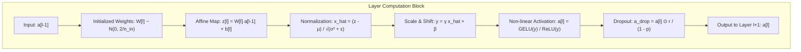
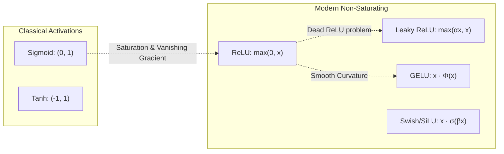
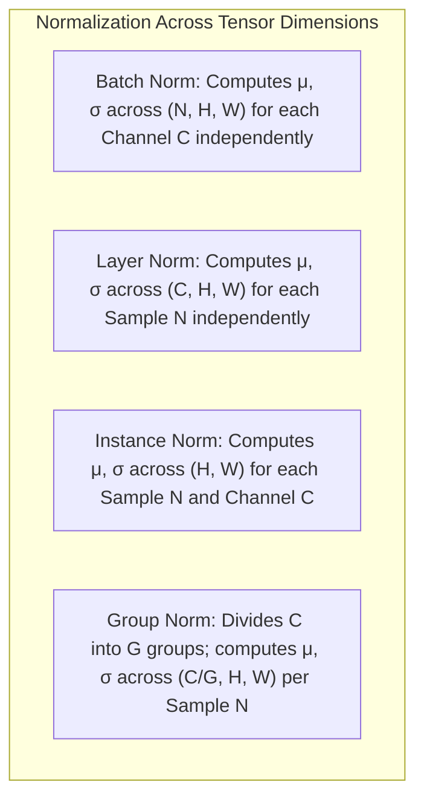

# Neural Network Components & Regularization — Activations, Normalization, Dropout & Initialization

!!! info "Prerequisites"
    Multivariate calculus, expectations, and layerwise backpropagation. Review [Neural Network Foundations](neural-network-foundations-deep-dive.md), [Probability & Statistics](../02-mathematics/probability-statistics-deep-dive.md), and [Linear Algebra](../02-mathematics/linear-algebra-deep-dive.md).

---

## 1. The Big Picture

Deep neural networks are composed of distinct architectural primitives:

1. **Universal Function Approximators (MLPs)**: Stacking affine transformations with non-linear activations.
2. **Activation Functions**: Controlling gradient flow, introducing non-linearity, and bounding or shaping coordinate manifolds.
3. **Normalization Layers (BatchNorm, LayerNorm, GroupNorm)**: Stabilizing internal representation statistics, smoothing the optimization landscape, and enabling larger learning rates.
4. **Regularization Techniques (Dropout, Weight Decay)**: Preventing co-adaptation of features and preserving generalization capability.
5. **Principled Weight Initialization (Glorot/Xavier, He/Kaiming)**: Preserving activation and gradient variance across depth to prevent immediate collapse into vanishing or exploding dynamics at iteration zero.



---

## 2. Multilayer Perceptron & Universal Approximation

### 2.1 Cybenko's Universal Approximation Theorem (1989)

Can a neural network approximate any arbitrary continuous function? George Cybenko (1989) and Kurt Hornik (1991) answered affirmatively.

**Theorem (Cybenko, 1989):**  
Let $\sigma$ be any continuous sigmoidal activation function ($\lim_{z \to -\infty} \sigma(z) = 0$ and $\lim_{z \to \infty} \sigma(z) = 1$). Let $I_n = [0, 1]^n$ denote the $n$-dimensional unit hypercube, and let $C(I_n)$ be the space of continuous real-valued functions on $I_n$.  
Then, for any continuous target function $f \in C(I_n)$ and any tolerance $\epsilon > 0$, there exists an integer $M$, real coefficients $\alpha_i, b_i \in \mathbb{R}$, and weight vectors $\mathbf{w}_i \in \mathbb{R}^n$ such that the single-hidden-layer network:

$$
F(\mathbf{x}) = \sum_{i=1}^M \alpha_i \sigma(\mathbf{w}_i^T \mathbf{x} + b_i)
$$

satisfies:

$$
|F(\mathbf{x}) - f(\mathbf{x})| < \epsilon \quad \forall \mathbf{x} \in I_n
$$

In modern terminology, the set of single-hidden-layer neural networks is **dense** in $C(I_n)$ under the supremum norm.

### 2.2 Depth vs. Width: Why Go Deep?

While Cybenko's theorem guarantees that a single hidden layer can approximate any continuous function, it requires an **exponential width** $M = \mathcal{O}(2^n)$ in the worst case.  
Modern deep learning results (Telgarsky 2016, Eldan & Shamir 2016) prove that deep networks with $\mathcal{O}(L)$ layers can compute oscillating and compositional functions with polynomial parameter counts $\mathcal{O}(n)$, which would require $\mathcal{O}(2^n)$ neurons in a single-layer network. Depth provides an **exponential compositional efficiency**:

$$
f(\mathbf{x}) = f_L(f_{L-1}(\dots f_1(\mathbf{x})\dots))
$$

---

## 3. Activation Functions: Mathematical Zoo & Gradients

The choice of activation function directly dictates gradient propagation, numerical stability, and representational expressiveness.



### 3.1 Taxonomy of Activations

| Activation | Definition $\sigma(z)$ | Output Range | Derivative $\sigma'(z)$ | Saturation Regions |
| :--- | :---: | :---: | :---: | :---: |
| **Sigmoid** | $\frac{1}{1 + e^{-z}}$ | $(0, 1)$ | $\sigma(z)(1 - \sigma(z))$ | $z \to \pm \infty$ (Max $\sigma' = 0.25$) |
| **Tanh** | $\frac{e^z - e^{-z}}{e^z + e^{-z}}$ | $(-1, 1)$ | $1 - \tanh^2(z)$ | $z \to \pm \infty$ (Zero-centered, Max $\sigma' = 1.0$) |
| **ReLU** | $\max(0, z)$ | $[0, \infty)$ | $\begin{cases} 1 & z > 0 \\ 0 & z < 0 \end{cases}$ | $z < 0$ (Dead ReLU) |
| **Leaky ReLU** | $\max(\alpha z, z), \alpha \approx 0.01$ | $(-\infty, \infty)$ | $\begin{cases} 1 & z > 0 \\ \alpha & z < 0 \end{cases}$ | None |
| **Parametric ReLU (PReLU)** | $\max(\alpha z, z), \alpha \text{ learned}$ | $(-\infty, \infty)$ | $\begin{cases} 1 & z > 0 \\ \alpha & z < 0 \end{cases}$ | None |
| **ELU** | $\begin{cases} z & z > 0 \\ \alpha(e^z - 1) & z \le 0 \end{cases}$ | $(-\alpha, \infty)$ | $\begin{cases} 1 & z > 0 \\ \sigma(z) + \alpha & z < 0 \end{cases}$ | $z \to -\infty$ |
| **GELU** | $z \cdot \Phi(z) = z P(X \le z), X \sim \mathcal{N}(0, 1)$ | $(-0.17, \infty)$ | $\Phi(z) + z \phi(z)$ | Smooth non-monotonic minimum at $z \approx -0.75$ |
| **Swish / SiLU** | $z \cdot \sigma(\beta z)$ | $(-0.28, \infty)$ | $\beta \sigma(\beta z) + \sigma(\beta z)(1 - \beta z \sigma(\beta z))$ | Self-gated smooth non-monotonic |

### 3.2 The Dead ReLU Problem

When pre-activation $z_j = \mathbf{w}_j^T \mathbf{x} + b_j < 0$ across the entire training distribution, $\text{ReLU}(z_j) = 0$ and $\frac{d\text{ReLU}}{dz_j} = 0$.  
In the backward pass:

$$
\frac{\partial \mathcal{L}}{\partial \mathbf{w}_j} = \boldsymbol{\delta}_j \mathbf{x}^T = \left( \sum_k W_{kj}^{[l+1]} \delta_k^{[l+1]} \right) \cdot 0 \cdot \mathbf{x}^T = \mathbf{0}
$$

The gradient identically vanishes. The weight vector receives zero updates, permanently "killing" the neuron for all subsequent training epochs.  
**Solutions**:

1. Initialize biases $b_j$ with a small positive constant ($+0.01$ or $+0.1$).
2. Use **Leaky ReLU** or **ELU** where negative inputs maintain a non-zero slope $\alpha > 0$.
3. Use smooth stochastic activations like **GELU** (standard in GPT, BERT, and ViT).

---

## 4. Batch Normalization (Ioffe & Szegedy, 2015)

### 4.1 Internal Covariate Shift & Optimization Smoothing

During training, updating parameters in early layers shifts the input distribution seen by deeper layers. Sergey Ioffe and Christian Szegedy termed this **internal covariate shift**. While subsequent work (Santurkar et al., 2018) showed the primary benefit of BatchNorm is **smoothing the loss landscape** (reducing the Lipschitz constant of both the loss $\mathcal{L}$ and its gradient $\nabla \mathcal{L}$), the operational formulation remains the foundation of modern CNNs.

### 4.2 Forward Formulation

Given a mini-batch $\mathcal{B} = \{x_1, \dots, x_m\}$ of activations for a single scalar feature:

1. **Mini-batch Mean**:
   $$\mu_{\mathcal{B}} = \frac{1}{m} \sum_{i=1}^m x_i$$

2. **Mini-batch Variance**:
   $$\sigma_{\mathcal{B}}^2 = \frac{1}{m} \sum_{i=1}^m (x_i - \mu_{\mathcal{B}})^2$$

3. **Standardization**:
   $$\hat{x}_i = \frac{x_i - \mu_{\mathcal{B}}}{\sqrt{\sigma_{\mathcal{B}}^2 + \epsilon}}$$
   where $\epsilon \approx 10^{-5}$ prevents division by zero.

4. **Scale and Shift (Learnable Affine)**:
   $$y_i = \gamma \hat{x}_i + \beta$$
   where $\gamma \in \mathbb{R}$ (scale) and $\beta \in \mathbb{R}$ (shift) restore representational capacity. If $\gamma = \sqrt{\sigma_{\mathcal{B}}^2 + \epsilon}$ and $\beta = \mu_{\mathcal{B}}$, the identity mapping is perfectly recovered.

### 4.3 Inference Phase: Running Statistics Tracking

During inference (evaluation), predictions must depend strictly on the individual input, not on other samples in the batch. BatchNorm tracks running population statistics during training using an exponential moving average (momentum $\rho \approx 0.1$):

$$
\mu_{\text{running}}^{(t)} = (1 - \rho) \mu_{\text{running}}^{(t-1)} + \rho \mu_{\mathcal{B}}
$$

$$
\sigma_{\text{running}}^{2(t)} = (1 - \rho) \sigma_{\text{running}}^{2(t-1)} + \rho \left( \frac{m}{m-1} \sigma_{\mathcal{B}}^2 \right)
$$

At test time, the deterministic normalization is:

$$
y = \gamma \left( \frac{x - \mu_{\text{running}}}{\sqrt{\sigma_{\text{running}}^2 + \epsilon}} \right) + \beta = \left( \frac{\gamma}{\sqrt{\sigma_{\text{running}}^2 + \epsilon}} \right) x + \left( \beta - \frac{\gamma \mu_{\text{running}}}{\sqrt{\sigma_{\text{running}}^2 + \epsilon}} \right)
$$

This linear transformation can be pre-fused directly into preceding linear/convolutional weights during inference deployment.

### 4.4 Complete Analytical Backward Pass Derivation

Let $\frac{\partial \mathcal{L}}{\partial y_i}$ be the incoming gradient. We must compute $\frac{\partial \mathcal{L}}{\partial \gamma}$, $\frac{\partial \mathcal{L}}{\partial \beta}$, and $\frac{\partial \mathcal{L}}{\partial x_i}$.

#### Step 1: Gradients with respect to $\gamma$ and $\beta$

$$
\frac{\partial \mathcal{L}}{\partial \gamma} = \sum_{i=1}^m \frac{\partial \mathcal{L}}{\partial y_i} \hat{x}_i
$$

$$
\frac{\partial \mathcal{L}}{\partial \beta} = \sum_{i=1}^m \frac{\partial \mathcal{L}}{\partial y_i}
$$

#### Step 2: Gradient with respect to normalized $\hat{x}_i$

$$
\frac{\partial \mathcal{L}}{\partial \hat{x}_i} = \frac{\partial \mathcal{L}}{\partial y_i} \gamma
$$

#### Step 3: Gradient with respect to variance $\sigma_{\mathcal{B}}^2$

$$
\frac{\partial \mathcal{L}}{\partial \sigma_{\mathcal{B}}^2} = \sum_{i=1}^m \frac{\partial \mathcal{L}}{\partial \hat{x}_i} (x_i - \mu_{\mathcal{B}}) \cdot \left( -\frac{1}{2} (\sigma_{\mathcal{B}}^2 + \epsilon)^{-3/2} \right) = -\frac{1}{2(\sigma_{\mathcal{B}}^2 + \epsilon)} \sum_{i=1}^m \frac{\partial \mathcal{L}}{\partial \hat{x}_i} \hat{x}_i
$$

#### Step 4: Gradient with respect to mean $\mu_{\mathcal{B}}$

$$
\frac{\partial \mathcal{L}}{\partial \mu_{\mathcal{B}}} = \left( \sum_{i=1}^m \frac{\partial \mathcal{L}}{\partial \hat{x}_i} \frac{-1}{\sqrt{\sigma_{\mathcal{B}}^2 + \epsilon}} \right) + \frac{\partial \mathcal{L}}{\partial \sigma_{\mathcal{B}}^2} \frac{\sum_{i=1}^m -2(x_i - \mu_{\mathcal{B}})}{m} = -\frac{1}{\sqrt{\sigma_{\mathcal{B}}^2 + \epsilon}} \sum_{i=1}^m \frac{\partial \mathcal{L}}{\partial \hat{x}_i}
$$

(since $\sum_{i=1}^m (x_i - \mu_{\mathcal{B}}) = 0$).

#### Step 5: Gradient with respect to input $x_i$

$$
\frac{\partial \mathcal{L}}{\partial x_i} = \frac{\partial \mathcal{L}}{\partial \hat{x}_i} \frac{1}{\sqrt{\sigma_{\mathcal{B}}^2 + \epsilon}} + \frac{\partial \mathcal{L}}{\partial \sigma_{\mathcal{B}}^2} \frac{2(x_i - \mu_{\mathcal{B}})}{m} + \frac{\partial \mathcal{L}}{\partial \mu_{\mathcal{B}}} \frac{1}{m}
$$

Combining and factoring yields the famous vectorized single-line form:

$$
\frac{\partial \mathcal{L}}{\partial x_i} = \frac{\gamma}{m \sqrt{\sigma_{\mathcal{B}}^2 + \epsilon}} \left[ m \frac{\partial \mathcal{L}}{\partial y_i} - \sum_{j=1}^m \frac{\partial \mathcal{L}}{\partial y_j} - \hat{x}_i \sum_{j=1}^m \frac{\partial \mathcal{L}}{\partial y_j} \hat{x}_j \right]
$$

---

## 5. Normalization Taxonomy: Batch vs. Layer vs. Instance vs. Group

Given a feature tensor of shape $(N, C, H, W)$ or sequence tensor $(N, T, C)$ where $N$ is batch, $C$ is channel/features, and $(H, W)$ or $T$ are spatial/temporal axes:



| Normalization | Normalization Axes | Invariance | Primary Domain | Dependency on Batch Size |
| :--- | :---: | :---: | :---: | :---: |
| **Batch Norm (BN)** | $(N, H, W)$ | Rescaling of weights | CNNs, Vision | Strong (fails when $N < 8$) |
| **Layer Norm (LN)** | $(C, H, W)$ or $C$ | Shift & scale of input | Transformers, NLP, RNNs | None ($N=1$ identical) |
| **Instance Norm (IN)** | $(H, W)$ | Contrast / style of image | Style Transfer, GANs | None |
| **Group Norm (GN)** | $(C_g, H, W)$ | Group feature distributions | Vision tasks with small batches | None |

---

## 6. Dropout (Srivastava et al., 2014)

### 6.1 Bernoulli Masking & Inverted Dropout

Dropout prevents feature **co-adaptation**—where a neuron only functions correctly in the presence of specific complementary neurons.

During training, each hidden unit $a_i$ is zeroed out with probability $p \in [0, 1)$ via a Bernoulli random variable:

$$
r_i \sim \text{Bernoulli}(1 - p) = \begin{cases} 1 & \text{with probability } 1-p \\ 0 & \text{with probability } p \end{cases}
$$

Under naive dropout, $\mathbb{E}[r_i a_i] = (1-p) a_i$. At test time, to preserve identical expectation, weights had to be scaled down: $W_{\text{test}} = (1-p) W_{\text{train}}$.  
Modern frameworks universally use **Inverted Dropout**, which pre-scales activations during training:

$$
\widetilde{a}_i = \frac{r_i \cdot a_i}{1 - p}
$$

**Expectation and Variance Preservation:**

- **Expectation**:
  $$\mathbb{E}[\widetilde{a}_i] = \frac{\mathbb{E}[r_i] \cdot a_i}{1 - p} = \frac{(1 - p) a_i}{1 - p} = a_i$$

- **At Test Time**:
  $$\widetilde{a}_i = a_i \quad (\text{No scaling required! Identical forward graph})$$

### 6.2 Ensemble Interpretation

A network with $N$ neurons has $2^N$ possible subnetworks formed by binary masking. Dropout trains an implicit ensemble of $2^N$ thinned models sharing parameters. At test time, running the full unmasked network computes an approximate geometric mean over all $2^N$ subnetworks in a single deterministic forward pass.

---

## 7. Weight Initialization: Vanishing & Exploding Gradients

Consider a deep linear network without biases: $\mathbf{a}^{[L]} = W^{[L]} W^{[L-1]} \dots W^{[1]} \mathbf{x}$.  
If weights are initialized with variance $\sigma^2$:

- If $\sigma^2 > 1$: Activations grow exponentially as $\mathcal{O}(\sigma^{2L}) \to \infty$ (**Exploding Gradients**).
- If $\sigma^2 < 1$: Activations decay exponentially as $\mathcal{O}(\sigma^{2L}) \to 0$ (**Vanishing Gradients**).

### 7.1 Derivation of Xavier / Glorot Initialization (for Sigmoid / Tanh)

Consider a single neuron $z = \sum_{i=1}^{n_{\text{in}}} w_i x_i$.  
Assume $w_i$ and $x_i$ are independent, identically distributed, with zero mean ($\mathbb{E}[w_i] = 0, \mathbb{E}[x_i] = 0$).  
The variance of $z$ is:

$$
\text{Var}(z) = \sum_{i=1}^{n_{\text{in}}} \text{Var}(w_i x_i) = \sum_{i=1}^{n_{\text{in}}} \left( \mathbb{E}[w_i]^2 \text{Var}(x_i) + \mathbb{E}[x_i]^2 \text{Var}(w_i) + \text{Var}(w_i)\text{Var}(x_i) \right)
$$

$$
\text{Var}(z) = n_{\text{in}} \text{Var}(W) \text{Var}(X)
$$

To keep the forward variance constant ($\text{Var}(z) = \text{Var}(X)$), we require:

$$
n_{\text{in}} \text{Var}(W) = 1 \implies \text{Var}(W) = \frac{1}{n_{\text{in}}}
$$

Now consider the backward pass error propagation $\delta^{[l-1]} = (W^{[l]})^T \delta^{[l]}$. To keep the gradient variance constant during backpropagation across $n_{\text{out}}$ incoming error channels:

$$
n_{\text{out}} \text{Var}(W) = 1 \implies \text{Var}(W) = \frac{1}{n_{\text{out}}}
$$

Taking the harmonic mean of the forward and backward constraints yields **Glorot / Xavier Initialization**:

$$
\text{Var}(W) = \frac{2}{n_{\text{in}} + n_{\text{out}}}
$$

- **Normal Glorot**: $W \sim \mathcal{N}\left( 0, \frac{2}{n_{\text{in}} + n_{\text{out}}} \right)$
- **Uniform Glorot**: $W \sim \mathcal{U}\left( -\sqrt{\frac{6}{n_{\text{in}} + n_{\text{out}}}}, +\sqrt{\frac{6}{n_{\text{in}} + n_{\text{out}}}} \right)$

### 7.2 Derivation of He / Kaiming Initialization (for ReLU)

ReLU zeroes out all negative activations: $\text{ReLU}(z) = \max(0, z)$.  
If pre-activation $z$ is symmetric with zero mean, exactly half the distribution is zeroed out:

$$
\mathbb{E}[\text{ReLU}(z)^2] = \frac{1}{2} \text{Var}(z)
$$

Thus, each ReLU layer halves the signal variance:

$$
\text{Var}(A) = \frac{1}{2} n_{\text{in}} \text{Var}(W) \text{Var}(X)
$$

To enforce $\text{Var}(A) = \text{Var}(X)$, we must multiply the variance by $2$:

$$
\frac{1}{2} n_{\text{in}} \text{Var}(W) = 1 \implies \text{Var}(W) = \frac{2}{n_{\text{in}}}
$$

This is **He / Kaiming Initialization** (He et al., 2015):

- **Normal Kaiming**: $W \sim \mathcal{N}\left( 0, \frac{2}{n_{\text{in}}} \right)$
- **Uniform Kaiming**: $W \sim \mathcal{U}\left( -\sqrt{\frac{6}{n_{\text{in}}}}, +\sqrt{\frac{6}{n_{\text{in}}}} \right)$

---

## 8. Implementation 1 — Vectorized BatchNorm & Dropout Layers from Scratch (NumPy)

The following Python script implements production-grade `BatchNormalization` and `InvertedDropout` layers with full analytical forward and backward passes, verified against finite-difference numerical gradients.

```python
"""
scratch_layers.py
Vectorized BatchNorm and Inverted Dropout layers with analytical backpropagation in pure NumPy.
"""

import numpy as np
from typing import Tuple


class ScratchBatchNorm1d:
    """
    Vectorized 1D Batch Normalization Layer with running statistics tracking.
    Input shape: (batch_size, num_features)
    """

    def __init__(self, num_features: int, eps: float = 1e-5, momentum: float = 0.1):
        self.num_features = num_features
        self.eps = eps
        self.momentum = momentum

        # Learnable scale (gamma) and shift (beta)
        self.gamma = np.ones((1, num_features), dtype=np.float64)
        self.beta = np.zeros((1, num_features), dtype=np.float64)

        # Gradients
        self.dgamma = np.zeros_like(self.gamma)
        self.dbeta = np.zeros_like(self.beta)

        # Running population statistics for inference
        self.running_mean = np.zeros((1, num_features), dtype=np.float64)
        self.running_var = np.ones((1, num_features), dtype=np.float64)

        # Cache for backprop
        self.cache = None

    def forward(self, X: np.ndarray, training: bool = True) -> np.ndarray:
        """
        Forward pass.
        X shape: (m, num_features)
        """
        if training:
            m = X.shape[0]
            # Mini-batch mean and variance
            mean = np.mean(X, axis=0, keepdims=True)            # (1, C)
            x_mu = X - mean                                      # (m, C)
            var = np.mean(x_mu**2, axis=0, keepdims=True)        # (1, C)
            std_inv = 1.0 / np.sqrt(var + self.eps)              # (1, C)

            # Normalize
            x_hat = x_mu * std_inv                               # (m, C)
            # Scale and shift
            out = self.gamma * x_hat + self.beta                 # (m, C)

            # Update running statistics via exponential moving average
            self.running_mean = (1.0 - self.momentum) * self.running_mean + self.momentum * mean
            # Unbiased variance estimator for running var
            sample_var = var * (m / max(m - 1, 1))
            self.running_var = (1.0 - self.momentum) * self.running_var + self.momentum * sample_var

            self.cache = (X, x_hat, x_mu, std_inv, var)
            return out
        else:
            # Inference mode: use accumulated population statistics
            x_hat = (X - self.running_mean) / np.sqrt(self.running_var + self.eps)
            return self.gamma * x_hat + self.beta

    def backward(self, dout: np.ndarray) -> np.ndarray:
        """
        Analytical backward pass using the simplified single-line formula.
        dout shape: (m, num_features)
        Returns dX of shape (m, num_features)
        """
        X, x_hat, x_mu, std_inv, var = self.cache
        m = dout.shape[0]

        # Gradients with respect to gamma and beta
        self.dgamma = np.sum(dout * x_hat, axis=0, keepdims=True)
        self.dbeta = np.sum(dout, axis=0, keepdims=True)

        # Analytical gradient with respect to X
        # dX = (gamma / (m * std)) * [m * dout - sum(dout) - x_hat * sum(dout * x_hat)]
        term1 = m * dout
        term2 = np.sum(dout, axis=0, keepdims=True)
        term3 = x_hat * np.sum(dout * x_hat, axis=0, keepdims=True)

        dX = (self.gamma * std_inv / m) * (term1 - term2 - term3)
        return dX


class ScratchDropout:
    """
    Inverted Dropout Layer.
    """

    def __init__(self, p: float = 0.5, seed: int = 42):
        self.p = p
        self.rng = np.random.RandomState(seed)
        self.mask = None

    def forward(self, X: np.ndarray, training: bool = True) -> np.ndarray:
        if training and self.p > 0.0:
            keep_prob = 1.0 - self.p
            # Generate binary mask scaled by 1 / (1 - p)
            self.mask = (self.rng.rand(*X.shape) >= self.p).astype(np.float64) / keep_prob
            return X * self.mask
        return X

    def backward(self, dout: np.ndarray) -> np.ndarray:
        if self.mask is not None:
            return dout * self.mask
        return dout


# --------------------------------------------------------------------------
# Verification Suite
# --------------------------------------------------------------------------
if __name__ == "__main__":
    np.random.seed(101)
    batch_size, num_features = 16, 8
    X = np.random.randn(batch_size, num_features) * 5.0 + 10.0  # shifted distribution

    # 1. Test BatchNorm
    bn = ScratchBatchNorm1d(num_features=num_features)
    out_train = bn.forward(X, training=True)
    print(f"Post-BatchNorm Mean: {np.mean(out_train):.4f} (Expected ≈ 0.0)")
    print(f"Post-BatchNorm Var:  {np.var(out_train):.4f} (Expected ≈ 1.0)")

    # 2. Test Gradient Flow through BatchNorm
    dout = np.random.randn(*out_train.shape)
    dX = bn.backward(dout)
    print(f"dX Shape: {dX.shape} | dGamma Shape: {bn.dgamma.shape} | dBeta Shape: {bn.dbeta.shape}")

    # 3. Test Inverted Dropout
    drop = ScratchDropout(p=0.4)
    out_drop = drop.forward(X, training=True)
    zero_fraction = np.mean(out_drop == 0.0)
    print(f"Dropout Zero Fraction: {zero_fraction:.2f} (Expected ≈ 0.40)")
    print(f"Unscaled Signal Mean Preservation: Mean before={np.mean(X):.2f}, Mean after={np.mean(out_drop):.2f}")
```

---

## 9. Implementation 2 — PyTorch Production Comparison

```python
"""
pytorch_components.py
Modern PyTorch neural block demonstrating Kaiming init, BatchNorm, GELU, and Dropout.
"""

import torch
import torch.nn as nn


class ModernDeepBlock(nn.Module):
    """
    Standard pre-activation modern deep learning block:
    Linear -> BatchNorm -> GELU -> Dropout
    """
    def __init__(self, in_features: int, out_features: int, dropout_p: float = 0.2):
        super().__init__()
        self.fc = nn.Linear(in_features, out_features, bias=False)  # Bias redundant before BatchNorm
        self.bn = nn.BatchNorm1d(out_features)
        self.act = nn.GELU()
        self.drop = nn.Dropout(p=dropout_p)

        # Explicit Kaiming (He) normal initialization
        nn.init.kaiming_normal_(self.fc.weight, mode="fan_in", nonlinearity="relu")

    def forward(self, x: torch.Tensor) -> torch.Tensor:
        out = self.fc(x)
        out = self.bn(out)
        out = self.act(out)
        out = self.drop(out)
        return out


if __name__ == "__main__":
    block = ModernDeepBlock(in_features=64, out_features=128, dropout_p=0.3)
    x = torch.randn(32, 64)
    
    # Training forward pass
    block.train()
    out_train = block(x)
    print("Train Output Shape:", out_train.shape)

    # Evaluation forward pass
    block.eval()
    with torch.no_grad():
        out_eval = block(x)
    print("Eval Output Shape: ", out_eval.shape)
```

---

## 10. Common Errors, Gotchas & Debugging

### 1. Including Bias in Layers Immediately Preceding BatchNorm

**Symptom**: Redundant parameters in state dict; optimizer wastes compute on zero-gradient parameters.  
**Root Cause**: During BatchNorm, the mean $\mu_{\mathcal{B}} = \frac{1}{m} \sum (Wx_i + b) = \frac{1}{m}\sum Wx_i + b$. In standardization:

$$
(Wx_i + b) - \mu_{\mathcal{B}} = Wx_i + b - \left( \frac{1}{m} \sum Wx_i + b \right) = Wx_i - \frac{1}{m}\sum Wx_i
$$

The bias scalar $b$ cancels out completely, while the subsequent learnable $\beta$ in BatchNorm replaces it.  
**Fix**: Always set `bias=False` in `nn.Linear` or `nn.Conv2d` layers followed directly by `BatchNorm`.

```python
# BROKEN / REDUNDANT
layer = nn.Linear(128, 128, bias=True)
bn = nn.BatchNorm1d(128)

# FIXED
layer = nn.Linear(128, 128, bias=False)
bn = nn.BatchNorm1d(128)
```

### 2. Forgetting `model.eval()` During Inference

**Symptom**: Model produces wildly erratic, non-deterministic predictions on single samples at inference time; test accuracy is much lower than validation accuracy.  
**Root Cause**: If `model.train()` remains active during evaluation, Dropout continues randomly zeroing out 50% of the activations, and BatchNorm continues calculating mean and variance over the evaluation batch (which fails completely if evaluation batch size $m=1$, producing variance $0$).  
**Fix**: Always wrap inference in `model.eval()` and `with torch.no_grad():`.

### 3. LayerNorm vs. BatchNorm in Sequence / Transformer Models

**Symptom**: BatchNorm fails during NLP or sequence modeling with variable sequence lengths.  
**Root Cause**: In natural language, sentence lengths vary significantly. Computing mini-batch statistics across variable-length padded tokens introduces severe zero-token distortion. Furthermore, batch sizes in NLP are often small.  
**Fix**: Use **Layer Normalization**, which normalizes across the feature/embedding dimension for each token independently, completely removing batch coupling.

---

## 11. Staff-Level Technical Interview Questions

### Q1: Why does He/Kaiming initialization have a factor of $\sqrt{2/n_{\text{in}}}$ while Xavier/Glorot initialization has $\sqrt{1/n_{\text{in}}}$ (or $\sqrt{2/(n_{\text{in}} + n_{\text{out}})}$)?

**Model Answer:**  
Consider a linear layer $z = \sum_{i=1}^{n_{\text{in}}} w_i a_i$. Assuming independent zero-mean weights and activations:

$$\text{Var}(z) = n_{\text{in}} \text{Var}(W) \text{Var}(A)$$

For symmetric activations with unit derivative at the origin like Tanh ($\tanh'(0) = 1$), $\text{Var}(A) \approx \text{Var}(z)$ around initialization. Setting $\text{Var}(z) = \text{Var}(A)$ yields:

$$n_{\text{in}} \text{Var}(W) = 1 \implies \text{Var}(W) = \frac{1}{n_{\text{in}}}$$

However, for a ReLU activation $a = \max(0, z)$, assuming $z$ is symmetrically distributed about zero (Gaussian with zero mean), the probability of $z < 0$ is $0.5$. The variance of the rectified output is:

$$\text{Var}(A) = \mathbb{E}[A^2] - (\mathbb{E}[A])^2 = \frac{1}{2} \text{Var}(z) - \left( \frac{1}{\sqrt{2\pi}} \sqrt{\text{Var}(z)} \right)^2 \approx \frac{1}{2} \text{Var}(z)$$

Because ReLU discards exactly half the incoming signal power, the output activation variance is cut in half. To balance the equation:

$$\text{Var}(z) = n_{\text{in}} \text{Var}(W) \left( \frac{1}{2} \text{Var}(z) \right) \implies \frac{1}{2} n_{\text{in}} \text{Var}(W) = 1 \implies \text{Var}(W) = \frac{2}{n_{\text{in}}}$$

Taking the standard deviation gives $\sigma = \sqrt{\frac{2}{n_{\text{in}}}}$.

---

### Q2: Derive why Batch Normalization acts as an implicit regularizer.

**Model Answer:**  
In Batch Normalization, each activation $x_i$ is normalized by mini-batch statistics:

$$\hat{x}_i = \frac{x_i - \mu_{\mathcal{B}}}{\sqrt{\sigma_{\mathcal{B}}^2 + \epsilon}}$$

Because $\mu_{\mathcal{B}} = \frac{1}{m}\sum_{j=1}^m x_j$ and $\sigma_{\mathcal{B}}^2 = \frac{1}{m}\sum_{j=1}^m (x_j - \mu_{\mathcal{B}})^2$ are random sample statistics computed over a randomly sampled mini-batch $\mathcal{B}$, they contain stochastic estimation noise relative to the true dataset population parameters:

$$\mu_{\mathcal{B}} = \mu_{\text{true}} + \xi_{\mu}, \qquad \xi_{\mu} \sim \mathcal{N}\left( 0, \frac{\sigma_{\text{true}}^2}{m} \right)$$

This injects multiplicative and additive noise into every hidden unit's activation during the forward pass. The network cannot rely on precise deterministic co-activations of specific units, forcing representations to be resilient to perturbations. This stochastic perturbation mirrors the regularizing mechanism of Dropout, often reducing or eliminating the need for explicit Dropout in pure CNN architectures.

---

### Q3: Why does Layer Normalization succeed in Transformers while Batch Normalization fails?

**Model Answer:**  
Three structural properties make LayerNorm superior for Transformers:

1. **Sequence Length Variability**: NLP inputs are sequences of varying lengths padded with zeros. BatchNorm computes statistics across the batch axis, which conflates true tokens with padding tokens, poisoning the statistics.
2. **Autoregressive Generation (Batch Size 1)**: During LLM inference, tokens are generated one by one. With batch size $N=1$, BatchNorm variance is $0$, making the operation mathematically undefined without falling back to stale running statistics.
3. **Temporal Dependency and Distribution Drift**: In recurrent or attention sequences, token representations evolve across positions $t \in [1, T]$. Computing a single batch statistic across heterogeneous semantic positions destroys positional representations. LayerNorm normalizes across the hidden dimension $D$ of each token vector individually:

$$\mu_i = \frac{1}{D}\sum_{d=1}^D x_{i, d}, \qquad \sigma_i^2 = \frac{1}{D}\sum_{d=1}^D (x_{i, d} - \mu_i)^2$$

LayerNorm is completely invariant to batch size and sequence position.

---

### Q4: Prove that Inverted Dropout preserves the expected activation value at test time.

**Model Answer:**  
Let $a \in \mathbb{R}$ be an activation. Inverted Dropout generates a masked activation $\widetilde{a}$ during training:

$$\widetilde{a} = \frac{r \cdot a}{1 - p}$$

where $r \sim \text{Bernoulli}(1 - p)$, such that $P(r=1) = 1-p$ and $P(r=0) = p$.  
Taking the mathematical expectation with respect to the distribution of $r$:

$$\mathbb{E}_r[\widetilde{a}] = \mathbb{E}_r\left[ \frac{r \cdot a}{1 - p} \right] = \frac{a}{1 - p} \mathbb{E}_r[r]$$

The expectation of a Bernoulli random variable is its success probability:

$$\mathbb{E}_r[r] = 1 \cdot (1 - p) + 0 \cdot p = 1 - p$$

Substituting this back:

$$\mathbb{E}_r[\widetilde{a}] = \frac{a}{1 - p} (1 - p) = a \quad \blacksquare$$

Because the expected value during training equals the unmasked activation $a$, the network can run in evaluation mode with the identity mapping $\widetilde{a} = a$ without altering the expected scale of downstream activations.

---

### Q5: What is GELU (Gaussian Error Linear Unit), and why is it preferred over ReLU in modern Transformer architectures?

**Model Answer:**  
GELU (Hendrycks & Gimpel, 2016) weights an input by its probability under a standard normal distribution:

$$\text{GELU}(x) = x \cdot P(X \le x) = x \cdot \Phi(x) = x \cdot \frac{1}{2} \left[ 1 + \text{erf}\left( \frac{x}{\sqrt{2}} \right) \right]$$

It can be approximated efficiently without special functions:

$$\text{GELU}(x) \approx 0.5x \left( 1 + \tanh\left( \sqrt{\frac{2}{\pi}} (x + 0.044715 x^3) \right) \right)$$

**Advantages over ReLU:**

1. **Smooth Differentiability**: Unlike ReLU, which has a non-differentiable sharp corner at $x=0$, GELU is infinitely differentiable ($C^\infty$) everywhere.
2. **Non-Monotonicity and Curvature**: GELU has a small negative curvature zone for $x \in (-0.75, 0)$, reaching a local minimum at $x \approx -0.75$ with value $\approx -0.17$. This curvature allows neurons to output small negative activations for weak inhibitory signals rather than aggressively zeroing them out, preventing the catastrophic "dead neuron" failure mode of ReLU while maintaining non-linearity.

---

## 12. Mastery Ladder

- [ ] **L1:** State Cybenko's Universal Approximation Theorem and explain why depth provides exponential representation efficiency.
- [ ] **L2:** Compare Sigmoid, Tanh, ReLU, Leaky ReLU, and GELU in terms of range, derivative, and saturation characteristics.
- [ ] **L3:** Explain the "Dead ReLU" phenomenon and describe three concrete architectural remedies.
- [ ] **L4:** Write down the 4 equations defining the forward pass of Batch Normalization.
- [ ] **L5:** Derive the full analytical backward pass of Batch Normalization with respect to $\gamma$, $\beta$, and input $X$.
- [ ] **L6:** Compare Batch Normalization, Layer Normalization, Instance Normalization, and Group Normalization by their reduction axes.
- [ ] **L7:** Prove why Inverted Dropout preserves activation expectation and eliminates test-time weight scaling.
- [ ] **L8:** Derive Glorot/Xavier variance $\frac{2}{n_{\text{in}} + n_{\text{out}}}$ for linear/tanh activations.
- [ ] **L9:** Derive He/Kaiming variance $\frac{2}{n_{\text{in}}}$ accounting for the variance halving of ReLU.
- [ ] **L10:** Implement custom BatchNorm and Inverted Dropout layers from scratch in NumPy with numerical gradient checks.
