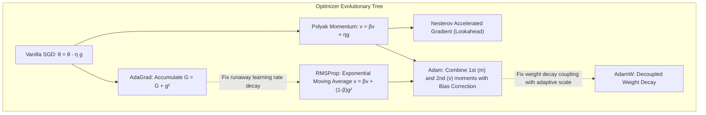
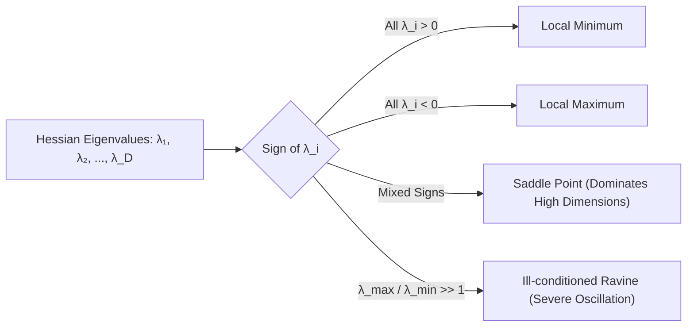
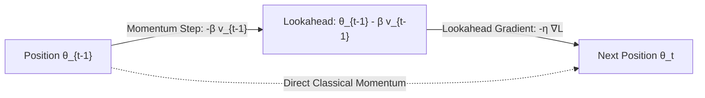
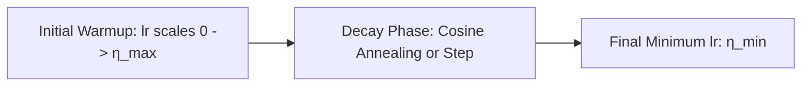

# Deep Learning Optimizers — SGD, Momentum, RMSProp, Adam & AdamW

!!! info "Prerequisites"
    Multivariate calculus and gradient descent dynamics. Review [Neural Network Foundations](neural-network-foundations-deep-dive.md), [Calculus & Optimization](../02-mathematics/calculus-optimization-deep-dive.md), and [Linear Algebra](../02-mathematics/linear-algebra-deep-dive.md).

---

## 1. The Big Picture

Training deep neural networks requires navigating highly non-convex loss surfaces in spaces with millions to billions of dimensions. In this high-dimensional regime, the primary obstacles to convergence are not local minima, but:
1. **Ill-conditioned Ravines**: Valleys where curvature is orders of magnitude steeper in some directions than others (condition number $\kappa = \frac{\lambda_{\max}(H)}{\lambda_{\min}(H)} \gg 1$), causing vanilla gradient descent to oscillate violently across walls while making negligible progress along the base.
2. **Saddle Points & Flat Plateaus**: Critical points where $\nabla \mathcal{L} = \mathbf{0}$, but the Hessian has both positive and negative eigenvalues. Escaping saddle points requires momentum or second-moment curvature compensation.
3. **Stochastic Gradient Variance**: Mini-batch sampling introduces noisy gradient estimates that destabilize parameter trajectories.

Modern deep learning optimizers solve these geometric challenges through two orthogonal mechanisms:
- **First-Moment Tracking (Momentum)**: Accumulating velocity vectors to accelerate along consistent gradient directions and cancel out high-frequency oscillations.
- **Second-Moment Adaptation (RMSProp / Adam)**: Scaling coordinate-wise step sizes inversely proportional to the historical root-mean-square gradient magnitude, equalizing update velocities across stiff and sloppy directions.



---

## 2. Optimization Geometry: Ravines, Saddles, and Condition Numbers

Let $\mathcal{L}(\boldsymbol{\theta})$ be twice continuously differentiable. A local second-order Taylor expansion around parameter vector $\boldsymbol{\theta}_t$ is:

$$
\mathcal{L}(\boldsymbol{\theta}_t + \Delta \boldsymbol{\theta}) \approx \mathcal{L}(\boldsymbol{\theta}_t) + \nabla \mathcal{L}(\boldsymbol{\theta}_t)^T \Delta \boldsymbol{\theta} + \frac{1}{2} \Delta \boldsymbol{\theta}^T H(\boldsymbol{\theta}_t) \Delta \boldsymbol{\theta}
$$

where $H = \nabla^2 \mathcal{L}(\boldsymbol{\theta}_t) \in \mathbb{R}^{D \times D}$ is the Hessian matrix.



### 2.1 The Condition Number of the Hessian

The condition number $\kappa$ of the Hessian measures the curvature anisotropy:

$$
\kappa = \frac{|\lambda_{\max}(H)|}{|\lambda_{\min}(H)|}
$$

In a quadratic bowl $\mathcal{L}(x, y) = \frac{1}{2}(x^2 + 100 y^2)$, $\kappa = 100$.  
For vanilla gradient descent $x_{t+1} = x_t - \eta \nabla \mathcal{L}$:
- To prevent divergence along the stiff $y$-direction, the step size must satisfy $\eta < \frac{2}{\lambda_{\max}} = \frac{2}{100} = 0.02$.
- But along the flat $x$-direction, convergence proceeds at rate $(1 - \eta \lambda_{\min}) = (1 - 0.02 \times 1) = 0.98$.
- It takes hundreds of iterations to traverse the ravine!

---

## 3. Stochastic Gradient Descent with Classical Momentum

### 3.1 Physical Analogy: The Heavy Ball with Friction

Boris Polyak (1964) introduced the **Heavy Ball method**, modeling parameter optimization as a particle of mass $m$ rolling down a potential energy surface $\mathcal{L}(\boldsymbol{\theta})$ under physical gravity and viscous damping (friction coefficient $\gamma$):

$$
m \frac{d^2 \boldsymbol{\theta}}{dt^2} + \gamma \frac{d\boldsymbol{\theta}}{dt} = -\nabla \mathcal{L}(\boldsymbol{\theta})
$$

Discretizing using backward differences yields the **Classical Momentum** recurrence:

$$
\mathbf{v}_t = \beta \mathbf{v}_{t-1} + \eta \mathbf{g}_t
$$

$$
\boldsymbol{\theta}_t = \boldsymbol{\theta}_{t-1} - \mathbf{v}_t
$$

where:
- $\mathbf{g}_t = \nabla \mathcal{L}(\boldsymbol{\theta}_{t-1})$ is the current gradient.
- $\mathbf{v}_t$ is the velocity vector.
- $\beta \in [0, 1)$ is the momentum decay factor (typically $\beta = 0.9$).
- $\eta > 0$ is the learning rate.

### 3.2 Effective Step Size in Consistent Directions

Expanding $\mathbf{v}_t$ recursively as a geometric series:

$$
\mathbf{v}_t = \eta \sum_{k=0}^{t-1} \beta^k \mathbf{g}_{t-k}
$$

If the gradient points persistently in the same direction ($\mathbf{g}_k \approx \mathbf{g}$), the effective velocity reaches steady-state terminal velocity:

$$
\mathbf{v}_{\infty} = \eta \mathbf{g} \sum_{k=0}^{\infty} \beta^k = \frac{\eta}{1 - \beta} \mathbf{g}
$$

For $\beta = 0.9$, the effective step size is amplified by a factor of $\frac{1}{1 - 0.9} = 10\times$.  
Conversely, in oscillating directions where $\mathbf{g}_t$ alternates signs ($+g, -g, +g, -g$), the successive terms cancel out, effectively dampening oscillations across the ravine walls.

---

## 4. Nesterov Accelerated Gradient (NAG)

Yurii Nesterov (1983) observed that classical momentum calculates the gradient at the current position $\boldsymbol{\theta}_{t-1}$ before applying the accumulated velocity $\beta \mathbf{v}_{t-1}$.

Instead, **Nesterov Accelerated Gradient** makes a "lookahead" jump along the velocity vector first, and evaluates the gradient at the projected point $\boldsymbol{\theta}_{t-1} - \beta \mathbf{v}_{t-1}$:

$$
\mathbf{g}_t^{\text{lookahead}} = \nabla \mathcal{L}(\boldsymbol{\theta}_{t-1} - \beta \mathbf{v}_{t-1})
$$

$$
\mathbf{v}_t = \beta \mathbf{v}_{t-1} + \eta \mathbf{g}_t^{\text{lookahead}}
$$

$$
\boldsymbol{\theta}_t = \boldsymbol{\theta}_{t-1} - \mathbf{v}_t
$$



**Theoretical Convergence Advantage:**  
For convex functions with $L$-Lipschitz gradients:
- Standard Gradient Descent: convergence rate $\mathcal{O}(1/t)$.
- Classical Polyak Momentum: $\mathcal{O}(1/t)$.
- Nesterov Accelerated Gradient: $\mathcal{O}(1/t^2)$ — matching the optimal theoretical lower bound for first-order black-box optimization.

---

## 5. Adaptive Learning Rate Methods

### 5.1 AdaGrad (Duchi, Hazan, Singer, 2011)

In tasks with sparse features (e.g., NLP word embeddings), infrequent words receive rare gradient updates, while frequent words receive frequent updates. AdaGrad dynamically adapts learning rates coordinate-wise:

$$
\mathbf{s}_t = \mathbf{s}_{t-1} + \mathbf{g}_t^2 = \sum_{k=1}^t \mathbf{g}_k^2
$$

$$
\boldsymbol{\theta}_t = \boldsymbol{\theta}_{t-1} - \frac{\eta}{\sqrt{\mathbf{s}_t} + \epsilon} \odot \mathbf{g}_t
$$

where $\mathbf{g}_t^2 = \mathbf{g}_t \odot \mathbf{g}_t$ is the coordinate-wise square, and $\epsilon \approx 10^{-8}$ prevents division by zero.

**The Fatal Flaw of AdaGrad in Deep Learning:**  
Because each component of $\mathbf{s}_t$ is a sum of positive squares, $\mathbf{s}_{t, i} \ge \mathbf{s}_{t-1, i}$ monotonically grows with iteration $t$. As training progresses, $\frac{\eta}{\sqrt{\mathbf{s}_t}} \to 0$. The effective learning rate decays monotonically to zero, causing training to stall prematurely before reaching a satisfactory minimum.

### 5.2 RMSProp (Hinton, 2012)

Geoffrey Hinton proposed replacing AdaGrad's infinite historical sum with an **Exponential Moving Average (EMA)** of squared gradients, discarding distant gradient history:

$$
\mathbf{v}_t = \beta_2 \mathbf{v}_{t-1} + (1 - \beta_2) \mathbf{g}_t^2
$$

$$
\boldsymbol{\theta}_t = \boldsymbol{\theta}_{t-1} - \frac{\eta}{\sqrt{\mathbf{v}_t} + \epsilon} \odot \mathbf{g}_t
$$

where $\beta_2 \in [0.9, 0.999]$ (typically $\beta_2 = 0.99$).  
Because $\mathbf{v}_t$ tracks a localized temporal average of squared gradients:
- Directions with consistently large gradients have large $\sqrt{\mathbf{v}_{t, i}}$, scaling down their effective step size.
- Directions with tiny gradients have small $\sqrt{\mathbf{v}_{t, i}}$, scaling up their effective step size.
- The condition number is effectively equalized without the premature decay of AdaGrad.

---

## 6. Adam: Adaptive Moment Estimation (Kingma & Ba, 2015)

Adam combines the benefits of **Momentum** (first moment of gradients) and **RMSProp** (uncentered second moment of gradients), enhanced with analytical **bias correction** to compensate for zero initialization.

### 6.1 Algorithmic Formulation

At iteration step $t \ge 1$:
1. **Compute Mini-batch Gradient**:
   $$\mathbf{g}_t = \nabla_{\boldsymbol{\theta}} \mathcal{L}_t(\boldsymbol{\theta}_{t-1})$$
2. **Update Biased First Moment (Velocity)**:
   $$\mathbf{m}_t = \beta_1 \mathbf{m}_{t-1} + (1 - \beta_1) \mathbf{g}_t$$
3. **Update Biased Second Raw Moment (Squared Gradient EMA)**:
   $$\mathbf{v}_t = \beta_2 \mathbf{v}_{t-1} + (1 - \beta_2) \mathbf{g}_t^2$$
4. **Compute Bias-Corrected Moments**:
   $$\widehat{\mathbf{m}}_t = \frac{\mathbf{m}_t}{1 - \beta_1^t}, \qquad \widehat{\mathbf{v}}_t = \frac{\mathbf{v}_t}{1 - \beta_2^t}$$
5. **Update Parameters**:
   $$\boldsymbol{\theta}_t = \boldsymbol{\theta}_{t-1} - \frac{\eta}{\sqrt{\widehat{\mathbf{v}}_t} + \epsilon} \odot \widehat{\mathbf{m}}_t$$

Standard default hyperparameters: $\eta = 0.001$, $\beta_1 = 0.9$, $\beta_2 = 0.999$, $\epsilon = 10^{-8}$.

### 6.2 Mathematical Proof of Bias Correction

Because $\mathbf{m}_0 = \mathbf{0}$ and $\mathbf{v}_0 = \mathbf{0}$, the moving averages are heavily biased toward zero during the initial iterations.

**Proof for First Moment $\widehat{\mathbf{m}}_t$:**  
Unrolling the recurrence from $\mathbf{m}_0 = \mathbf{0}$:

$$
\mathbf{m}_t = (1 - \beta_1) \sum_{i=1}^t \beta_1^{t-i} \mathbf{g}_i
$$

Taking the expectation $\mathbb{E}[\mathbf{m}_t]$, assuming the true gradient expectation $\mathbb{E}[\mathbf{g}_i] = \mathbb{E}[\mathbf{g}_t]$ is approximately stationary over the local window:

$$
\mathbb{E}[\mathbf{m}_t] = \mathbb{E}\left[ (1 - \beta_1) \sum_{i=1}^t \beta_1^{t-i} \mathbf{g}_i \right] \approx \mathbb{E}[\mathbf{g}_t] (1 - \beta_1) \sum_{i=1}^t \beta_1^{t-i}
$$

The finite geometric series sum is:

$$
\sum_{i=1}^t \beta_1^{t-i} = \sum_{k=0}^{t-1} \beta_1^k = \frac{1 - \beta_1^t}{1 - \beta_1}
$$

Substituting this into the expectation:

$$
\mathbb{E}[\mathbf{m}_t] = \mathbb{E}[\mathbf{g}_t] (1 - \beta_1) \left( \frac{1 - \beta_1^t}{1 - \beta_1} \right) = \mathbb{E}[\mathbf{g}_t] (1 - \beta_1^t)
$$

Notice that $\mathbb{E}[\mathbf{m}_t] \ne \mathbb{E}[\mathbf{g}_t]$. To make the estimator strictly unbiased ($\mathbb{E}[\widehat{\mathbf{m}}_t] = \mathbb{E}[\mathbf{g}_t]$), we must divide by $(1 - \beta_1^t)$:

$$
\widehat{\mathbf{m}}_t = \frac{\mathbf{m}_t}{1 - \beta_1^t} \implies \mathbb{E}[\widehat{\mathbf{m}}_t] = \frac{\mathbb{E}[\mathbf{m}_t]}{1 - \beta_1^t} = \mathbb{E}[\mathbf{g}_t] \quad \blacksquare
$$

The exact same proof applies to the second moment $\mathbf{v}_t$, giving correction factor $\frac{1}{1 - \beta_2^t}$.  
As $t \to \infty$, $\beta_1^t \to 0$ and $\beta_2^t \to 0$, so the correction factor smoothly converges to $1$.

---

## 7. AdamW: Decoupling Weight Decay (Loshchilov & Hutter, 2019)

### 7.1 Why Standard $L_2$ Regularization Fails in Adam

In standard SGD, adding an $L_2$ penalty $\frac{1}{2}\lambda \|\boldsymbol{\theta}\|_2^2$ to the loss function $\mathcal{L}(\boldsymbol{\theta})$ produces:

$$
\nabla \mathcal{L}_{\text{reg}}(\boldsymbol{\theta}) = \mathbf{g}_t + \lambda \boldsymbol{\theta}_{t-1}
$$

The parameter update is:

$$
\boldsymbol{\theta}_t = \boldsymbol{\theta}_{t-1} - \eta (\mathbf{g}_t + \lambda \boldsymbol{\theta}_{t-1}) = (1 - \eta \lambda)\boldsymbol{\theta}_{t-1} - \eta \mathbf{g}_t
$$

Here, $L_2$ regularization is strictly mathematically identical to **Weight Decay** (multiplying the weights by $(1 - \eta \lambda)$ at each step).

However, in **Adam**, standard frameworks historically passed $\nabla \mathcal{L}_{\text{reg}} = \mathbf{g}_t + \lambda \boldsymbol{\theta}_{t-1}$ directly into Adam's moment accumulators:

$$
\mathbf{m}_t = \beta_1 \mathbf{m}_{t-1} + (1 - \beta_1)(\mathbf{g}_t + \lambda \boldsymbol{\theta}_{t-1})
$$

$$
\mathbf{v}_t = \beta_2 \mathbf{v}_{t-1} + (1 - \beta_2)(\mathbf{g}_t + \lambda \boldsymbol{\theta}_{t-1})^2
$$

The parameter update becomes:

$$
\boldsymbol{\theta}_t = \boldsymbol{\theta}_{t-1} - \frac{\eta}{\sqrt{\widehat{\mathbf{v}}_t} + \epsilon} \widehat{\mathbf{m}}_t \approx \boldsymbol{\theta}_{t-1} - \frac{\eta \lambda}{\sqrt{\widehat{\mathbf{v}}_t} + \epsilon} \boldsymbol{\theta}_{t-1} - \frac{\eta}{\sqrt{\widehat{\mathbf{v}}_t} + \epsilon} \widehat{\mathbf{g}}_t
$$

**The Catastrophic Breakdown:**
1. Parameters with **large gradients** have large $\widehat{\mathbf{v}}_t$, causing the regularizing penalty $\frac{\eta \lambda}{\sqrt{\widehat{\mathbf{v}}_t}}$ to be **diminished**.
2. Parameters with **small gradients** have tiny $\widehat{\mathbf{v}}_t$, causing their regularization penalty to be **heavily magnified**.
3. $L_2$ regularization in Adam regularizes weights with small gradients much more intensely than weights with large gradients—the exact opposite of intended shrinkage!

### 7.2 The AdamW Algorithm

Ilya Loshchilov and Frank Hutter resolved this in 2019 by **decoupling** weight decay from the gradient update:

$$
\mathbf{m}_t = \beta_1 \mathbf{m}_{t-1} + (1 - \beta_1)\mathbf{g}_t
$$

$$
\mathbf{v}_t = \beta_2 \mathbf{v}_{t-1} + (1 - \beta_2)\mathbf{g}_t^2
$$

$$
\boldsymbol{\theta}_t = \boldsymbol{\theta}_{t-1} - \eta_t \lambda \boldsymbol{\theta}_{t-1} - \frac{\eta_t}{\sqrt{\widehat{\mathbf{v}}_t} + \epsilon} \widehat{\mathbf{m}}_t
$$

AdamW applies true weight decay directly to the weights, preserving uniform regularization across all coordinates regardless of their gradient magnitude. Today, AdamW is the universal standard optimizer for training Transformers, LLMs, and modern vision backbones.

---

## 8. Learning Rate Schedules & Warmup Dynamics



### 8.1 Common Schedules

1. **Step Decay**:
   $$\eta_t = \eta_0 \cdot \gamma^{\lfloor t / S \rfloor}, \quad \gamma \in [0.1, 0.5]$$
2. **Cosine Annealing (Loshchilov & Hutter, 2016)**:
   $$\eta_t = \eta_{\min} + \frac{1}{2}(\eta_{\max} - \eta_{\min}) \left( 1 + \cos\left( \frac{t}{T_{\max}} \pi \right) \right)$$
3. **Linear Warmup**:
   For the first $T_{\text{warmup}}$ steps (typically $1\%$ to $5\%$ of total iterations):
   $$\eta_t = \eta_{\max} \cdot \frac{t}{T_{\text{warmup}}}$$
   **Why Warmup is Essential**: In early training iterations, gradient moments $\mathbf{m}_t$ and $\mathbf{v}_t$ have high stochastic variance, and initial weights are far from any basin. A large initial learning rate induces catastrophic gradient explosions that destroy pretrained representations or diverge.

---

## 9. Implementation 1 — Modular Optimizer Suite from Scratch (Pure NumPy)

The following production-grade Python script implements a complete modular optimizer suite (`SGDWithMomentum`, `RMSProp`, `Adam`, `AdamW`) from first principles in pure NumPy, and tests them on the challenging non-convex **Beale Benchmark Function**:

$$
f(x, y) = (1.5 - x + xy)^2 + (2.25 - x + xy^2)^2 + (2.625 - x + xy^3)^2
$$

with global minimum $f(3, 0.5) = 0$.

```python
"""
scratch_optimizers.py
Complete Modular Deep Learning Optimizer Suite in pure NumPy:
SGD (Momentum/NAG), RMSProp, Adam, and AdamW.
"""

import numpy as np
from typing import Dict, List, Tuple


class Optimizer:
    def __init__(self, params: List[np.ndarray], lr: float = 0.001):
        self.params = params
        self.lr = lr
        self.step_count = 0

    def zero_grad(self):
        pass

    def step(self, grads: List[np.ndarray]):
        raise NotImplementedError


class SGDMomentum(Optimizer):
    """
    Stochastic Gradient Descent with Classical Momentum or Nesterov Momentum.
    """
    def __init__(self, params: List[np.ndarray], lr: float = 0.01, momentum: float = 0.9, nesterov: bool = False):
        super().__init__(params, lr)
        self.momentum = momentum
        self.nesterov = nesterov
        self.velocities = [np.zeros_like(p) for p in self.params]

    def step(self, grads: List[np.ndarray]):
        self.step_count += 1
        for p, g, v in zip(self.params, grads, self.velocities):
            # v = beta * v + g
            v[:] = self.momentum * v + g
            if self.nesterov:
                step_val = self.momentum * v + g
            else:
                step_val = v
            p -= self.lr * step_val


class RMSProp(Optimizer):
    """
    RMSProp with exponential moving average of squared gradients.
    """
    def __init__(self, params: List[np.ndarray], lr: float = 0.001, alpha: float = 0.99, eps: float = 1e-8):
        super().__init__(params, lr)
        self.alpha = alpha
        self.eps = eps
        self.sq_avg = [np.zeros_like(p) for p in self.params]

    def step(self, grads: List[np.ndarray]):
        self.step_count += 1
        for p, g, s in zip(self.params, grads, self.sq_avg):
            s[:] = self.alpha * s + (1.0 - self.alpha) * (g ** 2)
            p -= self.lr * g / (np.sqrt(s) + self.eps)


class Adam(Optimizer):
    """
    Standard Adam with first and second moment bias correction.
    """
    def __init__(
        self,
        params: List[np.ndarray],
        lr: float = 0.001,
        betas: Tuple[float, float] = (0.9, 0.999),
        eps: float = 1e-8,
        weight_decay: float = 0.0,
    ):
        super().__init__(params, lr)
        self.beta1, self.beta2 = betas
        self.eps = eps
        self.weight_decay = weight_decay
        self.m = [np.zeros_like(p) for p in self.params]
        self.v = [np.zeros_like(p) for p in self.params]

    def step(self, grads: List[np.ndarray]):
        self.step_count += 1
        t = self.step_count
        for p, g, m, v in zip(self.params, grads, self.m, self.v):
            grad = g.copy()
            if self.weight_decay > 0.0:
                # Coupled L2 penalty added to gradient
                grad += self.weight_decay * p

            # Biased moments
            m[:] = self.beta1 * m + (1.0 - self.beta1) * grad
            v[:] = self.beta2 * v + (1.0 - self.beta2) * (grad ** 2)

            # Bias correction
            m_hat = m / (1.0 - self.beta1 ** t)
            v_hat = v / (1.0 - self.beta2 ** t)

            # Update
            p -= self.lr * m_hat / (np.sqrt(v_hat) + self.eps)


class AdamW(Optimizer):
    """
    AdamW with decoupled weight decay.
    """
    def __init__(
        self,
        params: List[np.ndarray],
        lr: float = 0.001,
        betas: Tuple[float, float] = (0.9, 0.999),
        eps: float = 1e-8,
        weight_decay: float = 0.01,
    ):
        super().__init__(params, lr)
        self.beta1, self.beta2 = betas
        self.eps = eps
        self.weight_decay = weight_decay
        self.m = [np.zeros_like(p) for p in self.params]
        self.v = [np.zeros_like(p) for p in self.params]

    def step(self, grads: List[np.ndarray]):
        self.step_count += 1
        t = self.step_count
        for p, g, m, v in zip(self.params, grads, self.m, self.v):
            # 1. Decoupled weight decay applied directly to weights
            if self.weight_decay > 0.0:
                p -= self.lr * self.weight_decay * p

            # 2. Gradient moments computed exclusively on pure objective gradient
            m[:] = self.beta1 * m + (1.0 - self.beta1) * g
            v[:] = self.beta2 * v + (1.0 - self.beta2) * (g ** 2)

            # 3. Bias correction
            m_hat = m / (1.0 - self.beta1 ** t)
            v_hat = v / (1.0 - self.beta2 ** t)

            # 4. Adaptive update
            p -= self.lr * m_hat / (np.sqrt(v_hat) + self.eps)


# --------------------------------------------------------------------------
# Benchmark: Non-Convex Beale Function Optimization
# --------------------------------------------------------------------------
def beale(x: float, y: float) -> float:
    return (1.5 - x + x*y)**2 + (2.25 - x + x*(y**2))**2 + (2.625 - x + x*(y**3))**2


def grad_beale(x: float, y: float) -> Tuple[float, float]:
    df_dx = (
        2 * (1.5 - x + x*y) * (-1 + y)
        + 2 * (2.25 - x + x*(y**2)) * (-1 + y**2)
        + 2 * (2.625 - x + x*(y**3)) * (-1 + y**3)
    )
    df_dy = (
        2 * (1.5 - x + x*y) * x
        + 2 * (2.25 - x + x*(y**2)) * (2 * x * y)
        + 2 * (2.625 - x + x*(y**3)) * (3 * x * (y**2))
    )
    return df_dx, df_dy


def test_optimizers_on_beale():
    start_point = np.array([1.0, 1.5], dtype=np.float64)  # starting point
    target = np.array([3.0, 0.5])

    opt_classes = [
        ("SGD+Momentum", lambda p: SGDMomentum([p], lr=0.005, momentum=0.9)),
        ("RMSProp",      lambda p: RMSProp([p], lr=0.02, alpha=0.99)),
        ("Adam",         lambda p: Adam([p], lr=0.05)),
        ("AdamW",        lambda p: AdamW([p], lr=0.05, weight_decay=0.0)),
    ]

    print("=== Optimizing Non-Convex Beale Surface (Target: x=3.0, y=0.5, Loss=0.0) ===")
    for name, opt_fn in opt_classes:
        point = start_point.copy()
        opt = opt_fn(point)

        for step in range(1000):
            gx, gy = grad_beale(point[0], point[1])
            # Gradient clipping to prevent overflow on steep ravine walls
            gnorm = np.hypot(gx, gy)
            if gnorm > 50.0:
                gx = gx * 50.0 / gnorm
                gy = gy * 50.0 / gnorm

            opt.step([np.array([gx, gy])])

        loss = beale(point[0], point[1])
        dist = np.linalg.norm(point - target)
        print(f"[{name:12s}] Final Point: ({point[0]:.4f}, {point[1]:.4f}) | Loss: {loss:.6f} | Dist to Target: {dist:.4f}")


if __name__ == "__main__":
    test_optimizers_on_beale()
```

---

## 10. Implementation 2 — PyTorch Optimizer Comparison & Schedulers

```python
"""
pytorch_optimizers_demo.py
Comparison of AdamW with Cosine Annealing and Warmup in PyTorch.
"""

import torch
import torch.nn as nn
from torch.optim import AdamW
from torch.optim.lr_scheduler import CosineAnnealingLR, LinearLR, SequentialLR


def run_pytorch_scheduler_demo():
    model = nn.Linear(100, 10)
    
    # 1. Standard AdamW with weight decay
    optimizer = AdamW(model.parameters(), lr=1e-3, weight_decay=1e-2, betas=(0.9, 0.999))

    # 2. Linear warmup for 10 epochs followed by Cosine Annealing for 90 epochs
    total_epochs = 100
    warmup_epochs = 10
    
    scheduler_warmup = LinearLR(optimizer, start_factor=0.01, end_factor=1.0, total_iters=warmup_epochs)
    scheduler_cosine = CosineAnnealingLR(optimizer, T_max=(total_epochs - warmup_epochs), eta_min=1e-6)
    
    scheduler = SequentialLR(
        optimizer,
        schedulers=[scheduler_warmup, scheduler_cosine],
        milestones=[warmup_epochs]
    )

    print("Epoch | Learning Rate")
    print("---------------------")
    for epoch in range(total_epochs):
        # Fake training step
        optimizer.step()
        
        if epoch in (0, 5, 9, 10, 25, 50, 75, 99):
            current_lr = optimizer.param_groups[0]["lr"]
            print(f"{epoch:5d} | {current_lr:.6e}")
            
        scheduler.step()


if __name__ == "__main__":
    run_pytorch_scheduler_demo()
```

---

## 11. Common Errors, Gotchas & Debugging

### 1. Using Standard `torch.optim.Adam` with `weight_decay > 0`

**Symptom**: Model performance drops significantly relative to published baselines when training Vision Transformers or LLMs.  
**Root Cause**: In PyTorch, `torch.optim.Adam(..., weight_decay=1e-2)` implements $L_2$ regularization inside the gradient moments, whereas `torch.optim.AdamW` implements decoupled weight decay.  
**Fix**: Always import and use `torch.optim.AdamW` for Transformers and modern architectures.

```python
# BROKEN / SUBOPTIMAL FOR TRANSFORMERS
optimizer = torch.optim.Adam(model.parameters(), lr=1e-4, weight_decay=0.01)

# FIXED
optimizer = torch.optim.AdamW(model.parameters(), lr=1e-4, weight_decay=0.01)
```

### 2. Applying Weight Decay to Biases and Normalization Parameters

**Symptom**: Model underfits or LayerNorm/BatchNorm layers fail to rescale representations adequately.  
**Root Cause**: Biases and normalization scale/shift parameters ($\gamma, \beta$) have dimension $\mathcal{O}(D)$ rather than $\mathcal{O}(D^2)$ and act as scale compensators. Regularizing them toward zero constrains layer dynamics unnecessarily.  
**Fix**: Filter parameter groups to apply weight decay strictly to 2D weight matrices (convolutions, linear projections), setting `weight_decay=0.0` for 1D vectors (biases, layernorm).

```python
def configure_optimizers(model, weight_decay=0.01, lr=1e-3):
    decay_params = []
    no_decay_params = []
    for name, param in model.named_parameters():
        if not param.requires_grad:
            continue
        if param.ndim >= 2:
            decay_params.append(param)
        else:
            no_decay_params.append(param)

    optim_groups = [
        {"params": decay_params, "weight_decay": weight_decay},
        {"params": no_decay_params, "weight_decay": 0.0},
    ]
    return torch.optim.AdamW(optim_groups, lr=lr)
```

### 3. Missing `scheduler.step()` or Stepping at the Wrong Cadence

**Symptom**: Learning rate remains frozen at initial value or drops to zero immediately.  
**Root Cause**: Some schedulers (e.g. `OneCycleLR`) expect `scheduler.step()` to be called after **every mini-batch step**, while others (e.g. `StepLR`) expect it once per **epoch**.  
**Fix**: Verify whether scheduler `total_iters` represents total steps or total epochs, and call `step()` accordingly.

---

## 12. Staff-Level Technical Interview Questions

### Q1: Prove why standard $L_2$ regularization in Adam does not behave as true weight decay, and explain how AdamW resolves this.

**Model Answer:**  
In gradient descent with objective $\mathcal{L}_0(\boldsymbol{\theta})$ and $L_2$ regularization $\frac{1}{2}\lambda \|\boldsymbol{\theta}\|_2^2$, the composite gradient is $\nabla \mathcal{L} = \mathbf{g}_t + \lambda \boldsymbol{\theta}_{t-1}$.  
Under standard Adam, this composite gradient is tracked by the second moment accumulator:

$$\mathbf{v}_t = \beta_2 \mathbf{v}_{t-1} + (1 - \beta_2)(\mathbf{g}_t + \lambda \boldsymbol{\theta}_{t-1})^2$$

The resulting parameter update is:

$$\boldsymbol{\theta}_t = \boldsymbol{\theta}_{t-1} - \frac{\eta_t}{\sqrt{\widehat{\mathbf{v}}_t} + \epsilon} \widehat{\mathbf{m}}_t$$

Assuming steady-state where $\widehat{\mathbf{m}}_t \approx \mathbf{g}_t + \lambda \boldsymbol{\theta}_{t-1}$:

$$\boldsymbol{\theta}_t \approx \boldsymbol{\theta}_{t-1} - \frac{\eta_t \lambda}{\sqrt{\widehat{\mathbf{v}}_t} + \epsilon} \boldsymbol{\theta}_{t-1} - \frac{\eta_t}{\sqrt{\widehat{\mathbf{v}}_t} + \epsilon} \mathbf{g}_t$$

Notice the effective weight decay rate for parameter $i$ is:

$$\lambda_i^{\text{eff}} = \frac{\eta_t \lambda}{\sqrt{\widehat{\mathbf{v}}_{t, i}} + \epsilon}$$

Because $\widehat{\mathbf{v}}_{t, i} \propto \mathbb{E}[g_{i}^2]$, parameters with large gradient magnitudes receive a **smaller** shrinkage factor $\lambda_i^{\text{eff}}$, while parameters with near-zero gradients receive an **enormous** shrinkage factor. This distortion completely decouples the regularizer from its intended role.  
**AdamW** decouples the shrinkage step from the gradient moments:

$$\boldsymbol{\theta}_t = (1 - \eta_t \lambda) \boldsymbol{\theta}_{t-1} - \frac{\eta_t}{\sqrt{\widehat{\mathbf{v}}_t} + \epsilon} \widehat{\mathbf{m}}_t$$

where $\widehat{\mathbf{m}}_t$ and $\widehat{\mathbf{v}}_t$ are estimated strictly on $\mathbf{g}_t = \nabla \mathcal{L}_0$. Every parameter is shrunken at the exact constant rate $\eta_t \lambda$, independent of historical gradient scale.

---

### Q2: Derive the bias correction factors $\frac{1}{1-\beta_1^t}$ and $\frac{1}{1-\beta_2^t}$ in Adam.

**Model Answer:**  
Let the first-moment EMA be initialized at $\mathbf{m}_0 = \mathbf{0}$:

$$\mathbf{m}_t = \beta_1 \mathbf{m}_{t-1} + (1 - \beta_1) \mathbf{g}_t$$

Unrolling the recurrence from $t=1$:
- $\mathbf{m}_1 = (1 - \beta_1) \mathbf{g}_1$
- $\mathbf{m}_2 = \beta_1 (1 - \beta_1) \mathbf{g}_1 + (1 - \beta_1) \mathbf{g}_2$
- By induction: $\mathbf{m}_t = (1 - \beta_1) \sum_{i=1}^t \beta_1^{t-i} \mathbf{g}_i$

Taking the mathematical expectation:

$$\mathbb{E}[\mathbf{m}_t] = \mathbb{E}\left[ (1 - \beta_1) \sum_{i=1}^t \beta_1^{t-i} \mathbf{g}_i \right]$$

Under the standard assumption that the expectation of the gradient is stationary over the recent window ($\mathbb{E}[\mathbf{g}_i] \approx \mathbb{E}[\mathbf{g}_t]$):

$$\mathbb{E}[\mathbf{m}_t] = \mathbb{E}[\mathbf{g}_t] (1 - \beta_1) \sum_{i=1}^t \beta_1^{t-i}$$

Substituting the sum of the finite geometric series $\sum_{i=1}^t \beta_1^{t-i} = \sum_{k=0}^{t-1} \beta_1^k = \frac{1 - \beta_1^t}{1 - \beta_1}$:

$$\mathbb{E}[\mathbf{m}_t] = \mathbb{E}[\mathbf{g}_t] (1 - \beta_1) \left( \frac{1 - \beta_1^t}{1 - \beta_1} \right) = \mathbb{E}[\mathbf{g}_t] (1 - \beta_1^t)$$

Because $\mathbb{E}[\mathbf{m}_t] \ne \mathbb{E}[\mathbf{g}_t]$, $\mathbf{m}_t$ is a biased estimator. To form an unbiased estimator $\widehat{\mathbf{m}}_t$ satisfying $\mathbb{E}[\widehat{\mathbf{m}}_t] = \mathbb{E}[\mathbf{g}_t]$:

$$\widehat{\mathbf{m}}_t = \frac{\mathbf{m}_t}{1 - \beta_1^t} \quad \blacksquare$$

Applying identical steps to $\mathbf{v}_t = \beta_2 \mathbf{v}_{t-1} + (1 - \beta_2) \mathbf{g}_t^2$ with stationary second moment $\mathbb{E}[\mathbf{g}_i^2] \approx \mathbb{E}[\mathbf{g}_t^2]$ yields $\widehat{\mathbf{v}}_t = \frac{\mathbf{v}_t}{1 - \beta_2^t}$.

---

### Q3: Why does Nesterov Accelerated Gradient achieve a convergence rate of $\mathcal{O}(1/t^2)$ on convex objectives while Classical Polyak Momentum only achieves $\mathcal{O}(1/t)$?

**Model Answer:**  
In Polyak Momentum:

$$\mathbf{v}_t = \beta \mathbf{v}_{t-1} + \eta \nabla \mathcal{L}(\boldsymbol{\theta}_{t-1})$$

The gradient is computed at the unprojected position $\boldsymbol{\theta}_{t-1}$. If the velocity vector $\beta \mathbf{v}_{t-1}$ is carrying the parameters toward a steep opposing wall, the optimizer takes another step along the old velocity before sensing that it has overshot the minimum, resulting in continuous oscillation and momentum damping requirements that limit convergence to $\mathcal{O}(1/t)$.  
In Nesterov Accelerated Gradient:

$$\mathbf{v}_t = \beta \mathbf{v}_{t-1} + \eta \nabla \mathcal{L}(\boldsymbol{\theta}_{t-1} - \beta \mathbf{v}_{t-1})$$

The gradient is evaluated at the projected point $\boldsymbol{\theta}_{t-1} - \beta \mathbf{v}_{t-1}$. If the projected point lands on an upward-sloping ravine wall, $\nabla \mathcal{L}(\boldsymbol{\theta}_{t-1} - \beta \mathbf{v}_{t-1})$ immediately produces a strong opposing gradient that acts as an **anticipatory brake**, actively canceling velocity before overshoot occurs. This lookahead feedback matches the optimal theoretical information-theoretic lower bound for smooth convex functions, yielding $\mathcal{O}(1/t^2)$.

---

### Q4: Explain the difference in generalization behavior between SGD with Momentum and Adam/AdamW when training deep convolutional networks.

**Model Answer:**  
Empirically, while Adam/AdamW converges significantly faster than SGD during early training epochs, **SGD with Momentum frequently achieves superior test set generalization and lower final error on vision tasks (e.g., ImageNet classification)**.  
**Mechanisms:**
1. **Geometry of Minima**: Adaptive optimizers scale step sizes by $\frac{1}{\sqrt{\mathbf{v}_t}}$, which equalizes curvature across all directions. This allows Adam to navigate narrow, high-curvature ravines and settle into sharp local minima. SGD, constrained by a uniform coordinate step size, cannot stabilize in sharp minima and is forced by stochastic noise to settle in wide, flat minima. Flat minima possess low spectral norm $\lambda_{\max}(H)$, making them robust to test-set distribution shifts.
2. **Spurious Correlation Sensitivity**: In the presence of rare, uninformative noise features with small gradients, Adam scales their effective step size up by dividing by tiny $\sqrt{v_i}$, over-indexing on non-generalizing spurious correlations. SGD naturally suppresses updates on features with small gradients.

---

### Q5: How does the condition number $\kappa(H) = \frac{\lambda_{\max}}{\lambda_{\min}}$ dictate the maximum stable learning rate for first-order gradient descent?

**Model Answer:**  
Consider a quadratic objective $\mathcal{L}(\boldsymbol{\theta}) = \frac{1}{2} \boldsymbol{\theta}^T H \boldsymbol{\theta}$. The gradient descent update is:

$$\boldsymbol{\theta}_{t} = \boldsymbol{\theta}_{t-1} - \eta H \boldsymbol{\theta}_{t-1} = (I - \eta H) \boldsymbol{\theta}_{t-1}$$

Decomposing $H$ via its eigendecomposition $H = Q \Lambda Q^T$, where $\Lambda = \text{diag}(\lambda_1, \dots, \lambda_D)$:

$$Q^T \boldsymbol{\theta}_t = (I - \eta \Lambda) Q^T \boldsymbol{\theta}_{t-1}$$

For coordinate $i$, the recurrence is:

$$u_{t, i} = (1 - \eta \lambda_i) u_{t-1, i} = (1 - \eta \lambda_i)^t u_{0, i}$$

For the system to be stable and avoid divergence to infinity ($|1 - \eta \lambda_i| < 1$ for all $i$):

$$-1 < 1 - \eta \lambda_i < 1 \implies \eta < \frac{2}{\lambda_i} \quad \forall i$$

The maximum globally stable learning rate is governed strictly by the largest eigenvalue:

$$\eta_{\max} = \frac{2}{\lambda_{\max}(H)}$$

Substituting this back into the slowest converging mode governed by $\lambda_{\min}(H)$:

$$1 - \eta_{\max} \lambda_{\min} = 1 - \frac{2 \lambda_{\min}}{\lambda_{\max}} = 1 - \frac{2}{\kappa}$$

As the condition number $\kappa \to \infty$, the contraction factor approaches $1 - 0 = 1$, causing the convergence rate along sloppy directions to grind to a halt.

---

## 13. Mastery Ladder

- [ ] **L1:** Define the condition number of the Hessian and describe how ill-conditioned ravines cause oscillations in vanilla gradient descent.
- [ ] **L2:** Write the equations for SGD with Polyak Momentum and explain the heavy ball with friction physical analogy.
- [ ] **L3:** Explain Nesterov Accelerated Gradient (NAG) and how lookahead gradient evaluation acts as an anticipatory brake.
- [ ] **L4:** Describe the AdaGrad accumulator $G_t$ and explain why its monotonically non-decreasing nature causes premature training stagnation.
- [ ] **L5:** Write the RMSProp moving average update and show how it equalizes step sizes across disparate curvature axes.
- [ ] **L6:** State the complete Adam algorithm and write out both moment updates with bias correction.
- [ ] **L7:** Prove mathematically that dividing by $(1 - \beta_1^t)$ and $(1 - \beta_2^t)$ renders Adam's moment estimators unbiased.
- [ ] **L8:** Prove why standard $L_2$ regularization fails in adaptive optimizers and derive the AdamW decoupled weight decay update.
- [ ] **L9:** Explain why linear learning rate warmup is necessary during the initial phase of training deep architectures.
- [ ] **L10:** Implement a modular optimizer suite from scratch in NumPy (SGD, RMSProp, Adam, AdamW) and benchmark on non-convex surfaces.
