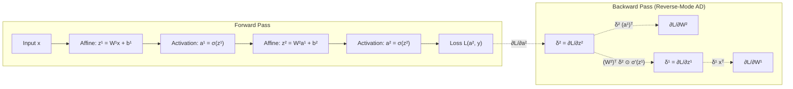
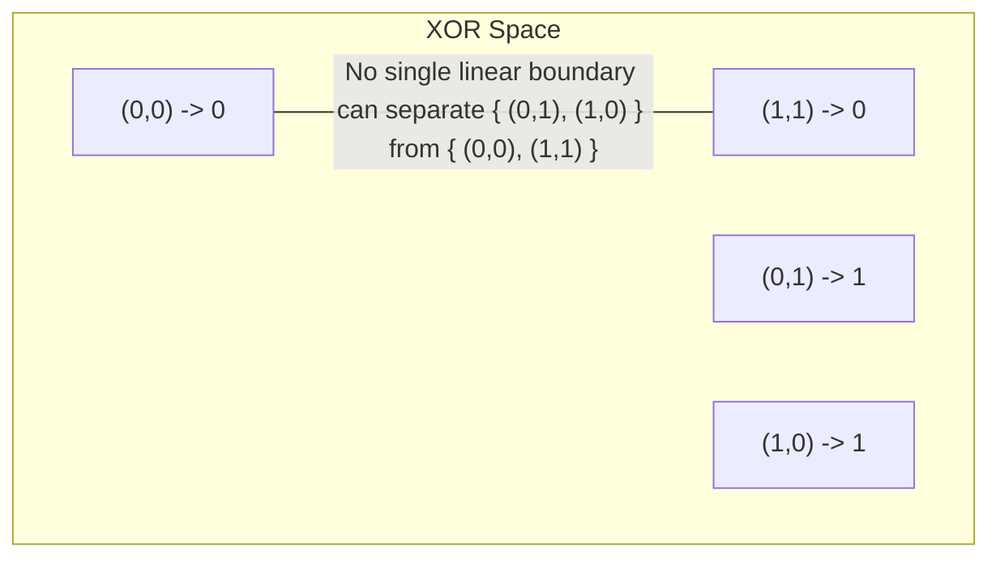
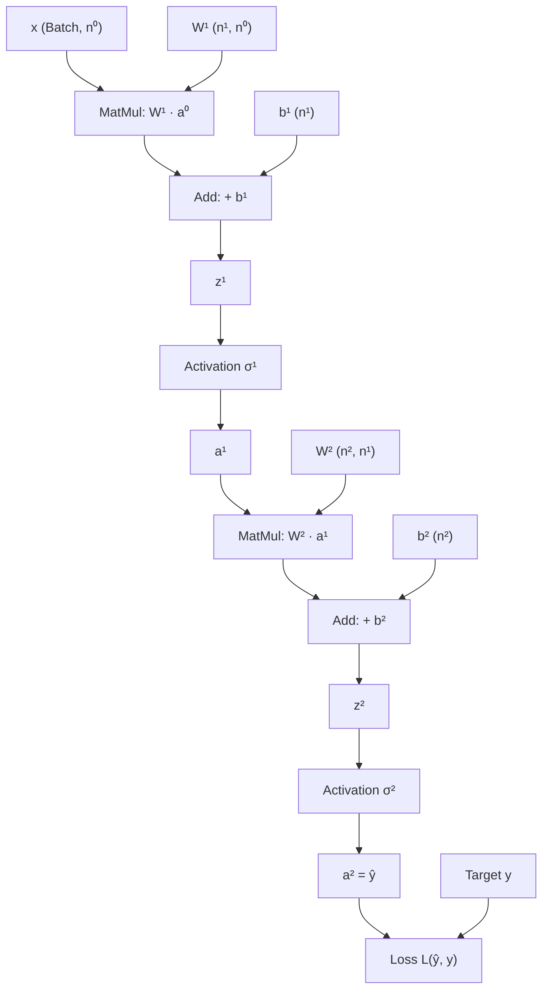
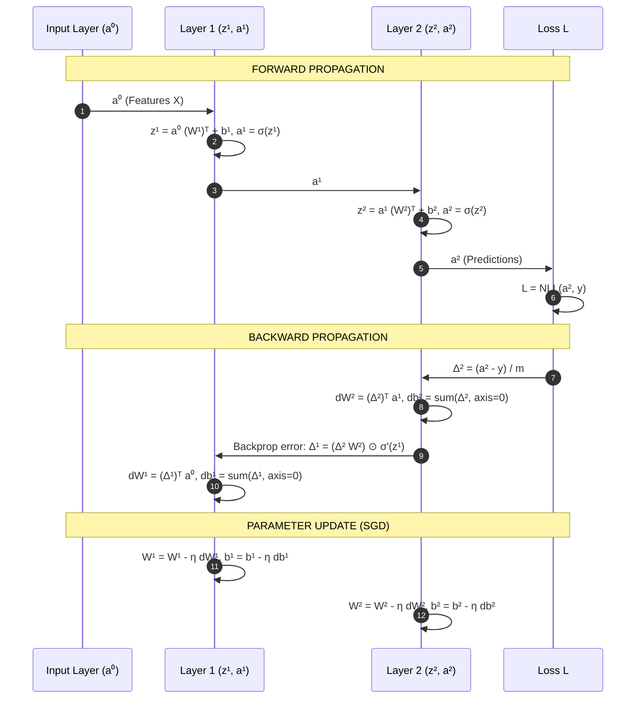

# Neural Network Foundations — From Perceptrons to Backpropagation Calculus

!!! info "Prerequisites"
    Multivariate calculus and matrix algebra. Review [Linear Algebra](../02-mathematics/linear-algebra-deep-dive.md), [Calculus & Optimization](../02-mathematics/calculus-optimization-deep-dive.md), [Probability & Statistics](../02-mathematics/probability-statistics-deep-dive.md), and [Logistic Regression](../04-classical-ml/logistic-regression-deep-dive.md).

---

## 1. The Big Picture

At its mathematical core, a deep neural network is a parameterized, differentiable directed acyclic graph (DAG) of alternating affine transformations and non-linear coordinate warps:

$$
f(\mathbf{x}; \Theta) = \left( \sigma^{[L]} \circ \mathcal{A}^{[L]} \circ \sigma^{[L-1]} \circ \mathcal{A}^{[L-1]} \circ \dots \circ \sigma^{[1]} \circ \mathcal{A}^{[1]} \right)(\mathbf{x})
$$

where each affine stage $\mathcal{A}^{[l]}(\mathbf{h}) = W^{[l]} \mathbf{h} + \mathbf{b}^{[l]}$ scales, shears, and translates space, and each non-linear activation $\sigma^{[l]}$ folds, bends, or squashes the coordinate system. Without non-linear activations, composing arbitrary numbers of affine maps collapses trivially into a single affine transformation:

$$
W^{[L]} (W^{[L-1]} \dots (W^{[1]} \mathbf{x} + \mathbf{b}^{[1]}) \dots + \mathbf{b}^{[L-1]}) + \mathbf{b}^{[L]} = \widetilde{W} \mathbf{x} + \widetilde{\mathbf{b}}
$$

Learning in neural networks is the process of adjusting the parameter tensor collection $\Theta = \{W^{[l]}, \mathbf{b}^{[l]}\}_{l=1}^L$ so that the composite map $f(\cdot; \Theta)$ transports complex, non-linearly separable input manifolds into representations where the target task (classification, regression, density estimation) becomes linearly trivial.

The engine powering this adjustment is **reverse-mode automatic differentiation**, universally known in machine learning as **backpropagation**. By computing the exact gradient of an empirical risk objective via the multivariate chain rule, backpropagation enables first-order gradient descent to optimize millions or billions of parameters simultaneously.



---

## 2. Biological Inspiration vs. Artificial Perceptron

### 2.1 The Biological Metaphor and McCulloch-Pitts (1943)

The biological neuron consists of:
- **Dendrites**: Branching filaments receiving chemical neurotransmitter inputs from adjacent axon terminals.
- **Soma (Cell Body)**: Integrates incoming post-synaptic electrical potentials over time and space.
- **Axon Hillock & Axon**: If the accumulated membrane potential exceeds a critical threshold ($\approx -55\text{ mV}$), an all-or-none action potential (spike) propagates down the myelinated axon.
- **Synapses**: Junction gaps where neurotransmitter vesicle release modulates connection strength (plasticity).

In 1943, Warren McCulloch and Walter Pitts formalized a simplified binary threshold model:

$$
y = \Theta \left( \sum_{i=1}^n w_i x_i - \theta \right)
$$

where inputs $x_i \in \{0, 1\}$, weights $w_i \in \{+1, -1\}$ represented excitatory or inhibitory synapses, and $\Theta(z)$ was the Heaviside step function:

$$
\Theta(z) = \begin{cases} 1 & \text{if } z \ge 0 \\ 0 & \text{if } z < 0 \end{cases}
$$

While capable of computing elementary Boolean logic functions (AND, OR, NOT), McCulloch-Pitts neurons had fixed, hand-crafted weights with no learning mechanism.

### 2.2 Rosenblatt's Perceptron (1958)

Frank Rosenblatt introduced real-valued adaptive weights and the first supervised update rule. Given training pairs $(\mathbf{x}, y)$ with $y \in \{-1, +1\}$:

$$
\hat{y} = \text{sign}(\mathbf{w}^T \mathbf{x} + b)
$$

If a sample $(\mathbf{x}_k, y_k)$ is misclassified ($\hat{y}_k \ne y_k$), the weights are updated along the direction of the error:

$$
\mathbf{w}^{(t+1)} = \mathbf{w}^{(t)} + \eta y_k \mathbf{x}_k, \qquad b^{(t+1)} = b^{(t)} + \eta y_k
$$

**The Novikoff Perceptron Convergence Theorem (1962):**  
If the training dataset is linearly separable with margin $\gamma = \min_k y_k \frac{\mathbf{w}^{*T} \mathbf{x}_k}{\|\mathbf{w}^*\|_2} > 0$ and bounded radius $R = \max_k \|\mathbf{x}_k\|_2$, the Perceptron algorithm is guaranteed to converge to a separating hyperplane in at most:

$$
k_{\max} \le \left( \frac{R}{\gamma} \right)^2
$$

mistakes, regardless of initialization.

### 2.3 The Minsky & Papert XOR Barrier (1969)

In their seminal 1969 monograph *Perceptrons*, Marvin Minsky and Seymour Papert proved that single-layer perceptrons are mathematically incapable of computing functions that are not linearly separable. The canonical counterexample is the binary **Exclusive-OR (XOR)** logic gate:

| $x_1$ | $x_2$ | XOR Output $y$ |
| :---: | :---: | :---: |
| 0 | 0 | 0 |
| 0 | 1 | 1 |
| 1 | 0 | 1 |
| 1 | 1 | 0 |

For a single perceptron with weights $w_1, w_2$ and bias $b$ to solve XOR, it must satisfy four simultaneous linear inequalities:

$$
\begin{aligned}
0 \cdot w_1 + 0 \cdot w_2 + b < 0 &\implies b < 0 \\
0 \cdot w_1 + 1 \cdot w_2 + b \ge 0 &\implies w_2 + b \ge 0 \\
1 \cdot w_1 + 0 \cdot w_2 + b \ge 0 &\implies w_1 + b \ge 0 \\
1 \cdot w_1 + 1 \cdot w_2 + b < 0 &\implies w_1 + w_2 + b < 0
\end{aligned}
$$

Summing the second and third inequalities yields:

$$
w_1 + w_2 + 2b \ge 0 \implies w_1 + w_2 + b \ge -b
$$

Since $b < 0$ from the first inequality, $-b > 0$, which forces $w_1 + w_2 + b > 0$. This directly contradicts the fourth inequality $w_1 + w_2 + b < 0$. No such linear hyperplane exists.



Minsky and Papert noted that multi-layer perceptrons could solve XOR, but lamented the absence of a viable mathematical algorithm to train intermediate (hidden) layers. This observation precipitated the first "AI Winter," which persisted until backpropagation was popularized in the mid-1980s.

---

## 3. Multi-Layer Architecture & Representation Capacity

### 3.1 Mathematical Formulation of Deep Networks

Consider an $L$-layer neural network (counting hidden and output layers, excluding the input layer $l=0$).
Let:
- $n^{[l]}$ denote the number of neurons in layer $l \in \{0, 1, \dots, L\}$.
- $\mathbf{a}^{[0]} = \mathbf{x} \in \mathbb{R}^{n^{[0]}}$ be the input vector.
- $W^{[l]} \in \mathbb{R}^{n^{[l]} \times n^{[l-1]}}$ be the weight matrix for layer $l$.
- $\mathbf{b}^{[l]} \in \mathbb{R}^{n^{[l]}}$ be the bias vector for layer $l$.
- $\sigma^{[l]}: \mathbb{R} \to \mathbb{R}$ be an element-wise activation function.

The forward propagation recurrences for layer $l \in \{1, \dots, L\}$ are:

$$
\mathbf{z}^{[l]} = W^{[l]} \mathbf{a}^{[l-1]} + \mathbf{b}^{[l]}
$$

$$
\mathbf{a}^{[l]} = \sigma^{[l]}(\mathbf{z}^{[l]})
$$

where $\mathbf{z}^{[l]}$ is the **pre-activation vector** and $\mathbf{a}^{[l]}$ is the **post-activation vector** (layer representation).

### 3.2 Resolving XOR via Hidden Representation

Adding a single hidden layer with 2 hidden units and ReLU activations maps the non-linearly separable XOR input into a linearly separable 2D latent space:

$$
W^{[1]} = \begin{bmatrix} 1 & 1 \\ 1 & 1 \end{bmatrix}, \quad \mathbf{b}^{[1]} = \begin{bmatrix} 0 \\ -1 \end{bmatrix}, \quad \mathbf{a}^{[1]} = \text{ReLU}(W^{[1]} \mathbf{x} + \mathbf{b}^{[1]})
$$

$$
W^{[2]} = \begin{bmatrix} 1 & -2 \end{bmatrix}, \quad b^{[2]} = 0, \quad \hat{y} = W^{[2]} \mathbf{a}^{[1]} + b^{[2]}
$$

Tracing the transformation:
- For $\mathbf{x} = [0, 0]^T$: $\mathbf{z}^{[1]} = [0, -1]^T \implies \mathbf{a}^{[1]} = [0, 0]^T \implies \hat{y} = 0$.
- For $\mathbf{x} = [1, 0]^T$: $\mathbf{z}^{[1]} = [1, 0]^T \implies \mathbf{a}^{[1]} = [1, 0]^T \implies \hat{y} = 1$.
- For $\mathbf{x} = [0, 1]^T$: $\mathbf{z}^{[1]} = [1, 0]^T \implies \mathbf{a}^{[1]} = [1, 0]^T \implies \hat{y} = 1$.
- For $\mathbf{x} = [1, 1]^T$: $\mathbf{z}^{[1]} = [2, 1]^T \implies \mathbf{a}^{[1]} = [2, 1]^T \implies \hat{y} = 1(2) - 2(1) = 0$.

The hidden layer collapses the parallel points $(1,0)$ and $(0,1)$ into the coordinate $[1,0]^T$, while folding $(1,1)$ to $[2,1]^T$, enabling a single linear output threshold to achieve 100% classification accuracy.

---

## 4. Forward Propagation & Computation Graphs

### 4.1 The Directed Acyclic Graph (DAG) View

Every deep learning framework (PyTorch `torch.autograd`, TensorFlow `tf.GradientTape`) abstracts execution as a computational DAG $\mathcal{G} = (\mathcal{V}, \mathcal{E})$:
- **Vertices $\mathcal{V}$**: Represent elementary mathematical operations ($+$, $\times$, $\exp$, $\ln$) or variables (leaf tensors).
- **Edges $\mathcal{E}$**: Directed data dependencies carrying tensor values forward and adjoint gradient tensors backward.



### 4.2 Batched Matrix Operations

In practice, neural networks operate on mini-batches of $m$ examples simultaneously to exploit GPU hardware tensor cores (SIMD parallelism).

Let $X \in \mathbb{R}^{m \times n^{[0]}}$ be the mini-batch design matrix where each row is an observation. The layerwise operations become:

$$
Z^{[l]} = A^{[l-1]} (W^{[l]})^T + \mathbf{1}_m (\mathbf{b}^{[l]})^T \in \mathbb{R}^{m \times n^{[l]}}
$$

$$
A^{[l]} = \sigma^{[l]}(Z^{[l]}) \in \mathbb{R}^{m \times n^{[l]}}
$$

where $\mathbf{1}_m \in \mathbb{R}^m$ denotes a column vector of ones representing the row-broadcasting of bias $\mathbf{b}^{[l]} \in \mathbb{R}^{n^{[l]}}$.

---

## 5. Loss Functions & Probabilistic Derivations

A loss function $\mathcal{L}(\hat{\mathbf{y}}, \mathbf{y})$ quantifies the divergence between network predictions $\hat{\mathbf{y}} = \mathbf{a}^{[L]}$ and ground truth targets $\mathbf{y}$. Deep learning loss functions are derived rigorously from the principle of **Maximum Likelihood Estimation (MLE)** under distinct distributional assumptions on the data-generating process.

### 5.1 Mean Squared Error (MSE) from Gaussian Likelihood

Assume the target scalar $y \in \mathbb{R}$ is generated by the network prediction $f(\mathbf{x}; \Theta)$ corrupted by additive zero-mean isotropic Gaussian noise:

$$
y = f(\mathbf{x}; \Theta) + \epsilon, \qquad \epsilon \sim \mathcal{N}(0, \sigma^2)
$$

The conditional probability density is:

$$
p(y | \mathbf{x}; \Theta) = \frac{1}{\sqrt{2\pi\sigma^2}} \exp \left( -\frac{(y - f(\mathbf{x}; \Theta))^2}{2\sigma^2} \right)
$$

Given an i.i.d. dataset $\mathcal{D} = \{(\mathbf{x}^{(i)}, y^{(i)})\}_{i=1}^m$, the conditional log-likelihood is:

$$
\ln p(\mathbf{y} | X; \Theta) = -\frac{m}{2} \ln(2\pi\sigma^2) - \frac{1}{2\sigma^2} \sum_{i=1}^m \left( y^{(i)} - f(\mathbf{x}^{(i)}; \Theta) \right)^2
$$

Maximizing the log-likelihood with respect to parameters $\Theta$ is mathematically identical to minimizing the **Negative Log-Likelihood (NLL)**:

$$
\mathcal{L}_{\text{MSE}}(\Theta) = \frac{1}{2m} \sum_{i=1}^m \left( \hat{y}^{(i)} - y^{(i)} \right)^2
$$

### 5.2 Binary Cross-Entropy (BCE) from Bernoulli Likelihood

For binary classification targets $y \in \{0, 1\}$, model the conditional distribution as a Bernoulli random variable parameterized by network probability $\hat{y} = \sigma(z^{[L]}) \in (0, 1)$:

$$
P(y | \mathbf{x}; \Theta) = \hat{y}^y (1 - \hat{y})^{1 - y}
$$

The sample negative log-likelihood is:

$$
\mathcal{L}_{\text{BCE}}(\hat{y}, y) = - \left[ y \ln \hat{y} + (1 - y) \ln(1 - \hat{y}) \right]
$$

Over a mini-batch of size $m$:

$$
\mathcal{L}_{\text{BCE}} = -\frac{1}{m} \sum_{i=1}^m \left[ y^{(i)} \ln \hat{y}^{(i)} + (1 - y^{(i)}) \ln(1 - \hat{y}^{(i)}) \right]
$$

### 5.3 Categorical Cross-Entropy (CCE) from Multinomial Likelihood

For multi-class classification across $K$ mutually exclusive categories, represent labels as one-hot vectors $\mathbf{y} \in \{0, 1\}^K$ ($\sum_{k=1}^K y_k = 1$). The output layer employs the **Softmax** function over raw logits $\mathbf{z}^{[L]} \in \mathbb{R}^K$:

$$
\hat{y}_k = \frac{e^{z_k^{[L]}}}{\sum_{j=1}^K e^{z_j^{[L]}}} = P(y = k | \mathbf{x})
$$

The generalized categorical likelihood for one observation is:

$$
P(\mathbf{y} | \mathbf{x}; \Theta) = \prod_{k=1}^K \hat{y}_k^{y_k}
$$

Taking the negative logarithm yields the **Categorical Cross-Entropy**:

$$
\mathcal{L}_{\text{CCE}}(\hat{\mathbf{y}}, \mathbf{y}) = -\sum_{k=1}^K y_k \ln \hat{y}_k = -\ln \hat{y}_c
$$

where $c$ is the index of the true class ($y_c = 1$).

---

## 6. Backpropagation Calculus: The Complete Layerwise Derivation

Backpropagation is an exact, efficient implementation of the multivariate chain rule applied in reverse topological order through the computation graph.

### 6.1 The Multivariate Chain Rule and Vector-Jacobian Products (VJPs)

Let $\mathbf{z} \in \mathbb{R}^n$, $\mathbf{a} \in \mathbb{R}^p$, and scalar loss $\mathcal{L} \in \mathbb{R}$, where $\mathbf{a} = f(\mathbf{z})$ and $\mathcal{L} = g(\mathbf{a})$.  
By the multivariate chain rule, the derivative of $\mathcal{L}$ with respect to component $z_j$ is:

$$
\frac{\partial \mathcal{L}}{\partial z_j} = \sum_{k=1}^p \frac{\partial \mathcal{L}}{\partial a_k} \frac{\partial a_k}{\partial z_j}
$$

In vector notation, defining the gradient row vectors $\nabla_{\mathbf{z}} \mathcal{L} = \left[ \frac{\partial \mathcal{L}}{\partial z_1}, \dots, \frac{\partial \mathcal{L}}{\partial z_n} \right]$:

$$
\nabla_{\mathbf{z}} \mathcal{L} = \nabla_{\mathbf{a}} \mathcal{L} \cdot J_{\mathbf{a}}(\mathbf{z})
$$

where $J_{\mathbf{a}}(\mathbf{z}) \in \mathbb{R}^{p \times n}$ is the **Jacobian matrix** whose entries are $J_{kj} = \frac{\partial a_k}{\partial z_j}$.

**Why Reverse-Mode AD? Forward vs. Reverse Accumulation:**
- **Forward-mode AD**: Computes Jacobian-Vector Products (JVPs) $J \cdot \mathbf{v}$. For a network mapping $n$ inputs $\to 1$ scalar loss, forward-mode requires $n$ forward passes (one per parameter). For a modern network with $10^8$ parameters, computing the full gradient would require $10^8$ passes!
- **Reverse-mode AD (Backpropagation)**: Computes Vector-Jacobian Products (VJPs) $\mathbf{v}^T \cdot J$, starting with scalar seed $\mathbf{v} = \frac{\partial \mathcal{L}}{\partial \mathcal{L}} = 1$. It computes the exact gradient with respect to **all parameters** in a single backward pass, with compute cost bounded by $\le 3\times$ the forward pass.

### 6.2 The Error Vector $\boldsymbol{\delta}^{[l]}$

Define the canonical layer error vector $\boldsymbol{\delta}^{[l]} \in \mathbb{R}^{n^{[l]}}$ as the gradient of the scalar loss $\mathcal{L}$ with respect to the layer's pre-activation vector $\mathbf{z}^{[l]}$:

$$
\boldsymbol{\delta}^{[l]} \equiv \frac{\partial \mathcal{L}}{\partial \mathbf{z}^{[l]}} \in \mathbb{R}^{n^{[l]}}
$$

### 6.3 Step 1: Output Layer Base Case ($\boldsymbol{\delta}^{[L]}$)

#### Case A: Softmax with Categorical Cross-Entropy
Let $\hat{\mathbf{y}} = \text{softmax}(\mathbf{z}^{[L]})$ and $\mathcal{L} = -\sum_{k=1}^K y_k \ln \hat{y}_k$.  
Recall the Jacobian of the softmax transformation:

$$
\frac{\partial \hat{y}_k}{\partial z_j^{[L]}} = \begin{cases} \hat{y}_k (1 - \hat{y}_k) & \text{if } k = j \\ -\hat{y}_k \hat{y}_j & \text{if } k \ne j \end{cases} = \hat{y}_k (\delta_{kj} - \hat{y}_j)
$$

where $\delta_{kj}$ is the Kronecker delta.  
Applying the multivariate chain rule:

$$
\begin{aligned}
\delta_j^{[L]} = \frac{\partial \mathcal{L}}{\partial z_j^{[L]}} &= \sum_{k=1}^K \frac{\partial \mathcal{L}}{\partial \hat{y}_k} \frac{\partial \hat{y}_k}{\partial z_j^{[L]}} \\
&= \sum_{k=1}^K \left( -\frac{y_k}{\hat{y}_k} \right) \left[ \hat{y}_k (\delta_{kj} - \hat{y}_j) \right] \\
&= -\sum_{k=1}^K y_k (\delta_{kj} - \hat{y}_j) \\
&= -y_j + \hat{y}_j \sum_{k=1}^K y_k
\end{aligned}
$$

Because target $\mathbf{y}$ is a probability distribution ($\sum_{k=1}^K y_k = 1$):

$$
\boldsymbol{\delta}^{[L]} = \hat{\mathbf{y}} - \mathbf{y}
$$

#### Case B: Sigmoid with Binary Cross-Entropy
Similarly, let $\hat{y} = \sigma(z^{[L]})$ and $\mathcal{L} = -[y \ln \hat{y} + (1-y)\ln(1-\hat{y})]$.  
Using $\sigma'(z) = \sigma(z)(1-\sigma(z))$:

$$
\delta^{[L]} = \frac{\partial \mathcal{L}}{\partial z^{[L]}} = \left( -\frac{y}{\hat{y}} + \frac{1-y}{1-\hat{y}} \right) \hat{y}(1-\hat{y}) = -y(1-\hat{y}) + (1-y)\hat{y} = \hat{y} - y
$$

In both canonical exponential-family configurations, the non-linear derivative terms cancel out, leaving a linear residual $\hat{\mathbf{y}} - \mathbf{y}$.

### 6.4 Step 2: Layerwise Error Backpropagation ($\boldsymbol{\delta}^{[l-1]}$ from $\boldsymbol{\delta}^{[l]}$)

Assume we know $\boldsymbol{\delta}^{[l]} = \frac{\partial \mathcal{L}}{\partial \mathbf{z}^{[l]}}$. We want to compute $\boldsymbol{\delta}^{[l-1]} = \frac{\partial \mathcal{L}}{\partial \mathbf{z}^{[l-1]}}$.  
Notice that $\mathbf{z}^{[l-1]}$ influences $\mathcal{L}$ only through $\mathbf{a}^{[l-1]}$, which in turn influences $\mathbf{z}^{[l]}$:

$$
\mathbf{z}^{[l-1]} \xrightarrow{\sigma^{[l-1]}} \mathbf{a}^{[l-1]} \xrightarrow{W^{[l]}, \mathbf{b}^{[l]}} \mathbf{z}^{[l]} \to \dots \to \mathcal{L}
$$

By the chain rule:

$$
\frac{\partial \mathcal{L}}{\partial a_j^{[l-1]}} = \sum_{k=1}^{n^{[l]}} \frac{\partial \mathcal{L}}{\partial z_k^{[l]}} \frac{\partial z_k^{[l]}}{\partial a_j^{[l-1]}}
$$

From the forward affine relation $z_k^{[l]} = \sum_{p=1}^{n^{[l-1]}} W_{kp}^{[l]} a_p^{[l-1]} + b_k^{[l]}$, we have:

$$
\frac{\partial z_k^{[l]}}{\partial a_j^{[l-1]}} = W_{kj}^{[l]} = (W^{[l]T})_{jk}
$$

Therefore:

$$
\frac{\partial \mathcal{L}}{\partial \mathbf{a}^{[l-1]}} = (W^{[l]})^T \boldsymbol{\delta}^{[l]}
$$

Now, connecting $\mathbf{a}^{[l-1]} = \sigma^{[l-1]}(\mathbf{z}^{[l-1]})$. Because $\sigma$ is an element-wise scalar function, $\frac{\partial a_j^{[l-1]}}{\partial z_p^{[l-1]}} = 0$ for all $j \ne p$:

$$
\delta_j^{[l-1]} = \frac{\partial \mathcal{L}}{\partial z_j^{[l-1]}} = \frac{\partial \mathcal{L}}{\partial a_j^{[l-1]}} \frac{d a_j^{[l-1]}}{d z_j^{[l-1]}} = \left[ (W^{[l]})^T \boldsymbol{\delta}^{[l]} \right]_j \cdot \sigma'^{[l-1]}(z_j^{[l-1]})
$$

In vector notation, where $\odot$ denotes the Hadamard (element-wise) product:

$$
\boldsymbol{\delta}^{[l-1]} = \left( (W^{[l]})^T \boldsymbol{\delta}^{[l]} \right) \odot \sigma'^{[l-1]}(\mathbf{z}^{[l-1]})
$$

### 6.5 Step 3: Parameter Gradients ($\frac{\partial \mathcal{L}}{\partial W^{[l]}}$ and $\frac{\partial \mathcal{L}}{\partial \mathbf{b}^{[l]}}$)

Now we compute gradients with respect to the trainable weights and biases of layer $l$:

$$
\frac{\partial \mathcal{L}}{\partial W_{jk}^{[l]}} = \frac{\partial \mathcal{L}}{\partial z_j^{[l]}} \frac{\partial z_j^{[l]}}{\partial W_{jk}^{[l]}}
$$

Since $z_j^{[l]} = \sum_{p} W_{jp}^{[l]} a_p^{[l-1]} + b_j^{[l]}$, the partial derivative is:

$$
\frac{\partial z_j^{[l]}}{\partial W_{jk}^{[l]}} = a_k^{[l-1]}
$$

Substituting $\delta_j^{[l]} = \frac{\partial \mathcal{L}}{\partial z_j^{[l]}}$:

$$
\frac{\partial \mathcal{L}}{\partial W_{jk}^{[l]}} = \delta_j^{[l]} a_k^{[l-1]}
$$

Recognizing this as the outer product of the error vector with the preceding layer's activation vector:

$$
\frac{\partial \mathcal{L}}{\partial W^{[l]}} = \boldsymbol{\delta}^{[l]} (\mathbf{a}^{[l-1]})^T \in \mathbb{R}^{n^{[l]} \times n^{[l-1]}}
$$

For the bias vector $\mathbf{b}^{[l]}$:

$$
\frac{\partial z_j^{[l]}}{\partial b_k^{[l]}} = \begin{cases} 1 & \text{if } j = k \\ 0 & \text{if } j \ne k \end{cases}
$$

$$
\frac{\partial \mathcal{L}}{\partial \mathbf{b}^{[l]}} = \boldsymbol{\delta}^{[l]} \in \mathbb{R}^{n^{[l]}}
$$

### 6.6 Step 4: Batched Matrix Formulation

For a mini-batch of $m$ examples with design matrix $X \in \mathbb{R}^{m \times n^{[0]}}$, let:
- $Z^{[l]} \in \mathbb{R}^{m \times n^{[l]}}$
- $A^{[l]} \in \mathbb{R}^{m \times n^{[l]}}$
- $\Delta^{[l]} = \frac{\partial \mathcal{L}}{\partial Z^{[l]}} \in \mathbb{R}^{m \times n^{[l]}}$

The batched gradient update formulas are:

$$
\Delta^{[L]} = \frac{1}{m} (A^{[L]} - Y) \quad \text{(for Softmax/Cross-Entropy or Sigmoid/BCE)}
$$

$$
\Delta^{[l-1]} = \left( \Delta^{[l]} W^{[l]} \right) \odot \sigma'^{[l-1]}(Z^{[l-1]})
$$

$$
\frac{\partial \mathcal{L}}{\partial W^{[l]}} = (\Delta^{[l]})^T A^{[l-1]} \in \mathbb{R}^{n^{[l]} \times n^{[l-1]}}
$$

$$
\frac{\partial \mathcal{L}}{\partial \mathbf{b}^{[l]}} = \sum_{i=1}^m \Delta_{i, :}^{[l]} = (\Delta^{[l]})^T \mathbf{1}_m \in \mathbb{R}^{n^{[l]}}
$$



---

## 7. Gradient Descent Variants & Noise Dynamics

Optimization updates model parameters $\Theta \in \mathbb{R}^D$ using estimated gradients of the empirical risk $\mathcal{R}(\Theta) = \frac{1}{N} \sum_{i=1}^N \mathcal{L}_i(\Theta)$:

$$
\Theta_{t+1} = \Theta_t - \eta \mathbf{g}_t
$$

### 7.1 Taxonomy of Gradient Estimators

| Algorithm | Batch Size $m$ | Compute per Step | Memory Footprint | Gradient Variance $\text{Var}(\mathbf{g})$ | Convergence Rate (Convex) |
| :--- | :---: | :---: | :---: | :---: | :---: |
| **Batch GD** | $N$ (Full dataset) | $O(N \cdot D)$ | $O(N)$ | $0$ (Exact gradient) | $O(1/t)$ |
| **Stochastic GD (SGD)** | $1$ (Single sample) | $O(D)$ | $O(1)$ | High ($\sigma^2$) | $O(1/\sqrt{t})$ |
| **Mini-batch GD** | $32 \le m \le 4096$ | $O(m \cdot D)$ | $O(m)$ | Moderate ($\sigma^2 / m$) | $O(1/\sqrt{t})$ |

### 7.2 Gradient Noise and Escape from Saddle Points

In modern deep neural networks, the empirical loss surface is non-convex, featuring an astronomical number of saddle points where $\nabla \mathcal{L} = \mathbf{0}$ but the Hessian $H$ has both positive and negative eigenvalues.

Full-batch gradient descent gets permanently trapped or stalls indefinitely at saddle points where $\|\nabla \mathcal{L}\|_2 \approx 0$. In contrast, mini-batch gradient descent introduces stochastic noise $\boldsymbol{\xi}_t$:

$$
\mathbf{g}_t(\Theta) = \nabla \mathcal{R}(\Theta) + \boldsymbol{\xi}_t, \qquad \mathbb{E}[\boldsymbol{\xi}_t] = \mathbf{0}, \quad \text{Cov}(\boldsymbol{\xi}_t) \approx \frac{\Sigma(\Theta)}{m}
$$

This stochastic perturbation acts as an implicit Langevin diffusion process:

$$
d\Theta_t = -\nabla \mathcal{R}(\Theta_t) dt + \sqrt{\frac{2\eta}{\beta}} d\mathbf{W}_t
$$

The noise flings the optimizer out of narrow, non-generalizing saddle points and sharp ravines toward flat, broad local minima that generalize significantly better to unseen test distributions (see [Model Validation & Generalization](../05-ml-theory/model-validation-generalization-deep-dive.md)).

---

## 8. Implementation 1 — Vectorized 2-Layer MLP from Scratch (Pure NumPy)

The following production-grade implementation trains a 2-layer Multi-Layer Perceptron from first principles using pure NumPy. It includes vectorized forward propagation, analytical backpropagation, numerical gradient checking, and a demonstration on non-linearly separable XOR and concentric circles.

```python
"""
scratch_mlp.py
Vectorized 2-Layer Multi-Layer Perceptron (MLP) with Backpropagation in Pure NumPy.
"""

import numpy as np
from typing import Dict, Tuple, Optional


class Scratch2LayerMLP:
    """
    A 2-Layer Neural Network (Input -> Hidden -> Output) with exact vectorization.
    Supports Binary Cross-Entropy (BCE) and Categorical Cross-Entropy (CCE).
    """

    def __init__(
        self,
        input_dim: int,
        hidden_dim: int,
        output_dim: int,
        activation: str = "relu",
        task: str = "classification_multiclass",
        seed: int = 42,
    ):
        self.input_dim = input_dim
        self.hidden_dim = hidden_dim
        self.output_dim = output_dim
        self.activation = activation.lower()
        self.task = task
        
        rng = np.random.RandomState(seed)
        
        # He (Kaiming) initialization for ReLU, Glorot (Xavier) for Tanh/Sigmoid
        if self.activation == "relu":
            std1 = np.sqrt(2.0 / input_dim)
        else:
            std1 = np.sqrt(1.0 / input_dim)
        
        std2 = np.sqrt(2.0 / hidden_dim)

        self.params: Dict[str, np.ndarray] = {
            "W1": rng.randn(hidden_dim, input_dim) * std1,
            "b1": np.zeros((hidden_dim, 1)),
            "W2": rng.randn(output_dim, hidden_dim) * std2,
            "b2": np.zeros((output_dim, 1)),
        }

    # ----------------------------------------------------------------------
    # Activations & Derivatives
    # ----------------------------------------------------------------------
    def _activate(self, z: np.ndarray) -> np.ndarray:
        if self.activation == "relu":
            return np.maximum(0.0, z)
        elif self.activation == "tanh":
            return np.tanh(z)
        elif self.activation == "sigmoid":
            return np.where(z >= 0, 1.0 / (1.0 + np.exp(-z)), np.exp(z) / (1.0 + np.exp(z)))
        raise ValueError(f"Unknown activation: {self.activation}")

    def _activate_derivative(self, z: np.ndarray, a: np.ndarray) -> np.ndarray:
        if self.activation == "relu":
            return (z > 0.0).astype(np.float64)
        elif self.activation == "tanh":
            return 1.0 - a**2
        elif self.activation == "sigmoid":
            return a * (1.0 - a)
        raise ValueError(f"Unknown activation: {self.activation}")

    @staticmethod
    def _softmax(z: np.ndarray) -> np.ndarray:
        # Subtract max for numerical stability (prevents overflow in exp)
        shift_z = z - np.max(z, axis=0, keepdims=True)
        exp_z = np.exp(shift_z)
        return exp_z / np.sum(exp_z, axis=0, keepdims=True)

    @staticmethod
    def _sigmoid(z: np.ndarray) -> np.ndarray:
        return np.where(z >= 0, 1.0 / (1.0 + np.exp(-z)), np.exp(z) / (1.0 + np.exp(z)))

    # ----------------------------------------------------------------------
    # Forward Pass
    # ----------------------------------------------------------------------
    def forward(self, X: np.ndarray) -> Tuple[np.ndarray, Dict[str, np.ndarray]]:
        """
        Forward propagation.
        X: shape (input_dim, m) where m is batch size.
        """
        W1, b1 = self.params["W1"], self.params["b1"]
        W2, b2 = self.params["W2"], self.params["b2"]

        # Layer 1
        Z1 = W1 @ X + b1                     # (hidden_dim, m)
        A1 = self._activate(Z1)               # (hidden_dim, m)

        # Layer 2
        Z2 = W2 @ A1 + b2                     # (output_dim, m)
        if self.task == "classification_multiclass":
            A2 = self._softmax(Z2)            # (output_dim, m)
        elif self.task == "classification_binary":
            A2 = self._sigmoid(Z2)            # (1, m)
        else:  # regression
            A2 = Z2

        cache = {"X": X, "Z1": Z1, "A1": A1, "Z2": Z2, "A2": A2}
        return A2, cache

    # ----------------------------------------------------------------------
    # Loss Computation
    # ----------------------------------------------------------------------
    def compute_loss(self, A2: np.ndarray, Y: np.ndarray) -> float:
        """
        Computes empirical risk over mini-batch.
        Y: shape (output_dim, m) for one-hot or (1, m) for binary/regression.
        """
        m = Y.shape[1]
        eps = 1e-15

        if self.task == "classification_multiclass":
            # Categorical Cross-Entropy
            loss = -np.sum(Y * np.log(np.clip(A2, eps, 1.0))) / m
        elif self.task == "classification_binary":
            # Binary Cross-Entropy
            loss = -np.sum(Y * np.log(np.clip(A2, eps, 1.0)) + (1.0 - Y) * np.log(np.clip(1.0 - A2, eps, 1.0))) / m
        else:
            # Mean Squared Error
            loss = 0.5 * np.sum((A2 - Y) ** 2) / m
        return float(loss)

    # ----------------------------------------------------------------------
    # Backward Pass (Vector-Jacobian Product Backpropagation)
    # ----------------------------------------------------------------------
    def backward(self, cache: Dict[str, np.ndarray], Y: np.ndarray) -> Dict[str, np.ndarray]:
        """
        Analytical backpropagation computing exact parameter gradients.
        """
        m = Y.shape[1]
        X, Z1, A1, Z2, A2 = cache["X"], cache["Z1"], cache["A1"], cache["Z2"], cache["A2"]
        W2 = self.params["W2"]

        # Step 1: Output layer error delta2
        if self.task in ("classification_multiclass", "classification_binary"):
            dZ2 = (A2 - Y) / m                # (output_dim, m)
        else:  # MSE regression
            dZ2 = (A2 - Y) / m

        # Step 2: Gradients for W2 and b2
        dW2 = dZ2 @ A1.T                      # (output_dim, hidden_dim)
        db2 = np.sum(dZ2, axis=1, keepdims=True)  # (output_dim, 1)

        # Step 3: Backpropagate error to hidden layer
        dA1 = W2.T @ dZ2                      # (hidden_dim, m)
        dZ1 = dA1 * self._activate_derivative(Z1, A1)  # (hidden_dim, m)

        # Step 4: Gradients for W1 and b1
        dW1 = dZ1 @ X.T                       # (hidden_dim, input_dim)
        db1 = np.sum(dZ1, axis=1, keepdims=True)  # (hidden_dim, 1)

        return {"W1": dW1, "b1": db1, "W2": dW2, "b2": db2}

    # ----------------------------------------------------------------------
    # Optimization Step
    # ----------------------------------------------------------------------
    def update_params(self, grads: Dict[str, np.ndarray], lr: float):
        for key in self.params:
            self.params[key] -= lr * grads[key]

    # ----------------------------------------------------------------------
    # Numerical Gradient Verification
    # ----------------------------------------------------------------------
    def check_gradients(self, X: np.ndarray, Y: np.ndarray, epsilon: float = 1e-7) -> float:
        """
        Finite-difference two-sided numerical gradient check:
        dJ/dtheta ≈ (J(theta + eps) - J(theta - eps)) / (2 * eps)
        Returns relative Frobenius error.
        """
        A2, cache = self.forward(X)
        analytical_grads = self.backward(cache, Y)

        total_err = 0.0
        param_count = 0

        for name, param in self.params.items():
            grad_analytic = analytical_grads[name]
            grad_numeric = np.zeros_like(param)

            it = np.nditer(param, flags=["multi_index"], op_flags=["readwrite"])
            while not it.finished:
                idx = it.multi_index
                orig_val = param[idx]

                param[idx] = orig_val + epsilon
                A2_plus, _ = self.forward(X)
                loss_plus = self.compute_loss(A2_plus, Y)

                param[idx] = orig_val - epsilon
                A2_minus, _ = self.forward(X)
                loss_minus = self.compute_loss(A2_minus, Y)

                param[idx] = orig_val  # restore
                grad_numeric[idx] = (loss_plus - loss_minus) / (2.0 * epsilon)
                it.iternext()

            numerator = np.linalg.norm(grad_analytic - grad_numeric)
            denominator = np.linalg.norm(grad_analytic) + np.linalg.norm(grad_numeric) + 1e-12
            rel_error = numerator / denominator
            total_err += rel_error
            param_count += 1

        return total_err / param_count


# --------------------------------------------------------------------------
# Demonstration: Solving XOR with Scratch MLP
# --------------------------------------------------------------------------
if __name__ == "__main__":
    # XOR dataset: 4 points, 2 inputs, 2 classes (one-hot)
    X_xor = np.array([
        [0.0, 0.0],
        [0.0, 1.0],
        [1.0, 0.0],
        [1.0, 1.0],
    ]).T  # shape (2, 4)

    Y_xor = np.array([
        [1.0, 0.0],  # 0
        [0.0, 1.0],  # 1
        [0.0, 1.0],  # 1
        [1.0, 0.0],  # 0
    ]).T  # shape (2, 4)

    mlp = Scratch2LayerMLP(input_dim=2, hidden_dim=4, output_dim=2, activation="relu", seed=10)

    # 1. Verify analytical gradients with finite-difference checking
    rel_error = mlp.check_gradients(X_xor, Y_xor)
    print(f"Gradient Check Relative Error: {rel_error:.2e} (Pass if < 1e-6)")
    assert rel_error < 1e-6, "Gradient check failed!"

    # 2. Train with Mini-batch Gradient Descent
    lr = 0.5
    for epoch in range(500):
        preds, cache = mlp.forward(X_xor)
        loss = mlp.compute_loss(preds, Y_xor)
        grads = mlp.backward(cache, Y_xor)
        mlp.update_params(grads, lr)

        if epoch % 100 == 0:
            acc = np.mean(np.argmax(preds, axis=0) == np.argmax(Y_xor, axis=0)) * 100
            print(f"Epoch {epoch:03d} | Loss: {loss:.4f} | Accuracy: {acc:.1f}%")

    final_preds, _ = mlp.forward(X_xor)
    predicted_classes = np.argmax(final_preds, axis=0)
    expected_classes = np.argmax(Y_xor, axis=0)
    print(f"\nFinal Predictions: {predicted_classes} | Ground Truth: {expected_classes}")
    assert np.array_equal(predicted_classes, expected_classes), "XOR was not solved!"
    print("XOR successfully solved by Scratch MLP!")
```

---

## 9. Implementation 2 — Modern PyTorch Equivalent & Autograd Internals

PyTorch simplifies forward and backward passes using its dynamic reverse-mode automatic differentiation engine (`torch.autograd`). Here is the exact architectural and functional equivalent of our scratch model:

```python
"""
pytorch_mlp.py
Production PyTorch implementation with exact computational parity and tensor debugging.
"""

import torch
import torch.nn as nn
import torch.optim as optim


class PyTorch2LayerMLP(nn.Module):
    """
    Two-layer MLP in PyTorch matching the NumPy architecture.
    """
    def __init__(self, input_dim: int, hidden_dim: int, output_dim: int):
        super().__init__()
        self.fc1 = nn.Linear(input_dim, hidden_dim)
        self.relu = nn.ReLU()
        self.fc2 = nn.Linear(hidden_dim, output_dim)

    def forward(self, x: torch.Tensor) -> torch.Tensor:
        # Pre-activation z1 -> Post-activation a1
        z1 = self.fc1(x)
        a1 = self.relu(z1)
        # Logits z2 (PyTorch CrossEntropyLoss integrates LogSoftmax internally)
        z2 = self.fc2(a1)
        return z2


def train_pytorch_demo():
    # Inputs: (batch_size, input_dim)
    X = torch.tensor([[0.0, 0.0], [0.0, 1.0], [1.0, 0.0], [1.0, 1.0]], dtype=torch.float32)
    y = torch.tensor([0, 1, 1, 0], dtype=torch.long)

    model = PyTorch2LayerMLP(input_dim=2, hidden_dim=4, output_dim=2)
    # PyTorch CrossEntropyLoss combines LogSoftmax + NLLLoss in a numerically stable log-sum-exp
    criterion = nn.CrossEntropyLoss()
    optimizer = optim.SGD(model.parameters(), lr=0.5)

    for epoch in range(500):
        optimizer.zero_grad()            # 1. Reset accumulated gradients
        logits = model(X)                # 2. Forward pass
        loss = criterion(logits, y)      # 3. Compute scalar loss
        loss.backward()                  # 4. Backward pass (autograd engine)
        optimizer.step()                 # 5. Parameter update

    with torch.no_grad():
        preds = torch.argmax(model(X), dim=1)
        print(f"PyTorch Predictions: {preds.tolist()} | Targets: {y.tolist()}")


if __name__ == "__main__":
    train_pytorch_demo()
```

---

## 10. Common Errors, Gotchas & Debugging

### 1. Vanishing Gradients from Sigmoid/Tanh Saturation

**Symptom**: Early layers in deep networks (depth $\ge 4$) experience parameter gradients of magnitude $< 10^{-7}$, causing training to stall immediately.  
**Root Cause**: The derivative of the sigmoid is $\sigma'(z) = \sigma(z)(1-\sigma(z))$. The maximum possible value is $\sigma'(0) = 0.25$. When backpropagating across $L$ layers:

$$
\boldsymbol{\delta}^{[1]} \propto \prod_{l=1}^L W^{[l]} \cdot \sigma'^{[l]}(z^{[l]}) \le (0.25)^L \to 0
$$

**Diagnosis**: Print `torch.norm(layer.weight.grad)` across all layers during training.  
**Fix**: Replace Sigmoid/Tanh hidden layer activations with non-saturating piecewise linear activations like **ReLU**, **Leaky ReLU**, or **GELU**.

```python
# BROKEN
hidden_layer = nn.Sequential(nn.Linear(128, 128), nn.Sigmoid())

# FIXED
hidden_layer = nn.Sequential(nn.Linear(128, 128), nn.ReLU())
```

### 2. Forgetting `optimizer.zero_grad()`

**Symptom**: Training loss behaves erratically, diverges to NaN, or oscillates wildly even with a tiny learning rate.  
**Root Cause**: PyTorch accumulates gradients into `.grad` buffers by default via addition (`param.grad += dL/dparam`) to support multi-step gradient accumulation. If `.zero_grad()` is omitted, the gradient magnitude grows proportionally with the iteration count.  
**Diagnosis**: Assert that `weight.grad` is zero at the start of each training step.  
**Fix**: Always call `optimizer.zero_grad(set_to_none=True)` at the beginning of each optimization loop. Setting to `None` also saves memory.

### 3. Log-Softmax Numerical Instability

**Symptom**: Output probabilities return `0.0`, and cross-entropy loss produces `NaN` or `inf` during the forward pass.  
**Root Cause**: Naive calculation of $\text{softmax}(z_i) = \frac{e^{z_i}}{\sum e^{z_j}}$ triggers floating-point overflow when $z_i > 709.78$ in standard IEEE 754 64-bit float, or $z_i > 88.72$ in 32-bit float.  
**Fix**: Subtract $\max(\mathbf{z})$ from every logit before computing exponents (Log-Sum-Exp trick):

$$
\frac{e^{z_i}}{\sum_j e^{z_j}} = \frac{e^{z_i - c}}{\sum_j e^{z_j - c}}, \quad c = \max_k z_k
$$

```python
# NUMERICALLY STABLE NUMPY SOFTMAX
def stable_softmax(z):
    shift_z = z - np.max(z, axis=-1, keepdims=True)
    exp_z = np.exp(shift_z)
    return exp_z / np.sum(exp_z, axis=-1, keepdims=True)
```

---

## 11. Staff-Level Technical Interview Questions

### Q1: Why can't we initialize all weights in a neural network to zero or to the same constant value?

**Model Answer:**  
If all weights are initialized to identical constants $c$ (e.g., $W_{ij}^{[l]} = 0$), the network suffers from **complete symmetry failure**.  
In the forward pass:

$$
z_j^{[l]} = \sum_{k} W_{jk}^{[l]} a_k^{[l-1]} + b_j^{[l]} = c \sum_{k} a_k^{[l-1]} + b^{[l]}
$$

Every neuron $j$ in layer $l$ receives the exact same pre-activation $z_j^{[l]}$ and produces the exact same activation $a_j^{[l]} = \sigma(z_j^{[l]})$.  
In the backward pass:

$$
\delta_j^{[l]} = \left( \sum_{k} W_{kj}^{[l+1]} \delta_k^{[l+1]} \right) \sigma'(z_j^{[l]})
$$

Since $W_{kj}^{[l+1]}$ and $z_j^{[l]}$ are identical across all indices $j$, every neuron in layer $l$ receives the exact same incoming error gradient $\delta_j^{[l]}$. Consequently:

$$
\frac{\partial \mathcal{L}}{\partial W_{jk}^{[l]}} = \delta_j^{[l]} a_k^{[l-1]}
$$

All weights connecting to layer $l$ update by the exact same value. The neurons remain identical copies of each other across all iterations, effectively collapsing a hidden layer of width $d$ into a single neuron. Symmetry breaking via random initialization (e.g., He or Glorot) is mathematically necessary for distinct neurons to specialize in distinct features.

---

### Q2: What is the exact computational complexity of backpropagation relative to forward propagation, and why does Reverse-Mode AD scale with output dimension rather than input dimension?

**Model Answer:**  
Let a computation graph have $V$ operations and $E$ edges. A single forward pass evaluates every operation, taking time proportional to the total number of operations: $\text{Time}_{\text{fwd}} = \mathcal{O}(|E|)$.  
In reverse-mode automatic differentiation (backpropagation), each operation node's local vector-Jacobian product (VJP) is computed in reverse topological order. Because the local VJP of elementary operations ($+, \times, \sin, \exp$) costs a small constant factor $c \le 4$ times the forward operation cost, the backward pass cost is bounded:

$$
\text{Time}_{\text{bwd}} \le 3 \cdot \text{Time}_{\text{fwd}}
$$

Crucially, reverse-mode AD propagates a scalar seed $\frac{\partial \mathcal{L}}{\partial \mathcal{L}} = 1$ from the scalar output backward through all intermediate nodes, computing gradients with respect to all $D$ input parameters in **a single pass** ($\mathcal{O}(1)$ passes with respect to parameter count $D$).  
Conversely, forward-mode AD propagates directional derivatives forward. To compute the full gradient vector $\nabla_{\Theta} \mathcal{L} \in \mathbb{R}^D$, forward-mode AD requires $D$ independent passes (one per standard basis vector $\mathbf{e}_i$). In modern deep learning where $D \sim 10^7 - 10^{11}$ and output loss is scalar ($1$), reverse-mode AD is computationally indispensable.

---

### Q3: Prove that the gradient of Categorical Cross-Entropy with Softmax output with respect to logits is $\hat{\mathbf{y}} - \mathbf{y}$.

**Model Answer:**  
Let $z_j$ be the $j$-th logit, $\hat{y}_k = \frac{e^{z_k}}{\sum_m e^{z_m}}$, and $\mathcal{L} = -\sum_k y_k \ln \hat{y}_k$.  
First, compute the derivative of $\hat{y}_k$ with respect to $z_j$:
- When $k = j$:
  $$\frac{\partial \hat{y}_j}{\partial z_j} = \frac{e^{z_j} \sum_m e^{z_m} - (e^{z_j})^2}{\left(\sum_m e^{z_m}\right)^2} = \hat{y}_j - \hat{y}_j^2 = \hat{y}_j(1 - \hat{y}_j)$$
- When $k \ne j$:
  $$\frac{\partial \hat{y}_k}{\partial z_j} = \frac{0 - e^{z_k} e^{z_j}}{\left(\sum_m e^{z_m}\right)^2} = -\hat{y}_k \hat{y}_j$$

Combining into a single expression using the Kronecker delta $\delta_{kj}$:

$$\frac{\partial \hat{y}_k}{\partial z_j} = \hat{y}_k (\delta_{kj} - \hat{y}_j)$$

Applying the multivariate chain rule to differentiate the loss $\mathcal{L}$:

$$\frac{\partial \mathcal{L}}{\partial z_j} = \sum_{k} \frac{\partial \mathcal{L}}{\partial \hat{y}_k} \frac{\partial \hat{y}_k}{\partial z_j} = \sum_{k} \left( -\frac{y_k}{\hat{y}_k} \right) \left[ \hat{y}_k (\delta_{kj} - \hat{y}_j) \right] = -\sum_k y_k (\delta_{kj} - \hat{y}_j)$$

Expanding the summation:

$$\frac{\partial \mathcal{L}}{\partial z_j} = -y_j + \hat{y}_j \sum_k y_k$$

Since $\mathbf{y}$ is a valid one-hot probability vector, $\sum_k y_k = 1$. Therefore:

$$\frac{\partial \mathcal{L}}{\partial z_j} = \hat{y}_j - y_j \implies \nabla_{\mathbf{z}} \mathcal{L} = \hat{\mathbf{y}} - \mathbf{y} \quad \blacksquare$$

---

### Q4: How does mini-batch size affect the generalization performance and optimization trajectory of deep neural networks?

**Model Answer:**  
The choice of mini-batch size $m$ governs the **noise-covariance structure** of the gradient estimator $\mathbf{g}(\Theta)$:

$$\text{Cov}(\mathbf{g}) = \frac{1}{m} \left( \frac{1}{N} \sum_{i=1}^N \nabla \mathcal{L}_i \nabla \mathcal{L}_i^T - \nabla \mathcal{R} \nabla \mathcal{R}^T \right) = \frac{\Sigma}{m}$$

1. **Small to Moderate Batches ($32 \le m \le 512$)**: The gradient estimator has high anisotropic covariance proportional to the empirical Fisher Information matrix. This noise drives the parameter trajectory out of sharp local minima (which have high curvature and fragile generalization) into flat, wide valleys. In flat minima, the Hessian eigenvalues $\lambda_{\max}(H)$ are small, making the test error robust to distribution shifts between train and test distributions.
2. **Extremely Large Batches ($m \ge 8192$)**: The gradient noise vanishes ($\text{Cov} \to 0$). The optimization trajectory closely mirrors deterministic Gradient Descent, converging into the nearest sharp local minimum. This leads to the well-documented "generalization gap" of large-batch training.
3. **Linear Scaling Rule (Goyal et al., 2017)**: When scaling mini-batch size by a factor of $k$, the learning rate must be scaled by $k$ ($\eta \to k\eta$), accompanied by a gradual learning rate warmup phase, to keep the effective noise scale $\frac{\eta}{m}$ constant.

---

### Q5: Can a deep neural network with purely linear activations learn non-linear boundaries? Why or why not?

**Model Answer:**  
No. Consider an $L$-layer network where all activation functions are identity mappings $\sigma^{[l]}(z) = z$.  
The forward pass is:

$$\mathbf{a}^{[L]} = W^{[L]} \left( W^{[L-1]} \dots (W^{[1]} \mathbf{x} + \mathbf{b}^{[1]}) \dots + \mathbf{b}^{[L-1]} \right) + \mathbf{b}^{[L]}$$

By the associative and distributive properties of matrix multiplication:

$$\mathbf{a}^{[L]} = \left( \prod_{l=L}^1 W^{[l]} \right) \mathbf{x} + \left( \sum_{l=1}^{L-1} \left( \prod_{j=L}^{l+1} W^{[j]} \right) \mathbf{b}^{[l]} + \mathbf{b}^{[L]} \right)$$

Defining $\widetilde{W} = \prod_{l=L}^1 W^{[l]} \in \mathbb{R}^{n^{[L]} \times n^{[0]}}$ and $\widetilde{\mathbf{b}} \in \mathbb{R}^{n^{[L]}}$ as the collapsed bias vector, this reduces to:

$$\mathbf{a}^{[L]} = \widetilde{W} \mathbf{x} + \widetilde{\mathbf{b}}$$

A composition of $L$ affine transformations is strictly affine. The decision boundary $\widetilde{W}\mathbf{x} + \widetilde{\mathbf{b}} = \mathbf{0}$ is always a flat hyperplane in the input space $\mathbb{R}^{n^{[0]}}$, irrespective of depth $L$. Consequently, deep linear networks have the exact same representation capacity as a single-layer perceptron.

---

## 12. Mastery Ladder

- [ ] **L1:** State the difference between biological neurons and Rosenblatt perceptrons, and explain the Heaviside step function.
- [ ] **L2:** Prove algebraically why a single-layer perceptron cannot compute the 2-input XOR function.
- [ ] **L3:** Write the forward propagation matrix equations for an $L$-layer Multi-Layer Perceptron.
- [ ] **L4:** Derive MSE and Binary Cross-Entropy from maximum likelihood principles under Gaussian and Bernoulli models.
- [ ] **L5:** Define Vector-Jacobian Products (VJPs) and explain why reverse-mode AD is asymptotically superior to forward-mode for neural networks.
- [ ] **L6:** Derive the layer error recurrence $\boldsymbol{\delta}^{[l-1]} = ((W^{[l]})^T \boldsymbol{\delta}^{[l]}) \odot \sigma'(z^{[l-1]})$.
- [ ] **L7:** Prove that $\nabla_{\mathbf{z}} \mathcal{L} = \hat{\mathbf{y}} - \mathbf{y}$ for Softmax combined with Categorical Cross-Entropy.
- [ ] **L8:** Implement analytical backpropagation and numerical finite-difference gradient checking from scratch in pure NumPy.
- [ ] **L9:** Explain the role of gradient noise in mini-batch SGD for escaping saddle points and converging to flat minima.
- [ ] **L10:** Write a complete modular MLP training pipeline in both pure NumPy and PyTorch, validating 100% convergence on non-linear datasets.
