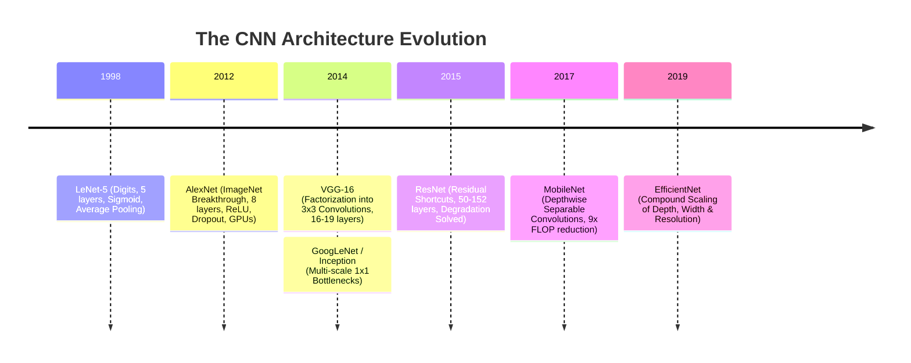
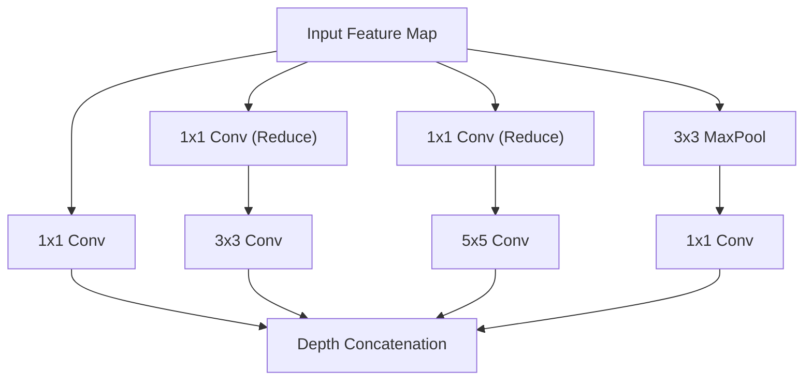
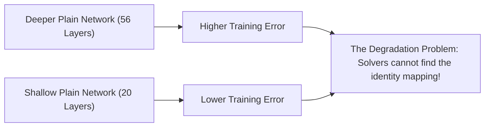
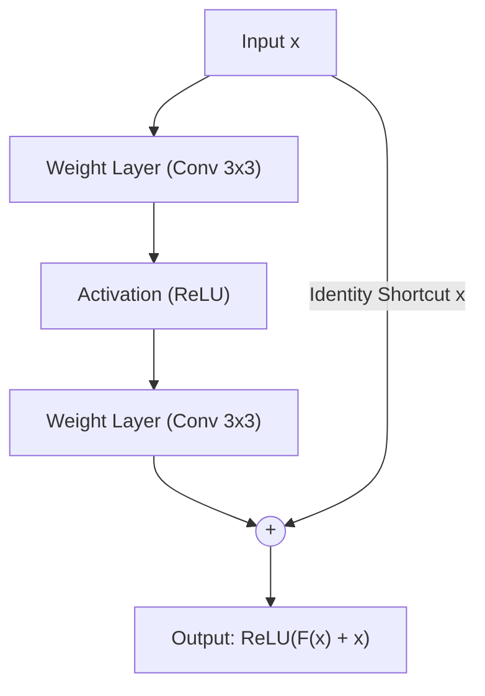
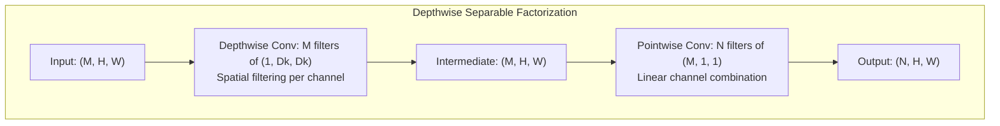
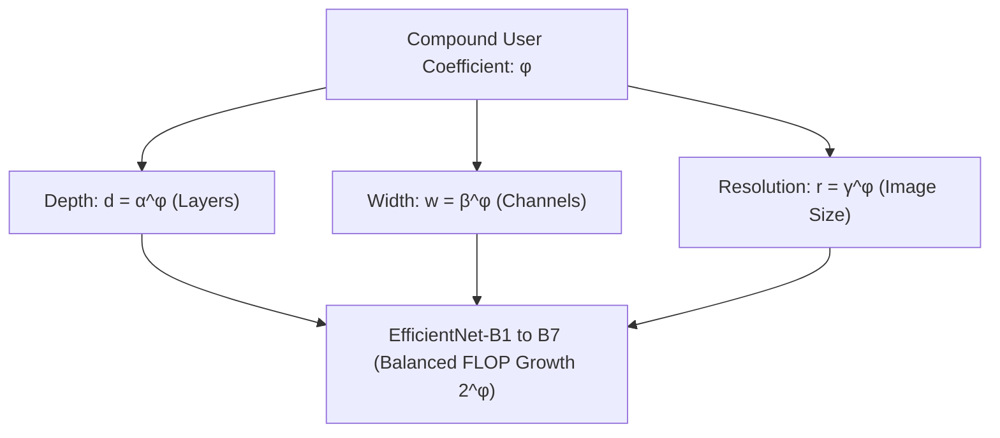
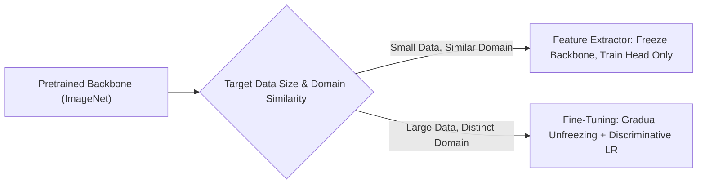

# Modern CNN Architectures & Transfer Learning — From AlexNet to ResNet, MobileNet & EfficientNet

!!! info "Prerequisites"
    Convolution operations, receptive fields, and backpropagation. Review [Convolutional Foundations](convolutional-foundations-deep-dive.md), [Architecture Components](../06-deep-learning/architecture-components-regularization-deep-dive.md), and [Deep Learning Optimizers](../06-deep-learning/deep-learning-optimizers-deep-dive.md).

---

## 1. The Big Picture

Between 2012 and 2020, computer vision underwent a structural revolution catalyzed by the ImageNet Large Scale Visual Recognition Challenge (ILSVRC). The timeline of modern Convolutional Neural Networks is the history of solving three fundamental bottlenecks:

1. **Vanishing/Exploding Gradients**: Solved sequentially by ReLU, Batch Normalization, and Residual Connections.
2. **The Degradation Problem**: Deeper plain networks performing worse on training data than shallow ones—solved definitively by **ResNet's additive identity shortcuts**.
3. **Computational & Edge Efficiency**: Enabling high-accuracy vision on edge devices and mobile phones via **Depthwise Separable Convolutions (MobileNet)** and **Compound Scaling (EfficientNet)**.

Rather than training multimillion-parameter networks from scratch on limited domain datasets, the modern paradigm leverages **Transfer Learning**: using representations pretrained on millions of images (ImageNet, LAION) and fine-tuning them on target tasks with discriminative learning rates and warmup schedules.



---

## 2. Classical CNN Architectural Timeline

### 2.1 LeNet-5 (LeCun et al., 1998)

Yann LeCun's LeNet-5 processed $32 \times 32$ handwritten grayscale digits for automated banking check processing:

- Architecture: `Input (32x32) -> Conv (5x5) -> AvgPool -> Conv (5x5) -> AvgPool -> FC120 -> FC84 -> Output (10)`.
- Key limitations: Used saturating Sigmoid/Tanh activations, average pooling, and had only $\approx 60,000$ parameters, limited by 1990s CPU compute.

### 2.2 AlexNet (Krizhevsky, Sutskever, Hinton, 2012)

AlexNet won ILSVRC 2012 by an astonishing 10.8 percentage point margin, inaugurating the modern deep learning era:

- **Depth**: 8 learned layers (5 convolutional, 3 dense).
- **GPU Parallelism**: Split across two 3GB NVIDIA GeForce GTX 580 GPUs.
- **Architectural Innovations**:
  - Replaced Sigmoid with **ReLU**, preventing vanishing gradients and speeding up convergence by $6\times$.
  - Introduced **Dropout ($p=0.5$)** in the dense layers to control overfitting on 60 million parameters.
  - Used heavy data augmentations (random cropping, horizontal reflections, PCA color jittering).
  - Used Max Pooling with stride ($S=2, K=3$) rather than non-overlapping average pooling.

### 2.3 VGG Network (Simonyan & Zisserman, 2014)

VGG established the fundamental design rule of modern modular CNNs:

- **Homogeneous Modular Design**: Replaced arbitrary large filter sizes ($11 \times 11$, $7 \times 7$, $5 \times 5$) strictly with uniform stacks of **$3 \times 3$ convolutions** with stride 1 and padding 1, followed by $2 \times 2$ Max Pooling (stride 2).
- **Rule of Thumb**: Whenever spatial dimensions are halved by pooling, the channel depth is doubled ($64 \to 128 \to 256 \to 512$).
- **Bottleneck**: The three fully connected layers (4096 $\to$ 4096 $\to$ 1000) contained $>100$ million parameters, making VGG-16 ($138\text{M}$ parameters) computationally bloated.

### 2.4 Inception / GoogLeNet (Szegedy et al., 2014)

GoogLeNet achieved 22 layers with only $6.8$ million parameters (a $20\times$ parameter reduction over AlexNet) through the **Inception Block**:

- **Multi-Scale Processing**: Rather than choosing a single kernel size, an Inception block runs $1 \times 1$, $3 \times 3$, $5 \times 5$ convolutions and $3 \times 3$ max pooling in parallel on the same input, concatenating their output channels.
- **$1 \times 1$ Bottleneck Convolutions**: Performing $3 \times 3$ convolutions on high-dimensional channels ($C=256$) is computationally prohibitive. A $1 \times 1$ convolution reduces channels first ($256 \to 64$), applies the spatial $3 \times 3$ filter, and expands back.



---

## 3. The Degradation Problem & The Residual Revolution

### 3.1 The Paradox of Depth

In 2015, Kaiming He et al. asked a fundamental question: *Does learning better networks correspond to stacking more layers?*

When stacking layers in plain networks (e.g. 20 layers vs. 56 layers), they observed a striking pathology: **the 56-layer network had higher training error than the 20-layer network**.

Crucially, this was **not overfitting**: if the deeper network were overfitting, its training error would be lower and test error higher. Here, the deeper network had worse training error!



**The Identity Mapping Argument:**  
Consider a shallow model and a deeper counterpart constructed by copying the shallow model and appending identity mapping layers ($y = x$). The deeper model should achieve at least the same training error as the shallow model. However, standard optimization dynamics (SGD) cannot optimize multiple non-linear layers to approximate the identity mapping $\mathcal{H}(x) = x$.

### 3.2 Residual Learning Formulation

He et al. hypothesized that it is significantly easier for an optimization algorithm to drive residual perturbations toward zero than to learn an identity mapping through nested non-linear transformations.

Let $\mathcal{H}(\mathbf{x})$ denote the underlying target mapping for a few stacked layers.  
Instead of parameterizing the layers to fit $\mathcal{H}(\mathbf{x})$ directly, parameterize the stacked layers to fit the **residual mapping**:

$$
\mathcal{F}(\mathbf{x}) \equiv \mathcal{H}(\mathbf{x}) - \mathbf{x}
$$

The original mapping is recovered via an **additive identity shortcut**:

$$
\mathcal{H}(\mathbf{x}) = \mathcal{F}(\mathbf{x}) + \mathbf{x}
$$



### 3.3 The Gradient Highway Proof

Why do residual shortcuts prevent vanishing gradients across 100+ layers?

Let $\mathbf{x}_l$ be the input to residual block $l$, and $\mathbf{x}_{l+1} = \mathbf{x}_l + \mathcal{F}(\mathbf{x}_l, \mathcal{W}_l)$.  
By recursive substitution, the representation at any deeper layer $L$ is:

$$
\mathbf{x}_L = \mathbf{x}_l + \sum_{i=l}^{L-1} \mathcal{F}(\mathbf{x}_i, \mathcal{W}_i)
$$

Now apply the chain rule to compute the gradient of scalar loss $\mathcal{E}$ with respect to early activation $\mathbf{x}_l$:

$$
\frac{\partial \mathcal{E}}{\partial \mathbf{x}_l} = \frac{\partial \mathcal{E}}{\partial \mathbf{x}_L} \frac{\partial \mathbf{x}_L}{\partial \mathbf{x}_l} = \frac{\partial \mathcal{E}}{\partial \mathbf{x}_L} \left( \mathbf{I} + \frac{\partial}{\partial \mathbf{x}_l} \sum_{i=l}^{L-1} \mathcal{F}(\mathbf{x}_i, \mathcal{W}_i) \right)
$$

Expanding:

$$
\frac{\partial \mathcal{E}}{\partial \mathbf{x}_l} = \frac{\partial \mathcal{E}}{\partial \mathbf{x}_L} + \frac{\partial \mathcal{E}}{\partial \mathbf{x}_L} \left( \sum_{i=l}^{L-1} \frac{\partial \mathcal{F}(\mathbf{x}_i, \mathcal{W}_i)}{\partial \mathbf{x}_l} \right)
$$

**The Core Insight:**  
The gradient $\frac{\partial \mathcal{E}}{\partial \mathbf{x}_l}$ decomposes into two additive terms:

1. The **Direct Gradient Highway**: $\frac{\partial \mathcal{E}}{\partial \mathbf{x}_L} \cdot \mathbf{I}$. The error gradient from the output layer flows directly backward to layer $l$ **unimpeded, without passing through any weight matrices or diminishing multiplicative terms!**
2. Even if the learned residual gradients $\sum \frac{\partial \mathcal{F}}{\partial \mathbf{x}_l}$ approach zero, the term $\mathbf{I}$ ensures that $\frac{\partial \mathcal{E}}{\partial \mathbf{x}_l}$ never vanishes.

---

## 4. ResNet Building Blocks: BasicBlock vs. Bottleneck

```mermaid
flowchart TD
    subgraph "BasicBlock (ResNet-18, 34)"
        B_IN["Input x: (C, H, W)"] --> B_C1["Conv 3x3, C"] --> B_BN1["BatchNorm"] --> B_R1["ReLU"]
        B_R1 --> B_C2["Conv 3x3, C"] --> B_BN2["BatchNorm"]
        B_IN ----> B_ADD((+))
        B_BN2 --> B_ADD --> B_OUT["ReLU(F(x) + x)"]
    end

    subgraph "BottleneckBlock (ResNet-50, 101, 152)"
        BT_IN["Input x: (4C, H, W)"] --> BT_C1["Conv 1x1, C (Reduce)"] --> BT_BN1["BatchNorm"] --> BT_R1["ReLU"]
        BT_R1 --> BT_C2["Conv 3x3, C (Process)"] --> BT_BN2["BatchNorm"] --> BT_R2["ReLU"]
        BT_R2 --> BT_C3["Conv 1x1, 4C (Restore)"] --> BT_BN3["BatchNorm"]
        BT_IN ----> BT_ADD((+))
        BT_BN3 --> BT_ADD --> BT_OUT["ReLU(F(x) + x)"]
    end
```



### 4.1 BasicBlock (ResNet-18 & ResNet-34)

Used for shallow networks with moderate channel counts:

- Two consecutive $3 \times 3$ convolutions with equal channel dimension $C$.
- Parameter count: $2 \times (3 \times 3 \times C^2) = 18 C^2$.

### 4.2 Bottleneck Block (ResNet-50, ResNet-101, ResNet-152)

Used for deep networks where channel counts reach $512$ or $2048$:

- **$1 \times 1$ Conv**: Reduces channel dimension from $4C \to C$ (dimension reduction).
- **$3 \times 3$ Conv**: Performs spatial filtering on the compact $C$-dimensional representation.
- **$1 \times 1$ Conv**: Restores channel dimension from $C \to 4C$ (dimension expansion).

**Computational Efficiency Comparison (for $4C = 256 \implies C = 64$):**

- Two $3 \times 3$ convolutions on 256 channels:
  $$2 \times (3 \times 3 \times 256 \times 256) \approx 1,179,648 \text{ operations}$$

- Bottleneck block ($256 \to 64 \to 64 \to 256$):
  $$(1 \times 1 \times 256 \times 64) + (3 \times 3 \times 64 \times 64) + (1 \times 1 \times 64 \times 256) = 16,384 + 36,864 + 16,384 \approx 69,632 \text{ operations}$$

- **A $17\times$ reduction in computational cost!**

### 4.3 Projection Shortcuts

When spatial resolution is halved ($S=2$) or channels expand ($C_{\text{in}} \ne C_{\text{out}}$), the dimensions of $\mathcal{F}(\mathbf{x})$ and $\mathbf{x}$ no longer match, making simple addition $\mathcal{F}(\mathbf{x}) + \mathbf{x}$ impossible.  
In this case, a **projection shortcut** with a $1 \times 1$ convolution of stride $S=2$ aligns dimensions:

$$
\mathbf{y} = \mathcal{F}(\mathbf{x}) + W_s \mathbf{x}, \qquad W_s \in \mathbb{R}^{C_{\text{out}} \times C_{\text{in}} \times 1 \times 1}
$$

---

## 5. MobileNet: Depthwise Separable Convolutions (Howard et al., 2017)

MobileNet was engineered to run high-accuracy computer vision on edge devices and mobile phones under strict milliwatt power and latency constraints.

### 5.1 Factorizing Standard Convolutions

Standard 2D convolution applies spatial filtering and channel cross-correlation simultaneously:

- Input: $D_F \times D_F \times M$ ($H \times W \times C_{\text{in}}$)
- Output: $D_F \times D_F \times N$ ($H \times W \times C_{\text{out}}$)
- Kernel: $D_K \times D_K$ ($k \times k$)
- **Standard Computational Cost**:
  $$\text{FLOPs}_{\text{std}} = D_K \cdot D_K \cdot M \cdot N \cdot D_F \cdot D_F$$



### 5.2 Depthwise Convolution

Applies a single spatial filter per input channel independently (channel grouping $G = M$):
$$\text{FLOPs}_{\text{dw}} = D_K \cdot D_K \cdot M \cdot D_F \cdot D_F$$

### 5.3 Pointwise Convolution

Applies standard $1 \times 1$ convolutions to linearly combine the depthwise channel outputs into $N$ target channels:
$$\text{FLOPs}_{\text{pw}} = M \cdot N \cdot D_F \cdot D_F$$

### 5.4 Exact Compute Reduction Factor

The total computational cost of Depthwise Separable Convolution is:

$$\text{FLOPs}_{\text{sep}} = \text{FLOPs}_{\text{dw}} + \text{FLOPs}_{\text{pw}} = D_F^2 \cdot M \cdot (D_K^2 + N)$$

Taking the ratio relative to standard convolution:

$$
\frac{\text{FLOPs}_{\text{sep}}}{\text{FLOPs}_{\text{std}}} = \frac{D_F^2 \cdot M \cdot (D_K^2 + N)}{D_F^2 \cdot M \cdot N \cdot D_K^2} = \frac{D_K^2 + N}{N \cdot D_K^2} = \frac{1}{N} + \frac{1}{D_K^2}
$$

For standard $3 \times 3$ kernels ($D_K = 3$) and large channel count $N \ge 64$:

$$
\frac{1}{N} + \frac{1}{9} \approx \frac{1}{9} \approx 0.11
$$

**Depthwise Separable Convolutions achieve an $\approx 89\%$ reduction in computational cost and parameters with negligible drop in top-1 accuracy!**

---

## 6. EfficientNet: Principled Compound Scaling (Tan & Le, 2019)

Prior to EfficientNet, scaling up CNNs was arbitrary:

- Deeper models (more layers, e.g. ResNet-18 $\to$ ResNet-152).
- Wider models (more channels per layer, e.g. WideResNet).
- Higher resolution (larger input images, e.g. $224 \times 224 \to 480 \times 480$).

Mingxing Tan and Quoc V. Le proved that scaling only one dimension yields diminishing returns because higher resolution requires more depth (larger receptive fields) and more width (finer feature patterns).



### 6.1 The Compound Scaling Formulation

Constrain scaling parameters $\alpha, \beta, \gamma$ such that doubling the user scaling coefficient $\phi$ doubles total network FLOPs:

$$
\text{depth}: d = \alpha^\phi, \quad \text{width}: w = \beta^\phi, \quad \text{resolution}: r = \gamma^\phi
$$

subject to:

$$
\alpha \cdot \beta^2 \cdot \gamma^2 \approx 2 \quad (\alpha \ge 1, \beta \ge 1, \gamma \ge 1)
$$

Because doubling depth doubles FLOPs ($\mathcal{O}(d)$), but doubling width or resolution quadruples FLOPs ($\mathcal{O}(w^2), \mathcal{O}(r^2)$), $\beta$ and $\gamma$ enter quadratically.

Using Neural Architecture Search (NAS) to find the baseline architecture (EfficientNet-B0), a small grid search determined:
$$\alpha = 1.20, \quad \beta = 1.10, \quad \gamma = 1.15$$

Scaling $\phi \in [1, 7]$ produced the state-of-the-art EfficientNet family (B1 through B7), achieving higher accuracy than prior models while using up to $8.4\times$ fewer parameters.

---

## 7. Transfer Learning & Fine-Tuning Strategies

Training a deep CNN from scratch requires millions of labeled images and weeks of GPU compute. **Transfer learning** transfers feature extractors learned on large source datasets (ImageNet-1K with 1.28M images) to target domain tasks.



### 7.1 Transfer Learning Decision Matrix

| Target Dataset Size | Domain Similarity to ImageNet | Recommended Strategy |
| :--- | :--- | :--- |
| **Small ($< 1,000$ images)** | High (general objects, animals) | **Linear Probing**: Freeze all backbone weights. Train only a new linear classifier head. |
| **Small ($< 1,000$ images)** | Low (medical CT scans, satellite) | Train linear head on early/mid-layer activations, or use aggressive data augmentation. |
| **Large ($> 50,000$ images)** | High | **Full Fine-Tuning**: Initialize with pretrained weights; train end-to-end with low learning rate. |
| **Large ($> 50,000$ images)** | Low | Full fine-tuning or training from scratch with Kaiming initialization. |

### 7.2 Discriminative Learning Rates

Early layers in CNNs learn universal Gabor-like filters (edges, color blobs, textures) that transfer to virtually all visual domains. Deeper layers capture task-specific semantic concepts.  
**Discriminative Learning Rates** assign exponentially decaying learning rates to earlier layers:

$$
\eta^{[l]} = \eta_{\text{head}} \cdot \gamma^{L - l}, \quad \gamma \in [0.1, 0.3]
$$

This prevents catastrophic forgetting in early feature detectors while allowing the classification head to adapt rapidly.

---

## 8. Implementation 1 — Complete ResNet-18 from Scratch in PyTorch

The following complete, production-grade PyTorch script implements `BasicBlock`, `ResNet18`, and demonstrates training on synthetic image batches with full gradient verification.

```python
"""
resnet18_scratch.py
Complete, from-scratch implementation of ResNet-18 in PyTorch.
"""

import torch
import torch.nn as nn
from typing import Type, List, Optional


class BasicBlock(nn.Module):
    """
    Standard ResNet BasicBlock with two 3x3 convolutions and projection shortcut.
    """
    expansion: int = 1

    def __init__(self, in_channels: int, out_channels: int, stride: int = 1):
        super().__init__()
        # First 3x3 convolution (handles spatial downsampling if stride > 1)
        self.conv1 = nn.Conv2d(in_channels, out_channels, kernel_size=3, stride=stride, padding=1, bias=False)
        self.bn1 = nn.BatchNorm2d(out_channels)
        self.relu = nn.ReLU(inplace=True)

        # Second 3x3 convolution
        self.conv2 = nn.Conv2d(out_channels, out_channels, kernel_size=3, stride=1, padding=1, bias=False)
        self.bn2 = nn.BatchNorm2d(out_channels)

        # Shortcut connection
        self.shortcut = nn.Sequential()
        if stride != 1 or in_channels != out_channels * self.expansion:
            # Projection shortcut to align spatial dimensions and channel depth
            self.shortcut = nn.Sequential(
                nn.Conv2d(in_channels, out_channels * self.expansion, kernel_size=1, stride=stride, bias=False),
                nn.BatchNorm2d(out_channels * self.expansion),
            )

    def forward(self, x: torch.Tensor) -> torch.Tensor:
        identity = self.shortcut(x)

        out = self.conv1(x)
        out = self.bn1(out)
        out = self.relu(out)

        out = self.conv2(out)
        out = self.bn2(out)

        # Additive residual connection
        out += identity
        out = self.relu(out)
        return out


class ResNet18(nn.Module):
    """
    ResNet-18 Architecture (He et al., 2015).
    """
    def __init__(self, num_classes: int = 1000):
        super().__init__()
        self.in_channels = 64

        # 1. Initial 7x7 Conv Stage (ImageNet stem)
        self.conv1 = nn.Conv2d(3, 64, kernel_size=7, stride=2, padding=3, bias=False)
        self.bn1 = nn.BatchNorm2d(64)
        self.relu = nn.ReLU(inplace=True)
        self.maxpool = nn.MaxPool2d(kernel_size=3, stride=2, padding=1)

        # 2. Residual Stages
        self.layer1 = self._make_layer(BasicBlock, out_channels=64, num_blocks=2, stride=1)
        self.layer2 = self._make_layer(BasicBlock, out_channels=128, num_blocks=2, stride=2)
        self.layer3 = self._make_layer(BasicBlock, out_channels=256, num_blocks=2, stride=2)
        self.layer4 = self._make_layer(BasicBlock, out_channels=512, num_blocks=2, stride=2)

        # 3. Global Average Pooling & Linear Head
        self.avgpool = nn.AdaptiveAvgPool2d((1, 1))
        self.fc = nn.Linear(512 * BasicBlock.expansion, num_classes)

        # Initialize weights with Kaiming Normal
        self._initialize_weights()

    def _make_layer(self, block: Type[BasicBlock], out_channels: int, num_blocks: int, stride: int) -> nn.Sequential:
        strides = [stride] + [1] * (num_blocks - 1)
        layers = []
        for s in strides:
            layers.append(block(self.in_channels, out_channels, stride=s))
            self.in_channels = out_channels * block.expansion
        return nn.Sequential(*layers)

    def _initialize_weights(self):
        for m in self.modules():
            if isinstance(m, nn.Conv2d):
                nn.init.kaiming_normal_(m.weight, mode="fan_out", nonlinearity="relu")
            elif isinstance(m, nn.BatchNorm2d):
                nn.init.constant_(m.weight, 1)
                nn.init.constant_(m.bias, 0)
            elif isinstance(m, nn.Linear):
                nn.init.normal_(m.weight, 0, 0.01)
                nn.init.constant_(m.bias, 0)

    def forward(self, x: torch.Tensor) -> torch.Tensor:
        # Stem
        x = self.conv1(x)
        x = self.bn1(x)
        x = self.relu(x)
        x = self.maxpool(x)

        # ResNet Stages
        x = self.layer1(x)
        x = self.layer2(x)
        x = self.layer3(x)
        x = self.layer4(x)

        # Head
        x = self.avgpool(x)
        x = torch.flatten(x, 1)
        x = self.fc(x)
        return x


if __name__ == "__main__":
    model = ResNet18(num_classes=10)
    dummy_input = torch.randn(4, 3, 224, 224)
    output = model(dummy_input)

    total_params = sum(p.numel() for p in model.parameters() if p.requires_grad)
    print(f"ResNet-18 Output Shape: {output.shape} (Expected: (4, 10))")
    print(f"Total Trainable Parameters: {total_params:,} (≈ 11.2 Million)")
```

---

## 9. Implementation 2 — End-to-End Transfer Learning Pipeline

The following script demonstrates production transfer learning using a pretrained backbone with gradual unfreezing and discriminative learning rates in PyTorch:

```python
"""
transfer_learning_pipeline.py
Production Transfer Learning with Gradual Unfreezing and Discriminative Learning Rates.
"""

import torch
import torch.nn as nn
from torchvision.models import resnet18, ResNet18_Weights
import torch.optim as optim


def build_transfer_model(num_target_classes: int = 5):
    # 1. Load pretrained ImageNet weights
    weights = ResNet18_Weights.DEFAULT
    model = resnet18(weights=weights)

    # 2. Phase 1: Feature Extractor Mode (Freeze all backbone parameters)
    for param in model.parameters():
        param.requires_grad = False

    # 3. Replace classification head with custom classifier
    in_features = model.fc.in_features
    model.fc = nn.Sequential(
        nn.Dropout(p=0.3),
        nn.Linear(in_features, num_target_classes)
    )
    return model


def configure_discriminative_optimizer(model: nn.Module, head_lr: float = 1e-3, backbone_lr: float = 1e-5):
    """
    Sets up parameter groups with discriminative learning rates.
    """
    # Unfreeze stage 4 and head for fine-tuning
    for param in model.layer4.parameters():
        param.requires_grad = True

    params_group = [
        {"params": model.conv1.parameters(), "lr": backbone_lr * 0.1},
        {"params": model.layer1.parameters(), "lr": backbone_lr * 0.2},
        {"params": model.layer2.parameters(), "lr": backbone_lr * 0.4},
        {"params": model.layer3.parameters(), "lr": backbone_lr * 0.7},
        {"params": model.layer4.parameters(), "lr": backbone_lr},
        {"params": model.fc.parameters(), "lr": head_lr},
    ]
    # Filter only parameters that require gradients
    active_groups = [{"params": [p for p in g["params"] if p.requires_grad], "lr": g["lr"]} for g in params_group]
    return optim.AdamW(active_groups, weight_decay=1e-2)


if __name__ == "__main__":
    model = build_transfer_model(num_target_classes=5)
    optimizer = configure_discriminative_optimizer(model, head_lr=1e-3, backbone_lr=1e-5)
    
    # Verify parameter groups
    print("Configured Discriminative Optimizer Groups:")
    for idx, group in enumerate(optimizer.param_groups):
        num_p = sum(p.numel() for p in group["params"])
        print(f"Group {idx}: {num_p:,} params | lr = {group['lr']:.1e}")
```

---

## 10. Common Errors, Gotchas & Debugging

### 1. Vanishing Gradients on Uninitialized Residual Shortcuts

**Symptom**: ResNet with projection shortcuts fails to converge or trains slower than a shallow network.  
**Root Cause**: Initializing the projection $1 \times 1$ convolution with standard random weights breaks the identity property at initialization. If $W_s$ and the residual path both output non-identity distributions, signal variance doubles across each residual block.  
**Fix**: Zero-initialize the last BatchNorm layer in each residual block (`nn.init.constant_(m.bn2.weight, 0)`), ensuring $\mathcal{F}(\mathbf{x}) = 0$ at iteration 0 so the block acts as a pure identity map $\mathbf{x} + 0 = \mathbf{x}$.

### 2. Catastrophic Forgetting from Large Learning Rates on Pretrained Backbones

**Symptom**: Validation accuracy immediately plummets to chance during epoch 1 of fine-tuning.  
**Root Cause**: Using a standard learning rate ($\eta = 10^{-3}$) on a pretrained backbone overwrites millions of fragile, highly refined ImageNet visual filters with random gradients generated by the uninitialized head.  
**Fix**: Freeze the backbone for 2-5 epochs while training only the head. When unfreezing, set the backbone learning rate $10\times$ to $100\times$ lower than the head learning rate.

### 3. Normalization Mismatch on Pretrained Weights

**Symptom**: Pretrained model achieves poor accuracy on evaluation data despite high training performance.  
**Root Cause**: Pretrained torchvision models were trained on images normalized with exact ImageNet mean `[0.485, 0.456, 0.406]` and std `[0.229, 0.224, 0.225]`. Evaluating with inputs in range $[0, 255]$ or normalized with mean $0.5$ triggers severe distribution shift.  
**Fix**: Always apply the exact transform `transforms.Normalize(mean=[0.485, 0.456, 0.406], std=[0.229, 0.224, 0.225])`.

---

## 11. Staff-Level Technical Interview Questions

### Q1: Prove that the gradient in ResNet decomposes into an identity term and a residual term, and explain why this mathematically prevents vanishing gradients.

**Model Answer:**  
Consider a residual network where each block computes $\mathbf{x}_{l+1} = \mathbf{x}_l + \mathcal{F}(\mathbf{x}_l, \mathcal{W}_l)$.  
By recursive expansion from layer $l$ to deeper layer $L$:

$$\mathbf{x}_L = \mathbf{x}_l + \sum_{i=l}^{L-1} \mathcal{F}(\mathbf{x}_i, \mathcal{W}_i)$$

By the multivariate chain rule, the gradient of scalar loss $\mathcal{E}$ with respect to early activation $\mathbf{x}_l$ is:

$$\frac{\partial \mathcal{E}}{\partial \mathbf{x}_l} = \frac{\partial \mathcal{E}}{\partial \mathbf{x}_L} \frac{\partial \mathbf{x}_L}{\partial \mathbf{x}_l} = \frac{\partial \mathcal{E}}{\partial \mathbf{x}_L} \left( \mathbf{I} + \frac{\partial}{\partial \mathbf{x}_l} \sum_{i=l}^{L-1} \mathcal{F}(\mathbf{x}_i, \mathcal{W}_i) \right)$$

Distributing the gradient:

$$\frac{\partial \mathcal{E}}{\partial \mathbf{x}_l} = \frac{\partial \mathcal{E}}{\partial \mathbf{x}_L} + \frac{\partial \mathcal{E}}{\partial \mathbf{x}_L} \left( \sum_{i=l}^{L-1} \frac{\partial \mathcal{F}(\mathbf{x}_i, \mathcal{W}_i)}{\partial \mathbf{x}_l} \right)$$

In a plain network without residual shortcuts, $\mathbf{x}_L = \prod_{i=l}^{L-1} W_i \sigma'(\mathbf{z}_i)$, so the gradient $\frac{\partial \mathcal{E}}{\partial \mathbf{x}_l} = \frac{\partial \mathcal{E}}{\partial \mathbf{x}_L} \prod_{i=l}^{L-1} W_i^T \sigma'(\mathbf{z}_i)$. If the spectral radius of the weights $\rho(W) < 1$ or activations saturate, this continuous product decays exponentially to zero as $(L - l) \to \infty$.  
In ResNet, the term $\frac{\partial \mathcal{E}}{\partial \mathbf{x}_L} \cdot \mathbf{I}$ flows directly to layer $l$ with zero attenuation. Even if all intermediate residual gradients vanish ($\frac{\partial \mathcal{F}}{\partial \mathbf{x}_l} \to \mathbf{0}$), the total gradient $\frac{\partial \mathcal{E}}{\partial \mathbf{x}_l} = \frac{\partial \mathcal{E}}{\partial \mathbf{x}_L} \ne \mathbf{0}$. The identity shortcut forms a gradient highway across infinite depth.

---

### Q2: Why is the Degradation Problem in deep networks distinct from overfitting?

**Model Answer:**  
Overfitting is characterized by a divergence between training performance and generalization performance: the network memorizes training data noise, achieving near-zero training error while exhibiting high validation/test error.  
The **Degradation Problem** is the counterintuitive phenomenon where increasing depth causes **training error to worsen**:

- A 56-layer plain network exhibits higher training error than a 20-layer plain network on the exact same training set.
- This cannot be overfitting, because an overfitted model would easily achieve lower training error.
- Rather, the degradation problem is an **optimization failure**: the non-convex loss surface of deep plain networks becomes riddled with pathological curvature and vanishing gradients, preventing first-order optimizers (SGD) from converging to even the identity function solution that the deeper architecture trivially contains in its parameter space.

---

### Q3: Derive the exact FLOP reduction of Depthwise Separable Convolutions in MobileNet compared to standard 2D convolutions.

**Model Answer:**  
Let the input feature map have spatial size $D_F \times D_F$ with $M$ channels, producing an output of size $D_F \times D_F$ with $N$ channels using a kernel of size $D_K \times D_K$.  

1. **Standard Convolution**:
   Computes $N$ filters, each of shape $D_K \times D_K \times M$, over $D_F \times D_F$ spatial locations:
   $$\text{Cost}_{\text{std}} = D_K \cdot D_K \cdot M \cdot N \cdot D_F \cdot D_F$$

2. **Depthwise Separable Convolution**:
   - *Depthwise Step*: Applies $M$ spatial filters of size $D_K \times D_K \times 1$:
     $$\text{Cost}_{\text{dw}} = D_K \cdot D_K \cdot M \cdot D_F \cdot D_F$$
   - *Pointwise Step*: Applies $N$ linear projection filters of size $1 \times 1 \times M$:
     $$\text{Cost}_{\text{pw}} = M \cdot N \cdot D_F \cdot D_F$$
   - Total Cost:
     $$\text{Cost}_{\text{sep}} = D_F^2 \cdot M \cdot (D_K^2 + N)$$

3. **Reduction Ratio**:
   $$\frac{\text{Cost}_{\text{sep}}}{\text{Cost}_{\text{std}}} = \frac{D_F^2 \cdot M \cdot (D_K^2 + N)}{D_F^2 \cdot M \cdot N \cdot D_K^2} = \frac{D_K^2 + N}{N \cdot D_K^2} = \frac{1}{N} + \frac{1}{D_K^2}$$
For a typical $3 \times 3$ kernel ($D_K = 3$) and $N \gg 1$:
$$\frac{\text{Cost}_{\text{sep}}}{\text{Cost}_{\text{std}}} \approx \frac{1}{9} \approx 0.111$$
This yields an exact $\approx 89\%$ reduction in multiply-accumulate operations.

---

### Q4: Explain the mathematical rationale behind EfficientNet's compound scaling constraint $\alpha \cdot \beta^2 \cdot \gamma^2 \approx 2$.

**Model Answer:**  
Let network depth be scaled by $d = \alpha^\phi$, width by $w = \beta^\phi$, and input resolution by $r = \gamma^\phi$, where $\phi$ is a user-controlled compound scaling coefficient.  
Consider how each dimension impacts the computational cost (FLOPs):

- **Depth ($d$)**: Doubling the number of layers doubles the operations linearly: $\text{FLOPs} \propto d \propto \alpha^\phi$.
- **Width ($w$)**: Doubling channels multiplies both input channels $C_{\text{in}}$ and output channels $C_{\text{out}}$ by 2. Because convolution FLOPs scale as $C_{\text{in}} \cdot C_{\text{out}}$, doubling width quadruples FLOPs: $\text{FLOPs} \propto w^2 \propto \beta^{2\phi}$.
- **Resolution ($r$)**: Doubling the spatial height and width quadruples the total pixel count $H \cdot W$. Because convolution applies filters across all spatial positions, doubling resolution quadruples FLOPs: $\text{FLOPs} \propto r^2 \propto \gamma^{2\phi}$.

The total FLOP growth factor under scaling coefficient $\phi$ is:

$$\text{FLOPs}(\phi) \propto (\alpha \cdot \beta^2 \cdot \gamma^2)^\phi$$

To ensure that increasing $\phi$ by 1 corresponds to doubling total network FLOPs ($2^\phi$), Tan & Le constrained:

$$\alpha \cdot \beta^2 \cdot \gamma^2 \approx 2$$

This enforces a disciplined, balanced allocation of compute across depth, width, and resolution.

---

### Q5: Why is zero-initializing the last BatchNorm layer in a ResNet block considered a best practice?

**Model Answer:**  
In a standard ResNet block, the forward pass is:

$$\mathbf{y} = \text{ReLU}\left( \text{BN}_2(W_2 \cdot \text{ReLU}(\text{BN}_1(W_1 \mathbf{x}))) + \mathbf{x} \right)$$

Recall that BatchNorm computes $\text{BN}(z) = \gamma \hat{z} + \beta$.  
By default, $\gamma$ is initialized to $1.0$. At iteration 0, both the residual branch $\mathcal{F}(\mathbf{x})$ and the identity shortcut $\mathbf{x}$ output non-zero signals with variance $\approx 1$. Adding them produces $\mathbf{y}$ with variance $\approx 2$. Compounded across 50 blocks, activation variance explodes exponentially.  
If the scale parameter $\gamma$ of $\text{BN}_2$ is initialized to **zero** ($\gamma = 0$):

$$\text{BN}_2(\cdot) = 0 \cdot \hat{z} + 0 = 0 \implies \mathcal{F}(\mathbf{x}) = \mathbf{0}$$

At iteration 0:

$$\mathbf{y} = \text{ReLU}(\mathbf{0} + \mathbf{x}) = \mathbf{x}$$

Every residual block behaves as a **pure identity mapping at initialization**. The network starts training as if it were a shallow model, preserving signal variance across arbitrary depth and allowing the optimizer to gradually introduce residual non-linearities as needed.

---

## 12. Mastery Ladder

- [ ] **L1:** Trace the architectural evolution from LeNet-5 through AlexNet and VGG, explaining the key breakthroughs of each.
- [ ] **L2:** Explain the Inception module and show how $1 \times 1$ convolutions act as bottleneck dimension reducers.
- [ ] **L3:** State the Degradation Problem and explain why it is an optimization failure rather than statistical overfitting.
- [ ] **L4:** Formulate the residual mapping $\mathcal{H}(\mathbf{x}) = \mathcal{F}(\mathbf{x}) + \mathbf{x}$ and draw the basic residual block diagram.
- [ ] **L5:** Prove mathematically that the gradient in ResNet decomposes into an identity term and a residual sum, explaining the gradient highway.
- [ ] **L6:** Compare the BasicBlock and BottleneckBlock in terms of parameter efficiency and FLOP count.
- [ ] **L7:** Derive the computational cost reduction factor $\frac{1}{N} + \frac{1}{D_K^2} \approx \frac{1}{9}$ for Depthwise Separable Convolutions in MobileNet.
- [ ] **L8:** Explain EfficientNet's compound scaling constraint $\alpha \cdot \beta^2 \cdot \gamma^2 \approx 2$.
- [ ] **L9:** Formulate transfer learning strategies (linear probing vs full fine-tuning) using discriminative learning rates and gradual unfreezing.
- [ ] **L10:** Implement a complete ResNet-18 architecture from scratch in PyTorch, verify forward/backward pass shapes, and construct an end-to-end transfer learning fine-tuning pipeline.
