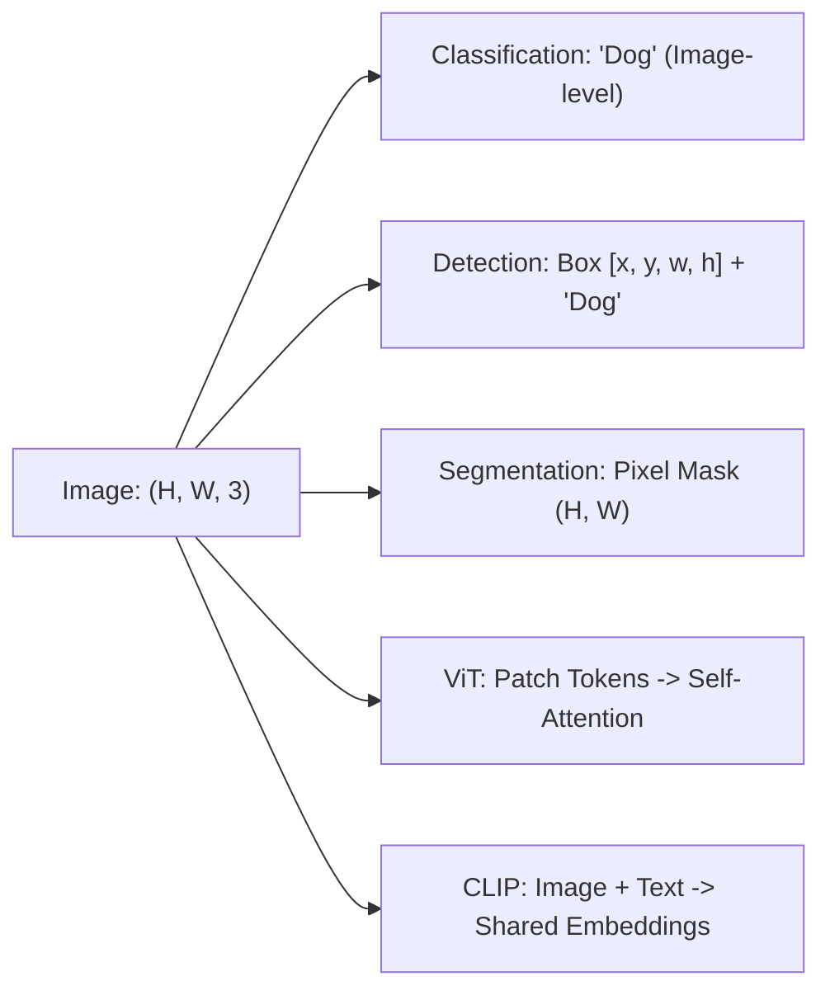
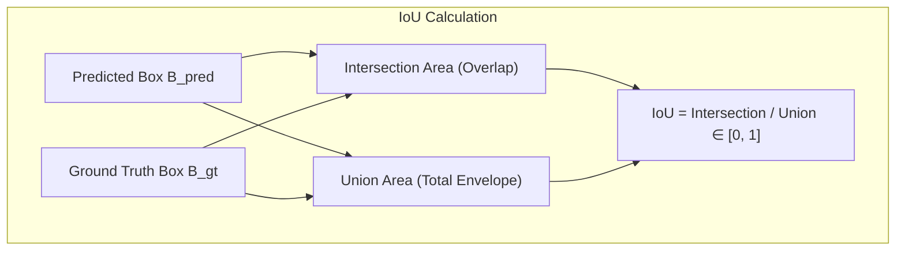
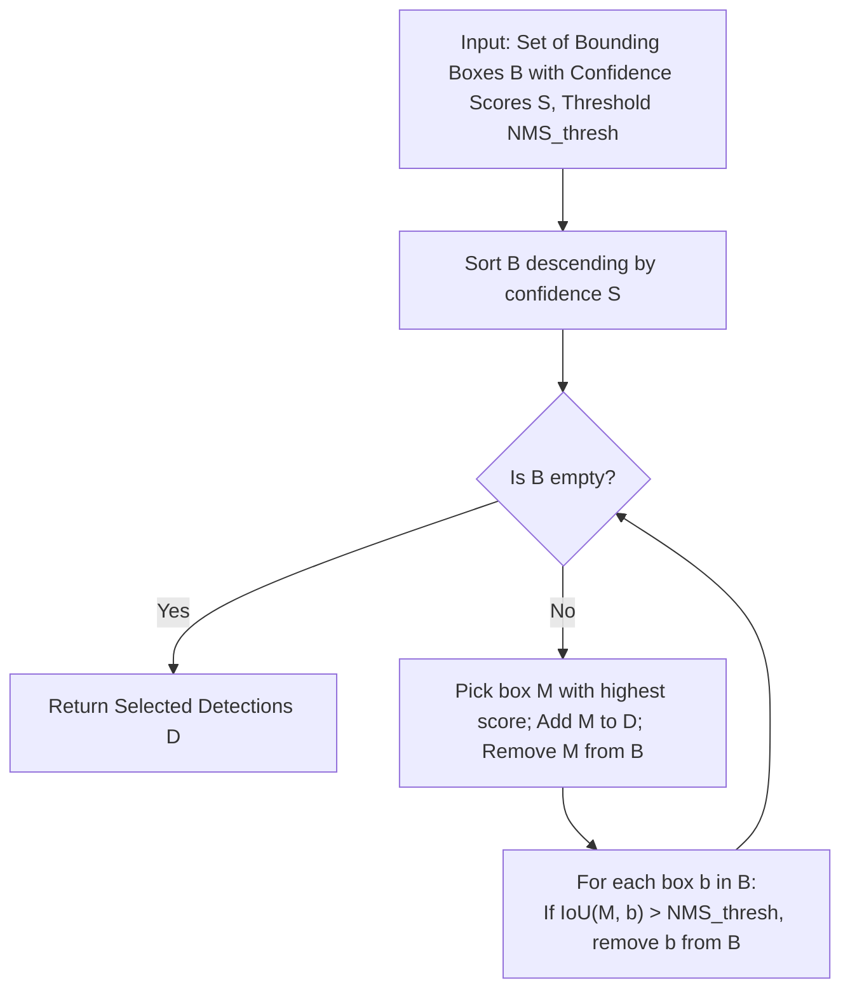
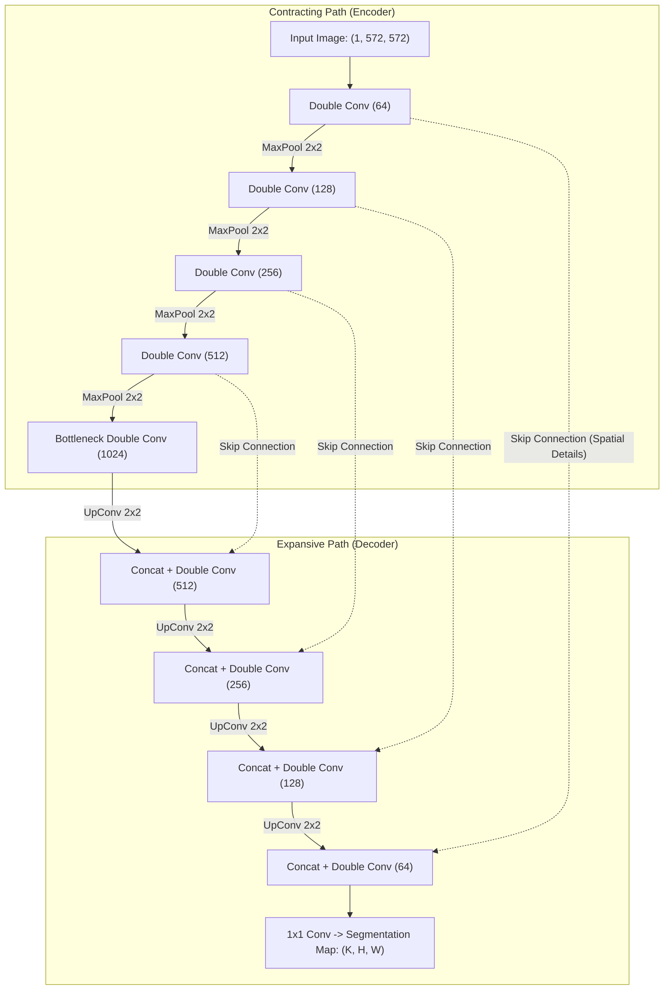
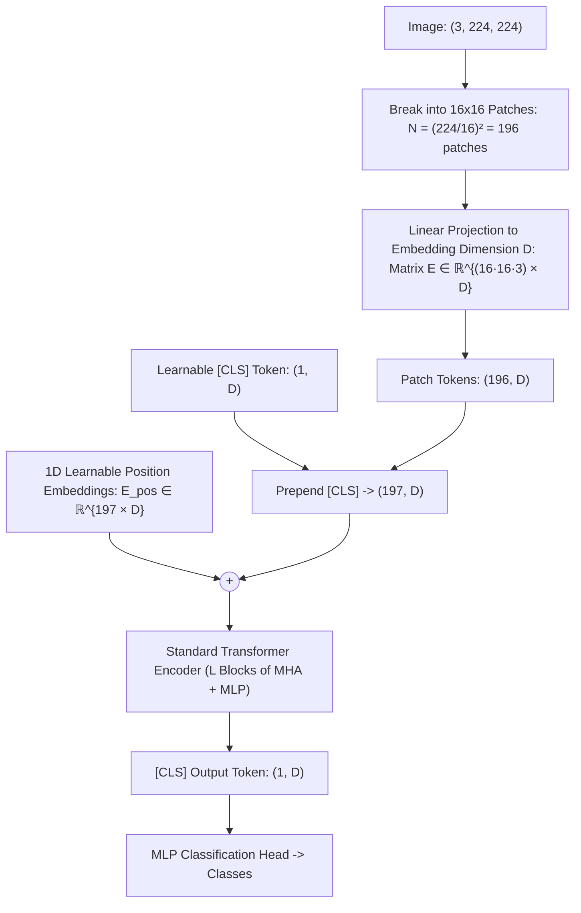
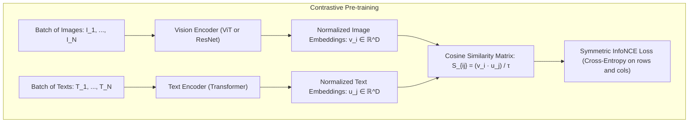

# Computer Vision Tasks, Vision Transformers & Multimodal Vision — Detection, Segmentation, ViT & CLIP

!!! info "Prerequisites"
    Convolutional architectures, attention mechanisms, and cross-entropy loss. Review [Modern CNN Architectures](modern-cnn-architectures-transfer-learning-deep-dive.md), [Convolutional Foundations](convolutional-foundations-deep-dive.md), and [Evaluation Metrics](../05-ml-theory/evaluation-metrics-deep-dive.md).

---

## 1. The Big Picture

Computer vision spans a hierarchy of spatial reasoning tasks with increasing granularity:
1. **Image Classification**: Assigning a discrete semantic label to an entire image ($X \to y \in \{1, \dots, K\}$).
2. **Object Detection**: Localizing multiple foreground objects with axis-aligned bounding boxes and predicting their class labels ($X \to \{(b_i, c_i)\}_{i=1}^M$).
3. **Semantic Segmentation**: Assigning a discrete class label to every individual pixel ($X \in \mathbb{R}^{3 \times H \times W} \to Y \in \{1, \dots, K\}^{H \times W}$).
4. **Vision Transformers (ViT)**: Abandoning convolutional inductive biases (spatial locality and translation equivariance) in favor of treating images as sequences of flattened patches processed by standard Transformer encoders.
5. **Multimodal Vision (CLIP)**: Jointly embedding images and natural language text into a shared latent space via contrastive learning, enabling open-vocabulary zero-shot classification and multimodal search.



---

## 2. Object Detection: Paradigms, Bounding Boxes & NMS

### 2.1 Bounding Box Parameterization & Metrics

A bounding box can be parameterized in two equivalent formats:
- **Corner Coordinates**: $[x_{\min}, y_{\min}, x_{\max}, y_{\max}]$
- **Center-Offset Format**: $[x_c, y_c, w, h]$ where $x_c = \frac{x_{\min} + x_{\max}}{2}$, $y_c = \frac{y_{\min} + y_{\max}}{2}$, $w = x_{\max} - x_{\min}$, $h = y_{\max} - y_{\min}$.

#### Intersection over Union (IoU) / Jaccard Index
Given predicted box $B_{\text{pred}}$ and ground truth box $B_{\text{gt}}$:

$$
\text{IoU}(B_{\text{pred}}, B_{\text{gt}}) = \frac{\text{Area}(B_{\text{pred}} \cap B_{\text{gt}})}{\text{Area}(B_{\text{pred}} \cup B_{\text{gt}})} = \frac{\text{Area}(B_{\text{pred}} \cap B_{\text{gt}})}{\text{Area}(B_{\text{pred}}) + \text{Area}(B_{\text{gt}}) - \text{Area}(B_{\text{pred}} \cap B_{\text{gt}})}
$$

A predicted box is declared a True Positive if $\text{IoU} \ge \tau$ (typically $\tau = 0.5$ or $\tau = 0.75$).



### 2.2 Non-Maximum Suppression (NMS)

Object detectors generate dozens of candidate bounding boxes overlapping the same physical object. **Non-Maximum Suppression (NMS)** iteratively prunes redundant proposals:



---

## 3. Two-Stage vs. One-Stage Detectors

```mermaid
flowchart TD
    subgraph "Two-Stage Detection (Faster R-CNN)"
        IMG1["Input Image"] --> BB1["Backbone CNN / ResNet"]
        BB1 --> RPN["Region Proposal Network (RPN)\nGenerates ~2000 Candidate RoIs"]
        RPN --> POOL["RoI Pooling / RoIAlign"]
        POOL --> HEAD["Classification & Box Regression Heads"]
        HEAD --> OUT1["High Accuracy, Lower FPS (~15 FPS)"]
    end

    subgraph "One-Stage Detection (YOLO / SSD)"
        IMG2["Input Image"] --> BB2["Backbone + Feature Pyramid Network (FPN)"]
        BB2 --> DENSE["Dense Grid Anchor Prediction (S x S)"]
        DENSE --> OUT2["Direct Class + Box Coordinates\nReal-Time Speed (60-140 FPS)"]
    end
```



### 3.1 Two-Stage: The R-CNN Family

1. **R-CNN (Girshick et al., 2014)**: Extracted $\approx 2000$ region proposals via non-differentiable CPU Selective Search, cropped each patch, warped to $224 \times 224$, and ran an independent forward pass through AlexNet. Extremely slow ($\approx 47$ seconds per image).
2. **Fast R-CNN (Girshick, 2015)**: Computed the convolutional feature map on the whole image once. Used **RoI Pooling** to crop feature maps directly, accelerating inference to $\approx 2$ seconds per image.
3. **Faster R-CNN (Ren et al., 2015)**: Replaced Selective Search with a fully differentiable **Region Proposal Network (RPN)** sliding over the shared convolutional feature map.
   - Anchors: Multiple aspect ratios and scales ($3 \times 3 = 9$ anchors per spatial cell).
   - Speed: Enabled near real-time inference ($\approx 10-15$ FPS).

### 3.2 One-Stage: YOLO (You Only Look Once, Redmon et al., 2016)

YOLO frames object detection as a single end-to-end spatial regression task:
- Divides the image into an $S \times S$ spatial grid (e.g. $7 \times 7$ or $19 \times 19$).
- If an object center falls into a grid cell, that cell is responsible for detecting it.
- Each cell predicts $B$ bounding boxes, each consisting of 5 coordinates: $(x, y, w, h, \text{confidence})$, plus $C$ conditional class probabilities $P(\text{Class}_k | \text{Object})$.
- Total output tensor dimension: $S \times S \times (B \times 5 + C)$.
- Evaluates the entire image in a single forward pass, processing images at $45-155$ FPS on GPU hardware.

---

## 4. Semantic Segmentation & The U-Net Architecture (Ronneberger et al., 2015)

In semantic segmentation, every pixel must be classified into a semantic category. Standard downsampling CNNs collapse spatial resolution, destroying fine localization.

Olaf Ronneberger et al. introduced **U-Net** for biomedical microscopy segmentation. U-Net features a symmetric encoder-decoder topology with cross-network skip connections.



### 4.1 Skip Connections in U-Net

In standard autoencoders, deep spatial downsampling creates an information bottleneck where exact edge boundaries and micro-spatial details are irrevocably lost.  
U-Net's skip connections copy high-resolution spatial feature maps directly from the contracting path and **concatenate** them along the channel axis with the upsampled feature maps in the expansive path:

$$
X_{\text{decoder}}^{[l]} = \left[ \text{UpSample}(X_{\text{decoder}}^{[l+1]}), \, X_{\text{encoder}}^{[l]} \right]
$$

This allows the decoder to combine **high-level semantic context** ("what is in this region") with **precise low-level spatial geometry** ("where exactly is the boundary").

### 4.2 Dice Loss for Imbalanced Segmentation

In medical segmentation and defect detection, background pixels frequently occupy $98-99\%$ of the image, causing standard Cross-Entropy to trivially predict background everywhere.  
The **Sørensen-Dice coefficient** measures contour overlap. The differentiable **Dice Loss** is:

$$
\mathcal{L}_{\text{Dice}} = 1 - \frac{2 \sum_{i=1}^N p_i g_i + \epsilon}{\sum_{i=1}^N p_i + \sum_{i=1}^N g_i + \epsilon}
$$

where $p_i \in [0, 1]$ is the predicted probability and $g_i \in \{0, 1\}$ is ground truth binary mask. When the target object is absent ($g = 0$) or tiny, smoothing term $\epsilon \approx 1$ prevents division by zero.

---

## 5. Vision Transformers (ViT, Dosovitskiy et al., 2020)

Before 2020, self-attention was applied either inside convolutional layers or to replace individual convolutions. In *An Image is Worth 16x16 Words*, Alexey Dosovitskiy et al. demonstrated that **a standard Transformer encoder applied directly to flattened image patches attains state-of-the-art visual recognition** when pretrained on massive datasets (JFT-300M, ImageNet-21k).



### 5.1 Mathematical Formulation of ViT

1. **Patch Extraction & Flattening**:  
   Given image $\mathbf{x} \in \mathbb{R}^{H \times W \times C}$ and patch size $P \times P$:
   $$N = \frac{H \cdot W}{P^2} \quad \text{patches}$$
   Flatten each patch into a vector $\mathbf{x}_p^{(i)} \in \mathbb{R}^{P^2 \cdot C}$ for $i \in \{1, \dots, N\}$.
2. **Linear Patch Projection**:  
   Project flattened patches to constant embedding dimension $D$ via learnable weight matrix $E \in \mathbb{R}^{(P^2 \cdot C) \times D}$:
   $$\mathbf{z}_0 = \left[ \mathbf{x}_{\text{class}}; \, \mathbf{x}_p^{(1)} E; \, \dots; \, \mathbf{x}_p^{(N)} E \right] + E_{\text{pos}}$$
   where $\mathbf{x}_{\text{class}} \in \mathbb{R}^D$ is the learnable classification token ($[CLS]$), and $E_{\text{pos}} \in \mathbb{R}^{(N+1) \times D}$ are 1D learnable positional embeddings.
3. **Transformer Encoder Blocks ($l = 1, \dots, L$)**:
   $$\mathbf{z}'_l = \text{MSA}(\text{LN}(\mathbf{z}_{l-1})) + \mathbf{z}_{l-1}$$
   $$\mathbf{z}_l = \text{MLP}(\text{LN}(\mathbf{z}'_l)) + \mathbf{z}'_l$$
4. **Classification Head**:
   $$y = \text{Linear}(\text{LN}(\mathbf{z}_L^0))$$

### 5.2 ViT vs. CNN: Inductive Bias Comparison

| Property | Convolutional Neural Network (CNN) | Vision Transformer (ViT) |
| :--- | :--- | :--- |
| **Spatial Locality** | Built into architecture (hard-coded local receptive fields). | None (attends across all patches globally at layer 1). |
| **Translation Equivariance** | Guaranteed mathematically by weight sharing. | Not built-in; must be learned purely from data. |
| **Small Dataset Regime ($< 10^5$)** | High sample efficiency; generalizes well due to inductive bias. | Overfits severely; lacks constraints to discover spatial structure. |
| **Massive Dataset Regime ($> 10^7$)** | Performance plateaus due to inductive bias constraints. | Scales monotonically; dominates performance without saturation. |
| **Computational Complexity** | $\mathcal{O}(H \cdot W \cdot K^2)$ — Linear with image pixel count. | $\mathcal{O}(N^2 \cdot D) = \mathcal{O}\left( \frac{H^2 W^2}{P^4} \cdot D \right)$ — Quadratic with patch count. |

---

## 6. Multimodal Vision: Contrastive Language-Image Pre-Training (CLIP)

Alec Radford et al. (OpenAI, 2021) introduced **CLIP**, demonstrating that scaling contrastive language-image supervision on 400 million internet image-text pairs ($(\mathbf{I}_i, \mathbf{T}_i)$) yields visual representations capable of competitive zero-shot classification across dozens of benchmarks.



### 6.1 Contrastive Symmetric InfoNCE Loss

Given a mini-batch of $N$ (image, text) pairs:
- Vision encoder produces normalized image vectors: $\mathbf{v}_i = \frac{f(\mathbf{I}_i)}{\|f(\mathbf{I}_i)\|_2} \in \mathbb{R}^D$.
- Text encoder produces normalized text vectors: $\mathbf{u}_j = \frac{g(\mathbf{T}_j)}{\|g(\mathbf{T}_j)\|_2} \in \mathbb{R}^D$.
- Pairwise cosine similarity matrix:
  $$S_{i, j} = \frac{\mathbf{v}_i \cdot \mathbf{u}_j}{\tau}$$
  where $\tau = \exp(-\sigma)$ is a learnable temperature parameter.

The loss consists of two symmetric cross-entropy objectives:
1. **Image-to-Text Loss**:
   $$\mathcal{L}_{\text{image}} = -\frac{1}{N} \sum_{i=1}^N \ln \frac{\exp(S_{i, i})}{\sum_{j=1}^N \exp(S_{i, j})}$$
2. **Text-to-Image Loss**:
   $$\mathcal{L}_{\text{text}} = -\frac{1}{N} \sum_{j=1}^N \ln \frac{\exp(S_{j, j})}{\sum_{i=1}^N \exp(S_{i, j})}$$

Total symmetric loss:

$$
\mathcal{L}_{\text{CLIP}} = \frac{1}{2} (\mathcal{L}_{\text{image}} + \mathcal{L}_{\text{text}})
$$

### 6.2 Zero-Shot Classification Mechanism

To classify an unseen test image $\mathbf{I}_{\text{test}}$ across $K$ arbitrary categories:
1. Wrap class names in prompt templates: `"A photo of a {label}."` (e.g. `"A photo of a dog."`, `"A photo of a car."`).
2. Pass all $K$ text prompts through the text encoder to obtain candidate vectors $\mathbf{u}_1, \dots, \mathbf{u}_K \in \mathbb{R}^D$.
3. Pass $\mathbf{I}_{\text{test}}$ through the vision encoder to obtain $\mathbf{v} \in \mathbb{R}^D$.
4. Compute softmax probabilities over the cosine similarities:
   $$P(y = k | \mathbf{I}) = \frac{\exp(\mathbf{v} \cdot \mathbf{u}_k / \tau)}{\sum_{j=1}^K \exp(\mathbf{v} \cdot \mathbf{u}_j / \tau)}$$

Zero-shot classification requires **zero target-task training samples and zero fine-tuning**.

---

## 7. Implementation 1 — Complete U-Net from Scratch in PyTorch

The following complete, production-grade PyTorch script implements the full U-Net architecture with double convolution blocks, contracting encoder, expansive decoder with skip connections, and Dice Loss.

```python
"""
unet_scratch.py
Complete U-Net Implementation from Scratch in PyTorch with Dice Loss.
"""

import torch
import torch.nn as nn
import torch.nn.functional as F


class DoubleConv(nn.Module):
    """
    Two consecutive: [Conv2d -> BatchNorm2d -> ReLU]
    """
    def __init__(self, in_channels: int, out_channels: int):
        super().__init__()
        self.conv = nn.Sequential(
            nn.Conv2d(in_channels, out_channels, kernel_size=3, padding=1, bias=False),
            nn.BatchNorm2d(out_channels),
            nn.ReLU(inplace=True),
            nn.Conv2d(out_channels, out_channels, kernel_size=3, padding=1, bias=False),
            nn.BatchNorm2d(out_channels),
            nn.ReLU(inplace=True),
        )

    def forward(self, x: torch.Tensor) -> torch.Tensor:
        return self.conv(x)


class UNet(nn.Module):
    """
    Symmetric U-Net with contracting path, bottleneck, and expansive path with skip connections.
    """
    def __init__(self, in_channels: int = 1, num_classes: int = 2):
        super().__init__()

        # Contracting Path (Encoder)
        self.down1 = DoubleConv(in_channels, 64)
        self.down2 = DoubleConv(64, 128)
        self.down3 = DoubleConv(128, 256)
        self.down4 = DoubleConv(256, 512)

        self.pool = nn.MaxPool2d(kernel_size=2, stride=2)

        # Bottleneck
        self.bottleneck = DoubleConv(512, 1024)

        # Expansive Path (Decoder)
        self.up4 = nn.ConvTranspose2d(1024, 512, kernel_size=2, stride=2)
        self.conv4 = DoubleConv(1024, 512)

        self.up3 = nn.ConvTranspose2d(512, 256, kernel_size=2, stride=2)
        self.conv3 = DoubleConv(512, 256)

        self.up2 = nn.ConvTranspose2d(256, 128, kernel_size=2, stride=2)
        self.conv2 = DoubleConv(256, 128)

        self.up1 = nn.ConvTranspose2d(128, 64, kernel_size=2, stride=2)
        self.conv1 = DoubleConv(128, 64)

        # Final 1x1 Convolution to class logits
        self.final_conv = nn.Conv2d(64, num_classes, kernel_size=1)

    def forward(self, x: torch.Tensor) -> torch.Tensor:
        # Encoder
        c1 = self.down1(x)
        p1 = self.pool(c1)

        c2 = self.down2(p1)
        p2 = self.pool(c2)

        c3 = self.down3(p2)
        p3 = self.pool(c3)

        c4 = self.down4(p3)
        p4 = self.pool(c4)

        # Bottleneck
        b = self.bottleneck(p4)

        # Decoder with Skip Connections (channel concatenation)
        u4 = self.up4(b)
        x4 = torch.cat([u4, c4], dim=1)
        d4 = self.conv4(x4)

        u3 = self.up3(d4)
        x3 = torch.cat([u3, c3], dim=1)
        d3 = self.conv3(x3)

        u2 = self.up2(d3)
        x2 = torch.cat([u2, c2], dim=1)
        d2 = self.conv2(x2)

        u1 = self.up1(d2)
        x1 = torch.cat([u1, c1], dim=1)
        d1 = self.conv1(x1)

        logits = self.final_conv(d1)
        return logits


class DiceLoss(nn.Module):
    """
    Differentiable Soft Dice Loss for binary or multi-class segmentation.
    """
    def __init__(self, smooth: float = 1.0):
        super().__init__()
        self.smooth = smooth

    def forward(self, logits: torch.Tensor, targets: torch.Tensor) -> torch.Tensor:
        probs = torch.softmax(logits, dim=1)
        targets_one_hot = F.one_hot(targets, num_classes=logits.shape[1]).permute(0, 3, 1, 2).float()

        intersection = torch.sum(probs * targets_one_hot, dim=(2, 3))
        cardinality = torch.sum(probs + targets_one_hot, dim=(2, 3))

        dice = (2.0 * intersection + self.smooth) / (cardinality + self.smooth)
        return 1.0 - torch.mean(dice)


if __name__ == "__main__":
    model = UNet(in_channels=1, num_classes=2)
    criterion = DiceLoss()

    dummy_input = torch.randn(2, 1, 128, 128)
    dummy_target = torch.randint(0, 2, (2, 128, 128), dtype=torch.long)

    output = model(dummy_input)
    loss = criterion(output, dummy_target)

    print(f"U-Net Input Shape:  {dummy_input.shape}")
    print(f"U-Net Output Shape: {output.shape} (Expected: (2, 2, 128, 128))")
    print(f"Initial Dice Loss:  {loss.item():.4f}")
```

---

## 8. Implementation 2 — Zero-Shot Inference with CLIP / ViT

```python
"""
clip_zeroshot_demo.py
Demonstration of Zero-Shot Classification using contrastive embeddings (CLIP logic).
"""

import torch
import torch.nn as nn
import torch.nn.functional as F


class MockCLIP(nn.Module):
    """
    Minimal functional demonstration of CLIP's dual-encoder cosine similarity mechanism.
    """
    def __init__(self, embed_dim: int = 512):
        super().__init__()
        self.embed_dim = embed_dim
        # Vision backbone (projection)
        self.vision_encoder = nn.Linear(3 * 32 * 32, embed_dim)
        # Text backbone (projection)
        self.text_encoder = nn.Linear(64, embed_dim)
        # Learnable log temperature
        self.logit_scale = nn.Parameter(torch.ones([]) * np.log(1 / 0.07))

    def encode_image(self, x: torch.Tensor) -> torch.Tensor:
        feat = self.vision_encoder(x.flatten(start_dim=1))
        return F.normalize(feat, dim=-1)

    def encode_text(self, text_tokens: torch.Tensor) -> torch.Tensor:
        feat = self.text_encoder(text_tokens)
        return F.normalize(feat, dim=-1)

    def forward(self, images: torch.Tensor, texts: torch.Tensor):
        image_embeds = self.encode_image(images)
        text_embeds = self.encode_text(texts)
        
        logit_scale = self.logit_scale.exp()
        logits_per_image = logit_scale * (image_embeds @ text_embeds.T)
        logits_per_text = logits_per_image.T
        return logits_per_image, logits_per_text


if __name__ == "__main__":
    import numpy as np
    torch.manual_seed(42)
    
    clip = MockCLIP(embed_dim=128)
    # 4 images, 4 text descriptions
    images = torch.randn(4, 3, 32, 32)
    texts = torch.randn(4, 64)

    logits_img, _ = clip(images, texts)
    probs = F.softmax(logits_img, dim=-1)
    
    print("Similarity Logits Matrix (4x4):")
    print(logits_img.detach().numpy().round(2))
    print("\nPredicted Category Probabilities per Image:")
    print(probs.detach().numpy().round(3))
```

---

## 9. Common Errors, Gotchas & Debugging

### 1. Dimension Mismatch in U-Net Skip Connection Concatenation

**Symptom**: `RuntimeError: Sizes of tensors must match except in dimension 1. Expected size 68 but got size 64 for tensor number 1 in the list.`  
**Root Cause**: Input images whose spatial height/width are not clean powers of 2. After four $2 \times 2$ downsampling steps ($H / 16$), integer division causes rounding discrepancies between upsampled features and encoder skip features.  
**Fix**: Ensure input spatial dimensions are divisible by $2^L$ (e.g. $16$ or $32$), or use bilinear interpolation in the upsampling block to match shapes dynamically:

```python
# FIX IN DECODER FOR ARBITRARY INPUT DIMENSIONS
diffY = c_skip.size()[2] - u.size()[2]
diffX = c_skip.size()[3] - u.size()[3]
u = F.pad(u, [diffX // 2, diffX - diffX // 2, diffY // 2, diffY - diffY // 2])
x = torch.cat([u, c_skip], dim=1)
```

### 2. Forgetting the $[CLS]$ Token Prepend in Vision Transformers

**Symptom**: Output classification dimension corresponds to patch sequences ($196, D$) instead of a single global representation vector.  
**Root Cause**: ViT expects a dedicated learnable classification token to aggregate global context across self-attention heads, rather than naively pooling across tokens.  
**Fix**: Prepend a learnable parameter tensor of shape $(1, 1, D)$ to the patch embeddings before adding positional embeddings.

---

## 10. Staff-Level Technical Interview Questions

### Q1: Compare Vision Transformers (ViT) and CNNs regarding their inductive biases and explain why ViT underperforms CNNs on small datasets but outperforms them on massive datasets.

**Model Answer:**  
CNNs possess two hard-coded **inductive biases**:
1. **Spatial Locality**: Convolutions operate on small local neighborhoods ($3 \times 3$), baking in the assumption that pixels close to each other carry stronger statistical correlation.
2. **Translation Equivariance**: Weight sharing ensures that shifting an image shifts feature maps identically ($f(T X) = T f(X)$).

These inductive biases restrict the hypothesis class $\mathcal{H}_{\text{CNN}} \subset \mathcal{H}_{\text{ViT}}$.  
- **Small Dataset Regime ($N < 10^5$)**: The inductive biases act as powerful structural regularizers. A CNN does not need to learn that adjacent pixels are related; it knows it *a priori*. ViT, having zero spatial assumptions, must learn 2D geometry, spatial adjacency, and translation invariance entirely from data. With insufficient data, ViT overfits or fails to discover basic visual primitives.
- **Massive Dataset Regime ($N > 10^7$)**: The inductive biases of CNNs become a **representational bottleneck**. Convolutions cannot model long-range global relationships in early layers without deep stacks. ViT's unconstrained self-attention allows any patch to attend to any other patch globally at layer 1. As data scales, ViT's larger, expressive hypothesis class continuously improves without the saturation observed in CNNs.

---

### Q2: Derive the computational complexity of Self-Attention across image patches in ViT as a function of image resolution $(H, W)$ and patch size $P$.

**Model Answer:**  
Let an image have resolution $H \times W$ and patch size $P \times P$.  
1. **Number of Tokens ($N$)**:
   $$N = \frac{H \cdot W}{P^2}$$
2. **Projection**:
   Linear projection of $N$ tokens to embedding dimension $D$ costs $\mathcal{O}(N \cdot P^2 C \cdot D) = \mathcal{O}(H \cdot W \cdot C \cdot D)$.
3. **Scaled Dot-Product Attention**:
   Given $Q, K, V \in \mathbb{R}^{N \times D}$:
   - $Q K^T$: Matrix multiplication of $(N \times D)$ by $(D \times N)$ costs $\mathcal{O}(N^2 \cdot D)$.
   - $\text{Softmax}(Q K^T / \sqrt{D}) V$: Matrix multiplication of $(N \times N)$ by $(N \times D)$ costs $\mathcal{O}(N^2 \cdot D)$.
4. **Complexity in terms of $(H, W)$**:
   Substituting $N = \frac{H \cdot W}{P^2}$:
   $$\text{Complexity} = \mathcal{O}\left( \left( \frac{H \cdot W}{P^2} \right)^2 \cdot D \right) = \mathcal{O}\left( \frac{H^2 W^2}{P^4} \cdot D \right)$$

While a CNN's compute scales **linearly** with image resolution ($\mathcal{O}(H \cdot W)$), standard ViT self-attention scales **quadratically** ($\mathcal{O}(H^2 W^2)$), making raw ViT prohibitively expensive for high-resolution dense tasks (segmentation, detection) without windowed attention (e.g. Swin Transformer).

---

### Q3: Explain why U-Net utilizes skip connections by concatenation rather than addition (as in ResNet).

**Model Answer:**  
- **In ResNet (Addition: $\mathbf{x} + \mathcal{F}(\mathbf{x})$)**: Both tensors represent features at the **same semantic level and channel dimension**. Addition acts as a residual perturbation, preserving identity while refining features.
- **In U-Net (Concatenation: $[\mathbf{x}_{\text{encoder}}, \mathbf{x}_{\text{decoder}}]$)**: The two tensors belong to fundamentally **different representation spaces**:
  1. $\mathbf{x}_{\text{encoder}}$ contains raw, low-level spatial features (exact pixel coordinates, sharp edge boundaries, fine textures) with little semantic meaning.
  2. $\mathbf{x}_{\text{decoder}}$ contains high-level abstract semantics ("tumor", "cell nucleus") with blurry spatial localization due to downsampling.
  If U-Net added them directly, the high-level semantic signals would be destructively interfered with by low-level intensity values. By **concatenating** along the channel dimension, the subsequent $3 \times 3$ convolutional layers in the decoder can learn independent, dedicated filters that selectively combine spatial coordinates from the encoder channels with semantic labels from the decoder channels.

---

### Q4: Formulate the symmetric InfoNCE loss in CLIP and prove why it acts as a contrastive estimator of Mutual Information.

**Model Answer:**  
In CLIP, given $N$ paired observations $(\mathbf{x}_i, \mathbf{y}_i)$, the similarity score is $s_{ij} = \frac{\mathbf{u}_i^T \mathbf{v}_j}{\tau}$.  
The symmetric InfoNCE loss is:

$$\mathcal{L} = -\frac{1}{2N} \sum_{i=1}^N \left( \ln \frac{\exp(s_{ii})}{\sum_{j=1}^N \exp(s_{ij})} + \ln \frac{\exp(s_{ii})}{\sum_{j=1}^N \exp(s_{ji})} \right)$$

Van den Oord et al. (2018) proved that minimizing InfoNCE maximizes a lower bound on the **Mutual Information** $I(X; Y)$ between the visual representations and textual representations:

$$I(X; Y) \ge \ln(N) - \mathcal{L}_{\text{InfoNCE}}$$

where $N$ is the batch size.  
Because $\ln(N)$ is the theoretical maximum bound on mutual information achievable with $N$ samples, increasing mini-batch size $N$ directly loosens the information-theoretic capacity limit. This explains why CLIP required massive mini-batch sizes ($N = 32,768$) to learn rich multimodal alignment.

---

### Q5: How does Non-Maximum Suppression (NMS) resolve the multiple-detection problem, and what is the key limitation of greedy hard-threshold NMS?

**Model Answer:**  
**Mechanism:**  
Given candidate boxes $B$ and confidence scores $S$:
1. Sort $B$ in descending order of scores.
2. Select the box $M$ with the highest score and append to final detections $D$.
3. Compute $\text{IoU}(M, b_i)$ for all remaining boxes $b_i \in B$.
4. Remove any box $b_i$ whose $\text{IoU}(M, b_i) > \tau_{\text{NMS}}$ (e.g. $\tau = 0.5$).
5. Repeat until $B$ is empty.

**Key Limitation (Occlusion Failure):**  
Greedy NMS assumes that two bounding boxes with high IoU always represent the *same* physical object. In dense crowds or occluded scenes (e.g., one person standing partially in front of another person), two distinct objects genuinely share high IoU ($>0.5$). Greedy hard NMS will completely delete the occluded object, producing a false negative.  
**Remedy**: **Soft-NMS** (Bodla et al., 2017) decays the confidence score of overlapping boxes as a continuous function of IoU ($S_i \leftarrow S_i \exp(-\frac{\text{IoU}^2}{\sigma})$) rather than instantly zeroing them out, allowing occluded objects with high residual confidence to survive.

---

## 11. Mastery Ladder

- [ ] **L1:** Parameterize bounding boxes in corner and center formats and compute Intersection over Union (IoU).
- [ ] **L2:** Explain the Non-Maximum Suppression (NMS) algorithm step-by-step and identify its occlusion failure mode.
- [ ] **L3:** Contrast Two-Stage detectors (Faster R-CNN) with One-Stage detectors (YOLO) regarding speed and accuracy.
- [ ] **L4:** Describe the Region Proposal Network (RPN) and explain anchor box parameterization.
- [ ] **L5:** Draw the U-Net architecture and explain why skip connections use channel concatenation rather than addition.
- [ ] **L6:** Write the mathematical formulation of the Dice Loss and explain why it handles extreme class imbalance.
- [ ] **L7:** Explain Vision Transformer (ViT) patch extraction, linear projection, and $[CLS]$ token mechanics.
- [ ] **L8:** Compare the inductive biases of CNNs and ViTs and explain the sample-efficiency crossover point.
- [ ] **L9:** Formulate CLIP's symmetric InfoNCE loss and explain its zero-shot classification mechanism.
- [ ] **L10:** Implement a complete U-Net from scratch in PyTorch, verify forward shapes, and demonstrate zero-shot CLIP contrastive scoring.
