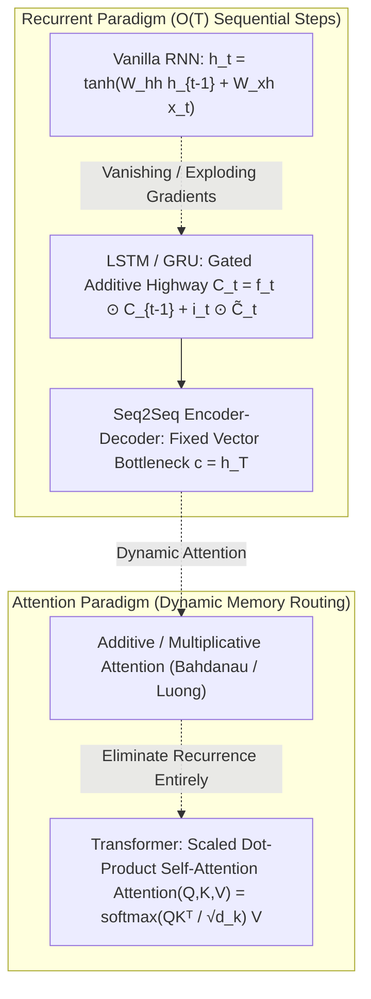
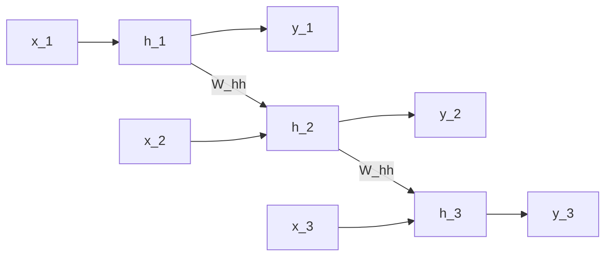
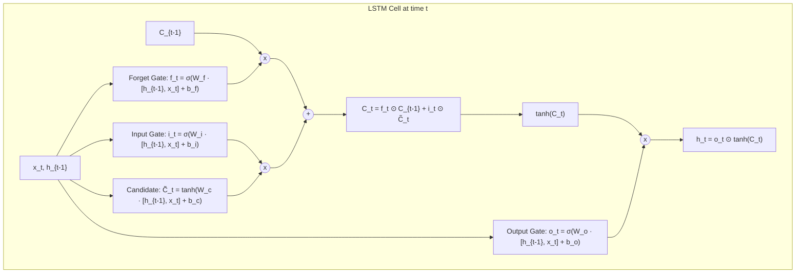
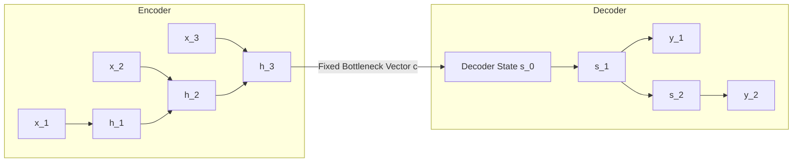
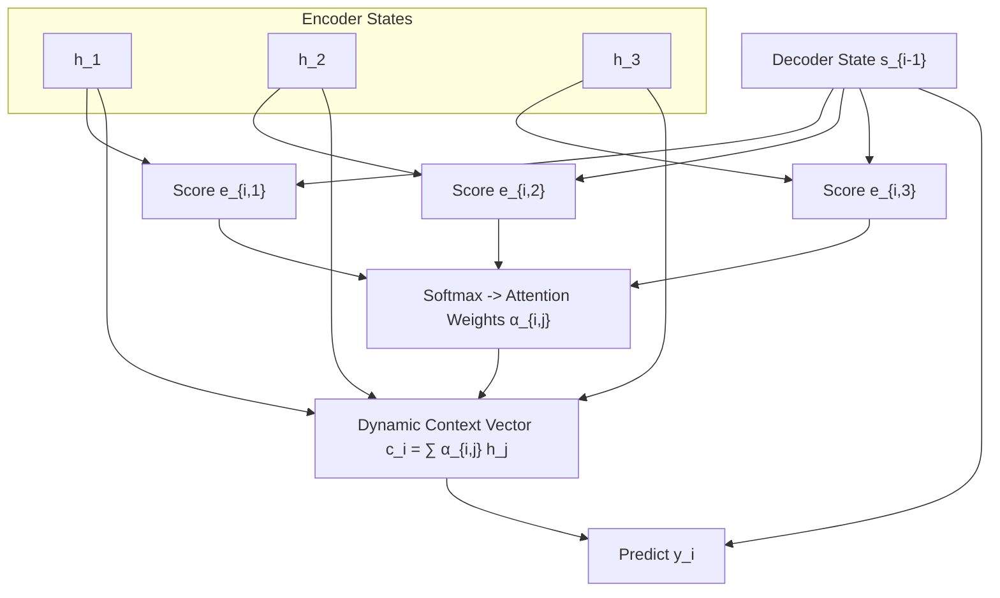
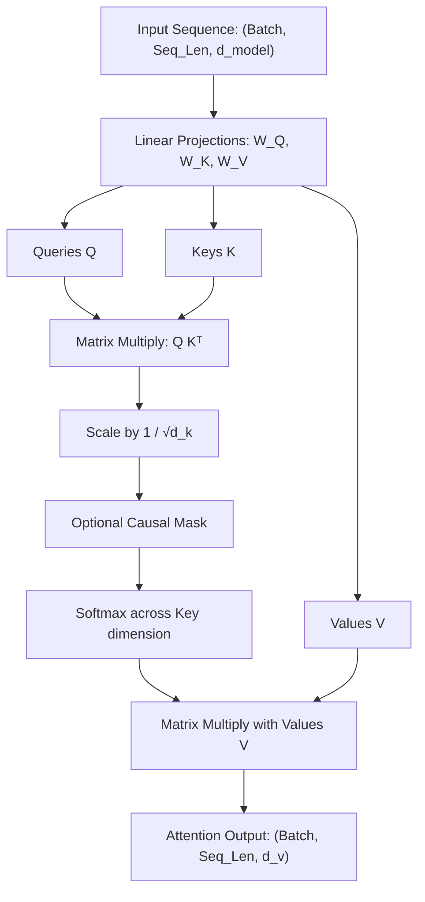

# Sequence Models, Attention & The Transformer Revolution — From RNNs & LSTMs to Attention & Self-Attention

!!! info "Prerequisites"
    Recurrent computation, multivariate backpropagation, and matrix calculus. Review [Text Representation & Word Embeddings](text-representation-word-embeddings-deep-dive.md), [Neural Network Foundations](../06-deep-learning/neural-network-foundations-deep-dive.md), and [Linear Algebra](../02-mathematics/linear-algebra-deep-dive.md).

---

## 1. The Big Picture

Human language is intrinsically sequential, temporal, and hierarchical: the semantic meaning of a word depends on preceding words, following words, and distant syntactic structures.

The architecture of sequence modeling evolved through three foundational eras:
1. **Recurrent Neural Networks (RNNs)**: Processing sequences step-by-step using a shared hidden recurrence $h_t = f(h_{t-1}, x_t)$. While theoretically Turing-complete, RNNs suffer from **vanishing and exploding gradients**, preventing them from learning dependencies spanning more than $10-20$ steps.
2. **Gated Architectures (LSTM & GRU)**: Introducing additive cell states and multiplicative gating mechanisms (forget, input, output gates) that create an **additive gradient highway**, expanding temporal memory to several hundred steps.
3. **Seq2Seq & Attention**: Resolving the fixed-length vector bottleneck of encoder-decoder architectures by computing dynamic alignment weights over all source encoder states.
4. **The Transformer Revolution (Vaswani et al., 2017)**: Eliminating sequential recurrence entirely. By relying purely on **Self-Attention**, Transformers compute pairwise token interactions in $\mathcal{O}(1)$ sequential operations, unlocking massive parallelization across modern GPU hardware.



---

## 2. Sequence Modeling Fundamentals

### 2.1 Autoregressive Factorization

Let a sequence of discrete tokens be $\mathbf{x} = (x_1, x_2, \dots, x_T)$. By the probability chain rule, the joint probability decomposes exactly into a product of conditional probabilities without loss of generality:

$$
P(x_1, x_2, \dots, x_T) = \prod_{t=1}^T P(x_t \mid x_1, \dots, x_{t-1}) = \prod_{t=1}^T P(x_t \mid x_{<t})
$$

Language modeling trains a parameterized neural network $\Theta$ to estimate these conditional distributions:

$$
\mathcal{L}(\Theta) = -\sum_{t=1}^T \ln P(x_t \mid x_{<t}; \Theta)
$$

---

## 3. Recurrent Neural Networks (RNN) & Backpropagation Through Time

### 3.1 The Hidden State Recurrence

An RNN processes sequence tokens sequentially from $t=1$ to $T$. At each time step $t$, the recurrent unit receives the current input vector $\mathbf{x}_t \in \mathbb{R}^d$ and the previous hidden state $\mathbf{h}_{t-1} \in \mathbb{R}^h$:

$$
\mathbf{a}_t = W_{hh} \mathbf{h}_{t-1} + W_{xh} \mathbf{x}_t + \mathbf{b}_h
$$

$$
\mathbf{h}_t = \tanh(\mathbf{a}_t)
$$

$$
\hat{\mathbf{y}}_t = \text{softmax}(W_{hy} \mathbf{h}_t + \mathbf{b}_y)
$$

The parameter matrices $W_{hh} \in \mathbb{R}^{h \times h}$, $W_{xh} \in \mathbb{R}^{h \times d}$, and $W_{hy} \in \mathbb{R}^{K \times h}$ are shared across all time steps $t \in \{1, \dots, T\}$.



### 3.2 Backpropagation Through Time (BPTT) & Mathematical Proof of Vanishing Gradients

Let $\mathcal{L} = \sum_{t=1}^T \mathcal{L}_t$ be the total sequence loss. The gradient with respect to recurrent weight matrix $W_{hh}$ accumulates across time:

$$
\frac{\partial \mathcal{L}}{\partial W_{hh}} = \sum_{t=1}^T \sum_{k=1}^t \frac{\partial \mathcal{L}_t}{\partial \mathbf{h}_t} \frac{\partial \mathbf{h}_t}{\partial \mathbf{h}_k} \frac{\partial \mathbf{h}_k}{\partial W_{hh}}
$$

The term $\frac{\partial \mathbf{h}_t}{\partial \mathbf{h}_k}$ measures how changes in the hidden state at step $k$ affect the hidden state at step $t > k$. By the multivariate chain rule, this Jacobian matrix expands into a long product:

$$
\frac{\partial \mathbf{h}_t}{\partial \mathbf{h}_k} = \prod_{j=k+1}^t \frac{\partial \mathbf{h}_j}{\partial \mathbf{h}_{j-1}}
$$

Recall that $\mathbf{h}_j = \tanh(W_{hh} \mathbf{h}_{j-1} + W_{xh} \mathbf{x}_j + \mathbf{b}_h)$.  
The intermediate Jacobian matrix is:

$$
\frac{\partial \mathbf{h}_j}{\partial \mathbf{h}_{j-1}} = \text{diag}\left( 1 - \mathbf{h}_j^2 \right) W_{hh}^T
$$

Let $D_j = \text{diag}(1 - \mathbf{h}_j^2)$. The product over $t - k$ steps is:

$$
\frac{\partial \mathbf{h}_t}{\partial \mathbf{h}_k} = \prod_{j=k+1}^t D_j W_{hh}^T
$$

Taking the matrix 2-norm:

$$
\left\| \frac{\partial \mathbf{h}_t}{\partial \mathbf{h}_k} \right\|_2 \le \prod_{j=k+1}^t \|D_j\|_2 \cdot \|W_{hh}^T\|_2
$$

Because the derivative of $\tanh$ is bounded by $1$ ($0 < 1 - \tanh^2(z) \le 1$), $\|D_j\|_2 \le 1$.  
Let $\lambda_{\max}$ be the largest eigenvalue (spectral radius) of $W_{hh}$:
1. **Vanishing Gradients**: If $\|W_{hh}\|_2 < 1$ (or $\lambda_{\max} < 1$), then:
   $$\left\| \frac{\partial \mathbf{h}_t}{\partial \mathbf{h}_k} \right\|_2 \le (\lambda_{\max})^{t - k} \xrightarrow{t - k \to \infty} 0$$
   The error gradient decays exponentially to zero. The network cannot learn long-term dependencies.
2. **Exploding Gradients**: If $\lambda_{\max} > 1$, then in un-saturated regions the norm grows exponentially as $(\lambda_{\max})^{t-k} \to \infty$, causing numeric overflow (`NaN`) and optimizer divergence.

---

## 4. Long Short-Term Memory (LSTM) & Gated Recurrent Units (GRU)

### 4.1 LSTM Architecture (Hochreiter & Schmidhuber, 1997)

Sepp Hochreiter and Jürgen Schmidhuber solved vanishing gradients by separating memory into two distinct vectors:
- **Hidden State $\mathbf{h}_t \in \mathbb{R}^h$**: Short-term working memory exposed to downstream layers.
- **Cell State $\mathbf{C}_t \in \mathbb{R}^h$**: Long-term memory flowing through a linear **Constant Error Carousel (CEC)** with additive updates.



### 4.2 The Mathematical Recurrences of LSTM

At each time step $t$, concatenate $[\mathbf{h}_{t-1}, \mathbf{x}_t] \in \mathbb{R}^{h + d}$:
1. **Forget Gate $\mathbf{f}_t$**: Decides what fraction of old memory $\mathbf{C}_{t-1}$ to retain:
   $$\mathbf{f}_t = \sigma(W_f [\mathbf{h}_{t-1}, \mathbf{x}_t] + \mathbf{b}_f) \in (0, 1)^h$$
2. **Input Gate $\mathbf{i}_t$**: Decides which coordinates of candidate memory to write:
   $$\mathbf{i}_t = \sigma(W_i [\mathbf{h}_{t-1}, \mathbf{x}_t] + \mathbf{b}_i) \in (0, 1)^h$$
3. **Candidate Cell State $\widetilde{\mathbf{C}}_t$**: New information created at step $t$:
   $$\widetilde{\mathbf{C}}_t = \tanh(W_c [\mathbf{h}_{t-1}, \mathbf{x}_t] + \mathbf{b}_c) \in (-1, 1)^h$$
4. **Cell State Update $\mathbf{C}_t$ (The Additive Highway)**:
   $$\mathbf{C}_t = \mathbf{f}_t \odot \mathbf{C}_{t-1} + \mathbf{i}_t \odot \widetilde{\mathbf{C}}_t$$
5. **Output Gate $\mathbf{o}_t$**: Filters which cell states are exposed as hidden state:
   $$\mathbf{o}_t = \sigma(W_o [\mathbf{h}_{t-1}, \mathbf{x}_t] + \mathbf{b}_o) \in (0, 1)^h$$
6. **Hidden State $\mathbf{h}_t$**:
   $$\mathbf{h}_t = \mathbf{o}_t \odot \tanh(\mathbf{C}_t)$$

### 4.3 Why LSTM Solves Vanishing Gradients

Examine the derivative of cell state $\mathbf{C}_t$ with respect to prior cell state $\mathbf{C}_{t-1}$:

$$
\frac{\partial \mathbf{C}_t}{\partial \mathbf{C}_{t-1}} = \mathbf{f}_t + \frac{\partial \mathbf{f}_t}{\partial \mathbf{C}_{t-1}} \mathbf{C}_{t-1} + \frac{\partial \mathbf{i}_t}{\partial \mathbf{C}_{t-1}} \widetilde{\mathbf{C}}_t + \mathbf{i}_t \frac{\partial \widetilde{\mathbf{C}}_t}{\partial \mathbf{C}_{t-1}}
$$

Notice the leading term $\mathbf{f}_t$. If the network learns that a piece of information is critical, it sets the forget gate $\mathbf{f}_t \approx 1$.  
The Jacobian error product across $T$ steps becomes:

$$
\frac{\partial \mathbf{C}_T}{\partial \mathbf{C}_k} = \prod_{j=k+1}^T \mathbf{f}_j \approx 1^{T - k} = 1
$$

The gradient flows backward **linearly and additively without exponential decay**, allowing LSTMs to preserve signals across hundreds of steps.

### 4.4 Gated Recurrent Unit (GRU, Cho et al., 2014)

Kyunghyun Cho et al. streamlined the LSTM by merging the cell state and hidden state, and combining forget and input gates into a single update gate:
- **Reset Gate $\mathbf{r}_t$**: Controls how much of past state to ignore:
  $$\mathbf{r}_t = \sigma(W_r [\mathbf{h}_{t-1}, \mathbf{x}_t] + \mathbf{b}_r)$$
- **Update Gate $\mathbf{z}_t$**: Acts simultaneously as forget gate ($1 - \mathbf{z}_t$) and input gate ($\mathbf{z}_t$):
  $$\mathbf{z}_t = \sigma(W_z [\mathbf{h}_{t-1}, \mathbf{x}_t] + \mathbf{b}_z)$$
- **Candidate Hidden State $\widetilde{\mathbf{h}}_t$**:
  $$\widetilde{\mathbf{h}}_t = \tanh(W_h [\mathbf{r}_t \odot \mathbf{h}_{t-1}, \, \mathbf{x}_t] + \mathbf{b}_h)$$
- **Hidden State Update**:
  $$\mathbf{h}_t = (1 - \mathbf{z}_t) \odot \mathbf{h}_{t-1} + \mathbf{z}_t \odot \widetilde{\mathbf{h}}_t$$

GRUs have $\approx 25\%$ fewer parameters than LSTMs and converge faster on small-to-moderate datasets while achieving comparable expressive capacity.

---

## 5. Sequence-to-Sequence (Seq2Seq) & The Attention Mechanism

### 5.1 The Fixed Context Vector Bottleneck (Sutskever et al., 2014)

In machine translation (e.g. English $\to$ German), input and output sequences have different lengths ($T_{\text{in}} \ne T_{\text{out}}$).  
The standard Seq2Seq model employs an **Encoder-Decoder** architecture:
- **Encoder**: Reads source sequence $(\mathbf{x}_1, \dots, \mathbf{x}_{T_x})$ and compresses it into a single final hidden vector $\mathbf{c} = \mathbf{h}_{T_x}$.
- **Decoder**: Unrolls target tokens autoregressively conditioned on this single fixed vector $\mathbf{c}$.

**The Information Bottleneck**: Compressing a 50-word sentence containing multiple clauses into a single 512-dimensional vector $\mathbf{c}$ causes catastrophic information loss for sentences longer than $\approx 15-20$ words.



### 5.2 The Attention Mechanism: Dynamic Memory Routing

Dzmitry Bahdanau et al. (2014) solved the bottleneck by allowing the decoder to **attend to all intermediate encoder hidden states** $\mathbf{h}_1, \dots, \mathbf{h}_{T_x}$ dynamically at every decoding step $i$.



### 5.3 Bahdanau (Additive) vs. Luong (Multiplicative) Attention

Let $\mathbf{s}_{i-1}$ be the decoder state at step $i$, and $\mathbf{h}_j$ be the $j$-th encoder state.

1. **Alignment Score Function $e_{ij}$**:
   - **Bahdanau Additive (1914)**:
     $$e_{ij} = \mathbf{v}_a^T \tanh(W_a \mathbf{s}_{i-1} + U_a \mathbf{h}_j)$$
     where $W_a, U_a, \mathbf{v}_a$ are learnable projection matrices and vectors.
   - **Luong Multiplicative / Dot-Product (2015)**:
     $$e_{ij} = \mathbf{s}_i^T W_a \mathbf{h}_j \quad \text{or} \quad e_{ij} = \mathbf{s}_i^T \mathbf{h}_j \quad (\text{if dimensions match})$$
2. **Attention Weights (Softmax Normalization)**:
   $$\alpha_{ij} = \frac{\exp(e_{ij})}{\sum_{k=1}^{T_x} \exp(e_{ik})}$$
   The scalar $\alpha_{ij} \in [0, 1]$ represents the probability that the decoder should focus on source word $j$ when generating target word $i$.
3. **Dynamic Context Vector $\mathbf{c}_i$**:
   $$\mathbf{c}_i = \sum_{j=1}^{T_x} \alpha_{ij} \mathbf{h}_j$$
4. **Decoder Update**:
   Combine context vector $\mathbf{c}_i$ with decoder state $\mathbf{s}_i$ to predict output token:
   $$\widetilde{\mathbf{s}}_i = \tanh(W_c [\mathbf{c}_i, \mathbf{s}_i])$$
   $$P(y_i \mid y_{<i}, \mathbf{x}) = \text{softmax}(W_s \widetilde{\mathbf{s}}_i)$$

---

## 6. The Transformer Revolution (Vaswani et al., 2017)

Despite the success of Attention in Seq2Seq, LSTMs remained fundamentally constrained by sequential computation: hidden state $\mathbf{h}_t$ cannot be computed until $\mathbf{h}_{t-1}$ completes. This sequential dependency ($\mathcal{O}(T)$ operations) prevented parallel processing on modern GPU clusters.

In *Attention Is All You Need* (2017), Ashish Vaswani et al. discarded recurrence entirely, introducing the **Transformer**.



### 6.1 Scaled Dot-Product Attention

Given query matrix $Q \in \mathbb{R}^{n \times d_k}$, key matrix $K \in \mathbb{R}^{m \times d_k}$, and value matrix $V \in \mathbb{R}^{m \times d_v}$:

$$
\text{Attention}(Q, K, V) = \text{softmax}\left( \frac{Q K^T}{\sqrt{d_k}} \right) V
$$

#### Why Scale by $\frac{1}{\sqrt{d_k}}$?
Assume components of $\mathbf{q}$ and $\mathbf{k}$ are independent random variables with zero mean and unit variance ($\mathbb{E}[q_i] = 0, \text{Var}(q_i) = 1, \mathbb{E}[k_i] = 0, \text{Var}(k_i) = 1$).  
The dot product is $z = \sum_{i=1}^{d_k} q_i k_i$.  
The variance of $z$ is:

$$
\text{Var}(z) = \sum_{i=1}^{d_k} \text{Var}(q_i k_i) = \sum_{i=1}^{d_k} \text{Var}(q_i)\text{Var}(k_i) = d_k \times (1 \times 1) = d_k
$$

As dimensionality $d_k$ grows large (e.g. $d_k = 64$ or $128$), the variance of the dot product grows to $64$, so logits have magnitude $\pm 8$ or higher.  
In this high-magnitude regime, the softmax function **saturates**, pushing probabilities toward 0 or 1 where gradients $\text{softmax}' \to 0$ exponentially vanish!  
Dividing by $\sqrt{d_k}$ rescales the variance back to unit variance:

$$
\text{Var}\left( \frac{\mathbf{q}^T \mathbf{k}}{\sqrt{d_k}} \right) = \frac{1}{d_k} \text{Var}(\mathbf{q}^T \mathbf{k}) = \frac{d_k}{d_k} = 1
$$

This keeps softmax inputs in the linear, active-gradient zone.

### 6.2 Multi-Head Attention (MHA)

Instead of performing a single attention function with $d_{\text{model}}$-dimensional queries, keys, and values, Multi-Head Attention linearly projects $Q, K, V$ into $h$ distinct lower-dimensional subspaces of dimension $d_k = d_{\text{model}} / h$:

$$
\text{MultiHead}(Q, K, V) = \text{Concat}(\text{head}_1, \dots, \text{head}_h) W^O
$$

$$
\text{head}_i = \text{Attention}(Q W_i^Q, \, K W_i^K, \, V W_i^V)
$$

where $W_i^Q \in \mathbb{R}^{d_{\text{model}} \times d_k}$, $W_i^K \in \mathbb{R}^{d_{\text{model}} \times d_k}$, $W_i^V \in \mathbb{R}^{d_{\text{model}} \times d_v}$, and $W^O \in \mathbb{R}^{h d_v \times d_{\text{model}}}$.

**Why Multi-Head?**  
A single attention head can only attend to a single weighted average of context. Multi-head attention allows the model to simultaneously attend to information from different representation subspaces at different positions (e.g. one head attends to syntactic subject-verb agreement, another to pronoun resolution, another to direct objects).

### 6.3 Computational Complexity Comparison

| Layer Type | Complexity per Layer | Sequential Operations | Maximum Path Length |
| :--- | :---: | :---: | :---: |
| **Recurrent (RNN / LSTM)** | $\mathcal{O}(n \cdot d^2)$ | $\mathcal{O}(n)$ | $\mathcal{O}(n)$ |
| **Convolutional (1D)** | $\mathcal{O}(k \cdot n \cdot d^2)$ | $\mathcal{O}(1)$ | $\mathcal{O}(\log_k(n))$ |
| **Self-Attention (Transformer)** | $\mathcal{O}(n^2 \cdot d)$ | $\mathcal{O}(1)$ | $\mathcal{O}(1)$ |

where $n$ is sequence length and $d$ is representation dimension.
- In RNNs, maximum path length between token 1 and token $n$ is $\mathcal{O}(n)$ sequential hops, making long-range credit assignment fragile.
- In Self-Attention, any token connects to any other token in **$\mathcal{O}(1)$ steps**, and the entire sequence is computed in a single GPU matrix multiply.

---

## 7. Implementation 1 — Vectorized LSTM Cell from Scratch (Pure NumPy)

The following complete Python implementation builds an LSTM cell from first principles with full analytical forward and backward passes in NumPy.

```python
"""
scratch_lstm_cell.py
Vectorized Long Short-Term Memory (LSTM) Cell with Analytical Backpropagation in NumPy.
"""

import numpy as np
from typing import Tuple, Dict


class ScratchLSTMCell:
    """
    Single time-step LSTM Cell.
    Input x: shape (batch_size, input_dim)
    Hidden state h: shape (batch_size, hidden_dim)
    Cell state C: shape (batch_size, hidden_dim)
    """

    def __init__(self, input_dim: int, hidden_dim: int):
        self.input_dim = input_dim
        self.hidden_dim = hidden_dim

        # Combined weight matrix for all 4 gates [f, i, c, o] to optimize GEMM
        # W shape: (input_dim + hidden_dim, 4 * hidden_dim)
        concat_dim = input_dim + hidden_dim
        scale = np.sqrt(2.0 / concat_dim)
        self.W = np.random.randn(concat_dim, 4 * hidden_dim) * scale
        self.b = np.zeros((1, 4 * hidden_dim))

        # Forget gate bias initialized to +1.0 (Jozefowicz et al., 2015 trick)
        self.b[0, :hidden_dim] = 1.0

        # Parameter gradients
        self.dW = np.zeros_like(self.W)
        self.db = np.zeros_like(self.b)

    @staticmethod
    def _sigmoid(z: np.ndarray) -> np.ndarray:
        return np.where(z >= 0, 1.0 / (1.0 + np.exp(-z)), np.exp(z) / (1.0 + np.exp(z)))

    def forward(
        self,
        x: np.ndarray,
        h_prev: np.ndarray,
        C_prev: np.ndarray
    ) -> Tuple[np.ndarray, np.ndarray, Dict[str, np.ndarray]]:
        """
        Forward pass for a single time step.
        """
        # 1. Concatenate input and previous hidden state
        concat_in = np.hstack([x, h_prev])  # (N, input_dim + hidden_dim)

        # 2. Linear projection for all 4 gates simultaneously
        gates = concat_in @ self.W + self.b  # (N, 4 * H)
        H = self.hidden_dim

        # 3. Slice gates
        f_gate = self._sigmoid(gates[:, 0:H])              # Forget gate
        i_gate = self._sigmoid(gates[:, H:2*H])            # Input gate
        c_tilde = np.tanh(gates[:, 2*H:3*H])               # Candidate state
        o_gate = self._sigmoid(gates[:, 3*H:4*H])          # Output gate

        # 4. Cell state update (Linear Additive Highway)
        C_next = f_gate * C_prev + i_gate * c_tilde        # (N, H)

        # 5. Hidden state update
        tanh_C = np.tanh(C_next)
        h_next = o_gate * tanh_C                            # (N, H)

        cache = {
            "x": x,
            "h_prev": h_prev,
            "C_prev": C_prev,
            "concat_in": concat_in,
            "f_gate": f_gate,
            "i_gate": i_gate,
            "c_tilde": c_tilde,
            "o_gate": o_gate,
            "tanh_C": tanh_C,
            "C_next": C_next,
        }
        return h_next, C_next, cache

    def backward(
        self,
        dh_next: np.ndarray,
        dC_next: np.ndarray,
        cache: Dict[str, np.ndarray]
    ) -> Tuple[np.ndarray, np.ndarray, np.ndarray]:
        """
        Analytical backward pass for a single time step.
        """
        concat_in = cache["concat_in"]
        C_prev = cache["C_prev"]
        f = cache["f_gate"]
        i = cache["i_gate"]
        c_tilde = cache["c_tilde"]
        o = cache["o_gate"]
        tanh_C = cache["tanh_C"]
        H = self.hidden_dim

        # Gradient through h_next = o * tanh(C_next)
        do = dh_next * tanh_C
        # Total dC includes incoming dC_next plus branch through tanh(C_next)
        dC = dC_next + (dh_next * o) * (1.0 - tanh_C ** 2)

        # Gradients for gates
        df = dC * C_prev
        di = dC * c_tilde
        dc_tilde = dC * i

        # Backprop through gate activation functions
        # Sigmoid derivative: s * (1 - s); Tanh derivative: 1 - t^2
        dg_f = df * f * (1.0 - f)
        dg_i = di * i * (1.0 - i)
        dg_c = dc_tilde * (1.0 - c_tilde ** 2)
        dg_o = do * o * (1.0 - o)

        # Concatenate gate gradients into (N, 4*H)
        dgates = np.hstack([dg_f, dg_i, dg_c, dg_o])

        # Parameter gradients
        self.dW += concat_in.T @ dgates
        self.db += np.sum(dgates, axis=0, keepdims=True)

        # Gradient with respect to concatenated input
        dconcat = dgates @ self.W.T
        dx = dconcat[:, :self.input_dim]
        dh_prev = dconcat[:, self.input_dim:]

        # Gradient with respect to C_prev
        dC_prev = dC * f

        return dx, dh_prev, dC_prev


if __name__ == "__main__":
    np.random.seed(42)
    batch_size, input_dim, hidden_dim = 4, 8, 16

    cell = ScratchLSTMCell(input_dim, hidden_dim)
    x = np.random.randn(batch_size, input_dim)
    h0 = np.zeros((batch_size, hidden_dim))
    C0 = np.zeros((batch_size, hidden_dim))

    h1, C1, cache = cell.forward(x, h0, C0)
    print("LSTM Forward Step Successful!")
    print(f"h1 Shape: {h1.shape} | C1 Shape: {C1.shape}")

    # Backward step
    dh1 = np.random.randn(*h1.shape)
    dC1 = np.random.randn(*C1.shape)
    dx, dh0, dC0 = cell.backward(dh1, dC1, cache)
    print(f"dx Shape: {dx.shape} | dh0 Shape: {dh0.shape} | dC0 Shape: {dC0.shape}")
```

---

## 8. Implementation 2 — Seq2Seq with Luong Attention in PyTorch

The following complete, runnable PyTorch script implements an end-to-end Sequence-to-Sequence model with Luong Dot-Product Attention:

```python
"""
seq2seq_attention.py
Complete Sequence-to-Sequence with Luong Attention in PyTorch.
"""

import torch
import torch.nn as nn
import torch.nn.functional as F


class EncoderRNN(nn.Module):
    def __init__(self, vocab_size: int, embed_dim: int, hidden_dim: int):
        super().__init__()
        self.embedding = nn.Embedding(vocab_size, embed_dim)
        self.gru = nn.GRU(embed_dim, hidden_dim, batch_first=True)

    def forward(self, src: torch.Tensor) -> Tuple[torch.Tensor, torch.Tensor]:
        embedded = self.embedding(src)
        outputs, hidden = self.gru(embedded)
        # outputs: (batch, seq_len, hidden_dim)
        # hidden: (1, batch, hidden_dim)
        return outputs, hidden


class LuongAttentionDecoder(nn.Module):
    def __init__(self, vocab_size: int, embed_dim: int, hidden_dim: int):
        super().__init__()
        self.embedding = nn.Embedding(vocab_size, embed_dim)
        self.gru = nn.GRU(embed_dim, hidden_dim, batch_first=True)
        # Attention projection
        self.wc = nn.Linear(hidden_dim * 2, hidden_dim)
        self.fc_out = nn.Linear(hidden_dim, vocab_size)

    def forward(
        self,
        tgt_token: torch.Tensor,
        hidden: torch.Tensor,
        encoder_outputs: torch.Tensor
    ) -> Tuple[torch.Tensor, torch.Tensor]:
        # tgt_token: (batch, 1)
        embedded = self.embedding(tgt_token)
        decoder_output, hidden = self.gru(embedded, hidden)
        # decoder_output: (batch, 1, hidden_dim)

        # 1. Luong Dot-Product Alignment Score: s_i · h_j
        # (batch, 1, hidden_dim) @ (batch, hidden_dim, seq_len) -> (batch, 1, seq_len)
        scores = torch.bmm(decoder_output, encoder_outputs.transpose(1, 2))
        attn_weights = F.softmax(scores, dim=-1)

        # 2. Context Vector: sum_j α_{ij} h_j
        # (batch, 1, seq_len) @ (batch, seq_len, hidden_dim) -> (batch, 1, hidden_dim)
        context = torch.bmm(attn_weights, encoder_outputs)

        # 3. Combine context and decoder output
        concat = torch.cat([context, decoder_output], dim=-1)
        tilde_s = torch.tanh(self.wc(concat))
        logits = self.fc_out(tilde_s)
        return logits.squeeze(1), hidden


class Seq2SeqModel(nn.Module):
    def __init__(self, encoder: EncoderRNN, decoder: LuongAttentionDecoder):
        super().__init__()
        self.encoder = encoder
        self.decoder = decoder

    def forward(self, src: torch.Tensor, tgt: torch.Tensor) -> torch.Tensor:
        batch_size = src.size(0)
        tgt_len = tgt.size(1)
        vocab_size = self.decoder.fc_out.out_features

        encoder_outputs, hidden = self.encoder(src)
        outputs = torch.zeros(batch_size, tgt_len, vocab_size)

        # First decoder input is target token 0 (<SOS>)
        decoder_input = tgt[:, 0:1]
        for t in range(tgt_len):
            output, hidden = self.decoder(decoder_input, hidden, encoder_outputs)
            outputs[:, t, :] = output
            # Teacher forcing: feed ground truth next token as input
            if t + 1 < tgt_len:
                decoder_input = tgt[:, t+1:t+2]

        return outputs


if __name__ == "__main__":
    src_vocab, tgt_vocab = 50, 50
    embed_dim, hidden_dim = 16, 32

    enc = EncoderRNN(src_vocab, embed_dim, hidden_dim)
    dec = LuongAttentionDecoder(tgt_vocab, embed_dim, hidden_dim)
    model = Seq2SeqModel(enc, dec)

    # Fake input: batch of 2 sequences, lengths 6 and 5
    src_data = torch.randint(1, src_vocab, (2, 6))
    tgt_data = torch.randint(1, tgt_vocab, (2, 5))

    out = model(src_data, tgt_data)
    print(f"Seq2Seq Output Shape: {out.shape} (Expected: (2, 5, 50))")
    print("Seq2Seq with Luong Attention successfully executed!")
```

---

## 9. Common Errors, Gotchas & Debugging

### 1. Forgetting to Initialize LSTM Forget Gate Bias to +1.0

**Symptom**: LSTM struggles to learn long sequences during early training epochs, behaving no better than vanilla RNNs.  
**Root Cause**: Initializing bias vectors to zero ($b_f = 0$) means $\sigma(0) = 0.5$. The cell state loses $50\%$ of its memory at every single time step ($C_t \approx 0.5 C_{t-1}$). Across 20 steps, signal retention drops to $0.5^{20} \approx 10^{-6}$.  
**Fix**: Explicitly set forget gate bias to $+1.0$ or $+2.0$ at initialization (standard in PyTorch and TensorFlow), ensuring $\sigma(1) \approx 0.73$ or $\sigma(2) \approx 0.88$ so memory is preserved by default.

### 2. Missing Causal Mask in Autoregressive Self-Attention

**Symptom**: Decoder achieves $100\%$ training accuracy within 1 epoch, but generates complete gibberish at inference time.  
**Root Cause**: Without a triangular upper causal mask ($-\infty$ above diagonal in $Q K^T$), token $t$ attends directly to future ground-truth tokens $t+1, t+2$ during training. The model trivially cheats by copying the next token.  
**Fix**: Add an upper-triangular additive mask of $-\infty$ before applying softmax in the decoder self-attention block:

```python
# CORRECT CAUSAL MASK
mask = torch.triu(torch.full((seq_len, seq_len), float('-inf')), diagonal=1)
scores = scores + mask.to(scores.device)
```

---

## 10. Staff-Level Technical Interview Questions

### Q1: Prove why the spectral radius $\rho(W_{hh})$ of the recurrent weight matrix dictates gradient vanishing vs. exploding in vanilla RNNs.

**Model Answer:**  
In vanilla RNNs, the gradient of the loss at step $T$ with respect to hidden state at step $k$ involves the product:

$$\frac{\partial \mathbf{h}_T}{\partial \mathbf{h}_k} = \prod_{j=k+1}^T \text{diag}(1 - \mathbf{h}_j^2) W_{hh}^T$$

Let $W_{hh}$ have eigendecomposition $W_{hh} = Q \Lambda Q^{-1}$, where $\Lambda = \text{diag}(\lambda_1, \dots, \lambda_h)$ and the spectral radius is $\rho(W_{hh}) = \max_i |\lambda_i|$.  
Consider an idealized linear regime where $\mathbf{h}_j \approx \mathbf{0}$, meaning $\text{diag}(1 - \mathbf{h}_j^2) \approx I$.  
The product simplifies to:

$$\frac{\partial \mathbf{h}_T}{\partial \mathbf{h}_k} \approx (W_{hh}^T)^{T - k} = (Q \Lambda^{T - k} Q^{-1})^T$$

For coordinate $i$ along the eigenvector basis:

$$\lambda_i^{T - k}$$

- If $\rho(W_{hh}) < 1$: For all eigenvalues, $|\lambda_i| < 1$. As the temporal gap $\Delta t = T - k \to \infty$, $|\lambda_i|^{\Delta t} \to 0$ exponentially. The network cannot transmit gradient signals across long intervals (**Vanishing Gradients**).
- If $\rho(W_{hh}) > 1$: The largest eigenvalue has magnitude $|\lambda_{\max}| > 1$. Along this dominant eigenvector direction, $|\lambda_{\max}|^{\Delta t} \to \infty$ exponentially (**Exploding Gradients**).
Only when $\rho(W_{hh}) = 1$ (orthogonal or unitary recurrent weight matrices) does the gradient norm stay bounded across arbitrary sequence lengths.

---

### Q2: Why does the Scaled Dot-Product Attention scale by $\frac{1}{\sqrt{d_k}}$? Show the variance calculation.

**Model Answer:**  
Let query vector $\mathbf{q} \in \mathbb{R}^{d_k}$ and key vector $\mathbf{k} \in \mathbb{R}^{d_k}$ have independent zero-mean components with unit variance:

$$\mathbb{E}[q_i] = 0, \quad \text{Var}(q_i) = 1, \qquad \mathbb{E}[k_i] = 0, \quad \text{Var}(k_i) = 1$$

The dot product is the random variable $S = \mathbf{q}^T \mathbf{k} = \sum_{i=1}^{d_k} q_i k_i$.  
The expectation of each product term is:

$$\mathbb{E}[q_i k_i] = \mathbb{E}[q_i] \mathbb{E}[k_i] = 0$$

The variance of each product term is:

$$\text{Var}(q_i k_i) = \mathbb{E}[(q_i k_i)^2] - (\mathbb{E}[q_i k_i])^2 = \mathbb{E}[q_i^2]\mathbb{E}[k_i^2] - 0 = (1)(1) = 1$$

Since all $d_k$ components are mutually independent, variances sum linearly:

$$\text{Var}(S) = \sum_{i=1}^{d_k} \text{Var}(q_i k_i) = d_k$$

The standard deviation is $\sqrt{d_k}$. For large $d_k$ (e.g. $d_k = 128$), values of $S$ range across $\pm 3\sqrt{128} \approx \pm 34$.  
Passing values with magnitude $\ge 30$ into the softmax function pushes the winning logit's probability to $\approx 1.0$ and all competing logits to $\approx 0.0$. The derivative of softmax is $\frac{\partial p_i}{\partial z_j} = p_i(\delta_{ij} - p_j) \approx 0$. Gradients completely vanish, halting backpropagation through queries and keys.  
Dividing by $\sqrt{d_k}$ rescales the variance:

$$\text{Var}\left( \frac{S}{\sqrt{d_k}} \right) = \frac{1}{d_k} \text{Var}(S) = \frac{d_k}{d_k} = 1$$

This stabilizes softmax inputs in the active gradient region.

---

### Q3: Contrast Teacher Forcing with Free-Running Generation during Seq2Seq training, and explain Scheduled Sampling.

**Model Answer:**  
- **Teacher Forcing**: During training, at decoding step $t$, the decoder is fed the **ground truth target token** $y_{t-1}^*$ as its input, regardless of whether the model's prediction $\hat{y}_{t-1}$ at the previous step was correct.
  - *Advantage*: Prevents compounding error drift; stabilizes and accelerates early training convergence.
  - *Disadvantage (Exposure Bias)*: At test time, ground truth target tokens are absent; the decoder must feed its own (potentially erroneous) prior output $\hat{y}_{t-1}$. Because the model was never trained to recover from its own mistakes, a single early mistake sends the generation trajectory completely off track.
- **Free-Running Generation**: Feeds the model's own sampled prediction $\hat{y}_{t-1}$ during training. Extremely noisy and slow to converge early on.
- **Scheduled Sampling (Bengio et al., 2015)**: A curriculum learning bridge. At training step $t$, the decoder input is sampled from ground truth with probability $\epsilon_t$ and from the model's prediction with probability $1 - \epsilon_t$, with $\epsilon_t$ decaying smoothly from $1.0 \to 0.0$ over training epochs.

---

### Q4: Compare the computational complexity and memory footprint of Self-Attention vs. Recurrent Layers as sequence length $N$ scales.

**Model Answer:**  
Let $N$ be sequence length and $D$ be hidden dimension.
- **Recurrent Layer (LSTM / GRU)**:
  - *Time Complexity*: $\mathcal{O}(N \cdot D^2)$ matrix multiplications. Computation is strictly sequential ($N$ steps).
  - *Memory Complexity*: Stores activations for BPTT: $\mathcal{O}(N \cdot D)$.
  - *Scaling*: Scales linearly with $N$. Handles very long sequences smoothly with constant per-step memory during inference.
- **Self-Attention (Transformer)**:
  - *Time Complexity*: Computing $Q K^T$ and $(QK^T)V$ costs $\mathcal{O}(N^2 \cdot D)$.
  - *Memory Complexity*: Materializing the full attention matrix $\frac{QK^T}{\sqrt{d}}$ requires storing an $(N \times N)$ tensor per head per layer: $\mathcal{O}(H \cdot N^2)$.
  - *Scaling*: Scales **quadratically** with sequence length $N^2$. For $N = 1,000$, $N^2 = 10^6$. For $N = 100,000$, $N^2 = 10^{10}$, causing out-of-memory (OOM) GPU crashes unless using FlashAttention (tiled online softmax) or sparse attention mechanisms.

---

### Q5: Why is the Constant Error Carousel (CEC) in LSTMs called "constant", and how does it prevent gradient decay?

**Model Answer:**  
In standard RNNs, the recurrence $h_t = \tanh(W_{hh} h_{t-1})$ applies a multiplicative transformation through weight matrix $W_{hh}$ and non-linear derivative $\sigma'$ at every step, creating an exponential decay product $\prod W_{hh}^T \sigma'$.  
In LSTM, the cell state recurrence without gating is:

$$C_t = C_{t-1}$$

The derivative of $C_t$ with respect to $C_{t-1}$ is the identity matrix:

$$\frac{\partial C_t}{\partial C_{t-1}} = I$$

The error gradient travels across an arbitrary number of time steps completely unattenuated:

$$\frac{\partial C_T}{\partial C_k} = \prod_{j=k+1}^T I = I$$

Because the error gradient neither shrinks nor expands as it circulates through time, Hochreiter & Schmidhuber termed this closed loop the **Constant Error Carousel (CEC)**. The forget gate $f_t$ and input gate $i_t$ act as learnable analog switches modulating when the carousel retains, updates, or releases memory.

---

## 11. Mastery Ladder

- [ ] **L1:** Write the autoregressive factorization of joint sequence probability $P(x_1, \dots, x_T)$.
- [ ] **L2:** Formulate the forward pass of a vanilla RNN and explain Backpropagation Through Time (BPTT).
- [ ] **L3:** Prove mathematically why the spectral radius $\rho(W_{hh})$ governs vanishing and exploding gradients.
- [ ] **L4:** Write the 6 equations defining the forward pass of an LSTM cell and identify the role of each gate.
- [ ] **L5:** Explain the Constant Error Carousel (CEC) and derive why LSTMs prevent vanishing gradients.
- [ ] **L6:** Compare LSTMs and GRUs regarding parameter count and architectural differences.
- [ ] **L7:** Explain the fixed context vector bottleneck in Seq2Seq models and how Attention eliminates it.
- [ ] **L8:** Compare Bahdanau (Additive) Attention and Luong (Multiplicative) Attention mathematically.
- [ ] **L9:** Derive why Scaled Dot-Product Attention divides by $\sqrt{d_k}$ using the variance of independent products.
- [ ] **L10:** Implement a complete LSTM cell with forward and backward passes from scratch in pure NumPy, and an end-to-end Seq2Seq with Luong Attention in PyTorch.
