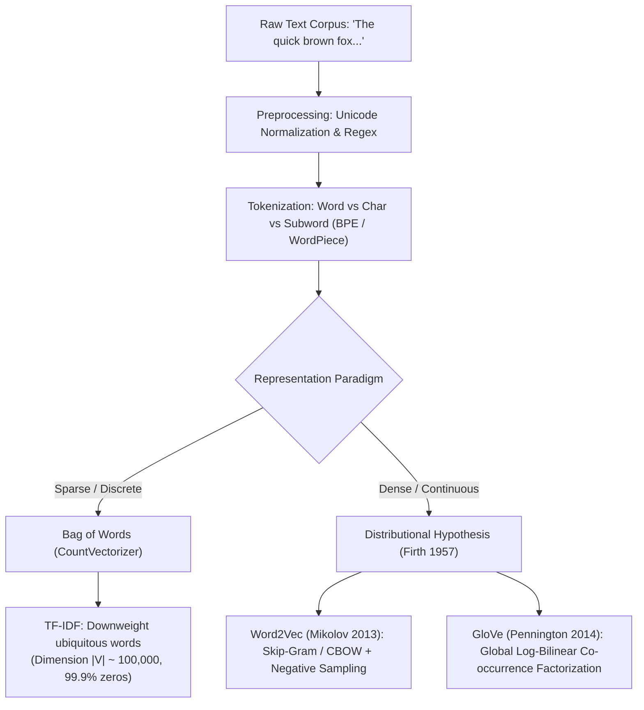
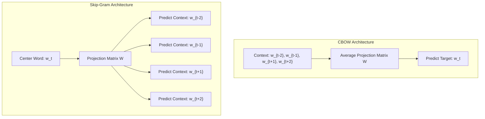
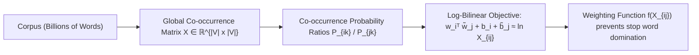

# Text Representation & Word Embeddings — From Tokenization & TF-IDF to Word2Vec & GloVe

!!! info "Prerequisites"
    Linear algebra, conditional probability, and logistic regression. Review [Vectors & Matrices](../02-mathematics/linear-algebra-deep-dive.md), [Probability & Statistics](../02-mathematics/probability-statistics-deep-dive.md), and [Logistic Regression](../04-classical-ml/logistic-regression-deep-dive.md).

---

## 1. The Big Picture

Computers cannot natively perform arithmetic on raw strings of Unicode characters. To train machine learning algorithms on human natural language, text must be translated into real-valued vectors $\mathbf{x} \in \mathbb{R}^D$.

The history of natural language processing is the evolutionary shift between two paradigms:
1. **Discrete Sparse Representations (Count-Based)**:
   - One-hot vectors, Bag of Words (BoW), and TF-IDF.
   - Vector dimensions equal the entire vocabulary size $|V| \sim 10^5 - 10^7$.
   - **Orthogonality Catastrophe**: Every word is mathematically orthogonal to every other word:
     $$\mathbf{w}_{\text{motel}}^T \mathbf{w}_{\text{hotel}} = 0$$
     The representation is completely blind to synonymous meaning, semantics, and context.
2. **Dense Distributed Representations (Embeddings)**:
   - Rooted in the **Distributional Hypothesis** (Firth, 1957): *"You shall know a word by the company it keeps."*
   - Words are projected into a continuous low-dimensional metric space $\mathbb{R}^d$ ($d \sim 100 - 1024$) where geometric distance correlates with semantic similarity:
     $$\cos(\mathbf{w}_{\text{motel}}, \mathbf{w}_{\text{hotel}}) \approx 0.92$$
   - Linear algebraic vector arithmetic captures relational semantics:
     $$\vec{v}_{\text{King}} - \vec{v}_{\text{Man}} + \vec{v}_{\text{Woman}} \approx \vec{v}_{\text{Queen}}$$



---

## 2. Text Preprocessing & The Tokenization Hierarchy

Before vectorization, raw character streams undergo normalization and segmenting into discrete atomic identifiers (tokens).


### 2.1 The Tokenization Taxonomy

| Paradigm | Unit | Vocabulary Size $|V|$ | Sequence Length | Out-Of-Vocabulary (OOV) Handling | Primary Failure Mode |
| :--- | :---: | :---: | :---: | :---: | :---: |
| **Word-Level** | Whitespace/Punctuation words | Massive ($10^5 - 10^7$) | Short | Catastrophic (maps rare/misspelled words to `[UNK]`) | Inability to generalize across morphological variants (`run`, `running`, `runs`). |
| **Character-Level** | Individual characters | Tiny ($256$ ASCII, $\sim 1000$ Unicode) | Extremely Long ($5-10\times$) | Zero OOV | Weak semantic density per token; prohibitive self-attention memory. |
| **Subword Tokenization** | Frequent substrings / byte sequences | Compact ($30,000 - 100,000$) | Balanced | Zero OOV (falls back to characters/bytes) | The modern universal standard (GPT, BERT, LLaMA). |

### 2.2 Byte-Pair Encoding (BPE, Sennrich et al., 2016)

Originally a data compression algorithm (Gage, 1994), BPE was adapted for subword tokenization in NLP:
1. Initialize vocabulary with all unique base characters plus end-of-word token `</w>`.
2. Represent every word in the training corpus as a sequence of individual characters.
3. Iteratively count the frequency of all adjacent character/token pairs across the corpus.
4. Merge the most frequent pair $(t_a, t_b) \to t_{ab}$ and append $t_{ab}$ to vocabulary.
5. Repeat for $k$ merge operations until desired vocabulary size is achieved.

**Example**:
- Words: `{"low": 5, "lower": 2, "newest": 6, "widest": 3}`
- Initial tokens: `l, o, w, e, r, n, s, t, d, i`
- Frequent pair `('e', 's')` $\to$ merge to `es`
- Frequent pair `('es', 't')` $\to$ merge to `est`
- Unseen compound word `lowest` splits gracefully into subwords `['low', 'est']` with zero information loss!

---

## 3. Sparse Representations: Bag of Words & TF-IDF

### 3.1 Bag of Words (BoW) & CountVectorizer

Given a corpus of $D$ documents and a vocabulary $V$ of size $|V|$, document $d$ is represented by vector $\mathbf{x} \in \mathbb{R}^{|V|}$:

$$
x_j = \text{count of token } v_j \text{ in document } d
$$

BoW completely discards syntax, grammar, and token order: `"dog bites man"` and `"man bites dog"` have mathematically identical representations.

### 3.2 Term Frequency-Inverse Document Frequency (TF-IDF)

Count vectors are heavily biased toward stop words (`the`, `is`, `at`, `of`) that appear frequently across *all* documents but carry zero discriminative semantic information.  
TF-IDF reweights term counts by multiplying local term importance by global specificity.

1. **Term Frequency (TF)**:
   $$\text{TF}(t, d) = \frac{f_{t, d}}{\sum_{t' \in d} f_{t', d}}$$
   where $f_{t, d}$ is the raw count of term $t$ in document $d$.
2. **Inverse Document Frequency (IDF)**:
   $$\text{IDF}(t, D) = \log\left( \frac{1 + |D|}{1 + |\{d \in D : t \in d\}|} \right) + 1$$
   (using Scikit-Learn's smooth IDF formulation, adding 1 to numerator and denominator to prevent division by zero).
3. **Composite TF-IDF Score**:
   $$\text{TF-IDF}(t, d, D) = \text{TF}(t, d) \times \text{IDF}(t, D)$$
4. **$L_2$ Normalization**:
   To prevent document length bias:
   $$\mathbf{v}_{\text{norm}} = \frac{\mathbf{v}}{\|\mathbf{v}\|_2}$$

---

## 4. Dense Distributed Representations: The Word2Vec Framework

Tomas Mikolov et al. (2013) proposed two complementary log-linear architectures to train dense embeddings $\mathbf{v}_w \in \mathbb{R}^d$ from unannotated text corpora:
- **Continuous Bag of Words (CBOW)**: Predicts center word $w_t$ given context words $\{w_{t-c}, \dots, w_{t+c}\} \setminus \{w_t\}$.
- **Skip-Gram**: Predicts context words given center word $w_t$.



### 4.1 The Full Softmax Objective & Computational Bottleneck

In the Skip-Gram model, each word $w$ has two vectors:
- Center vector $\mathbf{v}_w \in \mathbb{R}^d$ (from input weight matrix $W \in \mathbb{R}^{|V| \times d}$)
- Context vector $\mathbf{u}_w \in \mathbb{R}^d$ (from output weight matrix $W' \in \mathbb{R}^{d \times |V|}$)

The conditional probability of context word $w_O$ given center word $w_I$ is defined via Softmax:

$$
P(w_O | w_I) = \frac{\exp(\mathbf{u}_{w_O}^T \mathbf{v}_{w_I})}{\sum_{w=1}^{|V|} \exp(\mathbf{u}_w^T \mathbf{v}_{w_I})}
$$

**The Softmax Bottleneck**:  
Computing the denominator requires summing over all $|V|$ words in the vocabulary. For $|V| = 10^6$ and $d = 300$, computing the gradient for every single training token takes $\mathcal{O}(|V| \cdot d) = 3 \times 10^8$ floating-point operations per step—prohibitively expensive for billion-token corpora.

### 4.2 Skip-Gram with Negative Sampling (SGNS)

Mikolov et al. bypassed the denominator by reframing language modeling as a binary logistic regression task: **distinguish true (center, context) pairs from randomly generated noise pairs**.

Let $\mathcal{D}$ be the set of true observed $(w_I, w_O)$ pairs, and $\mathcal{D}'$ be the set of negative samples drawn from a noise distribution $P_n(w)$.  
The objective is to maximize:

$$
\mathcal{L}_{\text{SGNS}} = \sum_{(w_I, w_O) \in \mathcal{D}} \ln \sigma(\mathbf{u}_{w_O}^T \mathbf{v}_{w_I}) + \sum_{(w_I, w_j) \in \mathcal{D}'} \ln \sigma(-\mathbf{u}_{w_j}^T \mathbf{v}_{w_I})
$$

For a single center word $w_I$ with true target context $w_O$ and $k$ sampled negative words $w_1, \dots, w_k \sim P_n(w)$:

$$
\mathcal{L}(w_I, w_O) = \ln \sigma(\mathbf{u}_{w_O}^T \mathbf{v}_{w_I}) + \sum_{i=1}^k \mathbb{E}_{w_i \sim P_n}[\ln \sigma(-\mathbf{u}_{w_i}^T \mathbf{v}_{w_I})]
$$

Using the identity $\sigma(-z) = 1 - \sigma(z)$:

$$
\mathcal{L}(w_I, w_O) = \ln \sigma(\mathbf{u}_{w_O}^T \mathbf{v}_{w_I}) + \sum_{i=1}^k \ln(1 - \sigma(\mathbf{u}_{w_i}^T \mathbf{v}_{w_I}))
$$

**The Noise Distribution $P_n(w)$**:  
Negative words are sampled from the **unigram distribution raised to the $3/4$ power**:

$$
P_n(w) = \frac{f(w)^{3/4}}{\sum_{w'} f(w')^{3/4}}
$$

The exponent $3/4 = 0.75$ boosts the sampling probability of rare words relative to ubiquitous stop words, ensuring rare words are regularized adequately.

### 4.3 Exact Parameter Gradient Derivation for SGNS

Let $z_O = \mathbf{u}_{w_O}^T \mathbf{v}_{w_I}$ and $z_i = \mathbf{u}_{w_i}^T \mathbf{v}_{w_I}$.  
Differentiating $\mathcal{L}$ with respect to context vector $\mathbf{u}_{w_O}$:

$$
\frac{\partial \mathcal{L}}{\partial \mathbf{u}_{w_O}} = \frac{1}{\sigma(z_O)} \sigma'(z_O) \mathbf{v}_{w_I} = \frac{\sigma(z_O)(1 - \sigma(z_O))}{\sigma(z_O)} \mathbf{v}_{w_I} = (1 - \sigma(\mathbf{u}_{w_O}^T \mathbf{v}_{w_I})) \mathbf{v}_{w_I}
$$

For a negative sample context vector $\mathbf{u}_{w_i}$:

$$
\frac{\partial \mathcal{L}}{\partial \mathbf{u}_{w_i}} = \frac{1}{\sigma(-z_i)} \left(-\sigma'(-z_i)\right) \mathbf{v}_{w_I} = -\frac{\sigma(-z_i)(1 - \sigma(-z_i))}{\sigma(-z_i)} \mathbf{v}_{w_I} = -\sigma(\mathbf{u}_{w_i}^T \mathbf{v}_{w_I}) \mathbf{v}_{w_I}
$$

Differentiating with respect to center word vector $\mathbf{v}_{w_I}$:

$$
\frac{\partial \mathcal{L}}{\partial \mathbf{v}_{w_I}} = (1 - \sigma(\mathbf{u}_{w_O}^T \mathbf{v}_{w_I})) \mathbf{u}_{w_O} - \sum_{i=1}^k \sigma(\mathbf{u}_{w_i}^T \mathbf{v}_{w_I}) \mathbf{u}_{w_i}
$$

Computing these updates costs $\mathcal{O}(k \cdot d)$, completely independent of vocabulary size $|V|$.

---

## 5. GloVe: Global Vectors for Word Representation (Pennington et al., 2014)

Jeffrey Pennington, Richard Socher, and Christopher Manning recognized a fundamental dichotomy in NLP:
- **Global Matrix Factorization methods (LSA / SVD)**: Capture global corpus statistical co-occurrences efficiently, but do poorly on local linear analogy tasks.
- **Local Context Window methods (Skip-Gram)**: Excel on linear analogies, but waste compute sweeping across local windows without directly leveraging global co-occurrence statistics.

GloVe unifies both paradigms into a **global log-bilinear matrix factorization**.



### 5.1 The Co-occurrence Probability Ratio Insight

Let $X_{ij}$ be the number of times word $j$ appears in the context of word $i$.  
Let $X_i = \sum_k X_{ik}$ be the total frequency of word $i$.  
The conditional probability is $P_{ij} = P(j | i) = \frac{X_{ij}}{X_i}$.

Consider words $i = \text{ice}$, $j = \text{steam}$, and probe words $k$:
- For $k = \text{solid}$: $P(\text{solid}|\text{ice})$ is large, $P(\text{solid}|\text{steam})$ is small $\implies \frac{P(\text{solid}|\text{ice})}{P(\text{solid}|\text{steam})} \gg 1$.
- For $k = \text{gas}$: $\frac{P(\text{gas}|\text{ice})}{P(\text{gas}|\text{steam})} \ll 1$.
- For $k = \text{water}$: both are large $\implies \frac{P(\text{water}|\text{ice})}{P(\text{water}|\text{steam})} \approx 1$.
- For $k = \text{fashion}$: both are small $\implies \frac{P(\text{fashion}|\text{ice})}{P(\text{fashion}|\text{steam})} \approx 1$.

The **ratio of co-occurrence probabilities** cleanly isolates relevant semantic dimensions and filters out irrelevant baseline noise.

### 5.2 The Mathematical Derivation of GloVe

GloVe seeks an embedding function $F$ that relates word vectors $\mathbf{w}_i, \mathbf{w}_j, \tilde{\mathbf{w}}_k$ to the probability ratio:

$$
F(\mathbf{w}_i, \mathbf{w}_j, \tilde{\mathbf{w}}_k) = \frac{P_{ik}}{P_{jk}}
$$

Because vector spaces are linear, differences encode relationships:

$$
F(\mathbf{w}_i - \mathbf{w}_j, \tilde{\mathbf{w}}_k) = \frac{P_{ik}}{P_{jk}}
$$

Taking the dot product to keep arguments scalar:

$$
F((\mathbf{w}_i - \mathbf{w}_j)^T \tilde{\mathbf{w}}_k) = \frac{F(\mathbf{w}_i^T \tilde{\mathbf{w}}_k)}{F(\mathbf{w}_j^T \tilde{\mathbf{w}}_k)} = \frac{P_{ik}}{P_{jk}}
$$

The unique continuous homomorphism from addition to multiplication is the exponential function ($F = \exp$):

$$
\exp(\mathbf{w}_i^T \tilde{\mathbf{w}}_k) = P_{ik} = \frac{X_{ik}}{X_i} \implies \mathbf{w}_i^T \tilde{\mathbf{w}}_k = \ln X_{ik} - \ln X_i
$$

To enforce symmetry ($\mathbf{w}_i^T \tilde{\mathbf{w}}_k = \tilde{\mathbf{w}}_k^T \mathbf{w}_i$), absorb $\ln X_i$ into an independent scalar bias $b_i$, and add a symmetric context bias $\tilde{b}_k$:

$$
\mathbf{w}_i^T \tilde{\mathbf{w}}_k + b_i + \tilde{b}_k = \ln X_{ik}
$$

### 5.3 The GloVe Least Squares Loss Function

Formulated as a weighted least-squares regression objective:

$$
J = \sum_{i, j=1}^{|V|} f(X_{ij}) \left( \mathbf{w}_i^T \tilde{\mathbf{w}}_j + b_i + \tilde{b}_j - \ln X_{ij} \right)^2
$$

where the weighting function $f(X)$ satisfies:
1. $f(0) = 0$ (so $\lim_{X \to 0} f(X) \ln^2(X) = 0$, handling zero co-occurrences).
2. $f(X)$ is non-decreasing to give more weight to frequent pairs.
3. $f(X)$ is bounded for large $X$ so stop words do not dominate the loss:

$$
f(X) = \begin{cases} \left( \frac{X}{x_{\max}} \right)^\alpha & \text{if } X < x_{\max} \\ 1 & \text{otherwise} \end{cases}
$$

Standard defaults: $x_{\max} = 100, \alpha = 0.75$.

---

## 6. Implementation 1 — Byte-Pair Encoding (BPE) Tokenizer from Scratch

The following complete Python implementation builds a functional Byte-Pair Encoding tokenizer with training, encoding, and decoding methods.

```python
"""
scratch_bpe.py
Byte-Pair Encoding (BPE) Subword Tokenizer from Scratch in pure Python.
"""

import re
from collections import defaultdict, Counter
from typing import Dict, List, Tuple


class ScratchBPETokenizer:
    def __init__(self, vocab_size: int = 50):
        self.vocab_size = vocab_size
        self.merges: Dict[Tuple[str, str], str] = {}
        self.vocab: Dict[str, int] = {}
        self.inverse_vocab: Dict[int, str] = {}

    def _get_stats(self, corpus_words: Dict[Tuple[str, ...], int]) -> Counter:
        pairs = Counter()
        for word_tokens, freq in corpus_words.items():
            for i in range(len(word_tokens) - 1):
                pairs[(word_tokens[i], word_tokens[i+1])] += freq
        return pairs

    def _merge_pair(
        self,
        pair: Tuple[str, str],
        corpus_words: Dict[Tuple[str, ...], int]
    ) -> Dict[Tuple[str, ...], int]:
        bigram = re.escape(" ".join(pair))
        pattern = re.compile(r"(?<!\S)" + bigram + r"(?!\S)")
        replacement = "".join(pair)

        new_corpus = {}
        for word_tokens, freq in corpus_words.items():
            word_str = " ".join(word_tokens)
            new_word_str = pattern.sub(replacement, word_str)
            new_corpus[tuple(new_word_str.split())] = freq
        return new_corpus

    def fit(self, texts: List[str]):
        # 1. Pre-tokenize text into words and append end-of-word tag </w>
        corpus_words = Counter()
        for text in texts:
            words = re.findall(r"\w+|\S", text.lower())
            for w in words:
                tokens = tuple(list(w) + ["</w>"])
                corpus_words[tokens] += 1

        # 2. Base vocabulary
        unique_chars = set()
        for word_tokens in corpus_words.keys():
            unique_chars.update(word_tokens)

        # 3. Iterative BPE merges
        num_merges = self.vocab_size - len(unique_chars)
        for i in range(max(num_merges, 0)):
            pairs = self._get_stats(corpus_words)
            if not pairs:
                break
            best_pair = pairs.most_common(1)[0][0]
            corpus_words = self._merge_pair(best_pair, corpus_words)
            merged_token = "".join(best_pair)
            self.merges[best_pair] = merged_token

        # 4. Final vocabulary construction
        final_vocab_set = set(unique_chars)
        for merged in self.merges.values():
            final_vocab_set.add(merged)
        final_vocab_set.add("[UNK]")

        self.vocab = {tok: idx for idx, tok in enumerate(sorted(final_vocab_set))}
        self.inverse_vocab = {idx: tok for tok, idx in self.vocab.items()}

    def tokenize(self, text: str) -> List[str]:
        words = re.findall(r"\w+|\S", text.lower())
        all_tokens = []
        for w in words:
            word_tokens = list(w) + ["</w>"]
            for pair, merged in self.merges.items():
                i = 0
                while i < len(word_tokens) - 1:
                    if word_tokens[i] == pair[0] and word_tokens[i+1] == pair[1]:
                        word_tokens[i:i+2] = [merged]
                    else:
                        i += 1
            all_tokens.extend(word_tokens)
        return all_tokens

    def encode(self, text: str) -> List[int]:
        tokens = self.tokenize(text)
        unk_idx = self.vocab.get("[UNK]", 0)
        return [self.vocab.get(t, unk_idx) for t in tokens]

    def decode(self, token_ids: List[int]) -> str:
        tokens = [self.inverse_vocab.get(idx, "[UNK]") for idx in token_ids]
        raw_text = "".join(tokens).replace("</w>", " ")
        return raw_text.strip()


if __name__ == "__main__":
    sample_corpus = [
        "The low lowest newer newest widest",
        "low low lower wider widest new",
        "the quick brown fox jumps over the lazy dog"
    ]
    bpe = ScratchBPETokenizer(vocab_size=35)
    bpe.fit(sample_corpus)

    test_sentence = "lowest newer dog"
    tokens = bpe.tokenize(test_sentence)
    token_ids = bpe.encode(test_sentence)
    decoded = bpe.decode(token_ids)

    print("Learned Merges Count:", len(bpe.merges))
    print(f"Original Text: '{test_sentence}'")
    print("Tokenized:    ", tokens)
    print("Token IDs:    ", token_ids)
    print(f"Decoded:      '{decoded}'")
```

---

## 7. Implementation 2 — Word2Vec Skip-Gram with Negative Sampling in NumPy

```python
"""
scratch_word2vec.py
Vectorized Skip-Gram with Negative Sampling (SGNS) Word2Vec from scratch in pure NumPy.
"""

import numpy as np
from collections import Counter
from typing import List, Tuple


class ScratchWord2Vec:
    def __init__(self, embedding_dim: int = 16, window_size: int = 2, k_neg: int = 3, lr: float = 0.05):
        self.embedding_dim = embedding_dim
        self.window_size = window_size
        self.k_neg = k_neg
        self.lr = lr

        self.w2i = {}
        self.i2w = {}
        self.vocab_size = 0
        self.unigram_dist = None

        # Embeddings: W_in (center vectors) and W_out (context vectors)
        self.W_in = None
        self.W_out = None

    @staticmethod
    def _sigmoid(z: np.ndarray) -> np.ndarray:
        return np.where(z >= 0, 1.0 / (1.0 + np.exp(-z)), np.exp(z) / (1.0 + np.exp(z)))

    def _build_vocab(self, tokens: List[str]):
        counts = Counter(tokens)
        self.vocab_size = len(counts)
        self.w2i = {w: i for i, (w, _) in enumerate(counts.most_common())}
        self.i2w = {i: w for w, i in self.w2i.items()}

        # Negative sampling distribution P_n(w) proportional to count^(3/4)
        freqs = np.array([counts[self.i2w[i]] for i in range(self.vocab_size)], dtype=np.float64)
        powered_freqs = freqs ** 0.75
        self.unigram_dist = powered_freqs / np.sum(powered_freqs)

        # Initialize weights
        scale = 1.0 / np.sqrt(self.embedding_dim)
        self.W_in = np.random.randn(self.vocab_size, self.embedding_dim) * scale
        self.W_out = np.random.randn(self.vocab_size, self.embedding_dim) * scale

    def train(self, corpus: str, epochs: int = 100):
        tokens = corpus.lower().split()
        self._build_vocab(tokens)
        token_ids = [self.w2i[t] for t in tokens]

        for epoch in range(epochs):
            total_loss = 0.0
            num_pairs = 0

            for i, center_id in enumerate(token_ids):
                # Context window
                start = max(0, i - self.window_size)
                end = min(len(token_ids), i + self.window_size + 1)
                context_ids = [token_ids[j] for j in range(start, end) if j != i]

                v_center = self.W_in[center_id]  # (d,)

                for target_id in context_ids:
                    # Draw k negative samples
                    neg_ids = np.random.choice(self.vocab_size, size=self.k_neg, p=self.unigram_dist)

                    # 1. Forward Pass
                    # Positive pair
                    u_pos = self.W_out[target_id]
                    z_pos = np.dot(u_pos, v_center)
                    sig_pos = float(self._sigmoid(z_pos))
                    loss_pos = -np.log(np.clip(sig_pos, 1e-12, 1.0))

                    # Negative pairs
                    u_negs = self.W_out[neg_ids]  # (k, d)
                    z_negs = u_negs @ v_center    # (k,)
                    sig_negs = self._sigmoid(z_negs)
                    loss_neg = -np.sum(np.log(np.clip(1.0 - sig_negs, 1e-12, 1.0)))

                    total_loss += (loss_pos + loss_neg)
                    num_pairs += 1

                    # 2. Backward Pass Gradients
                    # Grad w.r.t positive context
                    grad_u_pos = (sig_pos - 1.0) * v_center
                    # Grad w.r.t negative contexts
                    grad_u_negs = sig_negs[:, np.newaxis] * v_center  # (k, d)
                    # Grad w.r.t center word
                    grad_v_center = (sig_pos - 1.0) * u_pos + np.sum(sig_negs[:, np.newaxis] * u_negs, axis=0)

                    # 3. SGD Updates
                    self.W_out[target_id] -= self.lr * grad_u_pos
                    for idx, nid in enumerate(neg_ids):
                        self.W_out[nid] -= self.lr * grad_u_negs[idx]
                    self.W_in[center_id] -= self.lr * grad_v_center

            if epoch % 20 == 0:
                print(f"Epoch {epoch:03d} | Average Loss: {total_loss / max(num_pairs, 1):.4f}")

    def get_embedding(self, word: str) -> np.ndarray:
        idx = self.w2i[word.lower()]
        # Averaging center and context vectors improves semantic quality
        return (self.W_in[idx] + self.W_out[idx]) / 2.0

    def cosine_similarity(self, w1: str, w2: str) -> float:
        v1 = self.get_embedding(w1)
        v2 = self.get_embedding(w2)
        return float(np.dot(v1, v2) / (np.linalg.norm(v1) * np.linalg.norm(v2) + 1e-12))


if __name__ == "__main__":
    corpus_text = (
        "the king rules the kingdom the queen rules the kingdom "
        "the king and the queen the man and the woman "
        "the prince and the princess the royal throne"
    )
    w2v = ScratchWord2Vec(embedding_dim=8, window_size=2, k_neg=3, lr=0.08)
    w2v.train(corpus_text, epochs=61)

    sim_king_queen = w2v.cosine_similarity("king", "queen")
    sim_king_woman = w2v.cosine_similarity("king", "woman")
    print(f"\nCosine Similarity ('king', 'queen'): {sim_king_queen:.4f}")
    print(f"Cosine Similarity ('king', 'woman'): {sim_king_woman:.4f}")
```

---

## 8. Common Errors, Gotchas & Debugging

### 1. Data Leakage in TF-IDF Vectorizer

**Symptom**: Unrealistic validation accuracy during offline testing that collapses in production.  
**Root Cause**: Calling `fit_transform(corpus)` on the entire dataset *before* splitting into train and test sets. The IDF calculations incorporate document frequency information from the test split.  
**Fix**: Always call `fit_transform(X_train)` on train data only, and call `transform(X_test)` on test data.

```python
# BROKEN
X_all = tfidf.fit_transform(corpus)
X_train, X_test = train_test_split(X_all)

# FIXED
X_train_raw, X_test_raw = train_test_split(corpus)
X_train = tfidf.fit_transform(X_train_raw)
X_test = tfidf.transform(X_test_raw)
```

### 2. High OOV Rates from Aggressive Character Stripping

**Symptom**: Model produces `[UNK]` for critical punctuation in programming code or URLs.  
**Root Cause**: Naively stripping all non-alphanumeric characters with regex (`re.sub(r'[^a-zA-Z]', ' ', text)`) destroys syntax in specialized domains.  
**Fix**: Use modern Byte-level BPE (e.g., Hugging Face Tokenizers) that encodes arbitrary UTF-8 bytes without stripping.

---

## 9. Staff-Level Technical Interview Questions

### Q1: Prove why Skip-Gram with Negative Sampling (SGNS) is equivalent to implicit matrix factorization of the Shifted Positive Pointwise Mutual Information (SPPMI) matrix.

**Model Answer:**  
Omer Levy and Yoav Goldberg (NeurIPS 2014) proved that Word2Vec's SGNS objective implicitly factorizes a word-context co-occurrence matrix.  
Recall the Pointwise Mutual Information (PMI) between word $w$ and context $c$:

$$\text{PMI}(w, c) = \ln \frac{P(w, c)}{P(w)P(c)} = \ln \frac{X_{w, c} \cdot |D|}{X_w X_c}$$

Consider the local expectation objective for pair $(w, c)$ with $k$ negative samples drawn from $P_n$:

$$\mathcal{L}(w, c) = X_{w, c} \ln \sigma(\mathbf{u}_c^T \mathbf{v}_w) + k \cdot \frac{X_w X_c}{|D|} \ln \sigma(-\mathbf{u}_c^T \mathbf{v}_w)$$

Letting $z = \mathbf{u}_c^T \mathbf{v}_w$ and taking the derivative with respect to $z$, then setting to zero to find the optimum:

$$\frac{\partial \mathcal{L}}{\partial z} = X_{w, c}(1 - \sigma(z)) - k \frac{X_w X_c}{|D|} \sigma(z) = 0$$

$$X_{w, c} (1 - \sigma(z)) = k \frac{X_w X_c}{|D|} \sigma(z) \implies \frac{\sigma(z)}{1 - \sigma(z)} = \frac{X_{w, c}}{k \cdot \frac{X_w X_c}{|D|}}$$

Since $\frac{\sigma(z)}{1 - \sigma(z)} = e^z$:

$$e^z = \frac{P(w, c)}{k P(w) P(c)} \implies z = \mathbf{u}_c^T \mathbf{v}_w = \ln \frac{P(w, c)}{P(w) P(c)} - \ln k = \text{PMI}(w, c) - \ln k$$

Thus, the inner product $\mathbf{u}_c^T \mathbf{v}_w$ of the learned embeddings equals the **Pointwise Mutual Information shifted by $-\ln k$** (SPPMI). Word2Vec is fundamentally a low-rank matrix factorization of the SPPMI matrix via stochastic gradient descent.

---

### Q2: Why is the negative sampling exponent set to $3/4$ ($0.75$) in Word2Vec?

**Model Answer:**  
If negative words were sampled according to their raw unigram frequency $P(w) \propto f(w)$, ubiquitous words like `the`, `is`, `a` would account for almost all negative samples. Consequently, rare words would almost never be updated as negative examples, leaving their vectors unconstrained.  
If negative words were sampled uniformly ($P(w) \propto 1$), rare words would be sampled far too frequently relative to their true probability of being noise, degrading context representations.  
Raising unigram frequencies to $3/4$:

$$P_n(w) \propto f(w)^{0.75}$$

acts as a non-linear probability redistributor:
- For a frequent word with $f = 1,000,000$: $1,000,000^{0.75} = 31,622$ (compressed by $31\times$).
- For a rare word with $f = 16$: $16^{0.75} = 8$ (compressed by only $2\times$).
- The relative sampling probability of rare words is significantly elevated while preserving overall unigram rank ordering, striking the empirical sweet spot for noise contrastive estimation.

---

### Q3: Contrast Word2Vec and GloVe in terms of optimization mechanics and computational scaling.

**Model Answer:**  
- **Word2Vec (Online Streaming SGD)**:
  - Iterates over text as a temporal stream via a sliding window.
  - Scales linearly with total token count $T$ of the corpus ($\mathcal{O}(T)$).
  - Wasteful for massive corpora because it must repeatedly sweep over millions of redundant occurrences of identical word-context pairs.
- **GloVe (Global Matrix Optimization)**:
  - Separates training into two distinct phases:
    1. Single pass over the corpus to build the sparse co-occurrence matrix $X \in \mathbb{R}^{|V| \times |V|}$.
    2. Optimization over the non-zero entries of $X$ ($|X| \ll |V|^2$).
  - Scaling: Once the co-occurrence matrix is constructed, training time depends only on $|X|$ (the number of distinct non-zero co-occurrences), **not on corpus token length $T$**.
  - Objective: GloVe optimizes a global log-bilinear least-squares loss with an explicit weighting function $f(X_{ij})$, providing tighter control over stop-word distortion.

---

### Q4: Explain the Byte-Pair Encoding (BPE) algorithm and how it guarantees zero Out-of-Vocabulary (OOV) tokens at inference time.

**Model Answer:**  
BPE constructs a subword vocabulary through bottom-up iterative merges:
1. Base tokens are initialized as all raw UTF-8 byte characters ($256$ tokens) or ASCII characters.
2. The most frequent co-occurring adjacent token pairs are merged and added to the vocabulary.
3. At test time, any unseen word is first broken down into its constituent base characters.
4. The learned merge table is applied deterministically to combine adjacent characters into the largest recognized subwords.
5. If a word is completely novel, it safely falls back to individual base characters. Because every possible Unicode string can be represented as a sequence of UTF-8 bytes, the model **never produces an Out-of-Vocabulary token**.

---

### Q5: Why can linear word vectors capture semantic analogies like $\vec{v}_{\text{King}} - \vec{v}_{\text{Man}} + \vec{v}_{\text{Woman}} \approx \vec{v}_{\text{Queen}}$?

**Model Answer:**  
In both Word2Vec and GloVe, the objective forces the inner product $\mathbf{w}_i^T \mathbf{w}_k$ to correlate with log-co-occurrence probabilities $\ln P(k | i)$.  
Consider the vector difference $\mathbf{w}_{\text{King}} - \mathbf{w}_{\text{Man}}$:

$$(\mathbf{w}_{\text{King}} - \mathbf{w}_{\text{Man}})^T \tilde{\mathbf{w}}_k = \ln \frac{P(k | \text{King})}{P(k | \text{Man})}$$

For probe words $k$ that have gender-neutral associations (e.g. `throne`, `crown`, `castle`), $P(k | \text{King}) \gg P(k | \text{Man})$, but $P(k | \text{King}) \approx P(k | \text{Queen})$.  
Similarly, for gender-specific words:

$$\ln \frac{P(\text{female} | \text{King})}{P(\text{female} | \text{Man})} \approx \ln \frac{P(\text{female} | \text{Queen})}{P(\text{female} | \text{Woman})}$$

Because log-probability ratios isolate semantic differences into orthogonal directional vectors, the vector difference $(\mathbf{w}_{\text{King}} - \mathbf{w}_{\text{Man}})$ directly encodes the abstract concept of **"Royalty minus Male"**. Adding $\mathbf{w}_{\text{Woman}}$ adds the "Female" direction, aligning geometrically with $\mathbf{w}_{\text{Queen}}$.

---

## 10. Mastery Ladder

- [ ] **L1:** Contrast discrete sparse representations (One-Hot, BoW) with dense continuous embeddings.
- [ ] **L2:** Formulate Term Frequency-Inverse Document Frequency (TF-IDF) and explain why smooth IDF prevents zero division.
- [ ] **L3:** Explain the tokenization hierarchy (Word, Character, Subword) and state the advantages of Subword BPE.
- [ ] **L4:** Describe the Continuous Bag of Words (CBOW) and Skip-Gram Word2Vec architectures.
- [ ] **L5:** Explain the full Softmax computational bottleneck and how Negative Sampling converts it into binary logistic regressions.
- [ ] **L6:** Derive the exact parameter gradients for Skip-Gram with Negative Sampling.
- [ ] **L7:** Explain why negative samples are drawn from the unigram distribution raised to the $0.75$ power.
- [ ] **L8:** Derive GloVe's log-bilinear least squares objective from co-occurrence probability ratios.
- [ ] **L9:** Explain Levy & Goldberg's proof that SGNS implicitly factorizes the Shifted Pointwise Mutual Information (SPPMI) matrix.
- [ ] **L10:** Implement a complete BPE tokenizer from scratch in Python and a Skip-Gram Negative Sampling Word2Vec model in pure NumPy.
