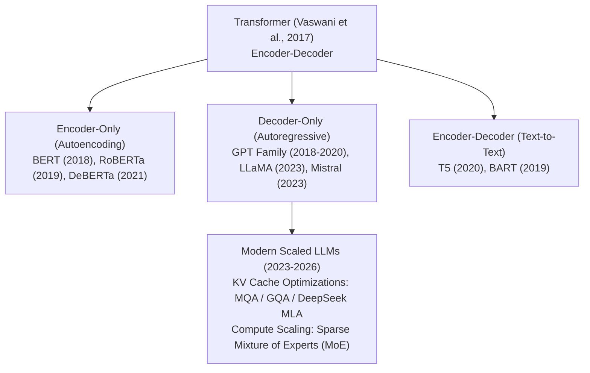
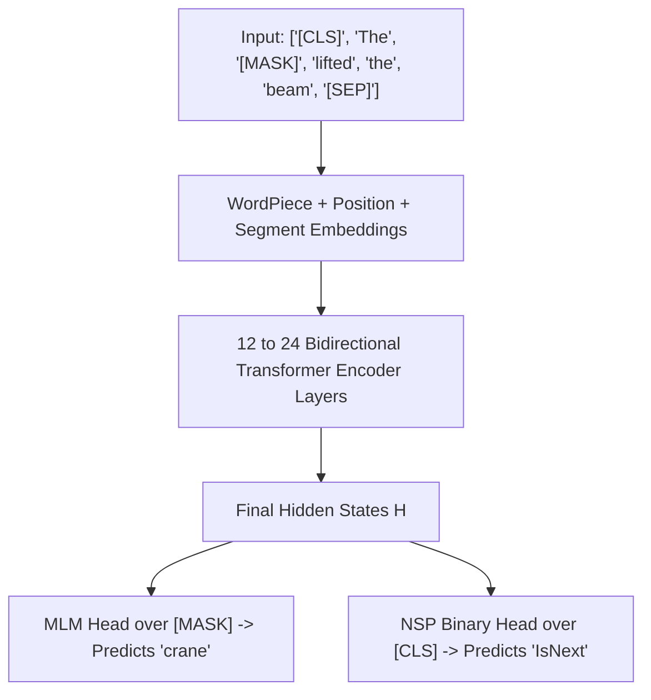
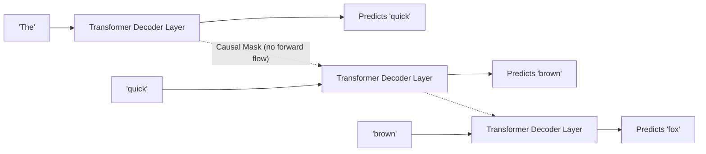
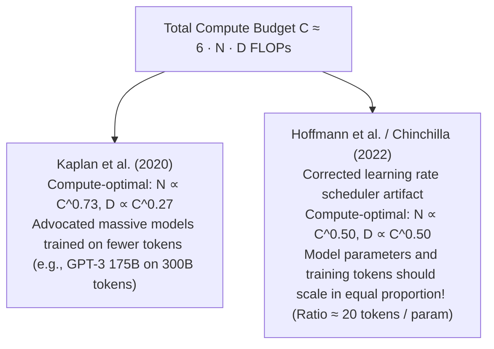
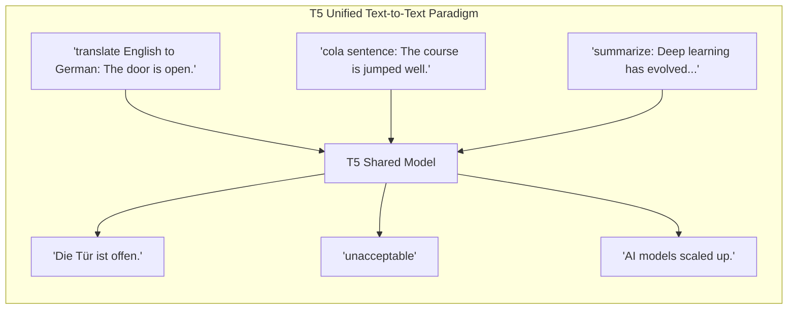
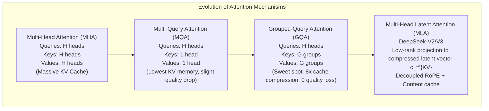
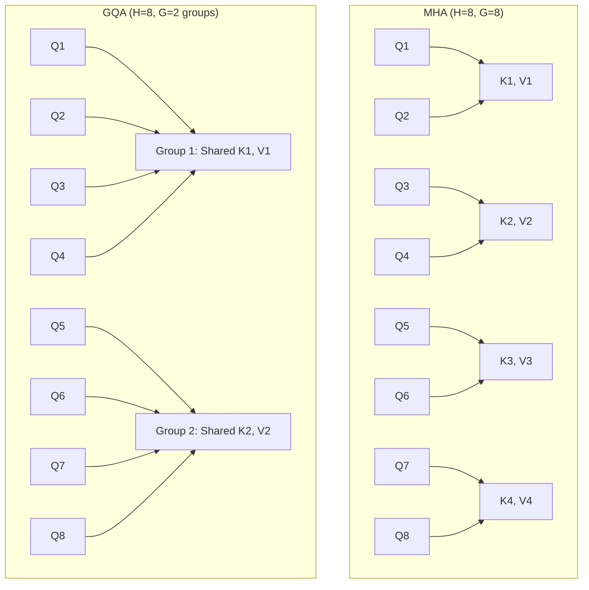
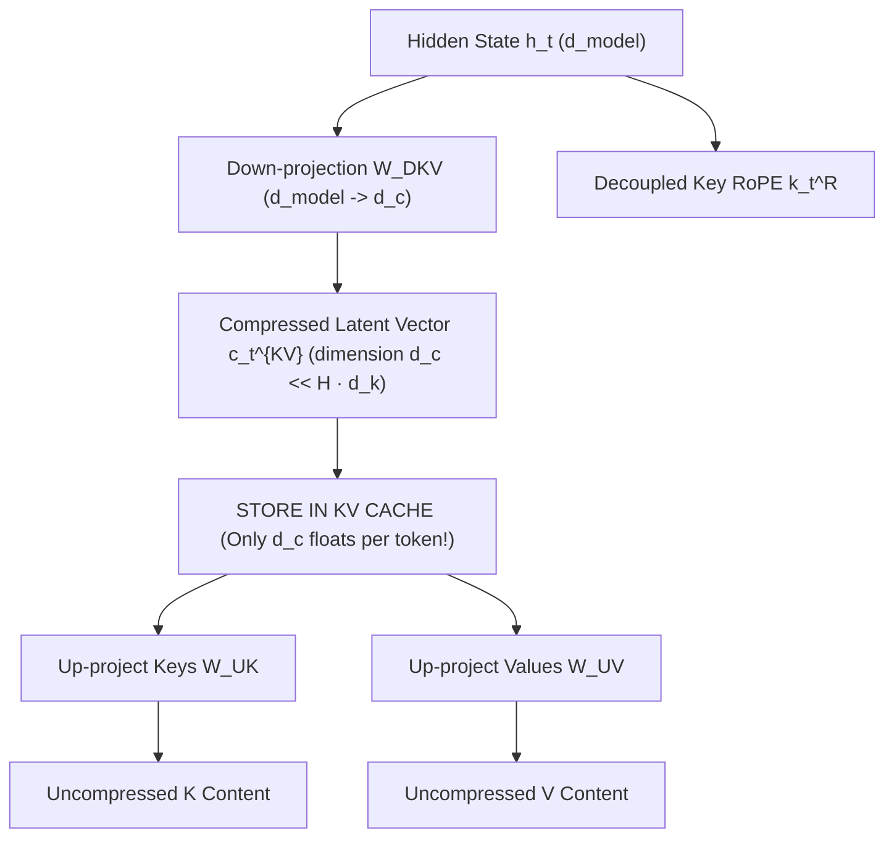
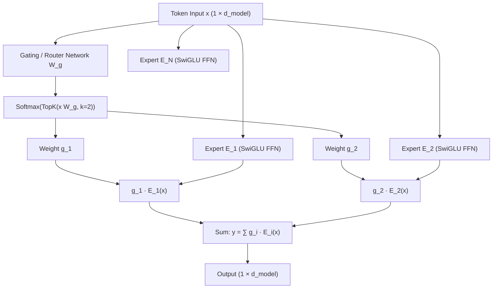

# Foundation Model Families — From BERT & GPT to T5, GQA, MoE & DeepSeek MLA

!!! info "Prerequisites"
    Self-attention mechanics, causal masking, layer normalization, and autoregressive generation. Review [Transformer Architecture & Mechanics](transformer-architecture-mechanics-deep-dive.md), [Sequence Models, Attention & Transformers](../08-nlp/sequence-models-attention-transformers-deep-dive.md), and [Deep Learning Optimizers](../06-deep-learning/deep-learning-optimizers-deep-dive.md).

---

## 1. The Big Picture & Model Taxonomy

The Transformer architecture sparked three divergent evolutionary branches based on attention connectivity and pretraining objectives:

1. **Autoencoding Encoders (BERT, RoBERTa, DeBERTa)**: Bidirectional attention allows every token to attend to all past and future tokens. Optimized for sequence understanding, text classification, semantic search embeddings, and token-level labeling.
2. **Autoregressive Decoders (GPT-1/2/3/4, LLaMA, Mistral, Claude)**: Causal attention masks future tokens. Optimized for generative sequence modeling, in-context few-shot learning, and conversational reasoning.
3. **Sequence-to-Sequence / Encoder-Decoders (T5, BART)**: Bidirectional encoder compresses source text; causal decoder generates target text via cross-attention. Optimized for translation, summarization, and unified text-to-text transformation.



Over the period from 2020 to 2026, the machine learning industry converged overwhelmingly on **Decoder-only** architectures for frontier foundation models. Decoder architectures exhibit superior zero-shot and few-shot in-context learning capabilities, unified pretraining-inference dynamics, and lower memory overhead during multi-turn generation.

---

## 2. BERT & Bidirectional Encoder Models

### 2.1 The Philosophy of Masked Pretraining

Traditional n-gram and autoregressive language models factorize sequence probability in a single directional sweep:

$$
P(x_1, \dots, x_T) = \prod_{t=1}^T P(x_t \mid x_1, \dots, x_{t-1})
$$

While necessary for generation, directional conditioning severely handicaps sequence comprehension. In natural language, the identity of an ambiguous word depends equally on subsequent context:
- *"The **crane** lifted the five-ton steel beam."* (Construction vehicle)
- *"The **crane** folded its long wings by the lake."* (Bird)

[Devlin et al. (2018)](https://arxiv.org/abs/1810.04805) introduced **BERT (Bidirectional Encoder Representations from Transformers)** to capture non-directional context by masking random tokens and training the model to reconstruct them from deep bidirectional representations.



---

### 2.2 Pretraining Objectives: MLM and NSP

#### Masked Language Modeling (MLM) and the 80/10/10 Rule
BERT randomly selects $15\%$ of all input WordPiece tokens as prediction targets. However, if target tokens were always replaced with a special `[MASK]` token, the model would encounter a severe mismatch during downstream fine-tuning, where `[MASK]` tokens never appear.

To mitigate this discrepancy, the **80/10/10 corruption rule** governs the chosen $15\%$ targets:
1. **$80\%$ of the time**: Replace the token with `[MASK]`  
   *(e.g., "my dog is hairy" $\to$ "my dog is [MASK]")*
2. **$10\%$ of the time**: Replace the token with a random token from the vocabulary  
   *(e.g., "my dog is hairy" $\to$ "my dog is apple")*  
   *Forces the model to maintain contextual representations for every token, since any observed word could be a corrupted intruder.*
3. **$10\%$ of the time**: Keep the original token unchanged  
   *(e.g., "my dog is hairy" $\to$ "my dog is hairy")*  
   *Biases the representation towards the true observed token identity.*

Let $\mathcal{M}$ be the set of masked token positions. The MLM objective minimizes cross-entropy strictly over $\mathcal{M}$:

$$
\mathcal{L}_{\text{MLM}}(\theta) = -\sum_{i \in \mathcal{M}} \log P(x_i \mid \tilde{\mathbf{x}}; \theta) = -\sum_{i \in \mathcal{M}} \log \left( \frac{\exp(\mathbf{h}_i^T \mathbf{w}_{x_i})}{\sum_{v \in \mathcal{V}} \exp(\mathbf{h}_i^T \mathbf{w}_v)} \right)
$$

where $\mathbf{h}_i \in \mathbb{R}^{d_{\text{model}}}$ is the output hidden state for position $i$, and $\mathbf{w}_v$ is the embedding vector for vocabulary word $v$.

#### Next Sentence Prediction (NSP)
To learn discourse relationships between pairs of sentences $(A, B)$:
- $50\%$ of training pairs are consecutive sentences from the corpus (`IsNext`).
- $50\%$ of training pairs pair sentence $A$ with a randomly sampled sentence $B$ (`NotNext`).

The representation of the special first token `[CLS]` is passed through a binary classification layer:

$$
\mathcal{L}_{\text{NSP}}(\theta) = - y \log \sigma(\mathbf{h}_{\text{[CLS]}}^T \mathbf{w}_{\text{NSP}}) - (1 - y) \log (1 - \sigma(\mathbf{h}_{\text{[CLS]}}^T \mathbf{w}_{\text{NSP}}))
$$

Total BERT pretraining loss:

$$
\mathcal{L}_{\text{BERT}} = \mathcal{L}_{\text{MLM}} + \mathcal{L}_{\text{NSP}}
$$

*Note: Subsequent research ([RoBERTa, Liu et al., 2019](https://arxiv.org/abs/1907.11692)) demonstrated that NSP harms downstream performance and that training on longer continuous documents with pure dynamic MLM substantially outperforms original BERT.*

---

## 3. The GPT Family & Autoregressive Decoder Models

### 3.1 Next-Token Prediction & In-Context Learning

Generative Pretrained Transformers (GPT-1, Radford et al. 2018; GPT-2, 2019; GPT-3, Brown et al. 2020) demonstrated that autoregressive language modeling on massive corpora acts as an unsupervised meta-learner.

The objective is exact causal negative log-likelihood:

$$
\mathcal{L}_{\text{AR}}(\theta) = -\sum_{t=1}^T \log P(x_t \mid x_1, \dots, x_{t-1}; \theta)
$$



GPT-3 revealed that once model scale crosses a critical threshold ($\approx 10\text{B}-100\text{B}$ parameters), models acquire **In-Context Learning (ICL)** without weight updates:
- **Zero-Shot**: Prompt contains task instructions only.
- **One-Shot**: Instructions followed by a single demonstration example.
- **Few-Shot**: Instructions followed by $k \in [3, 32]$ demonstration pairs $\langle x_i, y_i \rangle$.

Under ICL, the transformer's attention activations dynamically synthesize an internal task algorithm in its forward pass activations, behaving analogously to implicit gradient descent on the prompt's demonstrations ([von Oswald et al., 2023](https://arxiv.org/abs/2212.07677)).

---

### 3.2 Scaling Laws: Kaplan vs. Chinchilla

How should compute budget be allocated between **model parameter count ($N$)** and **training dataset tokens ($D$)**?



#### FLOPs Accounting for Transformer Training
For a standard decoder-only transformer with $N$ non-embedding parameters trained on $D$ tokens, each forward pass requires approximately $2N$ floating-point operations (FLOPs) per token (one multiply-accumulate per weight). The backward pass requires approximately $4N$ FLOPs per token (computing activation gradients and weight gradients).

The total training compute budget $C$ in floating-point operations is:

$$
C \approx 2ND + 4ND = 6ND \text{ FLOPs}
$$

#### Kaplan et al. (2020) Power Law
OpenAI's initial empirical investigation fitted power-law relationships:

$$
L(N) = \left( \frac{N_c}{N} \right)^{\alpha_N}, \quad L(D) = \left( \frac{D_c}{D} \right)^{\alpha_D}, \quad L(C) = \left( \frac{C_c}{C} \right)^{\alpha_C}
$$

Kaplan concluded that performance depends most strongly on parameter count $N$, scaling compute-optimally as:

$$
N \propto C^{0.73}, \quad D \propto C^{0.27}
$$

This led to models like GPT-3 (175 billion parameters trained on only 300 billion tokens — a ratio of only $1.7$ tokens per parameter), which were severely undertrained relative to their capacity.

#### Hoffmann et al. (2022) / Chinchilla Scaling Law
DeepMind identified that Kaplan et al. had kept the cosine learning rate schedule fixed to a constant step count across varying token budgets rather than tuning the schedule length to each specific run, artificially penalizing runs with larger token counts.

By training over 400 models ranging from 70M to 16B parameters across variations of token lengths, Hoffmann et al. derived the true compute-optimal relationship:

$$
L(N, D) = E + \frac{A}{N^\alpha} + \frac{B}{D^\beta}
$$

Under the budget constraint $C = 6ND$, minimizing loss yields the optimality condition:

$$
\alpha \approx 0.34, \quad \beta \approx 0.28
$$

$$
N_{\text{opt}} \propto G \cdot C^a, \quad D_{\text{opt}} \propto G^{-1} \cdot C^b, \quad \text{where } a \approx 0.50, \quad b \approx 0.50
$$

**The Chinchilla Takeaway:**
Parameters and tokens should scale in **equal proportion**:

$$
\frac{D}{N} \approx 20
$$

A compute-optimal model with $70\text{B}$ parameters requires at least $1.4\text{ trillion tokens}$. Modern foundation models (LLaMA-3, Mistral) push this ratio even further ($>100$ tokens per parameter) to optimize downstream **inference latency and cost**, since an overtrained smaller model is vastly cheaper to serve in production.

---

## 4. T5 & The Unified Sequence-to-Sequence Paradigm

[Raffel et al. (2020)](https://arxiv.org/abs/1910.10683) introduced **T5 (Text-to-Text Transfer Transformer)**, reframing every natural language processing task into an explicit string-to-string format:



### 4.1 Span Corruption Objective
Rather than single-token masking (BERT), T5 replaces contiguous spans of text with unique sentinel tokens (`<extra_id_0>`, `<extra_id_1>`, ...):

- **Original Input**: *"Thank you for inviting me to your lovely home yesterday."*
- **Corrupted Input**: *"Thank you `<extra_id_0>` me to your `<extra_id_1>` yesterday."*
- **Target Output**: *"`<extra_id_0>` for inviting `<extra_id_1>` lovely home `<extra_id_2>`"*

This reduces target sequence length in the causal decoder, saving significant training compute.

### 4.2 Relative Position Buckets
T5 introduced logarithmic relative position bias buckets. The attention logit is augmented by a scalar bias $b_{i-j}$:

$$
\text{Logit}_{ij} = \frac{\mathbf{q}_i \mathbf{k}_j^T}{\sqrt{d_k}} + b_{i-j}
$$

Offsets from 0 to 8 receive exact individual buckets, while larger offsets up to 128 are mapped logarithmically to 32 discrete buckets, allowing the model to generalize smoothly to longer sequences.

---

## 5. Modern Open LLM Architectural Innovations

Between 2023 and 2026, foundation models evolved beyond vanilla Multi-Head Attention to overcome two primary physical barriers on GPUs:
1. **The KV Cache Memory Wall** during generation.
2. **Dense Feed-Forward Compute Costs** when scaling parameters beyond 100B.



---

### 5.1 Multi-Query Attention (MQA) & Grouped-Query Attention (GQA)

Recall that in standard Multi-Head Attention (MHA) with $H$ heads, the KV cache size per token across $L$ layers is:

$$
\text{Size}_{\text{MHA}} = 2 \times 2 \times L \times H \times d_k \text{ bytes}
$$

For an 8-head or 32-head model, this consumes gigabytes of GPU HBM per active user stream. During generation, memory bandwidth—not matrix multiplication compute—becomes the primary bottleneck (the kernel is memory-bound with arithmetic intensity $< 1$).

- **Multi-Query Attention (MQA, Shazeer 2019)**: Collapses all key and value heads to a single shared head ($H_K = H_V = 1$) while retaining $H_Q$ independent query heads. This slashes KV cache memory by a factor of $H$, but can degrade accuracy on complex retrieval tasks.
- **Grouped-Query Attention (GQA, Ainslie et al. 2023)**: Partitions the $H_Q$ query heads into $G$ groups. Each group shares 1 key head and 1 value head:

$$
H_K = H_V = G, \quad \text{where } 1 < G < H_Q
$$

Typically $H_Q = 32$ and $G = 8$ (a $4\times$ reduction in KV cache size) or $G = 4$ ($8\times$ reduction). Modern models like LLaMA-2/3 (70B), Mistral-7B, and Mixtral universally adopt GQA.



---

### 5.2 Multi-Head Latent Attention (MLA) — DeepSeek-V2 & DeepSeek-V3

While GQA compresses the number of heads, it still stores raw head dimensions ($G \times d_k$). DeepSeek introduced **Multi-Head Latent Attention (MLA)**, which compresses keys and values into a single low-dimensional latent vector via low-rank projection.



#### Mathematical Formulation
Instead of caching $H \cdot d_k$ keys and $H \cdot d_v$ values per token:
1. Down-project the hidden state $\mathbf{h}_t \in \mathbb{R}^{d_{\text{model}}}$ to a compressed latent space:
   $$\mathbf{c}_t^{KV} = \mathbf{h}_t \mathbf{W}_{DKV} \in \mathbb{R}^{d_c}, \quad \text{where } d_c \ll H d_k$$
2. Because Rotary Position Embedding (RoPE) is position-sensitive, it cannot be baked directly into a cached compressed representation that undergoes downstream linear transformations. MLA solves this by **decoupling RoPE**:
   - Cache $\mathbf{c}_t^{KV}$ (representing position-invariant content).
   - Cache a separate small positional vector $\mathbf{k}_t^R \in \mathbb{R}^{d_R}$ carrying RoPE.
3. During generation, the query is split into content query $\mathbf{q}_{i, c}$ and rotary query $\mathbf{q}_{i, r}$:
   $$\mathbf{S}_{i, j} = \frac{1}{\sqrt{d_k + d_R}} \left( \mathbf{q}_{i, c}^T \mathbf{W}_{UK} \mathbf{c}_j^{KV} + (\mathbf{q}_{i, r}^R)^T \mathbf{k}_{j}^R \right)$$

By absorbing $\mathbf{W}_{UK}$ into $\mathbf{q}_{i, c}$ via associativity: $\tilde{\mathbf{q}}_{i, c} = \mathbf{q}_{i, c}^T \mathbf{W}_{UK}$, key up-projection is performed once per query rather than materialized across all cached keys!

This reduces the KV cache footprint per token by up to **$93\%$** compared to standard MHA, allowing DeepSeek models to serve 128k context windows on standard GPU clusters.

---

### 5.3 Sparse Mixture of Experts (MoE)

Dense LLMs activate $100\%$ of their parameters for every single token. However, a token representing a mathematical equation does not require the linguistic parameters specialized for French grammar or legal drafting.

**Sparse Mixture of Experts (MoE)** replaces the dense Feed-Forward Network with $E$ separate expert networks, activating only the top-$K$ experts per token ($K \ll E$).



#### Routing Gate Formulation
Let $E$ be the total number of experts. The gating network computes affinity logits:

$$
\mathbf{h}(\mathbf{x}) = \mathbf{x} \mathbf{W}_g, \quad \mathbf{W}_g \in \mathbb{R}^{d_{\text{model}} \times E}
$$

Select the top-$K$ experts (typically $K=2$ in Mixtral 8x7B, or $K=8$ out of $256$ in DeepSeek-V3):

$$
\mathcal{T} = \text{TopK}(\mathbf{h}(\mathbf{x}), K)
$$

The gating weights are computed by applying softmax strictly over the selected top-$K$ indices:

$$
g_i(\mathbf{x}) = \begin{cases} \frac{\exp(h_i(\mathbf{x}))}{\sum_{j \in \mathcal{T}} \exp(h_j(\mathbf{x}))} & \text{if } i \in \mathcal{T} \\ 0 & \text{otherwise} \end{cases}
$$

The output is the weighted sum of expert computations:

$$
\mathbf{y} = \sum_{i \in \mathcal{T}} g_i(\mathbf{x}) \text{Expert}_i(\mathbf{x})
$$

#### The Load Balancing Auxiliary Loss
Without intervention, the gating network rapidly falls into a **winner-take-all collapse**: early stochastic updates make 1 or 2 experts slightly better at general tokens. The router sends all tokens to these few experts, while the remaining $E-K$ experts receive no gradients, stalling their learning.

To enforce uniform expert utilization, [Shazeer et al. (2017)](https://arxiv.org/abs/1701.06538) and [Fedus et al. (2022)](https://arxiv.org/abs/2101.03961) introduced an auxiliary load-balancing loss $\mathcal{L}_{\text{aux}}$ across a batch of $T$ tokens:

Let $f_i$ be the fraction of tokens routed to expert $i$:

$$
f_i = \frac{1}{T} \sum_{t=1}^T \mathbb{I}(i \in \mathcal{T}_t)
$$

Let $P_i$ be the average gating probability allocated to expert $i$ before top-$K$ truncation:

$$
P_i = \frac{1}{T} \sum_{t=1}^T \frac{\exp(h_i(\mathbf{x}_t))}{\sum_{j=1}^E \exp(h_j(\mathbf{x}_t))}
$$

The auxiliary loss is:

$$
\mathcal{L}_{\text{aux}} = \alpha \cdot E \sum_{i=1}^E f_i P_i
$$

where $\alpha$ is a hyperparameter (typically $0.01$ to $0.05$).

**Why $f_i P_i$?**  
Because the indicator $\mathbb{I}(i \in \mathcal{T}_t)$ is non-differentiable, multiplying by the smooth probability $P_i$ allows gradients from $\mathcal{L}_{\text{aux}}$ to propagate directly into the router weights $\mathbf{W}_g$, pushing probabilities down for overloaded experts and up for underutilized experts.

---

## 6. PyTorch Implementations from Scratch

### 6.1 Grouped-Query Attention (GQA) with KV Caching

```python
import math
from typing import Optional, Tuple
import torch
import torch.nn as nn
import torch.nn.functional as F


class GroupedQueryAttention(nn.Module):
    """Grouped-Query Attention (GQA, Ainslie et al. 2023).

    Partitions num_q_heads into num_kv_groups.
    Each group shares 1 key head and 1 value head.
    """

    def __init__(self, dim: int, num_q_heads: int, num_kv_groups: int):
        super().__init__()
        self.dim = dim
        self.num_q_heads = num_q_heads
        self.num_kv_groups = num_kv_groups
        self.head_dim = dim // num_q_heads
        self.num_q_per_kv = num_q_heads // num_kv_groups

        assert num_q_heads % num_kv_groups == 0, "q_heads must divide by kv_groups"
        assert dim % num_q_heads == 0, "dim must divide by q_heads"

        self.q_proj = nn.Linear(dim, num_q_heads * self.head_dim, bias=False)
        self.k_proj = nn.Linear(dim, num_kv_groups * self.head_dim, bias=False)
        self.v_proj = nn.Linear(dim, num_kv_groups * self.head_dim, bias=False)
        self.out_proj = nn.Linear(dim, dim, bias=False)

    def forward(
        self,
        x: torch.Tensor,
        kv_cache: Optional[Tuple[torch.Tensor, torch.Tensor]] = None,
        use_cache: bool = False,
    ) -> Tuple[torch.Tensor, Optional[Tuple[torch.Tensor, torch.Tensor]]]:
        B, T, _ = x.shape

        # Projections
        q = self.q_proj(x).view(B, T, self.num_q_heads, self.head_dim).transpose(1, 2)
        k = self.k_proj(x).view(B, T, self.num_kv_groups, self.head_dim).transpose(1, 2)
        v = self.v_proj(x).view(B, T, self.num_kv_groups, self.head_dim).transpose(1, 2)

        # Update KV cache
        if kv_cache is not None:
            k = torch.cat([kv_cache[0], k], dim=2)
            v = torch.cat([kv_cache[1], v], dim=2)

        new_cache = (k, v) if use_cache else None
        total_k_len = k.shape[2]

        # Expand K and V heads to match Q heads via repeating across groups
        # (B, num_kv_groups, 1, total_k_len, head_dim) -> (B, num_kv_groups, num_q_per_kv, total_k_len, head_dim)
        k_expanded = k.unsqueeze(2).repeat(1, 1, self.num_q_per_kv, 1, 1).view(
            B, self.num_q_heads, total_k_len, self.head_dim
        )
        v_expanded = v.unsqueeze(2).repeat(1, 1, self.num_q_per_kv, 1, 1).view(
            B, self.num_q_heads, total_k_len, self.head_dim
        )

        # Scaled dot-product attention
        scores = torch.matmul(q, k_expanded.transpose(-2, -1)) / math.sqrt(self.head_dim)

        # Causal mask for prefill
        if T > 1:
            mask = torch.triu(
                torch.full((T, total_k_len), float("-inf"), device=x.device),
                diagonal=total_k_len - T + 1,
            )
            scores = scores + mask.unsqueeze(0).unsqueeze(0)

        attn_weights = F.softmax(scores, dim=-1)
        out = torch.matmul(attn_weights, v_expanded)  # (B, num_q_heads, T, head_dim)

        out = out.transpose(1, 2).contiguous().view(B, T, self.dim)
        return self.out_proj(out), new_cache
```

---

### 6.2 Top-2 MoE Routing Layer with Auxiliary Load-Balancing Loss

```python
class SwiGLUExpert(nn.Module):
    """Individual Feed-Forward Expert Network."""

    def __init__(self, dim: int, hidden_dim: int):
        super().__init__()
        self.w_gate = nn.Linear(dim, hidden_dim, bias=False)
        self.w_up = nn.Linear(dim, hidden_dim, bias=False)
        self.w_down = nn.Linear(hidden_dim, dim, bias=False)

    def forward(self, x: torch.Tensor) -> torch.Tensor:
        return self.w_down(F.silu(self.w_gate(x)) * self.w_up(x))


class TopKMoELayer(nn.Module):
    """Sparse Mixture of Experts Layer with Top-2 Routing and Load-Balancing Loss."""

    def __init__(self, dim: int, num_experts: int = 8, top_k: int = 2, aux_loss_coef: float = 0.01):
        super().__init__()
        self.dim = dim
        self.num_experts = num_experts
        self.top_k = top_k
        self.aux_loss_coef = aux_loss_coef

        # Router gate projection
        self.router = nn.Linear(dim, num_experts, bias=False)

        # Expert ensemble
        hidden_dim = int(2 * (4 * dim) / 3)
        self.experts = nn.ModuleList([
            SwiGLUExpert(dim, hidden_dim) for _ in range(num_experts)
        ])

    def forward(self, x: torch.Tensor) -> Tuple[torch.Tensor, torch.Tensor]:
        """Args:

        x: Tensor of shape (batch_size, seq_len, dim)
        Returns:
            out: Tensor of shape (batch_size, seq_len, dim)
            aux_loss: Scalar auxiliary loss for load balancing
        """
        B, T, D = x.shape
        flat_x = x.view(-1, D)  # (N_tokens, D)
        num_tokens = flat_x.shape[0]

        # 1. Router logits and normalized probabilities
        logits = self.router(flat_x)  # (N_tokens, E)
        all_probs = F.softmax(logits, dim=-1)  # (N_tokens, E)

        # 2. Top-K selection
        topk_weights, topk_indices = torch.topk(all_probs, self.top_k, dim=-1)
        # Renormalize Top-K weights to sum to 1.0
        topk_weights = topk_weights / topk_weights.sum(dim=-1, keepdim=True)

        # 3. Compute Load-Balancing Auxiliary Loss
        # f_i: fraction of tokens routed to expert i
        expert_mask = F.one_hot(topk_indices, self.num_experts).sum(dim=1)  # (N_tokens, E)
        tokens_per_expert = expert_mask.float().mean(dim=0)  # f_i: (E,)
        # P_i: average probability assigned to expert i
        mean_prob_per_expert = all_probs.mean(dim=0)  # P_i: (E,)

        aux_loss = self.aux_loss_coef * self.num_experts * torch.sum(tokens_per_expert * mean_prob_per_expert)

        # 4. Expert Dispatch & Accumulation
        flat_out = torch.zeros_like(flat_x)

        # Vectorized routing loop across experts
        for expert_idx, expert in enumerate(self.experts):
            # Find tokens assigned to this expert in any of the top_k slots
            token_mask, slot_indices = torch.where(topk_indices == expert_idx)
            if token_mask.numel() == 0:
                continue

            selected_inputs = flat_x[token_mask]
            expert_outputs = expert(selected_inputs)
            weights = topk_weights[token_mask, slot_indices].unsqueeze(-1)

            flat_out.index_add_(0, token_mask, expert_outputs * weights)

        return flat_out.view(B, T, D), aux_loss


# -------------------------------------------------------------
# Verification Run
# -------------------------------------------------------------
if __name__ == "__main__":
    torch.manual_seed(42)
    B, T, D = 2, 8, 128

    print("--- 1. Testing Grouped-Query Attention (GQA) ---")
    gqa = GroupedQueryAttention(dim=D, num_q_heads=8, num_kv_groups=2)
    inputs = torch.randn(B, T, D)
    gqa_out, _ = gqa(inputs)
    print(f"GQA input shape:  {inputs.shape}")
    print(f"GQA output shape: {gqa_out.shape}")
    assert gqa_out.shape == inputs.shape

    print("\n--- 2. Testing Mixture of Experts (MoE) Top-2 ---")
    moe = TopKMoELayer(dim=D, num_experts=8, top_k=2)
    moe_out, aux_loss = moe(inputs)
    print(f"MoE output shape: {moe_out.shape}")
    print(f"MoE load-balancing aux loss: {aux_loss.item():.6f}")
    assert moe_out.shape == inputs.shape
    print("\nVerification successful!")
```

---

## 7. Common Errors & Debugging Guide

### 1. GQA KV-Cache Head Mismatch during Autoregressive Step
- **Symptom**: `RuntimeError: The size of tensor a (8) must match the size of tensor b (2) at non-singleton dimension 1`.
- **Root Cause**: Forgetting to repeat/expand the $G$ key/value heads to match the $H$ query heads before performing the matrix product $\mathbf{Q} \mathbf{K}^T$.
- **Fix**: Use `repeat_interleave` or `repeat` along the head dimension:
```python
# k has shape: (B, num_kv_groups, seq_len, head_dim)
k_expanded = k.repeat_interleave(num_q_heads // num_kv_groups, dim=1)
```

---

### 2. Router Collapse in Sparse MoE
- **Symptom**: Expert utilization profiling shows expert 0 and 1 processing $99\%$ of all tokens while experts $2-7$ process $0\%$; training perplexity stalls.
- **Root Cause**: Missing or deactivated auxiliary loss $\mathcal{L}_{\text{aux}}$, or learning rate for router gate set too high.
- **Fix**: Monitor `tokens_per_expert.std()`. Ensure $\mathcal{L}_{\text{aux}}$ is added directly to total training loss:
```python
loss = task_loss + aux_loss
loss.backward()
```

---

### 3. Detached Router Gradients
- **Symptom**: Router weights receive zero gradients (`router.weight.grad is None` or all zeros); model acts like a random, frozen router.
- **Root Cause**: Indexing operations using `.argmax()` or slicing tokens into Python lists without maintaining differentiable computation back through `all_probs`.
- **Fix**: Always multiply the expert outputs by `topk_weights`, which derive from differentiable `F.softmax(logits)`.

---

## 8. Staff-Level Technical Interview Questions

### Q1: Compare Kaplan et al. and Chinchilla scaling laws. What error did Kaplan make, and how did it affect models like GPT-3?

**Model Answer:**  
Kaplan et al. (2020) proposed that training compute was optimally spent by scaling model parameters much faster than tokens ($N \propto C^{0.73}, D \propto C^{0.27}$). This conclusion arose because Kaplan used a fixed learning rate cosine decay schedule that did not scale its cycle length with the total token budget for each individual run. Consequently, runs with large token counts were penalized by having their learning rate decayed too late in training.  
Hoffmann et al. (2022) corrected this artifact by training over 400 models with cosine schedules matched precisely to each token budget. They proved that parameters and tokens should scale symmetrically in equal proportion: $N \propto C^{0.5}, D \propto C^{0.5}$, yielding the compute-optimal ratio:
$$\frac{D}{N} \approx 20 \text{ tokens per parameter}$$
Because GPT-3 (175B parameters) was trained on only 300B tokens (a ratio of 1.7), it was substantially undertrained. A 70B parameter model trained on 1.4T tokens (Chinchilla) outperforms GPT-3 on virtually all benchmarks while using identical training compute and running inference at less than half the GPU memory and latency.

---

### Q2: Why does Grouped-Query Attention (GQA) reduce inference latency if total parameter count is nearly unchanged?

**Model Answer:**  
During autoregressive generation, generating each new token processes an input batch of size $(B, 1, d)$. The matrix multiplication arithmetic intensity (FLOPs per byte of memory loaded from GPU HBM) is low ($\approx 1$). The GPU streaming multiprocessors (SMs) spend most of their execution cycles waiting for weights and KV cache tensors to be fetched from high-bandwidth memory into SRAM (memory-bound regime).  
In standard Multi-Head Attention, $H$ key and value tensors are fetched from memory at every single step. In GQA with $G = H / 8$, the KV cache memory footprint is cut by $8\times$. Because memory transfer time dominates latency in generation, reducing the KV cache footprint by $87.5\%$ directly translates into nearly an $8\times$ reduction in memory bandwidth saturation, accelerating decoding throughput dramatically even though the FLOP count for linear projections decreases only marginally.

---

### Q3: Explain the mathematical mechanism of DeepSeek Multi-Head Latent Attention (MLA) and why decoupled RoPE is necessary.

**Model Answer:**  
Standard attention caches full keys and values: $2 \times H \times d_k$ floats per token. DeepSeek MLA compresses keys and values into a single low-dimensional latent vector $\mathbf{c}_t^{KV} \in \mathbb{R}^{d_c}$ via projection $\mathbf{W}_{DKV}$ ($d_c \ll H d_k$), so only $\mathbf{c}_t^{KV}$ needs to be stored in the KV cache.  
However, standard keys incorporate Rotary Position Embeddings (RoPE), which apply coordinate rotation $\mathbf{R}_t \mathbf{k}_t$. Because $\mathbf{R}_t$ is position-dependent and non-commutative with arbitrary linear projections, multiplying a cached compressed vector by an up-projection matrix $\mathbf{W}_{UK}$ cannot reconstruct rotated keys after the fact:
$$\mathbf{R}_t (\mathbf{c}_t \mathbf{W}_{UK}) \ne (\mathbf{R}_t \mathbf{c}_t) \mathbf{W}_{UK}$$
MLA solves this by **decoupling RoPE**: it splits attention into two parallel streams:
1. An unrotated content stream where keys $\mathbf{k}_t^C$ are reconstructed from cached latent $\mathbf{c}_t^{KV}$.
2. A small, independent rotary key $\mathbf{k}_t^R \in \mathbb{R}^{d_R}$ that carries RoPE and is cached separately.  
Total cached floats per token are $d_c + d_R$, yielding up to $93\%$ cache compression while preserving exact relative position sensitivity.

---

### Q4: Formulate the auxiliary load-balancing loss in Sparse MoE and explain why multiplying $f_i \cdot P_i$ provides a differentiable training signal.

**Model Answer:**  
In MoE routing, token assignment to expert $i$ is discrete: $i \in \text{TopK}(\mathbf{x} \mathbf{W}_g)$. Let $f_i = \frac{1}{T}\sum_t \mathbb{I}(i \in \mathcal{T}_t)$ be the fraction of tokens routed to expert $i$.  
Because the indicator function $\mathbb{I}(\cdot)$ has a derivative of zero everywhere (except at step discontinuities), directly minimizing $\sum f_i^2$ provides no gradient back to the router weights $\mathbf{W}_g$.  
The solution defines $P_i = \frac{1}{T}\sum_t \frac{e^{h_i(t)}}{\sum_j e^{h_j(t)}}$, the continuous softmax probability assigned to expert $i$ across all tokens before top-k selection.  
The auxiliary loss is:
$$\mathcal{L}_{\text{aux}} = \alpha E \sum_{i=1}^E f_i P_i$$
When an expert $i$ receives too many tokens, its fraction $f_i$ is large. Minimizing $\mathcal{L}_{\text{aux}}$ penalizes the gradient $\frac{\partial \mathcal{L}_{\text{aux}}}{\partial P_i} \propto f_i$, pushing the continuous logits for expert $i$ downward through $\nabla_{\mathbf{W}_g} P_i$. Conversely, underutilized experts have small $f_i$, easing downward pressure and allowing them to compete for tokens.

---

### Q5: Why did the field transition from Encoder-only (BERT) and Encoder-Decoder (T5) architectures to Decoder-only models for generative agents and foundation models?

**Model Answer:**  
1. **Unified Compute Graph**: In decoder-only architectures, prompt processing (prefill) and generation (decoding) share the identical attention and FFN weights without requiring separate encoder-decoder cross-attention layers.
2. **Key-Value Cache Simplicity**: Encoder-decoders require caching both cross-attention keys/values (fixed size $T_{\text{enc}} \times d$) and causal decoder keys/values. Decoder-only models manage a single homogeneous KV cache.
3. **In-Context Zero/Few-Shot Generality**: Autoregressive causal language modeling directly matches the sequence conditioning required for prompting. Autoregressive decoders learn next-token distributions conditioned on arbitrary prefix trajectories, enabling multi-turn dialogues, code generation, and chain-of-thought without task-specific architectural heads.

---

## 9. Mastery Ladder

- [ ] **L1:** State the differences in attention mask structure among Encoders, Decoders, and Encoder-Decoder models.
- [ ] **L2:** Formulate the BERT Masked Language Model objective and explain the 80/10/10 token corruption rule.
- [ ] **L3:** Explain why RoBERTa eliminated the Next Sentence Prediction (NSP) task.
- [ ] **L4:** Derive the FLOPs training formula $C \approx 6ND$ for Transformer decoders.
- [ ] **L5:** Contrast the scaling exponents of Kaplan et al. ($N \propto C^{0.73}$) with Chinchilla ($N \propto C^{0.5}, D \propto C^{0.5}$).
- [ ] **L6:** Compare Multi-Head Attention (MHA), Multi-Query Attention (MQA), and Grouped-Query Attention (GQA) in terms of KV cache size.
- [ ] **L7:** Explain why RoPE cannot be directly applied to a compressed latent KV vector in DeepSeek MLA.
- [ ] **L8:** Formulate Top-2 MoE routing and implement the load-balancing auxiliary loss $\mathcal{L}_{\text{aux}} = \alpha E \sum f_i P_i$.
- [ ] **L9:** Explain why expert routing collapses without an auxiliary loss.
- [ ] **L10:** Implement a functional Grouped-Query Attention module with KV caching from scratch in PyTorch.
