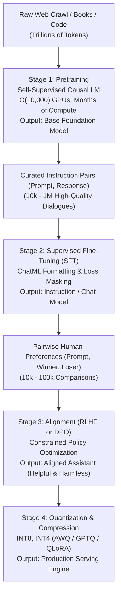
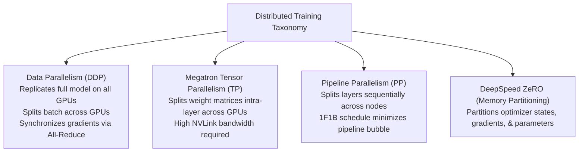
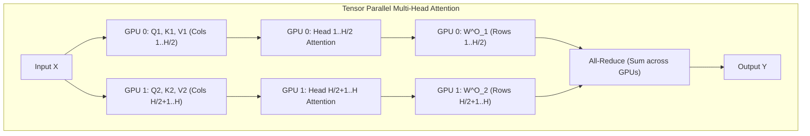
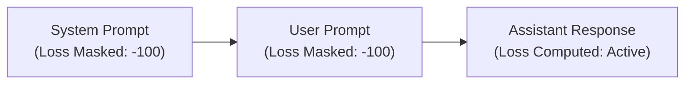
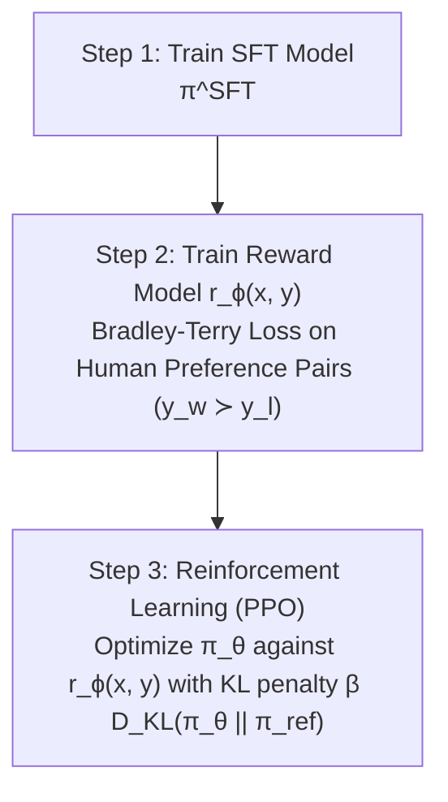
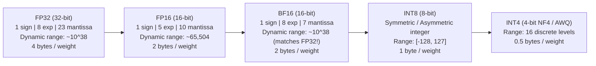
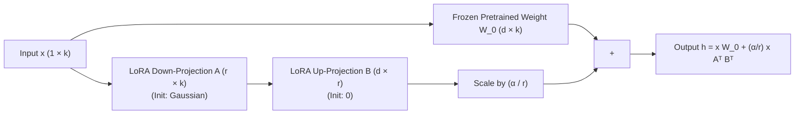

# LLM Training, Alignment & PEFT — Pretraining, Distributed Systems, SFT, RLHF, DPO, Quantization & LoRA

!!! info "Prerequisites"
    Autoregressive decoders, Transformer mechanics, policy gradients, and matrix calculus. Review [Transformer Architecture & Mechanics](transformer-architecture-mechanics-deep-dive.md), [Foundation Model Families](foundation-model-families-deep-dive.md), and [Deep Learning Optimizers](../06-deep-learning/deep-learning-optimizers-deep-dive.md).

---

## 1. The Big Picture: The Foundation Model Lifecycle

Transforming a collection of unstructured raw text into an aligned, instruction-following, deployment-ready assistant requires a rigorous multi-stage pipeline:



Each stage targets a distinct mathematical objective:
1. **Pretraining** compresses universal world knowledge into billions of neural weights via maximum likelihood estimation over trillions of tokens.
2. **Supervised Fine-Tuning (SFT)** aligns the base model's raw probability distribution to conversational formats and task templates.
3. **Alignment (RLHF / DPO)** shapes the policy to satisfy human values (truthfulness, safety, instruction following) by penalizing toxic, hallucinatory, or degenerate paths.
4. **Quantization & PEFT** compresses representations and enables adaptation without fine-tuning billions of baseline parameters.

---

## 2. Pretraining Infrastructure & Distributed Systems

Modern frontier models contain hundreds of billions of parameters. Training requires distributing compute, parameters, gradients, and optimizer states across clusters of thousands of GPUs.

### 2.1 The GPU Memory Breakdown
When training an LLM with $N$ parameters using 16-bit mixed precision (FP16 or BF16) and the AdamW optimizer:
1. **Model Parameters**: 2 bytes per parameter $\to 2N$ bytes.
2. **Gradients**: 2 bytes per parameter $\to 2N$ bytes.
3. **AdamW Optimizer States**:
   - FP32 master copy of weights: 4 bytes per parameter $\to 4N$ bytes.
   - First momentum vector ($m_t$): 4 bytes per parameter $\to 4N$ bytes.
   - Second momentum vector ($v_t$): 4 bytes per parameter $\to 4N$ bytes.
   - Total Optimizer States: $12N$ bytes.
4. **Static State Memory Total**: $2N + 2N + 12N = 16N$ bytes.

For a 70B parameter model, static weights, gradients, and optimizer states demand:

$$
16 \times 70 \times 10^9 \approx 1,120 \text{ GB}
$$

This requires at least fifteen 80GB A100/H100 GPUs purely to store parameters before allocating a single byte for activation memory!

---

### 2.2 Taxonomy of Distributed Training



#### 1. Distributed Data Parallelism (DDP)
Each GPU holds a complete copy of the model parameters and optimizer states. The input batch is partitioned across $P$ GPUs. After the backward pass, an `All-Reduce` collective operation averages gradients across all workers:

$$
\mathbf{g} = \frac{1}{P} \sum_{p=1}^P \mathbf{g}^{(p)}
$$

DDP is bounded by the memory capacity of a single GPU: the model must fit entirely in one device.

#### 2. Megatron-LM Tensor Parallelism (TP)
[Shoeybi et al. (2019)](https://arxiv.org/abs/1909.08053) split individual weight matrices within each Transformer layer across $T$ GPUs via column-parallel and row-parallel linear layers.



- **Column-Parallel (Q, K, V Projections & MLP Gate/Up)**: Matrix $\mathbf{W} \in \mathbb{R}^{d \times d}$ is sliced column-wise into $[\mathbf{W}_1, \mathbf{W}_2]$. No communication needed during forward pass.
- **Row-Parallel (Attention Output $\mathbf{W}^O$ & MLP Down)**: Matrix is sliced row-wise:
  $$\mathbf{Y} = [\mathbf{X}_1, \mathbf{X}_2] \begin{bmatrix} \mathbf{W}_1 \\ \mathbf{W}_2 \end{bmatrix} = \mathbf{X}_1 \mathbf{W}_1 + \mathbf{X}_2 \mathbf{W}_2$$
  A single `All-Reduce (Sum)` operation combines the partial sums.
- **Communication Cost**: Exactly 2 All-Reduce operations per Transformer block in forward pass, and 2 in backward pass. Requires high-bandwidth NVLink ($900\text{ GB/s}$).

#### 3. Pipeline Parallelism (PP)
Partitions the $L$ layers of the Transformer across $P$ nodes in sequential stages. Because naive sequential execution leaves $P-1$ nodes idle at any given time (a pipeline bubble), modern frameworks adopt the **1F1B (One-Forward-One-Backward)** schedule:
- Split the batch into $M$ micro-batches ($M \gg P$).
- After a warm-up phase, each stage alternates execution of one forward micro-batch and one backward micro-batch.
- The pipeline bubble fraction is:
  $$\text{Bubble Fraction} = \frac{P - 1}{M + P - 1}$$

#### 4. ZeRO (Zero Redundancy Optimizer)
[Rajbhandari et al. (2020)](https://arxiv.org/abs/1910.02054) eliminate redundant memory allocations across DDP workers:
- **ZeRO-Stage 1**: Partitions AdamW optimizer states ($12N$ bytes) across $P$ devices. Memory reduction: $4\times$.
- **ZeRO-Stage 2**: Partitions optimizer states and gradients ($12N + 2N = 14N$ bytes). Memory reduction: $8\times$.
- **ZeRO-Stage 3**: Partitions optimizer states, gradients, and model parameters ($16N$ bytes). Each GPU fetches parameters on-the-fly via `All-Gather` during forward/backward passes and discards them immediately after computation.

#### 5. FlashAttention: Exact Attention with Tiling
[Dao et al. (2022)](https://arxiv.org/abs/2205.14135) identified that computing standard attention $\text{softmax}(QK^T)V$ spends over $80\%$ of its time reading and writing the $N \times N$ attention matrix between High Bandwidth Memory (HBM: 1.5–3 TB/s) and fast on-chip SRAM (19 TB/s).

FlashAttention computes mathematically exact attention without materializing the $N \times N$ attention matrix in HBM. By utilizing the **online softmax algorithm** ([Milakov & Gimelshein, 2018](https://arxiv.org/abs/1805.02867)), attention is computed in small SRAM tiles:

Let row maximum $m = \max(x_1, \dots, x_k)$ and sum $l = \sum_{i=1}^k e^{x_i - m}$. When a new block arrives with local maximum $\tilde{m}$ and local sum $\tilde{l}$:

$$
m_{\text{new}} = \max(m, \tilde{m}), \quad l_{\text{new}} = l \cdot e^{m - m_{\text{new}}} + \tilde{l} \cdot e^{\tilde{m} - m_{\text{new}}}
$$

Outputs are rescaled dynamically on chip. FlashAttention reduces memory access from $\mathcal{O}(N^2)$ to $\mathcal{O}(N)$, yielding a $2-4\times$ wall-clock speedup and enabling 128k+ context windows.

---

## 3. Supervised Fine-Tuning (SFT) & Token Loss Masking

Pretrained base models output text completions; they do not inherently know when to stop, nor do they distinguish user instructions from assistant responses. SFT conditions the model to behave as an instruction-following dialogue agent.

### 3.1 Chat Formatting & ChatML
Structured special tokens delimit speaker turns to prevent prompt injection and delineate roles:

```text
<|im_start|>system
You are a helpful mathematical assistant.<|im_end|>
<|im_start|>user
What is the derivative of x^2?<|im_end|>
<|im_start|>assistant
The derivative of x^2 with respect to x is 2x.<|im_end|>
```



### 3.2 Token Loss Masking
If cross-entropy loss is computed over the entire formatted sequence, the model wastes gradient updates learning to predict the user's questions or system templates.

In standard PyTorch SFT, cross-entropy loss is configured with `ignore_index=-100`. Every token corresponding to the system prompt, user prompt, and role delimiter tags is masked with label `-100`. Only the assistant's completion tokens contribute to gradient backpropagation:

$$
\mathcal{L}_{\text{SFT}}(\theta) = -\frac{1}{|\mathcal{Y}|} \sum_{t \in \mathcal{Y}} \log P_\theta(y_t \mid x, y_{<t})
$$

where $\mathcal{Y}$ represents strictly the set of target token indices produced by the assistant.

---

## 4. Alignment & Preference Optimization: RLHF vs. DPO

### 4.1 Reinforcement Learning from Human Feedback (RLHF)

Introduced by [Ouyang et al. (InstructGPT, 2022)](https://arxiv.org/abs/2203.02155), RLHF aligns models with complex human intentions through a three-step pipeline:



#### Step 2: The Bradley-Terry Preference Model
Human evaluators are presented with a prompt $x$ and two candidate completions: winner $y_w$ and loser $y_l$. Under the Bradley-Terry preference model, the probability that $y_w$ is preferred over $y_l$ is parameterized by a scalar reward model $r_\phi(x, y)$:

$$
P(y_w \succ y_l \mid x) = \sigma(r_\phi(x, y_w) - r_\phi(x, y_l)) = \frac{1}{1 + e^{-(r_\phi(x, y_w) - r_\phi(x, y_l))}}
$$

The reward model parameters $\phi$ are trained via negative log-likelihood:

$$
\mathcal{L}_R(\phi) = -\mathbb{E}_{(x, y_w, y_l) \sim \mathcal{D}} \left[ \log \sigma(r_\phi(x, y_w) - r_\phi(x, y_l)) \right]
$$

#### Step 3: PPO Policy Optimization with KL Penalty
The language model policy $\pi_\theta$ is trained via Proximal Policy Optimization (PPO) to maximize predicted reward while penalizing divergence from the reference policy $\pi_{\text{ref}}$ (the frozen SFT model):

$$
\max_\theta \mathbb{E}_{x \sim \mathcal{D}, y \sim \pi_\theta(y \mid x)} \left[ r_\phi(x, y) - \beta D_{\text{KL}}(\pi_\theta(y \mid x) \,\|\, \pi_{\text{ref}}(y \mid x)) \right]
$$

The Kullback-Leibler (KL) penalty prevents **reward hacking** (generating degenerate repetitions that exploit flaws in the reward model) and ensures the model retains general fluency.

---

### 4.2 Direct Preference Optimization (DPO)

RLHF is notoriously complex: it requires loading four deep neural networks concurrently into GPU memory (Actor policy $\pi_\theta$, Critic value network $V_\psi$, Reference model $\pi_{\text{ref}}$, and Reward model $r_\phi$) and suffers from high variance during online rollout sampling.

[Rafailov et al. (2023)](https://arxiv.org/abs/2305.18290) derived **Direct Preference Optimization (DPO)**, mathematically proving that the constrained RL objective has an exact closed-form solution that eliminates the reward model and sampling loops entirely.

#### Mathematical Derivation of DPO
Consider the ground-truth constrained optimization problem for any arbitrary reward function $r(x, y)$:

$$
\max_\pi \mathbb{E}_{x \sim \mathcal{D}} \left[ \mathbb{E}_{y \sim \pi(y \mid x)} [r(x, y)] - \beta D_{\text{KL}}(\pi(y \mid x) \,\|\, \pi_{\text{ref}}(y \mid x)) \right]
$$

Expand the KL divergence:

$$
D_{\text{KL}}(\pi(y \mid x) \,\|\, \pi_{\text{ref}}(y \mid x)) = \sum_{y} \pi(y \mid x) \log \frac{\pi(y \mid x)}{\pi_{\text{ref}}(y \mid x)}
$$

The objective inside the expectation over $x$ becomes:

$$
\max_\pi \sum_y \pi(y \mid x) r(x, y) - \beta \sum_y \pi(y \mid x) \log \frac{\pi(y \mid x)}{\pi_{\text{ref}}(y \mid x)}
$$

Multiply by $-\frac{1}{\beta}$:

$$
\min_\pi \sum_y \pi(y \mid x) \left( \log \frac{\pi(y \mid x)}{\pi_{\text{ref}}(y \mid x)} - \frac{1}{\beta} r(x, y) \right)
$$

$$
= \min_\pi \sum_y \pi(y \mid x) \log \left( \frac{\pi(y \mid x)}{\pi_{\text{ref}}(y \mid x) \exp\left( \frac{1}{\beta} r(x, y) \right)} \right)
$$

Define the partition function (normalizer):

$$
Z(x) = \sum_y \pi_{\text{ref}}(y \mid x) \exp\left( \frac{1}{\beta} r(x, y) \right)
$$

Define an optimal non-parametric distribution:

$$
\pi^*(y \mid x) = \frac{1}{Z(x)} \pi_{\text{ref}}(y \mid x) \exp\left( \frac{1}{\beta} r(x, y) \right)
$$

Substitute $\pi^*(y \mid x)$ back into the minimization:

$$
\min_\pi \sum_y \pi(y \mid x) \log \left( \frac{\pi(y \mid x)}{Z(x) \pi^*(y \mid x)} \right) = \min_\pi \left[ D_{\text{KL}}(\pi(y \mid x) \,\|\, \pi^*(y \mid x)) - \log Z(x) \right]
$$

Since $Z(x)$ is independent of policy $\pi$, the minimum is uniquely achieved when the KL divergence is zero:

$$
\pi(y \mid x) = \pi^*(y \mid x) = \frac{1}{Z(x)} \pi_{\text{ref}}(y \mid x) \exp\left( \frac{1}{\beta} r(x, y) \right)
$$

#### Reparameterizing Reward via Policy Probabilities
Rearrange the equation to isolate the reward $r(x, y)$:

$$
\frac{\pi^*(y \mid x)}{\pi_{\text{ref}}(y \mid x)} = \frac{1}{Z(x)} \exp\left( \frac{1}{\beta} r(x, y) \right)
$$

Take the natural logarithm:

$$
\log \left( \frac{\pi^*(y \mid x)}{\pi_{\text{ref}}(y \mid x)} \right) = \frac{1}{\beta} r(x, y) - \log Z(x)
$$

$$
r(x, y) = \beta \log \left( \frac{\pi^*(y \mid x)}{\pi_{\text{ref}}(y \mid x)} \right) + \beta \log Z(x)
$$

#### Deriving the Final DPO Loss
Recall the Bradley-Terry preference probability:

$$
P(y_w \succ y_l \mid x) = \sigma(r(x, y_w) - r(x, y_l))
$$

Substitute our analytical expression for $r(x, y)$:

$$
r(x, y_w) - r(x, y_l) = \left[ \beta \log \frac{\pi(y_w \mid x)}{\pi_{\text{ref}}(y_w \mid x)} + \beta \log Z(x) \right] - \left[ \beta \log \frac{\pi(y_l \mid x)}{\pi_{\text{ref}}(y_l \mid x)} + \beta \log Z(x) \right]
$$

The partition function terms $\beta \log Z(x)$ **cancel out exactly**!

$$
r(x, y_w) - r(x, y_l) = \beta \log \frac{\pi(y_w \mid x)}{\pi_{\text{ref}}(y_w \mid x)} - \beta \log \frac{\pi(y_l \mid x)}{\pi_{\text{ref}}(y_l \mid x)}
$$

Substituting this into the negative log-likelihood of preference pairs yields the **DPO Loss Function**:

$$
\mathcal{L}_{\text{DPO}}(\theta; \pi_{\text{ref}}) = -\mathbb{E}_{(x, y_w, y_l) \sim \mathcal{D}} \left[ \log \sigma \left( \beta \log \frac{\pi_\theta(y_w \mid x)}{\pi_{\text{ref}}(y_w \mid x)} - \beta \log \frac{\pi_\theta(y_l \mid x)}{\pi_{\text{ref}}(y_l \mid x)} \right) \right]
$$

DPO requires **no reward model**, **no dynamic generation sampling**, and **no reinforcement learning hyperparameter tuning**. It operates as a direct classification loss over static preference data.

---

## 5. Model Quantization Mechanics

Quantization maps continuous 32-bit or 16-bit floating-point weights and activations to low-bit integers (e.g., INT8, INT4) to slash memory footprint and accelerate inference.



### 5.1 Symmetric vs. Asymmetric Uniform Quantization
Uniform quantization maps a real-valued float $x \in [\alpha, \beta]$ to an integer $q \in [q_{\min}, q_{\max}]$.

- **Asymmetric Quantization**:
  $$s = \frac{\beta - \alpha}{q_{\max} - q_{\min}}, \quad z = \text{round}\left( -\frac{\alpha}{s} \right) + q_{\min}$$
  $$q = \text{clip}\left( \text{round}\left( \frac{x}{s} \right) + z, \, q_{\min}, \, q_{\max} \right)$$
  Dequantization:
  $$\hat{x} = s(q - z)$$

- **Symmetric Quantization** ($z = 0$, centered at zero):
  $$s = \frac{\max(|\alpha|, |\beta|)}{q_{\max}}$$
  $$\hat{x} = s \cdot q$$
  Eliminates zero-point subtraction during matrix multiply kernels (`GEMM`), dramatically accelerating integer tensor cores.

---

### 5.2 Post-Training Quantization (PTQ) vs. QAT
- **PTQ (Post-Training Quantization)**: Weights are converted to low precision after full training without retraining.
  - **GPTQ (Frantar et al., 2022)**: Second-order Taylor series approximation using the inverse Hessian matrix $\mathbf{H}^{-1} = (2 \mathbf{X} \mathbf{X}^T + \lambda \mathbf{I})^{-1}$ to update remaining unquantized weights as columns are rounded.
  - **AWQ (Lin et al., 2023)**: Protects the salient $1\%$ outlier weight channels based on activation magnitudes, achieving 4-bit quantization without perplexity loss.
- **QAT (Quantization-Aware Training)**: Simulates low-precision rounding in forward pass using the **Straight-Through Estimator (STE)** while accumulating gradients into high-precision master weights during backpropagation.

---

### 5.3 NormalFloat4 (NF4) in QLoRA

[Dettmers et al. (2023)](https://arxiv.org/abs/2305.14314) observed that pretrained neural network weights follow a zero-mean normal distribution: $\mathbf{W} \sim \mathcal{N}(0, \sigma^2)$.

Standard uniform 4-bit integers distribute quant levels evenly across $[-1, 1]$, wasting precious resolution on low-probability tails while poorly resolving high-density regions near zero.

**NF4 (NormalFloat4)** is an information-theoretically optimal quantile quantization scheme. Its 16 discrete levels $q_i$ are chosen such that each bin holds an equal probability mass under a standard normal distribution $\mathcal{N}(0, 1)$:

$$
q_i = \frac{1}{2} \left( Q_X\left( \frac{i}{2^k} \right) + Q_X\left( \frac{i+1}{2^k} \right) \right)
$$

where $Q_X(p)$ is the inverse cumulative distribution function (quantile function) of $\mathcal{N}(0, 1)$.

---

## 6. Parameter-Efficient Fine-Tuning (PEFT) & LoRA / QLoRA

### 6.1 Low-Rank Adaptation (LoRA)

[Aghajanyan et al. (2020)](https://arxiv.org/abs/2012.13255) proved that the intrinsic dimensionality of parameter updates $\Delta \mathbf{W}$ during fine-tuning is drastically smaller than the full parameter dimension.

[Hu et al. (2021)](https://arxiv.org/abs/2106.09685) introduced **LoRA (Low-Rank Adaptation)**. For a frozen weight matrix $\mathbf{W}_0 \in \mathbb{R}^{d \times k}$, LoRA decomposes the weight update $\Delta \mathbf{W}$ into the product of two low-rank matrices:

$$
\mathbf{W} = \mathbf{W}_0 + \Delta \mathbf{W} = \mathbf{W}_0 + \frac{\alpha}{r} \mathbf{B} \mathbf{A}
$$

where:
- $\mathbf{A} \in \mathbb{R}^{r \times k}$ is initialized with Gaussian noise: $\mathbf{A} \sim \mathcal{N}\left(0, \frac{1}{r}\right)$.
- $\mathbf{B} \in \mathbb{R}^{d \times r}$ is initialized to **zeros**: $\mathbf{B} = \mathbf{0}$.
- $r \ll \min(d, k)$ is the rank (typically $r \in [8, 64]$).
- $\alpha$ is a constant scaling hyperparameter.



#### Key Properties of LoRA
1. **Zero Perturbation at Initialization**: Because $\mathbf{B} = \mathbf{0}$, the initial update $\Delta \mathbf{W} = \frac{\alpha}{r} \mathbf{B} \mathbf{A} = \mathbf{0}$. Training starts identically to the original pretrained model.
2. **Parameter Compression**: For $d = 4096$ and $r = 16$, fine-tuning $\mathbf{W} \in \mathbb{R}^{4096 \times 4096}$ requires $4096 \times 4096 \approx 16.7\text{M}$ parameters. LoRA requires $2 \times 4096 \times 16 = 131,072$ parameters — a **$128\times$ parameter reduction** ($>99\%$ parameter savings).
3. **Zero Inference Latency Overhead**: For production serving, the adapter weights can be permanently folded into the base model:
   $$\mathbf{W}_{\text{serving}} = \mathbf{W}_0 + \frac{\alpha}{r} \mathbf{B} \mathbf{A}$$
   Inference executes at native speed without extra matrix additions.

---

### 6.2 QLoRA: 4-bit Base Quantization with Double Quantization

[Dettmers et al. (2023)](https://arxiv.org/abs/2305.14314) made it possible to fine-tune a 65B/70B parameter model on a single 48GB GPU by combining:
1. **4-bit NormalFloat (NF4)** base model weights.
2. **Double Quantization (DQ)**: Quantizes the quantization constants $s_1$ themselves using 8-bit FP with block size 256, saving $0.37$ bits per parameter (reducing memory by $\approx 3\text{ GB}$ on a 65B model).
3. **Paged Optimizers**: Uses CUDA Unified Memory to automatically page AdamW memory states between GPU and CPU RAM during gradient checkpointing spikes, eliminating Out-Of-Memory (`OOM`) crashes.

---

## 7. Complete PyTorch Implementations from Scratch

### 7.1 LoRALinear Layer with Fusion & Unfusion

```python
import math
from typing import Optional
import torch
import torch.nn as nn
import torch.nn.functional as F


class LoRALinear(nn.Module):
    """Linear layer with Low-Rank Adaptation (LoRA, Hu et al. 2021)."""

    def __init__(
        self,
        in_features: int,
        out_features: int,
        rank: int = 16,
        alpha: float = 32.0,
        dropout: float = 0.05,
        bias: bool = False,
    ):
        super().__init__()
        self.in_features = in_features
        self.out_features = out_features
        self.rank = rank
        self.alpha = alpha
        self.scaling = alpha / rank

        # Frozen base weight
        self.weight = nn.Parameter(torch.empty(out_features, in_features))
        if bias:
            self.bias = nn.Parameter(torch.empty(out_features))
        else:
            self.register_parameter("bias", None)

        # Freeze base weights
        self.weight.requires_grad = False
        if self.bias is not None:
            self.bias.requires_grad = False

        # LoRA adapter parameters
        if rank > 0:
            self.lora_A = nn.Parameter(torch.empty(rank, in_features))
            self.lora_B = nn.Parameter(torch.zeros(out_features, rank))  # Initialized to zero
            self.lora_dropout = nn.Dropout(p=dropout) if dropout > 0.0 else nn.Identity()
        else:
            self.register_parameter("lora_A", None)
            self.register_parameter("lora_B", None)

        self.merged = False
        self.reset_parameters()

    def reset_parameters(self):
        # Kaiming uniform for base weights
        nn.init.kaiming_uniform_(self.weight, a=math.sqrt(5))
        if self.bias is not None:
            nn.init.zeros_(self.bias)

        if self.rank > 0:
            # Gaussian initialization for A, zeros for B
            nn.init.kaiming_uniform_(self.lora_A, a=math.sqrt(5))
            nn.init.zeros_(self.lora_B)

    def merge_weights(self):
        """Fold LoRA delta into base weight for zero-latency inference."""
        if not self.merged and self.rank > 0:
            delta_w = (self.lora_B @ self.lora_A) * self.scaling
            self.weight.data.add_(delta_w)
            self.merged = True

    def unmerge_weights(self):
        """Unfold LoRA delta to resume fine-tuning."""
        if self.merged and self.rank > 0:
            delta_w = (self.lora_B @ self.lora_A) * self.scaling
            self.weight.data.sub_(delta_w)
            self.merged = False

    def forward(self, x: torch.Tensor) -> torch.Tensor:
        if self.merged or self.rank == 0:
            return F.linear(x, self.weight, self.bias)

        base_out = F.linear(x, self.weight, self.bias)
        # Low-rank forward: x -> A^T -> B^T
        lora_out = (self.lora_dropout(x) @ self.lora_A.T) @ self.lora_B.T
        return base_out + self.scaling * lora_out
```

---

### 7.2 Complete DPO Loss Function in PyTorch

```python
def compute_dpo_loss(
    policy_chosen_logps: torch.Tensor,
    policy_rejected_logps: torch.Tensor,
    reference_chosen_logps: torch.Tensor,
    reference_rejected_logps: torch.Tensor,
    beta: float = 0.1,
) -> Tuple[torch.Tensor, torch.Tensor, torch.Tensor]:
    """Compute Direct Preference Optimization (DPO) Loss (Rafailov et al. 2023).

    Args:
        policy_chosen_logps: Log probabilities of chosen responses under policy pi_theta. Shape: (B,)
        policy_rejected_logps: Log probabilities of rejected responses under policy pi_theta. Shape: (B,)
        reference_chosen_logps: Log probabilities of chosen responses under reference pi_ref. Shape: (B,)
        reference_rejected_logps: Log probabilities of rejected responses under reference pi_ref. Shape: (B,)
        beta: Temperature scaling parameter controlling strength of KL penalty.

    Returns:
        losses: Scalar mean DPO loss.
        chosen_rewards: Implicit reward for chosen responses. Shape: (B,)
        rejected_rewards: Implicit reward for rejected responses. Shape: (B,)
    """
    # Compute log ratio between policy and reference for chosen: log(pi_theta(y_w|x) / pi_ref(y_w|x))
    pi_logratios = policy_chosen_logps - policy_rejected_logps
    ref_logratios = reference_chosen_logps - reference_rejected_logps

    logits = beta * (pi_logratios - ref_logratios)

    # DPO loss is negative log sigmoid: -log(sigma(beta * delta))
    losses = -F.logsigmoid(logits).mean()

    # Calculate implicit rewards for telemetry tracking
    chosen_rewards = beta * (policy_chosen_logps - reference_chosen_logps).detach()
    rejected_rewards = beta * (policy_rejected_logps - reference_rejected_logps).detach()

    return losses, chosen_rewards, rejected_rewards


# -------------------------------------------------------------
# Verification Run
# -------------------------------------------------------------
if __name__ == "__main__":
    torch.manual_seed(42)

    print("--- 1. Testing LoRALinear Layer ---")
    layer = LoRALinear(in_features=64, out_features=128, rank=8, alpha=16.0)
    dummy_input = torch.randn(2, 64)

    # Forward before merge
    out_unmerged = layer(dummy_input)
    # Merge weights
    layer.merge_weights()
    out_merged = layer(dummy_input)
    # Unmerge weights
    layer.unmerge_weights()
    out_restored = layer(dummy_input)

    assert torch.allclose(out_unmerged, out_merged, atol=1e-5), "Merged output diverged!"
    assert torch.allclose(out_unmerged, out_restored, atol=1e-5), "Restored output diverged!"
    print(f"LoRA forward verified. Output shape: {out_merged.shape}")
    print(f"Base weight frozen? {not layer.weight.requires_grad}")
    print(f"LoRA_A trainable? {layer.lora_A.requires_grad}")

    print("\n--- 2. Testing DPO Loss Function ---")
    B = 4
    # Simulated log probabilities: chosen completions have higher probability under policy than reference
    pol_chosen = torch.tensor([-2.1, -1.8, -3.2, -1.5])
    pol_rejected = torch.tensor([-4.5, -3.9, -5.1, -4.0])
    ref_chosen = torch.tensor([-2.5, -2.0, -3.5, -1.8])
    ref_rejected = torch.tensor([-3.0, -2.5, -3.8, -2.9])

    loss, ch_rewards, rej_rewards = compute_dpo_loss(pol_chosen, pol_rejected, ref_chosen, ref_rejected, beta=0.1)
    print(f"DPO Loss: {loss.item():.4f}")
    print(f"Mean Chosen Reward:   {ch_rewards.mean().item():.4f}")
    print(f"Mean Rejected Reward: {rej_rewards.mean().item():.4f}")
    assert ch_rewards.mean() > rej_rewards.mean(), "Chosen reward should exceed rejected reward!"
    print("\nAll PEFT and Alignment verifications passed successfully!")
```

---

## 8. Common Errors & Debugging Guide

### 1. The Reference Model Gradient Leak in DPO
- **Symptom**: GPU memory doubles and training crashes with `RuntimeError: CUDA out of memory` during DPO backward pass; loss collapses to 0.
- **Root Cause**: Forgetting to freeze the reference model (`pi_ref.eval()` and `param.requires_grad = False`) or wrapping reference forward passes inside active autograd.
- **Fix**: Run reference forward passes inside `@torch.no_grad()`:
```python
with torch.no_grad():
    ref_chosen_logps = reference_model(chosen_input_ids)
    ref_rejected_logps = reference_model(rejected_input_ids)
```

---

### 2. Leaking Prompt Tokens in SFT Loss Masking
- **Symptom**: Assistant outputs repetitive preamble phrases (*"Sure, I can help with that!"*) without answering, or hallucinates user questions in generation.
- **Root Cause**: Calculating cross-entropy loss across all sequence tokens rather than masking user tokens with `-100`.
- **Fix**: Mask prompt token labels with `-100`:
```python
labels = input_ids.clone()
labels[:, :prompt_length] = -100
loss = F.cross_entropy(logits.view(-1, vocab_size), labels.view(-1), ignore_index=-100)
```

---

### 3. Deploying LoRA Adapters Without Weight Fusion
- **Symptom**: Inference latency degrades by $25-40\%$ compared to the base model; high memory fragmentation.
- **Root Cause**: Running inference through `x @ W_0 + (alpha/r)(x @ A^T @ B^T)` during production serving, requiring three separate GEMM kernel launches per layer.
- **Fix**: Always call `layer.merge_weights()` before serializing weights for production serving.

---

## 9. Staff-Level Technical Interview Questions

### Q1: Derive why Direct Preference Optimization (DPO) does not require a reward model or dynamic sampling, starting from the constrained RL objective.

**Model Answer:**  
The standard RLHF objective is:
$$\max_\pi \mathbb{E}_{x \sim \mathcal{D}} \left[ \mathbb{E}_{y \sim \pi}[r(x, y)] - \beta D_{\text{KL}}(\pi(y|x) \,\|\, \pi_{\text{ref}}(y|x)) \right]$$
Setting the variational derivative with respect to $\pi(y|x)$ to zero yields the exact optimal policy:
$$\pi^*(y|x) = \frac{1}{Z(x)} \pi_{\text{ref}}(y|x) \exp\left( \frac{1}{\beta} r(x, y) \right)$$
where $Z(x) = \sum_y \pi_{\text{ref}}(y|x) \exp\left( \frac{1}{\beta} r(x, y) \right)$ is the partition function.  
Taking the natural logarithm and rearranging yields an analytical expression for the reward:
$$r(x, y) = \beta \log \frac{\pi^*(y|x)}{\pi_{\text{ref}}(y|x)} + \beta \log Z(x)$$
Under the Bradley-Terry preference model, the probability of preferring $y_w$ over $y_l$ depends strictly on the reward difference $r(x, y_w) - r(x, y_l)$:
$$r(x, y_w) - r(x, y_l) = \left[ \beta \log \frac{\pi(y_w|x)}{\pi_{\text{ref}}(y_w|x)} + \beta \log Z(x) \right] - \left[ \beta \log \frac{\pi(y_l|x)}{\pi_{\text{ref}}(y_l|x)} + \beta \log Z(x) \right]$$
The intractable partition function $Z(x)$ cancels out cleanly. Substituting this difference into the negative log-likelihood of preference pairs yields the DPO loss:
$$\mathcal{L}_{\text{DPO}}(\theta) = -\mathbb{E}_{(x, y_w, y_l)} \left[ \log \sigma \left( \beta \log \frac{\pi_\theta(y_w|x)}{\pi_{\text{ref}}(y_w|x)} - \beta \log \frac{\pi_\theta(y_l|x)}{\pi_{\text{ref}}(y_l|x)} \right) \right]$$
Because the loss is evaluated directly on offline preference pairs using policy and reference log probabilities, neither reward model training nor policy rollout generation is required.

---

### Q2: Compare Data Parallelism (DDP), Megatron Tensor Parallelism (TP), and Pipeline Parallelism (PP). When should each be chosen?

**Model Answer:**  
1. **Tensor Parallelism (TP)**: Slices matrices within each layer.
   - *Communication*: Requires 2 All-Reduce operations per transformer block in forward and backward passes.
   - *Hardware requirement*: High-bandwidth, low-latency interconnects (NVLink: $900\text{ GB/s}$).
   - *Scope*: Strictly within a single multi-GPU node (typically up to 8 GPUs).
2. **Pipeline Parallelism (PP)**: Partitions layers across sequential nodes.
   - *Communication*: Point-to-point transfer of activation tensors between boundary layers.
   - *Hardware requirement*: Can run across slower inter-node networking (InfiniBand $200-400\text{ Gbps}$).
   - *Overhead*: Suffers from pipeline bubbles, mitigated by 1F1B scheduling.
3. **Data Parallelism (DDP / ZeRO)**: Replicates or partitions parameters across workers processing different batch slices.
   - *Communication*: All-Reduce for gradients (or All-Gather / Reduce-Scatter in ZeRO-3).
   - *Scope*: Scaled horizontally across thousands of nodes once TP and PP make the model fit.  
*Standard 3D Parallelism Recipe*: Use TP within a single 8-GPU node $\to$ use PP across nodes until parameters fit $\to$ scale DDP/ZeRO across the remaining cluster nodes for throughput.

---

### Q3: Why is NormalFloat4 (NF4) in QLoRA information-theoretically superior to standard INT4 uniform quantization for neural network weights?

**Model Answer:**  
Neural network weights trained with weight decay and gradient descent conform closely to a normal distribution $\mathbf{W} \sim \mathcal{N}(0, \sigma^2)$.  
In standard uniform 4-bit quantization, 16 discrete levels are spaced at equal linear intervals across $[-1, 1]$. Because the probability density of a Gaussian is concentrated near zero and decays exponentially toward the tails:
1. Outer intervals near $\pm 1$ represent virtually empty probability mass, wasting quantization bins.
2. The high-density center near 0 is quantized with coarse resolution, resulting in high mean squared quantization error (quantization noise).  
NF4 computes the quantiles of $\mathcal{N}(0, 1)$ such that every one of the 16 bins contains exactly $\frac{1}{16}$ of the continuous distribution's probability mass. This maximizes the Shannon entropy of the discrete representation:
$$H(Q) = -\sum_{i=1}^{16} p_i \log_2 p_i = -\sum_{i=1}^{16} \frac{1}{16} (-4) = 4 \text{ bits}$$
Every bit of the 4-bit integer carries maximal information, minimizing expected reconstruction error $\mathbb{E}[(\mathbf{W} - \hat{\mathbf{W}})^2]$.

---

### Q4: Explain the mathematical role of the $\frac{\alpha}{r}$ scaling factor in LoRA. What happens when rank $r$ is increased while keeping $\alpha$ constant?

**Model Answer:**  
In LoRA, the forward pass computes:
$$\mathbf{y} = \mathbf{x} \mathbf{W}_0 + \frac{\alpha}{r} (\mathbf{x} \mathbf{A}^T \mathbf{B}^T)$$
The factor $\frac{\alpha}{r}$ serves as a learning rate multiplier for the low-rank adapter updates.  
When the rank $r$ is varied (e.g. comparing $r=4$ to $r=64$):
- Because $\mathbf{A} \in \mathbb{R}^{r \times k}$ has $r$ rows, the expected magnitude of the inner product $\mathbf{x} \mathbf{A}^T$ grows with $\sqrt{r}$.
- Dividing by $r$ ensures that the overall scale of adapter updates $\Delta \mathbf{W}$ remains stable when experimenting with different rank values.  
If $\alpha$ is kept constant while $r$ is increased, the effective magnitude of the adapter update is normalized, allowing hyperparameter reuse (learning rate and warmup) across different rank configurations without re-tuning.

---

### Q5: How does FlashAttention eliminate the $\mathcal{O}(N^2)$ memory bandwidth bottleneck without altering the exact mathematical output of attention?

**Model Answer:**  
Standard attention materializes intermediate tensors $\mathbf{S} = \frac{\mathbf{Q}\mathbf{K}^T}{\sqrt{d_k}} \in \mathbb{R}^{N \times N}$ and $\mathbf{P} = \text{softmax}(\mathbf{S}) \in \mathbb{R}^{N \times N}$ into GPU High-Bandwidth Memory (HBM). For sequence length $N = 16,384$, an $N \times N$ FP16 matrix requires $512\text{ MB}$ per head per layer. Reading and writing these matrices between HBM and SRAM saturates memory bandwidth, leaving tensor cores idle.  
FlashAttention divides $\mathbf{Q}, \mathbf{K}, \mathbf{V}$ into small blocks that fit entirely in fast on-chip SRAM ($192\text{ KB}$ per Streaming Multiprocessor).  
To compute softmax over blocks without seeing the entire sequence at once, it utilizes the **online softmax technique**:
As new key-value blocks are loaded into SRAM, FlashAttention maintains running row-wise maximums $m$ and normalization sums $l$. When an updated maximum is observed in a new block, the accumulated output tile $\mathbf{O}$ is rescaled by $e^{m_{\text{old}} - m_{\text{new}}}$ before adding the contribution of the new block.  
Because intermediate attention matrices are never written to or read from HBM, memory access drops from $\mathcal{O}(N^2)$ to $\mathcal{O}(N)$ while producing floating-point outputs mathematically identical to standard attention.

---

## 10. Mastery Ladder

- [ ] **L1:** Calculate the static GPU memory required to store a 7B, 13B, and 70B parameter model in FP16 with AdamW optimizer states.
- [ ] **L2:** Explain the difference between Data Parallelism (DDP), Megatron Tensor Parallelism (TP), and Pipeline Parallelism (PP).
- [ ] **L3:** Describe the 3 stages of DeepSpeed ZeRO memory partitioning.
- [ ] **L4:** Formulate the online softmax algorithm and explain how FlashAttention eliminates HBM memory roundtrips.
- [ ] **L5:** Explain why SFT token loss masking with `ignore_index=-100` prevents prompt degradation.
- [ ] **L6:** Formulate the Bradley-Terry preference loss used in RLHF reward modeling.
- [ ] **L7:** Derive the DPO loss function from the constrained KL-regularized reward maximization objective.
- [ ] **L8:** Contrast Symmetric INT8, Asymmetric INT8, and NormalFloat4 (NF4) quantization.
- [ ] **L9:** Explain the initialization of matrices $\mathbf{A}$ and $\mathbf{B}$ in LoRA and why $\Delta \mathbf{W} = \mathbf{0}$ at step 0.
- [ ] **L10:** Implement a functional `LoRALinear` module with weight merging and write the vectorized DPO loss function in PyTorch.
