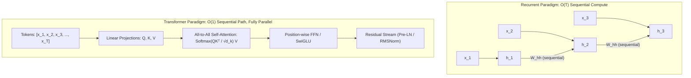
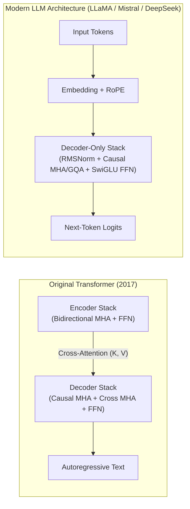
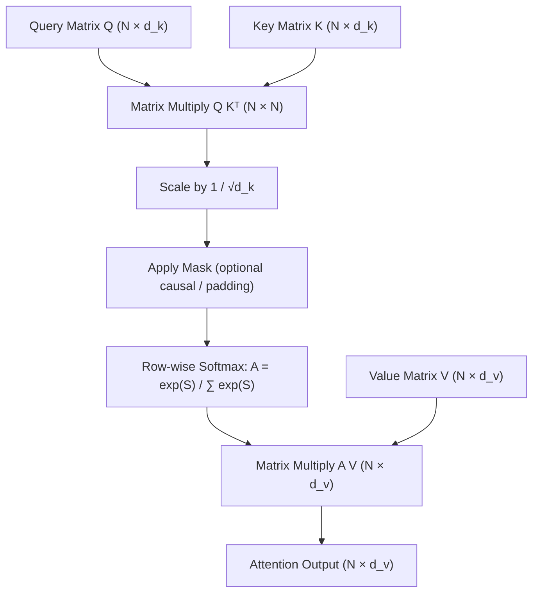
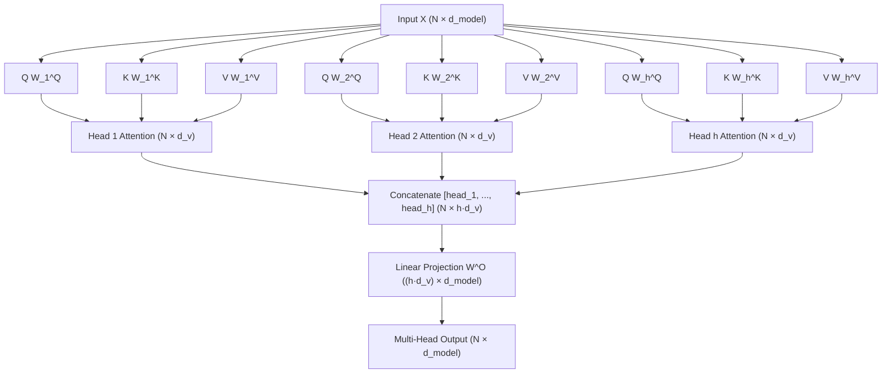
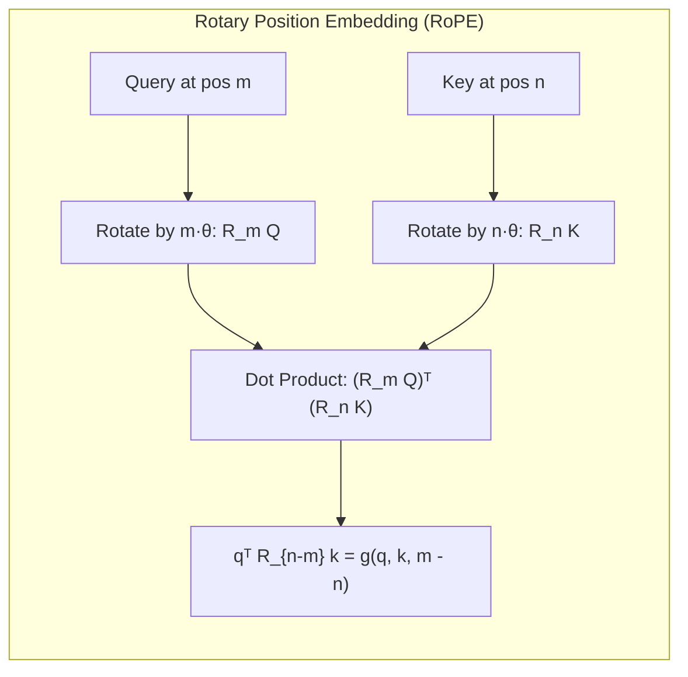
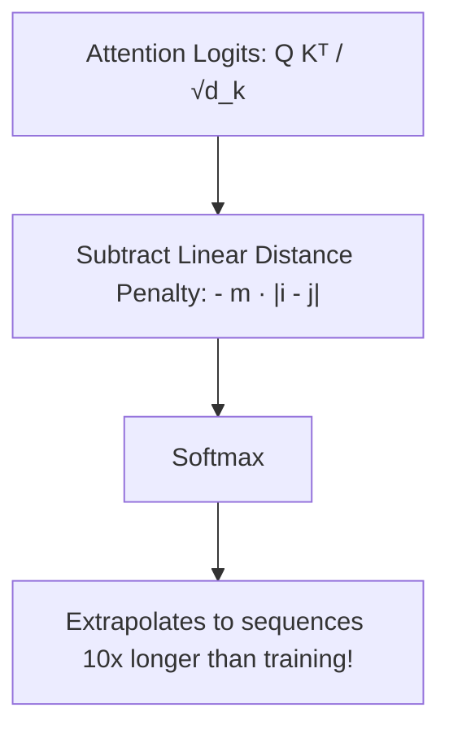
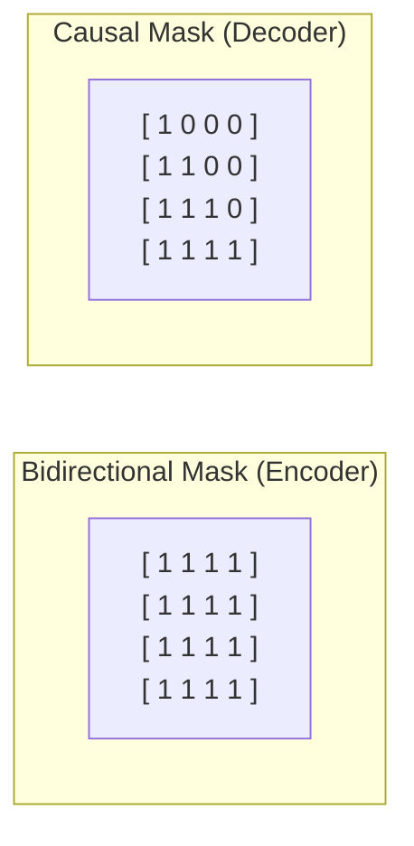
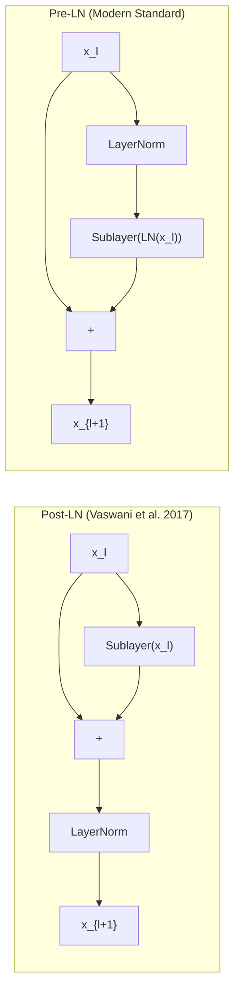
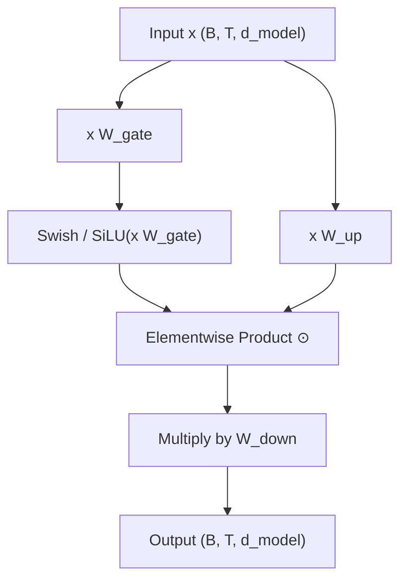
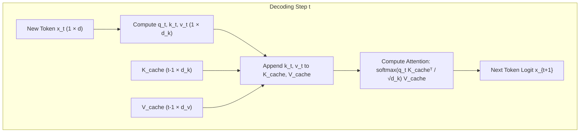

# Transformer Architecture & Mechanics — From Self-Attention to Modern Decoder LLMs

!!! info "Prerequisites"
    Multivariate calculus (chain rule, Jacobians), probability theory (expectations, variances of independent random variables), linear algebra (matrix products, projections, spectral norms), and neural network backpropagation. Review [Sequence Models, Attention & Transformers](../08-nlp/sequence-models-attention-transformers-deep-dive.md), [Neural Network Foundations](../06-deep-learning/neural-network-foundations-deep-dive.md), and [Linear Algebra](../02-mathematics/linear-algebra-deep-dive.md).

---

## 1. The Big Picture & Architectural Evolution

Before the Transformer ([Vaswani et al., 2017](https://arxiv.org/abs/1706.03762)), the dominant paradigm for processing sequential data relied on Recurrent Neural Networks (RNNs, LSTMs, GRUs). While recurrent models preserve temporal order naturally through a recurrence relation $\mathbf{h}_t = f(\mathbf{h}_{t-1}, \mathbf{x}_t)$, they suffer from two structural bottlenecks:

1. **Sequential Compute Bottleneck**: Step $t$ cannot be computed until step $t-1$ finishes. This inherently prevents horizontal GPU parallelization across the time dimension during training.
2. **Path Length & Gradient Degradation**: Signals between token $i$ and token $j$ must traverse $|i - j|$ non-linear transformations. Despite gating mechanisms (like the LSTM Constant Error Carousel), long-range gradient signals decay or distort over hundreds of steps.

The Transformer discards recurrence entirely and replaces it with **Self-Attention**. Every token attends directly to every other token in $\mathcal{O}(1)$ sequential operations. The entire sequence is processed concurrently, unlocking massive throughput on tensor accelerators.



The original architecture was an **Encoder-Decoder** designed for bilingual machine translation. Over the subsequent decade, modern large language models converged primarily onto the **Decoder-only** autoregressive architecture (GPT, LLaMA, Mistral, DeepSeek), incorporating architectural enhancements including:

- **Pre-Layer Normalization** or **RMSNorm** for training stability without delicate warmup schedules.
- **Rotary Position Embeddings (RoPE)** or **ALiBi** replacing static sinusoidal absolute embeddings.
- **SwiGLU** activation replacing standard ReLU/GELU feed-forward networks.
- **KV Caching** during inference to convert $\mathcal{O}(N^2)$ autoregressive token generation into $\mathcal{O}(N)$ compute per token.



---

## 2. Self-Attention Mechanics & Mathematical Foundations

### 2.1 The Query, Key, Value Formulation

Let an input sequence of $N$ tokens embedded in dimension $d_{\text{model}}$ be represented as a matrix $\mathbf{X} \in \mathbb{R}^{N \times d_{\text{model}}}$. 

The model projects $\mathbf{X}$ into three distinct vector spaces using learned linear transformation matrices:

- **Queries ($\mathbf{Q}$)**: What each token is searching for.
- **Keys ($\mathbf{K}$)**: What each token contains or offers to matching queries.
- **Values ($\mathbf{V}$)**: The actual informational payload extracted when a query matches a key.

$$
\mathbf{Q} = \mathbf{X} \mathbf{W}^Q, \quad \mathbf{K} = \mathbf{X} \mathbf{W}^K, \quad \mathbf{V} = \mathbf{X} \mathbf{W}^V
$$

where $\mathbf{W}^Q \in \mathbb{R}^{d_{\text{model}} \times d_k}$, $\mathbf{W}^K \in \mathbb{R}^{d_{\text{model}} \times d_k}$, and $\mathbf{W}^V \in \mathbb{R}^{d_{\text{model}} \times d_v}$. Typically in single-head attention $d_k = d_v = d_{\text{model}}$, whereas in multi-head attention with $h$ heads, $d_k = d_v = d_{\text{model}} / h$.

The **Scaled Dot-Product Attention** computes:

$$
\text{Attention}(\mathbf{Q}, \mathbf{K}, \mathbf{V}) = \text{softmax}\left( \frac{\mathbf{Q} \mathbf{K}^T}{\sqrt{d_k}} \right) \mathbf{V}
$$

Let $\mathbf{A} = \text{softmax}\left( \frac{\mathbf{Q} \mathbf{K}^T}{\sqrt{d_k}} \right) \in \mathbb{R}^{N \times N}$ denote the attention score matrix. The output for token $i$ is a convex combination of value vectors:

$$
\mathbf{y}_i = \sum_{j=1}^N A_{ij} \mathbf{v}_j, \quad \text{where } A_{ij} \ge 0 \text{ and } \sum_{j=1}^N A_{ij} = 1
$$



---

### 2.2 Mathematical Proof: Why Variance Scaling $\frac{1}{\sqrt{d_k}}$ Prevents Vanishing Gradients

Why divide by $\sqrt{d_k}$ instead of taking the raw dot product $\mathbf{Q} \mathbf{K}^T$?

#### Theorem: Variance of Dot Product of Independent Vectors
Let $\mathbf{q} = [q_1, \dots, q_{d_k}]^T \in \mathbb{R}^{d_k}$ and $\mathbf{k} = [k_1, \dots, k_{d_k}]^T \in \mathbb{R}^{d_k}$ be random vectors whose components are independent and identically distributed (i.i.d.) with zero mean and unit variance:

$$
\mathbb{E}[q_i] = 0, \quad \text{Var}(q_i) = 1, \qquad \mathbb{E}[k_j] = 0, \quad \text{Var}(k_j) = 1, \quad \forall i, j \in \{1, \dots, d_k\}
$$

Assume further that $\mathbf{q}$ and $\mathbf{k}$ are mutually independent.

Consider the scalar dot product $S = \mathbf{q}^T \mathbf{k} = \sum_{i=1}^{d_k} q_i k_i$.

**Step 1: Expectation of $S$**
By linearity of expectation and independence:

$$
\mathbb{E}[S] = \mathbb{E}\left[ \sum_{i=1}^{d_k} q_i k_i \right] = \sum_{i=1}^{d_k} \mathbb{E}[q_i] \mathbb{E}[k_i] = \sum_{i=1}^{d_k} (0)(0) = 0
$$

**Step 2: Variance of each product term $Z_i = q_i k_i$**

$$
\text{Var}(q_i k_i) = \mathbb{E}[(q_i k_i)^2] - (\mathbb{E}[q_i k_i])^2 = \mathbb{E}[q_i^2] \mathbb{E}[k_i^2] - 0
$$

Since $\text{Var}(X) = \mathbb{E}[X^2] - (\mathbb{E}[X])^2$, and $\mathbb{E}[q_i] = 0$:

$$
\mathbb{E}[q_i^2] = \text{Var}(q_i) = 1, \quad \mathbb{E}[k_i^2] = \text{Var}(k_i) = 1 \implies \text{Var}(q_i k_i) = 1 \cdot 1 = 1
$$

**Step 3: Variance of the sum $S$**
Because the coordinate pairs $(q_i, k_i)$ and $(q_j, k_j)$ are mutually independent for $i \ne j$, the variance of the sum is the sum of the variances:

$$
\text{Var}(S) = \text{Var}\left( \sum_{i=1}^{d_k} q_i k_i \right) = \sum_{i=1}^{d_k} \text{Var}(q_i k_i) = \sum_{i=1}^{d_k} 1 = d_k
$$

The standard deviation is therefore:

$$
\sigma_S = \sqrt{\text{Var}(S)} = \sqrt{d_k}
$$

#### The Consequence on Softmax Gradients
Now let $\mathbf{s} \in \mathbb{R}^N$ be the vector of unscaled dot products for a given query against $N$ keys. The softmax output is $\mathbf{p} \in \mathbb{R}^N$ with components:

$$
p_i = \frac{e^{s_i}}{\sum_{j=1}^N e^{s_j}}
$$

The Jacobian matrix of the softmax function $\frac{\partial \mathbf{p}}{\partial \mathbf{s}}$ has elements:

$$
\frac{\partial p_i}{\partial s_j} = p_i (\delta_{ij} - p_j), \quad \text{where } \delta_{ij} = \begin{cases} 1 & \text{if } i = j \\ 0 & \text{if } i \ne j \end{cases}
$$

As $d_k$ grows large (for instance, $d_k = 64$ gives $\sigma = 8$; $d_k = 128$ gives $\sigma \approx 11.3$), the logits $s_i$ diverge significantly in magnitude. In a set of $N$ Gaussian random variables with standard deviation $\sqrt{d_k}$, the maximum logit $s_{\max}$ is on the order of $\sqrt{2 \ln N} \cdot \sqrt{d_k}$.

When $s_{\max} - s_j \gg 1$ for all $j \ne \max$:

- $p_{\max} \to 1.0$
- $p_j \to 0.0$ for all $j \ne \max$

Evaluate the Jacobian in this saturated regime:

- For the peak entry: $\frac{\partial p_{\max}}{\partial s_{\max}} = p_{\max}(1 - p_{\max}) \approx 1(1 - 1) = 0$.
- For all other entries: $\frac{\partial p_j}{\partial s_j} = p_j(1 - p_j) \approx 0(1 - 0) = 0$.
- Cross terms: $\frac{\partial p_i}{\partial s_j} = -p_i p_j \approx 0$.

Every single element of the softmax Jacobian collapses to zero:

$$
\lim_{d_k \to \infty} \left\| \frac{\partial \mathbf{p}}{\partial \mathbf{s}} \right\|_F = 0
$$

Backpropagation halts completely through the query and key projection weights $\mathbf{W}^Q$ and $\mathbf{W}^K$.

#### The Scaling Solution
By defining the scaled logit:

$$
\tilde{S} = \frac{\mathbf{q}^T \mathbf{k}}{\sqrt{d_k}}
$$

its variance becomes:

$$
\text{Var}(\tilde{S}) = \text{Var}\left( \frac{S}{\sqrt{d_k}} \right) = \frac{1}{d_k} \text{Var}(S) = \frac{1}{d_k} (d_k) = 1
$$

The inputs to the softmax maintain unit variance regardless of how wide the representation dimension $d_k$ is, keeping the logits inside the active, steep gradient regime of the softmax function.

---

## 3. Multi-Head Attention (MHA)

### 3.1 Motivation & Geometric Intuition

A single attention head computes a single convex combination of value vectors. However, a word or token in natural language engages in multiple simultaneous grammatical, syntactic, and semantic relationships:

- In *"The animal didn't cross the street because it was too tired"*, the token *"it"* must simultaneously link to:
  1. *"animal"* (coreference resolution / semantic subject).
  2. *"tired"* (predicate attribute / causal reason).
  3. *"cross"* (action being modulated).

A single attention distribution can only place high probability mass in one or two directions before blurring the value vectors into an uninformative mean. Multi-Head Attention solves this by projecting queries, keys, and values into $h$ distinct representation subspaces.



### 3.2 Formal Mathematical Definition

Let $h$ be the number of attention heads. For each head $i \in \{1, \dots, h\}$, define projection matrices:

$$
\mathbf{W}_i^Q \in \mathbb{R}^{d_{\text{model}} \times d_k}, \quad \mathbf{W}_i^K \in \mathbb{R}^{d_{\text{model}} \times d_k}, \quad \mathbf{W}_i^V \in \mathbb{R}^{d_{\text{model}} \times d_v}
$$

The $i$-th head output is:

$$
\text{head}_i = \text{Attention}(\mathbf{X} \mathbf{W}_i^Q, \mathbf{X} \mathbf{W}_i^K, \mathbf{X} \mathbf{W}_i^V) = \text{softmax}\left( \frac{\mathbf{X}\mathbf{W}_i^Q (\mathbf{X}\mathbf{W}_i^K)^T}{\sqrt{d_k}} \right) \mathbf{X}\mathbf{W}_i^V \in \mathbb{R}^{N \times d_v}
$$

The heads are concatenated horizontally:

$$
\text{MultiHead}(\mathbf{Q}, \mathbf{K}, \mathbf{V}) = \left[ \text{head}_1 \,\|\, \text{head}_2 \,\|\, \dots \,\|\, \text{head}_h \right] \mathbf{W}^O
$$

where $\mathbf{W}^O \in \mathbb{R}^{(h \cdot d_v) \times d_{\text{model}}}$ is the final output projection matrix.

In standard architectures, $d_k = d_v = \frac{d_{\text{model}}}{h}$. The concatenated dimension is $h \cdot d_v = d_{\text{model}}$.

### 3.3 Complexity Analysis

Let $N$ be sequence length and $d = d_{\text{model}}$.

1. **Projections**: Projecting $\mathbf{X}$ to $\mathbf{Q}, \mathbf{K}, \mathbf{V}$ costs $3 \times \mathcal{O}(N d^2)$.
2. **Attention Scores $\mathbf{Q} \mathbf{K}^T$**: For each of the $h$ heads, multiplying $(N \times d_k)$ by $(d_k \times N)$ costs $\mathcal{O}(N^2 d_k)$. Across $h$ heads:
   $$h \cdot \mathcal{O}(N^2 d_k) = \mathcal{O}\left( N^2 \cdot (h d_k) \right) = \mathcal{O}(N^2 d)$$

3. **Softmax & Weighting $\mathbf{A} \mathbf{V}$**: Multiplying $(N \times N)$ by $(N \times d_v)$ per head costs $h \cdot \mathcal{O}(N^2 d_v) = \mathcal{O}(N^2 d)$.
4. **Final Linear Projection $\mathbf{W}^O$**: Multiplying $(N \times d)$ by $(d \times d)$ costs $\mathcal{O}(N d^2)$.

Total Time Complexity: $\mathcal{O}(N^2 d + N d^2)$.  
Total Space Complexity: Storing the attention maps requires $\mathcal{O}(h N^2)$ memory per layer.

---

## 4. Positional Encodings: Complete Taxonomy & Mathematical Derivations

### 4.1 Permutation Equivariance of Pure Self-Attention

Without positional information, Self-Attention is strictly **permutation equivariant**. 

#### Theorem: Permutation Equivariance
Let $\mathbf{P} \in \{0, 1\}^{N \times N}$ be an arbitrary permutation matrix ($\mathbf{P}^T \mathbf{P} = \mathbf{I}$). If the input token matrix $\mathbf{X}$ is permuted to $\mathbf{X}' = \mathbf{P} \mathbf{X}$, then:

$$
\text{Attention}(\mathbf{P}\mathbf{X}\mathbf{W}^Q, \mathbf{P}\mathbf{X}\mathbf{W}^K, \mathbf{P}\mathbf{X}\mathbf{W}^V) = \mathbf{P} \, \text{Attention}(\mathbf{X}\mathbf{W}^Q, \mathbf{X}\mathbf{W}^K, \mathbf{X}\mathbf{W}^V)
$$

**Proof:**

$$
\mathbf{Q}' = \mathbf{P} \mathbf{X} \mathbf{W}^Q = \mathbf{P} \mathbf{Q}, \quad \mathbf{K}' = \mathbf{P} \mathbf{K}, \quad \mathbf{V}' = \mathbf{P} \mathbf{V}
$$

The attention logits become:

$$
\mathbf{S}' = \frac{\mathbf{Q}' (\mathbf{K}')^T}{\sqrt{d_k}} = \frac{(\mathbf{P}\mathbf{Q})(\mathbf{P}\mathbf{K})^T}{\sqrt{d_k}} = \frac{\mathbf{P}\mathbf{Q}\mathbf{K}^T \mathbf{P}^T}{\sqrt{d_k}} = \mathbf{P} \mathbf{S} \mathbf{P}^T
$$

Since softmax applies row-wise, and $\mathbf{P}$ merely permutes the rows and columns:

$$
\text{softmax}(\mathbf{P} \mathbf{S} \mathbf{P}^T) = \mathbf{P} \, \text{softmax}(\mathbf{S}) \mathbf{P}^T
$$

Multiplying by $\mathbf{V}' = \mathbf{P} \mathbf{V}$:

$$
\mathbf{A}' \mathbf{V}' = (\mathbf{P} \mathbf{A} \mathbf{P}^T)(\mathbf{P} \mathbf{V}) = \mathbf{P} \mathbf{A} (\mathbf{P}^T \mathbf{P}) \mathbf{V} = \mathbf{P} (\mathbf{A} \mathbf{V}) \quad \blacksquare
$$

Without explicit position injection, the sequence *"dog bites man"* produces the exact same representations as *"man bites dog"* (up to permutation). The model behaves as a bag-of-words.

---

### 4.2 Sinusoidal Absolute Positional Encodings

Vaswani et al. (2017) introduced fixed sinusoidal encodings added directly to input embeddings: $\tilde{\mathbf{X}} = \mathbf{X} + \mathbf{PE}$.

For token at position $pos \in \{0, \dots, N-1\}$ and channel index $i \in \{0, \dots, \frac{d}{2}-1\}$:

$$
PE_{(pos, 2i)} = \sin\left( \frac{pos}{10000^{2i / d_{\text{model}}}} \right) = \sin(pos \cdot \omega_i)
$$

$$
PE_{(pos, 2i+1)} = \cos\left( \frac{pos}{10000^{2i / d_{\text{model}}}} \right) = \cos(pos \cdot \omega_i)
$$

where $\omega_i = \frac{1}{10000^{2i / d_{\text{model}}}}$. The wavelengths form a geometric progression from $2\pi$ to $10000 \cdot 2\pi$.

#### The Linear Shift Property: Why Sinusoids?
The primary mathematical motivation was the hypothesis that the model could easily learn to attend by **relative offsets**: for any fixed offset $k$, there exists a linear transformation matrix $\mathbf{M}_k \in \mathbb{R}^{d \times d}$ such that:

$$
\mathbf{PE}_{pos+k} = \mathbf{M}_k \mathbf{PE}_{pos}
$$

**Proof:**  
Consider the 2D subspace for frequency $\omega_i$. The vector at position $pos$ is:

$$
\mathbf{u}_{pos} = \begin{bmatrix} \sin(pos \cdot \omega_i) \\ \cos(pos \cdot \omega_i) \end{bmatrix}
$$

At position $pos + k$:

$$
\mathbf{u}_{pos+k} = \begin{bmatrix} \sin((pos + k)\omega_i) \\ \cos((pos + k)\omega_i) \end{bmatrix}
$$

Using the angle addition formulas:

- $\sin(a + b) = \sin(a)\cos(b) + \cos(a)\sin(b)$
- $\cos(a + b) = \cos(a)\cos(b) - \sin(a)\sin(b)$

We rewrite $\mathbf{u}_{pos+k}$ as a matrix-vector product:

$$
\begin{bmatrix} \sin((pos+k)\omega_i) \\ \cos((pos+k)\omega_i) \end{bmatrix} = \begin{bmatrix} \cos(k\omega_i) & \sin(k\omega_i) \\ -\sin(k\omega_i) & \cos(k\omega_i) \end{bmatrix} \begin{bmatrix} \sin(pos \cdot \omega_i) \\ \cos(pos \cdot \omega_i) \end{bmatrix}
$$

Notice that the transformation matrix:

$$
\mathbf{R}_k^{(i)} = \begin{bmatrix} \cos(k\omega_i) & \sin(k\omega_i) \\ -\sin(k\omega_i) & \cos(k\omega_i) \end{bmatrix}
$$

depends strictly on the offset $k$ and frequency $\omega_i$, and is completely independent of the absolute position $pos$.

Assembling this across all $d/2$ frequency pairs produces a block-diagonal rotation matrix:

$$
\mathbf{M}_k = \text{diag}\left( \mathbf{R}_k^{(0)}, \mathbf{R}_k^{(1)}, \dots, \mathbf{R}_k^{(d/2 - 1)} \right) \quad \blacksquare
$$

---

### 4.3 Rotary Position Embedding (RoPE)

While sinusoidal encodings provide absolute positions that admit linear shifts, adding position vectors to input word embeddings causes position information to dilute across deeper layers.

[Su et al. (2021)](https://arxiv.org/abs/2104.09864) introduced **RoPE (Rotary Position Embedding)**, the standard in modern LLMs (LLaMA, Mistral, Gemma, Qwen, DeepSeek). 

Rather than *adding* vectors to embeddings before layer 1, RoPE directly *rotates* Query and Key vectors in the complex plane at each attention layer.

#### The Core Objective
We seek an encoding function $f_q(\mathbf{x}_m, m)$ and $f_k(\mathbf{x}_n, n)$ that injects positions $m$ and $n$ into query and key vectors such that their inner product depends **only** on the relative distance $m - n$ and the vectors themselves:

$$
\langle f_q(\mathbf{x}_m, m), f_k(\mathbf{x}_n, n) \rangle = g(\mathbf{x}_m, \mathbf{x}_n, m - n)
$$

#### 2D Geometric Formulation
In 2 dimensions, represent a query vector $\mathbf{q} = [q_1, q_2]^T$ as a complex number:

$$
q = q_1 + i q_2 \in \mathbb{C}
$$

Rotate it by angle $m\theta$:

$$
f_q(q, m) = q \cdot e^{i m \theta} = (q_1 + i q_2)(\cos(m\theta) + i \sin(m\theta))
$$

Expanding the real and imaginary components:

$$
f_q(\mathbf{q}, m) = \begin{bmatrix} q_1 \cos(m\theta) - q_2 \sin(m\theta) \\ q_1 \sin(m\theta) + q_2 \cos(m\theta) \end{bmatrix} = \begin{bmatrix} \cos(m\theta) & -\sin(m\theta) \\ \sin(m\theta) & \cos(m\theta) \end{bmatrix} \begin{bmatrix} q_1 \\ q_2 \end{bmatrix} = \mathbf{R}_{\Theta, m} \mathbf{q}
$$

Now compute the inner product of rotated query at position $m$ and rotated key at position $n$:

$$
\langle \mathbf{R}_{\Theta, m} \mathbf{q}, \mathbf{R}_{\Theta, n} \mathbf{k} \rangle = (\mathbf{R}_{\Theta, m} \mathbf{q})^T (\mathbf{R}_{\Theta, n} \mathbf{k}) = \mathbf{q}^T \mathbf{R}_{\Theta, m}^T \mathbf{R}_{\Theta, n} \mathbf{k}
$$

Since $\mathbf{R}_{\Theta, m}$ is an orthogonal 2D rotation matrix:

$$
\mathbf{R}_{\Theta, m}^T \mathbf{R}_{\Theta, n} = \mathbf{R}_{\Theta, -m} \mathbf{R}_{\Theta, n} = \mathbf{R}_{\Theta, n - m} = \mathbf{R}_{\Theta, -(m - n)}
$$

Therefore:

$$
\langle \mathbf{R}_{\Theta, m} \mathbf{q}, \mathbf{R}_{\Theta, n} \mathbf{k} \rangle = \mathbf{q}^T \mathbf{R}_{\Theta, -(m-n)} \mathbf{k}
$$

The result depends **strictly** on the relative distance $m - n$.



#### Full $d$-Dimensional Generalization
For a $d_k$-dimensional vector, RoPE splits coordinates into $d_k / 2$ pairs:

$$
\mathbf{R}_{\Theta, m}^{d_k} = \begin{bmatrix}
\cos(m\theta_0) & -\sin(m\theta_0) & 0 & 0 & \dots \\
\sin(m\theta_0) & \cos(m\theta_0) & 0 & 0 & \dots \\
0 & 0 & \cos(m\theta_1) & -\sin(m\theta_1) & \dots \\
0 & 0 & \sin(m\theta_1) & \cos(m\theta_1) & \dots \\
\vdots & \vdots & \vdots & \vdots & \ddots
\end{bmatrix}
$$

where $\theta_i = b^{-2i / d_k}$ (typically base $b = 10000$ or $500000$ in modern extended-context models).

Because $\mathbf{R}$ is sparse and block-diagonal, matrix multiplication is never materialized. Instead, RoPE is implemented elementwise:

$$
\mathbf{R}_{\Theta, m} \mathbf{x} = \mathbf{x} \odot \cos(m\boldsymbol{\theta}) + \tilde{\mathbf{x}} \odot \sin(m\boldsymbol{\theta})
$$

where $\tilde{\mathbf{x}} = [-x_2, x_1, -x_4, x_3, \dots]^T$.

---

### 4.4 Attention with Linear Biases (ALiBi)

[Press et al. (2021)](https://arxiv.org/abs/2108.12409) proposed **ALiBi**, completely eliminating positional embeddings from query and key representations. Instead, ALiBi directly penalizes the attention score matrix by a static, non-learned bias proportional to the token distance $|i - j|$:

$$
\text{Attention scores} = \text{softmax}\left( \frac{\mathbf{q}_i \mathbf{k}_j^T}{\sqrt{d_k}} - m \cdot (i - j) \right), \quad \text{for } i \ge j
$$

The slope $m$ is fixed per head. For $H$ heads, the slopes form a geometric sequence:

$$
m \in \left\{ 2^{-8/H}, 2^{-16/H}, \dots, 2^{-8} \right\}
$$



#### Comparison of Positional Encoding Schemes

| Method | Where Injected | Trainable Params | Relative Distance Property | Extrapolation Capability |
| :--- | :--- | :--- | :--- | :--- |
| **Sinusoidal (Vaswani)** | Input embeddings (additive) | 0 | Weak (linear shift) | Moderate |
| **Learned Absolute (BERT/GPT-2)** | Input embeddings (additive) | $N_{\max} \times d_{\text{model}}$ | None (pure lookup) | Fails on $N > N_{\max}$ |
| **RoPE (Su et al.)** | Q & K per layer (multiplicative) | 0 | Exact (relative rotation) | Strong with frequency scaling (YaRN) |
| **ALiBi (Press et al.)** | Attention logits (additive bias) | 0 | Exact (linear decay) | Exceptional out-of-the-box |

---

## 5. Encoder vs. Decoder Stacks & Attention Masking

### 5.1 Bidirectional Attention (Encoder)

In an **Encoder** (e.g., BERT), every token attending at layer $l$ can attend to all tokens $j \in \{1, \dots, N\}$ in both forward and backward directions:

$$
A_{ij} = \frac{\exp\left( \frac{\mathbf{q}_i \mathbf{k}_j^T}{\sqrt{d_k}} \right)}{\sum_{k=1}^N \exp\left( \frac{\mathbf{q}_i \mathbf{k}_k^T}{\sqrt{d_k}} \right)}
$$

This full visibility is optimal for understanding tasks (classification, named entity recognition, extractive QA) where the full sequence context is known up front.

---

### 5.2 Causal Masking (Decoder)

In an **Autoregressive Decoder** (e.g., GPT, LLaMA), predicting token $x_t$ must depend strictly on previous tokens $x_{<t}$. Allowing token $i$ to attend to token $j > i$ constitutes **information leakage** (cheating), destroying the autoregressive factorization $P(x_1, \dots, x_T) = \prod_{t=1}^T P(x_t \mid x_{<t})$.

To enforce causality in parallel matrix operations during training, an upper-triangular mask $\mathbf{M} \in \mathbb{R}^{N \times N}$ is added to the unnormalized logits:

$$
M_{ij} = \begin{cases} 0 & \text{if } j \le i \\ -\infty & \text{if } j > i \end{cases}
$$

$$
\mathbf{A} = \text{softmax}\left( \frac{\mathbf{Q} \mathbf{K}^T}{\sqrt{d_k}} + \mathbf{M} \right)
$$

Because $e^{-\infty} = 0$, every future position receives exactly 0 attention weight:

$$
\begin{bmatrix}
s_{11} & -\infty & -\infty \\
s_{21} & s_{22} & -\infty \\
s_{31} & s_{32} & s_{33}
\end{bmatrix} \xrightarrow{\text{softmax}} \begin{bmatrix}
1.0 & 0.0 & 0.0 \\
a_{21} & a_{22} & 0.0 \\
a_{31} & a_{32} & a_{33}
\end{bmatrix}
$$



---

### 5.3 Cross-Attention

In Encoder-Decoder models (T5, original Transformer), the decoder contains a **Cross-Attention** sublayer bridging source and target sequences:

- **Queries ($\mathbf{Q}$)** come from the previous Decoder sublayer: $\mathbf{Q} = \mathbf{H}_{\text{dec}} \mathbf{W}^Q \in \mathbb{R}^{T_{\text{target}} \times d_k}$.
- **Keys ($\mathbf{K}$)** and **Values ($\mathbf{V}$)** come from the final output of the Encoder: $\mathbf{K} = \mathbf{H}_{\text{enc}} \mathbf{W}^K \in \mathbb{R}^{T_{\text{source}} \times d_k}$, $\mathbf{V} = \mathbf{H}_{\text{enc}} \mathbf{W}^V \in \mathbb{R}^{T_{\text{source}} \times d_v}$.

The resulting attention matrix has dimensions $(T_{\text{target}} \times T_{\text{source}})$, allowing each generated target token to query the entire source input.

---

## 6. Sublayer Components: Normalization, Residuals & Activations

### 6.1 Post-LN vs. Pre-LN: Mathematical Stability Analysis

The placement of Layer Normalization relative to the residual addition profoundly affects gradient backpropagation.



#### Post-LN: Vanishing Gradients at Deep Layers
In Post-LN:

$$
\mathbf{x}_{l+1} = \text{LN}(\mathbf{x}_l + \mathcal{F}(\mathbf{x}_l))
$$

Let the normalization scale by standard deviation $\sigma_l \approx \sqrt{\text{Var}(\mathbf{x}_l + \mathcal{F}(\mathbf{x}_l))}$. Across $L$ layers:

$$
\mathbf{x}_L = \frac{1}{\sigma_L} \left( \mathbf{x}_{L-1} + \mathcal{F}(\mathbf{x}_{L-1}) \right)
$$

The gradient of the final output with respect to an early layer $\mathbf{x}_1$ involves a chained product of normalizer Jacobians:

$$
\frac{\partial \mathbf{x}_L}{\partial \mathbf{x}_1} = \prod_{l=1}^{L-1} \left( \frac{1}{\sigma_l} \left( \mathbf{I} + \frac{\partial \mathcal{F}}{\partial \mathbf{x}_l} \right) \right)
$$

Because $\sigma_l > 1$, the leading factor $\prod_{l=1}^L \frac{1}{\sigma_l}$ decays exponentially as depth $L \to \infty$. Without a delicate learning rate warmup schedule, the gradients for early layers vanish, preventing deep models ($L \ge 24$) from training.

#### Pre-LN: The Unobstructed Gradient Highway
In Pre-LN ([Xiong et al., 2020](https://arxiv.org/abs/2002.04745)):

$$
\mathbf{x}_{l+1} = \mathbf{x}_l + \mathcal{F}(\text{LN}(\mathbf{x}_l))
$$

Unrolling this recurrence from layer $1$ to layer $L$:

$$
\mathbf{x}_L = \mathbf{x}_1 + \sum_{l=1}^{L-1} \mathcal{F}(\text{LN}(\mathbf{x}_l))
$$

Taking the gradient with respect to $\mathbf{x}_1$:

$$
\frac{\partial \mathbf{x}_L}{\partial \mathbf{x}_1} = \mathbf{I} + \sum_{l=1}^{L-1} \frac{\partial \mathcal{F}(\text{LN}(\mathbf{x}_l))}{\partial \mathbf{x}_1}
$$

The identity matrix $\mathbf{I}$ guarantees that gradient signals propagate back through the residual stream directly to early layers without decay. Pre-LN models can be trained without learning rate warmup.

---

### 6.2 Root Mean Square Normalization (RMSNorm)

[Zhang & Sennrich (2019)](https://arxiv.org/abs/1910.07467) observed that the centering operation (mean subtraction) in standard LayerNorm does not contribute to training stability. The primary benefit comes from scaling variance.

**Standard LayerNorm:**

$$
\mu = \frac{1}{d} \sum_{i=1}^d x_i, \quad \sigma^2 = \frac{1}{d} \sum_{i=1}^d (x_i - \mu)^2, \quad \hat{x}_i = \frac{x_i - \mu}{\sqrt{\sigma^2 + \epsilon}} \cdot \gamma_i + \beta_i
$$

**RMSNorm:**

$$
\text{RMS}(\mathbf{x}) = \sqrt{\frac{1}{d} \sum_{i=1}^d x_i^2 + \epsilon}
$$

$$
\bar{x}_i = \frac{x_i}{\text{RMS}(\mathbf{x})} \cdot \gamma_i
$$

RMSNorm eliminates mean calculation and bias addition ($\beta$). It achieves equal or superior stability while reducing memory traffic and computing time by $10-50\%$ on GPUs.

---

### 6.3 Feed-Forward Networks & SwiGLU Activations

In the standard Transformer, each attention block is followed by a two-layer Feed-Forward Network (FFN) applied independently to each position:

$$
\text{FFN}(\mathbf{x}) = \text{GELU}(\mathbf{x} \mathbf{W}_1 + \mathbf{b}_1) \mathbf{W}_2 + \mathbf{b}_2
$$

where $\mathbf{W}_1 \in \mathbb{R}^{d_{\text{model}} \times 4d_{\text{model}}}$ and $\mathbf{W}_2 \in \mathbb{R}^{4d_{\text{model}} \times d_{\text{model}}}$.

#### SwiGLU: Gated Linear Units with Swish
[Shazeer (2020)](https://arxiv.org/abs/2002.05202) introduced **SwiGLU**, combining the Swish (SiLU) activation function with a multiplicative gating mechanism.

Let $\text{Swish}_\beta(x) = x \cdot \sigma(\beta x) = \frac{x}{1 + e^{-\beta x}}$.

Define the Gated Linear Unit with Swish:

$$
\text{SwiGLU}(\mathbf{x}) = \left( \text{Swish}(\mathbf{x} \mathbf{W}_{\text{gate}}) \odot \mathbf{x} \mathbf{W}_{\text{up}} \right) \mathbf{W}_{\text{down}}
$$

where:

- $\mathbf{W}_{\text{gate}} \in \mathbb{R}^{d_{\text{model}} \times d_{\text{ff}}}$
- $\mathbf{W}_{\text{up}} \in \mathbb{R}^{d_{\text{model}} \times d_{\text{ff}}}$
- $\mathbf{W}_{\text{down}} \in \mathbb{R}^{d_{\text{ff}} \times d_{\text{model}}}$

To keep parameter count matching a standard FFN with hidden dimension $4d_{\text{model}}$, SwiGLU sets the intermediate dimension to:

$$
d_{\text{ff}} \approx \frac{8}{3} d_{\text{model}}
$$

SwiGLU provides smoother gradients and multiplicative gating capacity, outperforming ReLU and GELU across modern LLMs (LLaMA, PaLM, Mistral).



---

## 7. Inference Optimization: The Key-Value (KV) Cache

During autoregressive decoding, token $t+1$ is generated by appending token $t$ and running a forward pass. 

Without caching, computing attention for token $t$ recalculates keys and values for all previous $t-1$ tokens from scratch:

$$\sum_{t=1}^T \mathcal{O}(t^2 d) = \mathcal{O}(T^3 d)$$

However, because earlier tokens do not change, their Key and Value projections $\mathbf{k}_1, \dots, \mathbf{k}_{t-1}$ and $\mathbf{v}_1, \dots, \mathbf{v}_{t-1}$ remain identical.

The **KV Cache** stores previous keys and values in GPU VRAM:

1. **Prefill Phase**: Process the entire prompt of length $N_{\text{prompt}}$ in parallel. Cache all keys and values: $\mathbf{K}_{\text{cache}} \in \mathbb{R}^{B \times H \times N_{\text{prompt}} \times d_k}$.
2. **Generation Phase**: At each subsequent step, input **only 1 new token**. Compute its $\mathbf{q}_t, \mathbf{k}_t, \mathbf{v}_t$. Concatenate $\mathbf{k}_t$ and $\mathbf{v}_t$ to the cache. Compute attention of $\mathbf{q}_t$ against the full cached $\mathbf{K}$:

$$
\mathbf{y}_t = \text{softmax}\left( \frac{\mathbf{q}_t \mathbf{K}_{\text{cache}}^T}{\sqrt{d_k}} \right) \mathbf{V}_{\text{cache}}
$$

This reduces per-token computational complexity from $\mathcal{O}(t \cdot d)$ to $\mathcal{O}(1 \cdot d)$ per layer.



---

## 8. Complete PyTorch Implementation from Scratch

Below is a complete, self-contained implementation of an autoregressive Transformer Decoder featuring:

- **RMSNorm**
- **Rotary Position Embeddings (RoPE)**
- **Multi-Head Causal Self-Attention with KV Caching**
- **SwiGLU Feed-Forward Networks**
- **Autoregressive Generation Loop**

```python
import math
from typing import Optional, Tuple
import torch
import torch.nn as nn
import torch.nn.functional as F


class RMSNorm(nn.Module):
    """Root Mean Square Layer Normalization (Zhang & Sennrich 2019)."""

    def __init__(self, dim: int, eps: float = 1e-6):
        super().__init__()
        self.eps = eps
        self.weight = nn.Parameter(torch.ones(dim))

    def forward(self, x: torch.Tensor) -> torch.Tensor:
        # x: (batch_size, seq_len, dim)
        variance = x.pow(2).mean(dim=-1, keepdim=True)
        r_rms = torch.rsqrt(variance + self.eps)
        return x * r_rms * self.weight


class RotaryEmbedding(nn.Module):
    """Rotary Position Embedding (RoPE, Su et al. 2021)."""

    def __init__(self, dim: int, max_seq_len: int = 4096, base: float = 10000.0):
        super().__init__()
        self.dim = dim
        self.base = base
        # Compute inverse frequency band: theta_i = base^(-2i / dim)
        inv_freq = 1.0 / (base ** (torch.arange(0, dim, 2).float() / dim))
        self.register_buffer("inv_freq", inv_freq, persistent=False)
        self._build_cache(max_seq_len)

    def _build_cache(self, seq_len: int):
        t = torch.arange(seq_len, dtype=torch.float32)
        freqs = torch.outer(t, self.inv_freq)  # (seq_len, dim / 2)
        # Construct cos and sin tables: (seq_len, dim)
        emb = torch.cat([freqs, freqs], dim=-1)
        self.register_buffer("cos_cached", emb.cos(), persistent=False)
        self.register_buffer("sin_cached", emb.sin(), persistent=False)

    def _rotate_half(self, x: torch.Tensor) -> torch.Tensor:
        # Splits the last dim in half and rotates: [-x2, x1]
        x1 = x[..., : self.dim // 2]
        x2 = x[..., self.dim // 2 :]
        return torch.cat((-x2, x1), dim=-1)

    def forward(self, x: torch.Tensor, seq_len: int) -> Tuple[torch.Tensor, torch.Tensor]:
        if seq_len > self.cos_cached.shape[0]:
            self._build_cache(seq_len)
        return (
            self.cos_cached[:seq_len, :].unsqueeze(0).unsqueeze(0),  # (1, 1, seq_len, dim)
            self.sin_cached[:seq_len, :].unsqueeze(0).unsqueeze(0),
        )

    def apply_rope(self, x: torch.Tensor, cos: torch.Tensor, sin: torch.Tensor) -> torch.Tensor:
        # x: (batch, num_heads, seq_len, head_dim)
        return (x * cos) + (self._rotate_half(x) * sin)


class SwiGLUFeedForward(nn.Module):
    """SwiGLU Feed-Forward Network (Shazeer 2020)."""

    def __init__(self, dim: int, hidden_dim: Optional[int] = None):
        super().__init__()
        if hidden_dim is None:
            # 8/3 expansion rule rounded to multiple of 64
            hidden_dim = int(2 * (4 * dim) / 3)
            hidden_dim = ((hidden_dim + 63) // 64) * 64

        self.w_gate = nn.Linear(dim, hidden_dim, bias=False)
        self.w_up = nn.Linear(dim, hidden_dim, bias=False)
        self.w_down = nn.Linear(hidden_dim, dim, bias=False)

    def forward(self, x: torch.Tensor) -> torch.Tensor:
        return self.w_down(F.silu(self.w_gate(x)) * self.w_up(x))


class CausalSelfAttention(nn.Module):
    """Multi-Head Attention with RoPE, Causal Mask, and KV Caching."""

    def __init__(self, dim: int, num_heads: int, max_seq_len: int = 4096):
        super().__init__()
        self.dim = dim
        self.num_heads = num_heads
        self.head_dim = dim // num_heads
        assert dim % num_heads == 0, "dim must be divisible by num_heads"

        self.q_proj = nn.Linear(dim, dim, bias=False)
        self.k_proj = nn.Linear(dim, dim, bias=False)
        self.v_proj = nn.Linear(dim, dim, bias=False)
        self.out_proj = nn.Linear(dim, dim, bias=False)

        self.rope = RotaryEmbedding(self.head_dim, max_seq_len=max_seq_len)

    def forward(
        self,
        x: torch.Tensor,
        kv_cache: Optional[Tuple[torch.Tensor, torch.Tensor]] = None,
        use_cache: bool = False,
    ) -> Tuple[torch.Tensor, Optional[Tuple[torch.Tensor, torch.Tensor]]]:
        batch_size, seq_len, _ = x.shape

        # Linear projections
        q = self.q_proj(x).view(batch_size, seq_len, self.num_heads, self.head_dim).transpose(1, 2)
        k = self.k_proj(x).view(batch_size, seq_len, self.num_heads, self.head_dim).transpose(1, 2)
        v = self.v_proj(x).view(batch_size, seq_len, self.num_heads, self.head_dim).transpose(1, 2)

        # Total position index accounts for previously cached keys
        past_seq_len = kv_cache[0].shape[2] if kv_cache is not None else 0
        total_seq_len = past_seq_len + seq_len

        # Apply RoPE
        cos, sin = self.rope(x, total_seq_len)
        cos = cos[:, :, past_seq_len:total_seq_len, :]
        sin = sin[:, :, past_seq_len:total_seq_len, :]
        q = self.rope.apply_rope(q, cos, sin)
        k = self.rope.apply_rope(k, cos, sin)

        # Update KV cache
        if kv_cache is not None:
            k = torch.cat([kv_cache[0], k], dim=2)
            v = torch.cat([kv_cache[1], v], dim=2)

        new_cache = (k, v) if use_cache else None
        current_k_len = k.shape[2]

        # Scaled dot-product attention
        scores = torch.matmul(q, k.transpose(-2, -1)) / math.sqrt(self.head_dim)

        # Apply causal mask if seq_len > 1 (e.g. during prompt prefill)
        if seq_len > 1:
            mask = torch.triu(
                torch.full((seq_len, current_k_len), float("-inf"), device=x.device),
                diagonal=current_k_len - seq_len + 1,
            )
            scores = scores + mask.unsqueeze(0).unsqueeze(0)

        attn_weights = F.softmax(scores, dim=-1)
        output = torch.matmul(attn_weights, v)  # (B, H, T, head_dim)

        # Reshape and project out
        output = output.transpose(1, 2).contiguous().view(batch_size, seq_len, self.dim)
        output = self.out_proj(output)
        return output, new_cache


class TransformerBlock(nn.Module):
    """Pre-LN Transformer Decoder block with RMSNorm, RoPE, and SwiGLU."""

    def __init__(self, dim: int, num_heads: int, max_seq_len: int = 4096):
        super().__init__()
        self.attn_norm = RMSNorm(dim)
        self.attn = CausalSelfAttention(dim, num_heads, max_seq_len)
        self.ffn_norm = RMSNorm(dim)
        self.ffn = SwiGLUFeedForward(dim)

    def forward(
        self,
        x: torch.Tensor,
        kv_cache: Optional[Tuple[torch.Tensor, torch.Tensor]] = None,
        use_cache: bool = False,
    ) -> Tuple[torch.Tensor, Optional[Tuple[torch.Tensor, torch.Tensor]]]:
        # Pre-LN Attention residual branch
        norm_x = self.attn_norm(x)
        attn_out, new_cache = self.attn(norm_x, kv_cache=kv_cache, use_cache=use_cache)
        x = x + attn_out

        # Pre-LN FFN residual branch
        x = x + self.ffn(self.ffn_norm(x))
        return x, new_cache


class AutoregressiveTransformerDecoder(nn.Module):
    """Complete Decoder-Only Transformer."""

    def __init__(
        self,
        vocab_size: int = 1000,
        dim: int = 256,
        num_layers: int = 4,
        num_heads: int = 4,
        max_seq_len: int = 1024,
    ):
        super().__init__()
        self.vocab_size = vocab_size
        self.dim = dim
        self.tok_embeddings = nn.Embedding(vocab_size, dim)
        self.layers = nn.ModuleList([
            TransformerBlock(dim, num_heads, max_seq_len) for _ in range(num_layers)
        ])
        self.norm = RMSNorm(dim)
        self.lm_head = nn.Linear(dim, vocab_size, bias=False)

        # Weight tying (Press & Wolf 2017)
        self.lm_head.weight = self.tok_embeddings.weight

    def forward(
        self,
        input_ids: torch.Tensor,
        kv_caches: Optional[list] = None,
        use_cache: bool = False,
    ) -> Tuple[torch.Tensor, Optional[list]]:
        x = self.tok_embeddings(input_ids)
        new_caches = [] if use_cache else None

        for idx, layer in enumerate(self.layers):
            layer_cache = kv_caches[idx] if kv_caches is not None else None
            x, cache = layer(x, kv_cache=layer_cache, use_cache=use_cache)
            if use_cache:
                new_caches.append(cache)

        x = self.norm(x)
        logits = self.lm_head(x)
        return logits, new_caches

    @torch.no_grad()
    def generate(self, prompt_tokens: torch.Tensor, max_new_tokens: int = 20) -> torch.Tensor:
        """Autoregressive generation using the KV cache."""
        self.eval()
        generated = prompt_tokens.clone()

        # Phase 1: Prefill prompt tokens
        logits, kv_caches = self(generated, use_cache=True)
        next_token = torch.argmax(logits[:, -1:, :], dim=-1)
        generated = torch.cat([generated, next_token], dim=1)

        # Phase 2: Autoregressive decoding (1 token at a time)
        for _ in range(max_new_tokens - 1):
            logits, kv_caches = self(next_token, kv_caches=kv_caches, use_cache=True)
            next_token = torch.argmax(logits[:, -1:, :], dim=-1)
            generated = torch.cat([generated, next_token], dim=1)

        return generated


# -------------------------------------------------------------
# Demonstration & Verification
# -------------------------------------------------------------
if __name__ == "__main__":
    torch.manual_seed(42)
    device = torch.device("cpu")

    model = AutoregressiveTransformerDecoder(
        vocab_size=500,
        dim=128,
        num_layers=2,
        num_heads=4,
        max_seq_len=512,
    ).to(device)

    # Simulated batch: Prompt with 6 tokens
    prompt = torch.tensor([[12, 45, 102, 88, 7, 23]], device=device)
    output_tokens = model.generate(prompt, max_new_tokens=10)

    print("--- Autoregressive Transformer Decoder ---")
    print(f"Model parameters: {sum(p.numel() for p in model.parameters()):,}")
    print(f"Input Prompt shape: {prompt.shape}")
    print(f"Generated Sequence shape: {output_tokens.shape}")
    print(f"Generated Token IDs: {output_tokens.squeeze().tolist()}")
```

---

## 9. Common Errors & Debugging Guide

### 1. The Causal Mask Overflow Bug in Mixed Precision (FP16)
- **Symptom**: Model generates `NaN` after the first training step or during inference under `torch.cuda.amp.autocast()`.
- **Root Cause**: Creating a causal mask with `-1e9` or `-torch.inf` converted incorrectly. In IEEE 754 half-precision (`float16`), the minimum finite value is $-65504$. Any negative number below $-65504$ overflows to `-inf`. When all tokens in a row receive `-inf`, softmax calculates $\frac{e^{-\infty}}{\sum e^{-\infty}} = \frac{0}{0} = \text{NaN}$.
- **Diagnosis**: Inspect attention weights before softmax: `torch.isnan(attn_weights).any()`.
- **Fix**: Use the dtype's native minimal finite value or explicit `-inf`:
```python
# BUGGY
mask = torch.triu(torch.full((seq_len, seq_len), -1e9), diagonal=1)

# SAFE
min_val = torch.finfo(q.dtype).min
mask = torch.triu(torch.full((seq_len, seq_len), min_val, dtype=q.dtype, device=q.device), diagonal=1)
```

---

### 2. Rotary Position Embedding Applied to Interleaved vs Split Halves
- **Symptom**: Attention degradation; perplexity stalls above random baseline when training RoPE from scratch.
- **Root Cause**: Hugging Face Transformers and original RoPE format pair coordinates as $(-x_2, x_1, -x_4, x_3)$ whereas naive slice-based implementations split across the middle: $(-x_{d/2:}, x_{:d/2})$. If your cos/sin tables are generated for adjacent pairs but your rotation splits the vector into two halves, frequencies do not match token coordinate dimensions.
- **Fix**: Ensure your rotation logic matches your frequency table layout:
```python
# If freqs are tiled: [freq_0, freq_1, ..., freq_0, freq_1]
# Then half-slice rotation is correct:
def rotate_half(x):
    x1, x2 = x[..., :x.shape[-1]//2], x[..., x.shape[-1]//2:]
    return torch.cat((-x2, x1), dim=-1)
```

---

### 3. KV Cache In-Place Mutation during Autoregressive Generation
- **Symptom**: PyTorch gradient error: *"RuntimeError: one of the variables needed for gradient computation has been modified by an inplace operation"*, or silent memory leaks during decoding.
- **Root Cause**: Using `torch.cat` on the same persistent list or mutating tensor buffers without detaching during evaluation.
- **Fix**: Always run inference inside `@torch.no_grad()` and rebind cached tuples cleanly:
```python
# CORRECT
with torch.no_grad():
    k = torch.cat([past_k, new_k], dim=2)
    v = torch.cat([past_v, new_v], dim=2)
```

---

### 4. Post-LN Training Divergence Without Warmup
- **Symptom**: Loss explodes or remains flat when training models with $\ge 12$ layers.
- **Root Cause**: In Post-LN, variance growth across layers leads to small early-layer updates while late layers experience large gradients, destabilizing Adam optimizer momentum buffers.
- **Fix**: Migrate to **Pre-LN** or **RMSNorm**, or implement a linear warmup over the first $2,000$ iterations:
```python
# Pre-LN residual block
x = x + attention(norm1(x))
x = x + ffn(norm2(x))
```

---

## 10. Staff-Level Technical Interview Questions

### Q1: Prove why dividing by $\sqrt{d_k}$ in Scaled Dot-Product Attention prevents the softmax gradients from vanishing as dimension $d_k$ grows.

**Model Answer:**  
Let query $\mathbf{q} \in \mathbb{R}^{d_k}$ and key $\mathbf{k} \in \mathbb{R}^{d_k}$ have independent zero-mean components with unit variance: $\mathbb{E}[q_i] = 0, \text{Var}(q_i) = 1, \mathbb{E}[k_i] = 0, \text{Var}(k_i) = 1$.  
The dot product is the scalar random variable $S = \sum_{i=1}^{d_k} q_i k_i$.  
By independence of components:
$$\mathbb{E}[S] = \sum_{i=1}^{d_k} \mathbb{E}[q_i]\mathbb{E}[k_i] = 0$$
$$\text{Var}(S) = \sum_{i=1}^{d_k} \text{Var}(q_i k_i) = \sum_{i=1}^{d_k} \left( \mathbb{E}[q_i^2]\mathbb{E}[k_i^2] - (\mathbb{E}[q_i]\mathbb{E}[k_i])^2 \right) = \sum_{i=1}^{d_k} (1 \cdot 1 - 0) = d_k$$
The standard deviation is $\sigma = \sqrt{d_k}$. For modern hidden sizes (e.g., $d_k = 128$), values of $S$ fluctuate over $\pm 3\sqrt{128} \approx \pm 34$.  
The softmax Jacobian has diagonal entries $\frac{\partial p_i}{\partial s_i} = p_i(1 - p_i)$. As logits scale with $\sigma = \sqrt{d_k}$, the largest logit dominates, driving $p_{\max} \to 1.0$ and all competing $p_j \to 0.0$. In both cases, $p_i(1 - p_i) \to 0$. Gradients with respect to the query and key projection weights $\mathbf{W}^Q, \mathbf{W}^K$ vanish completely.  
Dividing by $\sqrt{d_k}$ rescales the variance back to:
$$\text{Var}\left( \frac{S}{\sqrt{d_k}} \right) = \frac{1}{d_k} \text{Var}(S) = \frac{d_k}{d_k} = 1$$
This keeps logits inside the steep gradient region of softmax across all embedding dimensions.

---

### Q2: Why does RoPE preserve relative positional distance while Sinusoidal absolute embeddings do not do so strictly? Show the complex rotation identity.

**Model Answer:**  
Sinusoidal encodings add absolute vectors $\mathbf{PE}_{pos}$ to input embeddings at layer 0: $\tilde{\mathbf{x}}_{pos} = \mathbf{x}_{pos} + \mathbf{PE}_{pos}$. When multiplied by query and key weights, the attention logit expands into four additive cross-terms:
$$\mathbf{q}_m^T \mathbf{k}_n = \mathbf{x}_m^T \mathbf{W}_Q^T \mathbf{W}_K \mathbf{x}_n + \mathbf{x}_m^T \mathbf{W}_Q^T \mathbf{W}_K \mathbf{PE}_n + \mathbf{PE}_m^T \mathbf{W}_Q^T \mathbf{W}_K \mathbf{x}_n + \mathbf{PE}_m^T \mathbf{W}_Q^T \mathbf{W}_K \mathbf{PE}_n$$
Only the fourth term relates position to position, and it is contaminated by absolute coordinates unless $\mathbf{W}_Q^T \mathbf{W}_K$ specifically learns an orthogonal relative shift matrix. Furthermore, across deep layers, non-linear activations wash out the additive position signal.

RoPE, by contrast, operates multiplicatively in the attention layer directly on projected queries and keys. In a 2D subspace, representing $\mathbf{q} \in \mathbb{C}$ and $\mathbf{k} \in \mathbb{C}$:
$$\tilde{\mathbf{q}}_m = \mathbf{q}_m e^{i m \theta}, \quad \tilde{\mathbf{k}}_n = \mathbf{k}_n e^{i n \theta}$$
The inner product is:
$$\langle \tilde{\mathbf{q}}_m, \tilde{\mathbf{k}}_n \rangle = \text{Re}\left( \tilde{\mathbf{q}}_m \tilde{\mathbf{k}}_n^* \right) = \text{Re}\left( \mathbf{q}_m e^{i m \theta} \mathbf{k}_n^* e^{-i n \theta} \right) = \text{Re}\left( \mathbf{q}_m \mathbf{k}_n^* e^{i (m - n) \theta} \right)$$
The inner product is mathematically an exact function of the relative distance $(m - n)$, invariant to absolute shift $m \to m + k, n \to n + k$.

---

### Q3: Contrast Pre-LN and Post-LN architectures. Why did modern LLMs completely abandon Post-LN?

**Model Answer:**  

- **Post-LN**: $\mathbf{x}_{l+1} = \text{LN}(\mathbf{x}_l + \mathcal{F}(\mathbf{x}_l))$. The normalization is outside the residual addition. Unrolling the recurrence from layer 1 to $L$ shows that the gradient must pass through a product of normalization scale factors: $\prod_{l=1}^L \frac{1}{\sigma_l}$. Because each sublayer adds variance, $\sigma_l$ grows with depth, causing the gradient to vanish exponentially for early layers. To prevent divergence, Post-LN models require a strict learning rate warmup (hundreds to thousands of steps with near-zero learning rates).
- **Pre-LN**: $\mathbf{x}_{l+1} = \mathbf{x}_l + \mathcal{F}(\text{LN}(\mathbf{x}_l))$. The residual connection forms an uninterrupted identity pathway from input to output: $\mathbf{x}_L = \mathbf{x}_1 + \sum_{l=1}^{L-1} \mathcal{F}(\text{LN}(\mathbf{x}_l))$. The derivative contains an identity term: $\frac{\partial \mathbf{x}_L}{\partial \mathbf{x}_1} = \mathbf{I} + \sum \frac{\partial \mathcal{F}}{\partial \mathbf{x}_1}$. Gradients flow directly to early layers without attenuation. Modern LLMs abandoned Post-LN because Pre-LN (and RMSNorm) enables stable training of 100B+ parameter models at high learning rates without divergence.

---

### Q4: Explain the computational and memory trade-offs of the KV Cache during autoregressive generation.

**Model Answer:**  

- **Computational Trade-off**: Without a KV cache, generating token $T$ requires re-running attention over all tokens $1, \dots, T-1$. Generating $N$ tokens costs $\sum_{t=1}^N \mathcal{O}(t^2 d) = \mathcal{O}(N^3 d)$. With a KV cache, previous Keys and Values are retrieved from memory; computing token $T$ requires projecting only the new token's $q_T, k_T, v_T$ ($\mathcal{O}(d^2)$) and computing attention against the cached keys ($\mathcal{O}(T d)$). The total generation cost collapses from $\mathcal{O}(N^3 d)$ to $\mathcal{O}(N^2 d)$.
- **Memory Footprint**: The KV cache must reside in high-bandwidth GPU memory (HBM). For batch size $B$, sequence length $L$, number of layers $n_{\text{layers}}$, number of heads $H$, and head dimension $d_k$, storing FP16 (2 bytes) keys and values requires:
$$\text{Memory}_{\text{KV}} = 2 \times 2 \times B \times L \times n_{\text{layers}} \times H \times d_k \text{ bytes} = 4 B L n_{\text{layers}} d_{\text{model}} \text{ bytes}$$
For a 70B parameter model ($d_{\text{model}}=8192, n_{\text{layers}}=80$) with batch size 16 and context length 8,192:
$$\text{Memory} = 4 \times 16 \times 8192 \times 80 \times 8192 \approx 343 \text{ GB}$$
This exceeds the memory of four A100 (80GB) GPUs purely for cached activations, necessitating Grouped-Query Attention (GQA) and vLLM (PagedAttention).

---

### Q5: What is the theoretical advantage of SwiGLU over standard GELU or ReLU feed-forward networks?

**Model Answer:**  
A standard FFN computes $\text{FFN}(x) = \sigma(x W_1) W_2$, where non-linearity acts as an elementwise soft threshold.  
SwiGLU computes $\text{SwiGLU}(x) = (\text{Swish}(x W_{\text{gate}}) \odot x W_{\text{up}}) W_{\text{down}}$.  
Theoretical advantages:

1. **Dynamic Multiplicative Gating**: The gate branch acts as a continuous, input-dependent router, dynamically selecting which feature components of $x W_{\text{up}}$ are amplified, suppressed, or inverted. This gives the network second-order interaction capacity in a single layer.
2. **Non-monotonic Gradient Flow**: Swish ($x \cdot \sigma(x)$) is smooth and non-monotonic; for negative inputs near 0, its derivative is non-zero and slightly negative, preventing "dead neurons" (which plague ReLU) while providing self-regularizing curvature.
3. Empirical studies across PaLM, LLaMA, and Chinchilla show that SwiGLU achieves lower validation perplexity per compute FLOP than ReLU or GELU, even when parameter counts are strictly normalized by scaling the hidden dimension to $\frac{8}{3} d_{\text{model}}$.

---

## 11. Mastery Ladder

- [ ] **L1:** State the mathematical definition of Scaled Dot-Product Attention: $\text{softmax}(QK^T / \sqrt{d_k})V$.
- [ ] **L2:** Prove why the variance of $\mathbf{q}^T \mathbf{k}$ equals $d_k$ when coordinates are independent with unit variance.
- [ ] **L3:** Derive the softmax Jacobian $\frac{\partial p_i}{\partial s_j} = p_i(\delta_{ij} - p_j)$ and explain how large logits cause vanishing gradients.
- [ ] **L4:** Prove that pure Self-Attention is permutation equivariant: $\text{Attention}(PX) = P \cdot \text{Attention}(X)$.
- [ ] **L5:** Derive the linear shift property of Sinusoidal Positional Encodings: $\mathbf{PE}_{pos+k} = \mathbf{M}_k \mathbf{PE}_{pos}$.
- [ ] **L6:** Formulate Rotary Position Embedding (RoPE) in the 2D complex plane and prove that $\langle R_m q, R_n k \rangle$ depends only on $m-n$.
- [ ] **L7:** Compare Pre-LN and Post-LN architectures and show why Pre-LN prevents vanishing gradients through the residual stream.
- [ ] **L8:** Formulate RMSNorm and calculate its computational savings over standard LayerNorm.
- [ ] **L9:** Write the mathematical equation for SwiGLU and explain why the intermediate dimension is set to $\frac{8}{3} d_{\text{model}}$.
- [ ] **L10:** Implement a complete autoregressive Transformer Decoder with RoPE, causal masking, and KV caching from scratch in PyTorch.
