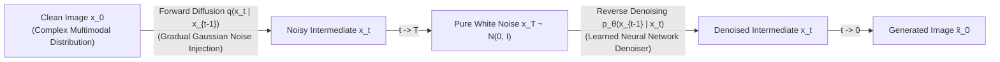
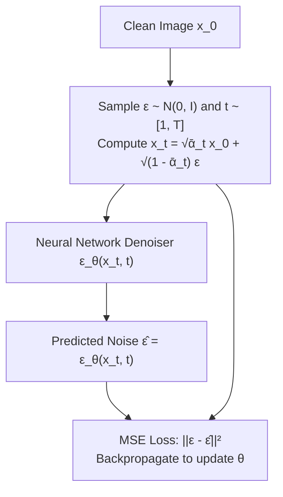
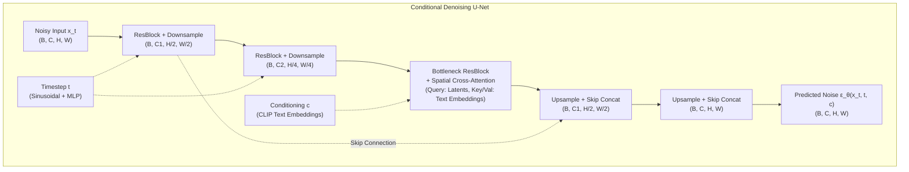
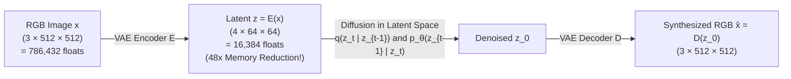
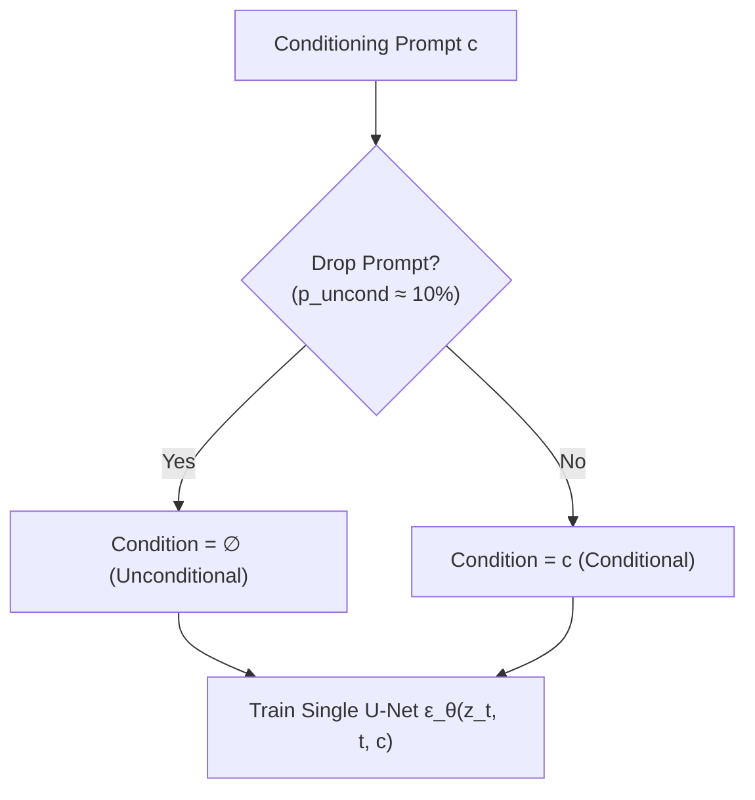
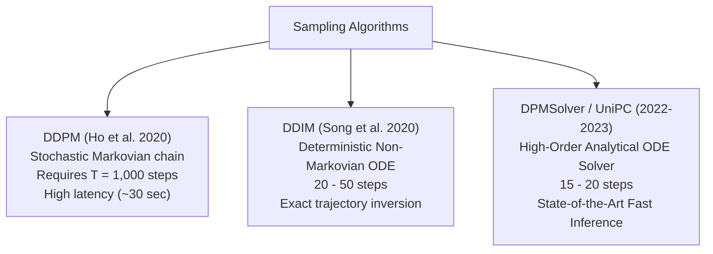

# Diffusion Models — Forward/Reverse SDEs, DDPM, U-Net, Latent Diffusion & Classifier-Free Guidance

!!! info "Prerequisites"
    Multivariate Gaussian distributions, Markov chains, Bayes' theorem, variational inference (ELBO), and convolutional / attention networks. Review [Transformer Architecture & Mechanics](../09-transformers-llms/transformer-architecture-mechanics-deep-dive.md), [Neural Network Foundations](../06-deep-learning/neural-network-foundations-deep-dive.md), and [Probability & Statistics](../02-mathematics/probability-statistics-deep-dive.md).

---

## 1. The Big Picture: Non-Equilibrium Thermodynamics to Generative AI

Generative modeling seeks to sample high-dimensional data $\mathbf{x} \sim p_{\text{data}}(\mathbf{x})$ (e.g. photorealistic images, audio waveforms, molecular structures). Prior paradigms exhibited structural limitations:

- **Generative Adversarial Networks (GANs)**: Train a minimax game between Generator and Discriminator. Prone to **mode collapse**, training instability, and lack of density coverage.
- **Variational Autoencoders (VAEs)**: Optimize a variational lower bound (ELBO) over a single latent step. Prone to blurry samples due to injected prior assumptions and uncalibrated pixel MSE loss.
- **Autoregressive Models**: Generate pixels sequentially ($\mathcal{O}(H \times W)$ steps), which is computationally prohibitive for high-resolution images.

**Diffusion Probabilistic Models** ([Sohl-Dickstein et al., 2015](https://arxiv.org/abs/1503.03585); [Ho et al., DDPM, 2020](https://arxiv.org/abs/2006.11239)) frame generation as the **reversal of a physical diffusion process**. 



1. **Forward Process ($q$)**: Destroys structure by progressively injecting Gaussian noise over $T$ steps until the data becomes indistinguishable from pure isotropic white noise $\mathcal{N}(\mathbf{0}, \mathbf{I})$. This process has **no learnable parameters**.
2. **Reverse Process ($p_\theta$)**: A neural network (U-Net or Transformer) learns to invert the noise injection step-by-step, transforming pure Gaussian noise into realistic samples.

---

## 2. The Forward Diffusion Process (Noising)

### 2.1 The Markov Transition Kernel
Let $\mathbf{x}_0 \sim q(\mathbf{x}_0)$ be a clean data point. The forward process generates a sequence of increasingly corrupted latents $\mathbf{x}_1, \dots, \mathbf{x}_T$ according to a fixed variance schedule $\beta_1, \dots, \beta_T \in (0, 1)$:

$$
q(\mathbf{x}_1, \dots, \mathbf{x}_T \mid \mathbf{x}_0) = \prod_{t=1}^T q(\mathbf{x}_t \mid \mathbf{x}_{t-1})
$$

where each forward transition is a Gaussian distribution:

$$
q(\mathbf{x}_t \mid \mathbf{x}_{t-1}) = \mathcal{N}\left(\mathbf{x}_t; \, \sqrt{1 - \beta_t} \mathbf{x}_{t-1}, \, \beta_t \mathbf{I}\right)
$$

The factor $\sqrt{1 - \beta_t}$ prevents the overall variance of $\mathbf{x}_t$ from exploding as noise is repeatedly added.

---

### 2.2 Closed-Form Sampling at Arbitrary Timestep $t$

A crucial mathematical property of linear Gaussian transitions is that we do not need to iterate through $t$ sequential steps to generate $\mathbf{x}_t$. We can sample $\mathbf{x}_t$ directly in **closed form** conditioned on $\mathbf{x}_0$.

#### Theorem: Direct Marginal $q(\mathbf{x}_t \mid \mathbf{x}_0)$
Define:

$$
\alpha_t = 1 - \beta_t, \quad \bar{\alpha}_t = \prod_{s=1}^t \alpha_s
$$

Then:

$$
q(\mathbf{x}_t \mid \mathbf{x}_0) = \mathcal{N}\left( \mathbf{x}_t; \, \sqrt{\bar{\alpha}_t} \mathbf{x}_0, \, (1 - \bar{\alpha}_t) \mathbf{I} \right)
$$

$$
\mathbf{x}_t = \sqrt{\bar{\alpha}_t} \mathbf{x}_0 + \sqrt{1 - \bar{\alpha}_t} \boldsymbol{\epsilon}, \quad \text{where } \boldsymbol{\epsilon} \sim \mathcal{N}(\mathbf{0}, \mathbf{I})
$$

**Proof by Induction:**  
For $t = 1$:
$$\mathbf{x}_1 = \sqrt{\alpha_1} \mathbf{x}_0 + \sqrt{1 - \alpha_1} \boldsymbol{\epsilon}_0, \quad \text{where } \boldsymbol{\epsilon}_0 \sim \mathcal{N}(\mathbf{0}, \mathbf{I})$$
This matches $\bar{\alpha}_1 = \alpha_1$.

Assume the inductive hypothesis holds for $t - 1$:
$$\mathbf{x}_{t-1} = \sqrt{\bar{\alpha}_{t-1}} \mathbf{x}_0 + \sqrt{1 - \bar{\alpha}_{t-1}} \boldsymbol{\epsilon}_{t-2}$$

Now express $\mathbf{x}_t$ in terms of $\mathbf{x}_{t-1}$:
$$\mathbf{x}_t = \sqrt{\alpha_t} \mathbf{x}_{t-1} + \sqrt{1 - \alpha_t} \boldsymbol{\epsilon}_{t-1}$$

Substitute the induction hypothesis for $\mathbf{x}_{t-1}$:
$$\mathbf{x}_t = \sqrt{\alpha_t} \left( \sqrt{\bar{\alpha}_{t-1}} \mathbf{x}_0 + \sqrt{1 - \bar{\alpha}_{t-1}} \boldsymbol{\epsilon}_{t-2} \right) + \sqrt{1 - \alpha_t} \boldsymbol{\epsilon}_{t-1}$$
$$= \sqrt{\alpha_t \bar{\alpha}_{t-1}} \mathbf{x}_0 + \left( \sqrt{\alpha_t (1 - \bar{\alpha}_{t-1})} \boldsymbol{\epsilon}_{t-2} + \sqrt{1 - \alpha_t} \boldsymbol{\epsilon}_{t-1} \right)$$

Because $\boldsymbol{\epsilon}_{t-2}$ and $\boldsymbol{\epsilon}_{t-1}$ are independent standard normal random variables, the sum of two independent Gaussians $a \boldsymbol{\epsilon}_1 + b \boldsymbol{\epsilon}_2$ is distributed as $\mathcal{N}(\mathbf{0}, (a^2 + b^2)\mathbf{I})$.

Evaluate the combined variance:
$$\sigma_{\text{combined}}^2 = \left( \sqrt{\alpha_t (1 - \bar{\alpha}_{t-1})} \right)^2 + \left( \sqrt{1 - \alpha_t} \right)^2$$
$$= \alpha_t - \alpha_t \bar{\alpha}_{t-1} + 1 - \alpha_t = 1 - \alpha_t \bar{\alpha}_{t-1} = 1 - \bar{\alpha}_t$$

Therefore:
$$\mathbf{x}_t = \sqrt{\bar{\alpha}_t} \mathbf{x}_0 + \sqrt{1 - \bar{\alpha}_t} \boldsymbol{\epsilon}, \quad \boldsymbol{\epsilon} \sim \mathcal{N}(\mathbf{0}, \mathbf{I}) \quad \blacksquare$$

This closed form enables parallel training: during every iteration, we sample random timesteps $t \sim \text{Uniform}(1, T)$ independently for each batch item and compute $\mathbf{x}_t$ in $\mathcal{O}(1)$ operations.

---

## 3. The Reverse Process & Training Objective

### 3.1 The Tractable Posterior $q(\mathbf{x}_{t-1} \mid \mathbf{x}_t, \mathbf{x}_0)$

While the unconditional reverse distribution $q(\mathbf{x}_{t-1} \mid \mathbf{x}_t)$ is intractable (requiring integration over the entire data manifold), conditioning on clean image $\mathbf{x}_0$ renders the reverse step tractable via Bayes' rule:

$$
q(\mathbf{x}_{t-1} \mid \mathbf{x}_t, \mathbf{x}_0) = q(\mathbf{x}_t \mid \mathbf{x}_{t-1}, \mathbf{x}_0) \frac{q(\mathbf{x}_{t-1} \mid \mathbf{x}_0)}{q(\mathbf{x}_t \mid \mathbf{x}_0)} = \mathcal{N}\left( \mathbf{x}_{t-1}; \, \tilde{\boldsymbol{\mu}}_t(\mathbf{x}_t, \mathbf{x}_0), \, \tilde{\beta}_t \mathbf{I} \right)
$$

Expanding the Gaussians and completing the square yields:

$$
\tilde{\boldsymbol{\mu}}_t(\mathbf{x}_t, \mathbf{x}_0) = \frac{\sqrt{\bar{\alpha}_{t-1}} \beta_t}{1 - \bar{\alpha}_t} \mathbf{x}_0 + \frac{\sqrt{\alpha_t} (1 - \bar{\alpha}_{t-1})}{1 - \bar{\alpha}_t} \mathbf{x}_t
$$

$$
\tilde{\beta}_t = \frac{1 - \bar{\alpha}_{t-1}}{1 - \bar{\alpha}_t} \beta_t
$$

Now substitute our closed-form inversion for $\mathbf{x}_0 = \frac{1}{\sqrt{\bar{\alpha}_t}}\left( \mathbf{x}_t - \sqrt{1 - \bar{\alpha}_t} \boldsymbol{\epsilon} \right)$ into the posterior mean $\tilde{\boldsymbol{\mu}}_t$:

$$
\tilde{\boldsymbol{\mu}}_t = \frac{1}{\sqrt{\alpha_t}} \left( \mathbf{x}_t - \frac{\beta_t}{\sqrt{1 - \bar{\alpha}_t}} \boldsymbol{\epsilon} \right)
$$

This equation reveals a profound insight: **the only unknown quantity needed to compute the reverse transition mean $\tilde{\boldsymbol{\mu}}_t$ is the noise vector $\boldsymbol{\epsilon}$ injected into $\mathbf{x}_t$**!

---

### 3.2 The Simplified DDPM Objective

Instead of parameterizing a network to predict the clean image $\hat{\mathbf{x}}_0$ or the mean $\boldsymbol{\mu}_\theta$, Ho et al. (2020) trained a neural network $\boldsymbol{\epsilon}_\theta(\mathbf{x}_t, t)$ to predict the injected Gaussian noise $\boldsymbol{\epsilon}$.

The Variational Bound (ELBO) simplifies to a re-weighted Mean Squared Error loss:

$$
\mathcal{L}_{\text{simple}}(\theta) = \mathbb{E}_{t \sim [1, T], \, \mathbf{x}_0 \sim q(\mathbf{x}_0), \, \boldsymbol{\epsilon} \sim \mathcal{N}(\mathbf{0}, \mathbf{I})} \left[ \left\| \boldsymbol{\epsilon} - \boldsymbol{\epsilon}_\theta\left( \sqrt{\bar{\alpha}_t}\mathbf{x}_0 + \sqrt{1 - \bar{\alpha}_t}\boldsymbol{\epsilon}, \, t \right) \right\|^2 \right]
$$



---

## 4. Score-Based Perspective & Tweedie's Formula

[Song et al. (2020)](https://arxiv.org/abs/2011.13456) proved that DDPM is equivalent to estimating the **Stein score function** (the gradient of the log data probability density with respect to the input):

$$
\mathbf{s}(\mathbf{x}, t) = \nabla_{\mathbf{x}} \log p_t(\mathbf{x})
$$

### Connection Between Noise Prediction and Score Matching
By Tweedie's Formula for Gaussian variables, if $\mathbf{x}_t \sim \mathcal{N}(\sqrt{\bar{\alpha}_t} \mathbf{x}_0, (1 - \bar{\alpha}_t)\mathbf{I})$, the score of the marginal density is:

$$
\nabla_{\mathbf{x}_t} \log q(\mathbf{x}_t) = -\frac{\mathbf{x}_t - \sqrt{\bar{\alpha}_t} \mathbb{E}[\mathbf{x}_0 \mid \mathbf{x}_t]}{1 - \bar{\alpha}_t} = -\frac{\boldsymbol{\epsilon}}{\sqrt{1 - \bar{\alpha}_t}}
$$

Equating the predicted noise to the score estimator:

$$
\mathbf{s}_\theta(\mathbf{x}_t, t) = -\frac{\boldsymbol{\epsilon}_\theta(\mathbf{x}_t, t)}{\sqrt{1 - \bar{\alpha}_t}}
$$

Predicting noise $\boldsymbol{\epsilon}_\theta$ is mathematically equivalent to estimating the vector field pointing toward regions of higher data probability on the manifold.

---

## 5. The Neural Backbone: U-Net & Conditioning

The denoising network must satisfy $\boldsymbol{\epsilon}_\theta: \mathbb{R}^{C \times H \times W} \times \mathbb{R} \to \mathbb{R}^{C \times H \times W}$, preserving spatial dimensions identically.



### Key Architectural Elements
1. **Sinusoidal Timestep Embeddings**: Analogous to Transformer position embeddings, scalar timestep $t \in [1, 1000]$ is mapped to a continuous vector via geometric frequencies:
   $$\text{emb}_{(2i)} = \sin\left(\frac{t}{10000^{2i/d}}\right), \quad \text{emb}_{(2i+1)} = \cos\left(\frac{t}{10000^{2i/d}}\right)$$
   Passed through a 2-layer MLP and injected into every residual block via feature-wise affine modulation (AdaGN).

2. **Skip Connections**: Direct high-resolution tensor pathways between encoder and decoder preserve fine spatial details.
3. **Cross-Attention Conditioning**: Spatial latent features query prompt token representations produced by a frozen text encoder (CLIP ViT-L/14 or T5-XXL).

---

## 6. Latent Diffusion Models (Stable Diffusion)

Direct pixel diffusion on high-resolution images ($1024 \times 1024 \times 3$) is computationally prohibitive: training costs scale quadratically with pixel resolution.

[Rombach et al. (2022)](https://arxiv.org/abs/2112.10752) introduced **Latent Diffusion Models (LDMs)**, separating the generation problem into two distinct phases:



### 1. Perceptual Compression (Stage 1)
A Variational Autoencoder (VAE) trained with perceptual (LPIPS) and adversarial loss compresses high-frequency imperceptible pixel noise into a low-dimensional latent space:

$$
\mathbf{z} = \mathcal{E}(\mathbf{x}) \in \mathbb{R}^{4 \times \frac{H}{8} \times \frac{W}{8}}
$$

Spatial dimensions are downscaled by factor $f = 8$. Spatial resolution collapses from $512 \times 512$ to $64 \times 64$, reducing compute operations by **$64\times$**.

### 2. Latent Diffusion (Stage 2)
The diffusion process operates strictly within the compact continuous latent space:

$$
\mathcal{L}_{\text{LDM}}(\theta) = \mathbb{E}_{\mathcal{E}(\mathbf{x}), \, \boldsymbol{\epsilon}, \, t} \left[ \left\| \boldsymbol{\epsilon} - \boldsymbol{\epsilon}_\theta(\mathbf{z}_t, \, t, \, \tau_\theta(y)) \right\|^2 \right]
$$

where $\tau_\theta(y)$ is the text conditioning representation.

---

## 7. Conditioning & Classifier-Free Guidance (CFG)

Text-conditioned diffusion $p_\theta(\mathbf{x}_{t-1} \mid \mathbf{x}_t, c)$ often produces samples that ignore complex prompt instructions.

[Ho & Salimans (2021)](https://arxiv.org/abs/2207.12598) introduced **Classifier-Free Guidance (CFG)**, eliminating the need for an external classifier network by training a single model on both conditional and unconditional generation.



### Mathematical Formulation
During inference, evaluate the network twice at each timestep:

1. Conditional prediction: $\boldsymbol{\epsilon}_\theta(\mathbf{x}_t, t, c)$
2. Unconditional prediction: $\boldsymbol{\epsilon}_\theta(\mathbf{x}_t, t, \emptyset)$

The guided noise prediction $\tilde{\boldsymbol{\epsilon}}_\theta$ extrapolates away from the unconditional baseline in the direction of the prompt:

$$
\tilde{\boldsymbol{\epsilon}}_\theta(\mathbf{x}_t, t, c) = \boldsymbol{\epsilon}_\theta(\mathbf{x}_t, t, \emptyset) + s \cdot \left( \boldsymbol{\epsilon}_\theta(\mathbf{x}_t, t, c) - \boldsymbol{\epsilon}_\theta(\mathbf{x}_t, t, \emptyset) \right)
$$

where $s \ge 1$ is the **guidance scale** (typically $s \in [7.0, 8.5]$).

- When $s = 1.0$: Standard conditional sampling without guidance.
- When $s > 1.0$: Strongly amplifies tokens matching condition $c$ while driving down probability mass for off-prompt modes.

---

## 8. Schedulers & Sampling Algorithms

The reverse process generates images by sampling backwards from $t = T \to 0$.



- **DDPM**: Samples with random Gaussian noise injection at every step:
  $$\mathbf{x}_{t-1} = \frac{1}{\sqrt{\alpha_t}} \left( \mathbf{x}_t - \frac{\beta_t}{\sqrt{1 - \bar{\alpha}_t}} \boldsymbol{\epsilon}_\theta(\mathbf{x}_t, t) \right) + \sigma_t \mathbf{z}, \quad \mathbf{z} \sim \mathcal{N}(\mathbf{0}, \mathbf{I})$$

- **DDIM (Denoising Diffusion Implicit Models)**: Formulates reverse diffusion as an ordinary differential equation (ODE) with zero variance ($\sigma_t = 0$):
  $$\mathbf{x}_{t-1} = \sqrt{\bar{\alpha}_{t-1}} \left( \frac{\mathbf{x}_t - \sqrt{1 - \bar{\alpha}_t}\boldsymbol{\epsilon}_\theta}{\sqrt{\bar{\alpha}_t}} \right) + \sqrt{1 - \bar{\alpha}_{t-1}} \boldsymbol{\epsilon}_\theta$$
  Enables deterministic generation in $20-50$ steps and exact image inversion (encoding images back into noise for editing).

---

## 9. Complete PyTorch Implementation from Scratch

Below is a self-contained implementation of a 1D Diffusion Model featuring:

- **Linear Beta Variance Schedule & Closed-Form Forward Noising**.
- **Sinusoidal Timestep Embedding**.
- **1D Residual Denoising MLP Network**.
- **Complete Reverse DDPM Sampling Loop**.

```python
import math
from typing import Tuple
import torch
import torch.nn as nn
import torch.nn.functional as F


# =====================================================================
# 1. Variance Schedule & Forward Diffusion Engine
# =====================================================================

class GaussianDiffusion1D:
    """Handles forward noising and reverse sampling math."""

    def __init__(self, timesteps: int = 200, beta_start: float = 1e-4, beta_end: float = 0.02):
        self.timesteps = timesteps

        # Linear beta schedule
        self.betas = torch.linspace(beta_start, beta_end, timesteps, dtype=torch.float32)
        self.alphas = 1.0 - self.betas
        self.alphas_cumprod = torch.cumprod(self.alphas, dim=0)
        self.alphas_cumprod_prev = F.pad(self.alphas_cumprod[:-1], (1, 0), value=1.0)

        # Precompute sampling coefficients
        self.sqrt_alphas_cumprod = torch.sqrt(self.alphas_cumprod)
        self.sqrt_one_minus_alphas_cumprod = torch.sqrt(1.0 - self.alphas_cumprod)
        self.sqrt_recip_alphas = torch.sqrt(1.0 / self.alphas)

        # Posterior variance: beta_tilde = beta * (1 - alpha_bar_{t-1}) / (1 - alpha_bar_t)
        self.posterior_variance = (
            self.betas * (1.0 - self.alphas_cumprod_prev) / (1.0 - self.alphas_cumprod)
        )

    def q_sample(self, x_0: torch.Tensor, t: torch.Tensor, noise: torch.Tensor) -> torch.Tensor:
        """Sample x_t at arbitrary timestep t in closed form: x_t = sqrt(alpha_bar_t)*x_0 + sqrt(1 - alpha_bar_t)*noise."""
        sqrt_alpha_bar = self.sqrt_alphas_cumprod[t].view(-1, 1)
        sqrt_one_minus_alpha_bar = self.sqrt_one_minus_alphas_cumprod[t].view(-1, 1)
        return sqrt_alpha_bar * x_0 + sqrt_one_minus_alpha_bar * noise

    @torch.no_grad()
    def p_sample(self, model: nn.Module, x_t: torch.Tensor, t_index: int) -> torch.Tensor:
        """Execute one reverse denoising step: p(x_{t-1} | x_t)."""
        t = torch.full((x_t.shape[0],), t_index, dtype=torch.long, device=x_t.device)
        pred_noise = model(x_t, t)

        beta_t = self.betas[t_index]
        sqrt_recip_alpha_t = self.sqrt_recip_alphas[t_index]
        sqrt_one_minus_alpha_bar_t = self.sqrt_one_minus_alphas_cumprod[t_index]

        # Posterior mean formula
        model_mean = sqrt_recip_alpha_t * (x_t - (beta_t / sqrt_one_minus_alpha_bar_t) * pred_noise)

        if t_index == 0:
            return model_mean
        else:
            noise = torch.randn_like(x_t)
            variance = torch.sqrt(self.posterior_variance[t_index])
            return model_mean + variance * noise

    @torch.no_grad()
    def sample(self, model: nn.Module, shape: Tuple[int, int]) -> torch.Tensor:
        """Complete reverse generation loop from pure Gaussian noise."""
        model.eval()
        device = next(model.parameters()).device
        # Start from pure isotropic white noise x_T ~ N(0, I)
        x = torch.randn(shape, device=device)

        for t in reversed(range(self.timesteps)):
            x = self.p_sample(model, x, t)
        return x


# =====================================================================
# 2. Sinusoidal Timestep Embeddings & Denoiser Network
# =====================================================================

class SinusoidalTimeEmbedding(nn.Module):

    def __init__(self, dim: int):
        super().__init__()
        self.dim = dim

    def forward(self, t: torch.Tensor) -> torch.Tensor:
        half_dim = self.dim // 2
        freqs = torch.exp(-math.log(10000) * torch.arange(half_dim, dtype=torch.float32, device=t.device) / half_dim)
        args = t.unsqueeze(1).float() * freqs.unsqueeze(0)
        return torch.cat([torch.sin(args), torch.cos(args)], dim=-1)


class DenoisingMLP(nn.Module):
    """1D Denoiser Network with Residual Layers and Timestep Modulation."""

    def __init__(self, data_dim: int = 1, hidden_dim: int = 128, time_dim: int = 32):
        super().__init__()
        self.time_embed = nn.Sequential(
            SinusoidalTimeEmbedding(time_dim),
            nn.Linear(time_dim, hidden_dim),
            nn.SiLU(),
            nn.Linear(hidden_dim, hidden_dim),
        )

        self.in_proj = nn.Linear(data_dim, hidden_dim)

        self.block1 = nn.Sequential(
            nn.SiLU(),
            nn.Linear(hidden_dim, hidden_dim),
            nn.SiLU(),
            nn.Linear(hidden_dim, hidden_dim),
        )

        self.block2 = nn.Sequential(
            nn.SiLU(),
            nn.Linear(hidden_dim, hidden_dim),
            nn.SiLU(),
            nn.Linear(hidden_dim, hidden_dim),
        )

        self.out_proj = nn.Linear(hidden_dim, data_dim)

    def forward(self, x: torch.Tensor, t: torch.Tensor) -> torch.Tensor:
        t_emb = self.time_embed(t)
        h = self.in_proj(x) + t_emb
        h = h + self.block1(h)
        h = h + self.block2(h)
        return self.out_proj(h)


# =====================================================================
# 3. Demonstration & Verification Run
# =====================================================================

if __name__ == "__main__":
    torch.manual_seed(42)

    diffusion = GaussianDiffusion1D(timesteps=100)
    model = DenoisingMLP(data_dim=1, hidden_dim=64, time_dim=32)

    # Simulated batch: 8 1D points sampled from a bimodal Gaussian mixture centered at -3.0 and +3.0
    x_0 = torch.tensor([[-3.1], [-2.9], [-3.0], [-2.8], [3.1], [3.0], [2.9], [3.2]])
    t = torch.tensor([10, 25, 50, 75, 10, 25, 50, 75])
    noise = torch.randn_like(x_0)

    # 1. Forward Noising
    x_t = diffusion.q_sample(x_0, t, noise)
    print(f"Clean samples x_0:      {x_0[:2].squeeze().tolist()}")
    print(f"Noised samples x_t:     {x_t[:2].squeeze().tolist()}")

    # 2. Denoiser Prediction & Loss Evaluation
    pred_noise = model(x_t, t)
    loss = F.mse_loss(pred_noise, noise)
    print(f"Training MSE loss:      {loss.item():.4f}")

    # 3. Reverse Sampling Generation
    generated_samples = diffusion.sample(model, shape=(4, 1))
    print(f"Generated samples shape: {generated_samples.shape}")
    print(f"Generated sample values: {generated_samples.squeeze().tolist()}")

    print("\nDiffusion Model implementation verified successfully!")
```

---

## 10. Common Errors & Debugging Guide

### 1. The VAE Scaling Factor Omission in Latent Diffusion
- **Symptom**: Generated images contain severe high-frequency color artifacts, checkerboard patterns, or grayscale saturation when decoded with the VAE.
- **Root Cause**: The pretrained VAE encoder does not produce unit variance latents ($\text{Var}(\mathcal{E}(\mathbf{x})) \approx \frac{1}{0.18215^2} \approx 30$). If the diffusion model is trained without scaling the latents by $0.18215$, the standard normal noise schedule $\mathcal{N}(\mathbf{0}, \mathbf{I})$ fails to destroy signal variance at step $T$.
- **Fix**: Always multiply by the scaling factor before diffusion, and divide before decoding:
```python
# Encoding into latent diffusion
latents = vae.encode(image).latent_dist.sample() * 0.18215

# Decoding to image
image = vae.decode(latents / 0.18215).sample
```

---

### 2. Timestep Index Off-By-One in Reverse Sampling
- **Symptom**: Reverse sampling diverges at step 0; NaN values or extreme contrast blowouts.
- **Root Cause**: Adding noise $\sigma_t \mathbf{z}$ at $t = 0$. At step $t = 0$, generation should output the clean deterministic expectation $\boldsymbol{\mu}_0$. Injecting noise at $t = 0$ corrupts the final image.
- **Fix**: Explicitly check `if t == 0: return model_mean`.

---

### 3. CFG Oversaturation & Contrast Burn
- **Symptom**: Generated images look severely "fried", with oversaturated primary colors and halo outlines.
- **Root Cause**: Setting Classifier-Free Guidance scale too high ($s > 15$). Extreme scaling pushes latent logits beyond the VAE decoder's dynamic range $[-1, 1]$.
- **Fix**: Use dynamic thresholding (rescaling latents to stay within their $99.5\text{th}$ percentile) or maintain $s \in [7.0, 9.0]$.

---

## 11. Staff-Level Technical Interview Questions

### Q1: Prove the closed-form forward sampling equation $\mathbf{x}_t = \sqrt{\bar{\alpha}_t}\mathbf{x}_0 + \sqrt{1 - \bar{\alpha}_t}\boldsymbol{\epsilon}$ from the Markov transition $q(\mathbf{x}_t \mid \mathbf{x}_{t-1})$.

**Model Answer:**  
The transition is $\mathbf{x}_t = \sqrt{\alpha_t}\mathbf{x}_{t-1} + \sqrt{1 - \alpha_t}\boldsymbol{\epsilon}_{t-1}$, where $\alpha_t = 1 - \beta_t$ and $\boldsymbol{\epsilon}_{t-1} \sim \mathcal{N}(\mathbf{0}, \mathbf{I})$.  
Expanding recursively:
$$\mathbf{x}_{t-1} = \sqrt{\alpha_{t-1}}\mathbf{x}_{t-2} + \sqrt{1 - \alpha_{t-1}}\boldsymbol{\epsilon}_{t-2}$$
Substitute $\mathbf{x}_{t-1}$ into $\mathbf{x}_t$:
$$\mathbf{x}_t = \sqrt{\alpha_t}\left( \sqrt{\alpha_{t-1}}\mathbf{x}_{t-2} + \sqrt{1 - \alpha_{t-1}}\boldsymbol{\epsilon}_{t-2} \right) + \sqrt{1 - \alpha_t}\boldsymbol{\epsilon}_{t-1}$$
$$= \sqrt{\alpha_t \alpha_{t-1}}\mathbf{x}_{t-2} + \left( \sqrt{\alpha_t(1 - \alpha_{t-1})}\boldsymbol{\epsilon}_{t-2} + \sqrt{1 - \alpha_t}\boldsymbol{\epsilon}_{t-1} \right)$$
Because $\boldsymbol{\epsilon}_{t-2}, \boldsymbol{\epsilon}_{t-1} \sim \mathcal{N}(\mathbf{0}, \mathbf{I})$ are independent, their linear combination has variance:
$$\sigma^2 = \left(\sqrt{\alpha_t(1 - \alpha_{t-1})}\right)^2 + \left(\sqrt{1 - \alpha_t}\right)^2 = \alpha_t - \alpha_t \alpha_{t-1} + 1 - \alpha_t = 1 - \alpha_t \alpha_{t-1}$$
By induction across all $t$ steps, let $\bar{\alpha}_t = \prod_{s=1}^t \alpha_s$:
$$\mathbf{x}_t = \sqrt{\bar{\alpha}_t}\mathbf{x}_0 + \sqrt{1 - \bar{\alpha}_t}\boldsymbol{\epsilon}, \quad \boldsymbol{\epsilon} \sim \mathcal{N}(\mathbf{0}, \mathbf{I})$$

---

### Q2: Why did DDPM parameterize the network to predict noise $\boldsymbol{\epsilon}$ rather than the clean image $\mathbf{x}_0$ directly?

**Model Answer:**  

1. **Connection to Score Matching**: As shown by Song et al., predicting noise is equivalent to estimating the Stein score $\nabla_\mathbf{x} \log p(\mathbf{x})$. Predicting $\boldsymbol{\epsilon}$ models the direction towards high-probability regions of the data manifold.
2. **Loss Landscape & Multi-frequency Dynamics**: If predicting $\mathbf{x}_0$ directly at high timesteps $t \approx T$ (where $\mathbf{x}_T$ is nearly pure noise), the $L_2$ loss forces the network to predict the conditional expectation $\mathbb{E}[\mathbf{x}_0 \mid \mathbf{x}_T]$, which is the blurry average of all images in the training set. Predicting $\boldsymbol{\epsilon}$ normalizes the target distribution: the noise is always zero-mean and unit-variance across all timesteps $t$, preventing the regression loss from collapsing early training dynamics towards blurry mean modes.
3. Ho et al. empirically proved that predicting $\boldsymbol{\epsilon}$ yields vastly superior FID scores compared to predicting $\mathbf{x}_0$ or the posterior mean $\tilde{\boldsymbol{\mu}}_t$.

---

### Q3: Derive Classifier-Free Guidance (CFG). Why does extrapolating between conditional and unconditional scores improve text fidelity?

**Model Answer:**  
By Bayes' rule, the conditional score can be decomposed as:
$$\nabla_{\mathbf{x}_t} \log p(\mathbf{x}_t \mid c) = \nabla_{\mathbf{x}_t} \log p(\mathbf{x}_t) + \nabla_{\mathbf{x}_t} \log p(c \mid \mathbf{x}_t)$$
Where $\nabla_{\mathbf{x}_t} \log p(c \mid \mathbf{x}_t)$ is the classifier gradient pushing the sample toward the class label.  
In classifier-guided diffusion, an external classifier guides sampling with scale $\gamma$:
$$\tilde{\nabla} = \nabla_{\mathbf{x}_t} \log p(\mathbf{x}_t) + \gamma \nabla_{\mathbf{x}_t} \log p(c \mid \mathbf{x}_t)$$
Substitute $\nabla_{\mathbf{x}_t} \log p(c \mid \mathbf{x}_t) = \nabla_{\mathbf{x}_t} \log p(\mathbf{x}_t \mid c) - \nabla_{\mathbf{x}_t} \log p(\mathbf{x}_t)$:
$$\tilde{\nabla} = \nabla_{\mathbf{x}_t} \log p(\mathbf{x}_t) + \gamma \left( \nabla_{\mathbf{x}_t} \log p(\mathbf{x}_t \mid c) - \nabla_{\mathbf{x}_t} \log p(\mathbf{x}_t) \right)$$
Using the score-noise relationship $\mathbf{s} \propto -\boldsymbol{\epsilon}$:
$$\tilde{\boldsymbol{\epsilon}}_\theta(\mathbf{x}_t, c) = \boldsymbol{\epsilon}_\theta(\mathbf{x}_t, \emptyset) + s \cdot \left( \boldsymbol{\epsilon}_\theta(\mathbf{x}_t, c) - \boldsymbol{\epsilon}_\theta(\mathbf{x}_t, \emptyset) \right)$$
When $s > 1$, the model sharpens the probability density around modes strongly conditioned on $c$, effectively trading sample diversity for prompt adherence and visual fidelity.

---

### Q4: Explain how Latent Diffusion Models (LDMs) achieve a $64\times$ reduction in computational operations without sacrificing high-frequency perceptual fidelity.

**Model Answer:**  
Natural images contain two distinct regimes of information:

1. **Perceptual Compression**: High-frequency details (individual pores, hair strands, imperceptible sensor noise) that contribute little to semantic understanding.
2. **Semantic / Conceptual Content**: Global object layouts, geometry, lighting, and relations.  
Pixel-space diffusion wastes over $90\%$ of its capacity modeling stochastic high-frequency pixel variations.  
LDM decouples these stages:

- A pretrained VAE performs perceptual downsampling by a factor of $f = 8$, reducing spatial dimensions from $512 \times 512$ to $64 \times 64$.
- The number of spatial tokens processed by self-attention layers in the U-Net drops from $(512/8)^2 = 4096$ to $(64/8)^2 = 64$. Because attention is quadratic in spatial resolution, attention operations drop by $(64)^2 = 4096\times$, and total FLOPs decrease by $64\times$.
- The VAE decoder then reconstructs high-frequency textures in a single deterministic pass.

---

### Q5: Contrast DDPM and DDIM sampling. Why can DDIM sample images in 20 steps while DDPM requires 1,000 steps?

**Model Answer:**  

- **DDPM**: The reverse process is strictly **Markovian**: $p_\theta(\mathbf{x}_{t-1} \mid \mathbf{x}_t)$ requires adding stochastic Gaussian noise $\sigma_t \mathbf{z}$ at every step. If you skip steps (e.g. jumping from $t=100$ to $t=50$), the accumulated variance violates the Markov assumption, resulting in blurry, degraded outputs. Hence DDPM requires small steps ($T=1000$).
- **DDIM**: Observes that the marginal distributions $q(\mathbf{x}_t \mid \mathbf{x}_0)$ depend only on $\mathbf{x}_0$, not on the Markovian assumption. Song et al. constructed a family of **non-Markovian forward processes** that share the exact same marginals $q(\mathbf{x}_t \mid \mathbf{x}_0)$ as DDPM. Setting the forward noise variance to zero ($\sigma_t = 0$) turns the reverse process into a **deterministic Ordinary Differential Equation (ODE)**. Because ODE trajectories are smooth and continuous, higher-order numerical solvers can take large discrete steps ($20-50$ steps) along the trajectory without accumulating random walk variance drift.

---

## 12. Mastery Ladder

- [ ] **L1:** Formulate the Gaussian transition kernel $q(\mathbf{x}_t \mid \mathbf{x}_{t-1})$ in the forward diffusion process.
- [ ] **L2:** Prove the closed-form sampling formula $\mathbf{x}_t = \sqrt{\bar{\alpha}_t}\mathbf{x}_0 + \sqrt{1 - \bar{\alpha}_t}\boldsymbol{\epsilon}$ by induction.
- [ ] **L3:** Derive the posterior mean $\tilde{\boldsymbol{\mu}}_t$ and explain why predicting noise $\boldsymbol{\epsilon}$ suffices for denoising.
- [ ] **L4:** Write the simplified DDPM MSE loss function $\mathcal{L}_{\text{simple}}(\theta)$.
- [ ] **L5:** Explain the relationship between noise prediction $\boldsymbol{\epsilon}_\theta$ and the Stein score $\nabla_\mathbf{x} \log p(\mathbf{x})$.
- [ ] **L6:** Describe how sinusoidal timestep embeddings are injected into U-Net residual blocks.
- [ ] **L7:** Explain the two stages of Latent Diffusion Models and calculate the compute reduction factor.
- [ ] **L8:** Derive the Classifier-Free Guidance (CFG) equation and explain the role of guidance scale $s$.
- [ ] **L9:** Contrast the stochastic Markovian sampling of DDPM with the deterministic ODE sampling of DDIM.
- [ ] **L10:** Implement a functional 1D diffusion model with forward schedule, U-Net/MLP denoiser, and reverse sampling loop in PyTorch.
