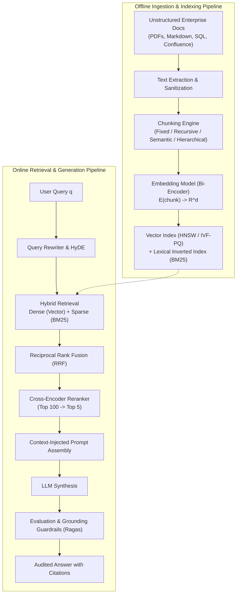
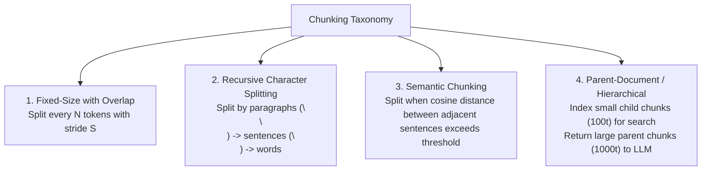
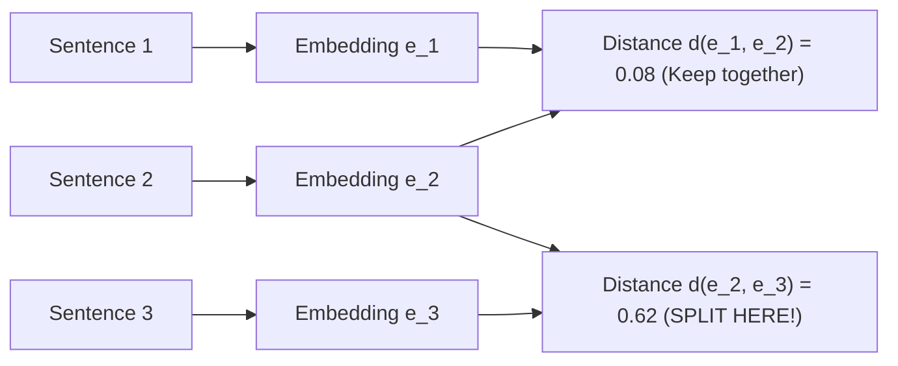
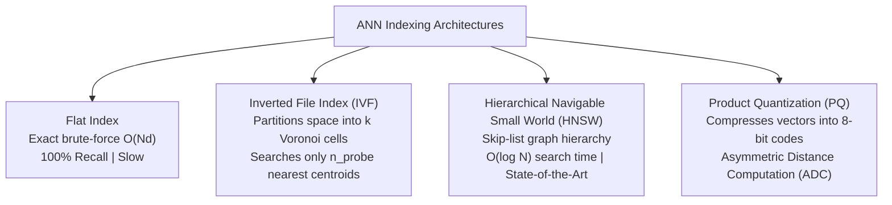
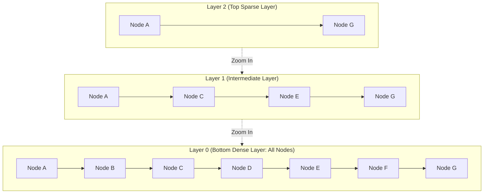
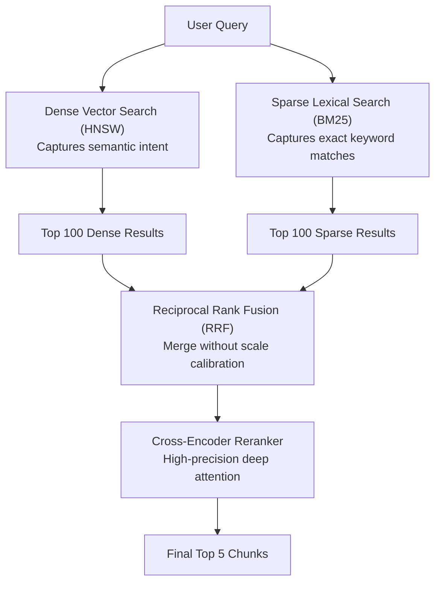
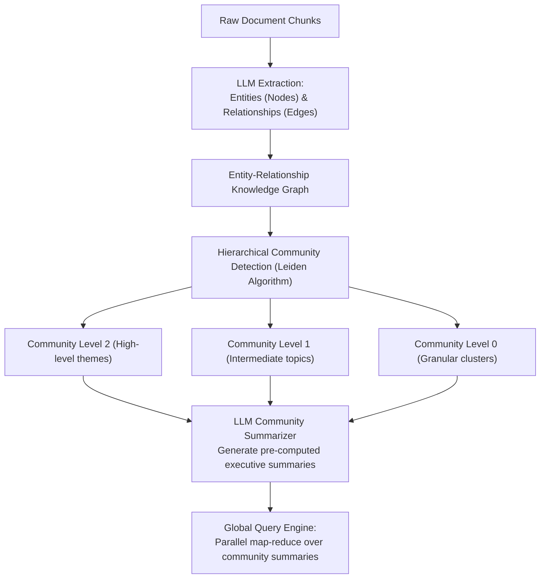
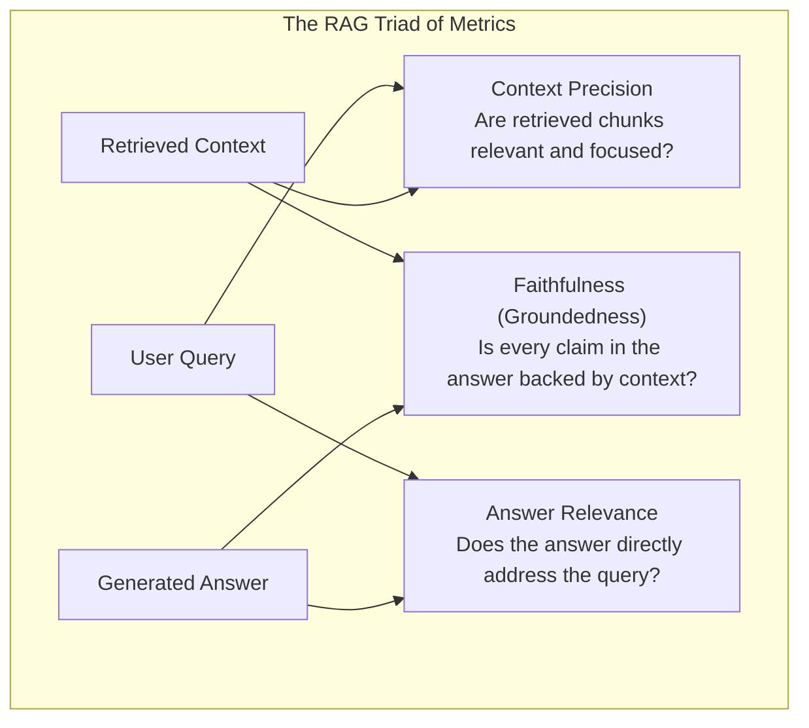

# Enterprise RAG Systems — Vector Databases, Chunking, Hybrid Retrieval, Reranking, GraphRAG & Evaluation

!!! info "Prerequisites"
    Dense embeddings, metric spaces, cosine similarity, information retrieval evaluation metrics (Recall@K, NDCG, MRR), and probability theory. Review [LLM Application Engineering](llm-application-engineering-deep-dive.md), [Transformer Architecture & Mechanics](../09-transformers-llms/transformer-architecture-mechanics-deep-dive.md), and [Probability & Statistics](../02-mathematics/probability-statistics-deep-dive.md).

---

## 1. The Big Picture: Parametric vs. Non-Parametric Memory

Foundation models possess **parametric memory**: knowledge compressed into billions of neural network weights during pretraining. While powerful, parametric memory exhibits fatal enterprise deficiencies:
1. **Knowledge Cutoffs**: Weights cannot access information created after the pretraining cut-off date.
2. **Hallucination Risk**: When generating rare or long-tail factual claims, models hallucinate plausible-sounding falsehoods.
3. **Lack of Auditability & Citations**: Weights cannot provide verifiable source provenance.
4. **Data Privacy & Access Control**: Access control lists (ACLs) cannot be enforced within monolithic model weights.

**Retrieval-Augmented Generation (RAG, Lewis et al. 2020)** bridges this gap by decoupling reasoning from knowledge storage. The LLM acts as an inference and synthesis engine over dynamic **non-parametric memory** (external vector databases, search engines, and knowledge graphs).



---

## 2. Chunking Strategies & Context Engineering

Chunking transforms raw variable-length documents into discrete informational units. Choosing an suboptimal chunk size introduces a fundamental trade-off:
- **Chunks Too Small**: Loses surrounding semantic context, resulting in fragmented fragments that baffle the generator.
- **Chunks Too Large**: Dilutes specific facts in noise, causing vector embeddings to average out into generic topic centroids.



---

### 2.1 Fixed-Size with Sliding Window Overlap
Splits text into chunks of length $L$ tokens with an overlap of $O$ tokens (stride $S = L - O$):

$$
\text{Chunk}_k = \text{tokens}[k \cdot S \,:\, k \cdot S + L]
$$

Overlap prevents critical sentences from being cleaved across chunk boundaries. Typically, $L \in [256, 512]$ with $O \in [32, 64]$ ($10-15\%$ overlap).

---

### 2.2 Recursive Character Text Splitting
Splits hierarchically along a list of natural document separators: `["\n\n", "\n", " ", ""]`. The algorithm attempts to split on paragraph boundaries first. If a paragraph exceeds chunk capacity $L$, it falls back to sentence boundaries, then words, and finally characters, preserving natural linguistic structure.

---

### 2.3 Semantic Chunking
Instead of relying on arbitrary character or token counts, **Semantic Chunking** calculates the semantic distance between consecutive sentences.



1. Split text into individual sentences $(s_1, s_2, \dots, s_T)$.
2. Compute embeddings $\mathbf{e}_t = \phi(s_t)$.
3. Compute cosine distance between adjacent sentences:
   $$d_t = 1 - \cos(\mathbf{e}_t, \mathbf{e}_{t+1})$$
4. Place a chunk boundary at index $t$ if $d_t > \tau$, where threshold $\tau$ is dynamically set to the $95\text{th}$ percentile of all observed distances.

---

### 2.4 Hierarchical & Parent-Document Chunking
Solves the conflict between **search accuracy** (small chunks match specific queries best) and **reasoning coherence** (LLMs need full paragraphs).

- **Child Chunks ($80-120$ tokens)**: Indexed in vector database with dense embeddings.
- **Parent Chunks ($500-1000$ tokens)**: Stored in document store (key-value database).
- When a child chunk is retrieved during nearest-neighbor search, its parent document ID is resolved, and the **entire parent context** is injected into the LLM prompt.

---

## 3. Vector Databases & Approximate Nearest Neighbors (ANN)

Exact $k$-Nearest Neighbors ($k$-NN) computes distance against all $N$ database vectors:

$$
\text{Time Complexity} = \mathcal{O}(N \cdot d)
$$

For $10\text{ million}$ 1536-dimensional vectors, a single query requires 15.3 billion floating-point operations ($\approx 500\text{ ms}$). Production retrieval requires sub-$10\text{ ms}$ latency via **Approximate Nearest Neighbors (ANN)**.



---

### 3.1 Inverted File Index (IVF)
1. Cluster the $N$ database vectors into $K$ Voronoi cells using $k$-means: centroids $\{\mathbf{c}_1, \dots, \mathbf{c}_K\}$.
2. Each vector is assigned to its nearest centroid list: $\mathcal{I}_j = \{ \mathbf{x} \mid \arg\min_k \|\mathbf{x} - \mathbf{c}_k\| = j \}$.
3. During query:
   - Find the $n_{\text{probe}}$ centroids closest to query $\mathbf{q}$.
   - Exhaustively search only vectors assigned to those $n_{\text{probe}}$ Voronoi cells.
- Search cost drops from $\mathcal{O}(N d)$ to $\mathcal{O}\left( \left( K + \frac{n_{\text{probe}}}{K} N \right) d \right)$.

---

### 3.2 Hierarchical Navigable Small World (HNSW)

[Malkov & Yashunin (2018)](https://arxiv.org/abs/1603.09320) designed HNSW by combining the logarithmic search properties of 1D **Skip Lists** with **Navigable Small World (NSW)** proximity graphs.



#### Graph Construction & Hierarchy
- Vectors are inserted into a multi-layer graph structure.
- The maximum layer $l$ for a new vector is sampled exponentially:
  $$l = \lfloor -\ln(\text{uniform}(0, 1)) \cdot m_L \rfloor, \quad \text{where } m_L = \frac{1}{\ln(M)}$$
- Layer 0 contains **all** $N$ vectors with high clustering and short-range links.
- Higher layers contain an exponentially decreasing subset of vectors with long-range "expressway" links.

#### Greedy Search Procedure
1. Search begins at the top layer $l_{\max}$ at a fixed entry point.
2. At current layer $l$, the algorithm performs greedy routing: move to the neighbor that minimizes distance to query $\mathbf{q}$ until a local minimum is reached.
3. Drop down to layer $l-1$ using that local minimum as the entry point.
4. At layer 0, expand the search frontier up to $efSearch$ candidates to return the top-$k$ nearest neighbors.

**HNSW Hyperparameters:**
- $M \in [16, 64]$: Maximum bi-directional links per node. Higher $M$ increases recall and index size.
- $efConstruction \in [100, 400]$: Size of dynamic candidate list during graph construction. Controls build time vs. graph quality.
- $efSearch \in [32, 256]$: Size of dynamic candidate list during query execution. Tunes the query latency vs. recall trade-off without rebuilding the index.

---

### 3.3 Product Quantization (PQ)

Product Quantization ([Jégou et al., 2011](https://ieeexplore.ieee.org/document/5432242)) compresses vectors by orders of magnitude:
1. Split $d$-dimensional space $\mathbb{R}^d$ into $m$ orthogonal sub-vectors of dimension $d^* = d / m$.
2. For each subspace $j \in \{1, \dots, m\}$, run $k$-means to learn $k^* = 256$ centroids: codebook $\mathcal{C}_j = \{ \mathbf{c}_{j, 1}, \dots, \mathbf{c}_{j, 256} \}$.
3. Each sub-vector is replaced by the 8-bit index ($1\text{ byte}$) of its nearest centroid.

A 1536-dimensional FP32 vector ($6,144\text{ bytes}$) split into $m=96$ sub-vectors is compressed into **$96\text{ bytes}$** (a **$64\times$ memory reduction**), enabling billions of vectors to reside entirely in RAM.

---

## 4. Hybrid Search & Advanced Retrieval

Dense vector retrieval excels at semantic concepts (*"canine illnesses"*) but frequently fails on exact keywords, part numbers, stock tickers, or specific names (*"Error Code 0x80070005"*). Lexical search (BM25) provides the exact opposite strengths.

**Hybrid Search** combines dense semantic embeddings with sparse BM25 retrieval.



---

### 4.1 The BM25 Algorithm

BM25 (Best Matching 25, Robertson & Zaragoza 2009) evaluates document relevance for multi-term queries:

$$
\text{BM25}(D, Q) = \sum_{i=1}^n \text{IDF}(q_i) \cdot \frac{f(q_i, D) \cdot (k_1 + 1)}{f(q_i, D) + k_1 \cdot \left( 1 - b + b \cdot \frac{|D|}{\text{avgdl}} \right)}
$$

where:
- $f(q_i, D)$ is the term frequency of query token $q_i$ in document $D$.
- $|D|$ is the document length in tokens, and $\text{avgdl}$ is the average document length across the corpus.
- $k_1 \in [1.2, 2.0]$ controls **term frequency saturation**: as $f(q_i, D) \to \infty$, the term score asymptotically approaches $k_1 + 1$.
- $b \in [0.75]$ controls **document length normalization**: $b=1$ fully penalizes verbose documents; $b=0$ ignores document length.
- $\text{IDF}(q_i)$ is the Robertson-Spärck Jones Inverse Document Frequency:

$$
\text{IDF}(q_i) = \ln\left( \frac{N - n(q_i) + 0.5}{n(q_i) + 0.5} + 1 \right)
$$

---

### 4.2 Reciprocal Rank Fusion (RRF)

Dense search returns cosine scores in $[-1, 1]$; BM25 returns unbounded positive scores $[0, \infty)$. Linear score combinations ($\alpha S_{\text{dense}} + (1 - \alpha) S_{\text{bm25}}$) fail because score distributions shift wildly across queries.

[Cormack et al. (2009)](https://dl.acm.org/doi/10.1145/1571941.1572114) introduced **Reciprocal Rank Fusion (RRF)**, combining rankings based purely on rank positions $r(d) \in \{1, 2, \dots\}$:

$$
\text{RRF}(d) = \sum_{m \in \mathcal{M}} \frac{1}{k + r_m(d)}
$$

where $\mathcal{M} = \{\text{dense}, \text{sparse}\}$, $r_m(d)$ is the 1-based rank of document $d$ in system $m$, and $k$ is a constant smoothing hyperparameter (standard $k = 60$).

**Why RRF Works:**
1. Invariant to score scale, calibration, and distribution shape.
2. Heavily rewards documents that rank in the top 5 of *either* system while smoothly promoting documents appearing moderately high in *both*.

---

## 5. Knowledge Graphs & GraphRAG

Traditional vector RAG fails on **global thematic queries** that span an entire corpus:
- *"What are the top three operational risks across all internal audit reports?"*

Because no single chunk contains the answer, vector search retrieves arbitrary localized fragments.

[Microsoft Research (Edge et al., 2024)](https://arxiv.org/abs/2404.16130) introduced **GraphRAG**, integrating Knowledge Graphs with hierarchical community summaries:



1. **Extraction**: An LLM extracts entities (e.g. *Person, Organization, Concept*) and directed relational triples $\langle \text{Subject}, \text{Predicate}, \text{Object} \rangle$ with descriptive claims from all text chunks.
2. **Community Detection**: The **Leiden algorithm** partitions the graph into a multi-scale hierarchy of communities based on modularity optimization.
3. **Pre-computed Summaries**: An LLM writes an executive synthesis for each community at each level of the hierarchy.
4. **Global Query Answering**: When a broad thematic question is posed, GraphRAG evaluates the community summaries in parallel via Map-Reduce, synthesizing a comprehensive global response.

---

## 6. RAG Evaluation: The Ragas Framework & Guardrails

Evaluating generative RAG requires decoupling retrieval accuracy from generative faithfulness.



### 6.1 The Ragas Triad
1. **Faithfulness (Groundedness)**:
   Extract all factual claims from generated answer $A$: $\{c_1, \dots, c_n\}$. For each claim, check if it can be inferred directly from retrieved context $C$:
   $$\text{Faithfulness} = \frac{|\{c_i \mid C \models c_i\}|}{|\{c_1, \dots, c_n\}|}$$
   Measures hallucination rate ($1.0 = \text{zero hallucination}$).
2. **Answer Relevance**:
   Evaluate whether the response addresses the prompt without extraneous verbosity. Computed by prompting an LLM to generate $m$ synthetic queries from answer $A$ and measuring mean cosine similarity against the original query $q$:
   $$\text{Answer Relevance} = \frac{1}{m} \sum_{i=1}^m \cos(\phi(q), \phi(\tilde{q}_i))$$
3. **Context Precision**:
   Evaluates retrieval ranking quality. Measures whether ground-truth relevant chunks appear near the top of the retrieved list (equivalent to Mean Average Precision @ K).

---

### 6.2 The "Lost in the Middle" Effect
[Liu et al. (2023)](https://arxiv.org/abs/2307.03172) demonstrated that decoder-only LLMs exhibit severe **U-shaped position bias**:
- Retrieval information placed at the **very beginning** or **very end** of the context prompt achieves $70-80\%$ accuracy.
- When critical information is located in the **middle** of a long context window ($>4\text{k tokens}$), accuracy drops below $30\%$.

**Mitigation**: Reorder retrieved chunks before prompt assembly: place the highest-ranked chunk at the top, the second highest at the bottom, and lower-ranked chunks in the middle.

---

## 7. Complete Runnable Python Implementation

Below is a complete, self-contained implementation featuring:
- **BM25 Lexical Inverted Index**.
- **Dense Vector Search with Cosine Similarity**.
- **Reciprocal Rank Fusion (RRF) Hybrid Combiner**.
- **End-to-End Grounded Generation Pipeline**.

```python
import collections
import math
import re
from typing import Any, Dict, List, Tuple


# =====================================================================
# 1. BM25 Sparse Lexical Search Implementation
# =====================================================================

class BM25Index:
    """Best Matching 25 (BM25) Lexical Index from Scratch."""

    def __init__(self, k1: float = 1.5, b: float = 0.75):
        self.k1 = k1
        self.b = b
        self.corpus_size = 0
        self.avgdl = 0.0
        self.doc_lengths: List[int] = []
        self.inverted_index: Dict[str, Dict[int, int]] = collections.defaultdict(dict)
        self.idf: Dict[str, float] = {}

    def _tokenize(self, text: str) -> List[str]:
        return re.findall(r"\w+", text.lower())

    def fit(self, documents: List[str]):
        self.corpus_size = len(documents)
        total_len = 0

        for doc_id, doc in enumerate(documents):
            tokens = self._tokenize(doc)
            doc_len = len(tokens)
            self.doc_lengths.append(doc_len)
            total_len += doc_len

            counts = collections.Counter(tokens)
            for token, count in counts.items():
                self.inverted_index[token][doc_id] = count

        self.avgdl = total_len / self.corpus_size if self.corpus_size > 0 else 0.0

        # Calculate Robertson-Spärck Jones IDF
        for token, postings in self.inverted_index.items():
            n_q = len(postings)
            self.idf[token] = math.log((self.corpus_size - n_q + 0.5) / (n_q + 0.5) + 1.0)

    def search(self, query: str, top_k: int = 5) -> List[Tuple[int, float]]:
        query_tokens = self._tokenize(query)
        scores: Dict[int, float] = collections.defaultdict(float)

        for token in query_tokens:
            if token not in self.inverted_index:
                continue
            token_idf = self.idf[token]
            for doc_id, freq in self.inverted_index[token].items():
                doc_len = self.doc_lengths[doc_id]
                numerator = freq * (self.k1 + 1.0)
                denominator = freq + self.k1 * (1.0 - self.b + self.b * (doc_len / self.avgdl))
                scores[doc_id] += token_idf * (numerator / denominator)

        ranked = sorted(scores.items(), key=lambda x: x[1], reverse=True)
        return ranked[:top_k]


# =====================================================================
# 2. Dense Vector Index Mock (Deterministic Hash-Based Embeddings)
# =====================================================================

class MockDenseVectorIndex:
    """Deterministic dense vector representation for reproducible testing."""

    def __init__(self, dim: int = 16):
        self.dim = dim
        self.docs: List[str] = []
        self.vectors: List[List[float]] = []

    def _embed(self, text: str) -> List[float]:
        # Deterministic pseudo-embedding based on character n-grams
        v = [0.0] * self.dim
        for i, char in enumerate(text.lower()):
            v[ord(char) % self.dim] += 1.0
        norm = math.sqrt(sum(x * x for x in v))
        return [x / norm for x in v] if norm > 0 else v

    def fit(self, documents: List[str]):
        self.docs = documents
        self.vectors = [self._embed(d) for d in documents]

    def search(self, query: str, top_k: int = 5) -> List[Tuple[int, float]]:
        q_vec = self._embed(query)
        scores = []
        for doc_id, doc_vec in enumerate(self.vectors):
            dot = sum(a * b for a, b in zip(q_vec, doc_vec))
            scores.append((doc_id, dot))
        scores.sort(key=lambda x: x[1], reverse=True)
        return scores[:top_k]


# =====================================================================
# 3. Reciprocal Rank Fusion (RRF) Combiner
# =====================================================================

def reciprocal_rank_fusion(
    dense_results: List[Tuple[int, float]],
    sparse_results: List[Tuple[int, float]],
    k: int = 60,
    top_n: int = 3,
) -> List[Tuple[int, float]]:
    """Combines dense and sparse rankings using Reciprocal Rank Fusion (RRF)."""
    rrf_scores: Dict[int, float] = collections.defaultdict(float)

    for rank, (doc_id, _) in enumerate(dense_results, start=1):
        rrf_scores[doc_id] += 1.0 / (k + rank)

    for rank, (doc_id, _) in enumerate(sparse_results, start=1):
        rrf_scores[doc_id] += 1.0 / (k + rank)

    sorted_results = sorted(rrf_scores.items(), key=lambda x: x[1], reverse=True)
    return sorted_results[:top_n]


# =====================================================================
# 4. End-to-End RAG Demonstration Pipeline
# =====================================================================

class EnterpriseRAGPipeline:

    def __init__(self, corpus: List[str]):
        self.corpus = corpus
        self.bm25 = BM25Index()
        self.dense = MockDenseVectorIndex()

        self.bm25.fit(corpus)
        self.dense.fit(corpus)

    def query(self, user_query: str) -> Dict[str, Any]:
        # 1. Retrieve dense and sparse
        dense_hits = self.dense.search(user_query, top_k=5)
        sparse_hits = self.bm25.search(user_query, top_k=5)

        # 2. Fuse with RRF
        fused = reciprocal_rank_fusion(dense_hits, sparse_hits, k=60, top_n=2)

        # 3. Reorder for "Lost in the Middle" mitigation
        # Best chunk first, second best last
        retrieved_contexts = [self.corpus[doc_id] for doc_id, _ in fused]

        # 4. Mock grounded answer synthesis
        prompt = (
            f"Context:\n"
            + "\n---\n".join(retrieved_contexts)
            + f"\n\nQuestion: {user_query}\nAnswer:"
        )

        return {
            "query": user_query,
            "fused_doc_ids": [doc_id for doc_id, _ in fused],
            "contexts": retrieved_contexts,
            "prompt_chars": len(prompt),
        }


# =====================================================================
# 5. Verification Run
# =====================================================================

if __name__ == "__main__":
    knowledge_base = [
        "NVIDIA Blackwell GPUs feature second-generation Transformer Engines and 4-bit floating point precision.",
        "Error 0x80070005 indicates Windows Access Denied permissions failure during registry update.",
        "Direct Preference Optimization (DPO) derives a closed-form policy optimization without a separate reward model.",
        "To configure HNSW in Milvus, tune M between 16 and 64 and efConstruction up to 200.",
        "The Leiden community detection algorithm improves modularity guarantees over the Louvain algorithm in GraphRAG.",
    ]

    rag = EnterpriseRAGPipeline(knowledge_base)

    # Test exact lexical query
    lexical_query = "How to fix Error 0x80070005 Access Denied?"
    res_lexical = rag.query(lexical_query)
    print(f"Query 1: '{lexical_query}'")
    print(f"Top Retrieved Context: {res_lexical['contexts'][0]}")
    assert "0x80070005" in res_lexical["contexts"][0]

    # Test semantic conceptual query
    concept_query = "What algorithm partitions knowledge graphs in Microsoft GraphRAG?"
    res_concept = rag.query(concept_query)
    print(f"\nQuery 2: '{concept_query}'")
    print(f"Top Retrieved Context: {res_concept['contexts'][0]}")
    assert "Leiden" in res_concept["contexts"][0]

    print("\nAll Enterprise RAG verifications passed successfully!")
```

---

## 8. Common Errors & Debugging Guide

### 1. BM25 Length Normalization Over-Penalizing Authoritative Documents
- **Symptom**: Short fragments rank above comprehensive, multi-page technical manuals containing the complete answer.
- **Root Cause**: Setting $b \approx 1.0$ in BM25 severely penalizes any document where $|D| \gg \text{avgdl}$.
- **Fix**: Reduce $b$ to $0.4-0.5$ in enterprise technical domains where lengthy documents carry higher information density, or adopt parent-document chunking.

---

### 2. The Semantic Chunking Boundary Thrashing
- **Symptom**: Highly fragmented chunks with single sentences, creating thousands of tiny vectors that saturate memory.
- **Root Cause**: Calculating distance between raw sentence embeddings without applying a moving average window over neighboring sentences before thresholding.
- **Fix**: Smooth the distance signal using a 3-sentence sliding window:
```python
# Rolling window smoothing of distance array
smoothed_distances = np.convolve(distances, [0.25, 0.5, 0.25], mode='same')
```

---

### 3. Stale Vector Index Drift
- **Symptom**: LLM generates outdated policy responses despite database records being deleted or updated in PostgreSQL.
- **Root Cause**: Vector databases operate as secondary indexes. Without Change Data Capture (CDC) pipelines (e.g. Debezium, Kafka), deletes in primary stores do not propagate to vector embeddings.
- **Fix**: Implement transactional soft deletes: index chunk metadata with `is_active: bool` and filter on `is_active == True` at query time.

---

## 9. Staff-Level Technical Interview Questions

### Q1: Derive the Reciprocal Rank Fusion (RRF) formula. Why does it outperform linear score combination when merging dense and sparse retrievers?

**Model Answer:**  
Linear score combination computes $S_{\text{hybrid}}(d) = \alpha S_{\text{dense}}(d) + (1 - \alpha) S_{\text{sparse}}(d)$.  
This fails in production because:
1. Dense cosine similarity is bounded in $[-1, 1]$ and concentrated in $[0.6, 0.9]$.
2. Sparse BM25 scores are unbounded $[0, \infty)$ and scale with query length and term uniqueness (a rare token yields scores $>25$, while common terms yield $<3$).
3. Attempting to normalize BM25 via min-max scaling depends on the maximum score in the current result set, causing score instability across queries.  
RRF discards raw scores entirely and operates purely on ranks:
$$\text{RRF}(d) = \sum_{m \in \mathcal{M}} \frac{1}{k + r_m(d)}$$
Mathematical properties:
- Invariant to score scale and distribution shifts.
- The parameter $k$ (typically 60) regulates the penalty gradient: the difference in reward between rank 1 and rank 2 is $\frac{1}{61} - \frac{1}{62} \approx 0.00026$, preventing an outlier rank 1 from completely dominating if the document is absent from the other retriever.
- An item ranking top-3 in both systems achieves higher fused score than an item ranking #1 in one system but absent (or ranked #100) in the other.

---

### Q2: Explain the Hierarchical Navigable Small World (HNSW) search algorithm. How does it achieve $\mathcal{O}(\log N)$ query complexity?

**Model Answer:**  
HNSW structures data into a multi-layer graph hierarchy modeled after skip lists:
1. **Layer Hierarchy**: Layers are numbered $0$ to $l_{\max}$. Every node exists in Layer 0. Nodes are assigned to higher layers with exponentially decreasing probability $p = 1 / \ln(M)$. Higher layers contain few nodes connected by long-range links; lower layers contain all nodes connected by short-range, local cluster links.
2. **Greedy Traversal**: Search begins at the top layer $l_{\max}$ at a global entry point. At the current layer, the algorithm greedily hops to whichever neighbor has the smallest distance to query $\mathbf{q}$. When no neighbor is closer than the current node, search drops down one layer, using that local minimum as the entry point for the layer below.
3. **Complexity**: Because the number of nodes decreases exponentially with layer height, the number of hops per layer is bounded by a constant. Traversing $\ln(N)$ layers yields $\mathcal{O}(\log N)$ overall query complexity while maintaining high clustering coefficients and small-world short path lengths.

---

### Q3: Contrast standard Vector RAG with Microsoft GraphRAG. What fundamental query failure mode does GraphRAG solve?

**Model Answer:**  
- **Vector RAG**: Indexes isolated text chunks as dense vectors. When a query is issued, it retrieves chunks via cosine similarity (point-to-point semantic similarity).
  - *Failure Mode*: Fails on global, corpus-wide thematic queries (*"What are the major themes across all 5,000 customer interviews?"*). Because no single chunk contains the comprehensive theme, top-$k$ vector retrieval returns disconnected anecdotal fragments.
- **GraphRAG**:
  1. Uses an LLM to extract entity-relationship graphs (nodes, edges, claims) from all chunks.
  2. Partitions the graph into a hierarchy of communities using the **Leiden community detection algorithm**.
  3. Pre-computes recursive LLM summaries for each community cluster at each hierarchy level.
  4. Answers global queries by running a parallel Map-Reduce sweep across the pre-computed community summaries, synthesizing systemic insights across the entire dataset.

---

### Q4: What is the "Lost in the Middle" effect in long-context LLMs, and how should an enterprise RAG pipeline mitigate it?

**Model Answer:**  
Liu et al. (2023) demonstrated that decoder-only Transformers exhibit a U-shaped accuracy curve as context length grows. When critical retrieval context is placed at the very beginning (primacy effect) or very end (recency effect) of the input prompt, retrieval accuracy reaches $70-80\%$. When the critical fact is placed in the middle of a $4\text{k}-32\text{k}$ token context, accuracy drops below $30\%$.  
This occurs because:
1. Rotary Position Embeddings (RoPE) and causal attention naturally maintain sharp attention weights at the current token (recency) and initial prompt system tokens (attention sinks).
2. Gradients attenuate over long intervening token distances.  
**Mitigation Strategy**: Context Reordering. After ranking retrieved chunks by relevance, the pipeline re-orders them such that:
- Rank 1 chunk is placed at the top (beginning of context).
- Rank 2 chunk is placed at the bottom (immediately before user question).
- Lower-ranked chunks (Ranks 3, 4, 5) are placed in the middle.

---

### Q5: How do the three metrics of the Ragas framework (Faithfulness, Answer Relevance, Context Precision) isolate failure modes between the Retriever and the Generator?

**Model Answer:**  
1. **Context Precision** isolates the **Retriever**:
   - Compares retrieved chunks against the ground truth / query intent.
   - Low Context Precision means the retriever returned noisy, irrelevant, or misranked documents.
2. **Faithfulness** isolates **Generator Hallucination**:
   - Evaluates whether every atomic claim in the generated response is entailed by the retrieved context.
   - Low Faithfulness indicates the generator is hallucinating facts from its pretraining weights or making unfounded deductive leaps.
3. **Answer Relevance** isolates **Generator Drift / Evasion**:
   - Evaluates whether the generated response directly answers the user's question, independent of factual grounding.
   - Low Answer Relevance means the model gave an evasive, verbose, or off-topic answer despite having retrieved context.

---

## 10. Mastery Ladder

- [ ] **L1:** Contrast parametric and non-parametric memory in LLM systems.
- [ ] **L2:** Implement a fixed-size sliding-window chunking function in Python.
- [ ] **L3:** Explain the algorithm for Semantic Chunking using moving-window cosine distances.
- [ ] **L4:** Describe the hierarchical skip-list structure and greedy search algorithm of HNSW.
- [ ] **L5:** Write the BM25 formula and explain the role of $k_1$ (saturation) and $b$ (length normalization).
- [ ] **L6:** Derive why Reciprocal Rank Fusion (RRF) avoids score calibration issues between BM25 and vector search.
- [ ] **L7:** Explain the 4 steps of Microsoft GraphRAG (Extraction, Leiden Community Detection, Summarization, Map-Reduce).
- [ ] **L8:** Formulate the Ragas Triad metrics (Faithfulness, Answer Relevance, Context Precision).
- [ ] **L9:** Explain the "Lost in the Middle" phenomenon and implement optimal context reordering.
- [ ] **L10:** Implement a functional end-to-end RAG pipeline combining BM25, dense vector search, and RRF in Python.
