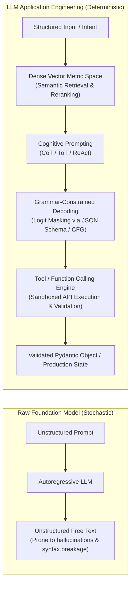
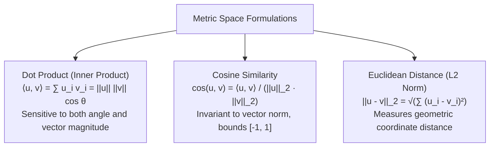
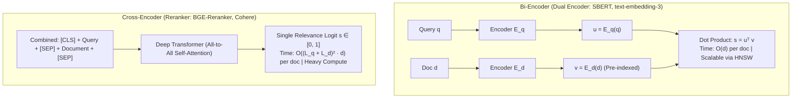
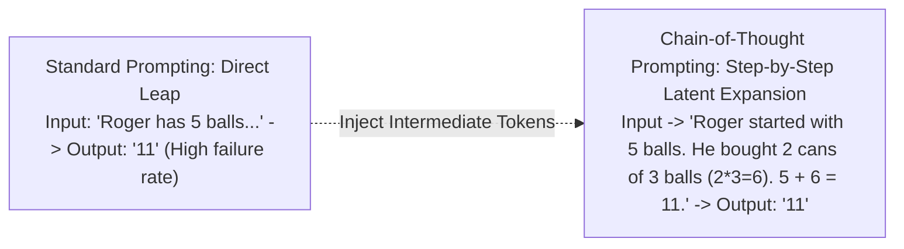
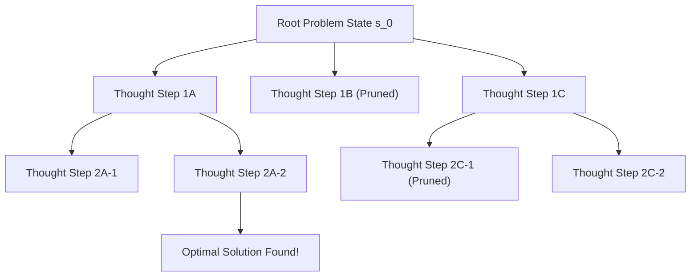
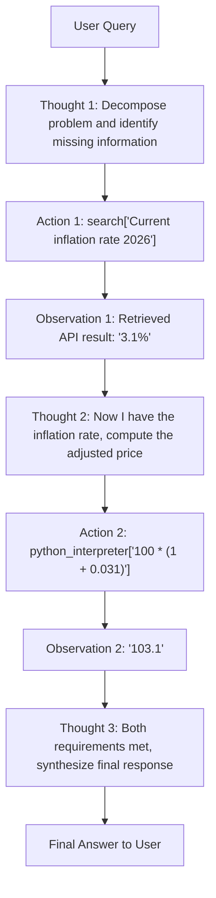
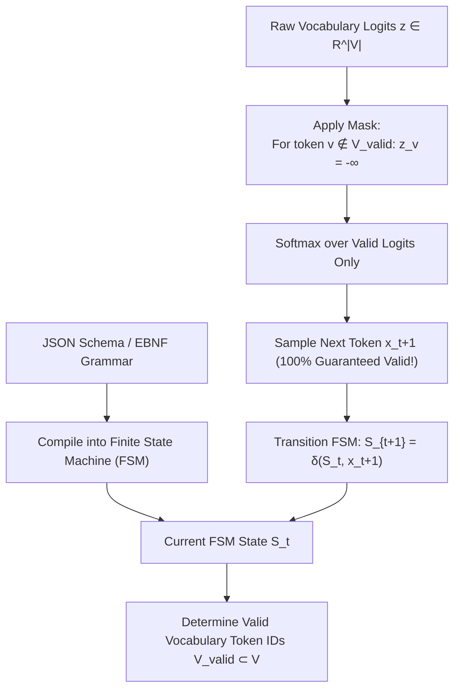
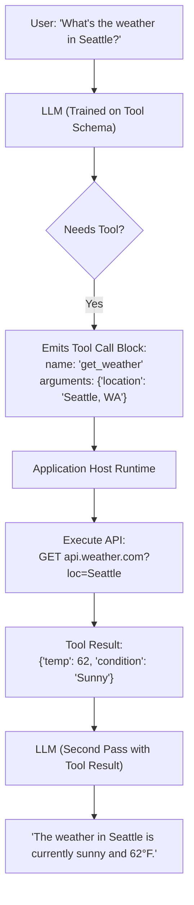

# LLM Application Engineering — Dense Embeddings, Prompt Engineering, Structured Outputs & Function Calling

!!! info "Prerequisites"
    Vector algebra (norms, dot products, metric spaces), autoregressive decoder mechanics, and Python API design. Review [Transformer Architecture & Mechanics](../09-transformers-llms/transformer-architecture-mechanics-deep-dive.md), [Text Representation & Word Embeddings](../08-nlp/text-representation-word-embeddings-deep-dive.md), and [Linear Algebra](../02-mathematics/linear-algebra-deep-dive.md).

---

## 1. The Big Picture: From Raw Text Generation to Deterministic Software Systems

Raw foundation models are probabilistic text generators: given a sequence of tokens, they sample next tokens from an unconstrained probability distribution over tens of thousands of vocabulary items.

However, enterprise software systems demand **determinism, structured data interchange, reliability, and external tool integration**.



Application engineering bridges this gap through four pillars:

1. **Dense Vector Embeddings & Metric Geometry**: Encoding semantic similarity into geometric distance.
2. **Cognitive Prompt Frameworks**: Orchestrating multi-step reasoning through Chain-of-Thought (CoT), Tree of Thoughts (ToT), and ReAct.
3. **Constrained Decoding & Structured Outputs**: Masking vocabulary logits at generation time using Context-Free Grammars (CFG) to guarantee 100% syntactically valid JSON.
4. **Function Calling & Tool Orchestration**: Exposing external APIs and Python environments to the model as executable primitives.

---

## 2. Dense Semantic Embeddings & Metric Space Geometry

An embedding function is a parameterized non-linear mapping from variable-length token sequences to a fixed-dimensional continuous metric space:

$$
\phi: \mathcal{V}^* \to \mathbb{R}^d, \quad \text{typically } d \in [384, 4096]
$$

### 2.1 Metric Spaces & Distance Measures

Let $\mathbf{u}, \mathbf{v} \in \mathbb{R}^d$ be two dense embeddings.



#### Theorem: Monotonic Equivalence of Normalized Cosine Similarity and Euclidean Distance
When embedding vectors are $L_2$-normalized to lie on the unit hypersphere $\mathbb{S}^{d-1}$ (such that $\|\mathbf{u}\|_2 = \|\mathbf{v}\|_2 = 1$):

1. The dot product equals the cosine similarity:
   $$\langle \mathbf{u}, \mathbf{v} \rangle = \frac{\langle \mathbf{u}, \mathbf{v} \rangle}{(1)(1)} = \cos(\mathbf{u}, \mathbf{v})$$

2. The squared Euclidean distance is a strictly decreasing monotonic linear transformation of cosine similarity:

**Proof:**

$$
\|\mathbf{u} - \mathbf{v}\|_2^2 = \langle \mathbf{u} - \mathbf{v}, \, \mathbf{u} - \mathbf{v} \rangle = \|\mathbf{u}\|_2^2 + \|\mathbf{v}\|_2^2 - 2 \langle \mathbf{u}, \mathbf{v} \rangle
$$

Since $\|\mathbf{u}\|_2 = \|\mathbf{v}\|_2 = 1$:

$$
\|\mathbf{u} - \mathbf{v}\|_2^2 = 1 + 1 - 2 \cos(\mathbf{u}, \mathbf{v}) = 2 - 2 \cos(\mathbf{u}, \mathbf{v}) \quad \blacksquare
$$

Therefore:

$$
\arg\min_{\mathbf{v} \in \mathcal{D}} \|\mathbf{u} - \mathbf{v}\|_2 \equiv \arg\max_{\mathbf{v} \in \mathcal{D}} \cos(\mathbf{u}, \mathbf{v}) \equiv \arg\max_{\mathbf{v} \in \mathcal{D}} \langle \mathbf{u}, \mathbf{v} \rangle
$$

For normalized vectors, vector databases can utilize inner product SIMD instructions (`_mm256_fmadd_ps`) instead of square roots, yielding significant retrieval speedups without altering search rankings.

---

### 2.2 Bi-Encoders vs. Cross-Encoders

Retrieving and ranking relevant context from a corpus of $M$ documents entails a trade-off between **computational complexity** and **cross-attention capacity**.



| Dimension | Bi-Encoder | Cross-Encoder |
| :--- | :--- | :--- |
| **Architecture** | Two independent encoders (or shared weights) | Single encoder processing concatenated input |
| **Interaction** | Late interaction via dot product $\mathbf{u}^T \mathbf{v}$ | Early interaction via all-to-all cross-attention |
| **Document Pre-indexing**| **Yes**: All $M$ documents encoded offline | **No**: Must run forward pass for each candidate pair |
| **Query Latency** | Sub-millisecond via vector search (ANN) | $50-500\text{ ms}$ (must run Transformer $M$ times) |
| **Relevance Accuracy** | Moderate (lacks token-level cross-attention) | State-of-the-Art (captures nuanced syntactic alignments) |
| **Production Role** | Stage 1 Candidate Retrieval (Top 1,000 from 10M) | Stage 2 Precision Reranking (Top 10 from 100) |

---

### 2.3 The MTEB Evaluation Framework
The **Massive Text Embedding Benchmark (MTEB, Muennighoff et al. 2022)** standardizes embedding evaluation across 8 distinct tasks:

1. **Retrieval**: Information retrieval NDCG@10 (MS MARCO, BEIR).
2. **Reranking**: Ranking candidate documents given a query.
3. **Clustering**: Grouping documents by topic (k-means V-measure).
4. **Classification**: Linear probe accuracy on frozen embeddings.
5. **Pair Classification**: Predicting duplicate sentences (binary F1).
6. **Semantic Textual Similarity (STS)**: Pearson/Spearman correlation against human similarity ratings.
7. **Summarization**: Alignment between source and summary.
8. **Bitext Mining**: Identifying translation pairs across languages.

---

## 3. Advanced Prompt Engineering & Cognitive Frameworks

Prompt engineering is not mere heuristic phrasing; it represents the configuration of the autoregressive prior to guide the model's computation graph through optimal intermediate latent states.

### 3.1 Chain-of-Thought (CoT) Prompting

[Wei et al. (2022)](https://arxiv.org/abs/2201.11903) observed that standard few-shot prompting fails when tasks require multi-step arithmetic, symbolic manipulation, or logical deduction:

$$
P(y \mid x) \quad \text{vs.} \quad P(z_1, z_2, \dots, z_k, y \mid x) = P(y \mid x, \mathbf{z}) \prod_{i=1}^k P(z_i \mid x, z_{<i})
$$



#### Why CoT Works: The FLOPs-per-Reasoning-Step Argument
In a Transformer, each generated token executes exactly one forward pass containing a fixed number of operations:

$$
\text{FLOPs} \approx 2 \times N_{\text{params}} \text{ per token}
$$

When forced to output the final answer immediately ($y_1$), the model must solve the entire multi-step problem in a single forward pass of depth $L$.  
When generating a reasoning chain of $K$ tokens $\mathbf{z} = (z_1, \dots, z_K)$, the model is allocated:

$$
2 K \cdot N_{\text{params}} \text{ additional FLOPs of sequential computation}
$$

The recurrent attention mechanism allows token $z_k$ to reference the intermediate outputs of all previous steps $z_{<k}$, effectively turning the Transformer into a multi-step dynamic programming engine.

---

### 3.2 Tree of Thoughts (ToT)

[Yao et al. (2023)](https://arxiv.org/abs/2305.10601) expanded linear CoT into a tree-search state space:



ToT defines:

1. **Thought Generator**: Proposes $k$ candidate next reasoning steps: $p_\theta^{\text{gen}}(s_{t+1} \mid s_t)$.
2. **State Evaluator**: Evaluates the promise of intermediate state $s_t$ (e.g. *sure / likely / impossible* or numerical heuristic score $V(s) \in [0, 1]$).
3. **Search Algorithm**: Breadth-First Search (BFS) or Depth-First Search (DFS) with backtracking when a sub-branch leads to contradiction.

---

### 3.3 The ReAct Paradigm: Synergizing Reasoning & Acting

[Yao et al. (2022)](https://arxiv.org/abs/2210.03629) combined internal reasoning with external environment actions:



Without reasoning traces, direct-action agents suffer from goal drift and error propagation. Without actions, pure reasoning agents hallucinate facts outside their static pretraining weights. ReAct synchronizes the two.

---

## 4. Structured Outputs & Constrained Decoding

In enterprise applications, an LLM must emit structured payloads (e.g. valid JSON obeying a strict Pydantic schema) to drive downstream APIs, database inserts, and workflow triggers.

### 4.1 The Failure Mode of Prompt-Only JSON
Instructing a model with *"Respond only in valid JSON matching this schema..."* fails systematically at production scale:

- Outputting preamble or markdown backticks (` ```json `).
- Missing closing brackets (`}`) when truncated by `max_tokens`.
- Hallucinating unexpected keys or emitting trailing commas (`{"a": 1,}`).
- Casting integers as strings (`"count": "5"` instead of `"count": 5`).

---

### 4.2 Grammar-Constrained Decoding Mechanics

Rather than fine-tuning or retrying, modern inference engines (vLLM, Outlines, Guidance, llama.cpp) enforce structure at the **decoding algorithm layer** via vocabulary logit masking.



#### The Mathematical Masking Formulation
Let $\mathcal{V}$ be the vocabulary of tokenizer tokens. Let $G = (V_N, \Sigma, R, S)$ be a Context-Free Grammar (or Regular Expression DFA) representing the target JSON Schema.

At generation step $t$, with generated prefix $x_{<t}$, the grammar dictates the subset of allowed next characters. The engine maps these allowed characters to the subset of valid tokenizer tokens:

$$
\mathcal{V}_{\text{valid}}(x_{<t}) = \left\{ v \in \mathcal{V} \mid \exists w \in \Sigma^* \text{ s.t. } x_{<t} \circ v \circ w \in \mathcal{L}(G) \right\}
$$

Before the softmax layer computes probabilities, the logit vector $\mathbf{z} \in \mathbb{R}^{|\mathcal{V}|}$ is transformed:

$$
\tilde{z}_v = \begin{cases} z_v & \text{if } v \in \mathcal{V}_{\text{valid}}(x_{<t}) \\ -\infty & \text{if } v \notin \mathcal{V}_{\text{valid}}(x_{<t}) \end{cases}
$$

The sampling distribution becomes:

$$
P(x_t = v \mid x_{<t}) = \frac{\exp(\tilde{z}_v)}{\sum_{u \in \mathcal{V}} \exp(\tilde{z}_u)} = \begin{cases} \frac{\exp(z_v)}{\sum_{u \in \mathcal{V}_{\text{valid}}} \exp(z_u)} & \text{if } v \in \mathcal{V}_{\text{valid}} \\ 0 & \text{otherwise} \end{cases}
$$

Under constrained decoding, the probability of generating a syntax error is **mathematically zero**.

---

### 4.3 Function Calling & Tool Calling Protocols

Function calling standardizes tool interaction by converting function signatures into JSON schemas exposed in the system prompt.



---

## 5. Complete Runnable Python Implementation

Below is a complete, production-grade implementation featuring:

- **Bi-Encoder Dense Retrieval & Cosine Similarity**.
- **Pydantic v2 Schema Generation & Structured Extraction**.
- **A Complete Function Calling Engine with Automatic Dispatch and Error Recovery**.

```python
import json
import math
import re
from typing import Any, Callable, Dict, List, Optional
from pydantic import BaseModel, Field, ValidationError


# =====================================================================
# 1. Dense Embedding Geometry & Vector Metric Operations
# =====================================================================

def cosine_similarity(u: List[float], v: List[float]) -> float:
    """Computes exact cosine similarity between two continuous vectors."""
    dot_product = sum(a * b for a, b in zip(u, v))
    norm_u = math.sqrt(sum(a * a for a in u))
    norm_v = math.sqrt(sum(b * b for b in v))
    if norm_u == 0.0 or norm_v == 0.0:
        return 0.0
    return dot_product / (norm_u * norm_v)


def l2_normalize(v: List[float]) -> List[float]:
    """Projects vector onto unit hypersphere."""
    norm = math.sqrt(sum(x * x for x in v))
    if norm == 0.0:
        return v
    return [x / norm for x in v]


# =====================================================================
# 2. Pydantic Structured Output Models
# =====================================================================

class ExtractedEntity(BaseModel):
    name: str = Field(description="Name of the person, company, or entity.")
    category: str = Field(description="Entity category: 'Person', 'Company', 'Location'.")
    confidence: float = Field(ge=0.0, le=1.0, description="Extraction confidence score.")


class DocumentAnalysisResult(BaseModel):
    summary: str = Field(description="Concise 1-2 sentence executive summary.")
    sentiment: str = Field(pattern="^(Positive|Neutral|Negative)$")
    entities: List[ExtractedEntity] = Field(default_factory=list)


# =====================================================================
# 3. Tool Calling / Function Dispatch Framework
# =====================================================================

class ToolRegistry:
    """Registry that converts Python functions into JSON schemas and executes them."""

    def __init__(self):
        self._tools: Dict[str, Callable] = {}
        self._schemas: List[Dict[str, Any]] = []

    def register(self, name: str, description: str, parameters_schema: Dict[str, Any]):
        def decorator(func: Callable):
            self._tools[name] = func
            self._schemas.append({
                "type": "function",
                "function": {
                    "name": name,
                    "description": description,
                    "parameters": parameters_schema,
                },
            })
            return func
        return decorator

    def get_schemas(self) -> List[Dict[str, Any]]:
        return self._schemas

    def execute(self, tool_name: str, arguments: Dict[str, Any]) -> Any:
        if tool_name not in self._tools:
            raise ValueError(f"Tool '{tool_name}' not found in registry.")
        return self._tools[tool_name](**arguments)


# Instantiate Tool Registry
registry = ToolRegistry()

@registry.register(
    name="get_stock_price",
    description="Fetch the current market stock price for a given ticker symbol.",
    parameters_schema={
        "type": "object",
        "properties": {
            "ticker": {"type": "string", "description": "Stock symbol, e.g. AAPL, NVDA"},
        },
        "required": ["ticker"],
    },
)
def get_stock_price(ticker: str) -> Dict[str, Any]:
    mock_db = {"AAPL": 225.50, "NVDA": 128.20, "GOOGL": 178.40}
    price = mock_db.get(ticker.upper(), 100.0)
    return {"ticker": ticker.upper(), "price": price, "currency": "USD"}


@registry.register(
    name="calculate_portfolio_value",
    description="Calculate total value given ticker and share count.",
    parameters_schema={
        "type": "object",
        "properties": {
            "ticker": {"type": "string"},
            "shares": {"type": "number"},
        },
        "required": ["ticker", "shares"],
    },
)
def calculate_portfolio_value(ticker: str, shares: float) -> Dict[str, Any]:
    price_info = get_stock_price(ticker)
    total_val = price_info["price"] * shares
    return {"ticker": ticker.upper(), "shares": shares, "total_value": total_val}


# =====================================================================
# 4. Mock Simulated LLM Engine with Function Calling & JSON Enforcement
# =====================================================================

class MockLLMEngine:
    """Simulates an LLM with tool calling and structured output extraction."""

    def invoke_with_tools(self, user_prompt: str, tools: List[Dict[str, Any]]) -> Dict[str, Any]:
        """Simulates LLM identifying need for a tool call."""
        if "portfolio" in user_prompt.lower() or "shares" in user_prompt.lower():
            return {
                "role": "assistant",
                "tool_calls": [{
                    "id": "call_98234",
                    "type": "function",
                    "function": {
                        "name": "calculate_portfolio_value",
                        "arguments": json.dumps({"ticker": "NVDA", "shares": 50}),
                    },
                }],
            }
        return {
            "role": "assistant",
            "content": "No tool needed to answer this general question.",
        }

    def generate_structured_json(self, raw_input: str) -> str:
        """Simulates constrained decoding generating valid JSON matching DocumentAnalysisResult."""
        simulated_output = {
            "summary": "NVIDIA announced record quarterly revenue driven by data center AI demand.",
            "sentiment": "Positive",
            "entities": [
                {"name": "NVIDIA", "category": "Company", "confidence": 0.99},
                {"name": "Jensen Huang", "category": "Person", "confidence": 0.95},
            ],
        }
        return json.dumps(simulated_output)


# =====================================================================
# 5. Verification Run
# =====================================================================

if __name__ == "__main__":
    print("--- 1. Testing Metric Space Embedding Properties ---")
    u = [1.0, 2.0, 3.0]
    v = [1.2, 1.9, 3.1]
    w = [-2.0, -1.0, 0.5]

    u_norm = l2_normalize(u)
    v_norm = l2_normalize(v)

    cos_sim = cosine_similarity(u, v)
    l2_dist_sq = sum((a - b) ** 2 for a, b in zip(u_norm, v_norm))
    expected_l2_sq = 2.0 - 2.0 * cos_sim

    print(f"Cosine similarity(u, v): {cos_sim:.5f}")
    print(f"Actual L2 squared dist:  {l2_dist_sq:.5f}")
    print(f"Formula (2 - 2cos(u,v)): {expected_l2_sq:.5f}")
    assert abs(l2_dist_sq - expected_l2_sq) < 1e-6, "Monotonic equivalence proof violated!"

    print("\n--- 2. Testing Function Calling Dispatch Loop ---")
    engine = MockLLMEngine()
    user_query = "What is the total value of my 50 shares of NVDA?"

    response = engine.invoke_with_tools(user_query, registry.get_schemas())
    if "tool_calls" in response:
        for tool_call in response["tool_calls"]:
            func_name = tool_call["function"]["name"]
            func_args = json.loads(tool_call["function"]["arguments"])
            print(f"Model dispatched tool: {func_name} with args: {func_args}")

            # Execute tool safely via registry
            execution_result = registry.execute(func_name, func_args)
            print(f"Tool execution output: {execution_result}")
            assert execution_result["total_value"] == 128.20 * 50

    print("\n--- 3. Testing Pydantic Structured Extraction & Validation ---")
    raw_json_str = engine.generate_structured_json("Analyze NVIDIA earnings release.")
    validated_model = DocumentAnalysisResult.model_validate_json(raw_json_str)

    print(f"Parsed Summary:    {validated_model.summary}")
    print(f"Parsed Sentiment:  {validated_model.sentiment}")
    print(f"Entities Count:    {len(validated_model.entities)}")
    print(f"Entity 0:          {validated_model.entities[0].name} ({validated_model.entities[0].category})")

    print("\nAll Application Engineering verifications passed successfully!")
```

---

## 6. Common Errors & Debugging Guide

### 1. JSON Parse Failure Due to Max Token Truncation
- **Symptom**: `json.decoder.JSONDecodeError: Unterminated string starting at line 1 column 480`.
- **Root Cause**: The model's response reached `max_tokens` before emitting closing quotes and brackets (`}`).
- **Diagnosis**: Check the generation API's `finish_reason`. If `finish_reason == "length"`, the generation was aborted prematurely.
- **Fix**: Increase `max_tokens` or implement a stateful JSON repair loop using libraries like `json-repair`:
```python
import json_repair
repaired_obj = json_repair.loads(incomplete_raw_json)
```

---

### 2. Pydantic ValidationError on Null vs. Absent Keys
- **Symptom**: `pydantic_core._pydantic_core.ValidationError: Input should be a valid string [type=string_type, input_value=None]`.
- **Root Cause**: Field defined as `description: Optional[str] = None` where the model explicitly outputs `{"description": null}` instead of omitting the key.
- **Fix**: Use explicit unions in Pydantic v2: `description: str | None = None`.

---

### 3. Metric Inconsistency in Vector Retrieval
- **Symptom**: Retrieval accuracy degrades severely when deploying to production with HNSW/IVF indexes.
- **Root Cause**: Index created with Euclidean distance (`metric="l2"`) while embedding vectors were inserted without $L_2$-normalization. When vectors vary in norm, documents with large token counts or large embeddings appear artificially distant.
- **Fix**: Normalize all query and document vectors to unit length $\|\mathbf{x}\|_2 = 1.0$ before indexing and query lookup.

---

## 7. Staff-Level Technical Interview Questions

### Q1: Prove mathematically that ranking under Cosine Similarity and squared Euclidean Distance ($L_2^2$) are identical when embedding vectors are $L_2$-normalized.

**Model Answer:**  
Let $\mathbf{u}, \mathbf{v} \in \mathbb{R}^d$ be two vectors on the unit hypersphere $\mathbb{S}^{d-1}$, meaning $\|\mathbf{u}\|_2 = 1$ and $\|\mathbf{v}\|_2 = 1$.  
The squared Euclidean distance is:
$$\|\mathbf{u} - \mathbf{v}\|_2^2 = \sum_{i=1}^d (u_i - v_i)^2 = \sum_{i=1}^d u_i^2 + \sum_{i=1}^d v_i^2 - 2 \sum_{i=1}^d u_i v_i$$
$$\|\mathbf{u} - \mathbf{v}\|_2^2 = \|\mathbf{u}\|_2^2 + \|\mathbf{v}\|_2^2 - 2 (\mathbf{u} \cdot \mathbf{v})$$
Substitute the unit norms $\|\mathbf{u}\|_2^2 = 1$ and $\|\mathbf{v}\|_2^2 = 1$:
$$\|\mathbf{u} - \mathbf{v}\|_2^2 = 1 + 1 - 2 \cos(\mathbf{u}, \mathbf{v}) = 2 - 2 \cos(\mathbf{u}, \mathbf{v})$$
Let $f(s) = 2 - 2s$. Because the derivative $f'(s) = -2 < 0$, $f$ is a strictly decreasing monotonic function of similarity $s = \cos(\mathbf{u}, \mathbf{v})$.  
Therefore, maximizing $\cos(\mathbf{u}, \mathbf{v})$ over candidate set $\mathcal{D}$ strictly minimizes $\|\mathbf{u} - \mathbf{v}\|_2^2$.

---

### Q2: How does Grammar-Constrained Decoding (such as in Outlines or vLLM) guarantee 100% syntactically valid JSON without fine-tuning the underlying model?

**Model Answer:**  
Grammar-constrained decoding intervenes at the logit level during autoregressive decoding.  

1. **Compilation**: The target JSON Schema or Pydantic model is compiled into a Deterministic Finite Automaton (DFA) or Context-Free Grammar (CFG) Pushdown Automaton.
2. **State Tracking**: As tokens are generated, the engine tracks the current automaton state $S_t$.
3. **Logit Masking**: For the current state $S_t$, the grammar identifies the subset of valid subsequent Unicode characters, which is mapped to the set of valid vocabulary token IDs $\mathcal{V}_{\text{valid}} \subseteq \mathcal{V}$.
4. **Logit Update**: All invalid tokens $v \notin \mathcal{V}_{\text{valid}}$ have their pre-softmax logits overwritten with $-\infty$:
   $$\tilde{z}_v = \begin{cases} z_v & \text{if } v \in \mathcal{V}_{\text{valid}} \\ -\infty & \text{otherwise} \end{cases}$$

5. **Sampling**: Softmax computes zero probability for all invalid tokens.  
Because the model can only sample from tokens that satisfy the grammar at every decoding step, syntax errors (missing braces, unquoted keys, bad types) are mathematically impossible.

---

### Q3: Contrast Bi-Encoders and Cross-Encoders in production information retrieval. Why not use Cross-Encoders for initial document retrieval?

**Model Answer:**  

- **Bi-Encoders**: Encode query $\mathbf{q}$ and document $\mathbf{d}$ independently into single dense vectors $\mathbf{u} = E_q(\mathbf{q}), \mathbf{v} = E_d(\mathbf{d})$. The similarity is computed via dot product $\mathbf{u}^T \mathbf{v}$.
  - *Complexity*: Documents are encoded offline once and indexed into approximate nearest neighbor (ANN) graphs (HNSW). Retrieval over $10\text{ million documents}$ costs $\mathcal{O}(\log M)$ distance checks ($< 5\text{ ms}$).
  - *Limitation*: No token-level interaction between query and document tokens; fine syntactic dependencies are compressed into a single vector.
- **Cross-Encoders**: Concatenate query and document into a single sequence $[q, \text{SEP}, d]$ and pass it through all-to-all attention layers.
  - *Advantage*: Full cross-attention computes pairwise token interactions across all $L$ layers, capturing subtle semantic nuances and negation.
  - *Complexity*: For $M$ documents, running a Cross-Encoder requires $M$ full forward passes: $\mathcal{O}(M \cdot (L_q + L_d)^2 \cdot d)$. For $M = 1,000,000$, this requires millions of GPU seconds per query, which is computationally infeasible for initial retrieval.
- *Production standard*: Bi-encoder retrieves top 100 candidates $\to$ Cross-encoder reranks top 100 to yield final top 5.

---

### Q4: Explain the theoretical reason why Chain-of-Thought (CoT) prompting unlocks reasoning capabilities that direct zero-shot prompting cannot achieve.

**Model Answer:**  
In a standard Transformer decoder, generating each token requires a fixed number of operations determined by model depth $L$ and hidden size $d$: FLOPs $\approx 2 N_{\text{params}}$ per token.  
When an LLM is asked to output a direct answer ($P(\text{answer} \mid \text{question})$), the entire computation must execute within a single forward pass through $L$ feedforward and attention layers. For complex mathematical or algorithmic tasks, the required computational graph depth exceeds the fixed layer depth $L$.  
When CoT is used, generating $K$ reasoning tokens allocates $2 K N_{\text{params}}$ additional operations. Because attention allows subsequent tokens to access intermediate activations of prior tokens, the model can iteratively compute intermediate results, store them in the autoregressive context, and build upon them sequentially. This transforms the static constant-depth circuit into a dynamically unfolded iterative computing graph.

---

### Q5: How does the ReAct framework prevent error compounding compared to pure planning or pure action agents?

**Model Answer:**  

- **Pure Action Agents (No Thoughts)**: Execute API calls directly based on prompts without intermediate reflection. When an API returns unexpected data, error codes, or empty responses, the agent has no internal mechanism to evaluate failure, causing it to blindly repeat the invalid action or generate hallucinations.
- **Pure Reasoning Agents (CoT without Actions)**: Reason internally without consulting external ground truth. When the model encounters facts missing from its pretraining weights or outdated numerical figures, it hallucinates plausible-sounding premises and builds a flawed reasoning chain upon them.
- **ReAct Synergy**: Interleaves `Thought` $\to$ `Action` $\to$ `Observation`. The `Thought` step formulates a hypothesis and decides which API to call. The `Observation` step brings objective empirical reality back into the context. If the observation contradicts the expectation, the subsequent `Thought` detects the anomaly and adjusts the plan dynamically, halting error compounding before emitting the final answer.

---

## 8. Mastery Ladder

- [ ] **L1:** Compute the cosine similarity and Euclidean distance between two vectors in Python.
- [ ] **L2:** Prove mathematically why ranking under cosine similarity equals ranking under Euclidean distance for $L_2$-normalized vectors.
- [ ] **L3:** Explain the architectural difference between Bi-Encoders and Cross-Encoders and their respective computational complexities.
- [ ] **L4:** List the 8 task categories evaluated in the Massive Text Embedding Benchmark (MTEB).
- [ ] **L5:** Explain why Chain-of-Thought provides additional computational FLOPs per reasoning step.
- [ ] **L6:** Compare the state space search mechanics of Tree of Thoughts (ToT) with linear Chain-of-Thought.
- [ ] **L7:** Diagram the Thought-Action-Observation loop in the ReAct framework.
- [ ] **L8:** Formulate the logit masking equation $\tilde{z}_v$ used in Context-Free Grammar constrained decoding.
- [ ] **L9:** Build a JSON schema parameter specification for a tool and implement an automated execution dispatcher in Python.
- [ ] **L10:** Write a complete Pydantic structured extraction pipeline with validation, error trapping, and automatic repair.
