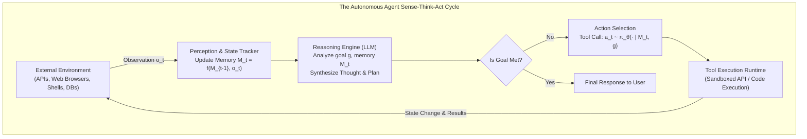
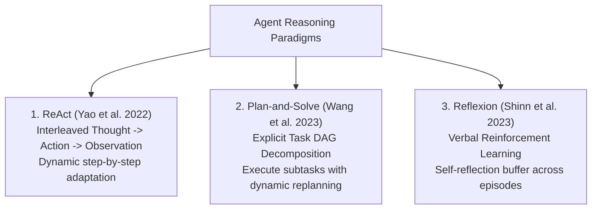
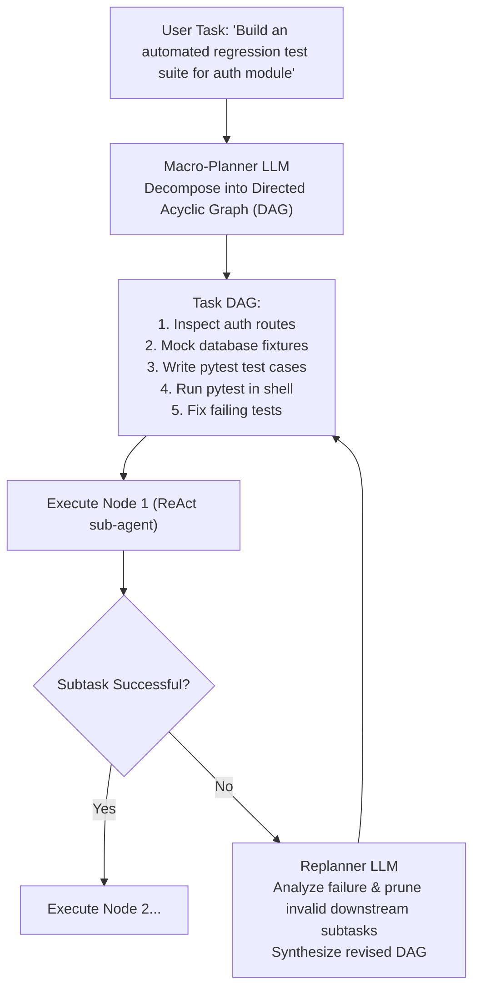
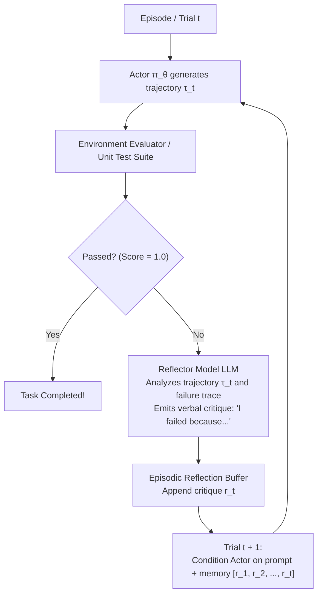
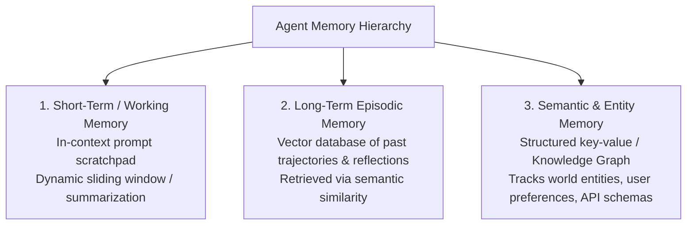
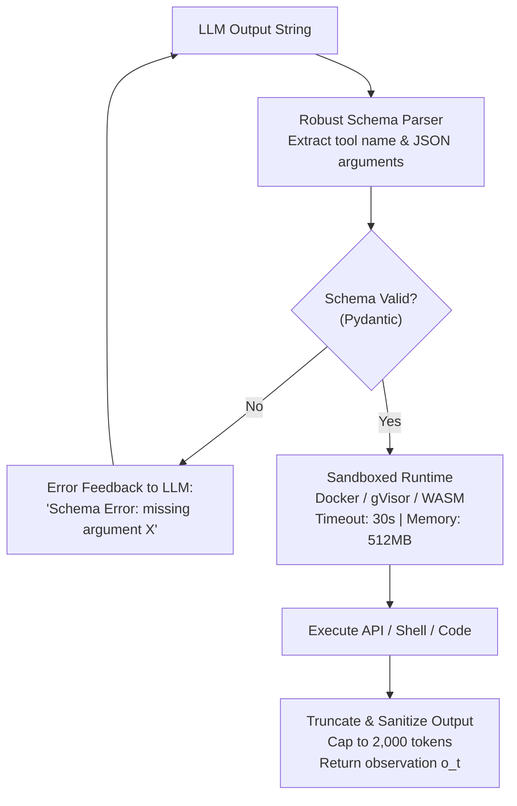

# Agent Architectures & Patterns — ReAct, Plan-and-Solve, Reflexion, Memory Systems & Tool Execution Loops

!!! info "Prerequisites"
    Function calling, JSON schema enforcement, Markov Decision Processes (MDPs), and state machines. Review [LLM Application Engineering](../10-generative-ai/llm-application-engineering-deep-dive.md), [Transformer Architecture & Mechanics](../09-transformers-llms/transformer-architecture-mechanics-deep-dive.md), and [Probability & Statistics](../02-mathematics/probability-statistics-deep-dive.md).

---

## 1. The Big Picture: What is an AI Agent?

A traditional LLM application operates as a **passive oracle**: it receives an input prompt, performs a single forward pass, and outputs a response. Even in RAG systems, the flow of execution is strictly linear and deterministic.

An **AI Agent** is an **autonomous cybernetic system** that interacts with an external environment through a closed-loop feedback cycle:

$$
\text{Perception} \longrightarrow \text{Reasoning} \longrightarrow \text{Action} \longrightarrow \text{Environment Feedback}
$$



### Formal Formulation as a Partially Observable Markov Decision Process (POMDP)
An agent environment is modeled as a tuple $\langle \mathcal{S}, \mathcal{A}, \mathcal{T}, \mathcal{R}, \Omega, \mathcal{O}, \gamma \rangle$:

- $\mathcal{S}$: True environment state (e.g. all files in a codebase, remote API states).
- $\mathcal{A}$: Action space (the set of callable tools, API requests, code executions).
- $\mathcal{T}(s' \mid s, a)$: State transition probability function.
- $\Omega$: Observation space (what the agent observes: terminal outputs, JSON payloads, HTML).
- $\mathcal{O}(o \mid s', a)$: Observation probability function (the agent rarely perceives the complete state $\mathcal{S}$).
- $\pi_\theta(a \mid o_{1:t})$: The LLM policy selecting action $a$ conditioned on observation history.

---

## 2. Core Reasoning & Acting Patterns

Agents differ fundamentally in how they structure cognitive computation across time.



---

### 2.1 The ReAct Framework (Reasoning + Acting)

[Yao et al. (2022)](https://arxiv.org/abs/2210.03629) combined chain-of-thought internal reasoning with action execution:

$$\text{Trajectory: } \tau = (t_1, a_1, o_1, t_2, a_2, o_2, \dots, t_N, a_N, o_N)$$

where:

- **Thought ($t_i$)**: Free-form natural language reasoning generated by the model. Decomposes the goal, tracks progress, identifies missing information, and plans the immediate next step.
- **Action ($a_i$)**: A structured tool call emitted by the model with specific arguments (e.g., `search("Apollo 11 launch date")`).
- **Observation ($o_i$)**: The empirical result returned by the external tool execution runtime.


#### Why ReAct Outperforms Separate Reasoning or Acting
- **Pure Action Agents**: Lack internal scratchpads; fail to synthesize multi-step deductions and jump to erroneous premature actions.
- **Pure Reasoning Agents (CoT)**: Cannot access real-time or private information; hallucinate facts outside their static pretraining weights.
- **ReAct Synergy**: Reasoning guides action choice and parameters; external observations anchor reasoning and halt hallucination cascades.

---

### 2.2 Plan-and-Solve & Dynamic Re-Planning

For complex tasks with $10+$ steps, step-by-step ReAct can lose track of the high-level goal (a phenomenon known as **goal drift** or **action oscillation**).

**Plan-and-Solve** ([Wang et al., 2023](https://arxiv.org/abs/2305.04091)) decouples macro-planning from micro-execution:



1. **Planning Phase**: The planner LLM analyzes the global objective and constructs a Directed Acyclic Graph (DAG) of discrete subtasks with explicit input/output dependencies.
2. **Execution Phase**: Specialized sub-agents execute individual DAG nodes in topological order.
3. **Dynamic Re-planning**: If subtask $k$ fails (e.g. an API endpoint is deprecated), the replanner evaluates the environment error, invalidates downstream nodes that depended on $k$, and generates an alternative execution path.

---

### 2.3 Reflexion: Verbal Reinforcement Learning

Traditional Reinforcement Learning updates policy weights $\theta$ via policy gradient descent $\nabla_\theta J(\theta)$. This is slow, sample-inefficient, and requires millions of interactions.

[Shinn et al. (2023)](https://arxiv.org/abs/2303.11366) introduced **Reflexion**, which performs **verbal reinforcement learning** by maintaining a self-reflection memory buffer without updating any neural weights.



The actor's prompt for trial $t+1$ is conditioned on the task description and the accumulated reflection memory:

$$
\pi_\theta\left(a \mid x, \, \mathbf{r}_{1:t}\right)
$$

The model avoids repeating previous tactical errors by reading its own past post-mortem analyses, boosting performance on coding benchmarks (HumanEval) from $67\%$ to over $91\%$.

---

## 3. Memory & State Management Systems

An agent's intelligence is strictly bounded by its memory architecture.



### 3.1 Working / Short-Term Memory
- Stored directly in the LLM's active context window.
- Contains the system prompt, tool definitions, task objective, and recent $(t_i, a_i, o_i)$ steps.
- **Context Management**: When scratchpad tokens approach the model's context limit, older turns are recursively condensed via an LLM summarizer or pruned using priority scoring.

### 3.2 Long-Term Episodic Memory
- Persisted in an external vector database.
- Stores historical episodes: $\langle \text{Task}, \text{Successful Trajectory}, \text{Reflections} \rangle$.
- When a new task $x_{\text{new}}$ is assigned, the agent queries the episodic memory for top-$k$ nearest past experiences using embedding cosine similarity:
  $$\mathcal{M}_{\text{relevant}} = \text{ANN\_Search}(\phi(x_{\text{new}}))$$
  Injecting these past trajectories into the prompt serves as dynamic few-shot in-context demonstrations.

### 3.3 Semantic & Entity Memory
- Structured key-value stores (Redis) or graph databases (Neo4j).
- Explicitly tracks user preferences (*"User prefers Python over Go"*), environment variables (*"Database host: 10.0.1.5"*), and entity states across multi-turn sessions.

---

## 4. Tool Execution & Environment Interaction

Interacting with external environments requires rigorous execution guarantees.



### Critical Production Requirements
1. **Sandboxing**: Execution of untrusted code or shell commands must run in ephemeral containers (Docker, gVisor, Firecracker microVMs) with strict network isolation and read-only root filesystems.
2. **Resource Capping**: Tool outputs must be strictly capped (e.g. first 2,000 characters). An unconstrained `curl` or SQL query returning 50MB of raw text will instantly exhaust the LLM context window, causing an Out-Of-Memory API crash.
3. **Deterministic Error Handling**: When a tool throws an exception, the raw stack trace must be captured, formatted, and returned as an `Observation: ToolExecutionError(...)` rather than terminating the agent process. This allows the LLM to inspect the traceback and self-correct.

---

## 5. Complete Runnable Python Implementation from Scratch

Below is a complete, self-contained implementation featuring:

- **A Full ReAct Agent Loop** (`Thought` $\to$ `Action` $\to$ `Observation`).
- **Tool Registry with Automatic Dispatch**.
- **Working Scratchpad Memory + Episodic Reflection Buffer**.
- **Self-Correction on Tool Exceptions**.

```python
import json
import math
import re
from typing import Any, Callable, Dict, List, Optional, Tuple


# =====================================================================
# 1. Tool Environment & Registry
# =====================================================================

class EnvironmentToolRegistry:

    def __init__(self):
        self._tools: Dict[str, Callable] = {}
        self._docstrings: Dict[str, str] = {}

    def register(self, name: str, description: str):
        def decorator(func: Callable):
            self._tools[name] = func
            self._docstrings[name] = description
            return func
        return decorator

    def get_tool_descriptions(self) -> str:
        lines = []
        for name, desc in self._docstrings.items():
            lines.append(f"- {name}: {desc}")
        return "\n".join(lines)

    def execute(self, name: str, argument: str) -> str:
        if name not in self._tools:
            return f"Error: Tool '{name}' does not exist. Available: {list(self._tools.keys())}"
        try:
            return str(self._tools[name](argument))
        except Exception as e:
            return f"Tool Execution Error in {name}: {type(e).__name__} - {str(e)}"


env = EnvironmentToolRegistry()

@env.register("calculator", "Evaluates a Python mathematical expression. Argument: math expression string.")
def calculator(expr: str) -> str:
    # Safe evaluation of basic arithmetic
    allowed = set("0123456789+-*/(). %")
    if not all(c in allowed for c in expr):
        raise ValueError("Invalid characters in mathematical expression.")
    return str(eval(expr, {"__builtins__": None}, {}))


@env.register("database_lookup", "Looks up revenue and financial data for a company ticker. Argument: ticker symbol.")
def database_lookup(ticker: str) -> str:
    db = {
        "AAPL": {"revenue_2024": 391.0, "net_income": 93.7, "currency": "USD_Billions"},
        "MSFT": {"revenue_2024": 245.1, "net_income": 88.1, "currency": "USD_Billions"},
        "GOOGL": {"revenue_2024": 307.4, "net_income": 73.8, "currency": "USD_Billions"},
    }
    ticker = ticker.strip().upper()
    if ticker in db:
        return json.dumps(db[ticker])
    return f"No financial records found for ticker '{ticker}'."


# =====================================================================
# 2. ReAct Agent Engine with Reflection Memory
# =====================================================================

class ReActAgent:

    def __init__(self, tool_registry: EnvironmentToolRegistry, max_iterations: int = 5):
        self.tools = tool_registry
        self.max_iterations = max_iterations
        self.scratchpad: List[str] = []
        self.reflection_buffer: List[str] = []

    def _mock_llm_step(self, prompt: str) -> str:
        """Simulates LLM internal reasoning and action generation."""
        # Step 1: If database not yet called, look up MSFT
        if "Action: database_lookup" not in prompt:
            return (
                "Thought: I need to find Microsoft's 2024 revenue and net income to compute its profit margin.\n"
                "Action: database_lookup[MSFT]"
            )
        # Step 2: If database called, compute profit margin via calculator
        elif "Action: calculator" not in prompt:
            return (
                "Thought: The database returned revenue of $245.1B and net income of $88.1B. "
                "I must calculate the profit margin: (88.1 / 245.1) * 100.\n"
                "Action: calculator[(88.1 / 245.1) * 100]"
            )
        # Step 3: Calculator returned, finalize answer
        else:
            return (
                "Thought: The profit margin is approximately 35.94%. I have all necessary data to formulate the response.\n"
                "Final Answer: Microsoft's 2024 net profit margin was approximately 35.94% (Revenue: $245.1B, Net Income: $88.1B)."
            )

    def run(self, task: str) -> str:
        self.scratchpad = [f"Task: {task}"]

        for iteration in range(1, self.max_iterations + 1):
            # Assemble current context prompt
            current_context = (
                f"Tools Available:\n{self.tools.get_tool_descriptions()}\n\n"
                f"Reflections from Past Trials:\n"
                + ("\n".join(self.reflection_buffer) if self.reflection_buffer else "None.")
                + f"\n\nTrajectory:\n"
                + "\n".join(self.scratchpad)
            )

            # Generate thought + action
            llm_output = self._mock_llm_step(current_context)
            self.scratchpad.append(llm_output)

            # Check if agent produced final answer
            if "Final Answer:" in llm_output:
                final_answer = llm_output.split("Final Answer:")[1].strip()
                return final_answer

            # Parse Action: tool_name[argument]
            action_match = re.search(r"Action:\s*([a-zA-Z0-9_]+)\[(.*?)\]", llm_output)
            if not action_match:
                observation = "Error: Invalid action syntax. Expected format: Action: tool_name[argument]"
            else:
                tool_name = action_match.group(1).strip()
                tool_arg = action_match.group(2).strip()
                # Execute tool
                observation = self.tools.execute(tool_name, tool_arg)

            observation_entry = f"Observation: {observation}"
            self.scratchpad.append(observation_entry)

        # If max iterations reached, trigger Reflexion critique
        reflection = f"Trial failed: Exceeded {self.max_iterations} steps without reaching Final Answer."
        self.reflection_buffer.append(reflection)
        return "Failure: Agent exceeded maximum iterations."


# =====================================================================
# 3. Demonstration & Verification Run
# =====================================================================

if __name__ == "__main__":
    agent = ReActAgent(tool_registry=env, max_iterations=5)

    user_goal = "Calculate the net profit margin percentage for Microsoft (MSFT) in 2024."
    print(f"Goal: '{user_goal}'\n")

    result = agent.run(user_goal)

    print("--- Complete Agent Trajectory ---")
    for step in agent.scratchpad:
        print(step)

    print("\n--- Final Agent Deliverable ---")
    print(result)

    assert "35.94%" in result, "Profit margin calculation verification failed!"
    print("\nReAct Agent verification executed successfully!")
```

---

## 6. Common Errors & Debugging Guide

### 1. The Action Oscillation Loop
- **Symptom**: Agent gets trapped repeatedly calling the same tool with identical or slightly modified arguments until context or iteration limits are hit.
- **Root Cause**: The tool returned an unhelpful or ambiguous response that didn't provide the expected variable, but the agent's prompt lacks an explicit instruction to pivot strategies on null returns.
- **Fix**: Implement an **action history duplicate detector**:
```python
if recent_actions.count(current_action) >= 2:
    observation = "System Warning: You have executed this identical action twice with no new information. You MUST choose an alternative tool or report inability to proceed."
```

---

### 2. Context Window Exhaustion from Verbose Tool Payloads
- **Symptom**: `InvalidRequestError: This model's maximum context length is 32768 tokens, however you requested 42109 tokens`.
- **Root Cause**: A tool (e.g. `web_scrape` or `sql_query`) dumped raw HTML or a 10,000-row table into the scratchpad observation.
- **Fix**: Sanitize and truncate tool returns before injecting them into the agent scratchpad:
```python
def format_observation(raw_output: str, max_chars: int = 2000) -> str:
    if len(raw_output) > max_chars:
        return raw_output[:max_chars] + f"\n... [Truncated {len(raw_output) - max_chars} characters]"
    return raw_output
```

---

### 3. Tool Call Hallucination
- **Symptom**: Agent attempts to execute `Action: send_email_to_manager[...]` when only `search` and `calculator` tools were defined.
- **Root Cause**: Weak model following or confusing examples in the few-shot prompt.
- **Fix**: Constrain tool dispatch via grammar-constrained decoding (JSON schema) or return an explicit schema error observation instructing the model to review available tools.

---

## 7. Staff-Level Technical Interview Questions

### Q1: Compare the ReAct pattern with the Plan-and-Solve pattern. For what class of tasks will Plan-and-Solve systematically outperform ReAct?

**Model Answer:**  

- **ReAct**: Interleaves local reasoning and action selection step-by-step ($t_i \to a_i \to o_i$).
  - *Strengths*: Highly adaptive; handles unpredictable environments (web browsing, interactive games) where each observation dynamically reshapes subsequent actions.
  - *Weaknesses*: Suffers from **goal drift** and short-sightedness on long-horizon tasks; can easily fall into infinite retry loops.
- **Plan-and-Solve**: Explicitly constructs a high-level Directed Acyclic Graph (DAG) of subtasks before executing individual steps.
  - *Strengths*: Maintains global strategic coherence; avoids premature action loops; enables parallel execution of independent DAG sub-branches.
- **When Plan-and-Solve Outperforms ReAct**:
  1. Long-horizon composite workflows ($>10$ steps) with clear modular structure (e.g., migrating a codebase from JavaScript to TypeScript: inspect files $\to$ generate type definitions $\to$ rewrite files $\to$ run compiler $\to$ resolve lint errors).
  2. Tasks requiring heavy resource coordination or parallel execution across multiple workers.

---

### Q2: Explain the Reflexion framework. How does it implement verbal reinforcement learning without updating neural network weights?

**Model Answer:**  
Traditional RL optimizes policy parameters $\theta$ by computing policy gradients over scalar rewards: $\theta \leftarrow \theta + \alpha \nabla_\theta \mathbb{E}[R(\tau)]$.  
Reflexion replaces numeric gradient updates with **linguistic feedback**:

1. An actor LLM $\pi_\theta$ executes an episode to generate trajectory $\tau_t$.
2. An external evaluator (e.g. unit test runner or heuristic grader) checks if the task succeeded.
3. If the trial fails, a **Reflector LLM** analyzes the failed trajectory $\tau_t$, the environment error trace, and the goal. It outputs a verbal post-mortem critique $r_t$ (*"I failed because I assumed the array was 1-indexed; next time I must check length first"*).
4. This critique is appended to a persistent **Episodic Memory Buffer**.
5. On trial $t+1$, the actor LLM is prompted with the task description *plus* all past verbal critiques $\mathbf{r}_{1:t}$.  
Because the model can attend to its past self-critiques via self-attention, it modifies its generation trajectory to avoid past pitfalls, functioning as a non-parametric verbal policy update.

---

### Q3: How should an agent's memory architecture be partitioned across working, episodic, and semantic memory systems?

**Model Answer:**  

1. **Working / Short-Term Memory**:
   - *Substrate*: Active context window.
   - *Contents*: Immediate task goal, system prompt, tool definitions, and recent ReAct trace turns.
   - *Lifecycle*: Volatile; cleared or summarized when task concludes.
2. **Episodic Memory**:
   - *Substrate*: External vector database (e.g. Milvus, Pinecone).
   - *Contents*: Historical execution trajectories, reflections, and past problem-solving episodes indexed by task embeddings.
   - *Lifecycle*: Persistent; retrieved via ANN similarity search to provide dynamic few-shot demonstrations when facing similar future tasks.
3. **Semantic / Entity Memory**:
   - *Substrate*: Key-value database (Redis) or Knowledge Graph (Neo4j).
   - *Contents*: Factual world knowledge, user profile settings, domain constraints, and entity relational states.
   - *Lifecycle*: Persistent and stateful; updated via deterministic transactions.

---

### Q4: What techniques prevent an autonomous agent from entering infinite execution loops or suffering context overflow?

**Model Answer:**  

1. **Loop Prevention**:
   - *Action Fingerprinting*: Maintain a hash set of recent `(tool_name, tool_arguments)`. If an identical action is selected twice consecutively with identical output, inject a high-priority system warning into the context.
   - *Hard Iteration Budget*: Enforce an absolute cutoff on total execution steps ($N_{\max} \in [10, 20]$).
2. **Context Window Protection**:
   - *Observation Truncation & Sandboxing*: Hard-cap tool return payloads to a fixed character budget (e.g. 2,000 chars).
   - *Sliding Window Scratchpad Summarization*: When context reaches $80\%$ of model capacity, invoke a lightweight model to summarize earlier $(t, a, o)$ turns into a compressed narrative, preserving only the system prompt, summary, and last 2 active turns.

---

### Q5: How do you model an LLM Agent mathematically as a Partially Observable Markov Decision Process (POMDP)?

**Model Answer:**  
A POMDP is defined as $\langle \mathcal{S}, \mathcal{A}, \mathcal{T}, \mathcal{R}, \Omega, \mathcal{O}, \gamma \rangle$:

- **States $\mathcal{S}$**: The complete, ground-truth configuration of the external digital universe (all files on disk, remote database rows, external API backend states).
- **Actions $\mathcal{A}$**: The discrete space of valid tool calls, arguments, and terminal answers emitted by the LLM: $a_t \in \mathcal{A}$.
- **Transitions $\mathcal{T}(s' \mid s, a)$**: The deterministic or stochastic state updates resulting from executing tool $a$ (e.g. writing a file to disk or running an SQL `UPDATE`).
- **Observations $\Omega$**: The partial view returned to the agent (terminal stdout/stderr, API HTTP response payloads).
- **Observation Probability $\mathcal{O}(o \mid s', a)$**: The mapping from true environment state to what is returned to the agent (the agent cannot see uninspected disk files).
- **Policy $\pi_\theta(a_t \mid o_{1:t})$**: Parameterized by the LLM weights $\theta$, generating next action $a_t$ conditioned on the observation history.

---

## 8. Mastery Ladder

- [ ] **L1:** Formulate the cybernetic Sense-Think-Act loop of an autonomous agent.
- [ ] **L2:** Frame an LLM agent as a Partially Observable Markov Decision Process (POMDP).
- [ ] **L3:** Explain the components of the ReAct trajectory $\tau = (t_1, a_1, o_1, \dots, t_N, a_N, o_N)$.
- [ ] **L4:** Describe the Plan-and-Solve paradigm and explain Directed Acyclic Graph (DAG) task decomposition.
- [ ] **L5:** Explain the Reflexion framework and how verbal reinforcement learning operates without gradient descent.
- [ ] **L6:** Compare Working Memory, Episodic Memory, and Semantic/Entity Memory in agent systems.
- [ ] **L7:** Explain sandboxing and resource capping requirements for safe tool execution.
- [ ] **L8:** Implement loop detection and action history deduplication to prevent agent oscillation.
- [ ] **L9:** Design a context window compaction strategy for long-horizon agent trajectories.
- [ ] **L10:** Implement a functional ReAct agent with working scratchpad, tool execution registry, and reflection buffer from scratch in Python.
