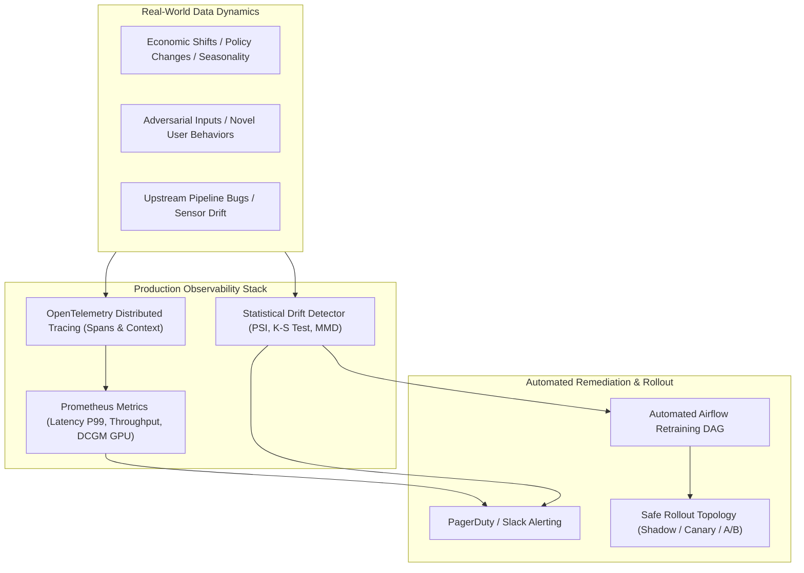
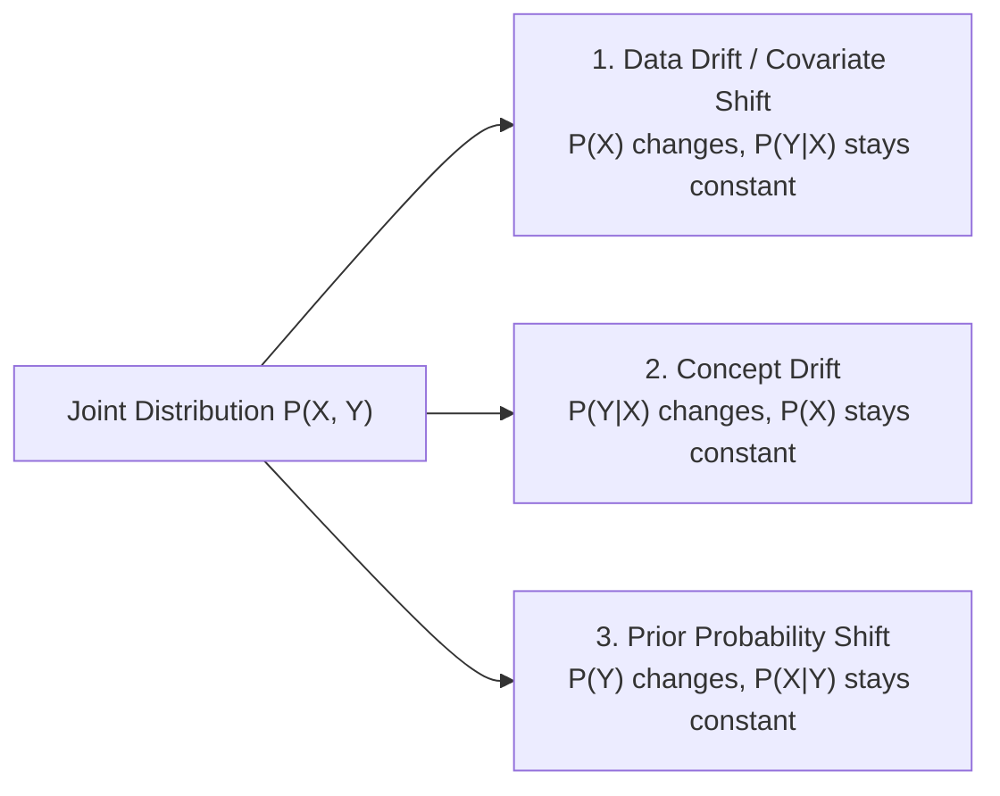
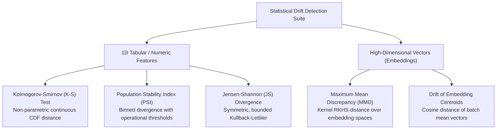
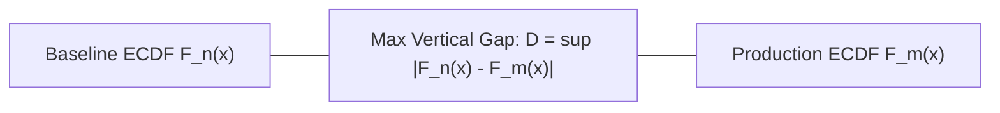
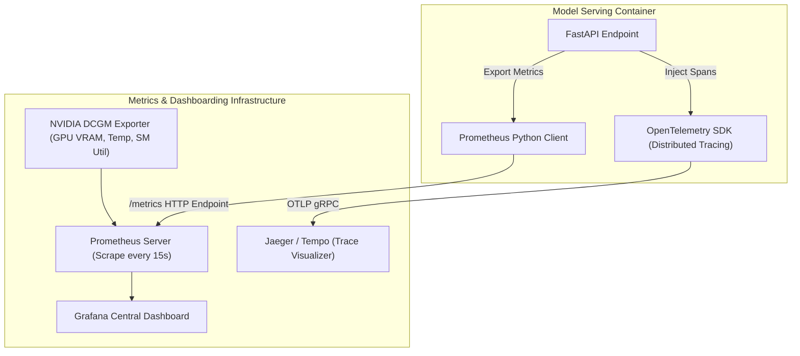
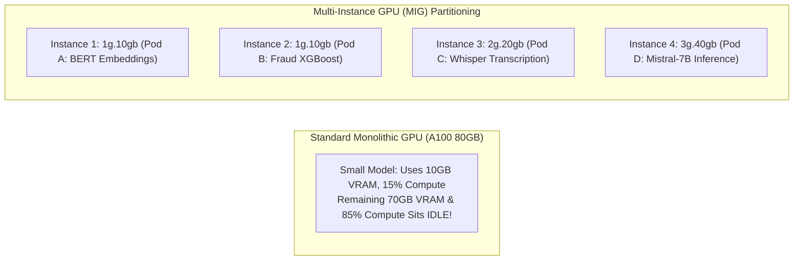

# Model Monitoring, Observability & Automated Retraining

!!! info "Prerequisites"
    Probability distributions, hypothesis testing, divergence metrics, and distributed serving. Review [Probability & Statistics](../02-mathematics/probability-statistics-deep-dive.md), [Evaluation Metrics](../05-ml-theory/evaluation-metrics-deep-dive.md), and [Model Serving, Pipelines & Distributed Orchestration](serving-pipelines-orchestration-deep-dive.md).

---

## 1. The Big Picture: Silent Failures in Production AI

Unlike conventional software systems—where bugs trigger uncaught exceptions, core dumps, or HTTP 500 status codes—machine learning models fail **silently**. A degraded model continues to return HTTP 200 OK responses with syntactically valid JSON payloads while making catastrophically erroneous business predictions.



Operating production AI systems requires:
1. **Mathematical Drift Detection**: Distinguishing between temporary sampling noise and true statistical divergence in tabular distributions, predicted labels, and high-dimensional vector embeddings.
2. **Unified Observability**: Correlating low-level infrastructure telemetry (GPU VRAM saturation, CUDA kernel execution times) with high-level statistical health (model confidence degradation, calibration error).
3. **Automated Retraining Triggers**: Safely closing the feedback loop between inference drift signals, data re-annotation, model re-training, and automated evaluation gates.
4. **Resilient Deployment Topologies**: Mitigating blast radius through shadow deployments, canary rollouts, and mathematically powered A/B testing.
5. **GPU Cost & Infrastructure Optimization**: Leveraging Multi-Instance GPU (MIG) slicing, spot orchestration, and dynamic auto-scaling to avoid runaway cloud bills.

---

## 2. The Taxonomy of Model Degradation

Model degradation stems from shifts in the joint probability distribution $P(\mathbf{x}, y)$ of input features $\mathbf{x} \in \mathcal{X}$ and target ground truth $y \in \mathcal{Y}$. By Bayes' rule, the joint distribution factors in two ways:

$$P(\mathbf{x}, y) = P(y \mid \mathbf{x}) P(\mathbf{x}) = P(\mathbf{x} \mid y) P(y)$$



### 2.1 Covariate Shift (Data Drift)
- **Definition**: The marginal distribution of input features $P(\mathbf{x})$ shifts over time, but the conditional ground-truth relationship $P(y \mid \mathbf{x})$ remains unchanged:
  
  $$P_{t_1}(\mathbf{x}) \neq P_{t_0}(\mathbf{x}) \quad \text{while} \quad P_{t_1}(y \mid \mathbf{x}) = P_{t_0}(y \mid \mathbf{x})$$
  
- **Concrete Example**: A fraud detection model trained on domestic transactions is deployed internationally. The input transaction amounts and currency codes change ($P(\mathbf{x})$ shifts), but the underlying pattern of what constitutes fraudulent behavior remains identical.
- **Observability**: Can be detected **immediately** in production without waiting for delayed ground-truth labels.

### 2.2 Concept Drift
- **Definition**: The mapping function from features to labels $P(y \mid \mathbf{x})$ shifts, even if the marginal input feature distribution $P(\mathbf{x})$ appears identical:
  
  $$P_{t_1}(y \mid \mathbf{x}) \neq P_{t_0}(y \mid \mathbf{x}) \quad \text{while} \quad P_{t_1}(\mathbf{x}) \approx P_{t_0}(\mathbf{x})$$
  
- **Concrete Example**: Macroeconomic hyperinflation or sudden interest rate hikes. Consumers with identical credit scores and debt-to-income ratios ($P(\mathbf{x})$) begin defaulting at twice the historical rate ($P(y \mid \mathbf{x})$ shifts).
- **Observability**: **Cannot** be detected from input telemetry alone; requires obtaining delayed ground-truth labels ($y$).

### 2.3 Prior Probability Shift (Label Drift)
- **Definition**: The distribution of target classes $P(y)$ shifts, forcing a corresponding shift in $P(\mathbf{x} \mid y)$:
  
  $$P_{t_1}(y) \neq P_{t_0}(y)$$
  
- **Concrete Example**: During an infectious disease epidemic, the base rate of positive viral infection tests ($P(y = 1)$) spikes from $1\%$ to $25\%$.

---

## 3. Drift Detection Mathematics

To detect drift reliably without triggering constant false alarms, production systems rely on rigorous statistical hypothesis tests and information-theoretic divergence metrics.



### 3.1 Kolmogorov-Smirnov (K-S) Two-Sample Test

The two-sample Kolmogorov-Smirnov test is a **non-parametric** hypothesis test that assesses whether two continuous empirical distributions $F_1(x)$ and $F_2(x)$ were drawn from the same underlying population.

#### Mathematical Formulation
Let $\{x_1, \dots, x_n\} \sim P$ be baseline (training) samples and $\{y_1, \dots, y_m\} \sim Q$ be production (serving) samples. The empirical cumulative distribution function (ECDF) is:

$$F_n(x) = \frac{1}{n} \sum_{i=1}^n \mathbb{I}_{(-\infty, x]}(x_i)$$

The Kolmogorov-Smirnov test statistic $D_{n, m}$ is the supremum distance between the two ECDFs:

$$D_{n, m} = \sup_{x \in \mathbb{R}} |F_n(x) - F_m(x)|$$



#### Hypothesis Testing & Asymptotic Critical Values
Under the null hypothesis $H_0: P = Q$, the scaled statistic $\sqrt{\frac{nm}{n+m}} D_{n, m}$ converges asymptotically to the Kolmogorov distribution. We reject $H_0$ at significance level $\alpha$ if:

$$D_{n, m} > c(\alpha) \sqrt{\frac{n + m}{n \cdot m}}$$

Where for $\alpha = 0.05$, $c(\alpha) = 1.36$; for $\alpha = 0.01$, $c(\alpha) = 1.63$.

### 3.2 Population Stability Index (PSI)

Originally developed in quantitative risk and credit scoring, the **Population Stability Index (PSI)** measures the divergence between a reference distribution (baseline training) and an actual distribution (production serving) binned into $k$ discrete buckets.

#### Mathematical Formulation
The continuous feature domain is partitioned into $k$ quantiles based on the baseline distribution (typically $k = 10$, creating deciles where each baseline bin contains exactly $10\%$ of observations: $E_i = 0.10$).

Let $E_i$ be the proportion of baseline samples in bucket $i$, and $A_i$ be the proportion of actual production samples in bucket $i$:

$$\text{PSI} = \sum_{i=1}^k (A_i - E_i) \times \ln\left(\frac{A_i}{E_i}\right)$$

#### Properties of PSI
- **Symmetric Weighting**: The term $(A_i - E_i)$ ensures that bins with greater proportion shifts dominate the metric.
- **Log Ratio**: $\ln(A_i / E_i)$ is positive when actuals exceed baseline ($A_i > E_i$) and negative when actuals shrink ($A_i < E_i$). Thus, $(A_i - E_i) \ln(A_i / E_i) \ge 0$ always.
- **Industry Operational Thresholds**:
  - $\text{PSI} < 0.10$: **Stable**. No significant distribution change; retain current model.
  - $0.10 \le \text{PSI} < 0.20$: **Slight Drift**. Monitor closely; queue data re-validation.
  - $\text{PSI} \ge 0.20$: **Severe Drift**. Urgent action required; trigger retraining DAG or route to fallback baseline.

### 3.3 Kullback-Leibler (KL) & Jensen-Shannon (JS) Divergence

The **Kullback-Leibler (KL) Divergence** from actual distribution $Q$ to reference distribution $P$ is:

$$D_{\text{KL}}(P \parallel Q) = \sum_{x \in \mathcal{X}} P(x) \log\left(\frac{P(x)}{Q(x)}\right)$$

KL divergence is asymmetric ($D_{\text{KL}}(P \parallel Q) \neq D_{\text{KL}}(Q \parallel P)$) and undefined if $Q(x) = 0$ when $P(x) > 0$.

The **Jensen-Shannon (JS) Divergence** resolves these limitations by measuring divergence against the mean mixture $M = \frac{1}{2}(P + Q)$:

$$D_{\text{JS}}(P \parallel Q) = \frac{1}{2} D_{\text{KL}}(P \parallel M) + \frac{1}{2} D_{\text{KL}}(Q \parallel M)$$

- Properties: Symmetric ($D_{\text{JS}}(P \parallel Q) = D_{\text{JS}}(Q \parallel P)$), bounded between $0$ and $1$ (when using base-2 logarithm: $0 \le D_{\text{JS}} \le 1$), and its square root $\sqrt{D_{\text{JS}}}$ is a true metric.

### 3.4 Maximum Mean Discrepancy (MMD) for Embedding Drift

In modern multimodal or LLM systems, inputs are represented as dense embedding vectors $\mathbf{z} \in \mathbb{R}^d$ (where $d = 768$ or $1536$). Univariate tests (K-S, PSI) fail because they ignore high-dimensional cross-feature correlations.

**Maximum Mean Discrepancy (MMD)** maps probability distributions into a Reproducing Kernel Hilbert Space (RKHS) $\mathcal{H}$ endowed with kernel function $k(\mathbf{x}, \mathbf{x}')$:

$$\text{MMD}^2(P, Q) = \left\| \mathbb{E}_{\mathbf{x} \sim P}[\phi(\mathbf{x})] - \mathbb{E}_{\mathbf{y} \sim Q}[\phi(\mathbf{y})] \right\|_{\mathcal{H}}^2$$

Using the kernel trick ($k(\mathbf{x}, \mathbf{y}) = \langle \phi(\mathbf{x}), \phi(\mathbf{y}) \rangle$), MMD is computed without explicitly projecting into infinite dimensions:

$$\text{MMD}^2(P, Q) = \mathbb{E}_{x, x' \sim P}[k(x, x')] - 2\mathbb{E}_{x \sim P, y \sim Q}[k(x, y)] + \mathbb{E}_{y, y' \sim Q}[k(y, y')]$$

Using a Radial Basis Function (RBF) Gaussian kernel $k(\mathbf{x}, \mathbf{y}) = \exp\left(-\frac{\|\mathbf{x} - \mathbf{y}\|^2}{2\sigma^2}\right)$, $\text{MMD}(P, Q) = 0 \iff P = Q$.

---

## 4. Production Drift Detection Implementation

Below is a complete, runnable Python module implementing:
1. Population Stability Index (PSI) with epsilon smoothing (preventing division-by-zero or $\ln(0)$ errors).
2. Kolmogorov-Smirnov 2-sample hypothesis testing with automated $p$-value alerting.
3. Multi-feature automated batch evaluation engine.

```python
import numpy as np
from scipy import stats
from typing import Dict, Any, List, Tuple

class ProductionDriftDetector:
    def __init__(self, baseline_data: np.ndarray, feature_names: List[str], num_bins: int = 10, alpha: float = 0.05):
        """
        baseline_data: shape (N_samples, N_features) representing reference/training data.
        """
        self.baseline_data = baseline_data
        self.feature_names = feature_names
        self.num_bins = num_bins
        self.alpha = alpha
        self.bin_edges: Dict[int, np.ndarray] = {}
        self.baseline_proportions: Dict[int, np.ndarray] = {}
        self._precompute_baseline_bins()

    def _precompute_baseline_bins(self):
        """Precomputes quantile bin edges from baseline data for PSI calculation."""
        num_features = self.baseline_data.shape[1]
        for f_idx in range(num_features):
            col = self.baseline_data[:, f_idx]
            # Compute quantile cutoffs
            quantiles = np.linspace(0, 100, self.num_bins + 1)
            edges = np.percentile(col, quantiles)
            # Ensure unique bin edges by jittering identical percentiles
            edges = np.unique(edges)
            if len(edges) < 2:
                edges = np.array([col.min() - 1e-5, col.max() + 1e-5])
            self.bin_edges[f_idx] = edges

            # Compute reference proportions with Laplace-style epsilon smoothing
            counts, _ = np.histogram(col, bins=edges)
            proportions = (counts + 1e-4) / (len(col) + 1e-4 * len(counts))
            self.baseline_proportions[f_idx] = proportions

    def compute_psi(self, feature_idx: int, production_col: np.ndarray) -> float:
        """Computes Population Stability Index for a given feature."""
        edges = self.bin_edges[feature_idx]
        baseline_prop = self.baseline_proportions[feature_idx]

        # Bin production data using baseline bin edges
        prod_counts, _ = np.histogram(production_col, bins=edges)
        prod_prop = (prod_counts + 1e-4) / (len(production_col) + 1e-4 * len(prod_counts))

        # Vectorized PSI computation
        psi_value = np.sum((prod_prop - baseline_prop) * np.log(prod_prop / baseline_prop))
        return float(psi_value)

    def compute_ks_test(self, feature_idx: int, production_col: np.ndarray) -> Tuple[float, float]:
        """Computes 2-sample Kolmogorov-Smirnov test returning (statistic, p_value)."""
        baseline_col = self.baseline_data[:, feature_idx]
        ks_res = stats.ks_2samp(baseline_col, production_col)
        return float(ks_res.statistic), float(ks_res.pvalue)

    def evaluate_batch(self, production_data: np.ndarray) -> Dict[str, Any]:
        """Runs full drift diagnosis across all features for a production batch."""
        results = {}
        critical_alerts = []

        for f_idx, name in enumerate(self.feature_names):
            prod_col = production_data[:, f_idx]
            psi = self.compute_psi(f_idx, prod_col)
            ks_stat, ks_pval = self.compute_ks_test(f_idx, prod_col)

            # Categorize drift status
            if psi >= 0.20 or ks_pval < (self.alpha / len(self.feature_names)):  # Bonferroni correction
                status = "CRITICAL_DRIFT"
                critical_alerts.append(name)
            elif psi >= 0.10:
                status = "MODERATE_DRIFT"
            else:
                status = "STABLE"

            results[name] = {
                "psi": round(psi, 4),
                "ks_statistic": round(ks_stat, 4),
                "ks_p_value": round(ks_pval, 6),
                "status": status,
            }

        return {
            "feature_metrics": results,
            "has_critical_drift": len(critical_alerts) > 0,
            "alerted_features": critical_alerts,
        }

if __name__ == "__main__":
    np.random.seed(42)
    # 1. Baseline Training Distribution (e.g., standard normal)
    baseline = np.random.normal(loc=0.0, scale=1.0, size=(5000, 3))
    feature_names = ["credit_score_norm", "debt_ratio", "income_log"]

    detector = ProductionDriftDetector(baseline, feature_names)

    # 2. Production Batch with Covariate Shift on Feature 0 ('credit_score_norm')
    prod_batch = np.random.normal(loc=0.0, scale=1.0, size=(1000, 3))
    # Inject significant distribution shift on credit_score_norm (mean shifts from 0 to 0.45)
    prod_batch[:, 0] = np.random.normal(loc=0.45, scale=1.2, size=1000)

    report = detector.evaluate_batch(prod_batch)
    print("--- Drift Evaluation Report ---")
    for feat, metrics in report["feature_metrics"].items():
        print(f"Feature: {feat:<18} | PSI: {metrics['psi']:<6} | KS p-val: {metrics['ks_p_value']:<8} | Status: {metrics['status']}")
    print(f"Trigger Automated Retraining: {report['has_critical_drift']}")
```

---

## 5. Observability Stack: Prometheus, Grafana & OpenTelemetry

A robust MLOps observability framework bridges infrastructure telemetry and model-specific metrics.



### 5.1 Prometheus Model Metrics Suite
A production AI service must expose the following metric categories:
1. **Serving Performance (RED Method)**:
   - *Rate*: `model_prediction_requests_total{model="churn", version="v2"}`
   - *Errors*: `model_prediction_exceptions_total{type="ValidationException"}`
   - *Duration*: `model_inference_latency_seconds_bucket{le="0.01", le="0.05", le="0.1"}` (P50, P95, P99 histograms)
2. **Model Behavior & Confidence**:
   - `model_prediction_output_distribution{bin="0.8-1.0"}`
   - `model_prediction_confidence_histogram`
3. **Hardware Saturation (DCGM)**:
   - `DCGM_FI_DEV_GPU_UTIL`: Compute core saturation percentage.
   - `DCGM_FI_DEV_FB_USED`: Physical VRAM allocated (in megabytes).
   - `DCGM_FI_DEV_MEM_COPY_UTIL`: PCIe/NVLink memory bandwidth saturation.

### 5.2 OpenTelemetry Distributed Tracing

In modern agentic or multi-stage systems (e.g. Gateway $\to$ Feature Store $\to$ Reranker $\to$ LLM), request latency spikes must be isolated to individual distributed spans:

```python
from opentelemetry import trace
from opentelemetry.trace import Status, StatusCode

tracer = trace.get_tracer("mlops.inference.tracer")

async def handle_inference_pipeline(user_id: str, query: str):
    with tracer.start_as_current_span("inference_pipeline") as parent_span:
        parent_span.set_attribute("user.id", user_id)

        # Span 1: Feature Retrieval
        with tracer.start_as_current_span("fetch_online_features") as feat_span:
            features = await fetch_features_from_redis(user_id)
            feat_span.set_attribute("features.count", len(features))

        # Span 2: Tensor Inference
        with tracer.start_as_current_span("model_forward_pass") as model_span:
            model_span.set_attribute("model.name", "TwoTowerReranker")
            logits = model_engine.predict(features)
            model_span.set_attribute("model.batch_size", 1)

        return logits
```

---

## 6. Deployment Topologies: Shadow, Canary & A/B Testing

When rolling out a newly retrained model version, deploying straight to $100\%$ production traffic (**Big Bang deployment**) invites disaster. Production systems adopt progressive exposure strategies.

```mermaid
flowchart TD
    subgraph Shadow["1. Shadow Deployment (Dark Traffic)"]
        UserS["User Request"] --> ProxyS["Service Mesh / Gateway"]
        ProxyS -->|Live Response| ProdModel["Champion Model (v1)"]
        ProxyS -.->|Async Fork / Dark Traffic| ShadowModel["Challenger Model (v2) (Output Dropped)"]
    end

    subgraph Canary["2. Canary Rollout (Traffic Splitting)"]
        UserC["User Traffic"] --> RouterC["Ingress Router"]
        RouterC -->|90% Traffic| ProdC["Champion Model (v1)"]
        RouterC -->|10% Traffic| CanaryC["Canary Model (v2)"]
    end

    subgraph AB["3. A/B Hypothesis Testing"]
        UserAB["Randomized Users"] --> Splitter["Salted Hash User Splitter"]
        Splitter -->|Bucket A (Control)| ModelA["Model A (Baseline)"]
        Splitter -->|Bucket B (Treatment)| ModelB["Model B (Retrained)"]
        ModelA --> MetricDB["Business Conversion / Revenue Tracking"]
        ModelB --> MetricDB
    end
```

### 6.1 Shadow Deployment (Dark Traffic Mirroring)
- **Mechanism**: The API gateway or service mesh (Envoy/Istio) receives production traffic and routes it to the live Champion model (`v1`). Simultaneously, an asynchronous duplicate of the request payload is cloned and sent to Challenger model (`v2`). The response from `v2` is logged for offline comparison but discarded without being returned to the user.
- **Advantages**: Zero blast radius. Validates performance, latency, memory consumption, and concurrency limits of the new model under live production traffic without risking customer experience.

### 6.2 Canary Rollout
- **Mechanism**: Traffic is partitioned at the ingress router. Initially, $2\%$ of traffic is routed to the new model; if P99 latency and error rates remain stable, traffic is incrementally stepped up ($10\% \to 25\% \to 50\% \to 100\%$).
- **Advantage**: Real user feedback with strictly bounded blast radius if an unhandled edge case crashes the container.

### 6.3 A/B Testing Mathematics: Statistical Power & Sample Size

In an A/B test, we evaluate whether Challenger model $B$ produces a statistically significant lift over Champion model $A$ on a business metric (e.g. conversion rate $p$).

#### Hypothesis Formulation
- Null Hypothesis $H_0: p_B - p_A = 0$
- Alternative Hypothesis $H_1: p_B - p_A = \delta \quad (\delta > 0)$

#### Sample Size Determination
To detect a minimum detectable effect (MDE) $\delta$ with statistical significance $\alpha$ (Type I error rate, typically $0.05$) and statistical power $1 - \beta$ (where $\beta$ is Type II error rate, typically $0.20 \implies 80\%$ power), the required sample size per variant is:

$$N = \frac{2 \left( Z_{\alpha/2} + Z_{\beta} \right)^2 \sigma^2}{\delta^2}$$

Where:
- $Z_{\alpha/2}$ is the standard normal critical value ($1.96$ for $\alpha = 0.05$).
- $Z_{\beta}$ is the power critical value ($0.84$ for $80\%$ power).
- $\sigma^2$ is the pooled variance: $\sigma^2 \approx \bar{p}(1 - \bar{p})$ for binary conversion rates.

If an A/B test is terminated before collecting $N$ samples per variant, the test suffers from **peeking bias**, drastically inflating false-positive discovery rates.

---

## 7. GPU Cost Optimization: MIG Slicing & Spot Instances

Hardware accelerators represent the single largest operational cost in modern AI infrastructure. Operating unoptimized GPU clusters leads to massive financial waste.



### 7.1 Multi-Instance GPU (MIG) Slicing
On NVIDIA Ampere and Hopper architectures (A100, H100), **Multi-Instance GPU (MIG)** hardware-partitions a single physical GPU into up to **7 independent GPU instances**:
- Each instance possesses physically isolated High-Bandwidth Memory (HBM), memory crossbar paths, and Streaming Multiprocessors (SMs).
- Unlike software multi-tenancy (which suffers from "noisy neighbor" cache thrashing), MIG provides strict hardware Quality of Service (QoS): a memory fault or OOM crash in one slice cannot crash adjacent slices.
- *Cost Impact*: Allows running seven distinct production microservices on a single $80\text{ GB}$ GPU, reducing physical GPU instance provisioning costs by up to $85\%$.

### 7.2 Spot Instance Orchestration for Retraining
- **Spot / Preemptible VMs**: Cloud providers (AWS, Azure, GCP) offer excess GPU capacity at an $60 - 80\%$ discount, with the caveat that instances can be terminated with a 30-to-120-second warning.
- **Resilient Retraining Architecture**:
  1. Training runs must utilize frequent **distributed checkpointing** (`torch.save()`) to remote object storage (S3/GCS) at the end of every epoch.
  2. Implement an automated checkpoint-resume hook in the Airflow or Kubernetes job spec:
  ```python
  if os.path.exists("s3://models/checkpoints/latest.pt"):
      checkpoint = torch.load("s3://models/checkpoints/latest.pt")
      model.load_state_dict(checkpoint["model"])
      optimizer.load_state_dict(checkpoint["optimizer"])
      start_epoch = checkpoint["epoch"] + 1
  ```
  3. Combine spot GPU node pools for training with on-demand node pools for low-latency serving, optimizing cost without risking serving availability.

---

## 8. Common Errors, Anti-Patterns & Production Debugging

### Error 1: Division by Zero and Infinite Divergence in PSI Calculations
- **Symptom**: Drift detection scripts crash with `ZeroDivisionError` or return `inf` / `nan` values for the Population Stability Index.
- **Root Cause**: A bin established during baseline training contains zero production observations ($A_i = 0$), causing $\ln(A_i / E_i) = \ln(0) = -\infty$, or a feature value appears outside the baseline range, creating a bucket with zero baseline samples ($E_i = 0$), causing division by zero.
- **Diagnosis**: Check raw histogram frequency tables before computing log ratios.
- **Fix**: Apply Laplace-style smoothing epsilon ($\epsilon = 10^{-4}$) to both baseline and actual counts:
```python
prod_prop = (counts + 1e-4) / (total_samples + 1e-4 * num_bins)
```

### Error 2: False Positive Drift Alarms from Small Production Sample Batches
- **Symptom**: Automated retraining pipelines trigger multiple times daily during low-traffic windows (e.g. 03:00 AM UTC).
- **Root Cause**: Evaluating K-S tests or PSI over under-sized production batches ($N < 200$). Statistical variance in small sample sizes routinely mimics distribution shifts, rejecting $H_0$ prematurely.
- **Fix**: Enforce a minimum sample threshold ($N_{\min} \ge 1000$) before computing drift metrics, or employ time-window rolling buffers (e.g. evaluating 24-hour sliding windows rather than instantaneous micro-batches).

### Error 3: Shadow Traffic Contaminating Downstream Transactional Systems
- **Symptom**: Test user accounts receive duplicated SMS notifications or payment charges during shadow deployment of a newly retrained model.
- **Root Cause**: The challenger model executed business logic hooks or downstream database writes that were not mocked or sandboxed during shadow traffic processing.
- **Fix**: Enforce read-only isolation for shadow deployments. Shadow models must evaluate forward passes strictly in read-only mode, logging predictions to analytics tables while disabling transactional side effects.

---

## 9. Staff-Level Technical Interview Questions

### Q1: Detail the mathematical and operational differences between the Kolmogorov-Smirnov (K-S) test and the Population Stability Index (PSI) for drift detection. Under what conditions would you choose one over the other?

**Model Answer:**  
- **Kolmogorov-Smirnov (K-S) Test**:
  - *Mathematical Nature*: Non-parametric continuous two-sample hypothesis test computing the supremum distance between empirical cumulative distribution functions: $D = \sup_x |F_1(x) - F_2(x)|$.
  - *Advantages*: Binning-free (avoids arbitrary quantization artifacts); yields formal $p$-values based on the Kolmogorov distribution, providing statistical guarantees under the null hypothesis.
  - *Weaknesses*: Highly sensitive to sample size $N$; when evaluating large enterprise datasets ($N > 100,000$), trivially small, practically irrelevant variations produce $p < 10^{-15}$, causing severe false-alarm fatigue.
- **Population Stability Index (PSI)**:
  - *Mathematical Nature*: Binned discrete divergence metric derived from symmetric Kullback-Leibler divergence: $\sum (A_i - E_i) \ln(A_i / E_i)$.
  - *Advantages*: Robust against massive sample sizes; provides universally accepted operational thresholds ($<0.1$ stable, $>0.2$ severe drift); directly reflects bin-level magnitude shifts.
  - *Weaknesses*: Requires careful binning and smoothing to avoid zero-count infinities; sensitive to binning strategies (quantile vs equal-width).
- *Staff Recommendation*: Use K-S tests for low-to-medium volume, continuous features where formal statistical significance is required. Use PSI for high-volume tabular streaming features and score distributions where operational thresholds must dictate automated retraining.

---

### Q2: How does Maximum Mean Discrepancy (MMD) detect covariate shift in high-dimensional embedding spaces, and why do univariate tests fail?

**Model Answer:**  
- **Failure of Univariate Tests**: In an embedding space $\mathbb{R}^d$ ($d = 768$), running 768 individual K-S or PSI tests assumes individual dimensions are mutually independent. This introduces two fatal flaws:
  1. *Multiple Testing Problem*: Testing 768 hypotheses inflates family-wise error rates ($\alpha_{\text{total}} = 1 - (1 - \alpha)^d \approx 1.0$), generating continuous false alarms unless heavily penalized by Bonferroni corrections.
  2. *Loss of Cross-Correlation*: Semantic concepts in deep representations are encoded across complex, non-linear manifolds. Two embedding distributions can have identical marginal 1D distributions along every coordinate axis while possessing entirely disjoint joint representations.
- **MMD Mechanics**: MMD maps the full joint distribution into a Reproducing Kernel Hilbert Space (RKHS) $\mathcal{H}$ via feature map $\phi(\mathbf{x})$. By using a characteristic kernel (such as the Gaussian RBF kernel $k(\mathbf{x}, \mathbf{y}) = \exp(-\gamma \|\mathbf{x} - \mathbf{y}\|^2)$), the distance between mean embeddings $\|\mu_P - \mu_Q\|_{\mathcal{H}}$ is zero if and only if $P = Q$. Thus, MMD captures all higher-order statistical moments and multi-dimensional correlations in a single scalar distance metric.

---

### Q3: Explain the concept of "peeking bias" in online A/B testing of machine learning models. How does it corrupt statistical validity?

**Model Answer:**  
- **The Mechanism**: Classical Neyman-Pearson hypothesis testing requires calculating the fixed sample size $N$ upfront based on desired statistical power ($1 - \beta$) and significance level ($\alpha$), collecting all $N$ observations, and conducting the test statistic evaluation exactly once.
- **Peeking Bias**: When engineers or product teams continuously monitor A/B test dashboards daily and stop the experiment as soon as $p < 0.05$ appears, they violate the sampling distribution assumptions.
- **Statistical Consequence**: Under the null hypothesis $H_0$, the $p$-value fluctuates as a random walk over time. Repeatedly checking whether the random walk has crossed the significance threshold is equivalent to performing multiple dependent hypothesis tests. If an experiment is checked 10 times during its collection phase, the true Type I error rate (false positive rate) escalates from the nominal $\alpha = 0.05$ to over $0.20-0.30$.
- *Remediation*: Enforce strict sample size commitments before testing, or transition to **Sequential Probability Ratio Testing (SPRT)** or **Bayesian Multi-Armed Bandits**, which allow continuous stopping without alpha inflation.

---

### Q4: Formulate an automated, event-driven model retraining architecture. What guardrails prevent a corrupted retraining pipeline from pushing a broken model to production?

**Model Answer:**  
1. **Trigger Phase**: The production drift detector logs consecutive drift anomalies ($\text{PSI} > 0.20$ across key features over a 24-hour window) and emits an event to a Kafka topic or Cloud Pub/Sub.
2. **Orchestration Phase**: Apache Airflow or Kubeflow Pipelines consumes the event, spins up an isolated Kubernetes GPU training pod, pulls fresh ground-truth data from the offline feature store, and initiates warm-start fine-tuning.
3. **Automated Quality Guardrails (Pre-Promotion Gates)**:
   - *Data Contract Gate*: Asserts zero missing values, verifies label balance, and rejects batches where volume drops below statistical thresholds.
   - *Baseline Superiority Gate*: The retrained Challenger must outperform the existing Champion model on a held-out, golden validation benchmark across primary business metrics (e.g. $\Delta \text{ROC-AUC} \ge +0.015$).
   - *Behavioral CheckList Gate*: Passes $100\%$ of critical Minimum Functionality Tests (MFT) and Directional Expectation Tests (DIR) to prevent regression on mission-critical edge cases.
   - *Latency & Memory Gate*: The candidate model container is deployed to a staging environment; load tests verify that P99 latency remains within the SLA ($<50\text{ ms}$) under $2\times$ production load.
4. **Promotion Phase**: Only upon passing all four gates is the model artifact tagged `@challenger` in the MLflow Model Registry and promoted to a Canary deployment.

---

### Q5: How does Multi-Instance GPU (MIG) differ from time-slicing GPU virtualization in Kubernetes?

**Model Answer:**  
- **Time-Slicing (Software Virtualization)**:
  - Multiple pods share the same physical GPU by time-multiplexing access to the execution engine.
  - *Failure Modes*: No memory isolation; if one pod allocates excess VRAM, all pods on the GPU crash with CUDA OOM errors. Memory cache thrashing occurs as CUDA contexts are swapped in and out, introducing severe latency jitter.
- **Multi-Instance GPU (MIG)**:
  - Silicon-level hardware partitioning available on NVIDIA Ampere/Hopper GPUs.
  - Divides the physical GPU into distinct hardware instances (e.g. up to 7 instances on an A100), each with dedicated Streaming Multiprocessors (SMs), dedicated memory controllers, and isolated physical SRAM/HBM blocks.
  - *Guarantees*: Complete fault isolation (an OOM crash in Instance 1 has zero impact on Instance 2); deterministic memory bandwidth and latency QoS; independent CUDA execution streams running simultaneously without context switching.

---

## 10. Mastery Ladder

- [ ] **L1:** Differentiate mathematically between Covariate Shift, Concept Drift, and Prior Probability Shift.
- [ ] **L2:** Formulate the two-sample Kolmogorov-Smirnov test and calculate the supremum distance $D$.
- [ ] **L3:** Implement Population Stability Index (PSI) from scratch and explain the operational meaning of $\text{PSI} < 0.1$ vs $\text{PSI} > 0.2$.
- [ ] **L4:** Apply Laplace-style epsilon smoothing to eliminate zero-bin division errors in empirical divergence metrics.
- [ ] **L5:** Explain why univariate drift tests fail on high-dimensional text/image embeddings and formulate Maximum Mean Discrepancy (MMD).
- [ ] **L6:** Instrument a Python inference service with Prometheus histograms and OpenTelemetry distributed tracing spans.
- [ ] **L7:** Compare Shadow, Canary, and A/B deployment topologies in terms of operational complexity and blast radius.
- [ ] **L8:** Derive the minimum sample size equation required to power an A/B test without peeking bias.
- [ ] **L9:** Partition an NVIDIA A100 GPU using Multi-Instance GPU (MIG) to eliminate noisy-neighbor interference across inference pods.
- [ ] **L10:** Construct an end-to-end automated drift detection and retraining loop featuring automated pre-promotion validation guardrails.
