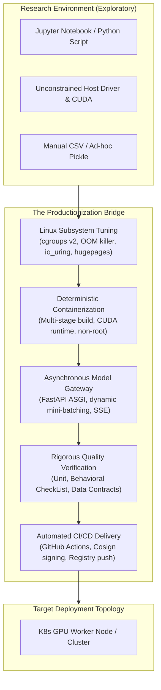
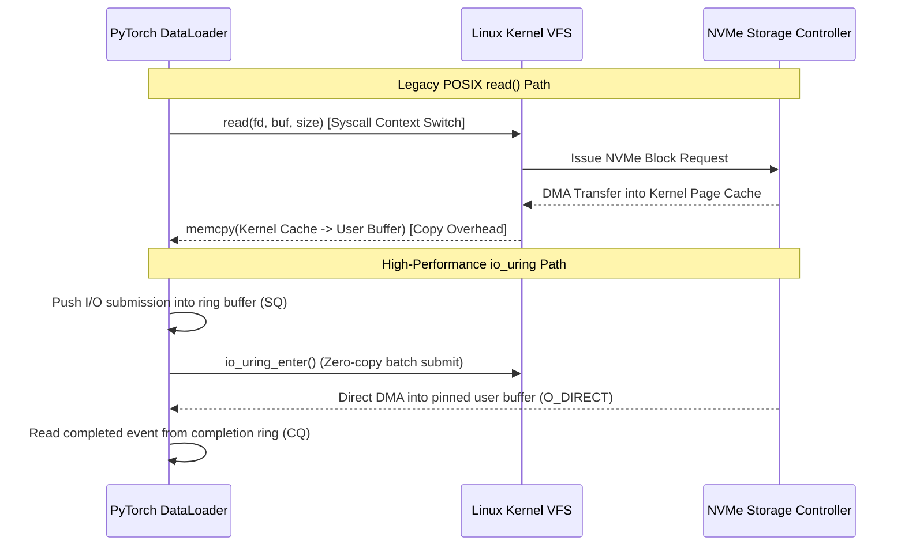
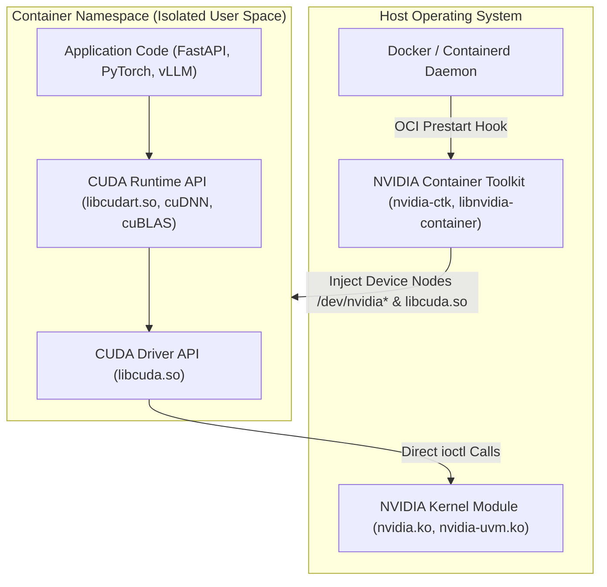
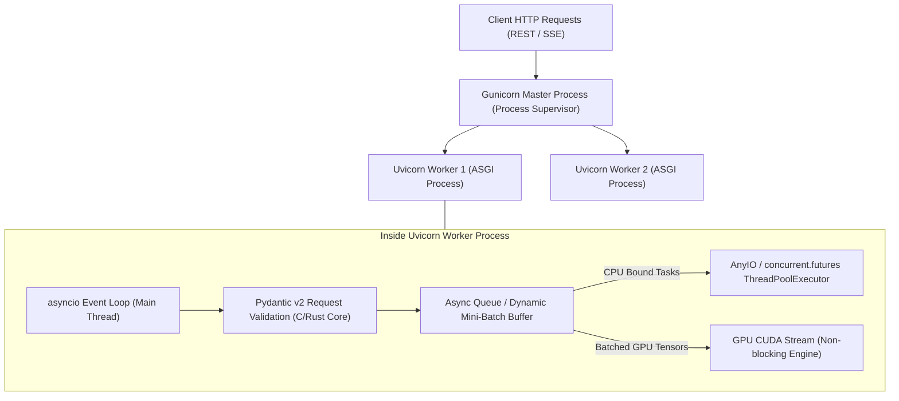
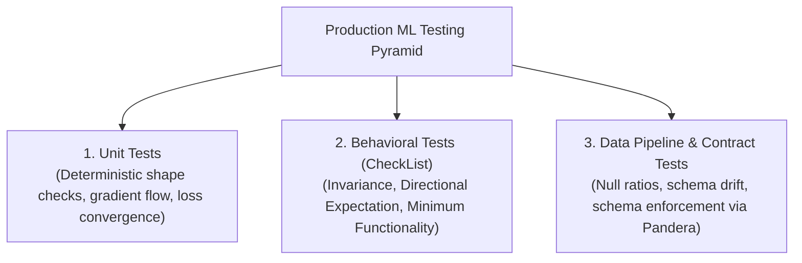
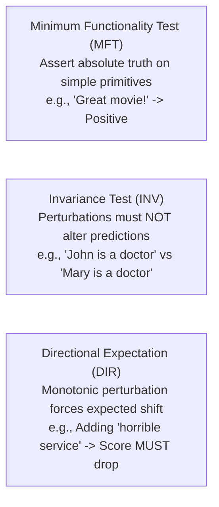

# Production Tooling, Containerization & CI/CD for AI Systems

!!! info "Prerequisites"
    Familiarity with Python internals, asynchronous programming, and neural network inference. Review [Python Advanced Concurrency](../01-python/advanced-python-deep-dive.md), [Python Internals](../01-python/internals-deep-dive.md), and [Deep Learning Neural Network Foundations](../06-deep-learning/neural-network-foundations-deep-dive.md).

---

## 1. The Big Picture: From Notebook to Production Machine Learning

Moving machine learning models from an exploratory Jupyter Notebook to mission-critical production infrastructure is not merely a matter of writing an API wrapper. In research environments, workloads prioritize interactive execution, unconstrained host memory, and synchronous batch computation. In production, AI systems must guarantee bounded latency percentiles ($P_{95}, P_{99} \le 50\text{ ms}$), high throughput (hundreds to thousands of queries per second), strict fault isolation, determinism, and high availability ($99.99\%$).



Production AI engineering requires mastering five foundational pillars:
1. **Operating System & Kernel Architecture**: How the Linux kernel allocates physical memory, balances swap, isolates processes through control groups (`cgroups`), handles inter-process communication (IPC), and schedules asynchronous disk and network I/O (`io_uring`).
2. **Containerization & Driver Integration**: How Docker container layers are cached and constructed, how the NVIDIA Container Toolkit (`nvidia-ctk`) hooks host GPU drivers into isolated namespaces, and how shared memory limits prevent IPC deadlocks in PyTorch data loaders.
3. **High-Performance Serving Gateways**: How the Asynchronous Server Gateway Interface (ASGI) event loop operates, how to decouple CPU-bound tensor execution from I/O polling, and how dynamic mini-batching amortizes model forward pass latency.
4. **Behavioral & Contract-Driven Testing**: Why traditional unit tests are insufficient for stochastic models, and how to implement directional expectation tests, minimum functionality tests, and data contract validations.
5. **Continuous Integration & Continuous Delivery (CI/CD)**: How to automate code quality gates, deterministic image builds, artifact provenance signing, and automated staging deployments using GitHub Actions.

---

## 2. Linux Systems Programming for AI Engineers

Production machine learning workloads push the Linux kernel to its limits. Training and inference processes saturate memory bandwidth, trigger high page-fault frequencies, and exhaust kernel-level inter-process communication pipes.

```mermaid
flowchart LR
    subgraph KernelSpace["Linux Kernel Space"]
        VMM["Virtual Memory Manager (Paging, Page Tables)"]
        OOM["OOM Killer Engine (oom_score, oom_score_adj)"]
        CgroupEngine["cgroups v2 (memory.max, cpu.max, io.weight)"]
        IOUring["io_uring / NVMe Direct I/O"]
    end

    subgraph UserSpace["User Space (AI Workload)"]
        PyTorchWorker["PyTorch / TensorRT Worker Process"]
        SharedMem["POSIX Shared Memory (/dev/shm)"]
        DataLoader["Multi-process DataLoaders (fork/spawn)"]
    end

    DataLoader <-->|IPC Shared Memory Tensors| SharedMem
    SharedMem <--> PyTorchWorker
    PyTorchWorker -->|Syscalls: mmap, epoll, io_uring_enter| KernelSpace
    CgroupEngine -->|Throttle CPU / Reclaim Page Cache| PyTorchWorker
    OOM -.->|SIGKILL (Exit Code 137)| PyTorchWorker
```

### 2.1 Virtual Memory, Page Faults, and the OOM Killer

In Linux, user-space processes do not interact directly with physical RAM. Instead, the kernel provides an abstracted **virtual address space** split into fixed-size pages (typically $4\text{ KB}$, or $2\text{ MB} / 1\text{ GB}$ with HugePages).

When an AI process calls `malloc()` or `torch.empty()`, the kernel uses lazy allocation: it allocates a virtual memory range (via `mmap()` or `brk()`) without immediately assigning physical RAM frames. When the process actually writes to that tensor, the CPU Hardware Memory Management Unit (MMU) raises a **Page Fault interrupt** (`SIGSEGV` or minor page fault), causing the kernel to allocate a physical page frame and map it into the process's page table.

#### The Out-Of-Memory (OOM) Killer Mechanics
Linux allows **memory overcommit** (`/proc/sys/vm/overcommit_memory = 0` or `1`), gambling that processes will not simultaneously utilize their full virtual allocations. When physical memory and swap are exhausted, the kernel invokes the **OOM Killer** (`mm/oom_kill.c`).

The OOM Killer calculates an badness score for every active process:

$$\text{oom\_score} = \frac{\text{RSS} + \text{swap\_usage}}{\text{total\_physical\_ram}} \times 1000 + \text{oom\_score\_adj}$$

Where:
- $\text{RSS}$ is the Resident Set Size (pages physically resident in RAM).
- $\text{oom\_score\_adj} \in [-1000, 1000]$ is a user-configurable bias stored in `/proc/<PID>/oom_score_adj`.
- If $\text{oom\_score\_adj} = -1000$, the process is completely immune from OOM termination.

When an AI model loads large weight matrices or experiences unbounded request queues, its RSS balloons, driving its `oom_score` close to $1000$. The kernel abruptly sends `SIGKILL` (signal 9), yielding container exit code:

$$\text{Exit Code} = 128 + 9 = 137$$

### 2.2 Control Groups (cgroups v2) and Resource Throttling

Modern container runtimes rely on Linux `cgroups v2` to enforce hard and soft resource ceilings. In Kubernetes and Docker:
- `memory.max`: Hard upper limit. If process memory exceeds this threshold and cannot be reclaimed by evicting page cache, the kernel triggers the cgroup OOM killer.
- `memory.high`: Soft limit. Exceeding this triggers memory throttling and synchronous page-cache reclamation, slowing down process execution without immediate termination.
- `cpu.max`: Enforces quota within a fixed period (typically $100\text{ ms} = 100,000\text{ }\mu\text{s}$). If a container is assigned $2.5\text{ CPUs}$, `cpu.max` is configured as `250000 100000`. Once the process consumes $250\text{ ms}$ of aggregated CPU runtime within the $100\text{ ms}$ wall-clock window, the kernel scheduler completely freezes the process threads until the next period begins (**CPU Throttling**).

### 2.3 Inter-Process Communication (IPC) and Shared Memory (`/dev/shm`)

In deep learning frameworks like PyTorch, multi-worker data loading (`DataLoader(num_workers > 0)`) uses Python's multiprocessing subsystem. Rather than serializing multidimensional NumPy arrays or PyTorch tensors over network sockets or UNIX domain pipes (which introduces prohibitive serialization and copy overhead), PyTorch passes tensor memory via **POSIX shared memory** backed by the RAM filesystem `/dev/shm`.

The standard default `/dev/shm` size in Docker containers is only $64\text{ MB}$. When workers stream large image batches or audio tensors into shared memory:
```bash
# Typical crash symptom:
RuntimeError: DataLoader worker (pid 142) is killed by signal: Bus error (core dumped).
```
A **Bus Error** (`SIGBUS`) occurs because the kernel mapped a file in `/dev/shm`, but when the worker attempted to write past the $64\text{ MB}$ allocation limit, the underlying tmpfs volume failed to supply physical pages. Containers running distributed training or multi-worker data loaders must be provisioned with `--shm-size=16gb` or mounted with `emptyDir.medium: Memory` in Kubernetes.

### 2.4 High-Performance I/O: From POSIX `read()` to `io_uring` and Direct I/O

When training on massive vision or language datasets (terabytes of image or audio files), traditional synchronous system calls (`read()`, `pread()`) force thread context switches from user space to kernel space for every file segment:



1. **POSIX `read()` Overhead**: Requires copying data twice (storage $\to$ kernel page cache $\to$ user-space buffer) and executing two CPU privilege context switches per read.
2. **Direct I/O (`O_DIRECT`)**: Bypasses the OS page cache entirely, streaming raw disk blocks straight into user memory, preventing double-buffering and memory bloat.
3. **`io_uring` (Linux 5.1+)**: Provides two lockless ring buffers shared directly between user space and kernel space: the **Submission Queue (SQ)** and **Completion Queue (CQ)**. Processes submit hundreds of asynchronous read/write requests without invoking repetitive system calls, drastically minimizing kernel context switching latency when streaming millions of dataset shards.

---

## 3. Production Docker Containerization for GPU Workloads

A standard container encapsulates code and user-space dependencies. However, deep learning models interact directly with hardware accelerators (GPUs, TPUs, NPUs) requiring tight coordination between kernel modules and user-space libraries.



### 3.1 The NVIDIA Container Toolkit Architecture

Docker isolated namespaces cannot access host hardware devices by default. The **NVIDIA Container Toolkit** (`nvidia-ctk`) solves this using an OCI (Open Container Initiative) prestart hook:
1. When Docker starts a container with `--gpus all` (or `device_requests`), containerd invokes `nvidia-container-runtime-hook`.
2. The hook inspects the host's installed NVIDIA driver version.
3. It selectively mounts the required character device nodes (`/dev/nvidia0`, `/dev/nvidiactl`, `/dev/nvidia-uvm`) and injects the host's dynamic user-space driver libraries (e.g., `libcuda.so.1`, `libnvidia-ml.so`) into the container's root filesystem.
4. Consequently, the Docker image **must never package the kernel driver**; it only packages the user-space CUDA runtime libraries (`libcudart.so`).

### 3.2 CUDA Image Variants: `base` vs `runtime` vs `devel`

NVIDIA publishes three distinct base image tiers on Docker Hub (`nvidia/cuda`):
- `base`: Contains only the CUDA runtime entrypoint and dynamic driver stubs (`libcuda.so`). Ultra-lightweight ($~150\text{ MB}$), but cannot run any framework compiled with cuDNN or cuBLAS unless packaged separately.
- `runtime`: Contains `base` plus precompiled runtime libraries: cuBLAS, cuDNN, NCCL, and TensorRT. Ideal for production inference containers ($~2-3\text{ GB}$).
- `devel`: Contains `runtime` plus the complete CUDA Compiler driver (`nvcc`), C/C++ header files (`cuda.h`), and static development archives. Necessary only when compiling custom C++/CUDA kernels (e.g. FlashAttention, vLLM custom ops) ($~5-8\text{ GB}$).

### 3.3 Multi-Stage Docker Build Mechanics

To produce hardened, lean production images, we decouple the build environment (which requires compilers, headers, and git) from the final runtime image:

```dockerfile
# -------------------------------------------------------------
# Stage 1: Build & Dependency Resolution
# -------------------------------------------------------------
FROM nvidia/cuda:12.4.1-devel-ubuntu22.04 AS builder

# Prevent interactive prompts
ENV DEBIAN_FRONTEND=noninteractive \
    PYTHONUNBUFFERED=1 \
    PIP_NO_CACHE_DIR=1

RUN apt-get update && apt-get install -y --no-install-recommends \
    python3-dev \
    python3-pip \
    build-essential \
    git \
    && rm -rf /var/lib/apt/lists/*

WORKDIR /build

# Copy dependency specifications first to maximize layer cache re-use
COPY requirements.txt .

# Install wheels into an isolated virtual environment
RUN python3 -m pip install --upgrade pip setuptools wheel && \
    python3 -m pip install --prefix=/install -r requirements.txt

# -------------------------------------------------------------
# Stage 2: Hardened Production Runtime
# -------------------------------------------------------------
FROM nvidia/cuda:12.4.1-runtime-ubuntu22.04 AS runner

ENV DEBIAN_FRONTEND=noninteractive \
    PYTHONUNBUFFERED=1 \
    PATH="/install/bin:$PATH" \
    PYTHONPATH="/install/lib/python3.10/dist-packages:$PYTHONPATH"

# Install only minimal runtime dependencies
RUN apt-get update && apt-get install -y --no-install-recommends \
    python3 \
    ca-certificates \
    && rm -rf /var/lib/apt/lists/*

# Copy pre-built wheels and binaries from builder stage
COPY --from=builder /install /install

# Security: Create non-root system user and group
RUN groupadd -g 10001 appgroup && \
    useradd -u 10001 -g appgroup -s /bin/bash -m appuser

WORKDIR /app

# Copy application code with proper ownership
COPY --chown=appuser:appgroup src/ /app/src/

# Switch to unprivileged user
USER appuser:appgroup

# Healthcheck configuration
HEALTHCHECK --interval=30s --timeout=5s --start-period=60s --retries=3 \
    CMD python3 -c "import urllib.request; urllib.request.urlopen('http://localhost:8000/healthz')" || exit 1

EXPOSE 8000

ENTRYPOINT ["uvicorn", "src.main:app", "--host", "0.0.0.0", "--port", "8000", "--workers", "2", "--lifespan", "on"]
```

---

## 4. Production Serving with FastAPI & High-Throughput I/O

Serving machine learning models requires bridging two conflicting operational models:
1. **Network I/O Handling**: Highly concurrent, non-blocking asynchronous event loops suited for HTTP request ingestion, connection pooling, and payload validation.
2. **Tensor Inference Execution**: Compute-heavy, memory-bandwidth-bound matrix multiplications that saturate CPU/GPU cores and block the Python thread.



### 4.1 Asynchronous Event Loops vs. CPU-Bound Tensor Inference

Python's `asyncio` is single-threaded cooperatively scheduled concurrency. If a developer runs a raw PyTorch forward pass directly inside an `async def` FastAPI route:
```python
# ANTI-PATTERN: Completely stalls all concurrent connections!
@app.post("/predict")
async def predict(data: InputSchema):
    tensor = preprocess(data.text)
    # BLOCKS THE ENTIRE ASYNCIO EVENT LOOP FOR 80ms!
    output = model(tensor) 
    return {"prediction": output.tolist()}
```
While `model(tensor)` executes on the CPU or synchronizes with the GPU via `.item()` or `.tolist()`, the Python main thread is blocked. No other network requests can be accepted, health checks fail, and latency percentiles skyrocket.

#### The Concurrency Solution: Threadpools and Process Pools
- For **lightweight CPU inference** or I/O-bound pre-processing, delegate the blocking function to the worker threadpool using FastAPI's background runner:
  ```python
  from starlette.concurrency import run_in_threadpool
  result = await run_in_threadpool(blocking_inference, tensor)
  ```
- For **GPU inference**, requests should feed into an asynchronous queue processed by a background worker that dynamically groups concurrent inputs into a single batched tensor pass.

### 4.2 Dynamic Mini-Batching Mechanics

GPU Tensor Cores achieve maximum floating-point efficiency when computing large matrix multiplications. Executing single-item inferences ($B = 1$) underutilizes GPU compute cores while incurring constant PCIe kernel-launch overhead:

$$\text{Kernel Launch Overhead} \approx 5 - 15\text{ }\mu\text{s}$$

Dynamic batching collects incoming requests over a short time window $W$ (e.g. $5 - 10\text{ ms}$) or until a maximum batch size $B_{\max}$ is reached, before firing a single forward pass:

```mermaid
sequenceDiagram
    participant C1 as Client 1 (t = 0ms)
    participant C2 as Client 2 (t = 2ms)
    participant C3 as Client 3 (t = 4ms)
    participant Engine as Dynamic Batcher Engine
    participant GPU as GPU Forward Pass (B = 3)

    C1->>Engine: Enqueue Request 1
    Note over Engine: Timer starts (Window W = 5ms)
    C2->>Engine: Enqueue Request 2
    C3->>Engine: Enqueue Request 3
    Note over Engine: Timer expires at t = 5ms; Batch size = 3
    Engine->>GPU: Execute forward_pass(Tensor[3, Dim])
    GPU-->>Engine: Returns Tensor[3, OutDim]
    Engine-->>C1: Return Response 1
    Engine-->>C2: Return Response 2
    Engine-->>C3: Return Response 3
```

### 4.3 Complete Production FastAPI Service Implementation

Below is a complete, runnable, production-grade FastAPI service implementing:
- Pydantic v2 validation contracts.
- Asynchronous lifespan management (warmup, resource allocation, clean shutdown).
- Dynamic mini-batch queue running in a dedicated background task.
- Server-Sent Events (SSE) streaming endpoint.

```python
import asyncio
import time
import logging
from contextlib import asynccontextmanager
from typing import List, AsyncGenerator
import torch
import torch.nn as nn
from pydantic import BaseModel, Field, field_validator
from fastapi import FastAPI, HTTPException, status
from fastapi.responses import StreamingResponse

logging.basicConfig(level=logging.INFO, format="%(asctime)s [%(levelname)s] %(message)s")
logger = logging.getLogger("model-serving")

# --- Domain & Validation Contracts (Pydantic v2) ---

class InferenceRequest(BaseModel):
    features: List[float] = Field(..., min_length=4, max_length=4, description="Feature vector [x1, x2, x3, x4]")

    @field_validator("features")
    @classmethod
    def validate_finite(cls, v: List[float]) -> List[float]:
        for val in v:
            if not (-1e6 <= val <= 1e6):
                raise ValueError("Feature values must be finite and within [-1e6, 1e6]")
        return v

class InferenceResponse(BaseModel):
    class_id: int
    confidence: float
    latency_ms: float

class BatchItem:
    def __init__(self, features: List[float], future: asyncio.Future):
        self.features = features
        self.future = future

# --- Neural Network Model Stub ---

class ProductionClassifier(nn.Module):
    def __init__(self):
        super().__init__()
        self.net = nn.Sequential(
            nn.Linear(4, 32),
            nn.ReLU(),
            nn.Linear(32, 2)
        )
        self.eval()

    def forward(self, x: torch.Tensor) -> torch.Tensor:
        with torch.no_grad():
            return self.net(x)

# --- Dynamic Batching Worker ---

class DynamicBatcher:
    def __init__(self, model: nn.Module, max_batch_size: int = 32, max_latency_sec: float = 0.008):
        self.model = model
        self.max_batch_size = max_batch_size
        self.max_latency_sec = max_latency_sec
        self.queue: asyncio.Queue[BatchItem] = asyncio.Queue()
        self.worker_task: asyncio.Task | None = None
        self._running = False

    def start(self):
        self._running = True
        self.worker_task = asyncio.create_task(self._process_loop())
        logger.info("Dynamic batcher worker loop started.")

    async def stop(self):
        self._running = False
        if self.worker_task:
            self.worker_task.cancel()
            try:
                await self.worker_task
            except asyncio.CancelledError:
                pass
        logger.info("Dynamic batcher worker loop shut down cleanly.")

    async def predict(self, features: List[float]) -> tuple[int, float]:
        loop = asyncio.get_running_loop()
        future: asyncio.Future = loop.create_future()
        await self.queue.put(BatchItem(features, future))
        return await future

    async def _process_loop(self):
        while self._running:
            batch: List[BatchItem] = []
            try:
                # Wait for first item
                item = await self.queue.get()
                batch.append(item)
                start_time = time.monotonic()

                # Accumulate further items until max_batch_size or max_latency_sec expires
                while len(batch) < self.max_batch_size:
                    elapsed = time.monotonic() - start_time
                    remaining = self.max_latency_sec - elapsed
                    if remaining <= 0:
                        break
                    try:
                        next_item = await asyncio.wait_for(self.queue.get(), timeout=remaining)
                        batch.append(next_item)
                    except asyncio.TimeoutError:
                        break

                # Execute batched forward pass
                inputs = torch.tensor([b.features for b in batch], dtype=torch.float32)
                logits = self.model(inputs)
                probabilities = torch.softmax(logits, dim=-1)
                confidences, predictions = torch.max(probabilities, dim=-1)

                # Fulfill promises
                for idx, b in enumerate(batch):
                    if not b.future.done():
                        b.future.set_result((int(predictions[idx].item()), float(confidences[idx].item())))

            except asyncio.CancelledError:
                break
            except Exception as e:
                logger.error(f"Inference batch execution failed: {e}")
                for b in batch:
                    if not b.future.done():
                        b.future.set_exception(e)

# --- FastAPI Application & Lifespan ---

batcher: DynamicBatcher | None = None

@asynccontextmanager
async def lifespan(app: FastAPI):
    global batcher
    logger.info("Initializing neural weights and runtime buffers...")
    model = ProductionClassifier()
    # Model warm-up to compile CUDA graphs or warm memory caches
    dummy = torch.randn(1, 4)
    model(dummy)

    batcher = DynamicBatcher(model=model, max_batch_size=16, max_latency_sec=0.005)
    batcher.start()
    yield
    logger.info("Cleaning up runtime resources...")
    if batcher:
        await batcher.stop()

app = FastAPI(
    title="Production Inference Microservice",
    version="1.0.0",
    lifespan=lifespan
)

@app.get("/healthz", status_code=status.HTTP_200_OK)
async def health_check():
    if batcher is None:
        raise HTTPException(status_code=503, detail="Model engine not ready")
    return {"status": "healthy"}

@app.post("/v1/predict", response_model=InferenceResponse)
async def predict_endpoint(payload: InferenceRequest):
    if batcher is None:
        raise HTTPException(status_code=503, detail="Service initializing")
    t0 = time.perf_counter()
    pred_class, confidence = await batcher.predict(payload.features)
    latency_ms = (time.perf_counter() - t0) * 1000.0
    return InferenceResponse(
        class_id=pred_class,
        confidence=confidence,
        latency_ms=round(latency_ms, 2)
    )

@app.get("/v1/stream-tokens")
async def stream_tokens_endpoint(prompt: str) -> StreamingResponse:
    """Demonstrates Server-Sent Events (SSE) streaming output."""
    async def token_generator() -> AsyncGenerator[str, None]:
        tokens = f"Generating analytical response for prompt: {prompt}".split()
        for token in tokens:
            await asyncio.sleep(0.04)  # Simulate inter-token generation latency (40ms)
            yield f"data: {token} \n\n"
        yield "data: [DONE]\n\n"

    return StreamingResponse(token_generator(), media_type="text/event-stream")
```

---

## 5. Machine Learning Testing Methodologies

Conventional software testing asserts deterministic inputs and outputs ($f(x) == y$). Machine learning models, however, are non-deterministic, probabilistic approximations trained on high-dimensional distributions. ML testing must span three distinct tiers:



### 5.1 Unit Testing: Gradients, Invariants, and Convergence

Unit tests verify that code components conform to basic numerical and algorithmic invariants:
1. **Tensor Shape Invariance**: Verify output dimensions match expected batch sizes and channel lengths across all layer boundaries.
2. **Gradient Flow**: Ensure no layers produce zero or NaN gradients during backpropagation (detecting vanishing/exploding gradients).
3. **Overfitting on Single Batch**: A neural network implementation should be able to overfit a 2-sample batch to near-zero loss ($\mathcal{L} \le 10^{-4}$) within 100 iterations. If it cannot, the architecture contains fundamental bugs (e.g., misconfigured loss reduction, disconnected gradient graphs, or wrong activation functions).

### 5.2 Behavioral Testing: The CheckList Framework

Introduced by [Ribeiro et al. (2020)](https://arxiv.org/abs/2005.04118), behavioral testing treats the model as a black box and validates linguistic or feature behaviors:



1. **Minimum Functionality Tests (MFT)**: Unit tests for models. Simple, unambiguous examples that any baseline model must classify correctly.
   - Example: `"The service was fantastic." \implies P(\text{Positive}) > 0.95`.
2. **Invariance Tests (INV)**: Introduce input perturbations that should have zero semantic impact on the prediction.
   - Example (Name Swapping): Replace names, locations, or dates in text. Changing `"Customer Alex was denied"` to `"Customer Jordan was denied"` must yield $|\hat{y}_1 - \hat{y}_2| \le \epsilon$.
3. **Directional Expectation Tests (DIR)**: Apply perturbations that must move the model's confidence in a deterministic direction.
   - Example: In credit scoring, increasing an applicant's verified annual income while holding all other features constant must **monotonically increase** or maintain credit approval probability:

$$\frac{\partial \hat{y}}{\partial (\text{Income})} \ge 0$$

### 5.3 Automated Pipeline Testing with Pytest and Pandera

```python
import pytest
import numpy as np
import torch
import pandera.polars as pa
import polars as pl
from pydantic import BaseModel

# --- 1. Data Contract Validation with Pandera ---

class FeatureSchema(pa.DataFrameModel):
    user_id: pa.Int64 = pa.Field(ge=1)
    age: pa.Int64 = pa.Field(in_range={"min_value": 18, "max_value": 120})
    annual_income: pa.Float64 = pa.Field(ge=0.0)
    churn_label: pa.Int64 = pa.Field(isin=[0, 1])

def test_data_pipeline_contract():
    raw_data = pl.DataFrame({
        "user_id": [101, 102, 103],
        "age": [25, 45, 60],
        "annual_income": [55000.0, 120000.0, 85000.0],
        "churn_label": [0, 1, 0]
    })
    validated_df = FeatureSchema.validate(raw_data)
    assert validated_df.shape[0] == 3

# --- 2. Model Gradient Flow & Overfitting Unit Test ---

def test_model_overfit_single_batch():
    model = torch.nn.Sequential(
        torch.nn.Linear(8, 16),
        torch.nn.ReLU(),
        torch.nn.Linear(16, 1)
    )
    optimizer = torch.optim.Adam(model.parameters(), lr=0.05)
    loss_fn = torch.nn.MSELoss()

    x = torch.randn(4, 8)
    y = torch.tensor([[1.0], [0.0], [1.0], [0.0]])

    initial_loss = loss_fn(model(x), y).item()
    for _ in range(120):
        optimizer.zero_grad()
        loss = loss_fn(model(x), y)
        loss.backward()
        optimizer.step()

    final_loss = loss.item()
    assert final_loss < 0.01, f"Model failed to overfit dummy batch. Initial: {initial_loss}, Final: {final_loss}"

# --- 3. Behavioral Invariance Test ---

def test_behavioral_invariance():
    # Mock inference function
    def sentiment_predict(text: str) -> float:
        # Returns probability of positive sentiment
        if "horrible" in text.lower():
            return 0.1
        return 0.9

    base_text = "The doctor, Mr. Smith, was very helpful."
    perturbed_text = "The doctor, Ms. Davis, was very helpful."

    score_base = sentiment_predict(base_text)
    score_perturbed = sentiment_predict(perturbed_text)

    # Invariance condition: Name change must not alter sentiment by more than 1e-4
    assert abs(score_base - score_perturbed) < 1e-4
```

---

## 6. Continuous Integration & Continuous Delivery (CI/CD)

A production MLOps pipeline enforces quality gates before code or container images can be promoted to staging or production clusters.


### 6.1 GitHub Actions Workflow Definition

Below is an enterprise-grade GitHub Actions CI/CD workflow (`.github/workflows/mlops-pipeline.yml`):

```yaml
name: MLOps Production CI/CD Pipeline

on:
  push:
    branches: [main]
  pull_request:
    branches: [main]

env:
  REGISTRY: ghcr.io
  IMAGE_NAME: ${{ github.repository }}/model-service

jobs:
  code-quality-and-tests:
    runs-on: ubuntu-latest
    steps:
      - name: Checkout Code
        uses: actions/checkout@v4

      - name: Set up Python 3.10
        uses: actions/setup-python@v5
        with:
          python-version: "3.10"
          cache: "pip"

      - name: Install Dependencies
        run: |
          python -m pip install --upgrade pip
          pip install ruff mypy pytest pandera polars torch

      - name: Lint with Ruff
        run: ruff check .

      - name: Static Type Check with MyPy
        run: mypy src/ --ignore-missing-imports

      - name: Run Test Suite (Unit & Behavioral)
        run: pytest tests/ -v --maxfail=1

  build-and-publish:
    needs: code-quality-and-tests
    if: github.ref == 'refs/heads/main' && github.event_name == 'push'
    runs-on: ubuntu-latest
    permissions:
      contents: read
      packages: write
      id-token: write

    steps:
      - name: Checkout Code
        uses: actions/checkout@v4

      - name: Set up Docker Buildx
        uses: docker/setup-buildx-action@v3

      - name: Log in to GitHub Container Registry
        uses: docker/login-action@v3
        with:
          registry: ${{ env.REGISTRY }}
          username: ${{ github.actor }}
          password: ${{ secrets.GITHUB_TOKEN }}

      - name: Extract Metadata (Tags & Labels)
        id: meta
        uses: docker/metadata-action@v5
        with:
          images: ${{ env.REGISTRY }}/${{ env.IMAGE_NAME }}
          tags: |
            type=sha,format=long,prefix=sha-
            type=raw,value=latest

      - name: Build and Push Docker Image
        uses: docker/build-push-action@v5
        id: build-push
        with:
          context: .
          file: ./Dockerfile
          push: true
          tags: ${{ steps.meta.outputs.tags }}
          labels: ${{ steps.meta.outputs.labels }}
          cache-from: type=gha
          cache-to: type=gha,mode=max

      - name: Install Cosign for Artifact Signing
        uses: sigstore/cosign-installer@v3.5.0

      - name: Sign the Published Container Image
        env:
          TAGS: ${{ steps.meta.outputs.tags }}
          COSIGN_PRIVATE_KEY: ${{ secrets.COSIGN_PRIVATE_KEY }}
          COSIGN_PASSWORD: ${{ secrets.COSIGN_PASSWORD }}
        run: |
          cosign sign --yes --key env://COSIGN_PRIVATE_KEY ${{ env.REGISTRY }}/${{ env.IMAGE_NAME }}@${{ steps.build-push.outputs.digest }}
```

---

## 7. Common Errors, Anti-Patterns & Production Debugging

### Error 1: Container Exits Abruptly with Code 137
- **Symptom**: Docker container crashes silently during high concurrency or model weight loading; `docker inspect` shows `"ExitCode": 137`.
- **Root Cause**: Linux OOM Killer terminated the process (`128 + 9 (SIGKILL)`). The combined resident memory of PyTorch tensor allocations and buffering queues exceeded the Docker `--memory` limit or Kubernetes pod memory limit.
- **Diagnosis**: Run `dmesg -T | grep -i oom` on the host machine to inspect kernel OOM logs and verify memory ceiling violations.
- **Fix**: Adjust container memory allocations, configure model weight quantization (`fp16` / `int8`), or set an upper limit on incoming request queues.

### Error 2: Bus Error (`SIGBUS`) in PyTorch DataLoader
- **Symptom**: `RuntimeError: DataLoader worker (pid XXX) is killed by signal: Bus error (core dumped).`
- **Root Cause**: The default Docker shared memory mount (`/dev/shm`) is capped at $64\text{ MB}$. Inter-process shared memory tensors exhausted the tmpfs volume.
- **Fix**: Launch Docker with `--shm-size=8g` or configure Kubernetes:
```yaml
spec:
  volumes:
    - name: dshm
      emptyDir:
        medium: Memory
        sizeLimit: 8Gi
  containers:
    - name: model-worker
      volumeMounts:
        - mountPath: /dev/shm
          name: dshm
```

### Error 3: Event Loop Starvation from Synchronous Inference
- **Symptom**: Health checks (`/healthz`) time out intermittently, and P99 latency spikes to seconds even under modest traffic loads.
- **Root Cause**: Executing CPU/GPU-bound tensor transformations directly inside an `async def` route without delegating to a background worker or threadpool, blocking the single-threaded asyncio event loop.
- **Fix**: Use `run_in_threadpool` or an asynchronous dynamic batcher with an internal `asyncio.Queue` (as implemented in Section 4).

### Error 4: CUDA Driver / Toolkit Version Incompatibility
- **Symptom**: `CUDA error: no kernel image is available for execution on the device` or `CUDA driver version is insufficient for CUDA runtime version`.
- **Root Cause**: The container's compiled CUDA runtime version requires a newer host NVIDIA driver than what is installed on the host kernel, or the PyTorch binary does not contain PTX/SASS code for the host GPU architecture (Compute Capability).
- **Fix**: Verify host driver compatibility with `nvidia-smi`. Ensure the base Docker image matches the host driver's maximum supported CUDA API version, and build wheels targeting the exact compute capability (e.g. `TORCH_CUDA_ARCH_LIST="8.0;8.6;9.0"`).

---

## 8. Staff-Level Technical Interview Questions

### Q1: Explain the operational differences between ASGI and WSGI. Why is WSGI inadequate for modern LLM token streaming services?

**Model Answer:**  
- **WSGI (Web Server Gateway Interface - PEP 3333)** is a synchronous request-response protocol. Each incoming HTTP request occupies an entire worker process or thread from start to finish. When handling streaming responses (e.g. Large Language Model Server-Sent Events generating 500 tokens over 15 seconds), that thread remains completely blocked, unable to process other requests. Scaling to 1,000 concurrent streaming connections would require 1,000 OS processes, inducing crushing memory consumption and kernel context-switching overhead.
- **ASGI (Asynchronous Server Gateway Interface)** decouples request handling using non-blocking event loops (`asyncio`). An ASGI server (such as Uvicorn) manages thousands of concurrent open HTTP connections on a single OS thread using OS notification mechanisms (`epoll` on Linux, `kqueue` on macOS). For token streaming, the route yields control back to the event loop between tokens (`await asyncio.sleep(...)` or awaiting the next token from an asynchronous queue), multiplexing thousands of concurrent streaming connections with minimal memory overhead.

---

### Q2: What is the exact sequence of events when a containerized process accesses an NVIDIA GPU via Docker `--gpus all`?

**Model Answer:**  
1. **Container Initiation**: Docker delegates container creation to `containerd`, which invokes the OCI runtime (`runc`).
2. **Hook Execution**: An OCI prestart hook registered by the NVIDIA Container Toolkit (`nvidia-container-runtime-hook`) intercepts container setup before the entrypoint launches.
3. **Hardware Discovery**: The hook queries the host kernel via `libnvidia-container` to discover installed NVIDIA GPU devices and driver versions.
4. **Device Node Injection**: The hook dynamically creates device nodes inside the container's `/dev` namespace (e.g. `/dev/nvidia0`, `/dev/nvidiactl`, `/dev/nvidia-uvm`).
5. **Driver Library Mounting**: The hook mounts the host's user-space driver libraries (`libcuda.so`, `libnvidia-ml.so`) from the host into the container's library paths (`/usr/lib/x86_64-linux-gnu`).
6. **Execution**: The application inside the container invokes the CUDA Runtime API (`libcudart.so`), which dispatches calls through the mounted `libcuda.so`, communicating with the host kernel driver (`nvidia.ko`) via `ioctl` system calls.

---

### Q3: Contrast Invariance Tests (INV) and Directional Expectation Tests (DIR) in the CheckList framework. Provide a mathematical formulation and test case for each.

**Model Answer:**  
- **Invariance Tests (INV)** assert that label predictions remain stable under semantic-preserving transformations:
  
  $$\forall x \in \mathcal{X}, \quad |f(x) - f(g_{\text{inv}}(x))| \le \epsilon$$
  
  *Example*: In fraud detection, swapping an applicant's phone number or zip code within the same census tract should not alter the model's calculated fraud risk score.
- **Directional Expectation Tests (DIR)** assert that perturbations designed to push a feature along a known gradient produce monotonic changes in output:
  
  $$\text{If } x' = g_{\text{dir}}(x) \text{ increases risk factors, then } f(x') \ge f(x)$$
  
  *Example*: In an automated loan underwriting model, adding a 90-day delinquency record to a credit history must strictly increase the calculated probability of default or leave it unchanged. Any drop in predicted risk indicates an erroneous model artifact or multicollinearity failure.

---

### Q4: How does Linux cgroups v2 enforce CPU limits, and how does CPU throttling degrade model inference latencies?

**Model Answer:**  
Linux `cgroups v2` enforces CPU allocation using the Completely Fair Scheduler (CFS) bandwidth control parameters defined in `cpu.max = quota period`.  
- Default `period` is typically $100\text{ ms}$ ($100,000\text{ }\mu\text{s}$). If a container is assigned $2.0\text{ CPUs}$, its quota is $200,000\text{ }\mu\text{s}$.
- If an inference microservice spawns 8 threads to process an incoming image batch using OpenMP/MKL, those 8 threads can exhaust the $200,000\text{ }\mu\text{s}$ quota in just $25\text{ ms}$ of elapsed wall-clock time ($8 \times 25\text{ ms} = 200\text{ ms}$).
- For the remaining $75\text{ ms}$ of that $100\text{ ms}$ period, the CFS scheduler **completely deschedules and freezes all container threads**.
- This manifests as severe latency spikes where $P_{50}$ is $25\text{ ms}$, but $P_{99}$ spikes to over $100\text{ ms}$.
- *Mitigation*: Set `OMP_NUM_THREADS` and `TORCH_NUM_THREADS` equal to the integer number of assigned CPU cores, avoiding over-subscription and scheduler throttling.

---

### Q5: How do multi-stage Docker builds optimize image size, attack surface, and build cache invalidation in production ML systems?

**Model Answer:**  
1. **Size Reduction**: Build tools (compilers, headers, git, dev libraries) frequently exceed $2-4\text{ GB}$. Multi-stage builds compile artifacts in a builder image and copy only final compiled binaries and site-packages into a lean runtime image, slashing total image size by up to $75\%$.
2. **Attack Surface Minimization**: Production containers should never package compilers (`gcc`, `g++`), package managers (`apt`, `pip`), or shell utilities that facilitate arbitrary code execution after remote exploit. Running as a non-root user prevents container breakout attacks.
3. **Cache Optimization**: Docker caches layers sequentially. By copying `requirements.txt` and installing wheels in an isolated step before copying dynamic application code (`COPY src/ /app/src/`), code changes do not invalidate the heavy Python dependency installation layer, accelerating CI build cycles from minutes to seconds.

---

## 9. Mastery Ladder

- [ ] **L1:** Explain the lifecycle of physical vs. virtual memory allocation and page faults in Linux.
- [ ] **L2:** Diagnose and resolve container termination with exit code 137 using `dmesg` and `oom_score_adj`.
- [ ] **L3:** Explain why PyTorch multi-process data loaders require configuring `--shm-size` in Docker.
- [ ] **L4:** Describe the internal architecture of the NVIDIA Container Toolkit and its OCI prestart hook.
- [ ] **L5:** Distinguish between NVIDIA CUDA `base`, `runtime`, and `devel` images and identify appropriate production use-cases.
- [ ] **L6:** Construct a multi-stage Dockerfile that separates compiler toolchains from production runtime environments and enforces non-root execution.
- [ ] **L7:** Explain the difference between WSGI and ASGI, and why synchronous tensor calls must be isolated from the asyncio event loop.
- [ ] **L8:** Implement an asynchronous dynamic mini-batching queue in FastAPI to maximize GPU Tensor Core utilization.
- [ ] **L9:** Implement unit, behavioral (CheckList INV, DIR, MFT), and data contract (Pandera) test suites for machine learning models.
- [ ] **L10:** Author a complete GitHub Actions CI/CD pipeline featuring static analysis, container building, and cryptographic image signing with Cosign.
