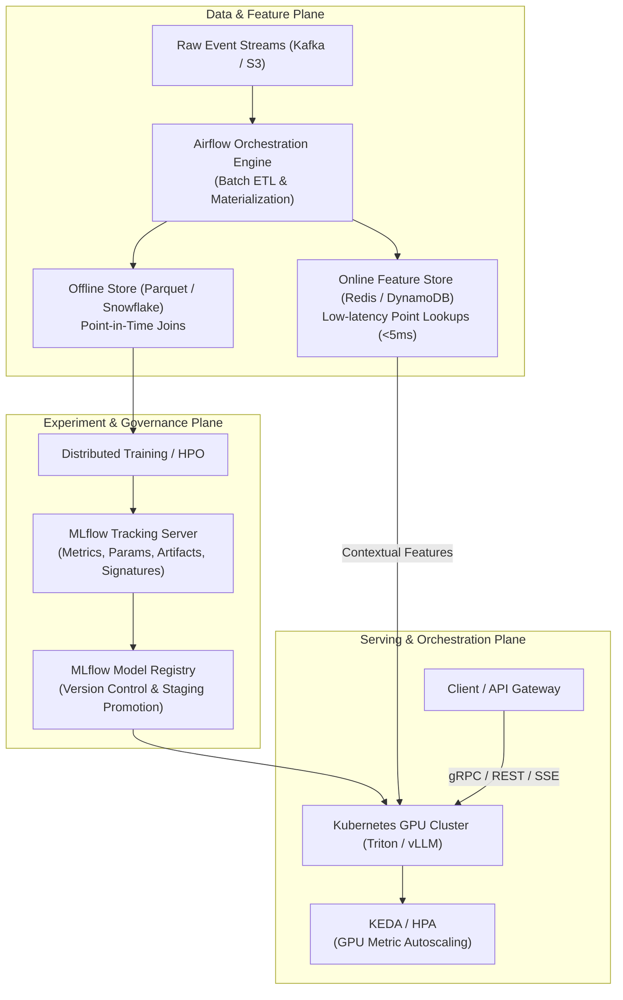
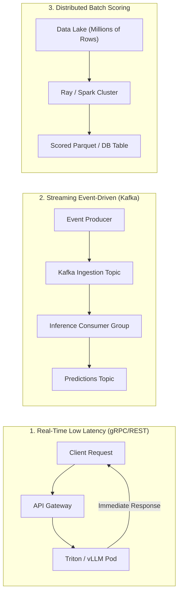
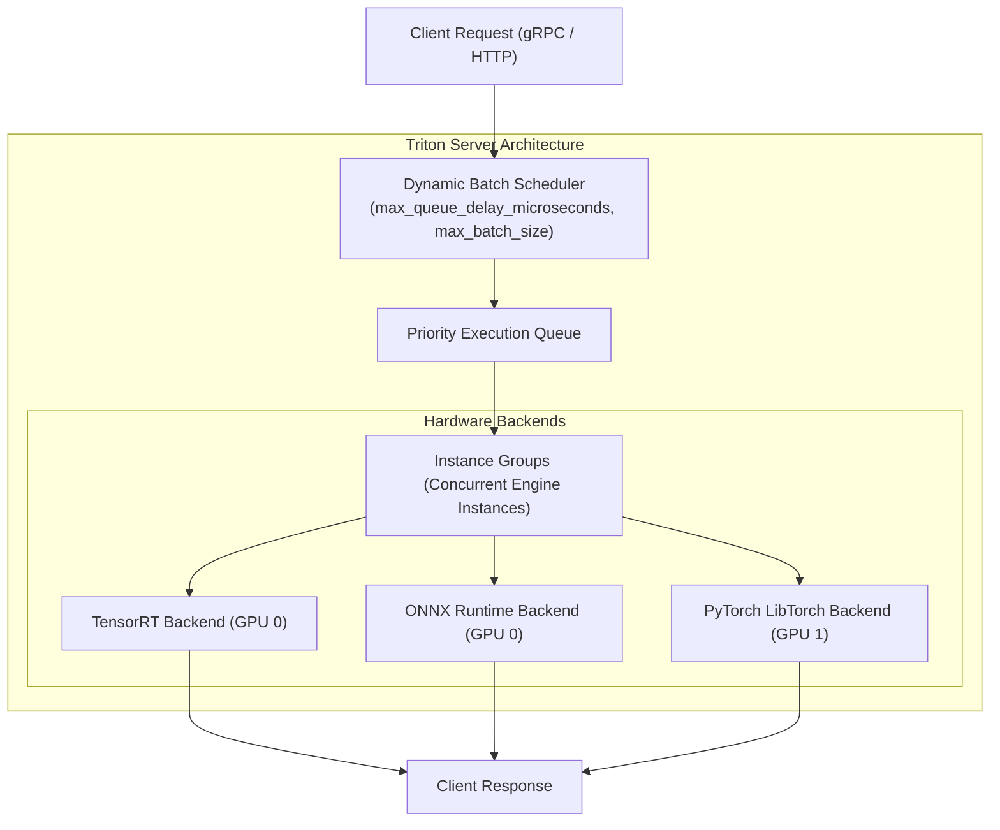
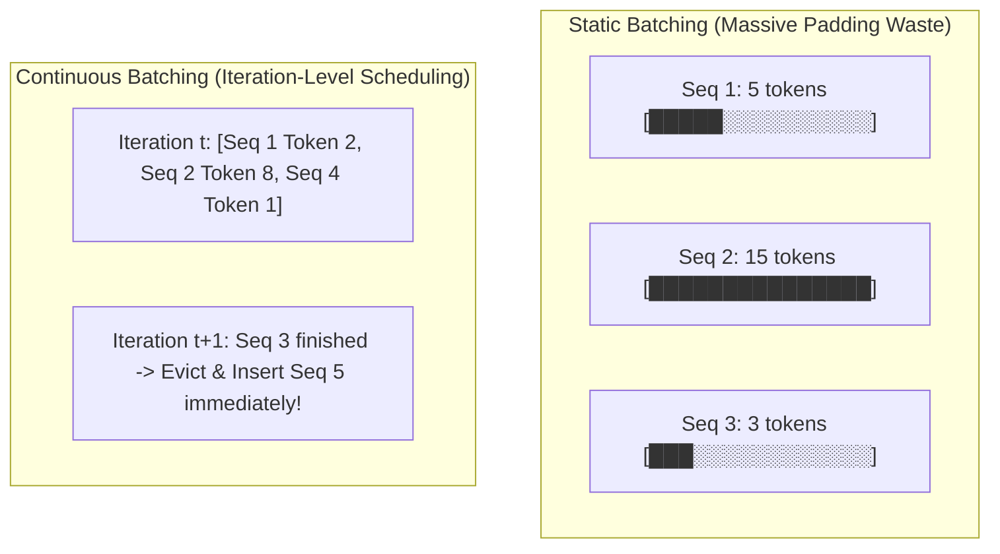
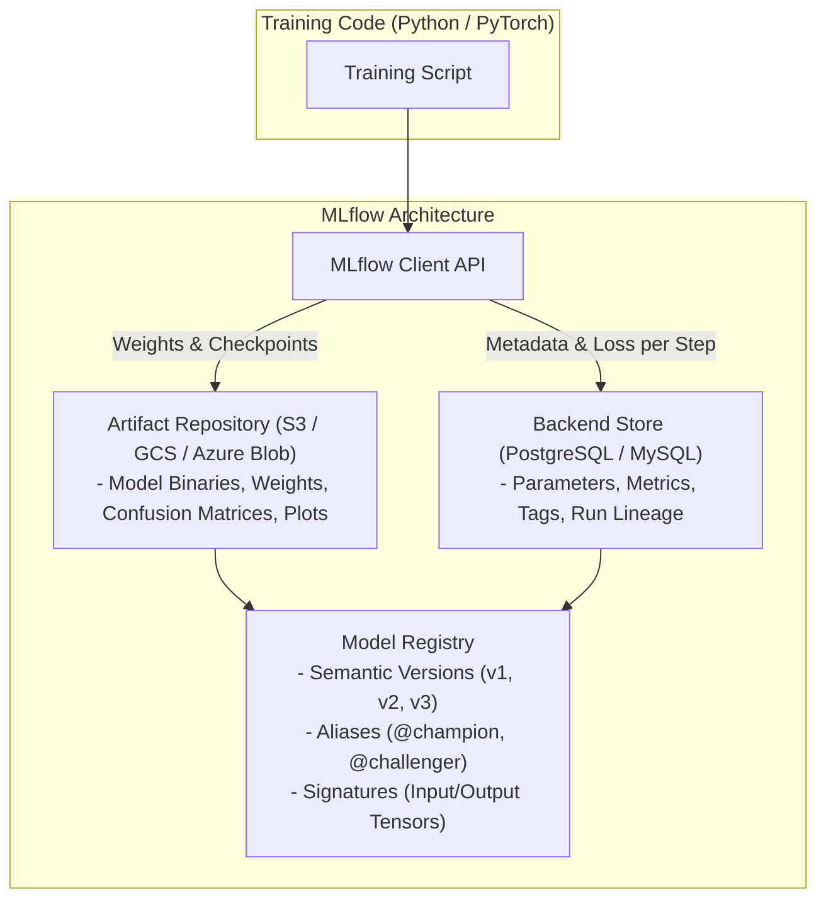
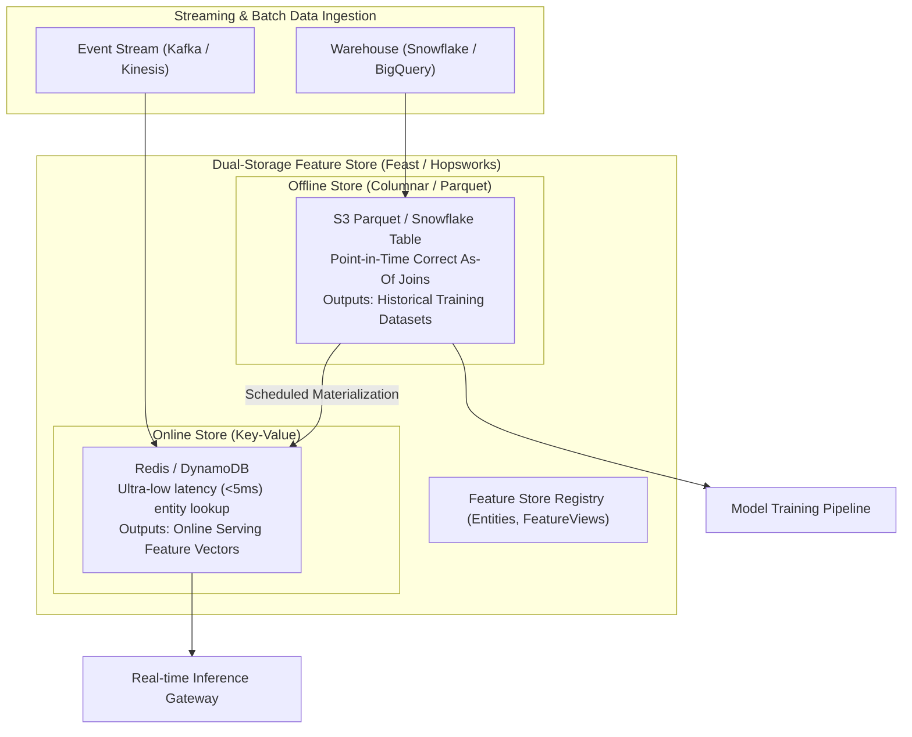
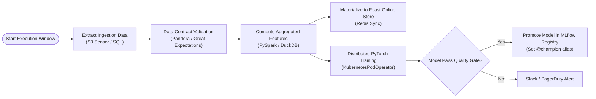

# Model Serving, Pipelines & Distributed Orchestration

!!! info "Prerequisites"
    Distributed computing primitives, asynchronous I/O, container orchestration, and model inference pipelines. Review [Data Formats & Storage](../03-data-engineering/data-formats-storage-deep-dive.md), [Ensemble Learning](../04-classical-ml/ensemble-learning-deep-dive.md), [Transformer Architecture & Mechanics](../09-transformers-llms/transformer-architecture-mechanics-deep-dive.md), and [Production Tooling, Containerization & CI/CD](production-tooling-containerization-cicd-deep-dive.md).

---

## 1. The Big Picture: Industrial-Grade Serving & Orchestration

In an enterprise environment, deploying a machine learning model extends far beyond running an inference server on a single virtual machine. Modern AI systems operate across a distributed continuum: raw events are ingested continuously, transformed into point-in-time consistent features, tracked across hundreds of hyperparameter experiments, versioned in central registries, orchestrated across resilient Directed Acyclic Graphs (DAGs), and autoscaled over heterogeneous GPU clusters in Kubernetes.



The enterprise MLOps lifecycle centers on three critical boundaries:
1. **The Feature Consistency Boundary**: Bridging offline analytical data engines (optimized for multi-terabyte scans) and online operational databases (optimized for sub-5 millisecond key-value lookups) without temporal feature leakage.
2. **The Lineage & Governance Boundary**: Structuring model provenance, metrics, hyperparameters, weights, schemas, and approval workflows from exploratory training to production rollout.
3. **The Distributed Compute Boundary**: Scheduling inference workloads dynamically across Kubernetes pods, utilizing hardware acceleration (GPUs, Tensor Cores), and coordinating continuous batching and multi-worker execution.

---

## 2. Model Serving Paradigms

Selecting an inference serving paradigm requires navigating trade-offs between **latency**, **throughput**, **hardware utilization**, and **system complexity**.

| Serving Paradigm | Transport Protocol | Latency Target | Throughput (QPS) | Typical Use Cases |
| :--- | :--- | :--- | :--- | :--- |
| **Real-time Synchronous** | gRPC / HTTP/2, REST | $5 - 50\text{ ms}$ | $100 - 100,000$ | Fraud detection, search ranking, interactive chat |
| **Asynchronous Streaming** | Kafka, Apache Flink, gRPC SSE | $50 - 500\text{ ms}$ | Continuous Streams | Real-time audio transcription, telemetry anomaly detection |
| **Batch Scoring** | S3 / GCS, Spark, Ray Data | Minutes to Hours | Millions of records/hr | Churn prediction, credit limit re-evaluation, catalog indexing |



### 2.1 Triton Inference Server Architecture

For non-autoregressive deep learning models (ResNet, BERT, XGBoost, DLRM), NVIDIA Triton Inference Server is the gold standard for high-throughput serving.



Key architectural capabilities of Triton:
- **Concurrent Model Execution**: Multiple models or multiple instances of the same model run simultaneously across one or more physical GPUs.
- **Dynamic Batching**: Queues requests from different client threads over a configurable microsecond window (`max_queue_delay_microseconds: 5000`), assembling them into single Tensor Core GEMM operations without modifying client payloads.
- **Model Ensembles & BLS (Business Logic Scripting)**: Chains tokenizers, image normalizers, neural models, and post-processing steps inside the server memory space, eliminating network serialization hops between pipeline stages.

### 2.2 LLM Serving: Continuous Batching & PagedAttention

Traditional static or dynamic mini-batching fails catastrophically for Large Language Models (LLMs) due to the autoregressive generation loop:
1. Different prompts produce wildly varying output token lengths ($L_{\text{out}} \in [1, 2048]$).
2. Static batching forces all sequences in a batch to wait for the slowest sequence to finish generation (**the straggler problem**), wasting GPU FLOPs on padding tokens:

$$\text{Efficiency}_{\text{static}} = \frac{\sum_{i=1}^{B} L_i}{B \times \max_{i}(L_i)} \ll 1.0$$



**Continuous Batching (Iteration-Level Scheduling)** ([Yu et al., 2022 (Orca)](https://www.usenix.org/conference/osdi22/presentation/yu)) resolves this:
- The batch is evaluated at the granularity of a **single token generation step** rather than an entire sequence.
- Sequences that emit the end-of-sequence token (`<eos>`) are evicted immediately. New incoming requests are inserted into the running batch on the very next token iteration.
- Combined with **PagedAttention** ([Kwon et al., 2023](https://arxiv.org/abs/2309.06180)), which partitions Key-Value (KV) cache memory into non-contiguous physical memory blocks (mirroring OS virtual memory pages), GPU memory fragmentation drops from $>60\%$ to $<4\%$, increasing serving throughput by $2-4\times$.

---

## 3. Experiment Tracking & Model Registry (MLflow)

Without disciplined tracking, machine learning development collapses into untracked scripts, lost artifact paths, and unreproducible weights.



### 3.1 MLflow Structural Entities
1. **Backend Store**: Relational database storing metadata: run IDs, experiment names, start/end timestamps, scalar metric series across training steps, hyperparameters, and git commit hashes.
2. **Artifact Repository**: Object store housing heavy files: serialized weights (`model.safetensors`), environment files (`conda.yaml`, `requirements.txt`), and evaluation visualizations.
3. **Model Signature**: Explicit schema specification defining tensor/column types for inputs and outputs, enforced at inference time to prevent runtime schema corruption.

### 3.2 Production MLflow Training & Logging Pipeline

Below is a complete, runnable script establishing an MLflow run, logging metrics at each epoch, capturing model signatures, and registering the model into the centralized registry:

```python
import os
import tempfile
import torch
import torch.nn as nn
from torch.utils.data import DataLoader, TensorDataset
import mlflow
import mlflow.pytorch
from mlflow.models.signature import infer_signature

# Configure MLflow Remote Tracking Server (e.g. deployed on K8s)
MLFLOW_TRACKING_URI = os.getenv("MLFLOW_TRACKING_URI", "http://localhost:5000")
mlflow.set_tracking_uri(MLFLOW_TRACKING_URI)
mlflow.set_experiment("production-churn-classifier")

class ChurnMLP(nn.Module):
    def __init__(self, input_dim: int = 10, hidden_dim: int = 32):
        super().__init__()
        self.net = nn.Sequential(
            nn.Linear(input_dim, hidden_dim),
            nn.BatchNorm1d(hidden_dim),
            nn.ReLU(),
            nn.Dropout(0.2),
            nn.Linear(hidden_dim, 1)
        )

    def forward(self, x: torch.Tensor) -> torch.Tensor:
        return self.net(x)

def train_and_register_model():
    input_dim = 10
    num_samples = 1000
    epochs = 5
    batch_size = 64
    lr = 0.005

    # Synthetic Dataset
    X = torch.randn(num_samples, input_dim)
    y = (torch.sum(X[:, :3], dim=1, keepdim=True) > 0.5).float()
    dataset = TensorDataset(X, y)
    loader = DataLoader(dataset, batch_size=batch_size, shuffle=True)

    model = ChurnMLP(input_dim=input_dim)
    optimizer = torch.optim.Adam(model.parameters(), lr=lr)
    criterion = nn.BCEWithLogitsLoss()

    with mlflow.start_run(run_name="mlp-training-run") as run:
        # 1. Log Hyperparameters
        mlflow.log_params({
            "model_type": "PyTorch-MLP",
            "input_dim": input_dim,
            "hidden_dim": 32,
            "learning_rate": lr,
            "batch_size": batch_size,
            "epochs": epochs
        })

        # 2. Training Loop with Metric Tracking
        model.train()
        for epoch in range(epochs):
            total_loss = 0.0
            for batch_x, batch_y in loader:
                optimizer.zero_grad()
                logits = model(batch_x)
                loss = criterion(logits, batch_y)
                loss.backward()
                optimizer.step()
                total_loss += loss.item() * batch_x.size(0)

            avg_loss = total_loss / num_samples
            mlflow.log_metric("train_bce_loss", avg_loss, step=epoch)

        # 3. Model Signature & Inference Verification
        model.eval()
        sample_input = X[:5].numpy()
        with torch.no_grad():
            sample_output = torch.sigmoid(model(X[:5])).numpy()
        signature = infer_signature(sample_input, sample_output)

        # 4. Log and Register Model
        model_info = mlflow.pytorch.log_model(
            pytorch_model=model,
            artifact_path="model",
            signature=signature,
            registered_model_name="CustomerChurnPredictor"
        )
        print(f"Model logged successfully: {model_info.model_uri}")
        print(f"Registered in MLflow Registry as: CustomerChurnPredictor")

if __name__ == "__main__":
    train_and_register_model()
```

---

## 4. Feature Stores: Dual-Storage & Point-in-Time Correctness

In production ML, feature engineering is plagued by two classic failure modes:
1. **Online/Offline Skew**: Features are computed in SQL/Spark for batch training, but reimplemented in Python/C++ for online serving. Subtly mismatched logic degrades model performance.
2. **Temporal Feature Leakage (Lookahead Bias)**: During training set creation, feature values computed *after* the prediction event timestamp are accidentally joined, giving the model access to future information it will never observe in production.



### 4.1 The Mathematics of Point-in-Time Correctness (As-Of Join)

Suppose we have an entity event table $\mathcal{E}$ containing prediction observation timestamps $T_E$, and a feature update log $\mathcal{F}$ containing feature values $v$ recorded at timestamps $T_F$.

For each observation $(e_i, T_E) \in \mathcal{E}$, the point-in-time correct feature value $v^*$ must satisfy:

$$v^* = \mathcal{F}(e_i, T^*) \quad \text{where} \quad T^* = \max \{ T_F \in \mathcal{F} \mid T_F \le T_E \}$$

```mermaid
timeline
    title Point-in-Time Feature Join (As-Of Logic)
    t = 08:00 : Feature Update v = 12.5 (T_F1)
    t = 11:30 : Prediction Event Observation (T_E) -> Joins v = 12.5!
    t = 12:00 : Feature Update v = 19.8 (T_F2) -> IGNORED (Future Leakage!)
```

Any join that includes feature updates where $T_F > T_E$ leaks future ground truth, artificially inflating offline evaluation metrics while causing severe performance drops in production.

### 4.2 Feast Feature Store Definition

A production Feast setup uses declarative configuration to link offline Parquet logs with online Redis storage:

```python
# feature_store.py
from datetime import timedelta
from feast import (
    Entity,
    FeatureView,
    Field,
    FileSource,
    RedisOnlineStore,
)
from feast.types import Float32, Int64

# 1. Define Primary Entity
user_entity = Entity(
    name="user_id",
    join_keys=["user_id"],
    description="Unique customer identifier"
)

# 2. Define Batch Source
user_stats_source = FileSource(
    name="user_stats_parquet_source",
    path="data/user_stats.parquet",
    timestamp_field="event_timestamp",
    created_timestamp_column="created_timestamp"
)

# 3. Define Feature View with TTL
user_stats_fv = FeatureView(
    name="user_financial_features",
    entities=[user_entity],
    ttl=timedelta(days=14),
    schema=[
        Field(name="avg_transaction_amount_7d", dtype=Float32),
        Field(name="transaction_count_30d", dtype=Int64),
        Field(name="chargeback_frequency", dtype=Float32),
    ],
    online=True,
    source=user_stats_source,
)
```

During serving, the FastAPI application fetches pre-computed vectors from Redis using the low-latency Feast client:
```python
feature_vector = store.get_online_features(
    features=["user_financial_features:avg_transaction_amount_7d"],
    entity_rows=[{"user_id": 10042}]
).to_dict()
```

---

## 5. Workflow Orchestration with Apache Airflow

Machine learning training and materialization pipelines are cyclic, stateful, and prone to distributed failure. **Apache Airflow** models data workflows as **Directed Acyclic Graphs (DAGs)**.



### 5.1 Airflow Core Concepts & Best Practices
1. **DAG Idempotency**: An execution run parameterized by `logical_date` (or `data_interval_start`) must produce identical outputs whether run once or backfilled ten times:

$$f(\text{DAG}, t_{\text{exec}}) = f(f(\text{DAG}, t_{\text{exec}}), t_{\text{exec}})$$

2. **No Heavy Computation in DAG Definitions**: Top-level code in an Airflow `.py` file is parsed by the Airflow Scheduler every few seconds. Executing SQL queries, importing heavy packages (`torch`, `tensorflow`), or reading network APIs in top-level code saturates the scheduler CPU and delays task triggers. Heavy tasks must be isolated inside operators (`PythonOperator`, `KubernetesPodOperator`).
3. **Execution Engines**:
   - **CeleryExecutor**: Tasks distributed across fixed Celery worker processes via Redis/RabbitMQ queues.
   - **KubernetesExecutor**: Each task spawns an isolated Kubernetes pod with dedicated resource requests (CPUs, RAM, GPUs), terminating upon completion.

### 5.2 Production Airflow ML DAG Implementation

```python
from datetime import datetime, timedelta
from airflow.decorators import dag, task
from airflow.providers.cncf.kubernetes.operators.pod import KubernetesPodOperator
from kubernetes.client import models as k8s

default_args = {
    "owner": "mlops-platform",
    "depends_on_past": False,
    "email_on_failure": True,
    "email": ["mlops-alerts@enterprise.com"],
    "retries": 2,
    "retry_delay": timedelta(minutes=5),
}

@dag(
    dag_id="daily_churn_model_retraining",
    default_args=default_args,
    description="Automated feature extraction, validation, and GPU model retraining",
    schedule="0 2 * * *",  # Run daily at 02:00 UTC
    start_date=datetime(2026, 1, 1),
    catchup=False,
    max_active_runs=1,
    tags=["mlops", "churn", "gpu"],
)
def churn_retraining_pipeline():

    @task
    def validate_input_data(**context):
        logical_date = context["logical_date"]
        print(f"Validating data contracts for date partition: {logical_date}")
        # Run schema validations; raise exception on failure
        return {"partition": str(logical_date), "status": "validated"}

    @task
    def materialize_features_to_redis(validation_info: dict):
        print(f"Triggering Feast materialization for partition {validation_info['partition']}")
        # Execute Feast materialize command

    # Execute heavy PyTorch training inside a dedicated GPU Pod
    train_gpu_model = KubernetesPodOperator(
        task_id="pytorch_gpu_training",
        name="k8s-pytorch-churn-training",
        namespace="ml-workloads",
        image="ghcr.io/enterprise/churn-trainer:v2.4",
        cmds=["python3", "train.py"],
        arguments=["--epochs", "10", "--batch-size", "128"],
        container_resources=k8s.V1ResourceRequirements(
            limits={"nvidia.com/gpu": "1", "memory": "16Gi", "cpu": "4"},
            requests={"nvidia.com/gpu": "1", "memory": "8Gi", "cpu": "2"},
        ),
        is_delete_operator_pod=True,
        get_logs=True,
    )

    # Define DAG Dependency Graph
    val_task = validate_input_data()
    mat_task = materialize_features_to_redis(val_task)
    val_task >> mat_task >> train_gpu_model

churn_dag = churn_retraining_pipeline()
```

---

## 6. Cloud & Kubernetes (K8s) for Machine Learning

Kubernetes is the de-facto operating system of production AI infrastructure, abstracting bare-metal GPU clusters into elastic compute pools.

```mermaid
flowchart TD
    subgraph K8sCluster["Kubernetes AI Workload Cluster"]
        Ingress["Ingress Controller (Traefik / NGINX)"]
        Service["ClusterIP Service (Port 8000)"]
        
        subgraph Deployment["Deployment (ReplicaSet)"]
            Pod1["Inference Pod 1\n(NVIDIA A10G GPU)"]
            Pod2["Inference Pod 2\n(NVIDIA A10G GPU)"]
        end

        KEDA["KEDA / HPA\nCustom GPU Metric Autoscaler\n(Prometheus: gpu_utilization > 80%)"]
        GPUOperator["NVIDIA GPU Operator\n(nvidia-driver, container-toolkit, dcgm-exporter)"]
    end

    Ingress --> Service
    Service --> Pod1
    Service --> Pod2
    KEDA -->|Scale Replicas (2 -> 8)| Deployment
    GPUOperator -.->|Manages Drivers & Metrics| Pod1
    GPUOperator -.->|Manages Drivers & Metrics| Pod2
```

### 6.1 The NVIDIA GPU Operator
Managing GPUs manually on bare-metal Kubernetes nodes is fraught with failure (driver updates require node rebuilds, CUDA library mismatches halt containers). The **NVIDIA GPU Operator** automates this via Kubernetes DaemonSets:
- Automatically installs the host NVIDIA driver kernel modules.
- Deploys the NVIDIA Container Toolkit hook.
- Runs the **Data Center GPU Manager (DCGM) Exporter**, which exposes fine-grained hardware metrics (VRAM saturation, GPU compute utilization, tensor core temperature, PCIe bandwidth) to Prometheus.

### 6.2 Production Kubernetes Deployment Manifest with GPU Limits

Below is a production-grade Kubernetes manifest configuring an inference deployment, GPU resource pinning, liveness/readiness probes, shared memory mounting, and Horizontal Pod Autoscaling (HPA):

```yaml
apiVersion: apps/v1
kind: Deployment
metadata:
  name: triton-churn-serving
  namespace: ml-serving
  labels:
    app: triton-churn-serving
spec:
  replicas: 2
  selector:
    matchLabels:
      app: triton-churn-serving
  template:
    metadata:
      labels:
        app: triton-churn-serving
      annotations:
        prometheus.io/scrape: "true"
        prometheus.io/port: "8002"
        prometheus.io/path: "/metrics"
    spec:
      volumes:
        - name: dshm
          emptyDir:
            medium: Memory
            sizeLimit: 8Gi
        - name: model-repository
          persistentVolumeClaim:
            claimName: nfs-model-store-pvc
      containers:
        - name: triton-server
          image: nvcr.io/nvidia/tritonserver:24.04-py3
          args: ["tritonserver", "--model-repository=/models", "--strict-model-config=true"]
          volumeMounts:
            - mountPath: /dev/shm
              name: dshm
            - mountPath: /models
              name: model-repository
              readOnly: true
          ports:
            - containerPort: 8000
              name: http
            - containerPort: 8001
              name: grpc
            - containerPort: 8002
              name: metrics
          resources:
            requests:
              cpu: "4"
              memory: "16Gi"
              nvidia.com/gpu: "1"
            limits:
              cpu: "8"
              memory: "32Gi"
              nvidia.com/gpu: "1"
          livenessProbe:
            httpGet:
              path: /v2/health/live
              port: 8000
            initialDelaySeconds: 30
            periodSeconds: 10
            timeoutSeconds: 5
          readinessProbe:
            httpGet:
              path: /v2/health/ready
              port: 8000
            initialDelaySeconds: 45
            periodSeconds: 5
            timeoutSeconds: 3
---
apiVersion: v1
kind: Service
metadata:
  name: triton-churn-service
  namespace: ml-serving
spec:
  type: ClusterIP
  selector:
    app: triton-churn-serving
  ports:
    - name: grpc
      port: 8001
      targetPort: 8001
    - name: http
      port: 8000
      targetPort: 8000
---
apiVersion: autoscaling/v2
kind: HorizontalPodAutoscaler
metadata:
  name: triton-churn-hpa
  namespace: ml-serving
spec:
  scaleTargetRef:
    apiVersion: apps/v1
    kind: Deployment
    name: triton-churn-serving
  minReplicas: 2
  maxReplicas: 10
  metrics:
    - type: External
      external:
        metric:
          name: container_gpu_utilization_rate
        target:
          type: Value
          averageValue: "80m"  # 80% GPU Utilization target via Prometheus Adapter
```

---

## 7. Common Errors, Anti-Patterns & Production Debugging

### Error 1: Temporal Feature Leakage in Offline Training Sets
- **Symptom**: Model achieves $99.8\%$ ROC-AUC during offline cross-validation, but plummets to $56.0\%$ ROC-AUC immediately upon production deployment.
- **Root Cause**: Training features were generated using standard SQL `LEFT JOIN` on entity ID without constraining timestamps ($T_{\text{feature}} \le T_{\text{event}}$). Future churn signals or account balances updated after the churn event were included in training rows.
- **Diagnosis**: Inspect data pipelines for aggregate columns computed over unrestricted windows.
- **Fix**: Enforce point-in-time correct joins using Feast or windowed SQL `AS OF` syntax.

### Error 2: Kubernetes GPU Pod Stuck in `Pending` with `0/N nodes available: Insufficient nvidia.com/gpu`
- **Symptom**: Pod fails to schedule; `kubectl describe pod` outputs: `Warning: FailedScheduling: 0/4 nodes available: 4 Insufficient nvidia.com/gpu`.
- **Root Cause**: Either all physical GPU allocations are fully claimed, or the NVIDIA Device Plugin daemon pod crashed, preventing the kubelet from advertising GPU allocatable capacity.
- **Diagnosis**: Run `kubectl get nodes -o custom-columns=NAME:.metadata.name,GPU:.status.allocatable.'nvidia\.com/gpu'` to inspect cluster-wide allocatable GPU counts.
- **Fix**: Check `nvidia-device-plugin-daemonset` logs in namespace `kube-system` or `gpu-operator`. Ensure cluster autoscaler has permissions to provision new GPU node groups (e.g. AWS ASG `p3.2xlarge` / `g5.xlarge`).

### Error 3: Airflow Scheduler CPU Saturation from Top-Level Code
- **Symptom**: Airflow UI becomes sluggish, heartbeat alerts fail, and DAG execution drifts minutes past scheduled trigger times.
- **Root Cause**: Developers placed `import torch`, database connections, or API network queries outside task functions at the top level of DAG files. The Airflow scheduler parses every file every 30 seconds, executing those imports repeatedly.
- **Fix**: Move all heavy imports, client instantiations, and network calls inside the `@task` or operator execution functions.

### Error 4: Triton Dynamic Batching Timeout Induces Latency Spikes
- **Symptom**: P50 latency remains low ($15\text{ ms}$), but P99 latency spikes under low-traffic conditions to exactly $50\text{ ms}$.
- **Root Cause**: `max_queue_delay_microseconds` is configured to `50000` ($50\text{ ms}$). When traffic is light, single requests sit in the Triton queue waiting for additional requests to arrive to fill `max_batch_size` until the timeout expires.
- **Fix**: Tune `max_queue_delay_microseconds` down to $2000 - 5000\text{ }\mu\text{s}$ ($2 - 5\text{ ms}$) so latency-sensitive requests are dispatched promptly when traffic is sparse.

---

## 8. Staff-Level Technical Interview Questions

### Q1: Compare static mini-batching, dynamic mini-batching, and continuous batching with PagedAttention. Why is continuous batching necessary for LLM serving?

**Model Answer:**  
- **Static Mini-batching**: Assembles a fixed number of samples $B$ before execution. In LLM autoregressive generation, sequences terminate at different token lengths. Shorter sequences must be padded with `<pad>` tokens while waiting for the longest sequence to finish, wasting memory bandwidth and FLOPs.
- **Dynamic Mini-batching**: Aggregates independent client requests across a short time window $W$ into a single forward pass. Effective for static-shape or single-pass models (ResNet, BERT), but still suffers from the straggler problem in multi-step autoregressive generation.
- **Continuous Batching (Iteration-Level Scheduling)**: Evaluates requests at the granularity of individual token generation steps. Sequences that complete generation are evicted immediately, freeing KV cache slots, while newly arrived requests enter the batch on the next token iteration.
- **PagedAttention**: Partitions the continuous KV cache memory into fixed-size physical blocks (e.g. 16 tokens per block). Instead of reserving maximum sequence length memory upfront ($L_{\max} = 4096$), memory is allocated on-demand in non-contiguous pages, reducing memory fragmentation from $>60\%$ to $<4\%$, drastically increasing concurrent batch capacity.

---

### Q2: How does a Feature Store achieve point-in-time correctness, and what mathematical guarantee does it provide against lookahead bias?

**Model Answer:**  
Point-in-time correctness guarantees that for any observation record $i$ occurring at timestamp $T_{E, i}$, the feature vector $\mathbf{x}_i$ joined for training incorporates state updates known strictly at or prior to $T_{E, i}$:

$$\mathbf{x}_i = \{ f_j(T^*) \mid T^* = \max \{ t \le T_{E, i} \mid \text{update}(f_j, t) \} \}$$

In an offline feature store (like Feast), this is achieved through an **As-Of Join**:
1. The training entity dataframe (containing entity IDs and event timestamps) is joined with historical feature event logs.
2. The join condition filters out any feature record with $T_{\text{feature}} > T_{\text{entity}}$.
3. For records where $T_{\text{feature}} \le T_{\text{entity}}$, it computes a window partition ordered by $T_{\text{feature}}$ descending and retains row rank 1.
This provides a formal guarantee that feature states post-dating the decision boundary cannot leak into model training weights.

---

### Q3: Contrast CeleryExecutor and KubernetesExecutor in Apache Airflow for machine learning workflows.

**Model Answer:**  
- **CeleryExecutor**:
  - *Mechanism*: Tasks are pushed to a message broker (RabbitMQ/Redis) and picked up by a fixed pool of persistent Celery worker nodes.
  - *Pros*: Low task initiation latency (workers are pre-warmed, no container spin-up overhead).
  - *Cons*: Resource isolation is poor (tasks share the host Python environment and libraries); cannot dynamically scale heterogeneous resources (e.g. allocating 1 GPU to Task A, 64 GB RAM to Task B) without maintaining separate static worker queues.
- **KubernetesExecutor**:
  - *Mechanism*: The Airflow scheduler calls the Kubernetes API to launch an isolated pod for every individual task instance.
  - *Pros*: Complete dependency isolation (each task runs its own Docker image); dynamic resource elasticity (pods request exact CPU, RAM, and GPU requirements and terminate immediately upon completion, saving cloud spend).
  - *Cons*: Higher task startup latency ($10 - 45\text{ seconds}$ to schedule pod, pull image, and initialize).
  - *Staff Recommendation*: For production ML workloads involving heavy dependencies, conflicting library versions, and intermittent GPU training/evaluation runs, `KubernetesExecutor` (or `KubernetesPodOperator`) is strongly preferred.

---

### Q4: How should Kubernetes autoscaling be designed for GPU inference services? Why is standard CPU/Memory Horizontal Pod Autoscaling (HPA) insufficient?

**Model Answer:**  
Standard Kubernetes HPA triggers scaling based on container CPU or RAM percentage. In GPU inference serving:
1. **CPU/RAM Disconnect**: A model serving pod may utilize $<10\%$ host CPU and stable RAM while its GPU Tensor Cores are fully saturated at $100\%$ capacity with incoming inference batches. Standard HPA will never trigger a scale-up event.
2. **GPU Metric Integration**: Production GPU autoscaling requires exporting hardware metrics via the NVIDIA DCGM Exporter into Prometheus.
3. **Leading vs. Lagging Indicators**: GPU utilization is a lagging indicator. Under sudden traffic spikes, queuing delay increases before GPU utilization changes.
4. **Optimal Architecture**: Deploy **KEDA (Kubernetes Event-driven Autoscaling)** targeting two metrics:
   - *Primary (Leading)*: Inference request queue depth or incoming HTTP/gRPC request rate (QPS per replica via Prometheus).
   - *Secondary (Lagging)*: Average GPU compute engine saturation (`DCGM_FI_DEV_GPU_UTIL > 75%`).

---

### Q5: In MLflow, what is the purpose of Model Signatures, and what operational risks arise if they are omitted?

**Model Answer:**  
An **MLflow Model Signature** defines the explicit data contract for model inputs and outputs:
- It specifies column names, data types (e.g. `DataType.float32`, `DataType.string`), and structural shapes (e.g. tensor dimensions `[-1, 10]`).
- *Operational Risks of Omission*:
  1. **Silent Type Coercion**: Pandas or JSON parsers may cast a nullable integer ID into a floating-point number (`1001` $\to$ `1001.0`), silently altering hashing features or embeddings.
  2. **Dimension Mismatch**: Upstream microservices adding or dropping an unannounced feature column will bypass preprocessing and crash deep learning matrix multiplication layers with opaque C++/CUDA errors (`RuntimeError: mat1 and mat2 shapes cannot be multiplied`).
  3. **Downstream Pipeline Breakage**: Automated deployment gates cannot verify whether a candidate model version is backwards-compatible with active client payloads.

---

## 9. Mastery Ladder

- [ ] **L1:** Differentiate between real-time, streaming, and batch inference serving architectures.
- [ ] **L2:** Explain the operational mechanisms of NVIDIA Triton Inference Server's dynamic batcher.
- [ ] **L3:** Explain why static batching causes GPU FLOP waste in LLM generation, and how continuous batching eliminates it.
- [ ] **L4:** Describe the memory allocation mechanics of PagedAttention and how it mitigates KV cache fragmentation.
- [ ] **L5:** Instrument an end-to-end PyTorch training run with MLflow tracking, parameter logging, and model signature capture.
- [ ] **L6:** Explain the phenomenon of temporal feature leakage and formulate the As-Of Join mathematical condition.
- [ ] **L7:** Define Feast Entities, FeatureViews, and configure online Redis materialization with offline Parquet sources.
- [ ] **L8:** Construct an idempotent Apache Airflow DAG executing GPU training workloads via `KubernetesPodOperator`.
- [ ] **L9:** Author a production Kubernetes Deployment manifest utilizing the NVIDIA GPU Operator, shared memory mounts, and health probes.
- [ ] **L10:** Configure KEDA and Prometheus to autoscale a Kubernetes GPU inference deployment based on queue depth and DCGM metrics.
