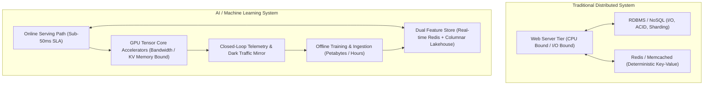
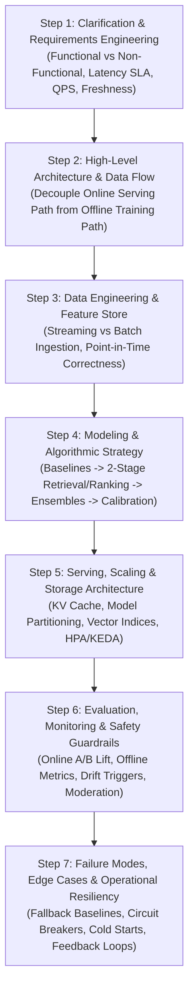
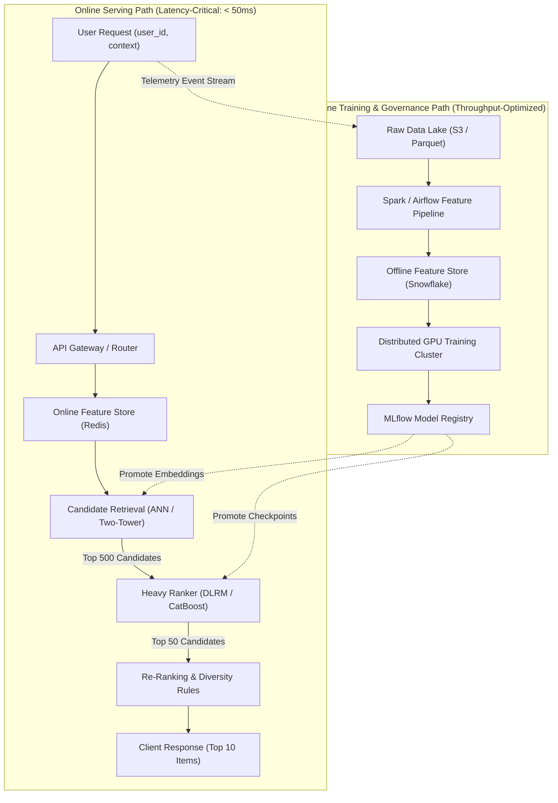
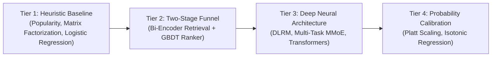
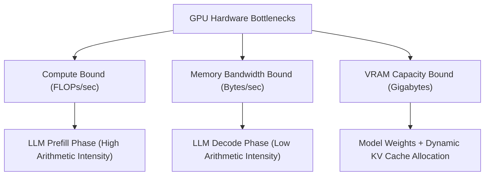
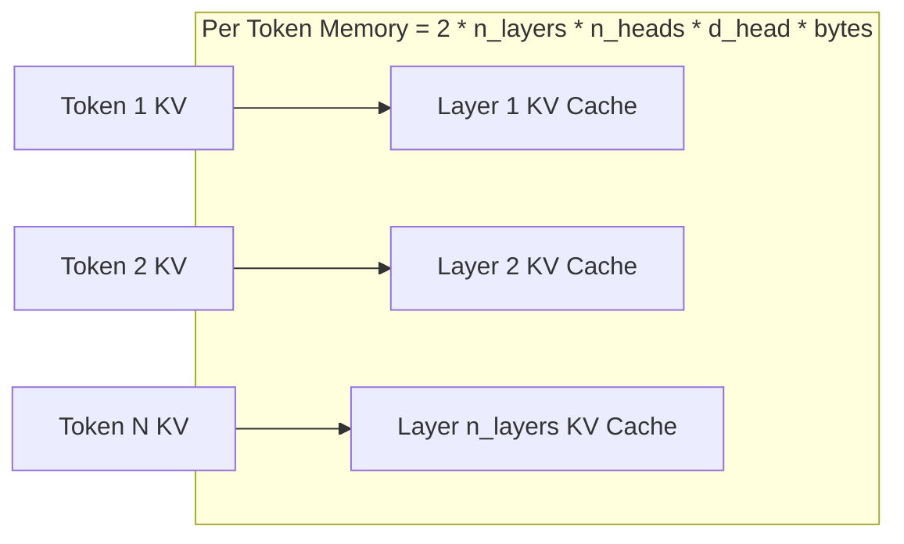
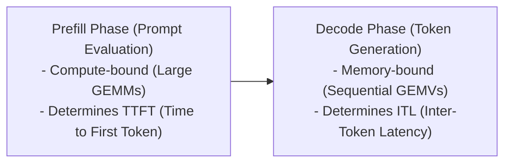
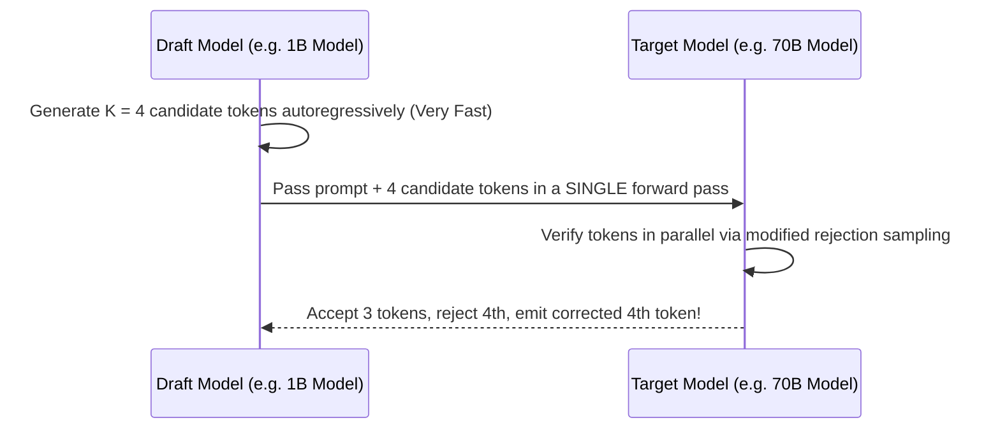
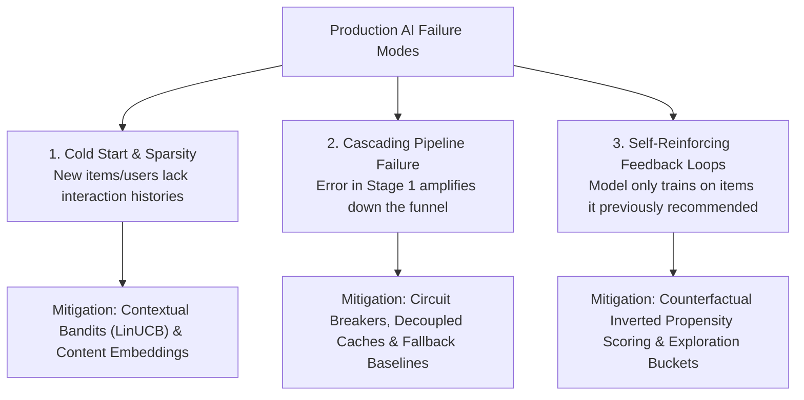

# AI System Design Methodology & Architectural Framework

!!! info "Prerequisites"
    Distributed computing fundamentals, deep learning inference, memory hierarchies, and MLOps pipelines. Review [Algorithms & Complexity](../00-computer-science/algorithms-deep-dive.md), [Transformer Architecture & Mechanics](../09-transformers-llms/transformer-architecture-mechanics-deep-dive.md), and [Production Tooling, Containerization & CI/CD](../12-mlops/production-tooling-containerization-cicd-deep-dive.md).

---

## 1. The Big Picture: What Distinguishes AI System Design?

Traditional software system design centers on deterministic CRUD operations, ACID guarantees, stateless microservices, and database partitioning. In contrast, **AI System Design** operates under probabilistic uncertainty, extreme hardware memory-bandwidth constraints, non-linear computational graphs, and feedback loops between predictions and future training data.

The fundamental challenges unique to AI system design include:

1. **The Dual Serving/Training Path**: Unifying low-latency online inference (scoring live users in $<50\text{ ms}$) with massive offline distributed training (processing terabytes of historical logs over hundreds of GPUs).
2. **Hardware Sizing & Memory-Bandwidth Bottlenecks**: Deep neural networks and Large Language Models are heavily bound by GPU High-Bandwidth Memory (HBM) throughput, demanding exact hardware sizing calculations.
3. **Multi-Stage Funnels**: Balancing candidate generation (filtering millions of items to hundreds in $<15\text{ ms}$) with complex heavy ranking (evaluating thousands of features in $<35\text{ ms}$).
4. **Non-Deterministic Failure Modes**: Degraded calibration, cold-start sparsity, feedback loops, and cascading failures across sequential neural stages.

---

## 2. The Standard 7-Step AI System Design Framework

To design complex, staff-level AI systems under interview and real-world conditions, follow this structured 7-step blueprint:

---

### Step 1: Problem Clarification & Requirements Engineering

Establish the system scope by strictly separating **functional requirements** (business domain behavior) from **non-functional requirements** (architectural constraints).

#### Functional Requirements
- What is the system's core output? (e.g. ranked list of top-$K$ items, generated text response, predicted default probability).
- Who is consuming the prediction? (End-user mobile application, internal automated underwriting engine, background analytical batch job).
- Is personalized context available at inference time?

#### Non-Functional Requirements & Quantitative Budgets
- **Latency Budget (SLA)**: End-to-end $P_{99} \le 50\text{ ms}$ (e.g., $10\text{ ms}$ feature retrieval, $15\text{ ms}$ candidate generation, $20\text{ ms}$ heavy ranking, $5\text{ ms}$ business rules/serialization).
- **Throughput & Concurrency**: Peak queries per second (QPS) (e.g., $50,000\text{ QPS}$ globally).
- **Data Freshness**: How fast must new user interactions reflect in recommendations? (Near real-time streaming $<5\text{ seconds}$ vs. daily batch $<24\text{ hours}$).
- **Availability & Fault Tolerance**: $99.99\%$ uptime (less than 4.38 minutes of downtime per month).
- **Cost Ceiling**: Infrastructure budget constraints (e.g., maximum $\$50,000/\text{month}$ on GPU cloud instances).

---

### Step 2: High-Level Architecture & Data Flow

Decouple the architecture into two asynchronous planes: the **Online Serving Path** and the **Offline Analytical/Training Path**.

---

### Step 3: Data Engineering & Feature Store Architecture

Design the feature pipeline to avoid online/offline skew and temporal feature leakage:

- **Streaming Pipeline**: Apache Kafka / Flink ingests clickstream events to compute sliding-window real-time aggregates (e.g., `user_clicks_last_10_minutes`).
- **Batch Pipeline**: Daily Spark/Airflow workflows process heavy historical aggregations (e.g., `user_30_day_average_spend`).
- **Dual Storage**: Write streaming aggregates directly to an in-memory key-value store (Redis) for $<5\text{ ms}$ point lookup, while archiving historical snapshots to columnar Parquet tables for point-in-time correct training joins.

---

### Step 4: Modeling & Algorithmic Strategy

Avoid jumping immediately to the most complex neural network. Define a multi-tier modeling roadmap:

1. **Heuristic / Simple Baseline**: Establish an MVP (e.g., popularity-weighted matrix factorization or logistic regression) to validate end-to-end data pipelines and establish an empirical performance floor.
2. **Two-Stage Funnel**:
   - **Candidate Generation (Retrieval)**: Fast, coarse-grained filtering reducing $10^7$ items down to $10^2 - 10^3$ candidates using Two-Tower vector search (HNSW / ScaNN).
   - **Heavy Ranking**: Fine-grained, compute-intensive scoring using gradient-boosted decision trees (LightGBM) or deep recommendation architectures (DLRM) evaluating hundreds of interaction features.
3. **Probability Calibration**: Raw neural logits often output poorly calibrated probabilities. Apply Platt Scaling or Isotonic Regression to ensure predicted risk $\hat{p} = 0.8$ corresponds to an empirical $80\%$ event frequency.

---

### Step 5: Serving, Scaling & Storage Architecture

Map model architectures to target hardware infrastructure, accounting for memory footprints, compute intensity, and auto-scaling topologies.

---

### Step 6: Evaluation, Monitoring & Safety Guardrails

Evaluate both offline algorithmic benchmarks and online business KPIs:

- **Offline Metrics**: ROC-AUC, PR-AUC, Normalized Discounted Cumulative Gain ($\text{NDCG}@K$), Mean Reciprocal Rank (MRR), Hit Rate.
- **Online Business Metrics**: Click-Through Rate (CTR), Conversion Rate (CVR), Average Order Value (AOV), Revenue per Mille (RPM).
- **Safety & Moderation**: Pre-retrieval query sanitation, embedding toxicity filters, and post-generation LLM output guardrails (e.g., Llama-Guard).

---

### Step 7: Failure Modes, Edge Cases & Operational Resiliency

Design fail-safes for unpredictable production anomalies:

- **Graceful Degradation & Fallbacks**: If the deep ranking service times out ($>35\text{ ms}$), a circuit breaker trips, instantly falling back to an in-memory cached heuristic or popularity-ranked list.
- **Cold-Start Handling**: Multi-armed bandits (LinUCB, Thompson Sampling) dynamically balance exploration of unindexed/new items against exploitation of proven hits.
- **Feedback Loop Mitigation**: Counterfactual learning and negative down-sampling prevent the system from repeatedly showing the same items and narrowing user diversity.

---

## 3. Capacity Estimation & Hardware Sizing Mathematics

Staff-level system designers do not guess hardware requirements—they derive them using first-principles physics and memory-bandwidth equations.

### 3.1 Arithmetic Intensity & The Roofline Model
The **Arithmetic Intensity** $I$ of an operation is the ratio of computational work to memory traffic:

$$I = \frac{\text{Floating Point Operations (FLOPs)}}{\text{Memory Transferred (Bytes)}}$$

- **Compute-Bound Regime**: When arithmetic intensity exceeds the hardware balance point ($I > \frac{\text{Peak FLOPs/s}}{\text{Peak Memory Bandwidth}}$), performance is bounded by GPU Tensor Core compute capacity.
- **Memory-Bound Regime**: When arithmetic intensity is low ($I < \text{Hardware Balance}$), GPU cores remain idle waiting for weights and activations to stream from High-Bandwidth Memory (HBM).

### 3.2 The LLM Memory Bandwidth Serving Equation
During autoregressive LLM decoding, generating a single token requires streaming **every parameter weight matrix** from GPU VRAM into processor SRAM once.

Let $P$ be the number of model parameters (in billions), and $B_{\text{mem}}$ be the memory bandwidth of the GPU (in $\text{GB/s}$). For 16-bit floating point precision ($\text{FP16}$ or $\text{BF16}$, $2\text{ bytes per parameter}$), the theoretical minimum generation time for a single token across batch size $1$ is:

$$T_{\text{token}} = \frac{2 \times P \times 10^9 \text{ bytes}}{B_{\text{mem}} \times 10^9 \text{ bytes/sec}} = \frac{2 \times P}{B_{\text{mem}}} \text{ seconds}$$

#### Worked Example: LLaMA-3-70B on an NVIDIA A100 GPU
- Model parameters: $P = 70 \times 10^9$
- Parameter bytes: $70 \times 2 = 140\text{ GB}$ (exceeds single $80\text{ GB}$ A100; requires tensor parallelism across 2 or 4 GPUs)
- With 2x A100 GPUs ($B_{\text{mem}} = 2 \times 2,039\text{ GB/s} = 4,078\text{ GB/s}$):
  
  $$T_{\text{token}} = \frac{140\text{ GB}}{4,078\text{ GB/s}} \approx 0.0343\text{ seconds} \implies 34.3\text{ ms per token}$$
  
  $$\text{Generation Throughput} = \frac{1}{0.0343} \approx 29.1\text{ tokens/second}$$

### 3.3 Key-Value (KV) Cache Memory Sizing

During multi-turn generation, transformers cache the Key and Value projection matrices for all historical tokens to avoid redundant attention re-computation.

The memory footprint of the KV cache is given by:

$$\text{Memory}_{\text{KV}} = 2 \times B \times L \times n_{\text{layers}} \times n_{\text{heads}} \times d_{\text{head}} \times b_{\text{bytes}}$$

Where:

- The factor of $2$ accounts for the two matrices: Key ($K$) and Value ($V$).
- $B$ is the concurrent batch size.
- $L$ is the context sequence length (prompt tokens $+$ generated tokens).
- $n_{\text{layers}}$ is the number of transformer layers.
- $n_{\text{heads}}$ is the number of key-value attention heads (under Multi-Query Attention or Grouped-Query Attention, this is $n_{\text{kv\_heads}} \ll n_{\text{attn\_heads}}$).
- $d_{\text{head}}$ is the dimension per head ($d_{\text{model}} / n_{\text{attn\_heads}}$).
- $b_{\text{bytes}}$ is byte width ($2$ for FP16, $1$ for FP8).

#### Concrete Calculation Table: KV Cache Footprint at Batch Size $B = 64$ ($L = 4,096$ tokens, FP16)

| Model Architecture | Layers ($n_{\text{layers}}$) | KV Heads ($n_{\text{kv}}$) | Head Dim ($d_{\text{head}}$) | Bytes/Token (Per Sequence) | Total KV Cache ($B=64, L=4096$) |
| :--- | :--- | :--- | :--- | :--- | :--- |
| **LLaMA-2-7B (MHA)** | 32 | 32 | 128 | $2 \times 32 \times 32 \times 128 \times 2 = 524,288\text{ B} \approx 512\text{ KB}$ | **$134.2\text{ GB}$** |
| **LLaMA-3-8B (GQA)** | 32 | 8 | 128 | $2 \times 32 \times 8 \times 128 \times 2 = 131,072\text{ B} \approx 128\text{ KB}$ | **$33.55\text{ GB}$** |
| **LLaMA-3-70B (GQA)**| 80 | 8 | 128 | $2 \times 80 \times 8 \times 128 \times 2 = 327,680\text{ B} \approx 320\text{ KB}$ | **$83.88\text{ GB}$** |

*Architectural Takeaway*: Grouped-Query Attention (GQA) slashes KV cache memory footprint by **$4\times$ to $8\times$**, enabling massive increases in concurrent batch serving capacity without exhausting GPU VRAM.

### 3.4 Total GPU VRAM Allocation Budget

The total GPU memory required to host an inference deployment is:

$$\text{Memory}_{\text{total}} = \text{Memory}_{\text{weights}} + \text{Memory}_{\text{KV\_cache}} + \text{Memory}_{\text{activations}} + \text{Memory}_{\text{CUDA\_overhead}}$$

Where:

- $\text{Memory}_{\text{weights}} = P \times b_{\text{bytes}}$ (e.g. $70\text{B} \times 2\text{ bytes} = 140\text{ GB}$).
- $\text{Memory}_{\text{activations}} \approx \mathcal{O}(B \times S \times d_{\text{model}})$.
- $\text{Memory}_{\text{CUDA\_overhead}} \approx 1 - 2\text{ GB}$ reserved for CUDA runtime contexts and NCCL communication buffers.

---

## 4. Latency vs. Throughput Trade-Offs

Production serving architectures represent a continuous optimization between **Time to First Token (TTFT)**, **Inter-Token Latency (ITL)**, and **Aggregate Throughput**.

### 4.1 Continuous Batching & Chunked Prefill
- In standard continuous batching, newly arriving prompts enter the prefill phase, firing large compute-heavy matrix multiplications that momentarily freeze all running decoding sequences, causing severe spikes in Inter-Token Latency (ITL jitter).
- **Chunked Prefill** ([Agrawal et al., 2024 (Sarathi)](https://arxiv.org/abs/2308.16369)): Slices incoming prompt sequences into fixed-size chunks (e.g. 512 tokens). Each iteration co-schedules a prefill chunk alongside existing decode tokens, smoothing compute intensity and maintaining bounded ITL.

### 4.2 Speculative Decoding
Speculative decoding accelerates memory-bound autoregressive decoding using a smaller, faster **draft model** ($M_{\text{draft}}$) paired with a large **target model** ($M_{\text{target}}$):

- **Speedup**: The target model evaluates all $K$ candidate tokens simultaneously in a **single compute-bound forward pass** rather than $K$ individual memory-bound decoding passes.
- **Mathematical Guarantee**: By employing modified rejection sampling, the output distribution of speculative decoding is mathematically **identical** to sampling directly from the large target model:

$$P_{\text{speculative}}(x) \equiv P_{\text{target}}(x)$$

---

## 5. Production Failure Modes & Mitigation Strategies

### 5.1 Cold Start & Data Sparsity
- **Symptom**: New items published to the platform receive zero impressions because collaborative filtering algorithms have zero interaction history for them.
- **Architectural Solution**:
  1. *Two-Tower Content Fallback*: Compute dense embeddings from multimodal item metadata (title, category, text description, visual poster) and index them immediately in the vector search database.
  2. *Contextual Multi-Armed Bandits*: Allocate a fixed percentage of impression traffic ($2-5\%$) to an exploration pool using **LinUCB** or **Thompson Sampling**, balancing the reward of proven items against the information gain of new items.

### 5.2 Cascading Pipeline Failures
- **Symptom**: In a two-stage retrieval $\to$ ranking system, if the retrieval stage experiences a transient index corruption or timeout, it emits an empty or anomalous candidate set. The heavy ranker crashes or returns random items.
- **Architectural Solution**:
  - Implement a **Circuit Breaker** (e.g., Netflix Hystrix pattern). If retrieval latency exceeds $20\text{ ms}$ or returns $<50$ candidates, bypass the neural pipeline and serve from an in-memory, pre-computed Top-100 popular fallback list.

### 5.3 Self-Reinforcing Feedback Loops & Popularity Bias
- **Symptom**: The recommendation engine repeatedly recommends the same viral items, driving click counts higher, which trains the model to score those items even higher, suffocating long-tail catalog items (**the filter bubble**).
- **Architectural Solution**:
  - **Inverse Propensity Scoring (IPS)**: Weight training samples inversely by their historical presentation probability $P(\text{Impression} \mid \text{Item})$:
    
    $$\mathcal{L}_{\text{debiased}} = \sum_{i} \frac{1}{P(\text{Exposed}_i)} \mathcal{L}(y_i, \hat{y}_i)$$
    
  - Explicitly inject diversity constraints and category entropy minimums into the final re-ranking phase.

---

## 6. Common Errors, Anti-Patterns & Production Debugging

### Error 1: Neglecting KV Cache Memory in Capacity Planning
- **Symptom**: Serving cluster crashes with `CUDA out of memory` during peak evening traffic spikes, despite `nvidia-smi` showing weights consume only $60\%$ of GPU VRAM during testing.
- **Root Cause**: The engineer calculated VRAM needs based solely on static parameter weights, neglecting the dynamic KV cache footprint. As concurrent batch size grew from $B = 4$ to $B = 64$ and context lengths reached $4,000$ tokens, the KV cache demanded an additional $80\text{ GB}$ of VRAM, exceeding physical limits.
- **Fix**: Pre-allocate and cap KV cache blocks using vLLM/PagedAttention (`gpu_memory_utilization: 0.90`) and enforce admission control queues to reject requests exceeding KV cache capacity.

### Error 2: Latency Bottleneck via Unbatched Point Lookups to Feature Store
- **Symptom**: Feature retrieval takes $120\text{ ms}$, consuming $80\%$ of the total request latency budget.
- **Root Cause**: Iterating over 500 retrieved candidate items and issuing 500 individual synchronous Redis `GET` commands over the network.
- **Fix**: Use Redis `MGET` (multi-get) or pipelined requests to fetch all 500 candidate feature vectors in a single network round-trip ($<4\text{ ms}$).

### Error 3: Online/Offline Feature Calculation Divergence
- **Symptom**: Offline ROC-AUC is $0.94$, but online business metrics show zero uplift.
- **Root Cause**: Feature logic mismatch. The offline Spark pipeline calculated `user_age = (current_date - birth_date) / 365.25`, while the online Go/FastAPI gateway implemented `user_age = current_year - birth_year`, introducing boundary errors.
- **Fix**: Enforce a unified Feature Store (Feast/Hopsworks) where transformation logic is defined once in Python/SQL and shared across both offline and online materialization engines.

---

## 7. Staff-Level Technical Interview Questions

### Q1: Walk through the complete capacity estimation for serving a 70B parameter LLM at 1,000 concurrent streaming requests with an average context length of 2,000 tokens. How many GPUs are required?

**Model Answer:**  

1. **Weight Memory**:
   - At FP16 precision ($2\text{ bytes/parameter}$): $70\text{B} \times 2 = 140\text{ GB}$.
2. **KV Cache Memory**:
   - Assuming LLaMA-3-70B architecture ($n_{\text{layers}} = 80$, $n_{\text{kv\_heads}} = 8$, $d_{\text{head}} = 128$, Grouped-Query Attention).
   - KV cache per token per sequence:
     
     $$\text{Bytes/token} = 2 \times 80 \times 8 \times 128 \times 2 = 327,680\text{ bytes} \approx 320\text{ KB}$$
     
   - For $L = 2,000$ tokens: $2,000 \times 320\text{ KB} = 640\text{ MB per active sequence}$.
   - For $B = 1,000$ concurrent active streams:
     
     $$\text{Total KV Cache} = 1,000 \times 640\text{ MB} = 640\text{ GB}$$
     
3. **Total VRAM Footprint**:
   - $\text{Total VRAM} = 140\text{ GB (Weights)} + 640\text{ GB (KV Cache)} + 20\text{ GB (Activations + Context)} = 800\text{ GB}$.
4. **Hardware Sizing**:
   - Using NVIDIA A100 $80\text{ GB}$ GPUs:
     
     $$\text{Minimum GPUs} = \frac{800\text{ GB}}{80\text{ GB} \times 0.90 \text{ (Safe Utilization)}} \approx 11.1 \implies 12 \text{ GPUs}$$
     
   - Because tensor parallelism requires power-of-two partitions ($TP \in \{1, 2, 4, 8\}$), we deploy **two 8-GPU nodes** (16x A100 $80\text{ GB}$ GPUs total), providing $1,280\text{ GB}$ total VRAM, comfortably handling peak KV cache demand with headroom for traffic surges.

---

### Q2: Why is the two-stage Retrieval $\to$ Ranking funnel universally adopted in web-scale recommendation systems? Why not score all items directly with the ranker?

**Model Answer:**  
The two-stage funnel resolves the fundamental trade-off between **candidate catalog scale** ($N = 10^7 - 10^9$ items) and **scoring model complexity** under strict latency constraints ($P_{99} \le 50\text{ ms}$):

1. **Computational Feasibility**:
   - A deep ranking model (DLRM / Transformer) evaluates thousands of sparse cross-features and dense interactions, requiring $\sim 10^7\text{ FLOPs}$ per item scoring pass.
   - Scoring $10^7$ items would demand $10^{14}\text{ FLOPs}$ per user request. At $50,000\text{ QPS}$, the serving cluster would require millions of GPU cores, incurring billions in cloud costs and exceeding latency budgets by multiple orders of magnitude.
2. **The Funnel Solution**:
   - **Stage 1 (Retrieval)**: Uses low-complexity representations (Two-Tower dot product $\langle \mathbf{u}, \mathbf{v} \rangle$) and Approximate Nearest Neighbor (ANN) vector indices (HNSW). It prunes $99.99\%$ of the catalog down to $500$ candidates in $<15\text{ ms}$ with sub-linear search complexity $\mathcal{O}(\log N)$.
   - **Stage 2 (Heavy Ranking)**: Executes the compute-intensive neural ranking model exclusively over the filtered 500 candidates, consuming only $500 \times 10^7 = 5 \times 10^9\text{ FLOPs}$ ($<20\text{ ms}$ on a GPU).
   - This architectural decoupling achieves optimal ranking quality at web scale.

---

### Q3: Explain how Speculative Decoding achieves lower latency without altering model output probabilities. Prove that the target model's output distribution is preserved.

**Model Answer:**  

- **Operational Mechanism**:
  1. A small, fast draft model autoregressively generates $K$ candidate tokens: $\tilde{x}_1, \dots, \tilde{x}_K$.
  2. The large target model processes the prompt and all $K$ candidates in a **single parallel forward pass**, obtaining logits and probability distributions $p(x)$ for each position.
  3. Tokens are evaluated sequentially using modified rejection sampling:
     - Candidate token $\tilde{x}_i$ is accepted with probability:
       
       $$\alpha = \min\left(1, \frac{p(\tilde{x}_i)}{q(\tilde{x}_i)}\right)$$
       
       where $p(x)$ is the target model distribution and $q(x)$ is the draft model distribution.

     - If accepted, the token is kept.
     - If rejected, the token is resampled from the residual distribution:
       
       $$p'(x) = \max(0, p(x) - q(x)) / \sum_{x'} \max(0, p(x') - q(x'))$$
       
       and all subsequent draft tokens are discarded.

- **Proof of Equivalence**:
  The probability of emitting token $x$ under speculative sampling is:
  
  $$P(x) = q(x) \times \min\left(1, \frac{p(x)}{q(x)}\right) + (1 - \text{Acceptance Rate}) \times p'(x)$$
  
  $$= \min(q(x), p(x)) + \max(0, p(x) - q(x)) \equiv p(x)$$
  
  Because the emitted token distribution identically equals $p(x)$, speculative decoding is mathematically lossless.

---

### Q4: In recommendation systems, what is the cold-start problem for new items, and how does the LinUCB contextual bandit algorithm resolve it?

**Model Answer:**  

- **The Problem**: Collaborative filtering models rely on historical user-item interaction matrices. When a new item is added, it has zero interaction history, resulting in uninformative embeddings and zero impressions.
- **LinUCB Algorithm**:
  - Treats recommendation as a contextual multi-armed bandit problem. For each user context vector $\mathbf{x}_{t}$, the expected reward (click/conversion) for arm $a$ is modeled as a linear payoff: $\mathbb{E}[r_{t, a} \mid \mathbf{x}_{t}] = \mathbf{x}_{t}^T \boldsymbol{\theta}_a$.
  - To balance exploration (learning new item quality) and exploitation (showing proven items), LinUCB selects the arm maximizing the **Upper Confidence Bound**:
    
    $$a_t = \arg\max_{a} \left( \mathbf{x}_t^T \hat{\boldsymbol{\theta}}_a + \alpha \sqrt{\mathbf{x}_t^T \mathbf{A}_a^{-1} \mathbf{x}_t} \right)$$
    
    Where:

    - $\mathbf{A}_a = \mathbf{D}_a^T \mathbf{D}_a + \mathbf{I}_d$ is the covariance matrix of past contexts observed for arm $a$.
    - The first term represents expected reward (exploitation).
    - The second term represents the statistical variance / uncertainty (exploration), scaled by hyperparameter $\alpha$.
  - When an item is new, its covariance matrix $\mathbf{A}_a$ has small eigenvalues, driving the uncertainty term high. This temporarily boosts the item's ranking score, granting it exploratory impressions until confidence intervals shrink.

---

### Q5: How do you design an AI serving system to handle catastrophic cascading failures when a downstream database or feature store becomes unreachable?

**Model Answer:**  

1. **Circuit Breakers (Fail Fast)**:
   - Wrap feature store calls with a circuit breaker (e.g. Netflix Resilience4j / Envoy circuit breakers). If error rate exceeds $50\%$ or latency exceeds $20\text{ ms}$ over a 10-second rolling window, open the circuit immediately.
   - Subsequent requests fail fast within $<1\text{ ms}$ rather than hanging until connection timeouts expire, preventing threadpool exhaustion in the serving gateway.
2. **Hierarchical Fallback Strategy**:
   - *Tier 1 Fallback (Local Cache)*: Query a local in-memory LRU cache on the serving pod containing recently fetched feature vectors.
   - *Tier 2 Fallback (Default Feature Imputation)*: If absent from cache, impute feature defaults (e.g. median population feature values) and score with the model.
   - *Tier 3 Fallback (Static Heuristic Model)*: If the model server itself is degraded, bypass the neural pipeline entirely and return a pre-computed static JSON list of Top-50 trending/popular items stored in a high-availability CDN or edge bucket.
3. **Graceful Degradation Logging**:
   - Tag responses with header `X-Serving-Mode: degraded-fallback` to alert observability dashboards and exclude degraded inference events from production training sets.

---

## 8. Mastery Ladder

- [ ] **L1:** Articulate the standard 7-step AI system design interview framework.
- [ ] **L2:** Formulate latency budgets and throughput QPS constraints for a sub-50ms inference SLA.
- [ ] **L3:** Explain the architectural separation between the online serving path and the offline analytical path.
- [ ] **L4:** Apply the Roofline model and arithmetic intensity to diagnose compute vs. memory-bandwidth bottlenecks.
- [ ] **L5:** Calculate the generation latency of an LLM given parameter count and GPU memory bandwidth.
- [ ] **L6:** Derive the exact memory formula for the Transformer Key-Value (KV) cache under Multi-Head vs Grouped-Query Attention.
- [ ] **L7:** Explain the mathematical proof showing why Speculative Decoding preserves target model output distribution.
- [ ] **L8:** Design a Two-Stage Retrieval and Ranking architecture balancing sub-linear vector search with heavy neural scoring.
- [ ] **L9:** Formulate the LinUCB bandit equation to solve cold-start exploration in recommendation systems.
- [ ] **L10:** Architect an end-to-end multi-tier fallback and circuit breaker strategy guaranteeing $99.99\%$ availability under catastrophic downstream outages.
