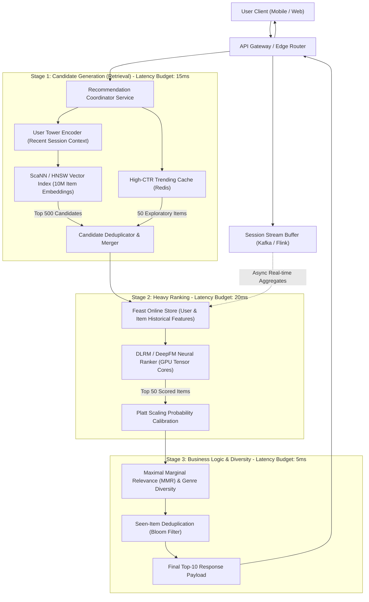
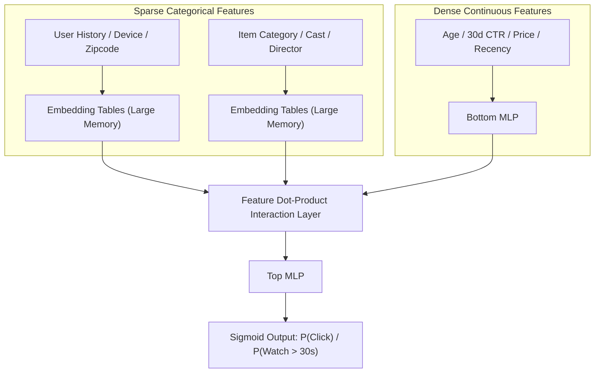
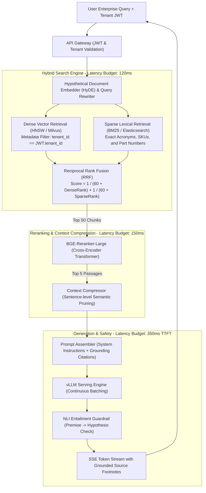
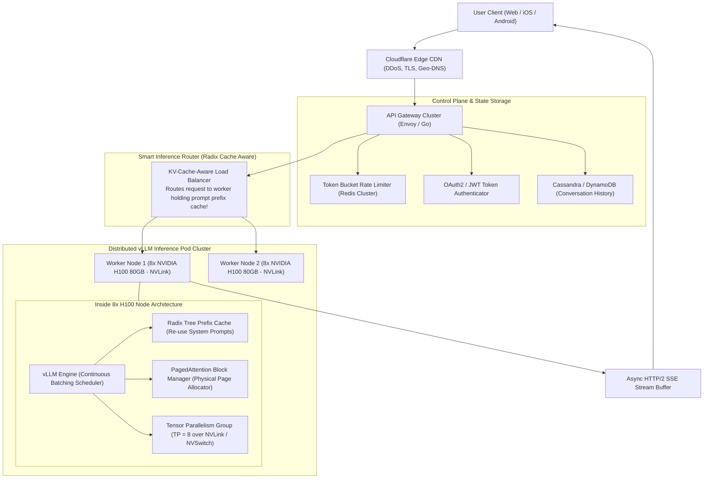
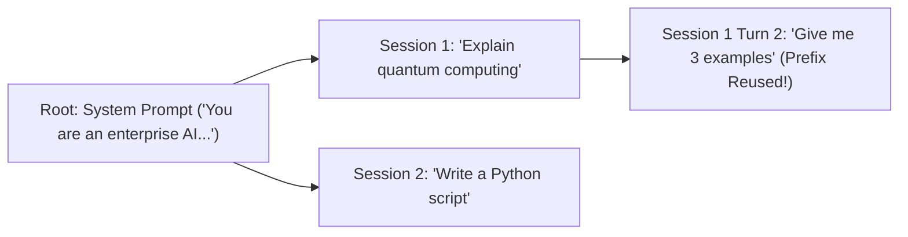

# Production AI System Design Case Studies — Netflix, Enterprise RAG & ChatGPT

!!! info "Prerequisites"
    Distributed systems, Approximate Nearest Neighbors (ANN), Transformer inference, vector databases, and high-throughput serving. Review [Hash Tables & Sets](../00-computer-science/hash-tables-sets-deep-dive.md), [Enterprise RAG Systems](../10-generative-ai/enterprise-rag-systems-deep-dive.md), [AI System Design Methodology & Framework](ai-system-design-methodology-framework-deep-dive.md), and [Model Serving, Pipelines & Distributed Orchestration](../12-mlops/serving-pipelines-orchestration-deep-dive.md).

---

## 1. Case Study 1: Large-Scale Personalized Recommendation Engine (Netflix / Spotify / E-Commerce)

Personalized recommendation engines drive user engagement across web-scale digital platforms. The system must select the most relevant items from a catalog of tens of millions, personalize rankings according to real-time user session signals, and return results within strict sub-50ms latency budgets.

### 1.1 Requirements & Operational Budgets
- **Scale**: $100\text{M}+$ daily active users (DAU), $10\text{M}+$ catalog items (movies, songs, products).
- **Peak Throughput**: $50,000\text{ Queries Per Second (QPS)}$.
- **Latency SLA**: $P_{99} \le 50\text{ ms}$ globally.
- **Freshness**: Immediate session reactivity—interactions occurring within the last $10\text{ seconds}$ must alter subsequent recommendations.
- **Availability**: $99.99\%$ with zero single points of failure.

### 1.2 End-to-End Architectural Blueprint



### 1.3 Algorithmic Strategy: Two-Tower DSSM to DLRM Heavy Ranker

#### Stage 1: Two-Tower Bi-Encoder Retrieval
The user context and item metadata are projected into a shared latent metric space $\mathbb{R}^d$ ($d = 128$) using two independent deep neural networks:

$$\mathbf{u} = f_{\theta}(\mathbf{x}_{\text{user}}, \mathbf{x}_{\text{session}}), \quad \mathbf{v} = g_{\phi}(\mathbf{x}_{\text{item}})$$

Relevance is measured via cosine inner product:

$$s(\mathbf{u}, \mathbf{v}) = \frac{\mathbf{u} \cdot \mathbf{v}}{\|\mathbf{u}\|_2 \|\mathbf{v}\|_2}$$

Because item vectors $\mathbf{v} \in \mathbb{R}^d$ are computed offline and indexed in an Approximate Nearest Neighbor (ANN) index (Hierarchical Navigable Small World - HNSW or Google ScaNN), retrieval requires only a single user forward pass followed by a sub-millisecond graph traversal:

$$\text{Retrieval Complexity} = \mathcal{O}(\log N_{\text{items}})$$

#### Stage 2: Deep Learning Recommendation Model (DLRM) Heavy Ranker
The filtered 500 candidates pass to a DLRM architecture that models explicit second-order feature interactions:



The interaction layer computes explicit dot products between all pairs of embedding vectors and the dense output:

$$\mathbf{v}_i^T \mathbf{v}_j \quad \forall i < j$$

Capturing cross-features (e.g. `User_Preferred_Genre` $\times$ `Item_Release_Year`) without manual feature engineering.

### 1.4 Capacity Estimation & Infrastructure Sizing

| Metric / Dimension | Calculated Value | Derivation / Justification |
| :--- | :--- | :--- |
| **Peak QPS** | $50,000\text{ req/sec}$ | Global peak evening traffic |
| **Vector DB Size** | $10\text{M items} \times 128\text{ dims} \times 4\text{B} = 5.12\text{ GB}$ | Easily fits entirely in memory on each retrieval node |
| **HNSW Index Graph Overhead**| $5.12\text{ GB} \times 1.5 = 7.68\text{ GB}$ | $M = 32$, $\text{efConstruction} = 128$ |
| **Heavy Ranker FLOPs / Req**| $500\text{ candidates} \times 2\text{M FLOPs} = 1\text{ GFLOP}$ | Small MLP forward pass over 500 items |
| **Cluster Compute Demand** | $50,000 \times 1\text{ GFLOP} = 50\text{ TFLOPs/sec}$ | Supported by 20x NVIDIA T4 / L4 GPUs at $50\%$ utilization |
| **Redis Online Store Memory** | $100\text{M users} \times 500\text{ bytes} = 50\text{ GB}$ | Sharded across 3 Redis nodes with replica pairs |

### 1.5 Recommendation API Contract

```json
// POST /v1/recommendations
{
  "user_id": "usr_994821a",
  "client_context": {
    "device": "apple_tv",
    "ip_country": "US",
    "local_time_epoch": 1725624000
  },
  "current_session_events": [
    {"item_id": "mov_842", "event_type": "impression_skip", "duration_sec": 3},
    {"item_id": "mov_119", "event_type": "watch_start", "duration_sec": 420}
  ],
  "limit": 10
}

// Response: HTTP 200 OK
{
  "recommendations": [
    {
      "item_id": "mov_9934",
      "score": 0.9421,
      "title": "Interstellar",
      "reasoning_tag": "Because you watched Sci-Fi",
      "exploration_flag": false
    }
  ],
  "debug_info": {
    "retrieval_ms": 11.2,
    "ranking_ms": 18.4,
    "total_latency_ms": 34.6
  }
}
```

---

## 2. Case Study 2: Enterprise Multimodal Retrieval-Augmented Generation (RAG) System

Enterprise RAG allows employees and client applications to query millions of private, heterogenous documents (PDFs, Word docs, Confluence spaces, technical schematics) with strict tenant access controls and zero hallucinations.

### 2.1 Requirements & Operational Budgets
- **Scale**: $50\text{M}$ enterprise documents, $500\text{M}$ chunked text/image nodes across $5,000$ corporate tenants.
- **Throughput**: $500\text{ concurrent queries/sec}$.
- **Latency SLA**: Time to First Token (TTFT) $\le 600\text{ ms}$; full response streaming under $3\text{ seconds}$.
- **Strict Tenant Isolation**: Zero cross-tenant data leakage ($P(\text{leakage}) = 0$).
- **Grounded Attribution**: Every factual claim must carry a verified citation pointer back to source document pages.

### 2.2 End-to-End Architectural Blueprint



### 2.3 Hybrid Search & Cross-Encoder Mechanics

#### Reciprocal Rank Fusion (RRF)
Dense embeddings frequently fail on specific entity identifiers (e.g. part number `AX-9942-B`), while sparse lexical search (BM25) fails on semantic synonymy. Hybrid retrieval queries both engines in parallel and merges results using rank-based reciprocal scoring:

$$\text{RRF\_Score}(d) = \sum_{m \in \{\text{dense}, \text{sparse}\}} \frac{1}{k + r_m(d)}$$

where $r_m(d)$ is the integer rank of document $d$ in engine $m$, and $k \approx 60$ is a smoothing constant that dampens outlier rank spikes.

#### Cross-Encoder Reranker
Unlike bi-encoders which compute user and item embeddings independently, a **cross-encoder** feeds both texts simultaneously through full self-attention layers:

$$\text{Input} = \text{[CLS]} \circ \text{Query} \circ \text{[SEP]} \circ \text{Candidate Passage} \circ \text{[SEP]}$$

$$\text{Score} = \sigma\left(\mathbf{W} \cdot \text{Transformer}(\text{Input})_{[\text{CLS}]}\right)$$

All-to-all cross-attention captures subtle syntactic dependencies and negation, boosting precision at the cost of higher latency.

### 2.4 Capacity Estimation & Storage Sizing

| Metric / Dimension | Value | Derivation / Justification |
| :--- | :--- | :--- |
| **Total Chunks** | $500\text{M chunks}$ | $50\text{M docs} \times 10\text{ chunks/doc}$ ($512\text{ tokens/chunk}$) |
| **Vector Storage (FP16)** | $500\text{M} \times 1,024\text{ dims} \times 2\text{B} = 1.024\text{ TB}$ | Stored in sharded Milvus/Qdrant cluster |
| **BM25 Inverted Index** | $\sim 2.5\text{ TB}$ | Elasticsearch cluster with tenant sharding |
| **Vector Index RAM (HNSW)**| $1.024\text{ TB} \times 1.4 \approx 1.43\text{ TB RAM}$ | Sharded across 8 memory-optimized nodes ($256\text{ GB RAM}$ each) |
| **LLM Inference GPU Demand**| 4x 8-GPU H100 Nodes ($32\times\text{H100}$) | Serving 70B parameter model at $500\text{ QPS}$ with continuous batching |

### 2.5 Enterprise RAG API Contract

```json
// POST /v1/chat/completions/rag
{
  "tenant_id": "tenant_corp_742",
  "query": "What are our liabilities if customer data is transferred outside the EU under the 2026 GDPR amendment?",
  "temperature": 0.0,
  "max_tokens": 512,
  "stream": true
}

// Server-Sent Events (SSE) Stream Chunks:
// data: {"type": "citation", "doc_id": "legal_doc_441", "page": 14, "snippet": "Cross-border transfers require standard contractual clauses..."}
// data: {"type": "token", "text": "Under "}
// data: {"type": "token", "text": "the "}
// data: {"type": "token", "text": "2026 "}
// data: {"type": "token", "text": "amendment, "}
// data: {"type": "done"}
```

---

## 3. Case Study 3: High-Throughput Distributed LLM Serving Platform (Design ChatGPT)

Serving conversational AI at global consumer scale requires orchestrating hundreds of GPU servers while delivering sub-200ms Time to First Token (TTFT), sustained $>50\text{ tokens/sec}$ Inter-Token Latency (ITL), and multi-turn state preservation across millions of concurrent dialogues.

### 3.1 Requirements & Operational Budgets
- **Scale**: $100\text{M}$ Daily Active Users, $10,000\text{ concurrent generation streams}$ at peak.
- **Latency SLA**:
  - Time to First Token (TTFT): $P_{95} \le 200\text{ ms}$.
  - Inter-Token Latency (ITL): $P_{99} \le 25\text{ ms}$ (smooth, human-reading-speed output).
- **Availability**: $99.95\%$.
- **Cost Efficiency**: Maximum GPU FLOP utilization ($>60\%$ Model FLOPs Utilization - MFU).

### 3.2 End-to-End Architectural Blueprint



### 3.3 Core Serving Mechanics: Tensor Parallelism, Radix Cache & PagedAttention

#### Tensor Parallelism (Megatron-LM Style)
A 70B parameter model requires $140\text{ GB}$ of VRAM at FP16, exceeding a single $80\text{ GB}$ H100. Tensor Parallelism splits parameter weight matrices across 8 GPUs connected via NVLink ($900\text{ GB/s}$ bidirectional bandwidth):

- **Attention Multi-Head Projections**: The Query, Key, and Value projection weight matrices $\mathbf{W}_Q, \mathbf{W}_K, \mathbf{W}_V$ are column-partitioned:

$$\mathbf{W}_Q = [\mathbf{W}_{Q, 1} \mid \mathbf{W}_{Q, 2} \mid \dots \mid \mathbf{W}_{Q, 8}]$$

- **Output Projection**: $\mathbf{W}_O$ is row-partitioned, requiring a single collective **All-Reduce** operation per attention block:

$$\mathbf{Y} = \sum_{r=1}^8 \mathbf{Z}_r \mathbf{W}_{O, r}$$

Because NVLink latency is sub-microsecond, all-reduce communication adds negligible overhead.

#### Radix Tree Prefix Caching
In conversational systems, the system prompt and conversation history remain identical across consecutive turns. Standard engines re-evaluate the full prompt prefix each turn, consuming redundant GPU compute.

- A **Radix Tree** indexes KV cache blocks by token prefix hash.
- Subsequent turns re-use existing KV cache pages in GPU memory with zero compute overhead, reducing TTFT from $300\text{ ms}$ to $<15\text{ ms}$.



### 3.4 Capacity Estimation: 10,000 Concurrent Streams

| Dimension | Metric | Hardware Requirement |
| :--- | :--- | :--- |
| **Model Size** | 70B Parameters (FP16) | $140\text{ GB Weights}$ |
| **Concurrent Streams ($B$)** | $10,000\text{ active streams}$ | Peak concurrent demand |
| **Average Context ($L$)** | $2,048\text{ tokens}$ | Multi-turn chat |
| **KV Cache per Sequence** | $2,048 \times 320\text{ KB} = 655.36\text{ MB}$ | LLaMA-3-70B GQA |
| **Aggregate KV Cache** | $10,000 \times 655.36\text{ MB} = 6,553.6\text{ GB} \approx 6.55\text{ TB}$ | Distributed across GPU cluster |
| **Node VRAM (8x H100 80GB)**| $8 \times 80\text{ GB} = 640\text{ GB}$ per node | $\approx 460\text{ GB}$ usable for KV cache (after $140\text{ GB}$ weights) |
| **Total Nodes Required** | $\lceil 6,553.6\text{ GB} / 460\text{ GB} \rceil = 15\text{ nodes}$ | **15 nodes (120x NVIDIA H100 GPUs)** |

With a $25\%$ surge headroom, deploy **20x 8-GPU H100 Nodes (160 GPUs total)**.

### 3.5 Distributed Serving API Contract

```json
// POST /v1/chat/completions
{
  "model": "meta-llama/Meta-Llama-3-70B-Instruct",
  "messages": [
    {"role": "system", "content": "You are a concise, helpful programming assistant."},
    {"role": "user", "content": "Write a thread-safe singleton in Python with double-checked locking."}
  ],
  "temperature": 0.2,
  "max_tokens": 1024,
  "stream": true
}

// Response: HTTP 200 OK (text/event-stream)
// data: {"id":"chat-88a","choices":[{"delta":{"content":"import"},"index":0}]}
// data: {"id":"chat-88a","choices":[{"delta":{"content":" threading"},"index":0}]}
// data: {"id":"chat-88a","choices":[{"finish_reason":"stop"}]}
// data: [DONE]
```

---

## 4. Cross-System Architectural Comparison Matrix

| Dimension | Case 1: Netflix Recommendations | Case 2: Enterprise RAG | Case 3: Distributed ChatGPT |
| :--- | :--- | :--- | :--- |
| **Primary Latency Bottleneck** | Feature Store MGET + Network serialization | Hybrid search RRF + Cross-encoder reranking | GPU Memory Bandwidth (Autoregressive Decode) |
| **Primary Memory Bottleneck** | Embedding tables in DLRM | RAM for HNSW Graph Indices | Dynamic KV Cache Allocation |
| **Hardware Target** | CPU clusters + Light GPU (L4/T4) | High-RAM nodes + A10G/A100 GPUs | Multi-GPU H100/A100 with NVLink |
| **Statefulness** | User session state in Redis | Stateless retrieval over tenant vectors | Stateful conversational KV cache blocks |
| **Worst-Case Failure** | Filter bubble / Popularity feedback loops | Cross-tenant data leak / Hallucination | GPU OOM cascade / KV cache fragmentation |

---

## 5. Common Errors, Anti-Patterns & Production Debugging

### Error 1: Prefix Cache Invalidation from Dynamic Timestamp Prompts
- **Symptom**: Radix prefix cache hit rate drops to $0.0\%$, driving Time-to-First-Token (TTFT) from $20\text{ ms}$ up to $450\text{ ms}$ across all conversational sessions.
- **Root Cause**: The application prepended a dynamic timestamp string (`"Current time: 2026-09-06 19:42:11 UTC\n"`) to the very top of the system prompt. Because the leading tokens differed on every millisecond request, the Radix tree prefix hash matched zero previous cache blocks, forcing full prefill re-computation on every prompt.
- **Fix**: Move dynamic contextual tokens to the **end** of the prompt or append them inside the user message turn, keeping the long system prompt prefix bit-identical.

### Error 2: Cross-Tenant Data Contamination via Shared Vector Namespaces
- **Symptom**: Tenant A queries corporate contracts and receives snippets containing proprietary salary data belonging to Tenant B.
- **Root Cause**: Storing multi-tenant document vectors in a single shared index without hard physical namespace isolation or failing to enforce pre-filtering in the vector search query.
- **Fix**: Enforce hard partition keys in Milvus/Pinecone (`partition_key: tenant_id`) and inject an immutable tenant ID filter into the search query directly from the verified cryptographic JWT claims at the API gateway layer.

### Error 3: Embedding Table OOM in Recommendation Heavy Rankers
- **Symptom**: Model training or serving pod crashes during initialization with PyTorch Host RAM exhaustion.
- **Root Cause**: High-cardinality categorical features (e.g., $100\text{M}$ user IDs with $d = 128$) require $100\text{M} \times 128 \times 4\text{ bytes} = 51.2\text{ GB}$ of memory for a single table. Storing hundreds of categorical tables exhausts GPU VRAM.
- **Fix**: Apply hash-based embedding bucketing (`hash(user_id) % 1_000_000`) or deploy unified distributed embedding architectures like **TorchRec**, which partitions embedding tables across CPU host RAM using pipelined asynchronous pre-fetching.

---

## 6. Staff-Level Technical Interview Questions

### Q1: In the Netflix recommendation architecture, explain why the Two-Tower bi-encoder is optimal for retrieval, but unsuitable for final heavy ranking.

**Model Answer:**  

- **Bi-Encoder Separation**: The Two-Tower architecture strictly decouples the computation of the user vector $\mathbf{u} = f(\mathbf{x}_{\text{user}})$ from the item vector $\mathbf{v} = g(\mathbf{x}_{\text{item}})$. Because the scoring function is a simple dot product $s = \mathbf{u}^T \mathbf{v}$, all item vectors can be computed offline, normalized, and indexed into an Approximate Nearest Neighbor (ANN) index (e.g. ScaNN/HNSW). At query time, the system performs a single user forward pass and executes a sub-linear graph search ($\mathcal{O}(\log N)$), retrieving 500 candidates from 10 million in $<15\text{ ms}$.
- **Unsuitability for Ranking**: By decoupling the user and item networks until the final dot product, the bi-encoder **cannot model early, fine-grained cross-feature interactions**. For example, it cannot compute non-linear interactions between `user_device == "mobile"` and `item_video_resolution == "4K"`, or `user_current_hour == "02:00"` and `item_genre == "horror"`.
- **Heavy Ranker Role**: The heavy ranker (DLRM/CatBoost) concatenates all user, item, and contextual features into a unified feature vector, passing them through explicit dot-product interaction layers and deep MLPs. This models all higher-order feature interactions, achieving superior ranking precision over the filtered candidate set where candidate volume is low enough ($N = 500$) to satisfy latency budgets.

---

### Q2: In an Enterprise RAG system, how does Reciprocal Rank Fusion (RRF) resolve the fundamental trade-off between dense semantic search and sparse lexical search?

**Model Answer:**  

- **The Divergence**:
  - *Dense Semantic Search (HNSW / Bi-Encoder)*: Excels at mapping conceptual queries to semantically related passages (e.g. `"annual compensation guidelines"` matches `"salary and bonus policy"`). However, it frequently fails on exact, low-frequency tokens, numbers, part IDs, and corporate acronyms (e.g. searching for SKU `"TX-9021"` may return vectors for `"TX-9020"` due to high cosine similarity in latent space).
  - *Sparse Lexical Search (BM25 / Inverted Index)*: Uses exact term frequency and inverse document frequency. It finds exact acronyms and part numbers effortlessly, but fails entirely on synonyms or conceptual paraphrasing.
- **RRF Integration**:
  - Traditional score fusion attempts to linearly combine cosine similarity and BM25 scores: $S = \alpha S_{\text{dense}} + (1 - \alpha) S_{\text{BM25}}$. This fails because the score distributions have vastly different scales, bounds, and variances, requiring fragile manual calibration across diverse query types.
  - **Reciprocal Rank Fusion** operates purely on **ordinal ranks**:
    
    $$\text{RRF}(d) = \frac{1}{60 + r_{\text{dense}}(d)} + \frac{1}{60 + r_{\text{BM25}}(d)}$$
    
    Because it ignores raw scores and relies solely on relative rank order, it is scale-invariant, inherently robust to score distribution shifts, and consistently prioritizes passages that perform well across both retrieval modalities.

---

### Q3: How does Radix Tree Prefix Caching function in high-throughput LLM serving engines, and how does it affect load balancer routing decisions?

**Model Answer:**  

- **Radix Tree Mechanics**:
  - In conversational LLM applications, prompts share extensive common prefixes (system instructions, multi-shot demonstrations, prior conversational history).
  - A Radix Tree (trie) data structure maintains pointers to physical KV cache memory blocks indexed by tokens. When a prompt arrives, the engine traverses the Radix tree. If the first 500 tokens match an existing branch, the engine skips the compute-heavy prefill phase for those tokens, directly binding the pre-computed KV cache blocks in GPU VRAM.
- **Impact on Load Balancing (Cache-Aware Routing)**:
  - Standard round-robin or least-connections load balancers route requests blindly. If Session 1 Turn 1 runs on Worker A, and Turn 2 is sent to Worker B, Worker B experiences a complete cache miss, forcing expensive prefill re-computation.
  - A **Cache-Aware Load Balancer** hashes the prompt prefix or user session ID, maintaining a distributed index of worker cache states. It consistently routes requests with identical prefixes to the specific GPU worker node hosting the warm KV cache, maximizing prefix cache hit rates ($>80\%$) and slashing Time to First Token (TTFT) by up to $90\%$.

---

### Q4: Explain the difference between Tensor Parallelism and Pipeline Parallelism. Why is Tensor Parallelism preferred within a single 8-GPU node, while Pipeline Parallelism is used across nodes?

**Model Answer:**  

- **Tensor Parallelism (Intra-Node)**:
  - Splits individual weight matrices (GEMMs) within each layer across multiple GPUs.
  - *Communication*: Requires two collective **All-Reduce** operations per transformer layer (one after multi-head attention, one after the feed-forward network).
  - *Network Demand*: All-Reduce operations are bandwidth-intensive and executed at every single layer. High-Bandwidth Interconnects (NVIDIA NVLink at $900\text{ GB/s}$ and NVSwitch) are mandatory. Running Tensor Parallelism across standard Ethernet or slow PCIe bridges degrades performance catastrophically due to communication serialization.
- **Pipeline Parallelism (Inter-Node)**:
  - Partitions the model layer-by-layer across different nodes (e.g. Layers 1-20 on Node 1, Layers 21-40 on Node 2).
  - *Communication*: Only the boundary activation tensors must be transmitted between nodes at the interface between layer chunks.
  - *Network Demand*: Transmits much less data per step, making it well-suited for inter-node communication over standard InfiniBand or 400 Gbps RoCE networks.
  - *Trade-off*: Introduces pipeline bubbles (idle GPU time while waiting for micro-batches to propagate through the pipeline stages).

---

### Q5: How do you design an automated, low-latency Hallucination Detection Guardrail for an Enterprise RAG system without adding hundreds of milliseconds of latency?

**Model Answer:**  

1. **The Challenge**: Using a second large LLM to audit the generated response for factual consistency adds $500 - 1500\text{ ms}$ of latency, violating end-to-end SLAs.
2. **Two-Tier Guardrail Architecture**:
   - **Tier 1: Synchronous Lightweight NLI Classifier (Low Latency)**:
     - Deploy a small, distilled Natural Language Inference (NLI) model (e.g. DeBERTa-v3-small, $~40\text{M}$ parameters) running on a local GPU slice.
     - Frame verification as an entailment task: Premise = Retrieved Passages; Hypothesis = Generated Claim Sentences.
     - The NLI model evaluates the probability of Entailment vs. Contradiction in parallel across sentences in $<35\text{ ms}$. If Contradiction probability exceeds $0.15$, trigger immediate stream termination with a fallback apology.
   - **Tier 2: Asynchronous Deep Audit (Zero User Latency)**:
     - Send the complete query, retrieved passages, and generated answer to an asynchronous Kafka topic.
     - A background evaluation worker utilizes an LLM judge (e.g. GPT-4 / Llama-3-70B) to score Faithfulness and Context Precision using the RAGAS framework.
     - If hallucination is detected post-hoc, flag the document chunk, log the event to Grafana, and invalidate the corrupted retrieval cache.

---

## 7. Mastery Ladder

- [ ] **L1:** Articulate the end-to-end Two-Tower candidate retrieval and DLRM ranking architecture for recommendation systems.
- [ ] **L2:** Formulate Reciprocal Rank Fusion (RRF) and explain why rank fusion outperforms raw score combination.
- [ ] **L3:** Contrast Cross-Encoder and Bi-Encoder architectures in terms of attention mechanics, accuracy, and computational complexity.
- [ ] **L4:** Size the GPU VRAM and node cluster requirements for a 70B parameter LLM serving 10,000 concurrent streaming requests.
- [ ] **L5:** Explain the mathematical mechanics of Megatron-LM Tensor Parallelism and the role of NVLink All-Reduce operations.
- [ ] **L6:** Describe how Radix Tree Prefix Caching operates and how to implement Cache-Aware load balancing at the API gateway.
- [ ] **L7:** Formulate an enterprise multi-tenant RAG architecture with strict data plane isolation and JWT authorization.
- [ ] **L8:** Design a multi-tier hallucination detection guardrail balancing synchronous NLI classification with asynchronous LLM auditing.
- [ ] **L9:** Mitigate recommendation filter bubbles and feedback loops using Inverse Propensity Scoring (IPS) and contextual exploration bandits.
- [ ] **L10:** Author complete architectural blueprints, capacity calculations, and OpenAPI contracts for web-scale AI systems under strict sub-50ms latency SLAs.
