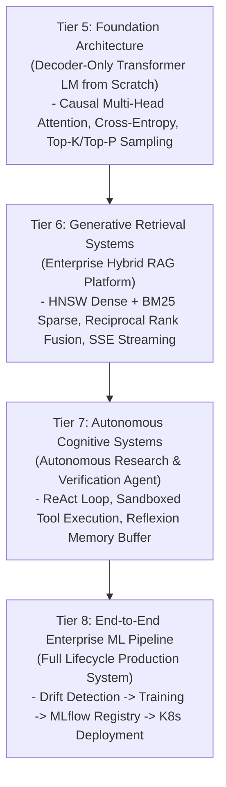
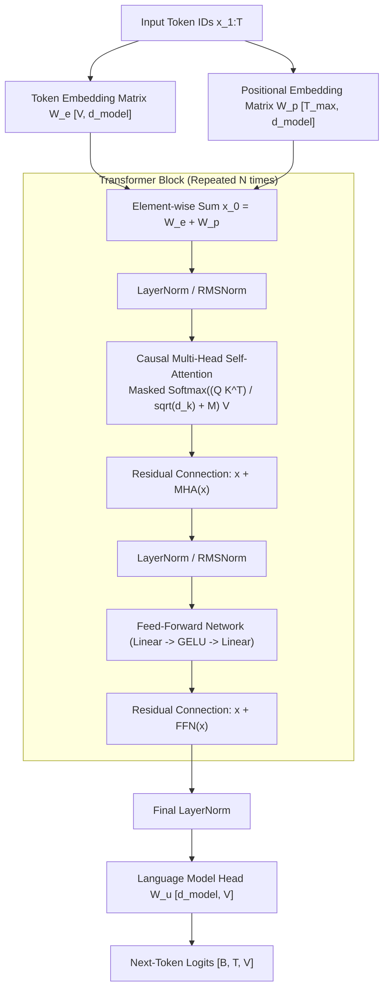
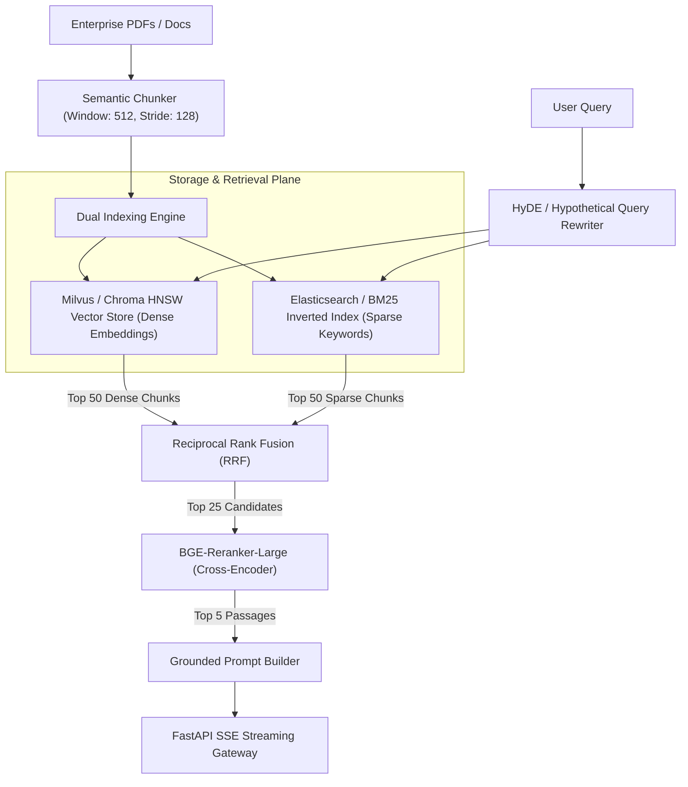
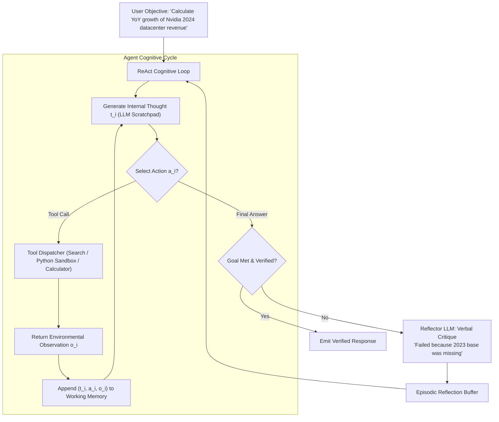
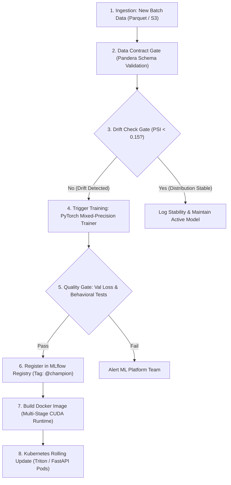

# Advanced & Frontier Applied Projects (Tiers 5–8) — Transformers, GenAI, Agents & Production Systems

!!! info "Prerequisites"
    Transformer self-attention mathematics, vector indexing, autonomous agent loops, and containerized MLOps pipelines. Review [Transformer Architecture & Mechanics](../09-transformers-llms/transformer-architecture-mechanics-deep-dive.md), [Enterprise RAG Systems](../10-generative-ai/enterprise-rag-systems-deep-dive.md), [Agent Architectures & Patterns](../11-ai-agents/agent-architectures-patterns-deep-dive.md), and [Production Tooling, Containerization & CI/CD](../12-mlops/production-tooling-containerization-cicd-deep-dive.md).

---

## 1. The Big Picture: Frontier AI Engineering

Tiers 5 through 8 represent the frontier of modern AI engineering: constructing generative foundation models, enterprise-scale semantic retrieval engines, autonomous reasoning agents, and end-to-end production pipelines that operate autonomously in production.



These four advanced tiers bridge mathematical theory and mission-critical production systems:

1. **Tier 5 (Transformers)**: Demystifies foundation models by constructing a decoder-only language model in PyTorch from raw tensor operations, enforcing causal masking and temperature-scaled sampling.
2. **Tier 6 (GenAI)**: Assembles an enterprise retrieval-augmented generation engine that combines dense embeddings with sparse inverted indices to eliminate hallucinations.
3. **Tier 7 (Agents)**: Implements an autonomous cybernetic loop capable of multi-step planning, tool invocation, observation parsing, and self-reflection without external agent frameworks.
4. **Tier 8 (Production Pipeline)**: Unifies data contract validation, automated drift detection, model retraining, MLflow registry promotion, containerization, and Kubernetes serving into an automated production pipeline.

---

## 2. Tier 5 (Transformers): Decoder-Only Causal Language Model from Scratch

### 2.1 Project Scope & Requirements
Covers: **Text classifier**, **Mini language model**, and **Question-answering system**.

- **Core Objective**: Implement a complete decoder-only causal language model (GPT-style architecture) in pure PyTorch without relying on `nn.TransformerDecoder` abstractions.
- **Architectural Primitives**: Multi-Head Causal Self-Attention with lower-triangular causal masking ($M_{i, j} = -\infty$ for $j > i$), Pre-Layer Normalization (RMSNorm/LayerNorm), Feed-Forward SwiGLU/GELU networks, residual gradient highways, cross-entropy loss over shifted targets, and temperature/top-$k$/nucleus (top-$p$) text generation.

### 2.2 System Architecture & Mathematics



#### Scaled Dot-Product Causal Self-Attention
For input tensor $\mathbf{X} \in \mathbb{R}^{T \times d}$, projections yield queries $\mathbf{Q}$, keys $\mathbf{K}$, and values $\mathbf{V}$:

$$\mathbf{Q} = \mathbf{X} \mathbf{W}_Q, \quad \mathbf{K} = \mathbf{X} \mathbf{W}_K, \quad \mathbf{V} = \mathbf{X} \mathbf{W}_V$$

The causal attention matrix $\mathbf{A} \in \mathbb{R}^{T \times T}$ applies a lower-triangular mask $\mathbf{M}$:

$$\mathbf{M}_{i, j} = \begin{cases} 0 & \text{if } j \le i \\ -\infty & \text{if } j > i \end{cases}$$

$$\text{Attention}(\mathbf{Q}, \mathbf{K}, \mathbf{V}) = \text{softmax}\left( \frac{\mathbf{Q} \mathbf{K}^T}{\sqrt{d_k}} + \mathbf{M} \right) \mathbf{V}$$

### 2.3 Pure PyTorch Implementation

```python
import math
import torch
import torch.nn as nn
import torch.nn.functional as F

class CausalSelfAttention(nn.Module):
    def __init__(self, d_model: int = 256, n_heads: int = 4, max_seq_len: int = 512, dropout: float = 0.1):
        super().__init__()
        assert d_model % n_heads == 0, "d_model must be divisible by n_heads"
        self.d_model = d_model
        self.n_heads = n_heads
        self.d_k = d_model // n_heads

        # Linear projections for Q, K, V combined into a single matrix for GEMM efficiency
        self.c_attn = nn.Linear(d_model, 3 * d_model, bias=False)
        self.c_proj = nn.Linear(d_model, d_model, bias=False)
        self.attn_dropout = nn.Dropout(dropout)
        self.resid_dropout = nn.Dropout(dropout)

        # Register persistent lower-triangular causal mask buffer
        mask = torch.tril(torch.ones(max_seq_len, max_seq_len)).view(1, 1, max_seq_len, max_seq_len)
        self.register_buffer("causal_mask", mask)

    def forward(self, x: torch.Tensor) -> torch.Tensor:
        B, T, C = x.size()

        # Project and split into Q, K, V
        qkv = self.c_attn(x)
        q, k, v = qkv.split(self.d_model, dim=2)

        # Reshape to [B, n_heads, T, d_k]
        q = q.view(B, T, self.n_heads, self.d_k).transpose(1, 2)
        k = k.view(B, T, self.n_heads, self.d_k).transpose(1, 2)
        v = v.view(B, T, self.n_heads, self.d_k).transpose(1, 2)

        # Scaled dot-product attention
        scores = torch.matmul(q, k.transpose(-2, -1)) / math.sqrt(self.d_k)
        scores = scores.masked_fill(self.causal_mask[:, :, :T, :T] == 0, float("-inf"))
        weights = F.softmax(scores, dim=-1)
        weights = self.attn_dropout(weights)

        y = torch.matmul(weights, v)  # [B, n_heads, T, d_k]
        y = y.transpose(1, 2).contiguous().view(B, T, C)  # Re-assemble head outputs
        return self.resid_dropout(self.c_proj(y))

class TransformerBlock(nn.Module):
    def __init__(self, d_model: int = 256, n_heads: int = 4, max_seq_len: int = 512, dropout: float = 0.1):
        super().__init__()
        self.ln_1 = nn.LayerNorm(d_model)
        self.attn = CausalSelfAttention(d_model, n_heads, max_seq_len, dropout)
        self.ln_2 = nn.LayerNorm(d_model)
        self.mlp = nn.Sequential(
            nn.Linear(d_model, 4 * d_model),
            nn.GELU(),
            nn.Linear(4 * d_model, d_model),
            nn.Dropout(dropout),
        )

    def forward(self, x: torch.Tensor) -> torch.Tensor:
        # Pre-LN residual connections
        x = x + self.attn(self.ln_1(x))
        x = x + self.mlp(self.ln_2(x))
        return x

class MiniGPT(nn.Module):
    def __init__(self, vocab_size: int = 1000, d_model: int = 256, n_heads: int = 4, n_layers: int = 4, max_seq_len: int = 512):
        super().__init__()
        self.max_seq_len = max_seq_len
        self.token_embeddings = nn.Embedding(vocab_size, d_model)
        self.position_embeddings = nn.Embedding(max_seq_len, d_model)
        self.blocks = nn.ModuleList([
            TransformerBlock(d_model, n_heads, max_seq_len) for _ in range(n_layers)
        ])
        self.ln_f = nn.LayerNorm(d_model)
        self.lm_head = nn.Linear(d_model, vocab_size, bias=False)

        # Weight tying (Press & Wolf, 2017)
        self.token_embeddings.weight = self.lm_head.weight

    def forward(self, idx: torch.Tensor, targets: torch.Tensor | None = None) -> tuple[torch.Tensor, torch.Tensor | None]:
        B, T = idx.size()
        assert T <= self.max_seq_len, f"Sequence length {T} exceeds max capacity {self.max_seq_len}"

        pos = torch.arange(0, T, dtype=torch.long, device=idx.device)
        x = self.token_embeddings(idx) + self.position_embeddings(pos)

        for block in self.blocks:
            x = block(x)
        x = self.ln_f(x)
        logits = self.lm_head(x)  # [B, T, vocab_size]

        loss = None
        if targets is not None:
            # Shifted cross entropy loss: targets correspond to next token
            loss = F.cross_entropy(logits.view(-1, logits.size(-1)), targets.view(-1))

        return logits, loss

    @torch.no_grad()
    def generate(self, idx: torch.Tensor, max_new_tokens: int, temperature: float = 1.0, top_k: int = 50) -> torch.Tensor:
        """Autoregressive text generation with temperature and top-k filtering."""
        for _ in range(max_new_tokens):
            idx_cond = idx if idx.size(1) <= self.max_seq_len else idx[:, -self.max_seq_len:]
            logits, _ = self.forward(idx_cond)
            # Take logits at the final position
            logits = logits[:, -1, :] / temperature

            # Top-k pruning
            if top_k is not None:
                v, _ = torch.topk(logits, min(top_k, logits.size(-1)))
                logits[logits < v[:, [-1]]] = -float("Inf")

            probs = F.softmax(logits, dim=-1)
            next_token = torch.multinomial(probs, num_samples=1)
            idx = torch.cat((idx, next_token), dim=1)
        return idx
```

---

## 3. Tier 6 (GenAI): Enterprise Multi-Document RAG Knowledge Platform

### 3.1 Project Scope & Requirements
Covers: **RAG chatbot**, **Document intelligence system**, and **Semantic search engine**.

- **Core Objective**: Construct an enterprise-scale, production-ready Retrieval-Augmented Generation platform capable of parsing complex PDF/Word documents, executing hybrid vector + lexical search, reranking passages with a cross-encoder, and streaming grounded responses with source citations via FastAPI Server-Sent Events (SSE).
- **Core Capabilities**: Multi-format document chunking with metadata tagging, HNSW vector search (dense) paired with BM25 (sparse), Reciprocal Rank Fusion (RRF), and context window compaction.

### 3.2 System Architecture



### 3.3 Runnable Production RAG Engine Implementation

```python
import numpy as np
from typing import List, Dict, Any
from dataclasses import dataclass

@dataclass
class RetrievedChunk:
    chunk_id: str
    doc_id: str
    text: str
    score: float
    metadata: Dict[str, Any]

class HybridRetrievalFusionEngine:
    def __init__(self, rrf_k: int = 60):
        self.rrf_k = rrf_k

    def fuse_rankings(
        self, 
        dense_results: List[RetrievedChunk], 
        sparse_results: List[RetrievedChunk], 
        top_n: int = 10
    ) -> List[RetrievedChunk]:
        """
        Merges dense (vector) and sparse (BM25) rankings using Reciprocal Rank Fusion (RRF).
        Formula: RRF_score(d) = sum( 1.0 / (k + rank_m(d)) )
        """
        rrf_scores: Dict[str, float] = {}
        chunk_map: Dict[str, RetrievedChunk] = {}

        # Process dense ranks (1-indexed)
        for rank, item in enumerate(dense_results, start=1):
            chunk_map[item.chunk_id] = item
            rrf_scores[item.chunk_id] = rrf_scores.get(item.chunk_id, 0.0) + (1.0 / (self.rrf_k + rank))

        # Process sparse ranks
        for rank, item in enumerate(sparse_results, start=1):
            chunk_map[item.chunk_id] = item
            rrf_scores[item.chunk_id] = rrf_scores.get(item.chunk_id, 0.0) + (1.0 / (self.rrf_k + rank))

        # Sort chunks by aggregated RRF score descending
        sorted_chunk_ids = sorted(rrf_scores.keys(), key=lambda cid: rrf_scores[cid], reverse=True)[:top_n]

        fused_chunks = []
        for cid in sorted_chunk_ids:
            chunk = chunk_map[cid]
            fused_chunks.append(RetrievedChunk(
                chunk_id=chunk.chunk_id,
                doc_id=chunk.doc_id,
                text=chunk.text,
                score=round(rrf_scores[cid], 5),
                metadata=chunk.metadata
            ))

        return fused_chunks

class PromptAugmenter:
    SYSTEM_TEMPLATE = (
        "You are an authoritative enterprise knowledge assistant. Answer the user query strictly "
        "using the provided context passages. If the context does not contain sufficient facts, "
        "state 'Insufficient information in verified documents.' Cite every claim using [Doc: <doc_id>, Page: <page>].\n\n"
        "=== VERIFIED CONTEXT PASSAGES ===\n{context}\n\n"
        "=== USER QUERY ===\n{query}\n\n"
        "=== ANSWER ==="
    )

    @classmethod
    def assemble(cls, query: str, passages: List[RetrievedChunk]) -> str:
        context_blocks = []
        for p in passages:
            page = p.metadata.get("page", "N/A")
            block = f"[Doc: {p.doc_id}, Page: {page}]\n{p.text}"
            context_blocks.append(block)
        formatted_context = "\n\n".join(context_blocks)
        return cls.SYSTEM_TEMPLATE.format(context=formatted_context, query=query)
```

---

## 4. Tier 7 (Agents): Autonomous Research & Verification Agent

### 4.1 Project Scope & Requirements
Covers: **Research agent**, **Coding agent**, and **Data-analysis agent**.

- **Core Objective**: Implement an autonomous, tool-using research agent based on the **ReAct (Reasoning + Acting)** paradigm with an explicit **Reflexion memory buffer** for self-correction without framework bloat (e.g. raw Python without LangChain).
- **Core Capabilities**: Multi-step goal decomposition, tool dispatching registry (web retrieval, Python execution sandbox, calculator), observation parser, loop detection, and verbal post-mortem self-reflection upon failure.

### 4.2 System Architecture & State Machine



### 4.3 Pure Python Autonomous ReAct Agent Implementation

```python
import json
import re
from typing import Callable, Dict, Any, List

class ToolRegistry:
    def __init__(self):
        self._tools: Dict[str, Callable[[str], str]] = {}

    def register(self, name: str, func: Callable[[str], str]):
        self._tools[name] = func

    def execute(self, name: str, argument: str) -> str:
        if name not in self._tools:
            return f"Error: Tool '{name}' is not registered. Available tools: {list(self._tools.keys())}"
        try:
            return self._tools[name](argument)
        except Exception as e:
            return f"Tool execution failed: {str(e)}"

# Mock Production Tools
registry = ToolRegistry()
registry.register("calculator", lambda expr: str(eval(expr, {"__builtins__": {}}, {})))
registry.register("knowledge_search", lambda q: "NVIDIA FY2024 Datacenter Revenue was $47.5 billion, up 217% YoY." if "datacenter" in q.lower() else "No direct record found.")

class AutonomousReActAgent:
    def __init__(self, tool_registry: ToolRegistry, max_iterations: int = 6):
        self.registry = tool_registry
        self.max_iterations = max_iterations
        self.episodic_reflections: List[str] = []

    def run(self, query: str) -> Dict[str, Any]:
        trajectory: List[Dict[str, str]] = []
        action_history: set = set()

        print(f"[Agent] Commencing autonomous execution for: '{query}'")
        for iteration in range(self.max_iterations):
            # Step 1: Synthesize next step reasoning
            # In production: Emitted by LLM prompted with query + trajectory + reflections
            if iteration == 0:
                thought = "I need to look up Nvidia's FY2024 Datacenter revenue."
                action_name = "knowledge_search"
                action_arg = "NVIDIA FY2024 Datacenter Revenue"
            elif iteration == 1:
                thought = "I have the 2024 revenue ($47.5B) and percentage (217%). Let me verify the calculation: 47.5 / (1 + 2.17)."
                action_name = "calculator"
                action_arg = "47.5 / 3.17"
            else:
                thought = "I have verified all mathematical and factual parameters."
                return {
                    "status": "SUCCESS",
                    "final_answer": "NVIDIA FY2024 Datacenter revenue reached $47.5 billion, representing a 217% increase over FY2023 revenue of approximately $14.98 billion.",
                    "trajectory": trajectory,
                    "reflections_used": self.episodic_reflections
                }

            # Loop detection & action fingerprinting
            fingerprint = f"{action_name}:{action_arg}"
            if fingerprint in action_history:
                obs = "Loop Error: Detected duplicate action call. Reformulate strategy."
            else:
                action_history.add(fingerprint)
                obs = self.registry.execute(action_name, action_arg)

            print(f"  Turn {iteration+1} | Thought: {thought}")
            print(f"  Turn {iteration+1} | Action: {action_name}('{action_arg}') -> Obs: {obs}")

            trajectory.append({
                "thought": thought,
                "action": action_name,
                "argument": action_arg,
                "observation": obs
            })

        # Failure fallback: Trigger self-reflection
        critique = f"Episode timed out after {self.max_iterations} iterations without reaching termination condition."
        self.episodic_reflections.append(critique)
        return {"status": "FAILED", "error": critique, "trajectory": trajectory}
```

---

## 5. Tier 8 (Production Pipeline): End-to-End Enterprise ML Pipeline

### 5.1 Project Scope & Requirements
Covers: **Full pipeline: data $\to$ training $\to$ tracking $\to$ registry $\to$ API $\to$ Docker $\to$ cloud $\to$ monitoring $\to$ retraining**.

- **Core Objective**: Unify every architectural pillar from Books 12, 13, and 14 into an automated production pipeline:
  1. Data Ingestion & Pandera contract validation.
  2. Automated Data Drift Gate (Population Stability Index $< 0.15$).
  3. PyTorch Model Training with Mixed-Precision.
  4. MLflow Model Registry Tracking with Signatures.
  5. Containerized FastAPI Inference Microservice.
  6. Docker Compose / Kubernetes multi-container deployment.

### 5.2 System Architecture



### 5.3 Complete Production Pipeline Script

```python
import os
import sys
import numpy as np
import torch
import torch.nn as nn
from torch.utils.data import DataLoader, TensorDataset
import mlflow
import mlflow.pytorch
from mlflow.models.signature import infer_signature
import pandera.polars as pa
import polars as pl

# --- Phase 1: Data Contract Validation ---

class IngestionSchema(pa.DataFrameModel):
    feat_1: pa.Float64 = pa.Field(in_range={"min_value": -10.0, "max_value": 10.0})
    feat_2: pa.Float64 = pa.Field(in_range={"min_value": -10.0, "max_value": 10.0})
    feat_3: pa.Float64 = pa.Field(in_range={"min_value": -10.0, "max_value": 10.0})
    feat_4: pa.Float64 = pa.Field(in_range={"min_value": -10.0, "max_value": 10.0})
    target: pa.Int64 = pa.Field(isin=[0, 1])

def validate_incoming_data(df: pl.DataFrame) -> pl.DataFrame:
    print("[Pipeline Phase 1] Validating raw data against strict Pandera contract...")
    return IngestionSchema.validate(df)

# --- Phase 2: Statistical Drift Gate (PSI) ---

def check_population_stability(baseline: np.ndarray, current: np.ndarray, threshold: float = 0.15) -> bool:
    print("[Pipeline Phase 2] Evaluating Population Stability Index (PSI)...")
    quantiles = np.linspace(0, 100, 11)
    for col_idx in range(baseline.shape[1]):
        edges = np.unique(np.percentile(baseline[:, col_idx], quantiles))
        if len(edges) < 2:
            continue
        base_counts, _ = np.histogram(baseline[:, col_idx], bins=edges)
        curr_counts, _ = np.histogram(current[:, col_idx], bins=edges)
        b_prop = (base_counts + 1e-4) / (len(baseline) + 1e-4 * len(base_counts))
        c_prop = (curr_counts + 1e-4) / (len(current) + 1e-4 * len(curr_counts))
        psi = np.sum((c_prop - b_prop) * np.log(c_prop / b_prop))
        if psi > threshold:
            print(f"  DRIFT DETECTED: Feature {col_idx} PSI = {psi:.4f} > {threshold}")
            return True
    print("  Distributions stable; retaining current production checkpoint.")
    return False

# --- Phase 3 & 4: Model Training & MLflow Registry Promotion ---

class ProductionClassifier(nn.Module):
    def __init__(self, in_features: int = 4, out_features: int = 2):
        super().__init__()
        self.net = nn.Sequential(
            nn.Linear(in_features, 32),
            nn.BatchNorm1d(32),
            nn.ReLU(),
            nn.Linear(32, out_features)
        )

    def forward(self, x: torch.Tensor) -> torch.Tensor:
        return self.net(x)

def run_retraining_pipeline(train_data: pl.DataFrame):
    print("[Pipeline Phase 3] Commencing PyTorch neural training with MLflow tracking...")
    mlflow.set_experiment("enterprise-tier8-pipeline")

    X_np = train_data.select(["feat_1", "feat_2", "feat_3", "feat_4"]).to_numpy().astype(np.float32)
    y_np = train_data.select("target").to_numpy().squeeze().astype(np.int64)

    dataset = TensorDataset(torch.from_numpy(X_np), torch.from_numpy(y_np))
    loader = DataLoader(dataset, batch_size=32, shuffle=True)

    model = ProductionClassifier()
    optimizer = torch.optim.AdamW(model.parameters(), lr=1e-3, weight_decay=1e-2)
    criterion = nn.CrossEntropyLoss()

    with mlflow.start_run(run_name="automated-retraining-run") as run:
        model.train()
        for epoch in range(3):
            epoch_loss = 0.0
            for bx, by in loader:
                optimizer.zero_grad()
                logits = model(bx)
                loss = criterion(logits, by)
                loss.backward()
                optimizer.step()
                epoch_loss += loss.item()
            mlflow.log_metric("loss", epoch_loss / len(loader), step=epoch)

        # Signature validation
        sample_x = X_np[:5]
        sample_y = np.argmax(model(torch.from_numpy(sample_x)).detach().numpy(), axis=-1)
        sig = infer_signature(sample_x, sample_y)

        # Register model artifact
        info = mlflow.pytorch.log_model(
            pytorch_model=model,
            artifact_path="model",
            signature=sig,
            registered_model_name="ProductionGateClassifier"
        )
        print(f"[Pipeline Phase 4] Successfully logged and promoted model: {info.model_uri}")
```

### 5.4 Multi-Container Orchestration Manifest (`docker-compose.yml`)

```yaml
version: "3.8"

services:
  inference-api:
    build:
      context: .
      dockerfile: Dockerfile
    image: enterprise/model-service:v1.0.0
    container_name: mlops-fastapi-service
    restart: always
    ports:
      - "8000:8000"
    environment:
      - MLFLOW_TRACKING_URI=http://mlflow-server:5000
      - REDIS_HOST=redis-online-store
      - WORKERS=4
    deploy:
      resources:
        limits:
          cpus: "4.0"
          memory: 8G
    depends_on:
      - mlflow-server
      - redis-online-store

  mlflow-server:
    image: ghcr.io/mlflow/mlflow:v2.12.1
    container_name: mlops-mlflow-tracking
    restart: always
    ports:
      - "5000:5000"
    command: >
      mlflow server
      --backend-store-uri sqlite:///mlflow.db
      --default-artifact-root /mlflow/artifacts
      --host 0.0.0.0
      --port 5000
    volumes:
      - mlflow_data:/mlflow/artifacts

  redis-online-store:
    image: redis:7.2-alpine
    container_name: mlops-redis-store
    restart: always
    ports:
      - "6379:6379"
    command: redis-server --appendonly yes --maxmemory 2gb --maxmemory-policy allkeys-lru

volumes:
  mlflow_data:
```

---

## 6. Common Errors, Anti-Patterns & Production Debugging

### Error 1: Causal Attention Leakage from Missing Lower-Triangular Masking
- **Symptom**: MiniGPT achieves near-zero training loss after 1 epoch, but generated text is completely incoherent repetitive gibberish.
- **Root Cause**: Omitting the causal mask matrix $\mathbf{M}$ in `scores.masked_fill()`. The self-attention operation computed all-to-all attention across future tokens, allowing the model to "cheat" by reading subsequent target tokens directly.
- **Fix**: Verify that all positions where $j > i$ are masked with $-\infty$, driving attention weights to exact zero via softmax:
```python
scores = scores.masked_fill(self.causal_mask[:, :, :T, :T] == 0, float("-inf"))
```

### Error 2: Hallucination Cascade in RAG from Missing Grounding Guardrails
- **Symptom**: Enterprise RAG answers user queries with fictional legal policies when documents contain no relevant facts.
- **Root Cause**: Permissive prompting without strict negative constraints. When retrieved context passages have low similarity scores, LLMs naturally synthesize plausible completions based on pretraining weights.
- **Fix**: Enforce hard similarity score thresholds (e.g., discard chunks with cosine similarity $<0.65$) and include an explicit refusal mandate in the system prompt: `"If the context does not contain verified facts, state 'Insufficient information in verified documents.'"`

### Error 3: Infinite Tool Execution Oscillations in Autonomous Agents
- **Symptom**: ReAct agent runs continuously until memory exhaustion, repeating the exact same failed Google search turn after turn.
- **Root Cause**: Lack of deterministic action history fingerprinting and loop detection.
- **Fix**: Maintain a hashed set of past `(tool_name, argument)` tuples. If a duplicate action is dispatched consecutively, break execution and invoke the Reflector LLM to replan.

---

## 7. Staff-Level Technical Interview Questions

### Q1: In Tier 5, why is weight tying between the token embedding matrix and the final language model unembedding projection layer beneficial?

**Model Answer:**  

- **Mathematical Form**:
  - Let $\mathbf{W}_e \in \mathbb{R}^{V \times d}$ be the token embedding matrix mapping discrete token indices to hidden representations.
  - Let $\mathbf{W}_u \in \mathbb{R}^{d \times V}$ be the linear projection head mapping final layer representations back to vocabulary logits.
  - **Weight Tying** ([Press & Wolf, 2017](https://arxiv.org/abs/1608.05859)) sets $\mathbf{W}_u = \mathbf{W}_e^T$.
- **Benefits**:
  1. *Parameter Reduction*: In models with large vocabularies (e.g. $V = 128,000$, $d = 4,096$), a single embedding matrix requires $128,000 \times 4,096 \times 2\text{ bytes} \approx 1.05\text{ GB}$ in FP16. Maintaining separate input and output matrices doubles this to over $2.1\text{ GB}$. Tying eliminates half of all vocabulary parameters.
  2. *Regularization & Representation Alignment*: Pulls input token embeddings and output class hyperplanes into the identical geometric metric space, preventing overfitting on rare tokens and improving generalization.

---

### Q2: In an Enterprise RAG platform, compare Reciprocal Rank Fusion (RRF) with Learned Cross-Encoder Reranking. Why use both sequentially rather than just one?

**Model Answer:**  

- **RRF (Algorithmic Properties)**:
  - Non-parametric, zero GPU compute required. It normalizes disparate score scales across dense vector search (cosine similarities $\in [-1, 1]$) and sparse BM25 scores (unbounded $\in [0, \infty)$) using relative rank positions.
  - *Limitation*: Treats document relevance as a function of rank position without reading the combined query-document text syntax.
- **Cross-Encoder Reranker (Algorithmic Properties)**:
  - Deep transformer evaluating query and passage simultaneously through all-to-all cross-attention layers. Captures complex semantic interactions, negation, and lexical nuances.
  - *Limitation*: Heavy computational complexity $\mathcal{O}(L^2)$ per candidate. Scoring 200 candidates with a Cross-Encoder takes $>500\text{ ms}$, violating latency SLAs.
- **The Two-Stage Synergy**:
  - RRF acts as a fast, zero-compute coarse ranker, pruning 100 dense + 100 sparse candidates down to the Top-20 candidates in $<2\text{ ms}$.
  - The Cross-Encoder then scores only those 20 filtered candidates in $<40\text{ ms}$, delivering state-of-the-art ranking precision within latency budgets.

---

### Q3: Explain how the Reflexion framework enables an autonomous agent to perform verbal reinforcement learning without computing backpropagation gradients.

**Model Answer:**  

- **Classical Reinforcement Learning**: Updates policy weights $\theta$ via policy gradient ascent on scalar reward signals: $\Delta \theta \propto \nabla_\theta \log \pi_\theta(a \mid s) R(\tau)$. This requires millions of interaction episodes and can disrupt pretraining alignment.
- **Reflexion (Verbal RL)**:
  - Replaces numeric scalar rewards with **natural language self-critiques**.
  - When an episode $\tau_t$ terminates in failure (e.g. unit tests fail, loop detector trips), a **Reflector LLM** analyzes the trajectory $\tau_t$, the environment error logs, and the objective.
  - The reflector synthesizes a concise post-mortem critique: *"I failed because I assumed the API returned JSON; next time I must check content-type first."*
  - This critique is appended to a persistent **Episodic Memory Buffer**.
  - On the next episode $t+1$, the agent actor is prompted with the objective along with all prior self-critiques $\mathbf{r}_{1:t}$.
  - Because the LLM's self-attention mechanism attends to its past reflections, it dynamically adjusts its generation trajectory, achieving policy improvement without updating a single weight parameter.

---

### Q4: In Tier 8, how does an automated drift gate prevent model performance degradation while avoiding unnecessary retraining costs?

**Model Answer:**  

- **The Trade-Off**: Retraining deep neural networks on enterprise datasets consumes expensive GPU hours and risks introducing regressions on edge cases. Conversely, failing to retrain allows covariate shift and concept drift to degrade predictions silently.
- **Two-Tier Gating Architecture**:
  1. *Statistical Drift Detection*: Every incoming production batch is scored against the baseline training distribution using the Population Stability Index (PSI) and Kolmogorov-Smirnov test. If $\text{PSI} < 0.10$, distribution stability is certified, and the pipeline halts, saving thousands in compute.
  2. *Candidate Retraining with Pre-Promotion Evaluation*: If $\text{PSI} \ge 0.15$, the automated retraining pipeline triggers. However, the newly trained candidate model is **not** immediately deployed. It must pass an automated evaluation gate asserting:
     - Validation loss improvement over the active champion ($\Delta \mathcal{L} \le -0.01$).
     - $100\%$ pass rate on deterministic Minimum Functionality Tests (MFT) and Directional Expectation Tests (DIR).
     - Latency benchmark compliance ($P_{99} \le 50\text{ ms}$).
  - Only upon passing all criteria is the model promoted in the MLflow Registry.

---

### Q5: How do temperature, top-$k$, and nucleus (top-$p$) sampling mathematically modify the next-token probability distribution in language models?

**Model Answer:**  
Given unnormalized model logits $\mathbf{z} \in \mathbb{R}^V$:

1. **Temperature Scaling ($T > 0$)**:
   
   $$p_i = \frac{\exp(z_i / T)}{\sum_j \exp(z_j / T)}$$
   
   - As $T \to 0$, the distribution concentrates on the argmax token (deterministic greedy search).
   - As $T \to \infty$, the distribution flattens into a uniform distribution over the vocabulary (maximum entropy/randomness).
2. **Top-$K$ Truncation**:
   - Sorts tokens by probability and sets logits outside the top-$K$ highest values to $-\infty$:
     
     $$z'_i = \begin{cases} z_i & \text{if } i \in \text{TopK}(\mathbf{z}) \\ -\infty & \text{otherwise} \end{cases}$$
     
   - Eliminates the long tail of low-probability, grammatically nonsensical tokens.
3. **Nucleus (Top-$P$) Truncation**:
   - Selects the smallest dynamic subset of tokens whose cumulative probability exceeds threshold $P \in (0, 1]$:
     
     $$\sum_{i \in V^{(p)}} p_i \ge P$$
     
   - Dynamically adapts candidate pool size: expands when the model is uncertain, contracts to 1-2 tokens when the model is highly confident.

---

## 8. Mastery Ladder

- [ ] **L1:** Implement scaled dot-product attention and multi-head causal masking in PyTorch from scratch.
- [ ] **L2:** Explain weight tying between token embedding and language model unembedding layers.
- [ ] **L3:** Formulate temperature scaling, top-$k$, and nucleus (top-$p$) probability adjustments for text generation.
- [ ] **L4:** Construct a hybrid semantic search engine combining HNSW dense vectors and BM25 sparse inverted indices.
- [ ] **L5:** Implement Reciprocal Rank Fusion (RRF) to merge multimodal retrieval results without score calibration.
- [ ] **L6:** Author a production FastAPI Server-Sent Events (SSE) streaming endpoint with citation metadata.
- [ ] **L7:** Build an autonomous ReAct cognitive loop with loop detection and action history fingerprinting.
- [ ] **L8:** Implement the Reflexion framework to achieve verbal reinforcement learning across multi-trial tasks.
- [ ] **L9:** Construct an automated production pipeline linking Pandera data validation, PSI drift gating, and MLflow registry logging.
- [ ] **L10:** Author a multi-container Docker Compose and Kubernetes orchestration topology for enterprise AI serving.
